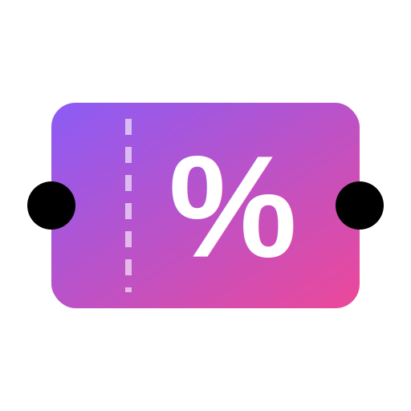

# VoucherTracker - Complete Codebase
*Generated: 2025-12-31 16:23*
---

# Core

## src/App.jsx

```jsx
import { useState, useMemo, useEffect, lazy, Suspense } from 'react';
import { HashRouter as Router, Routes, Route, useSearchParams } from 'react-router-dom';
import { ThemeProvider } from './context/ThemeContext';
import { FavoritesProvider } from './context/FavoritesContext';
import { MyCardsProvider } from './context/MyCardsContext';
import { ToastProvider } from './components/UXPolish';
import { useDebounce } from './hooks/useDebounce';
import { useFuzzySearch } from './hooks/useFuzzySearch';
import { useDiscountParser } from './hooks/useDiscountParser';
import Layout from './components/Layout';
import SearchBar from './components/SearchBar';
import CategoryFilter from './components/CategoryFilter';
import VoucherGrid from './components/VoucherGrid';
import VoucherModal from './components/VoucherModal';
import PlatformFilter from './components/PlatformFilter';
import MobileStickyFilterBar from './components/MobileStickyFilterBar';
import TopDeals from './components/TopDeals';
import StatsBar from './components/StatsBar';
import LoadingSpinner from './components/LoadingSpinner';
import { featureFlags } from './config/featureFlags';
import { vouchers as RAW_DATA } from './data/vouchers';
import { sortPlatforms } from './utils/sortUtils';
import { seedSampleData, hasSampleData } from './utils/seedData';

// Lazy load route components for code splitting
const VoucherDetail = lazy(() => import('./components/VoucherDetail'));
const Guides = lazy(() => import('./components/Guides'));
const CreditCardComparison = lazy(() => import('./components/CreditCardComparison'));
const CardGuide = lazy(() => import('./components/CardGuide'));
const RewardsCalculator = lazy(() => import('./components/RewardsCalculator'));
const PointsConverter = lazy(() => import('./components/PointsConverter'));
const BankingGuides = lazy(() => import('./components/BankingGuides'));
const AskAI = lazy(() => import('./components/AskAI'));
const Favorites = lazy(() => import('./components/Favorites'));

// New UX Features
const SpendOptimizer = lazy(() => import('./components/SpendOptimizer'));
const MilestoneTracker = lazy(() => import('./components/MilestoneTracker'));
const SavingsDashboard = lazy(() => import('./components/SavingsDashboard'));
const MyCards = lazy(() => import('./components/MyCards'));

// Global floating components (non-lazy for immediate availability)
import QuickCardPicker from './components/QuickCardPicker';
import OnboardingTour from './components/OnboardingTour';

// Apply global platform sorting
const INITIAL_DATA = RAW_DATA.map(voucher => ({
  ...voucher,
  platforms: sortPlatforms(voucher.platforms)
}));

// Extract unique platforms and categories from data
const ALL_PLATFORMS = [...new Set(INITIAL_DATA.flatMap(v => v.platforms.map(p => p.name)))];
const ALL_CATEGORIES = [...new Set(INITIAL_DATA.map(v => v.category))].sort();

function Home({ onOpenShortcuts }) {
  const [searchParams, setSearchParams] = useSearchParams();

  // State variables for filters, initialized from URL search params
  const [searchTerm, setSearchTerm] = useState(searchParams.get('search') || '');
  const [selectedPlatform, setSelectedPlatform] = useState(searchParams.get('platform') || null);
  const [selectedCategory, setSelectedCategory] = useState(searchParams.get('category') || null);
  const [selectedVoucher, setSelectedVoucher] = useState(null); // Local state fallback, but we primarily use URL now
  const [activeMobileFilter, setActiveMobileFilter] = useState('none'); // 'none', 'platform', 'category'

  const [sortOption, setSortOption] = useState('Recommended');

  // Local state for input value with custom debounce hook
  const [inputValue, setInputValue] = useState(searchTerm);
  const debouncedSearchValue = useDebounce(inputValue, 300);

  // Helper to update URL params and local state
  const updateParams = (key, value, setStateFn) => {
    setSearchParams(prev => {
      const newParams = new URLSearchParams(prev);
      if (value) {
        newParams.set(key, value);
      } else {
        newParams.delete(key);
      }
      return newParams;
    }, { replace: true });
    if (setStateFn) setStateFn(value);
  };

  // Update searchTerm when debounced value changes
  useEffect(() => {
    if (debouncedSearchValue !== searchTerm) {
      updateParams('search', debouncedSearchValue, setSearchTerm);
    }
  }, [debouncedSearchValue]);

  const handleSearchChange = (val) => setInputValue(val);
  const handlePlatformSelect = (p) => updateParams('platform', p, setSelectedPlatform);
  const handleCategorySelect = (c) => updateParams('category', c, setSelectedCategory);

  // Handle Voucher selection (updates URL)
  const handleVoucherSelect = (voucher) => {
    if (voucher) {
      updateParams('voucher', voucher.id);
    } else {
      updateParams('voucher', null);
    }
  };


  // Use custom fuzzy search hook
  const searchResults = useFuzzySearch(INITIAL_DATA, searchTerm, {
    keys: ['brand', 'category'],
    threshold: 0.3
  });

  // Use discount parser hook for sorting
  const { getMaxDiscount } = useDiscountParser();

  const filteredVouchers = useMemo(() => {
    let result = searchTerm ? searchResults : [...INITIAL_DATA];

    if (selectedPlatform) {
      result = result.filter(voucher =>
        voucher.platforms.some(p => p.name === selectedPlatform)
      );
    }

    if (selectedCategory) {
      result = result.filter(voucher => voucher.category === selectedCategory);
    }

    // Sorting Logic
    if (sortOption === 'Alphabetical') {
      result.sort((a, b) => a.brand.localeCompare(b.brand));
    } else if (sortOption === 'Discount') {
      result.sort((a, b) => {
        return getMaxDiscount(b.platforms) - getMaxDiscount(a.platforms);
      });
    }

    return result;
  }, [searchResults, selectedPlatform, selectedCategory, sortOption, searchTerm, getMaxDiscount]);


  // Sync URL to State (Deep linking / External navigation)
  useEffect(() => {
    const currentPlatform = searchParams.get('platform');
    const currentCategory = searchParams.get('category');
    const currentSearch = searchParams.get('search');
    const currentVoucherId = searchParams.get('voucher');

    if (currentPlatform !== selectedPlatform) {
      setSelectedPlatform(currentPlatform || null);
    }
    if (currentCategory !== selectedCategory) {
      setSelectedCategory(currentCategory || null);
    }
    // Sync from URL to State
    // We treat null (missing param) as empty string to ensure input clears if param is removed
    const targetSearch = currentSearch || '';
    if (targetSearch !== searchTerm) {
      setSearchTerm(targetSearch);
      setInputValue(targetSearch); // Also sync the input value
    }

    // Sync Voucher Modal
    if (currentVoucherId) {
      const voucher = INITIAL_DATA.find(v => v.id === currentVoucherId);
      if (voucher) {
        setSelectedVoucher(voucher);
      } else {
        setSelectedVoucher(null);
      }
    } else {
      setSelectedVoucher(null);
    }

  }, [searchParams, selectedPlatform, selectedCategory, searchTerm]);
  return (
    <div className="home-container">
      {/* Mobile Filter Toggle Removed */}

      {/* Backdrop for mobile filters */}
      <div
        className={`mobile-filter-overlay ${activeMobileFilter !== 'none' ? 'active' : ''}`}
        onClick={() => setActiveMobileFilter('none')}
      />

      {/* Sidebar */}
      <aside data-tour="filters" className={`glass-panel sidebar 
        ${activeMobileFilter !== 'none' ? 'mobile-visible' : ''} 
        ${activeMobileFilter === 'platform' ? 'show-platform' : ''} 
        ${activeMobileFilter === 'category' ? 'show-category' : ''}
      `}>
        {/* Close handle/indicator for mobile */}
        <div style={{
          width: '40px',
          height: '4px',
          background: 'var(--glass-border)',
          borderRadius: '2px',
          margin: '8px auto',
          display: activeMobileFilter !== 'none' ? 'block' : 'none'
        }} onClick={() => setActiveMobileFilter('none')} />

        <div className="sidebar-content-wrapper">
          <div className="platform-section">
            <h3 style={{ margin: '0 0 1rem 0', fontSize: '0.9rem', textTransform: 'uppercase', letterSpacing: '1px', color: 'var(--nav-text)' }}>
              Filter By Platform
            </h3>
            <PlatformFilter
              selectedPlatform={selectedPlatform}
              onPlatformSelect={(p) => {
                // Toggle behavior: if clicking selected, unselect it
                handlePlatformSelect(p === selectedPlatform ? null : p);
              }}
              platforms={ALL_PLATFORMS}
            />
          </div>

          <div className="sidebar-divider" /> {/* Added divider */}

          <div className="category-section" style={{
            display: 'flex',
            flexDirection: 'column',
            minHeight: 0, // Critical for flex scrolling
            flex: 1
          }}>
            <h3 style={{ margin: '0 0 1rem 0', fontSize: '0.9rem', textTransform: 'uppercase', letterSpacing: '1px', color: 'var(--nav-text)' }}>
              Filter By Category
            </h3>
            <div style={{
              display: 'flex',
              flexDirection: 'column',
              flex: 1,
              minHeight: 0,
              overflow: 'hidden'
            }}>
              <CategoryFilter
                selectedCategory={selectedCategory}
                onCategorySelect={(c) => {
                  // Toggle behavior
                  handleCategorySelect(c === selectedCategory ? null : c);
                }}
                categories={ALL_CATEGORIES}
              />
            </div>
          </div>
        </div>
      </aside>

      {/* Mobile Sticky Bar */}
      <MobileStickyFilterBar
        activeFilter={activeMobileFilter}
        onSortClick={() => setActiveMobileFilter(prev => prev === 'platform' ? 'none' : 'platform')}
        onFilterClick={() => setActiveMobileFilter(prev => prev === 'category' ? 'none' : 'category')}
      />


      {/* Main Content */}
      <main>
        {/* Show Top Deals and Stats only when no filters active */}
        {!searchTerm && !selectedPlatform && !selectedCategory && (
          <>
            <StatsBar vouchers={INITIAL_DATA} platforms={ALL_PLATFORMS} />
            <TopDeals vouchers={INITIAL_DATA} onVoucherClick={handleVoucherSelect} />
          </>
        )}

        <SearchBar
          value={inputValue}
          onChange={handleSearchChange}
          sortOption={sortOption}
          onSortChange={setSortOption}
          onOpenShortcuts={onOpenShortcuts}
        />

        <VoucherGrid
          vouchers={filteredVouchers}
          onVoucherClick={handleVoucherSelect}
        />
      </main>

      {selectedVoucher && (
        <VoucherModal
          voucher={selectedVoucher}
          selectedPlatform={selectedPlatform} // Pass selected platform context
          onClose={() => handleVoucherSelect(null)}
        />
      )}
    </div>
  );
}


function App() {
  const [selectedCards, setSelectedCards] = useState([]);
  const [isShortcutsOpen, setIsShortcutsOpen] = useState(false);

  // Seed sample data on first run (for demo purposes)
  useEffect(() => {
    if (!hasSampleData()) {
      seedSampleData();
    }
  }, []);

  // Toggle card selection
  const toggleCardSelection = (cardId) => {
    // Convert to number for consistent comparison (card.id in data is a number)
    const numericId = typeof cardId === 'string' ? parseInt(cardId, 10) : cardId;

    setSelectedCards(prevCards => {
      if (prevCards.includes(numericId)) {
        return prevCards.filter(id => id !== numericId);
      } else {
        if (prevCards.length < 4) {
          return [...prevCards, numericId];
        } else {
          alert("You can compare up to 4 cards at a time.");
          return prevCards;
        }
      }
    });
  };

  // Global listener for Shortcuts Modal (Shift + / which is ?)
  useEffect(() => {
    const handleKeyDown = (e) => {
      // Disable on mobile
      if (window.innerWidth < 768) return;

      const isInputFocused = ['INPUT', 'TEXTAREA'].includes(document.activeElement?.tagName);
      // Allow shortcut if focused element is the global search input
      if (isInputFocused && document.activeElement?.id !== 'global-search-input') return;

      if (e.key === '?' || (e.shiftKey && e.key === '/')) {
        e.preventDefault();
        setIsShortcutsOpen(prev => !prev);
      }
    };

    window.addEventListener('keydown', handleKeyDown);
    return () => window.removeEventListener('keydown', handleKeyDown);
  }, []);

  return (
    <ThemeProvider>
      <ToastProvider position="bottom-right" maxToasts={5}>
        <FavoritesProvider>
          <MyCardsProvider>
            <Router>
              <Layout
                selectedCardsCount={selectedCards.length}
                isShortcutsOpen={isShortcutsOpen}
                setIsShortcutsOpen={setIsShortcutsOpen}
              >
                <Suspense fallback={<div style={{ display: 'flex', justifyContent: 'center', alignItems: 'center', minHeight: '400px' }}><LoadingSpinner size="lg" text="Loading..." /></div>}>
                  <Routes>
                    <Route path="/" element={<Home onOpenShortcuts={() => setIsShortcutsOpen(true)} />} />
                    <Route path="/guides" element={<Guides />} />
                    <Route
                      path="/know-your-cards"
                      element={
                        <CreditCardComparison
                          view="grid"
                          selectedCards={selectedCards}
                          toggleCardSelection={toggleCardSelection}
                          clearSelection={() => setSelectedCards([])}
                        />
                      }
                    />
                    <Route
                      path="/compare-cards"
                      element={
                        <CreditCardComparison
                          view="table"
                          selectedCards={selectedCards}
                          toggleCardSelection={toggleCardSelection}
                          clearSelection={() => setSelectedCards([])}
                        />
                      }
                    />
                    <Route path="/card-guide/:id" element={<CardGuide />} />
                    {featureFlags.rewardsCalculator && (
                      <Route path="/rewards-calculator" element={<RewardsCalculator />} />
                    )}
                    {featureFlags.pointsConverter && (
                      <Route path="/points-converter" element={<PointsConverter />} />
                    )}
                    {featureFlags.bankingGuides && (
                      <Route path="/banking-guides" element={<BankingGuides />} />
                    )}
                    <Route path="/voucher/:id" element={<VoucherDetail />} />
                    {featureFlags.askAI && (
                      <Route path="/ask-ai" element={<AskAI />} />
                    )}
                    <Route path="/favorites" element={<Favorites />} />
                    {/* New UX Feature Routes */}
                    <Route path="/spend-optimizer" element={<SpendOptimizer />} />
                    <Route path="/milestones" element={<MilestoneTracker />} />
                    <Route path="/savings" element={<SavingsDashboard />} />
                    <Route path="/my-cards" element={<MyCards />} />
                  </Routes>
                </Suspense>
                {/* Global floating components */}
                <QuickCardPicker />
                <OnboardingTour />
              </Layout>
            </Router>
          </MyCardsProvider>
        </FavoritesProvider>
      </ToastProvider>
    </ThemeProvider>
  );
}

export default App;

```

---

## src/main.jsx

```jsx
import { StrictMode } from 'react'
import { createRoot } from 'react-dom/client'
import './index.css'
import App from './App.jsx'

createRoot(document.getElementById('root')).render(
  <StrictMode>
    <App />
  </StrictMode>,
)

```

---

## index.html

```html
<!doctype html>
<html lang="en">

<head>
  <!-- Google Tag Manager -->
  <script>(function (w, d, s, l, i) {
      w[l] = w[l] || []; w[l].push({
        'gtm.start':
          new Date().getTime(), event: 'gtm.js'
      }); var f = d.getElementsByTagName(s)[0],
        j = d.createElement(s), dl = l != 'dataLayer' ? '&l=' + l : ''; j.async = true; j.src =
          'https://www.googletagmanager.com/gtm.js?id=' + i + dl; f.parentNode.insertBefore(j, f);
    })(window, document, 'script', 'dataLayer', 'GTM-NG56VCXW');</script>
  <!-- End Google Tag Manager -->
  <meta charset="UTF-8" />
  <link rel="icon" type="image/svg+xml" href="./logo.svg" />
  <meta name="viewport" content="width=device-width, initial-scale=1.0" />
  <meta name="robots" content="index, follow">
  <link rel="canonical" href="https://vaibhav159.github.io/voucherTracker/" />
  <title>Voucher Tracker - Maximize Your Savings</title>
  <meta name="description"
    content="Track credit card vouchers, discover best discounts, and maximize your rewards with Voucher Tracker. The ultimate guide to saving on gift cards." />

  <!-- Open Graph / Facebook / WhatsApp -->
  <meta property="og:type" content="website" />
  <meta property="og:url" content="https://vaibhav159.github.io/voucherTracker/" />
  <meta property="og:title" content="Voucher Tracker - Maximize Your Savings" />
  <meta property="og:description"
    content="Track credit card vouchers, discover best discounts, and maximize your rewards with Voucher Tracker." />
  <meta property="og:image" content="https://vaibhav159.github.io/voucherTracker/social-preview.png" />

  <!-- Twitter -->
  <meta property="twitter:card" content="summary_large_image" />
  <meta property="twitter:url" content="https://vaibhav159.github.io/voucherTracker/" />
  <meta property="twitter:title" content="Voucher Tracker - Maximize Your Savings" />
  <meta property="twitter:description"
    content="Track credit card vouchers, discover best discounts, and maximize your rewards with Voucher Tracker." />
  <meta property="twitter:image" content="https://vaibhav159.github.io/voucherTracker/social-preview.png" />
</head>

<body>
  <!-- Google Tag Manager (noscript) -->
  <noscript><iframe src="https://www.googletagmanager.com/ns.html?id=GTM-NG56VCXW" height="0" width="0"
      style="display:none;visibility:hidden"></iframe></noscript>
  <!-- End Google Tag Manager (noscript) -->
  <div id="root"></div>
  <script type="module" src="/src/main.jsx"></script>
  <!-- Userback Widget -->
  <script>
    window.Userback = window.Userback || {};
    Userback.access_token = "A-nrLjtzbrWypxEU6ZT4162nWOi";
    (function (d) {
      var s = d.createElement('script'); s.async = true; s.src = 'https://static.userback.io/widget/v1.js'; (d.head || d.body).appendChild(s);
    })(document);
  </script>
</body>

</html>
```

---

## package.json

```json
{
  "name": "voucher-tracker",
  "private": true,
  "version": "0.0.0",
  "license": "PolyForm-Noncommercial-1.0.0",
  "type": "module",
  "scripts": {
    "dev": "vite",
    "build": "vite build",
    "lint": "eslint .",
    "preview": "vite preview",
    "sync-vouchers": "node scripts/sync-gyftr.js",
    "sync-maximise": "node scripts/sync-maximise.js",
    "sync-magicpin": "node scripts/sync-magicpin.js",
    "predeploy": "npm run build",
    "deploy": "gh-pages -d dist"
  },
  "dependencies": {
    "@tanstack/react-virtual": "^3.13.14",
    "fuse.js": "^7.1.0",
    "prop-types": "^15.8.1",
    "react": "^19.2.0",
    "react-dom": "^19.2.0",
    "react-markdown": "^10.1.0",
    "react-router-dom": "^7.11.0"
  },
  "devDependencies": {
    "@eslint/js": "^9.39.1",
    "@types/react": "^19.2.5",
    "@types/react-dom": "^19.2.3",
    "@vitejs/plugin-react": "^5.1.1",
    "eslint": "^9.39.1",
    "eslint-plugin-react-hooks": "^7.0.1",
    "eslint-plugin-react-refresh": "^0.4.24",
    "gh-pages": "^6.3.0",
    "globals": "^16.5.0",
    "terser": "^5.44.1",
    "vite": "^7.2.4"
  }
}

```

---

# Context

## src/context/FavoritesContext.jsx

```jsx
/**
 * FavoritesContext - Enhanced with Toast Notifications
 * 
 * Provides toast feedback for all favorite actions:
 * - Adding/removing card favorites
 * - Adding/removing voucher favorites
 * - Adding/removing guide favorites
 * - Clearing all favorites (with undo)
 */

import { createContext, useContext, useCallback, useRef } from 'react';
import { useLocalStorage } from '../hooks/useLocalStorage';
import { useToast } from '../components/UXPolish';

const FavoritesContext = createContext();

export const useFavorites = () => {
    const context = useContext(FavoritesContext);
    if (!context) {
        throw new Error('useFavorites must be used within a FavoritesProvider');
    }
    return context;
};

export const FavoritesProvider = ({ children }) => {
    const toast = useToast();

    // Use safe localStorage hook with error handling
    const [favoriteCards, setFavoriteCards] = useLocalStorage('favoriteCards', []);
    const [favoriteVouchers, setFavoriteVouchers] = useLocalStorage('favoriteVouchers', []);
    const [favoriteGuides, setFavoriteGuides] = useLocalStorage('favoriteGuides', []);

    // Track first-time actions for celebration
    const hasShownFirstFavorite = useRef(
        typeof window !== 'undefined' && localStorage.getItem('hasShownFirstFavorite') === 'true'
    );

    // Show first favorite celebration
    const maybeShowFirstFavoriteCelebration = useCallback(() => {
        if (!hasShownFirstFavorite.current) {
            hasShownFirstFavorite.current = true;
            localStorage.setItem('hasShownFirstFavorite', 'true');
            setTimeout(() => {
                toast.info('🎉 Your first favorite! Find all your favorites in the ❤️ menu.', 5000);
            }, 500);
        }
    }, [toast]);

    const toggleFavoriteCard = useCallback((cardId, cardName = 'Card') => {
        const numericId = typeof cardId === 'string' ? parseInt(cardId, 10) : cardId;

        setFavoriteCards(prev => {
            const isRemoving = prev.includes(numericId);
            const newFavorites = isRemoving
                ? prev.filter(id => id !== numericId)
                : [...prev, numericId];

            // Haptic feedback
            if (navigator.vibrate) {
                navigator.vibrate(isRemoving ? 30 : [30, 50, 30]);
            }

            // Toast feedback
            if (isRemoving) {
                toast.info(`${cardName} removed from favorites`);
            } else {
                toast.success(`${cardName} added to favorites!`);
                if (prev.length === 0 && favoriteVouchers.length === 0) {
                    maybeShowFirstFavoriteCelebration();
                }
            }

            return newFavorites;
        });
    }, [toast, setFavoriteCards, favoriteVouchers.length, maybeShowFirstFavoriteCelebration]);

    const toggleFavoriteVoucher = useCallback((voucherId, brandName = 'Voucher') => {
        const strId = String(voucherId);

        setFavoriteVouchers(prev => {
            const isRemoving = prev.includes(strId);
            const newFavorites = isRemoving
                ? prev.filter(id => id !== strId)
                : [...prev, strId];

            // Haptic feedback
            if (navigator.vibrate) {
                navigator.vibrate(isRemoving ? 30 : [30, 50, 30]);
            }

            // Toast feedback
            if (isRemoving) {
                toast.info(`${brandName} removed from favorites`);
            } else {
                toast.success(`${brandName} added to favorites!`);
                if (prev.length === 0 && favoriteCards.length === 0) {
                    maybeShowFirstFavoriteCelebration();
                }
            }

            return newFavorites;
        });
    }, [toast, setFavoriteVouchers, favoriteCards.length, maybeShowFirstFavoriteCelebration]);

    const toggleFavoriteGuide = useCallback((guideId, guideName = 'Guide') => {
        setFavoriteGuides(prev => {
            const isRemoving = prev.includes(guideId);
            const newFavorites = isRemoving
                ? prev.filter(id => id !== guideId)
                : [...prev, guideId];

            // Toast feedback
            if (isRemoving) {
                toast.info(`${guideName} removed from saved guides`);
            } else {
                toast.success(`${guideName} saved!`);
            }

            return newFavorites;
        });
    }, [toast, setFavoriteGuides]);

    const isCardFavorite = useCallback((cardId) => {
        const numericId = typeof cardId === 'string' ? parseInt(cardId, 10) : cardId;
        return favoriteCards.includes(numericId);
    }, [favoriteCards]);

    const isVoucherFavorite = useCallback((voucherId) => {
        return favoriteVouchers.includes(String(voucherId));
    }, [favoriteVouchers]);

    const isGuideFavorite = useCallback((guideId) => {
        return favoriteGuides.includes(guideId);
    }, [favoriteGuides]);

    const clearAllFavorites = useCallback(() => {
        const total = favoriteCards.length + favoriteVouchers.length + favoriteGuides.length;

        if (total === 0) {
            toast.info('No favorites to clear');
            return;
        }

        // Store for undo
        const backup = {
            cards: [...favoriteCards],
            vouchers: [...favoriteVouchers],
            guides: [...favoriteGuides],
        };

        setFavoriteCards([]);
        setFavoriteVouchers([]);
        setFavoriteGuides([]);

        // Toast with undo - using a workaround since our simple toast doesn't have actions
        toast.warning(`Cleared ${total} favorites`);

        // Store backup for potential manual recovery
        sessionStorage.setItem('favoritesBackup', JSON.stringify(backup));
    }, [toast, favoriteCards, favoriteVouchers, favoriteGuides, setFavoriteCards, setFavoriteVouchers, setFavoriteGuides]);

    // Restore from backup (can be called manually)
    const restoreFavorites = useCallback(() => {
        try {
            const backup = JSON.parse(sessionStorage.getItem('favoritesBackup'));
            if (backup) {
                setFavoriteCards(backup.cards || []);
                setFavoriteVouchers(backup.vouchers || []);
                setFavoriteGuides(backup.guides || []);
                toast.success('Favorites restored!');
                sessionStorage.removeItem('favoritesBackup');
            }
        } catch (e) {
            toast.error('Could not restore favorites');
        }
    }, [toast, setFavoriteCards, setFavoriteVouchers, setFavoriteGuides]);

    return (
        <FavoritesContext.Provider value={{
            favoriteCards,
            favoriteVouchers,
            favoriteGuides,
            toggleFavoriteCard,
            toggleFavoriteVoucher,
            toggleFavoriteGuide,
            isCardFavorite,
            isVoucherFavorite,
            isGuideFavorite,
            clearAllFavorites,
            restoreFavorites,
            totalFavorites: favoriteCards.length + favoriteVouchers.length + favoriteGuides.length
        }}>
            {children}
        </FavoritesContext.Provider>
    );
};

export default FavoritesContext;

```

---

## src/context/MyCardsContext.jsx

```jsx
/**
 * MyCardsContext - Enhanced with Toast Notifications
 * 
 * Provides toast feedback for card collection actions:
 * - Adding cards to collection
 * - Removing cards
 * - Setting primary cards
 * - Clearing collection
 */

import { createContext, useContext, useMemo, useCallback } from 'react';
import { useLocalStorage } from '../hooks/useLocalStorage';
import { creditCards } from '../data/creditCards';
import { useToast } from '../components/UXPolish';

const MyCardsContext = createContext();

export const useMyCards = () => {
    const context = useContext(MyCardsContext);
    if (!context) {
        throw new Error('useMyCards must be used within a MyCardsProvider');
    }
    return context;
};

export const MyCardsProvider = ({ children }) => {
    const toast = useToast();
    
    // Persisted state
    const [myCardIds, setMyCardIds] = useLocalStorage('myCards', []);
    const [primaryCards, setPrimaryCards] = useLocalStorage('primaryCards', {});
    const [cardNotes, setCardNotes] = useLocalStorage('cardNotes', {});

    // Get full card objects for user's cards
    const myCards = useMemo(() => {
        return myCardIds
            .map(id => creditCards.find(c => c.id === id))
            .filter(Boolean);
    }, [myCardIds]);

    // Group cards by bank
    const cardsByBank = useMemo(() => {
        const grouped = {};
        myCards.forEach(card => {
            if (!grouped[card.bank]) {
                grouped[card.bank] = [];
            }
            grouped[card.bank].push(card);
        });
        return grouped;
    }, [myCards]);

    // Calculate total annual value estimate
    const totalAnnualValue = useMemo(() => {
        return myCards.reduce((sum, card) => {
            // Rough estimate based on card tier
            const tierValues = {
                'super-premium': 50000,
                'premium': 25000,
                'mid': 10000,
                'entry': 5000,
            };
            return sum + (tierValues[card.tier] || 5000);
        }, 0);
    }, [myCards]);

    // Get recommendations based on gaps
    const recommendations = useMemo(() => {
        const owned = new Set(myCardIds);
        const ownedTiers = new Set(myCards.map(c => c.tier));
        const ownedBanks = new Set(myCards.map(c => c.bank));
        
        return creditCards
            .filter(card => !owned.has(card.id))
            .filter(card => {
                // Recommend if:
                // 1. It's a different tier than what user has
                // 2. It's from a bank they don't have
                // 3. It complements their collection
                const differentTier = !ownedTiers.has(card.tier);
                const differentBank = !ownedBanks.has(card.bank);
                const isPremium = card.tier === 'super-premium' || card.tier === 'premium';
                
                return (differentTier && isPremium) || differentBank;
            })
            .slice(0, 6);
    }, [myCardIds, myCards]);

    // Add a card to collection
    const addCard = useCallback((cardId, showToast = true) => {
        const numericId = typeof cardId === 'string' ? parseInt(cardId, 10) : cardId;
        const card = creditCards.find(c => c.id === numericId);
        
        setMyCardIds(prev => {
            if (prev.includes(numericId)) {
                if (showToast) toast.info(`${card?.name || 'Card'} is already in your collection`);
                return prev;
            }
            
            if (showToast) {
                // Haptic feedback
                if (navigator.vibrate) {
                    navigator.vibrate([30, 50, 30]);
                }
                toast.success(`${card?.name || 'Card'} added to your collection!`);
            }
            
            return [...prev, numericId];
        });
    }, [setMyCardIds, toast]);

    // Remove a card from collection
    const removeCard = useCallback((cardId, showToast = true) => {
        const numericId = typeof cardId === 'string' ? parseInt(cardId, 10) : cardId;
        const card = creditCards.find(c => c.id === numericId);
        
        setMyCardIds(prev => {
            if (!prev.includes(numericId)) return prev;
            
            if (showToast) {
                toast.info(`${card?.name || 'Card'} removed from collection`);
            }
            
            return prev.filter(id => id !== numericId);
        });
        
        // Also remove from primary cards
        setPrimaryCards(prev => {
            const updated = { ...prev };
            Object.keys(updated).forEach(category => {
                if (updated[category] === numericId) {
                    delete updated[category];
                }
            });
            return updated;
        });
    }, [setMyCardIds, setPrimaryCards, toast]);

    // Check if user has a card
    const hasCard = useCallback((cardId) => {
        const numericId = typeof cardId === 'string' ? parseInt(cardId, 10) : cardId;
        return myCardIds.includes(numericId);
    }, [myCardIds]);

    // Set primary card for a category
    const setPrimaryCard = useCallback((category, cardId) => {
        const numericId = typeof cardId === 'string' ? parseInt(cardId, 10) : cardId;
        const card = creditCards.find(c => c.id === numericId);
        
        setPrimaryCards(prev => {
            const updated = { ...prev };
            if (cardId === null) {
                delete updated[category];
                toast.info(`Primary card cleared for ${category}`);
            } else {
                updated[category] = numericId;
                toast.success(`${card?.name || 'Card'} set as primary for ${category}`);
            }
            return updated;
        });
    }, [setPrimaryCards, toast]);

    // Get primary card for a category
    const getPrimaryCard = useCallback((category) => {
        const cardId = primaryCards[category];
        if (!cardId) return null;
        return creditCards.find(c => c.id === cardId);
    }, [primaryCards]);

    // Set a note for a card
    const setCardNote = useCallback((cardId, note) => {
        const numericId = typeof cardId === 'string' ? parseInt(cardId, 10) : cardId;
        setCardNotes(prev => {
            const updated = { ...prev };
            if (note && note.trim()) {
                updated[numericId] = note.trim();
                toast.success('Note saved');
            } else {
                delete updated[numericId];
            }
            return updated;
        });
    }, [setCardNotes, toast]);

    // Get note for a card
    const getCardNote = useCallback((cardId) => {
        const numericId = typeof cardId === 'string' ? parseInt(cardId, 10) : cardId;
        return cardNotes[numericId] || '';
    }, [cardNotes]);

    // Clear all cards
    const clearAllCards = useCallback(() => {
        if (myCardIds.length === 0) {
            toast.info('No cards to clear');
            return;
        }
        
        const count = myCardIds.length;
        
        // Backup for recovery
        sessionStorage.setItem('myCardsBackup', JSON.stringify({
            ids: myCardIds,
            primary: primaryCards,
            notes: cardNotes,
        }));
        
        setMyCardIds([]);
        setPrimaryCards({});
        setCardNotes({});
        
        toast.warning(`Removed ${count} card${count !== 1 ? 's' : ''} from collection`);
    }, [myCardIds, primaryCards, cardNotes, setMyCardIds, setPrimaryCards, setCardNotes, toast]);

    // Restore from backup
    const restoreCards = useCallback(() => {
        try {
            const backup = JSON.parse(sessionStorage.getItem('myCardsBackup'));
            if (backup) {
                setMyCardIds(backup.ids || []);
                setPrimaryCards(backup.primary || {});
                setCardNotes(backup.notes || {});
                toast.success('Cards restored!');
                sessionStorage.removeItem('myCardsBackup');
            }
        } catch (e) {
            toast.error('Could not restore cards');
        }
    }, [setMyCardIds, setPrimaryCards, setCardNotes, toast]);

    return (
        <MyCardsContext.Provider value={{
            myCards,
            myCardIds,
            cardsByBank,
            totalAnnualValue,
            recommendations,
            addCard,
            removeCard,
            hasCard,
            setPrimaryCard,
            getPrimaryCard,
            setCardNote,
            getCardNote,
            clearAllCards,
            restoreCards,
        }}>
            {children}
        </MyCardsContext.Provider>
    );
};

export default MyCardsContext;

```

---

## src/context/ThemeContext.jsx

```jsx
import { createContext, useContext, useEffect } from 'react';
import { useLocalStorage } from '../hooks/useLocalStorage';

const ThemeContext = createContext();

export const ThemeProvider = ({ children }) => {
    // Use safe localStorage hook with error handling
    const [theme, setTheme] = useLocalStorage('theme', 'dark');

    useEffect(() => {
        const root = document.documentElement;
        if (theme === 'dark') {
            root.removeAttribute('data-theme');
        } else {
            root.setAttribute('data-theme', 'light');
        }
    }, [theme]);

    const toggleTheme = () => {
        setTheme((prev) => (prev === 'dark' ? 'light' : 'dark'));
    };

    return (
        <ThemeContext.Provider value={{ theme, toggleTheme }}>
            {children}
        </ThemeContext.Provider>
    );
};

export const useTheme = () => {
    const context = useContext(ThemeContext);
    if (!context) {
        throw new Error('useTheme must be used within a ThemeProvider');
    }
    return context;
};

```

---

# Components

## src/components/AddToMyCardsButton.jsx

```jsx
import { useMyCards } from '../context/MyCardsContext';

/**
 * AddToMyCardsButton - Button to add/remove cards from user's collection
 * Use this component anywhere you show credit cards
 */

const AddToMyCardsButton = ({ 
    cardId, 
    variant = 'default', // 'default' | 'compact' | 'icon'
    showLabel = true,
    style = {} 
}) => {
    const { hasCard, toggleCard } = useMyCards();
    const isInCollection = hasCard(cardId);

    const handleClick = (e) => {
        e.stopPropagation();
        e.preventDefault();
        toggleCard(cardId);
    };

    // Icon-only variant
    if (variant === 'icon') {
        return (
            <button
                onClick={handleClick}
                title={isInCollection ? 'Remove from My Cards' : 'Add to My Cards'}
                style={{
                    width: '32px',
                    height: '32px',
                    borderRadius: '50%',
                    border: isInCollection 
                        ? '2px solid #22c55e' 
                        : '2px solid rgba(255,255,255,0.25)',
                    background: isInCollection 
                        ? 'rgba(34, 197, 94, 0.2)' 
                        : 'rgba(0,0,0,0.4)',
                    color: isInCollection ? '#22c55e' : 'rgba(255,255,255,0.6)',
                    cursor: 'pointer',
                    display: 'flex',
                    alignItems: 'center',
                    justifyContent: 'center',
                    fontSize: '1rem',
                    transition: 'all 0.2s',
                    ...style,
                }}
            >
                {isInCollection ? '✓' : '+'}
            </button>
        );
    }

    // Compact variant
    if (variant === 'compact') {
        return (
            <button
                onClick={handleClick}
                style={{
                    padding: '6px 12px',
                    borderRadius: '6px',
                    border: isInCollection 
                        ? '1px solid rgba(34, 197, 94, 0.3)' 
                        : '1px solid var(--glass-border)',
                    background: isInCollection 
                        ? 'rgba(34, 197, 94, 0.15)' 
                        : 'rgba(255,255,255,0.03)',
                    color: isInCollection ? '#22c55e' : 'var(--text-secondary)',
                    cursor: 'pointer',
                    fontSize: '0.75rem',
                    display: 'flex',
                    alignItems: 'center',
                    gap: '6px',
                    transition: 'all 0.2s',
                    ...style,
                }}
            >
                {isInCollection ? '✓' : '+'} 
                {showLabel && (isInCollection ? 'In Collection' : 'Add')}
            </button>
        );
    }

    // Default variant
    return (
        <button
            onClick={handleClick}
            style={{
                padding: '10px 18px',
                borderRadius: '10px',
                border: isInCollection 
                    ? '1px solid rgba(34, 197, 94, 0.4)' 
                    : '1px solid var(--accent-cyan)',
                background: isInCollection 
                    ? 'rgba(34, 197, 94, 0.15)' 
                    : 'rgba(6, 182, 212, 0.1)',
                color: isInCollection ? '#22c55e' : 'var(--accent-cyan)',
                cursor: 'pointer',
                fontSize: '0.9rem',
                fontWeight: '500',
                display: 'flex',
                alignItems: 'center',
                gap: '8px',
                transition: 'all 0.2s',
                ...style,
            }}
            onMouseEnter={(e) => {
                if (!isInCollection) {
                    e.currentTarget.style.background = 'rgba(6, 182, 212, 0.2)';
                }
            }}
            onMouseLeave={(e) => {
                if (!isInCollection) {
                    e.currentTarget.style.background = 'rgba(6, 182, 212, 0.1)';
                }
            }}
        >
            {isInCollection ? (
                <>
                    <span>✓</span>
                    {showLabel && 'In My Cards'}
                </>
            ) : (
                <>
                    <span>+</span>
                    {showLabel && 'Add to My Cards'}
                </>
            )}
        </button>
    );
};

/**
 * MyCardsIndicator - Small indicator showing card count
 * Use in navbar or header
 */
export const MyCardsIndicator = ({ onClick, style = {} }) => {
    const { totalCards } = useMyCards();

    return (
        <button
            onClick={onClick}
            style={{
                position: 'relative',
                padding: '8px 12px',
                borderRadius: '8px',
                border: '1px solid var(--glass-border)',
                background: 'rgba(255,255,255,0.03)',
                color: 'var(--text-secondary)',
                cursor: 'pointer',
                fontSize: '0.9rem',
                display: 'flex',
                alignItems: 'center',
                gap: '8px',
                transition: 'all 0.2s',
                ...style,
            }}
            onMouseEnter={(e) => {
                e.currentTarget.style.borderColor = 'var(--accent-cyan)';
                e.currentTarget.style.color = 'var(--accent-cyan)';
            }}
            onMouseLeave={(e) => {
                e.currentTarget.style.borderColor = 'var(--glass-border)';
                e.currentTarget.style.color = 'var(--text-secondary)';
            }}
        >
            💳 My Cards
            {totalCards > 0 && (
                <span style={{
                    padding: '2px 8px',
                    borderRadius: '10px',
                    background: 'rgba(6, 182, 212, 0.2)',
                    color: 'var(--accent-cyan)',
                    fontSize: '0.75rem',
                    fontWeight: '600',
                }}>
                    {totalCards}
                </span>
            )}
        </button>
    );
};

/**
 * BestCardForMerchant - Shows best card recommendation from user's collection
 */
export const BestCardForMerchant = ({ merchant, platform, style = {} }) => {
    const { getBestCardFor, totalCards } = useMyCards();
    
    if (totalCards === 0) return null;
    
    const bestCard = getBestCardFor(merchant, platform);
    if (!bestCard) return null;

    return (
        <div style={{
            padding: '10px 14px',
            borderRadius: '10px',
            background: 'linear-gradient(135deg, rgba(34, 197, 94, 0.1), rgba(6, 182, 212, 0.1))',
            border: '1px solid rgba(34, 197, 94, 0.3)',
            display: 'flex',
            alignItems: 'center',
            gap: '10px',
            ...style,
        }}>
            <span style={{ fontSize: '1.2rem' }}>💳</span>
            <div>
                <div style={{ fontSize: '0.7rem', color: 'var(--text-secondary)' }}>
                    Best card from your collection
                </div>
                <div style={{ fontSize: '0.9rem', color: '#22c55e', fontWeight: '600' }}>
                    {bestCard.name}
                </div>
            </div>
        </div>
    );
};

export default AddToMyCardsButton;

```

---

## src/components/BankingGuides.jsx

```jsx
import { useState, useMemo, useEffect } from 'react';
import { familyBanking, wealthBanking, getBankNames } from '../data/bankingPrograms';
import { useFavorites } from '../context/FavoritesContext';

// Helper to parse NRV string to number (in lakhs)
const parseNRV = (nrvStr) => {
    if (!nrvStr) return 0;
    const lower = nrvStr.toLowerCase();

    // Extract the first number
    const match = lower.match(/₹?([\d.]+)\s*(lakh|l|crore|cr)/i);
    if (!match) return 0;

    const num = parseFloat(match[1]);
    const unit = match[2].toLowerCase();

    if (unit.startsWith('cr')) {
        return num * 100; // Convert crores to lakhs
    }
    return num; // Already in lakhs
};

// Compare Modal Component
const BankingCompareModal = ({ selectedTiers, onClose, onRemoveTier }) => {
    // Handle escape key
    useEffect(() => {
        const handleKeyDown = (e) => {
            if (e.key === 'Escape') onClose();
        };
        window.addEventListener('keydown', handleKeyDown);
        return () => window.removeEventListener('keydown', handleKeyDown);
    }, [onClose]);

    if (selectedTiers.length === 0) return null;

    return (
        <div className="banking-compare-modal-overlay" onClick={onClose}>
            <div className="banking-compare-modal" onClick={e => e.stopPropagation()}>
                <div className="banking-compare-modal-header">
                    <h2>⚖️ Compare Banking Tiers</h2>
                    <button className="close-btn" onClick={onClose}>×</button>
                </div>
                <div className="banking-compare-modal-content">
                    <div className="banking-compare-grid">
                        {selectedTiers.map((item, idx) => (
                            <div key={`${item.bank}-${item.tier.name}-${idx}`} className="banking-compare-column">
                                <div className="banking-compare-column-header">
                                    <div className="bank-name">{item.bank}</div>
                                    <div className="tier-name">{item.tier.name}</div>
                                </div>

                                <div className="banking-compare-section">
                                    <h4>Minimum NRV</h4>
                                    <div className="nrv-value">{item.tier.minNRV}</div>
                                </div>

                                <div className="banking-compare-section">
                                    <h4>Eligible Cards</h4>
                                    <div className="cards-list">
                                        {item.tier.eligibleCards.map((card, i) => (
                                            <span key={i} className="card-tag">{card}</span>
                                        ))}
                                    </div>
                                </div>

                                <div className="banking-compare-section">
                                    <h4>Key Benefits</h4>
                                    <ul className="benefits-list">
                                        {item.tier.benefits.slice(0, 5).map((benefit, i) => (
                                            <li key={i}>{benefit}</li>
                                        ))}
                                        {item.tier.benefits.length > 5 && (
                                            <li style={{ color: 'var(--text-secondary)', fontStyle: 'italic' }}>
                                                +{item.tier.benefits.length - 5} more benefits
                                            </li>
                                        )}
                                    </ul>
                                </div>

                                <div className="banking-compare-section">
                                    <h4>Relationship Manager</h4>
                                    <div className={`rm-badge ${item.tier.rm ? 'has-rm' : 'no-rm'}`}>
                                        {item.tier.rm ? '✓ Dedicated RM' : '✗ No RM'}
                                    </div>
                                </div>
                            </div>
                        ))}
                    </div>
                </div>
            </div>
        </div>
    );
};

// Floating Compare Bar Component
const BankingCompareBar = ({ selectedTiers, onRemoveTier, onClearAll, onCompare }) => {
    if (selectedTiers.length === 0) return null;

    return (
        <div className="banking-compare-bar">
            <div className="compare-items">
                <span style={{ color: 'var(--text-secondary)', fontSize: '0.9rem' }}>
                    Comparing {selectedTiers.length} tier{selectedTiers.length > 1 ? 's' : ''}:
                </span>
                {selectedTiers.map((item, idx) => (
                    <div key={`${item.bank}-${item.tier.name}-${idx}`} className="compare-chip">
                        <span className="bank-name">{item.bank}</span>
                        <span>{item.tier.name}</span>
                        <button className="remove-btn" onClick={() => onRemoveTier(item)}>×</button>
                    </div>
                ))}
            </div>
            <div className="compare-actions">
                <button className="compare-btn secondary" onClick={onClearAll}>
                    Clear All
                </button>
                <button className="compare-btn primary" onClick={onCompare}>
                    View Comparison →
                </button>
            </div>
        </div>
    );
};

const BankingGuides = () => {
    const [activeTab, setActiveTab] = useState('wealth');
    const [selectedBank, setSelectedBank] = useState('HDFC Bank');
    const [showEligibilityChecker, setShowEligibilityChecker] = useState(false);
    const [userBalance, setUserBalance] = useState('');
    const [showAllBanks, setShowAllBanks] = useState(false);
    const [isTabSwitching, setIsTabSwitching] = useState(false);
    const [isBankSwitching, setIsBankSwitching] = useState(false);

    // Compare feature state
    const [selectedTiersForCompare, setSelectedTiersForCompare] = useState([]);
    const [showCompareModal, setShowCompareModal] = useState(false);

    const bankNames = getBankNames();

    // Handle tab switching with animation
    const handleTabSwitch = (tabId) => {
        if (tabId === activeTab) return;
        setIsTabSwitching(true);
        setTimeout(() => {
            setActiveTab(tabId);
            setIsTabSwitching(false);
        }, 200);
    };

    // Handle bank switching with animation
    const handleBankSwitch = (bank) => {
        if (bank === selectedBank) return;
        setIsBankSwitching(true);
        setTimeout(() => {
            setSelectedBank(bank);
            setIsBankSwitching(false);
        }, 150);
    };

    // Compare feature handlers
    const toggleTierForCompare = (bank, tier) => {
        const exists = selectedTiersForCompare.find(
            item => item.bank === bank && item.tier.name === tier.name
        );

        if (exists) {
            setSelectedTiersForCompare(prev =>
                prev.filter(item => !(item.bank === bank && item.tier.name === tier.name))
            );
        } else {
            if (selectedTiersForCompare.length >= 4) {
                // Show limit message - could use toast here
                return;
            }
            setSelectedTiersForCompare(prev => [...prev, { bank, tier }]);
        }
    };

    const isTierSelected = (bank, tierName) => {
        return selectedTiersForCompare.some(
            item => item.bank === bank && item.tier.name === tierName
        );
    };

    const removeTierFromCompare = (item) => {
        setSelectedTiersForCompare(prev =>
            prev.filter(t => !(t.bank === item.bank && t.tier.name === item.tier.name))
        );
    };

    const clearAllCompare = () => {
        setSelectedTiersForCompare([]);
    };

    // Calculate eligible tier based on user's balance
    const eligibleTier = useMemo(() => {
        if (!userBalance || !selectedBank) return null;

        const balanceInLakhs = parseFloat(userBalance);
        if (isNaN(balanceInLakhs) || balanceInLakhs <= 0) return null;

        const bankData = wealthBanking[selectedBank];
        if (!bankData) return null;

        let matchedTier = null;

        for (const tier of bankData.tiers) {
            const minNRV = parseNRV(tier.minNRV);
            if (balanceInLakhs >= minNRV) {
                matchedTier = tier;
            }
        }

        return matchedTier;
    }, [userBalance, selectedBank]);

    return (
        <div style={{ padding: '1rem 0 4rem' }}>
            {/* Header */}
            <header style={{ textAlign: 'center', marginBottom: '2rem' }}>
                <h2 className="text-gradient" style={{ fontSize: '2.5rem', marginBottom: '0.5rem' }}>
                    Banking Guides
                </h2>
                <p style={{ color: 'var(--text-secondary)', maxWidth: '500px', margin: '0 auto' }}>
                    Understand wealth tiers and family banking programs at top Indian banks
                </p>
            </header>

            {/* Tab Switcher */}
            <div style={{
                display: 'flex',
                justifyContent: 'center',
                gap: '0.5rem',
                marginBottom: '2rem'
            }}>
                {[
                    { id: 'wealth', label: '💎 Wealth Banking', icon: '💎' },
                    { id: 'family', label: '👨‍👩‍👧‍👦 Family Banking', icon: '👨‍👩‍👧‍👦' }
                ].map(tab => (
                    <button
                        key={tab.id}
                        onClick={() => handleTabSwitch(tab.id)}
                        style={{
                            padding: '0.75rem 1.5rem',
                            borderRadius: '8px',
                            border: activeTab === tab.id
                                ? '1px solid var(--accent-cyan)'
                                : '1px solid var(--glass-border)',
                            background: activeTab === tab.id
                                ? 'rgba(6, 182, 212, 0.15)'
                                : 'rgba(255,255,255,0.05)',
                            color: activeTab === tab.id
                                ? 'var(--accent-cyan)'
                                : 'var(--text-secondary)',
                            cursor: 'pointer',
                            fontSize: '1rem',
                            fontWeight: activeTab === tab.id ? '600' : '400',
                            transition: 'all 0.3s cubic-bezier(0.4, 0, 0.2, 1)'
                        }}
                    >
                        {tab.label}
                    </button>
                ))}
            </div>

            {/* Eligibility Checker */}
            <div className="glass-panel" style={{
                padding: '1rem 1.5rem',
                maxWidth: '600px',
                margin: '0 auto 2rem',
                textAlign: 'center'
            }}>
                <button
                    onClick={() => setShowEligibilityChecker(!showEligibilityChecker)}
                    style={{
                        padding: '8px 16px',
                        borderRadius: '8px',
                        border: 'none',
                        background: showEligibilityChecker ? 'rgba(34, 197, 94, 0.2)' : 'rgba(139, 92, 246, 0.2)',
                        color: showEligibilityChecker ? '#4ade80' : 'var(--accent-purple)',
                        cursor: 'pointer',
                        fontSize: '0.9rem',
                        fontWeight: '500',
                        transition: 'all 0.2s'
                    }}
                >
                    🎯 {showEligibilityChecker ? 'Hide' : 'Check My'} Eligibility
                </button>

                <div style={{
                    maxHeight: showEligibilityChecker ? '300px' : '0',
                    overflow: 'hidden',
                    transition: 'all 0.3s ease-out',
                    opacity: showEligibilityChecker ? 1 : 0
                }}>
                    <div style={{ marginTop: '1rem' }}>
                        <p style={{ fontSize: '0.85rem', color: 'var(--text-secondary)', marginBottom: '0.75rem' }}>
                            Enter your total balance with {selectedBank} (in Lakhs):
                        </p>
                        <div style={{ display: 'flex', gap: '0.5rem', justifyContent: 'center', alignItems: 'center' }}>
                            <span style={{ color: 'var(--text-secondary)' }}>₹</span>
                            <input
                                type="number"
                                placeholder="e.g. 25"
                                value={userBalance}
                                onChange={(e) => setUserBalance(e.target.value)}
                                style={{
                                    padding: '10px 14px',
                                    borderRadius: '8px',
                                    border: '1px solid var(--glass-border)',
                                    background: 'rgba(0,0,0,0.3)',
                                    color: 'var(--text-primary)',
                                    fontSize: '1rem',
                                    width: '120px',
                                    textAlign: 'center'
                                }}
                            />
                            <span style={{ color: 'var(--text-secondary)' }}>Lakhs</span>
                        </div>

                        {/* Result */}
                        {userBalance && (
                            <div style={{
                                marginTop: '1rem',
                                padding: '1rem',
                                borderRadius: '8px',
                                background: eligibleTier
                                    ? 'linear-gradient(135deg, rgba(34, 197, 94, 0.2), rgba(6, 182, 212, 0.2))'
                                    : 'rgba(239, 68, 68, 0.1)',
                                animation: 'fadeInUp 0.3s ease-out'
                            }}>
                                {eligibleTier ? (
                                    <>
                                        <p style={{ color: '#4ade80', margin: '0 0 0.5rem', fontWeight: '600' }}>
                                            ✓ You qualify for: {eligibleTier.name}
                                        </p>
                                        <p style={{ color: 'var(--text-secondary)', margin: 0, fontSize: '0.85rem' }}>
                                            Eligible cards: {eligibleTier.eligibleCards.join(', ')}
                                        </p>
                                        {eligibleTier.rm && (
                                            <p style={{ color: 'var(--accent-cyan)', margin: '0.5rem 0 0', fontSize: '0.8rem' }}>
                                                ✓ Includes dedicated Relationship Manager
                                            </p>
                                        )}
                                    </>
                                ) : (
                                    <p style={{ color: '#ef4444', margin: 0 }}>
                                        Balance below minimum tier. Maintain higher NRV for benefits.
                                    </p>
                                )}
                            </div>
                        )}
                    </div>
                </div>
            </div>

            {/* Bank Selection Pills */}
            <div style={{
                display: 'flex',
                flexWrap: 'wrap',
                justifyContent: 'center',
                gap: '0.5rem',
                marginBottom: '2rem',
                maxWidth: '800px',
                margin: '0 auto 2rem'
            }}>
                {(showAllBanks ? bankNames : bankNames.slice(0, 5)).map(bank => (
                    <button
                        key={bank}
                        onClick={() => handleBankSwitch(bank)}
                        className={`bank-chip ${selectedBank === bank ? 'active' : ''}`}
                    >
                        {bank}
                    </button>
                ))}
                {bankNames.length > 5 && (
                    <button
                        onClick={() => setShowAllBanks(!showAllBanks)}
                        className="bank-chip"
                        style={{
                            background: 'rgba(139, 92, 246, 0.1)',
                            color: 'var(--accent-purple)',
                            fontWeight: '500'
                        }}
                    >
                        {showAllBanks ? '− Less' : `+${bankNames.length - 5} more`}
                    </button>
                )}
            </div>

            {/* Content */}
            <div
                style={{ maxWidth: '1000px', margin: '0 auto' }}
                className={`banking-tab-content ${isTabSwitching || isBankSwitching ? 'switching' : ''}`}
            >
                {activeTab === 'wealth' && (
                    <WealthBankingContent
                        bank={selectedBank}
                        onToggleCompare={toggleTierForCompare}
                        isTierSelected={isTierSelected}
                    />
                )}
                {activeTab === 'family' && <FamilyBankingContent bank={selectedBank} />}
            </div>

            {/* Compare Bar */}
            <BankingCompareBar
                selectedTiers={selectedTiersForCompare}
                onRemoveTier={removeTierFromCompare}
                onClearAll={clearAllCompare}
                onCompare={() => setShowCompareModal(true)}
            />

            {/* Compare Modal */}
            {showCompareModal && (
                <BankingCompareModal
                    selectedTiers={selectedTiersForCompare}
                    onClose={() => setShowCompareModal(false)}
                    onRemoveTier={removeTierFromCompare}
                />
            )}
        </div>
    );
};

// Wealth Banking Component
const WealthBankingContent = ({ bank, onToggleCompare, isTierSelected }) => {
    const bankData = wealthBanking[bank];
    const { isGuideFavorite, toggleFavoriteGuide } = useFavorites();
    if (!bankData) return <div>Bank data not available</div>;

    return (
        <div>
            <h3 style={{
                textAlign: 'center',
                marginBottom: '1.5rem',
                color: 'var(--text-primary)'
            }}>
                {bank} Wealth Banking Tiers
            </h3>

            <div style={{
                display: 'grid',
                gridTemplateColumns: 'repeat(auto-fit, minmax(280px, 1fr))',
                gap: '1rem'
            }}>
                {bankData.tiers.map((tier, idx) => (
                    <div
                        key={idx}
                        className={`glass-panel tier-card animate-fade-in-up stagger-${Math.min(idx + 1, 5)}`}
                        style={{
                            padding: '1.5rem',
                            borderTop: `3px solid ${getTierColor(idx, bankData.tiers.length)}`
                        }}
                    >
                        {/* Tier Header */}
                        <div style={{ marginBottom: '1rem' }}>
                            <h4 style={{
                                margin: '0 0 0.5rem',
                                color: getTierColor(idx, bankData.tiers.length),
                                fontSize: '1.2rem'
                            }}>
                                {tier.name}
                            </h4>
                            <div style={{
                                fontSize: '0.9rem',
                                color: 'var(--accent-cyan)',
                                fontWeight: '600'
                            }}>
                                {tier.minNRV}
                            </div>
                        </div>

                        {/* Eligible Cards */}
                        <div style={{ marginBottom: '1rem' }}>
                            <div style={{
                                fontSize: '0.75rem',
                                color: 'var(--text-secondary)',
                                marginBottom: '0.25rem'
                            }}>
                                Eligible Cards
                            </div>
                            <div style={{ display: 'flex', flexWrap: 'wrap', gap: '4px' }}>
                                {tier.eligibleCards.map((card, i) => (
                                    <span key={i} style={{
                                        fontSize: '0.75rem',
                                        padding: '2px 6px',
                                        borderRadius: '4px',
                                        background: 'rgba(255,255,255,0.1)',
                                        color: 'var(--text-secondary)'
                                    }}>
                                        {card}
                                    </span>
                                ))}
                            </div>
                        </div>

                        {/* Benefits */}
                        <div>
                            <div style={{
                                fontSize: '0.75rem',
                                color: 'var(--text-secondary)',
                                marginBottom: '0.25rem'
                            }}>
                                Benefits
                            </div>
                            <ul style={{
                                margin: 0,
                                paddingLeft: '1rem',
                                fontSize: '0.8rem',
                                color: 'var(--text-primary)'
                            }}>
                                {tier.benefits.map((benefit, i) => (
                                    <li key={i} style={{ marginBottom: '0.25rem' }}>
                                        {benefit}
                                    </li>
                                ))}
                            </ul>
                        </div>

                        {/* RM Badge */}
                        {tier.rm && (
                            <div style={{
                                marginTop: '1rem',
                                padding: '0.5rem',
                                background: 'rgba(34, 197, 94, 0.1)',
                                borderRadius: '6px',
                                fontSize: '0.75rem',
                                color: '#4ade80',
                                textAlign: 'center'
                            }}>
                                ✓ Dedicated Relationship Manager
                            </div>
                        )}

                        {/* Key Takeaways */}
                        <div className="key-takeaways-box">
                            <h5>💡 Key Takeaways</h5>
                            <ul>
                                <li>Best card: {tier.eligibleCards[0]}</li>
                                <li>{tier.benefits[0]}</li>
                                {tier.rm && <li>Dedicated RM included</li>}
                            </ul>
                        </div>

                        {/* Action Buttons */}
                        <div style={{ display: 'flex', gap: '0.5rem', marginTop: '1rem' }}>
                            {/* Compare Button */}
                            <button
                                className={`tier-compare-checkbox ${isTierSelected(bank, tier.name) ? 'selected' : ''}`}
                                onClick={() => onToggleCompare(bank, tier)}
                                style={{ flex: 1 }}
                            >
                                {isTierSelected(bank, tier.name) ? '✓ Added to Compare' : '⚖️ Compare'}
                            </button>
                        </div>

                        {/* Bookmark Button */}
                        <button
                            className={`bookmark-btn ${isGuideFavorite(`${bank}::wealth::${tier.name}`) ? 'active' : ''}`}
                            onClick={() => toggleFavoriteGuide(`${bank}::wealth::${tier.name}`)}
                            style={{ marginTop: '0.5rem', width: '100%', justifyContent: 'center' }}
                        >
                            {isGuideFavorite(`${bank}::wealth::${tier.name}`) ? '🔖 Bookmarked' : '🔖 Bookmark'}
                        </button>
                    </div>
                ))}
            </div>
        </div>
    );
};

// Family Banking Component
const FamilyBankingContent = ({ bank }) => {
    const bankData = familyBanking[bank];
    if (!bankData) return <div>Bank data not available</div>;

    return (
        <div className="animate-fade-in-up">
            <div className="glass-panel" style={{
                padding: '2rem',
                maxWidth: '700px',
                margin: '0 auto'
            }}>
                {/* Header */}
                <div style={{ textAlign: 'center', marginBottom: '2rem' }}>
                    <h3 style={{
                        margin: '0 0 0.5rem',
                        color: 'var(--text-primary)',
                        fontSize: '1.4rem'
                    }}>
                        {bankData.name}
                    </h3>
                    <div style={{
                        display: 'inline-block',
                        padding: '0.5rem 1rem',
                        background: 'rgba(6, 182, 212, 0.2)',
                        borderRadius: '20px',
                        color: 'var(--accent-cyan)',
                        fontSize: '0.9rem'
                    }}>
                        Min Combined NRV: {bankData.minNRV}
                    </div>
                </div>

                {/* Eligible Members */}
                <div style={{ marginBottom: '1.5rem' }}>
                    <h4 style={{
                        color: 'var(--text-secondary)',
                        fontSize: '0.85rem',
                        marginBottom: '0.5rem'
                    }}>
                        👨‍👩‍👧‍👦 Eligible Family Members (Max {bankData.maxMembers})
                    </h4>
                    <div style={{ display: 'flex', flexWrap: 'wrap', gap: '0.5rem' }}>
                        {bankData.eligibleMembers.map((member, i) => (
                            <span key={i} style={{
                                padding: '0.5rem 1rem',
                                background: 'rgba(255,255,255,0.05)',
                                borderRadius: '8px',
                                border: '1px solid var(--glass-border)',
                                fontSize: '0.85rem',
                                color: 'var(--text-primary)'
                            }}>
                                {member}
                            </span>
                        ))}
                    </div>
                </div>

                {/* Benefits */}
                <div style={{ marginBottom: '1.5rem' }}>
                    <h4 style={{
                        color: 'var(--text-secondary)',
                        fontSize: '0.85rem',
                        marginBottom: '0.5rem'
                    }}>
                        ✨ Benefits
                    </h4>
                    <ul style={{
                        margin: 0,
                        paddingLeft: '1.5rem',
                        color: 'var(--text-primary)'
                    }}>
                        {bankData.benefits.map((benefit, i) => (
                            <li key={i} style={{
                                marginBottom: '0.5rem',
                                fontSize: '0.9rem'
                            }}>
                                {benefit}
                            </li>
                        ))}
                    </ul>
                </div>

                {/* How to Apply */}
                <div style={{
                    padding: '1rem',
                    background: 'rgba(34, 197, 94, 0.1)',
                    borderRadius: '8px',
                    marginBottom: '1rem'
                }}>
                    <h4 style={{
                        color: '#4ade80',
                        fontSize: '0.85rem',
                        margin: '0 0 0.5rem'
                    }}>
                        📝 How to Apply
                    </h4>
                    <p style={{
                        margin: 0,
                        color: 'var(--text-primary)',
                        fontSize: '0.9rem'
                    }}>
                        {bankData.howToApply}
                    </p>
                </div>

                {/* Notes */}
                {bankData.notes && (
                    <div style={{
                        padding: '1rem',
                        background: 'rgba(251, 191, 36, 0.1)',
                        borderRadius: '8px',
                        borderLeft: '3px solid #fbbf24'
                    }}>
                        <p style={{
                            margin: 0,
                            color: 'var(--text-secondary)',
                            fontSize: '0.85rem'
                        }}>
                            💡 {bankData.notes}
                        </p>
                    </div>
                )}
            </div>
        </div>
    );
};

// Helper function for tier colors
const getTierColor = (idx, total) => {
    const colors = ['#9ca3af', '#60a5fa', '#a78bfa', '#fbbf24'];
    return colors[Math.min(idx, colors.length - 1)];
};

export default BankingGuides;

```

---

## src/components/CardGuide.jsx

```jsx
import { useMemo } from 'react';
import { useParams, Link } from 'react-router-dom';
import ReactMarkdown from 'react-markdown';
import { creditCards } from '../data/creditCards';
import CardImage from './CardImage';

const CardGuide = () => {
    const { id } = useParams();
    const card = creditCards.find(c => c.id === parseInt(id));

    // Find similar cards based on: same bank, same category, or similar fee tier
    const similarCards = useMemo(() => {
        if (!card) return [];

        const parseFee = (fee) => {
            if (!fee) return 9999;
            const lower = fee.toLowerCase();
            if (lower.includes('lifetime free') || lower.includes('₹0') || lower === 'free') return 0;
            const match = fee.match(/₹?([\d,]+)/);
            return match ? parseInt(match[1].replace(/,/g, '')) : 9999;
        };

        const currentFee = parseFee(card.annualFee);

        // Score cards based on similarity
        const scored = creditCards
            .filter(c => c.id !== card.id)
            .map(c => {
                let score = 0;
                // Same bank = high score
                if (c.bank === card.bank) score += 3;
                // Same category = high score
                if (c.category === card.category) score += 3;
                // Similar fee tier (within 20% or both free)
                const otherFee = parseFee(c.annualFee);
                if (currentFee === 0 && otherFee === 0) score += 2;
                else if (Math.abs(currentFee - otherFee) < currentFee * 0.3) score += 2;
                // Similar best use
                if (c.bestFor === card.bestFor) score += 1;

                return { ...c, score };
            })
            .filter(c => c.score > 0)
            .sort((a, b) => b.score - a.score)
            .slice(0, 4);

        return scored;
    }, [card]);

    if (!card) {
        return (
            <div style={{ textAlign: 'center', padding: '3rem' }}>
                <h2>Card not found</h2>
                <Link to="/compare-cards" className="btn-primary">Back to Comparison</Link>
            </div>
        );
    }

    return (
        <div className="card-guide-container" style={{ paddingTop: '2rem', maxWidth: '1000px', margin: '0 auto' }}>
            <Link to="/compare-cards" style={{ color: 'var(--text-secondary)', textDecoration: 'none', display: 'flex', alignItems: 'center', gap: '8px', marginBottom: '2rem' }}>
                ← Back to Comparison
            </Link>

            <div className="glass-panel" style={{ padding: '2.5rem' }}>
                <div style={{ display: 'flex', gap: '2rem', alignItems: 'flex-start', flexWrap: 'wrap', marginBottom: '3rem', borderBottom: '1px solid var(--glass-border)', paddingBottom: '2rem' }}>
                    <div style={{ flexShrink: 0, width: '300px', maxWidth: '100%' }}>
                        <div style={{ height: '190px', background: '#333', borderRadius: '12px', overflow: 'hidden', display: 'flex', alignItems: 'center', justifyContent: 'center' }}>
                             { e.target.style.display = 'none'; e.target.parentElement.style.background = '#444'; e.target.parentElement.innerText = card.name; }}
                            />
                        </div>
                    </div>
                    <div>
                        <h1 style={{ fontSize: '2.5rem', marginBottom: '0.5rem' }} className="text-gradient">{card.name}</h1>
                        <p style={{ fontSize: '1.2rem', color: 'var(--text-secondary)', marginBottom: '1.5rem' }}>{card.bank}</p>
                        <a href={card.applyLink} target="_blank" rel="noopener noreferrer" className="btn-primary" style={{ display: 'inline-block', padding: '0.8rem 2rem', fontSize: '1.1rem' }}>
                            Apply Now
                        </a>
                    </div>
                </div>

                <div className="markdown-content" style={{ lineHeight: '1.8', color: 'var(--text-primary)' }}>
                    <ReactMarkdown
                        components={{
                            h2: ({ node, ...props }) => <h2 style={{ color: 'var(--accent-cyan)', marginTop: '2rem', marginBottom: '1rem', borderBottom: '1px solid var(--glass-border)', paddingBottom: '0.5rem' }} {...props} />,
                            h3: ({ node, ...props }) => <h3 style={{ color: 'var(--accent-purple)', marginTop: '1.5rem', marginBottom: '0.8rem' }} {...props} />,
                            table: ({ node, ...props }) => <div style={{ overflowX: 'auto', marginBottom: '2rem' }}><table style={{ width: '100%', borderCollapse: 'collapse', border: '1px solid var(--glass-border)' }} {...props} /></div>,
                            th: ({ node, ...props }) => <th style={{ padding: '1rem', borderBottom: '1px solid var(--glass-border)', backgroundColor: 'rgba(255,255,255,0.05)', textAlign: 'left' }} {...props} />,
                            td: ({ node, ...props }) => <td style={{ padding: '1rem', borderBottom: '1px solid var(--glass-border)' }} {...props} />,
                            ul: ({ node, ...props }) => <ul style={{ paddingLeft: '1.5rem' }} {...props} />,
                            li: ({ node, ...props }) => <li style={{ marginBottom: '0.5rem' }} {...props} />,
                        }}
                    >
                        {card.detailedGuide || "Detailed guide coming soon..."}
                    </ReactMarkdown>
                </div>
            </div>

            {/* Similar Cards Section */}
            {similarCards.length > 0 && (
                <div style={{ marginTop: '2rem' }}>
                    <h2 style={{ fontSize: '1.5rem', marginBottom: '1.5rem', color: 'var(--text-primary)' }}>
                        🔄 Similar Cards You Might Like
                    </h2>
                    <div style={{ display: 'grid', gridTemplateColumns: 'repeat(auto-fill, minmax(220px, 1fr))', gap: '1rem' }}>
                        {similarCards.map(similarCard => (
                            <Link
                                key={similarCard.id}
                                to={`/card-guide/${similarCard.id}`}
                                style={{ textDecoration: 'none' }}
                            >
                                <div
                                    className="glass-panel"
                                    style={{
                                        padding: '1rem',
                                        transition: 'all 0.3s ease',
                                        cursor: 'pointer',
                                        height: '100%'
                                    }}
                                >
                                    <div style={{
                                        height: '100px',
                                        background: 'rgba(255,255,255,0.03)',
                                        borderRadius: '8px',
                                        display: 'flex',
                                        alignItems: 'center',
                                        justifyContent: 'center',
                                        marginBottom: '0.75rem',
                                        overflow: 'hidden'
                                    }}>
                                        <CardImage card={similarCard} style={{ maxWidth: '90%', maxHeight: '80px' }} />
                                    </div>
                                    <h4 style={{
                                        margin: '0 0 0.25rem 0',
                                        fontSize: '0.9rem',
                                        fontWeight: '600',
                                        color: 'var(--card-title)',
                                        whiteSpace: 'nowrap',
                                        overflow: 'hidden',
                                        textOverflow: 'ellipsis'
                                    }}>
                                        {similarCard.name}
                                    </h4>
                                    <p style={{
                                        margin: '0 0 0.5rem 0',
                                        fontSize: '0.75rem',
                                        color: 'var(--text-secondary)'
                                    }}>
                                        {similarCard.bank}
                                    </p>
                                    <div style={{ display: 'flex', gap: '0.5rem', flexWrap: 'wrap' }}>
                                        {similarCard.bank === card.bank && (
                                            <span style={{
                                                fontSize: '0.65rem',
                                                padding: '2px 6px',
                                                background: 'rgba(99, 102, 241, 0.2)',
                                                color: '#a5b4fc',
                                                borderRadius: '4px'
                                            }}>Same Bank</span>
                                        )}
                                        {similarCard.category === card.category && (
                                            <span style={{
                                                fontSize: '0.65rem',
                                                padding: '2px 6px',
                                                background: 'rgba(34, 197, 94, 0.2)',
                                                color: '#86efac',
                                                borderRadius: '4px'
                                            }}>{card.category}</span>
                                        )}
                                    </div>
                                </div>
                            </Link>
                        ))}
                    </div>
                </div>
            )}

            {/* Sticky Apply Button */}
            <div className="sticky-apply-container">
                <a
                    href={card.applyLink}
                    target="_blank"
                    rel="noopener noreferrer"
                    className="btn-primary"
                >
                    Apply Now
                </a>
            </div>
        </div>
    );
};

export default CardGuide;


```

---

## src/components/CardImage.jsx

```jsx
import PropTypes from 'prop-types';

// Bank colors for generating styled placeholder cards
export const bankColors = {
    'HDFC Bank': { primary: '#004c8f', secondary: '#ff6b00', name: 'HDFC' },
    'ICICI Bank': { primary: '#f58220', secondary: '#1a1a1a', name: 'ICICI' },
    'Axis Bank': { primary: '#97144d', secondary: '#2e1f63', name: 'AXIS' },
    'SBI Card': { primary: '#2d5ba8', secondary: '#1a1a1a', name: 'SBI' },
    'American Express': { primary: '#016fd0', secondary: '#1a1a1a', name: 'AMEX' },
    'Kotak Mahindra Bank': { primary: '#ed1c24', secondary: '#1a1a1a', name: 'KOTAK' },
    'IndusInd Bank': { primary: '#98002e', secondary: '#1a1a1a', name: 'INDUSIND' },
    'Yes Bank': { primary: '#00529b', secondary: '#e31837', name: 'YES' },
    'IDFC First Bank': { primary: '#9c1e23', secondary: '#1a1a1a', name: 'IDFC' },
    'AU Small Finance Bank': { primary: '#ec008c', secondary: '#3a3a3a', name: 'AU' },
    'RBL Bank': { primary: '#e31837', secondary: '#1a1a1a', name: 'RBL' },
    'Federal Bank': { primary: '#003366', secondary: '#ffd700', name: 'FEDERAL' },
    'BOB Financial': { primary: '#f26522', secondary: '#1a1a1a', name: 'BOB' },
    'Bank of Baroda': { primary: '#f26522', secondary: '#1a1a1a', name: 'BOB' },
    'Canara Bank': { primary: '#ffc72c', secondary: '#1a1a1a', name: 'CANARA' },
    'HSBC': { primary: '#db0011', secondary: '#1a1a1a', name: 'HSBC' },
    'Standard Chartered': { primary: '#0072aa', secondary: '#1a1a1a', name: 'SC' },
    'Citi Bank': { primary: '#003b70', secondary: '#e31837', name: 'CITI' },
    'FPL Technologies': { primary: '#1a1a1a', secondary: '#3a3a3a', name: 'ONE' },
    'Scapia': { primary: '#6366f1', secondary: '#1a1a1a', name: 'SCAPIA' },
    'Kiwi': { primary: '#22c55e', secondary: '#1a1a1a', name: 'KIWI' },
    'default': { primary: '#374151', secondary: '#1a1a1a', name: '?' }
};

// CardImage component with smart fallback
const CardImage = ({ card, style = {}, className = '' }) => {
    const isPlaceholder = card.image?.includes('placeholder');
    const bankColor = bankColors[card.bank] || bankColors.default;

    if (isPlaceholder) {
        // Return stylized card placeholder
        return (
            <div
                className={className}
                style={{
                    background: `linear-gradient(135deg, ${bankColor.primary} 0%, ${bankColor.secondary} 100%)`,
                    borderRadius: '12px',
                    padding: '12px',
                    display: 'flex',
                    flexDirection: 'column',
                    justifyContent: 'space-between',
                    aspectRatio: '1.586 / 1', // Standard credit card ratio
                    minHeight: '80px',
                    maxWidth: '160px',
                    boxShadow: '0 4px 12px rgba(0,0,0,0.3)',
                    ...style
                }}
            >
                <div style={{
                    fontSize: '0.6rem',
                    fontWeight: '700',
                    color: 'rgba(255,255,255,0.9)',
                    letterSpacing: '1px',
                    textTransform: 'uppercase'
                }}>
                    {bankColor.name}
                </div>
                <div style={{
                    display: 'flex',
                    justifyContent: 'space-between',
                    alignItems: 'flex-end'
                }}>
                    <div style={{
                        width: '24px',
                        height: '18px',
                        background: 'linear-gradient(135deg, #ffd700 0%, #d4af37 100%)',
                        borderRadius: '3px'
                    }} />
                    <div style={{
                        fontSize: '0.5rem',
                        color: 'rgba(255,255,255,0.7)',
                        textAlign: 'right',
                        maxWidth: '60%',
                        overflow: 'hidden',
                        textOverflow: 'ellipsis',
                        whiteSpace: 'nowrap'
                    }}>
                        {card.name.split(' ').slice(-2).join(' ')}
                    </div>
                </div>
            </div>
        );
    }

    // Return actual image
    return (
         {
                // Fallback if image fails to load
                e.target.style.display = 'none';
                const parent = e.target.parentElement;
                if (parent) {
                    parent.style.background = bankColor.primary;
                    parent.innerHTML = `<span style="color:#fff;font-size:11px;text-align:center;padding:8px">${card.name}</span>`;
                }
            }}
        />
    );
};

CardImage.propTypes = {
    card: PropTypes.shape({
        name: PropTypes.string.isRequired,
        bank: PropTypes.string,
        image: PropTypes.string,
    }).isRequired,
    style: PropTypes.object,
    className: PropTypes.string,
};

export default CardImage;

```

---

## src/components/CategoryFilter.jsx

```jsx
import React, { useState } from 'react';
import PropTypes from 'prop-types';
import { useDebounce } from '../hooks/useDebounce';

const CategoryFilter = ({ selectedCategory, onCategorySelect, categories }) => {
    const [searchTerm, setSearchTerm] = useState('');

    // Debounce search term to avoid filtering on every keystroke
    const debouncedSearchTerm = useDebounce(searchTerm, 200);

    const filteredCategories = categories.filter(category =>
        category.toLowerCase().includes(debouncedSearchTerm.toLowerCase())
    );

    return (
        <div style={{
            display: 'flex',
            flexDirection: 'column',
            height: '100%',
            minHeight: 0, /* Enable flex shrinking */
            overflow: 'hidden' /* Contain children */
        }}>
            {/* Search Bar */}
            <div className="category-search-wrapper">
                <input
                    type="text"
                    placeholder="Search categories..."
                    className="category-search-input"
                    value={searchTerm}
                    onChange={(e) => setSearchTerm(e.target.value)}
                />
                <svg
                    className="category-search-icon"
                    width="16"
                    height="16"
                    viewBox="0 0 24 24"
                    fill="none"
                    stroke="currentColor"
                    strokeWidth="2"
                    strokeLinecap="round"
                    strokeLinejoin="round"
                /* Style removed to rely on CSS centering */
                >
                    <circle cx="11" cy="11" r="8"></circle>
                    <line x1="21" y1="21" x2="16.65" y2="16.65"></line>
                </svg>
            </div>

            <div className="category-list">
                {/* Always show "All Categories" unless searching (optional, let's keep it always visible for easy reset) */}
                {!searchTerm && (
                    <button
                        onClick={() => onCategorySelect(null)}
                        className={`category-item ${!selectedCategory ? 'active' : ''}`}
                    >
                        <span className="category-item-text">All Categories</span>
                        {!selectedCategory && (
                            <span style={{ color: 'var(--accent-pink)', fontSize: '1.2rem' }}>•</span>
                        )}
                    </button>
                )}

                {filteredCategories.length > 0 ? (
                    filteredCategories.map(category => (
                        <button
                            key={category}
                            onClick={() => onCategorySelect(category)}
                            className={`category-item ${selectedCategory === category ? 'active' : ''}`}
                            title={category}
                        >
                            <span className="category-item-text">{category}</span>
                        </button>
                    ))
                ) : (
                    <div style={{ padding: '10px', color: 'var(--text-secondary)', fontSize: '0.9rem', textAlign: 'center' }}>
                        No categories found
                    </div>
                )}
            </div>
        </div>
    );
};

CategoryFilter.propTypes = {
    selectedCategory: PropTypes.string,
    onCategorySelect: PropTypes.func.isRequired,
    categories: PropTypes.arrayOf(PropTypes.string).isRequired,
};

export default CategoryFilter;

```

---

## src/components/ChatBot.jsx

```jsx
import React, { useState, useRef, useEffect } from 'react';
import { analyzeQuery } from '../utils/botLogic';

const QUICK_PROMPTS = [
    { text: "Best card for utility bills", icon: "💡" },
    { text: "Cheapest Amazon voucher", icon: "🛍️" },
    { text: "Best travel card", icon: "✈️" },
    { text: "How to pay insurance", icon: "🏥" },
    { text: "SmartBuy multipliers", icon: "🔥" },
    { text: "Lifetime free cards", icon: "🆓" }
];

const ChatBot = () => {
    const [messages, setMessages] = useState([
        { sender: 'bot', text: "Hey! 👋 I'm **CardGenie** - your credit card optimization expert.\n\nI can help with voucher deals, card recommendations, and even arbitrage strategies.\n\nTry asking something below!" }
    ]);
    const [input, setInput] = useState('');
    const [isTyping, setIsTyping] = useState(false);
    const messagesEndRef = useRef(null);
    const inputRef = useRef(null);

    useEffect(() => {
        messagesEndRef.current?.scrollIntoView({ behavior: 'smooth' });
    }, [messages, isTyping]);

    const handleSend = async (textInput) => {
        const text = typeof textInput === 'string' ? textInput : input;
        if (!text.trim()) return;
        if (textInput?.preventDefault) textInput.preventDefault();

        setMessages(prev => [...prev, { sender: 'user', text }]);
        setInput('');
        setIsTyping(true);

        setTimeout(() => {
            try {
                const response = analyzeQuery(text);
                setMessages(prev => [...prev, { sender: 'bot', text: response }]);
            } catch {
                setMessages(prev => [...prev, { sender: 'bot', text: "Oops! Something went wrong. Try rephrasing." }]);
            }
            setIsTyping(false);
            inputRef.current?.focus();
        }, 150);
    };

    const renderText = (text) => {
        if (!text) return null;
        return text.split('\n').map((line, i) => (
            <span key={i} style={{ display: 'block', marginBottom: line === '' ? '10px' : '3px' }}>
                {line.split(/(\*\*[^*]+\*\*)/).map((part, idx) => {
                    if (part.startsWith('**') && part.endsWith('**')) {
                        return <strong key={idx} style={{ color: '#60a5fa' }}>{part.slice(2, -2)}</strong>;
                    }
                    return part;
                })}
            </span>
        ));
    };

    return (
        <div style={{
            display: 'flex',
            flexDirection: 'column',
            height: 'calc(100vh - 100px)',
            maxWidth: '900px',
            margin: '0 auto',
            padding: '20px',
            fontFamily: "'Outfit', -apple-system, sans-serif"
        }}>
            {/* Main Card */}
            <div style={{
                flex: 1,
                display: 'flex',
                flexDirection: 'column',
                background: 'linear-gradient(145deg, rgba(30, 41, 59, 0.8) 0%, rgba(15, 23, 42, 0.9) 100%)',
                borderRadius: '28px',
                boxShadow: '0 25px 60px -12px rgba(0, 0, 0, 0.6), 0 0 0 1px rgba(255,255,255,0.1)',
                overflow: 'hidden',
                backdropFilter: 'blur(20px)'
            }}>
                {/* Header */}
                <div style={{
                    display: 'flex',
                    alignItems: 'center',
                    gap: '16px',
                    padding: '20px 24px',
                    borderBottom: '1px solid rgba(255,255,255,0.06)',
                    background: 'rgba(0,0,0,0.3)'
                }}>
                    <div style={{
                        width: '52px',
                        height: '52px',
                        borderRadius: '16px',
                        background: 'linear-gradient(135deg, #6366f1 0%, #8b5cf6 50%, #ec4899 100%)',
                        display: 'flex',
                        alignItems: 'center',
                        justifyContent: 'center',
                        fontSize: '26px',
                        boxShadow: '0 8px 20px rgba(99, 102, 241, 0.4)',
                        animation: 'pulse 2s ease-in-out infinite'
                    }}>🧞</div>
                    <div style={{ flex: 1 }}>
                        <h2 style={{ margin: 0, fontSize: '20px', fontWeight: '700', color: 'white', letterSpacing: '-0.5px' }}>
                            CardGenie
                        </h2>
                        <p style={{ margin: '3px 0 0', fontSize: '12px', color: '#94a3b8', display: 'flex', alignItems: 'center', gap: '6px' }}>
                            <span style={{ width: '7px', height: '7px', background: '#22c55e', borderRadius: '50%', boxShadow: '0 0 8px #22c55e' }}></span>
                            Credit Card Optimization Engine
                        </p>
                    </div>
                </div>

                {/* Messages */}
                <div style={{
                    flex: 1,
                    overflowY: 'auto',
                    padding: '20px',
                    display: 'flex',
                    flexDirection: 'column',
                    gap: '14px'
                }}>
                    {messages.map((msg, idx) => (
                        <div
                            key={idx}
                            style={{
                                maxWidth: '80%',
                                alignSelf: msg.sender === 'user' ? 'flex-end' : 'flex-start',
                                background: msg.sender === 'user'
                                    ? 'linear-gradient(135deg, #3b82f6 0%, #6366f1 100%)'
                                    : 'rgba(255,255,255,0.07)',
                                color: msg.sender === 'user' ? 'white' : '#e2e8f0',
                                padding: '14px 18px',
                                borderRadius: msg.sender === 'user' ? '20px 20px 6px 20px' : '20px 20px 20px 6px',
                                fontSize: '14px',
                                lineHeight: '1.6',
                                boxShadow: msg.sender === 'user'
                                    ? '0 4px 15px rgba(59, 130, 246, 0.3)'
                                    : '0 2px 10px rgba(0,0,0,0.2)',
                                border: msg.sender === 'bot' ? '1px solid rgba(255,255,255,0.08)' : 'none',
                                animation: 'slideIn 0.3s ease-out',
                                wordBreak: 'break-word'
                            }}
                        >
                            {renderText(msg.text)}
                        </div>
                    ))}

                    {isTyping && (
                        <div style={{
                            alignSelf: 'flex-start',
                            background: 'rgba(255,255,255,0.07)',
                            padding: '14px 20px',
                            borderRadius: '20px 20px 20px 6px',
                            display: 'flex',
                            gap: '5px'
                        }}>
                            {[0, 1, 2].map(i => (
                                <span key={i} style={{
                                    width: '8px',
                                    height: '8px',
                                    borderRadius: '50%',
                                    background: `hsl(${250 + i * 20}, 80%, 65%)`,
                                    animation: `bounce 1.2s ease-in-out ${i * 0.15}s infinite`
                                }}></span>
                            ))}
                        </div>
                    )}

                    {/* Quick Prompts */}
                    {!isTyping && messages.length === 1 && (
                        <div style={{ marginTop: '16px' }}>
                            <p style={{
                                textAlign: 'center',
                                color: '#64748b',
                                fontSize: '11px',
                                fontWeight: '600',
                                textTransform: 'uppercase',
                                letterSpacing: '0.15em',
                                marginBottom: '14px'
                            }}>
                                Popular Questions
                            </p>
                            <div style={{ display: 'flex', flexWrap: 'wrap', gap: '10px', justifyContent: 'center' }}>
                                {QUICK_PROMPTS.map((prompt, idx) => (
                                    <button
                                        key={idx}
                                        onClick={() => handleSend(prompt.text)}
                                        style={{
                                            display: 'flex',
                                            alignItems: 'center',
                                            gap: '8px',
                                            background: 'rgba(255,255,255,0.06)',
                                            border: '1px solid rgba(255,255,255,0.1)',
                                            borderRadius: '12px',
                                            padding: '10px 16px',
                                            color: '#cbd5e1',
                                            fontSize: '13px',
                                            cursor: 'pointer',
                                            transition: 'all 0.2s ease',
                                            fontFamily: 'inherit'
                                        }}
                                        onMouseEnter={(e) => {
                                            e.target.style.background = 'rgba(99, 102, 241, 0.15)';
                                            e.target.style.borderColor = 'rgba(99, 102, 241, 0.4)';
                                            e.target.style.transform = 'translateY(-2px)';
                                            e.target.style.color = 'white';
                                        }}
                                        onMouseLeave={(e) => {
                                            e.target.style.background = 'rgba(255,255,255,0.06)';
                                            e.target.style.borderColor = 'rgba(255,255,255,0.1)';
                                            e.target.style.transform = 'translateY(0)';
                                            e.target.style.color = '#cbd5e1';
                                        }}
                                    >
                                        <span style={{ fontSize: '16px' }}>{prompt.icon}</span>
                                        <span>{prompt.text}</span>
                                    </button>
                                ))}
                            </div>
                        </div>
                    )}

                    <div ref={messagesEndRef} />
                </div>

                {/* Input */}
                <div style={{
                    padding: '16px 20px',
                    borderTop: '1px solid rgba(255,255,255,0.06)',
                    background: 'rgba(0,0,0,0.2)'
                }}>
                    <form onSubmit={handleSend} style={{
                        display: 'flex',
                        alignItems: 'center',
                        gap: '12px',
                        background: 'rgba(255,255,255,0.05)',
                        borderRadius: '16px',
                        padding: '6px 6px 6px 18px',
                        border: '1px solid rgba(255,255,255,0.1)',
                        transition: 'all 0.2s'
                    }}>
                        <input
                            ref={inputRef}
                            type="text"
                            value={input}
                            onChange={(e) => setInput(e.target.value)}
                            placeholder="Ask about cards, vouchers, or optimization strategies..."
                            style={{
                                flex: 1,
                                background: 'transparent',
                                border: 'none',
                                outline: 'none',
                                color: 'white',
                                fontSize: '14px',
                                padding: '10px 0',
                                fontFamily: 'inherit'
                            }}
                        />
                        <button
                            type="submit"
                            disabled={!input.trim()}
                            style={{
                                width: '44px',
                                height: '44px',
                                borderRadius: '12px',
                                background: input.trim()
                                    ? 'linear-gradient(135deg, #3b82f6 0%, #6366f1 100%)'
                                    : 'rgba(255,255,255,0.1)',
                                border: 'none',
                                cursor: input.trim() ? 'pointer' : 'not-allowed',
                                display: 'flex',
                                alignItems: 'center',
                                justifyContent: 'center',
                                transition: 'all 0.2s',
                                opacity: input.trim() ? 1 : 0.4
                            }}
                        >
                            <svg width="20" height="20" viewBox="0 0 24 24" fill="none" stroke="white" strokeWidth="2.5">
                                <line x1="22" y1="2" x2="11" y2="13"></line>
                                <polygon points="22 2 15 22 11 13 2 9 22 2"></polygon>
                            </svg>
                        </button>
                    </form>
                </div>
            </div>

            {/* CSS Animations */}
            <style>{`
                @keyframes pulse {
                    0%, 100% { transform: scale(1); }
                    50% { transform: scale(1.05); }
                }
                @keyframes bounce {
                    0%, 100% { transform: translateY(0); }
                    50% { transform: translateY(-6px); }
                }
                @keyframes slideIn {
                    from { opacity: 0; transform: translateY(10px); }
                    to { opacity: 1; transform: translateY(0); }
                }
            `}</style>
        </div>
    );
};

export default ChatBot;

```

---

## src/components/ComparisonShare.jsx

```jsx
import { useState } from 'react';

/**
 * ComparisonShare - Generate shareable links for card comparisons
 * Share via clipboard, WhatsApp, Twitter, or email
 */

// Generate shareable comparison URL
export const generateComparisonLink = (type, ids) => {
  const base = window.location.origin + window.location.pathname;
  const params = new URLSearchParams();
  params.set('compare', ids.join(','));
  params.set('type', type); // 'cards' or 'vouchers'
  return `${base}#/compare-cards?${params.toString()}`;
};

// Parse comparison from URL
export const parseComparisonFromURL = () => {
  const params = new URLSearchParams(window.location.hash.split('?')[1] || '');
  const compareStr = params.get('compare');
  const type = params.get('type') || 'cards';
  
  if (!compareStr) return null;
  
  const ids = compareStr.split(',').map(id => {
    const parsed = parseInt(id, 10);
    return isNaN(parsed) ? id : parsed;
  });
  
  return { type, ids };
};

// Share button component
const ShareButton = ({ 
  type = 'cards', 
  ids = [], 
  cardNames = [],
  style = {} 
}) => {
  const [showMenu, setShowMenu] = useState(false);
  const [copied, setCopied] = useState(false);

  const shareLink = generateComparisonLink(type, ids);
  const title = `Credit Card Comparison: ${cardNames.slice(0, 3).join(' vs ')}`;
  const text = `Check out this ${type} comparison on VoucherTracker!`;

  const handleCopy = async () => {
    try {
      await navigator.clipboard.writeText(shareLink);
      setCopied(true);
      setTimeout(() => setCopied(false), 2000);
    } catch (err) {
      console.error('Failed to copy:', err);
    }
  };

  const handleWhatsApp = () => {
    const url = `https://wa.me/?text=${encodeURIComponent(`${title}\n\n${shareLink}`)}`;
    window.open(url, '_blank');
    setShowMenu(false);
  };

  const handleTwitter = () => {
    const url = `https://twitter.com/intent/tweet?text=${encodeURIComponent(title)}&url=${encodeURIComponent(shareLink)}`;
    window.open(url, '_blank');
    setShowMenu(false);
  };

  const handleEmail = () => {
    const subject = encodeURIComponent(title);
    const body = encodeURIComponent(`${text}\n\n${shareLink}`);
    window.location.href = `mailto:?subject=${subject}&body=${body}`;
    setShowMenu(false);
  };

  const handleNativeShare = async () => {
    if (navigator.share) {
      try {
        await navigator.share({
          title,
          text,
          url: shareLink,
        });
      } catch (err) {
        if (err.name !== 'AbortError') {
          console.error('Share failed:', err);
        }
      }
    } else {
      setShowMenu(true);
    }
  };

  if (ids.length === 0) return null;

  return (
    <div style={{ position: 'relative', ...style }}>
      <button
        onClick={handleNativeShare}
        style={{
          display: 'flex',
          alignItems: 'center',
          gap: '8px',
          padding: '10px 18px',
          borderRadius: '10px',
          border: '1px solid rgba(139, 92, 246, 0.3)',
          background: 'rgba(139, 92, 246, 0.1)',
          color: '#a78bfa',
          cursor: 'pointer',
          fontSize: '0.9rem',
          fontWeight: '500',
          transition: 'all 0.2s',
        }}
        onMouseEnter={(e) => {
          e.currentTarget.style.background = 'rgba(139, 92, 246, 0.2)';
        }}
        onMouseLeave={(e) => {
          e.currentTarget.style.background = 'rgba(139, 92, 246, 0.1)';
        }}
      >
        📤 Share Comparison
      </button>

      {/* Share Menu (fallback for browsers without native share) */}
      {showMenu && (
        <>
          <div
            onClick={() => setShowMenu(false)}
            style={{
              position: 'fixed',
              inset: 0,
              zIndex: 100,
            }}
          />
          <div
            style={{
              position: 'absolute',
              top: '100%',
              right: 0,
              marginTop: '8px',
              padding: '8px',
              background: 'var(--glass-bg, rgba(30, 30, 40, 0.95))',
              borderRadius: '12px',
              border: '1px solid var(--glass-border, rgba(255,255,255,0.1))',
              boxShadow: '0 10px 40px rgba(0,0,0,0.4)',
              zIndex: 101,
              minWidth: '180px',
            }}
          >
            <ShareMenuItem 
              icon="📋" 
              label={copied ? 'Copied!' : 'Copy Link'} 
              onClick={handleCopy}
              highlight={copied}
            />
            <ShareMenuItem 
              icon="💬" 
              label="WhatsApp" 
              onClick={handleWhatsApp}
            />
            <ShareMenuItem 
              icon="🐦" 
              label="Twitter" 
              onClick={handleTwitter}
            />
            <ShareMenuItem 
              icon="📧" 
              label="Email" 
              onClick={handleEmail}
            />
          </div>
        </>
      )}
    </div>
  );
};

const ShareMenuItem = ({ icon, label, onClick, highlight = false }) => (
  <button
    onClick={onClick}
    style={{
      display: 'flex',
      alignItems: 'center',
      gap: '10px',
      width: '100%',
      padding: '10px 12px',
      borderRadius: '8px',
      border: 'none',
      background: highlight ? 'rgba(34, 197, 94, 0.2)' : 'transparent',
      color: highlight ? '#22c55e' : 'var(--text-primary, #fff)',
      cursor: 'pointer',
      fontSize: '0.9rem',
      textAlign: 'left',
      transition: 'background 0.2s',
    }}
    onMouseEnter={(e) => {
      if (!highlight) e.currentTarget.style.background = 'rgba(255,255,255,0.05)';
    }}
    onMouseLeave={(e) => {
      if (!highlight) e.currentTarget.style.background = 'transparent';
    }}
  >
    <span>{icon}</span>
    <span>{label}</span>
  </button>
);

// Quick share inline component (for use in comparison tables)
export const QuickShareButton = ({ type, ids, compact = false }) => {
  const [copied, setCopied] = useState(false);

  const handleCopy = async () => {
    const link = generateComparisonLink(type, ids);
    try {
      await navigator.clipboard.writeText(link);
      setCopied(true);
      setTimeout(() => setCopied(false), 2000);
    } catch (err) {
      console.error('Failed to copy:', err);
    }
  };

  if (ids.length === 0) return null;

  return (
    <button
      onClick={handleCopy}
      title="Copy comparison link"
      style={{
        padding: compact ? '6px 10px' : '8px 14px',
        borderRadius: '8px',
        border: '1px solid var(--glass-border)',
        background: copied ? 'rgba(34, 197, 94, 0.2)' : 'rgba(255,255,255,0.03)',
        color: copied ? '#22c55e' : 'var(--text-secondary)',
        cursor: 'pointer',
        fontSize: compact ? '0.75rem' : '0.85rem',
        display: 'flex',
        alignItems: 'center',
        gap: '6px',
        transition: 'all 0.2s',
      }}
    >
      {copied ? '✓ Copied!' : '🔗 Share'}
    </button>
  );
};

// Hook to handle incoming shared comparisons
export const useSharedComparison = (onComparisonLoad) => {
  useState(() => {
    const comparison = parseComparisonFromURL();
    if (comparison && onComparisonLoad) {
      onComparisonLoad(comparison);
    }
  });
};

export default ShareButton;

```

---

## src/components/CreditCardComparison.jsx

```jsx
/**
 * CreditCardComparison - FIXED VERSION
 * 
 * Fixes:
 * - Added actual comparison table (was placeholder)
 * - Proper card data display
 */

import { useState, useMemo, useEffect, useCallback } from 'react';
import PropTypes from 'prop-types';
import Fuse from 'fuse.js';
import { Link } from 'react-router-dom';
import { creditCards } from '../data/creditCards';
import CardImage from './CardImage';
import { useFavorites } from '../context/FavoritesContext';
import { useToast } from './UXPolish';
import { CreditCardGridSkeleton } from './Skeleton';

// Comparison rows configuration
const COMPARISON_ROWS = [
    { key: 'bank', label: 'Bank', icon: '🏦' },
    { key: 'annualFee', label: 'Annual Fee', icon: '💰' },
    { key: 'joiningFee', label: 'Joining Fee', icon: '🎟️' },
    { key: 'rewardRate', label: 'Reward Rate', icon: '⭐' },
    { key: 'welcomeBonus', label: 'Welcome Bonus', icon: '🎁' },
    { key: 'fxMarkup', label: 'Forex Markup', icon: '🌍' },
    { key: 'loungeAccess', label: 'Lounge Access', icon: '✈️' },
    { key: 'fuelSurcharge', label: 'Fuel Benefits', icon: '⛽' },
    { key: 'bestFor', label: 'Best For', icon: '🎯' },
];

const CreditCardComparison = ({ view = 'grid', selectedCards = [], toggleCardSelection, clearSelection }) => {
    const toast = useToast();
    const [searchTerm, setSearchTerm] = useState('');
    const [activeFilter, setActiveFilter] = useState('All');
    const [activeBank, setActiveBank] = useState('All');
    const [modalCard, setModalCard] = useState(null);
    const [sortBy, setSortBy] = useState('recommended');
    const [isLoading, setIsLoading] = useState(true);
    const { isCardFavorite, toggleFavoriteCard } = useFavorites();

    // Additional filters
    const [showMoreFilters, setShowMoreFilters] = useState(false);
    const [showAllCategories, setShowAllCategories] = useState(false);
    const [feeRange, setFeeRange] = useState('all');
    const [forexFilter, setForexFilter] = useState('all');
    const [hasLounge, setHasLounge] = useState(false);
    const [networkFilter, setNetworkFilter] = useState('all');

    // Simulate initial load for skeleton
    useEffect(() => {
        const timer = setTimeout(() => setIsLoading(false), 500);
        return () => clearTimeout(timer);
    }, []);

    const getCardDetails = (id) => creditCards.find(card => card.id === id);

    const openModal = (card, e) => {
        e.stopPropagation();
        setModalCard(card);
    };

    const closeModal = () => setModalCard(null);

    // Enhanced card selection with toast
    const handleCardSelection = useCallback((cardId) => {
        const card = getCardDetails(cardId);
        const isSelected = selectedCards.includes(cardId);
        
        if (!isSelected && selectedCards.length >= 4) {
            toast.warning('Maximum 4 cards can be compared at once');
            return;
        }
        
        toggleCardSelection(cardId);
        
        if (navigator.vibrate) {
            navigator.vibrate(isSelected ? 30 : [30, 50, 30]);
        }
        
        if (!isSelected) {
            toast.success(`${card?.name} added to comparison`);
        }
    }, [selectedCards, toggleCardSelection, toast]);

    // Enhanced clear with toast
    const handleClearSelection = useCallback(() => {
        if (selectedCards.length === 0) return;
        const count = selectedCards.length;
        clearSelection();
        toast.info(`Cleared ${count} card${count !== 1 ? 's' : ''} from comparison`);
    }, [selectedCards, clearSelection, toast]);

    // Copy comparison link
    const copyComparisonLink = useCallback(() => {
        const cardIds = selectedCards.join(',');
        const url = `${window.location.origin}${window.location.pathname}#/compare-cards?cards=${cardIds}`;
        navigator.clipboard.writeText(url).then(() => {
            toast.success('Comparison link copied!');
        }).catch(() => {
            toast.error('Failed to copy link');
        });
    }, [selectedCards, toast]);

    // Share comparison
    const shareComparison = useCallback(() => {
        const cardNames = selectedCards.map(id => getCardDetails(id)?.name).filter(Boolean).join(', ');
        const cardIds = selectedCards.join(',');
        const url = `${window.location.origin}${window.location.pathname}#/compare-cards?cards=${cardIds}`;
        
        if (navigator.share) {
            navigator.share({
                title: 'Credit Card Comparison',
                text: `Compare: ${cardNames}`,
                url: url
            }).catch(() => {});
        }
    }, [selectedCards]);

    // Keyboard handlers
    useEffect(() => {
        const handleKeyDown = (e) => {
            if (e.key === 'Escape') {
                if (modalCard) closeModal();
                else if (selectedCards.length > 0) handleClearSelection();
            }
        };
        window.addEventListener('keydown', handleKeyDown);
        document.body.style.overflow = modalCard ? 'hidden' : 'unset';
        return () => {
            window.removeEventListener('keydown', handleKeyDown);
            document.body.style.overflow = 'unset';
        };
    }, [modalCard, selectedCards, handleClearSelection]);

    // Parse functions
    const parseFee = (fee) => {
        if (!fee) return 9999;
        const lower = fee.toLowerCase();
        if (lower.includes('lifetime free') || lower.includes('₹0') || lower === 'free') return 0;
        const match = fee.match(/₹?([\d,]+)/);
        return match ? parseInt(match[1].replace(/,/g, '')) : 9999;
    };

    const parseReward = (rate) => {
        if (!rate) return 0;
        const match = rate.match(/([\d.]+)%/);
        return match ? parseFloat(match[1]) : 0;
    };

    // Extract banks
    const banks = useMemo(() => {
        const bankSet = new Set(creditCards.map(c => c.bank));
        return ['All', ...Array.from(bankSet).sort()];
    }, []);

    // Filter cards
    const filteredCards = useMemo(() => {
        let cards = creditCards;

        if (searchTerm) {
            const fuse = new Fuse(cards, {
                keys: ['name', 'bank', 'tags', 'features', 'bestFor'],
                threshold: 0.3
            });
            cards = fuse.search(searchTerm).map(res => res.item);
        }

        return cards.filter(card => {
            if (activeBank !== 'All' && card.bank !== activeBank) return false;

            if (feeRange !== 'all') {
                const fee = parseFee(card.annualFee);
                if (feeRange === 'free' && fee !== 0) return false;
                if (feeRange === 'low' && (fee === 0 || fee > 500)) return false;
                if (feeRange === 'mid' && (fee <= 500 || fee > 2000)) return false;
                if (feeRange === 'premium' && fee <= 2000) return false;
            }

            if (forexFilter !== 'all') {
                const fxNum = parseFloat(card.fxMarkup?.replace('%', '') || '100');
                if (forexFilter === 'low' && fxNum > 2) return false;
                if (forexFilter === 'mid' && fxNum > 3) return false;
            }

            if (hasLounge) {
                const features = card.features?.join(' ').toLowerCase() || '';
                const tags = card.tags?.join(' ').toLowerCase() || '';
                if (!features.includes('lounge') && !tags.includes('lounge')) return false;
            }

            if (networkFilter !== 'all') {
                const cardText = (card.name + ' ' + card.bank + ' ' + (card.features?.join(' ') || '')).toLowerCase();
                if (networkFilter === 'visa' && !cardText.includes('visa')) return false;
                if (networkFilter === 'mastercard' && !cardText.includes('mastercard')) return false;
                if (networkFilter === 'rupay' && !cardText.includes('rupay')) return false;
                if (networkFilter === 'amex' && !cardText.includes('amex')) return false;
            }

            if (activeFilter === 'All') return true;
            if (activeFilter === 'Lifetime Free') {
                const feeLower = card.annualFee?.toLowerCase() || '';
                return feeLower.includes('lifetime free') || feeLower.includes('₹0') || feeLower === 'free';
            }
            if (activeFilter === 'Low Forex') {
                const fxNum = parseFloat(card.fxMarkup?.replace('%', '') || '100');
                return fxNum <= 2;
            }
            if (activeFilter === 'Fuel') {
                if (card.category === 'Fuel') return true;
                const lower = (card.name + ' ' + card.features?.join(' ')).toLowerCase();
                return lower.includes('fuel') || lower.includes('petrol');
            }
            if (activeFilter === 'Shopping') {
                if (card.category === 'Shopping') return true;
                const lower = (card.name + ' ' + card.bestFor + ' ' + card.features?.join(' ')).toLowerCase();
                return lower.includes('shopping') || lower.includes('amazon') || lower.includes('flipkart');
            }
            if (activeFilter === 'Lounge') {
                const features = card.features?.join(' ').toLowerCase() || '';
                return features.includes('lounge');
            }
            return card.category === activeFilter;
        });
    }, [searchTerm, activeFilter, activeBank, feeRange, forexFilter, hasLounge, networkFilter]);

    // Sort cards
    const sortedCards = useMemo(() => {
        const cards = [...filteredCards];
        switch (sortBy) {
            case 'fee-low':
                return cards.sort((a, b) => parseFee(a.annualFee) - parseFee(b.annualFee));
            case 'fee-high':
                return cards.sort((a, b) => parseFee(b.annualFee) - parseFee(a.annualFee));
            case 'reward-high':
                return cards.sort((a, b) => parseReward(b.rewardRate) - parseReward(a.rewardRate));
            case 'name':
                return cards.sort((a, b) => a.name.localeCompare(b.name));
            default:
                return cards;
        }
    }, [filteredCards, sortBy]);

    // Categories
    const primaryFilters = ['All', 'Lifetime Free', 'Low Forex', 'Shopping', 'Travel', 'Fuel', 'Lounge'];
    const secondaryFilters = ['Lifestyle', 'Dining', 'Premium', 'Business', 'Student'];

    const getTierColor = (tier) => {
        const colors = {
            'super-premium': '#FFD700',
            'premium': '#C0C0C0',
            'mid': '#CD7F32',
            'entry': '#4A5568',
        };
        return colors[tier] || '#4A5568';
    };

    // Helper to get comparison value
    const getComparisonValue = (card, key) => {
        if (!card) return '-';
        
        if (key === 'loungeAccess') {
            const features = card.features?.join(' ').toLowerCase() || '';
            if (features.includes('unlimited lounge')) return '✅ Unlimited';
            if (features.includes('lounge')) {
                const match = features.match(/(\d+)\s*lounge/i);
                return match ? `✅ ${match[1]} visits` : '✅ Yes';
            }
            return '❌ No';
        }
        
        if (key === 'fuelSurcharge') {
            const features = card.features?.join(' ').toLowerCase() || '';
            if (features.includes('fuel')) return '✅ Yes';
            return '❌ No';
        }
        
        const value = card[key];
        if (!value || value === '') return '-';
        return value;
    };

    // Check if fee is free
    const isFreeCard = (fee) => {
        if (!fee) return false;
        const lower = fee.toLowerCase();
        return lower.includes('free') || lower.includes('₹0');
    };

    // Popular comparisons for empty state
    const popularComparisons = [
        { name: '⛽ Fuel Savers', desc: 'Maximum savings on fuel purchases and surcharge waiver', cards: ['IndianOil RBL', 'BPCL SBI', 'IOC Axis'] },
        { name: '🍽️ Dining Delights', desc: 'Best rewards on restaurants, food delivery, and dining', cards: ['HDFC Swiggy', 'IndusInd EazyDiner', 'HSBC Live+'] },
        { name: '🎬 Entertainment Buffs', desc: 'Free movie tickets, BOGO offers, and entertainment perks', cards: ['PVR INOX Kotak', 'Axis MyZone', 'IndusInd Legend'] },
        { name: '📱 UPI Champions', desc: 'Best rewards on UPI scan & pay transactions', cards: ['Tata Neu HDFC', 'Kiwi RuPay', 'Jupiter Edge'] },
        { name: '💡 Utility Warriors', desc: 'Best cashback on electricity, broadband, and bill payments', cards: ['Airtel Axis', 'Axis Ace', 'PhonePe Ultimo'] },
        { name: '🆓 Lifetime Free Stars', desc: 'Best value with zero annual fees forever', cards: ['Amazon ICICI', 'IDFC Millennia', 'Scapia Federal'] },
        { name: '🌟 Beginners\' Best', desc: 'Perfect first credit cards for new users', cards: ['Axis Neo', 'SBI SimplyCLICK', 'OneCard'] },
        { name: '🏨 Hotel Loyalists', desc: 'Best cards for hotel points, elite status, and stays', cards: ['Marriott HDFC', 'Axis Reserve', 'Regalia Gold'] },
        { name: '✈️ Airline Miles', desc: 'Best for air miles accumulation and transfers', cards: ['Axis Atlas', 'Air India SBI', 'Amex Platinum'] },
    ];

    // Render Comparison Table
    const renderComparisonTable = () => {
        const cards = selectedCards.map(id => getCardDetails(id)).filter(Boolean);
        
        if (cards.length === 0) return null;

        return (
            <div className="comparison-table-wrapper" style={{ overflowX: 'auto', marginTop: '1.5rem' }}>
                <table style={{ width: '100%', borderCollapse: 'collapse', minWidth: '600px' }}>
                    {/* Header - Card Images */}
                    <thead>
                        <tr>
                            <th style={{ 
                                padding: '1rem', 
                                textAlign: 'left',
                                borderBottom: '2px solid var(--glass-border)',
                                background: 'rgba(139, 92, 246, 0.05)',
                                width: '160px',
                            }}>
                                <span style={{ display: 'flex', alignItems: 'center', gap: '8px' }}>
                                    💳 Card
                                </span>
                            </th>
                            {cards.map(card => (
                                <th key={card.id} style={{ 
                                    padding: '1.5rem 1rem',
                                    textAlign: 'center',
                                    borderBottom: '2px solid var(--glass-border)',
                                    background: 'rgba(139, 92, 246, 0.05)',
                                    position: 'relative',
                                    minWidth: '180px',
                                }}>
                                    {/* Remove button */}
                                    <button
                                        onClick={() => toggleCardSelection(card.id)}
                                        style={{
                                            position: 'absolute',
                                            top: '8px',
                                            right: '8px',
                                            width: '24px',
                                            height: '24px',
                                            borderRadius: '50%',
                                            background: 'rgba(239, 68, 68, 0.1)',
                                            border: '1px solid rgba(239, 68, 68, 0.3)',
                                            color: '#ef4444',
                                            cursor: 'pointer',
                                            fontSize: '12px',
                                            display: 'flex',
                                            alignItems: 'center',
                                            justifyContent: 'center',
                                        }}
                                        title="Remove from comparison"
                                    >
                                        ✕
                                    </button>
                                    
                                    {/* Card Image */}
                                    <div style={{ height: '80px', display: 'flex', alignItems: 'center', justifyContent: 'center', marginBottom: '0.75rem' }}>
                                        <CardImage card={card} style={{ maxWidth: '120px', maxHeight: '75px' }} />
                                    </div>
                                    
                                    {/* Card Name */}
                                    <div style={{ fontWeight: 600, fontSize: '0.9rem', color: 'var(--text-primary)', marginBottom: '0.5rem' }}>
                                        {card.name}
                                    </div>
                                    
                                    {/* Tier Badge */}
                                    {card.tier && (
                                        <span style={{
                                            display: 'inline-block',
                                            padding: '2px 8px',
                                            borderRadius: '10px',
                                            fontSize: '0.65rem',
                                            fontWeight: 600,
                                            textTransform: 'uppercase',
                                            background: `${getTierColor(card.tier)}20`,
                                            color: getTierColor(card.tier),
                                        }}>
                                            {card.tier?.replace('-', ' ')}
                                        </span>
                                    )}
                                </th>
                            ))}
                        </tr>
                    </thead>
                    
                    {/* Body - Comparison Rows */}
                    <tbody>
                        {COMPARISON_ROWS.map((row, idx) => (
                            <tr key={row.key} style={{ background: idx % 2 === 0 ? 'transparent' : 'rgba(255,255,255,0.01)' }}>
                                <td style={{ 
                                    padding: '1rem',
                                    borderBottom: '1px solid var(--glass-border)',
                                    color: 'var(--text-secondary)',
                                    fontWeight: 500,
                                    fontSize: '0.85rem',
                                }}>
                                    <span style={{ display: 'flex', alignItems: 'center', gap: '8px' }}>
                                        <span>{row.icon}</span>
                                        <span>{row.label}</span>
                                    </span>
                                </td>
                                {cards.map(card => {
                                    const value = getComparisonValue(card, row.key);
                                    const isHighlight = (row.key === 'annualFee' && isFreeCard(value));
                                    
                                    return (
                                        <td key={card.id} style={{ 
                                            padding: '1rem',
                                            textAlign: 'center',
                                            borderBottom: '1px solid var(--glass-border)',
                                            color: isHighlight ? '#22c55e' : 'var(--text-primary)',
                                            fontWeight: isHighlight ? 600 : 400,
                                            fontSize: '0.85rem',
                                        }}>
                                            {value}
                                        </td>
                                    );
                                })}
                            </tr>
                        ))}
                        
                        {/* Features Row */}
                        <tr>
                            <td style={{ 
                                padding: '1rem',
                                borderBottom: '1px solid var(--glass-border)',
                                color: 'var(--text-secondary)',
                                fontWeight: 500,
                                fontSize: '0.85rem',
                                verticalAlign: 'top',
                            }}>
                                <span style={{ display: 'flex', alignItems: 'center', gap: '8px' }}>
                                    <span>✨</span>
                                    <span>Key Features</span>
                                </span>
                            </td>
                            {cards.map(card => (
                                <td key={card.id} style={{ 
                                    padding: '1rem',
                                    borderBottom: '1px solid var(--glass-border)',
                                    textAlign: 'left',
                                    fontSize: '0.8rem',
                                }}>
                                    {card.features && card.features.length > 0 ? (
                                        <ul style={{ margin: 0, paddingLeft: '1.25rem', color: 'var(--text-secondary)' }}>
                                            {card.features.slice(0, 4).map((f, i) => (
                                                <li key={i} style={{ marginBottom: '4px' }}>{f}</li>
                                            ))}
                                            {card.features.length > 4 && (
                                                <li style={{ color: 'var(--accent-violet)', fontStyle: 'italic' }}>
                                                    +{card.features.length - 4} more
                                                </li>
                                            )}
                                        </ul>
                                    ) : (
                                        <span style={{ color: 'var(--text-secondary)', opacity: 0.5 }}>-</span>
                                    )}
                                </td>
                            ))}
                        </tr>
                    </tbody>
                    
                    {/* Footer - Action Buttons */}
                    <tfoot>
                        <tr>
                            <td style={{ padding: '1rem' }}></td>
                            {cards.map(card => (
                                <td key={card.id} style={{ padding: '1rem', textAlign: 'center' }}>
                                    <Link
                                        to={`/card-guide/${card.id}`}
                                        style={{
                                            display: 'inline-block',
                                            padding: '8px 16px',
                                            background: 'linear-gradient(135deg, var(--accent-cyan), var(--accent-pink))',
                                            color: '#000',
                                            textDecoration: 'none',
                                            borderRadius: '8px',
                                            fontSize: '0.8rem',
                                            fontWeight: 600,
                                        }}
                                    >
                                        View Details →
                                    </Link>
                                </td>
                            ))}
                        </tr>
                    </tfoot>
                </table>
            </div>
        );
    };

    // Show skeleton during loading
    if (isLoading && view === 'grid') {
        return (
            <div style={{ paddingTop: '1rem', paddingBottom: '4rem' }}>
                <header style={{ marginBottom: '2.5rem', textAlign: 'center' }}>
                    <h2 className="text-gradient" style={{ fontSize: '2.5rem', marginBottom: '0.5rem' }}>
                        Compare Credit Cards
                    </h2>
                    <p style={{ color: 'var(--text-secondary)' }}>Loading cards...</p>
                </header>
                <CreditCardGridSkeleton count={9} />
            </div>
        );
    }

    return (
        <div style={{ paddingTop: '1rem', paddingBottom: '4rem' }}>
            {/* Header */}
            <header style={{ marginBottom: '2.5rem', textAlign: 'center' }}>
                <h2 className="text-gradient" style={{ fontSize: '2.5rem', marginBottom: '0.5rem', fontStyle: 'italic' }}>
                    Compare Credit Cards
                </h2>
                <p style={{ color: 'var(--text-secondary)' }}>
                    Compare the features and benefits of your selected cards.
                </p>
            </header>

            {/* Grid View */}
            {view === 'grid' && (
                <>
                    {/* Search and Filters */}
                    <div className="glass-panel" style={{ padding: '1.5rem', marginBottom: '1.5rem' }}>
                        {/* Search */}
                        <div style={{ marginBottom: '1rem' }}>
                            <input
                                type="text"
                                placeholder="Search cards by name, bank, or features..."
                                value={searchTerm}
                                onChange={(e) => setSearchTerm(e.target.value)}
                                style={{
                                    width: '100%',
                                    padding: '12px 16px',
                                    borderRadius: '12px',
                                    border: '1px solid var(--glass-border)',
                                    background: 'rgba(0,0,0,0.3)',
                                    color: 'var(--text-primary)',
                                    fontSize: '0.95rem',
                                }}
                            />
                        </div>

                        {/* Bank + Sort Row */}
                        <div style={{ display: 'flex', gap: '1rem', marginBottom: '1rem', flexWrap: 'wrap' }}>
                            <select
                                value={activeBank}
                                onChange={(e) => setActiveBank(e.target.value)}
                                style={{
                                    padding: '10px 14px',
                                    borderRadius: '10px',
                                    border: '1px solid var(--glass-border)',
                                    background: 'rgba(0,0,0,0.3)',
                                    color: 'var(--text-primary)',
                                    fontSize: '0.85rem',
                                    minWidth: '160px',
                                }}
                            >
                                {banks.map(bank => (
                                    <option key={bank} value={bank}>{bank === 'All' ? 'All Banks' : bank}</option>
                                ))}
                            </select>

                            <select
                                value={sortBy}
                                onChange={(e) => setSortBy(e.target.value)}
                                style={{
                                    padding: '10px 14px',
                                    borderRadius: '10px',
                                    border: '1px solid var(--glass-border)',
                                    background: 'rgba(0,0,0,0.3)',
                                    color: 'var(--text-primary)',
                                    fontSize: '0.85rem',
                                }}
                            >
                                <option value="recommended">Recommended</option>
                                <option value="fee-low">Fee: Low to High</option>
                                <option value="fee-high">Fee: High to Low</option>
                                <option value="reward-high">Highest Rewards</option>
                                <option value="name">Name A-Z</option>
                            </select>
                        </div>

                        {/* Category Filters */}
                        <div style={{ display: 'flex', flexWrap: 'wrap', gap: '8px' }}>
                            {primaryFilters.map(filter => (
                                <button
                                    key={filter}
                                    onClick={() => setActiveFilter(filter)}
                                    style={{
                                        padding: '8px 14px',
                                        borderRadius: '20px',
                                        border: activeFilter === filter ? '1px solid var(--accent-purple)' : '1px solid var(--glass-border)',
                                        background: activeFilter === filter ? 'rgba(139, 92, 246, 0.15)' : 'rgba(255,255,255,0.03)',
                                        color: activeFilter === filter ? 'var(--accent-purple)' : 'var(--text-secondary)',
                                        cursor: 'pointer',
                                        fontSize: '0.85rem',
                                        transition: 'all 0.2s ease',
                                    }}
                                >
                                    {filter}
                                </button>
                            ))}

                            {showAllCategories && secondaryFilters.map(filter => (
                                <button
                                    key={filter}
                                    onClick={() => setActiveFilter(filter)}
                                    style={{
                                        padding: '8px 14px',
                                        borderRadius: '20px',
                                        border: activeFilter === filter ? '1px solid var(--accent-purple)' : '1px solid var(--glass-border)',
                                        background: activeFilter === filter ? 'rgba(139, 92, 246, 0.15)' : 'rgba(255,255,255,0.03)',
                                        color: activeFilter === filter ? 'var(--accent-purple)' : 'var(--text-secondary)',
                                        cursor: 'pointer',
                                        fontSize: '0.85rem',
                                    }}
                                >
                                    {filter}
                                </button>
                            ))}

                            <button
                                onClick={() => setShowAllCategories(!showAllCategories)}
                                style={{
                                    padding: '8px 12px',
                                    background: 'transparent',
                                    border: 'none',
                                    color: 'var(--accent-purple)',
                                    cursor: 'pointer',
                                    fontSize: '0.85rem',
                                }}
                            >
                                {showAllCategories ? '− Less' : `+${secondaryFilters.length} more`}
                            </button>
                        </div>
                    </div>

                    {/* Cards Grid */}
                    <div style={{
                        display: 'grid',
                        gridTemplateColumns: 'repeat(auto-fill, minmax(280px, 1fr))',
                        gap: '1.5rem',
                        marginBottom: '3rem'
                    }}>
                        {sortedCards.length > 0 ? (
                            sortedCards.map((card, index) => {
                                const isSelected = selectedCards.includes(card.id);
                                
                                return (
                                    <div
                                        key={card.id}
                                        className="glass-panel credit-card-item"
                                        style={{
                                            padding: '1.5rem',
                                            cursor: 'pointer',
                                            border: isSelected ? '2px solid var(--accent-cyan)' : '1px solid var(--glass-border)',
                                            position: 'relative',
                                            transform: isSelected ? 'scale(1.02)' : 'scale(1)',
                                            boxShadow: isSelected ? '0 0 30px rgba(6, 182, 212, 0.2)' : 'none',
                                            transition: 'all 0.2s ease',
                                        }}
                                        onClick={(e) => openModal(card, e)}
                                    >
                                        {/* Selection Checkbox */}
                                        <div
                                            style={{
                                                position: 'absolute',
                                                top: '12px',
                                                right: '12px',
                                                height: '32px',
                                                width: '32px',
                                                borderRadius: '50%',
                                                border: isSelected ? '2px solid var(--accent-cyan)' : '2px solid rgba(255,255,255,0.25)',
                                                backgroundColor: isSelected ? 'var(--accent-cyan)' : 'rgba(0,0,0,0.4)',
                                                display: 'flex',
                                                alignItems: 'center',
                                                justifyContent: 'center',
                                                cursor: 'pointer',
                                                transition: 'all 0.2s',
                                                boxShadow: isSelected ? '0 0 15px rgba(6, 182, 212, 0.5)' : 'none'
                                            }}
                                            onClick={(e) => {
                                                e.stopPropagation();
                                                handleCardSelection(card.id);
                                            }}
                                            title={isSelected ? 'Remove from comparison' : 'Add to comparison'}
                                        >
                                            {isSelected && <span style={{ color: '#000', fontSize: '16px', fontWeight: 'bold' }}>✓</span>}
                                        </div>

                                        {/* Favorite Button */}
                                        <div
                                            style={{
                                                position: 'absolute',
                                                top: '12px',
                                                left: '12px',
                                                height: '32px',
                                                width: '32px',
                                                borderRadius: '50%',
                                                backgroundColor: 'rgba(0,0,0,0.4)',
                                                display: 'flex',
                                                alignItems: 'center',
                                                justifyContent: 'center',
                                                cursor: 'pointer',
                                            }}
                                            onClick={(e) => {
                                                e.stopPropagation();
                                                toggleFavoriteCard(card.id, card.name);
                                            }}
                                        >
                                            <span style={{ fontSize: '14px' }}>
                                                {isCardFavorite(card.id) ? '❤️' : '🤍'}
                                            </span>
                                        </div>

                                        {/* Card Image */}
                                        <div style={{
                                            height: '140px',
                                            marginBottom: '1rem',
                                            display: 'flex',
                                            alignItems: 'center',
                                            justifyContent: 'center',
                                            padding: '12px'
                                        }}>
                                            <CardImage card={card} style={{ maxWidth: '100%', maxHeight: '100%' }} />
                                        </div>

                                        <h3 style={{ margin: '0 0 0.3rem 0', fontSize: '1.05rem', fontWeight: 600 }}>{card.name}</h3>
                                        <p style={{ margin: '0 0 0.8rem 0', color: 'var(--text-secondary)', fontSize: '0.85rem' }}>{card.bank}</p>

                                        {/* Tags */}
                                        <div style={{ display: 'flex', gap: '6px', flexWrap: 'wrap', marginBottom: '0.8rem' }}>
                                            {card.category && (
                                                <span style={{
                                                    display: 'inline-block',
                                                    background: 'rgba(99, 102, 241, 0.15)',
                                                    color: '#a5b4fc',
                                                    padding: '4px 10px',
                                                    borderRadius: '6px',
                                                    fontSize: '0.75rem',
                                                }}>
                                                    {card.category}
                                                </span>
                                            )}
                                            {card.tier && (
                                                <span style={{
                                                    display: 'inline-block',
                                                    background: `${getTierColor(card.tier)}20`,
                                                    color: getTierColor(card.tier),
                                                    padding: '4px 10px',
                                                    borderRadius: '6px',
                                                    fontSize: '0.75rem',
                                                    textTransform: 'capitalize',
                                                }}>
                                                    {card.tier?.replace('-', ' ')}
                                                </span>
                                            )}
                                        </div>

                                        {/* Quick Stats */}
                                        <div style={{
                                            display: 'grid',
                                            gridTemplateColumns: '1fr 1fr',
                                            gap: '8px',
                                            fontSize: '0.8rem',
                                        }}>
                                            <div>
                                                <div style={{ color: 'var(--text-secondary)', marginBottom: '2px' }}>Annual Fee</div>
                                                <div style={{ fontWeight: 600, color: parseFee(card.annualFee) === 0 ? '#22c55e' : 'var(--text-primary)' }}>
                                                    {card.annualFee || 'N/A'}
                                                </div>
                                            </div>
                                            <div>
                                                <div style={{ color: 'var(--text-secondary)', marginBottom: '2px' }}>Reward Rate</div>
                                                <div style={{ fontWeight: 600, color: 'var(--accent-cyan)' }}>
                                                    {card.rewardRate || 'Varies'}
                                                </div>
                                            </div>
                                        </div>
                                    </div>
                                );
                            })
                        ) : (
                            <div style={{ gridColumn: '1 / -1', textAlign: 'center', padding: '4rem 2rem' }}>
                                <div style={{ fontSize: '4rem', marginBottom: '1rem' }}>🔍</div>
                                <h3>No cards found</h3>
                                <p style={{ color: 'var(--text-secondary)' }}>Try adjusting your search or filters</p>
                            </div>
                        )}
                    </div>

                    {/* Selected Cards Floating Bar */}
                    {selectedCards.length > 0 && (
                        <div style={{
                            position: 'fixed',
                            bottom: '24px',
                            left: '50%',
                            transform: 'translateX(-50%)',
                            background: 'rgba(20, 20, 35, 0.95)',
                            backdropFilter: 'blur(20px)',
                            border: '1px solid var(--glass-border)',
                            borderRadius: '16px',
                            padding: '12px 20px',
                            display: 'flex',
                            alignItems: 'center',
                            gap: '16px',
                            zIndex: 100,
                            boxShadow: '0 10px 40px rgba(0,0,0,0.4)',
                        }}>
                            <span style={{ fontWeight: 600 }}>
                                {selectedCards.length}/4 cards selected
                            </span>
                            <Link
                                to="/compare-cards"
                                state={{ view: 'table' }}
                                onClick={() => {}}
                                style={{
                                    padding: '10px 20px',
                                    background: 'linear-gradient(135deg, var(--accent-cyan), var(--accent-pink))',
                                    color: '#000',
                                    textDecoration: 'none',
                                    borderRadius: '10px',
                                    fontWeight: 600,
                                    fontSize: '0.9rem',
                                }}
                            >
                                Compare Now →
                            </Link>
                            <button
                                onClick={handleClearSelection}
                                style={{
                                    padding: '10px 16px',
                                    background: 'transparent',
                                    border: '1px solid rgba(239, 68, 68, 0.5)',
                                    color: '#ef4444',
                                    borderRadius: '10px',
                                    cursor: 'pointer',
                                    fontSize: '0.85rem',
                                }}
                            >
                                Clear
                            </button>
                        </div>
                    )}
                </>
            )}

            {/* Table View - COMPARISON */}
            {view === 'table' && (
                <>
                    {selectedCards.length > 0 ? (
                        <div className="glass-panel" style={{ padding: '2rem', overflowX: 'auto' }}>
                            {/* Header */}
                            <div style={{ 
                                display: 'flex', 
                                justifyContent: 'space-between', 
                                alignItems: 'center', 
                                marginBottom: '1.5rem',
                                borderBottom: '1px solid var(--glass-border)',
                                paddingBottom: '1rem',
                                flexWrap: 'wrap',
                                gap: '1rem'
                            }}>
                                <h3 style={{ margin: 0, display: 'flex', alignItems: 'center', gap: '10px' }}>
                                    Comparison
                                    <span style={{
                                        background: 'linear-gradient(135deg, var(--accent-cyan), var(--accent-pink))',
                                        color: '#000',
                                        padding: '4px 12px',
                                        borderRadius: '20px',
                                        fontSize: '0.85rem',
                                        fontWeight: 600,
                                    }}>
                                        {selectedCards.length}/4
                                    </span>
                                </h3>

                                <div style={{ display: 'flex', gap: '8px' }}>
                                    <button
                                        onClick={copyComparisonLink}
                                        style={{
                                            padding: '8px 16px',
                                            borderRadius: '10px',
                                            border: '1px solid var(--glass-border)',
                                            background: 'transparent',
                                            color: 'var(--text-secondary)',
                                            cursor: 'pointer',
                                            fontSize: '0.85rem',
                                            display: 'flex',
                                            alignItems: 'center',
                                            gap: '6px',
                                        }}
                                    >
                                        🔗 Copy Link
                                    </button>

                                    {navigator.share && (
                                        <button
                                            onClick={shareComparison}
                                            style={{
                                                padding: '8px 16px',
                                                borderRadius: '10px',
                                                border: '1px solid var(--glass-border)',
                                                background: 'transparent',
                                                color: 'var(--text-secondary)',
                                                cursor: 'pointer',
                                                fontSize: '0.85rem',
                                            }}
                                        >
                                            📤 Share
                                        </button>
                                    )}

                                    <button
                                        onClick={handleClearSelection}
                                        style={{
                                            padding: '8px 16px',
                                            borderRadius: '10px',
                                            border: '1px solid #ef4444',
                                            background: 'transparent',
                                            color: '#ef4444',
                                            cursor: 'pointer',
                                            fontSize: '0.85rem',
                                        }}
                                    >
                                        Clear All
                                    </button>
                                </div>
                            </div>

                            {/* ACTUAL COMPARISON TABLE */}
                            {renderComparisonTable()}
                        </div>
                    ) : (
                        /* Empty State with Popular Comparisons */
                        <div className="glass-panel" style={{ padding: '3rem 2rem', textAlign: 'center' }}>
                            <h3 style={{ color: 'var(--text-primary)', marginBottom: '0.5rem', fontSize: '1.5rem' }}>
                                No Cards Selected
                            </h3>
                            <p style={{ color: 'var(--text-secondary)', marginBottom: '2.5rem' }}>
                                Select from popular comparisons below, or go to Cards to choose your own.
                            </p>

                            {/* Popular Comparisons Grid */}
                            <div style={{
                                display: 'grid',
                                gridTemplateColumns: 'repeat(auto-fit, minmax(280px, 1fr))',
                                gap: '1.25rem',
                                textAlign: 'left',
                                marginBottom: '2rem',
                            }}>
                                {popularComparisons.map((comparison, idx) => (
                                    <div
                                        key={idx}
                                        className="glass-panel"
                                        style={{
                                            padding: '1.25rem',
                                            cursor: 'pointer',
                                            border: '1px solid var(--accent-cyan)',
                                            borderRadius: '12px',
                                            transition: 'all 0.2s ease',
                                        }}
                                    >
                                        <h4 style={{ margin: '0 0 0.5rem', fontSize: '1.1rem', color: 'var(--accent-cyan)' }}>
                                            {comparison.name}
                                        </h4>
                                        <p style={{ margin: '0 0 0.75rem', fontSize: '0.85rem', color: 'var(--text-secondary)' }}>
                                            {comparison.desc}
                                        </p>
                                        <div style={{ display: 'flex', flexWrap: 'wrap', gap: '6px' }}>
                                            {comparison.cards.map((card, i) => (
                                                <span
                                                    key={i}
                                                    style={{
                                                        padding: '4px 10px',
                                                        background: 'rgba(6, 182, 212, 0.1)',
                                                        border: '1px solid rgba(6, 182, 212, 0.3)',
                                                        borderRadius: '16px',
                                                        fontSize: '0.75rem',
                                                        color: 'var(--accent-cyan)',
                                                    }}
                                                >
                                                    {card}
                                                </span>
                                            ))}
                                        </div>
                                    </div>
                                ))}
                            </div>

                            <Link
                                to="/know-your-cards"
                                style={{
                                    display: 'inline-block',
                                    padding: '14px 28px',
                                    borderRadius: '12px',
                                    background: 'linear-gradient(135deg, var(--accent-cyan), var(--accent-pink))',
                                    color: '#000',
                                    textDecoration: 'none',
                                    fontWeight: 600,
                                    fontSize: '1rem',
                                }}
                            >
                                Browse All Cards →
                            </Link>
                        </div>
                    )}
                </>
            )}

            {/* Modal */}
            {modalCard && (
                <div
                    style={{
                        position: 'fixed',
                        inset: 0,
                        background: 'rgba(0,0,0,0.8)',
                        backdropFilter: 'blur(8px)',
                        display: 'flex',
                        alignItems: 'center',
                        justifyContent: 'center',
                        zIndex: 200,
                        padding: '2rem',
                    }}
                    onClick={closeModal}
                >
                    <div
                        className="glass-panel"
                        style={{
                            maxWidth: '500px',
                            width: '100%',
                            padding: '2rem',
                            maxHeight: '80vh',
                            overflow: 'auto',
                        }}
                        onClick={(e) => e.stopPropagation()}
                    >
                        <button
                            onClick={closeModal}
                            style={{
                                position: 'absolute',
                                top: '1rem',
                                right: '1rem',
                                background: 'transparent',
                                border: 'none',
                                color: 'var(--text-secondary)',
                                fontSize: '1.5rem',
                                cursor: 'pointer',
                            }}
                        >
                            ×
                        </button>

                        <div style={{ textAlign: 'center', marginBottom: '1.5rem' }}>
                            <CardImage card={modalCard} style={{ maxWidth: '200px', margin: '0 auto 1rem' }} />
                            <h3 style={{ margin: '0 0 0.25rem' }}>{modalCard.name}</h3>
                            <p style={{ color: 'var(--text-secondary)', margin: 0 }}>{modalCard.bank}</p>
                        </div>

                        <div style={{ display: 'grid', gap: '1rem', marginBottom: '1.5rem' }}>
                            <div style={{ display: 'flex', justifyContent: 'space-between' }}>
                                <span style={{ color: 'var(--text-secondary)' }}>Annual Fee</span>
                                <span style={{ fontWeight: 600, color: parseFee(modalCard.annualFee) === 0 ? '#22c55e' : 'var(--text-primary)' }}>
                                    {modalCard.annualFee || 'N/A'}
                                </span>
                            </div>
                            <div style={{ display: 'flex', justifyContent: 'space-between' }}>
                                <span style={{ color: 'var(--text-secondary)' }}>Reward Rate</span>
                                <span style={{ fontWeight: 600 }}>{modalCard.rewardRate || 'Varies'}</span>
                            </div>
                            <div style={{ display: 'flex', justifyContent: 'space-between' }}>
                                <span style={{ color: 'var(--text-secondary)' }}>Forex Markup</span>
                                <span style={{ fontWeight: 600 }}>{modalCard.fxMarkup || 'N/A'}</span>
                            </div>
                            <div style={{ display: 'flex', justifyContent: 'space-between' }}>
                                <span style={{ color: 'var(--text-secondary)' }}>Best For</span>
                                <span style={{ fontWeight: 600 }}>{modalCard.bestFor || '-'}</span>
                            </div>
                        </div>

                        {modalCard.features && (
                            <div style={{ marginBottom: '1.5rem' }}>
                                <h4 style={{ margin: '0 0 0.75rem', color: 'var(--accent-cyan)' }}>Key Features</h4>
                                <ul style={{ margin: 0, paddingLeft: '1.25rem', color: 'var(--text-secondary)' }}>
                                    {modalCard.features.slice(0, 5).map((f, i) => (
                                        <li key={i} style={{ marginBottom: '0.5rem' }}>{f}</li>
                                    ))}
                                </ul>
                            </div>
                        )}

                        <div style={{ display: 'flex', gap: '1rem' }}>
                            <button
                                onClick={() => {
                                    handleCardSelection(modalCard.id);
                                    closeModal();
                                }}
                                style={{
                                    flex: 1,
                                    padding: '12px',
                                    borderRadius: '10px',
                                    border: selectedCards.includes(modalCard.id) ? '1px solid #ef4444' : '1px solid var(--accent-cyan)',
                                    background: selectedCards.includes(modalCard.id) ? 'rgba(239, 68, 68, 0.1)' : 'rgba(6, 182, 212, 0.1)',
                                    color: selectedCards.includes(modalCard.id) ? '#ef4444' : 'var(--accent-cyan)',
                                    cursor: 'pointer',
                                    fontWeight: 600,
                                }}
                            >
                                {selectedCards.includes(modalCard.id) ? 'Remove from Compare' : 'Add to Compare'}
                            </button>
                            <Link
                                to={`/card-guide/${modalCard.id}`}
                                style={{
                                    flex: 1,
                                    padding: '12px',
                                    borderRadius: '10px',
                                    background: 'linear-gradient(135deg, var(--accent-cyan), var(--accent-pink))',
                                    color: '#000',
                                    textDecoration: 'none',
                                    fontWeight: 600,
                                    textAlign: 'center',
                                }}
                            >
                                View Full Details
                            </Link>
                        </div>
                    </div>
                </div>
            )}
        </div>
    );
};

CreditCardComparison.propTypes = {
    view: PropTypes.oneOf(['grid', 'table']),
    selectedCards: PropTypes.array,
    toggleCardSelection: PropTypes.func,
    clearSelection: PropTypes.func,
};

export default CreditCardComparison;

```

---

## src/components/DiscountFilter.jsx

```jsx
import PropTypes from 'prop-types';

const DISCOUNT_OPTIONS = [
    { label: 'All', value: 0 },
    { label: '10%+', value: 10 },
    { label: '15%+', value: 15 },
    { label: '20%+', value: 20 },
];

const DiscountFilter = ({ selectedDiscount, onSelect }) => {
    return (
        <div className="discount-filter">
            <span className="discount-filter__label">Filter by discount:</span>
            <div className="discount-filter__chips">
                {DISCOUNT_OPTIONS.map(opt => (
                    <button
                        key={opt.value}
                        className={`discount-chip ${selectedDiscount === opt.value ? 'active' : ''}`}
                        onClick={() => onSelect(opt.value)}
                        aria-pressed={selectedDiscount === opt.value}
                    >
                        {opt.label}
                    </button>
                ))}
            </div>
        </div>
    );
};

DiscountFilter.propTypes = {
    selectedDiscount: PropTypes.number.isRequired,
    onSelect: PropTypes.func.isRequired,
};

export default DiscountFilter;

```

---

## src/components/EmptyState.jsx

```jsx
/**
 * EmptyState - Enhanced with Better Illustrations & Actions
 * 
 * Improvements:
 * - Context-aware illustrations
 * - Suggested actions
 * - Better messaging
 * - Animation
 */

import React, { memo } from 'react';
import PropTypes from 'prop-types';

// SVG Illustrations as components
const SearchIllustration = () => (
    <svg width="120" height="120" viewBox="0 0 120 120" fill="none">
        <circle cx="52" cy="52" r="40" stroke="var(--text-secondary)" strokeWidth="3" opacity="0.3"/>
        <circle cx="52" cy="52" r="28" stroke="var(--accent-cyan)" strokeWidth="2" strokeDasharray="4 4"/>
        <path d="M82 82L105 105" stroke="var(--text-secondary)" strokeWidth="4" strokeLinecap="round" opacity="0.3"/>
        <circle cx="52" cy="52" r="8" fill="var(--accent-cyan)" opacity="0.3"/>
    </svg>
);

const EmptyBoxIllustration = () => (
    <svg width="120" height="120" viewBox="0 0 120 120" fill="none">
        <rect x="20" y="40" width="80" height="60" rx="4" stroke="var(--text-secondary)" strokeWidth="2" opacity="0.3"/>
        <path d="M20 55L60 75L100 55" stroke="var(--text-secondary)" strokeWidth="2" opacity="0.3"/>
        <ellipse cx="60" cy="35" rx="25" ry="8" stroke="var(--accent-pink)" strokeWidth="2" strokeDasharray="4 4"/>
        <path d="M50 30V20M60 28V15M70 30V20" stroke="var(--accent-cyan)" strokeWidth="2" strokeLinecap="round"/>
    </svg>
);

const HeartIllustration = () => (
    <svg width="120" height="120" viewBox="0 0 120 120" fill="none">
        <path 
            d="M60 100C60 100 20 70 20 45C20 25 35 15 50 15C60 15 60 25 60 25C60 25 60 15 70 15C85 15 100 25 100 45C100 70 60 100 60 100Z" 
            stroke="var(--text-secondary)" 
            strokeWidth="2" 
            strokeDasharray="4 4"
            opacity="0.3"
        />
        <path 
            d="M60 85C60 85 35 65 35 50C35 38 44 32 52 32C58 32 60 38 60 38C60 38 62 32 68 32C76 32 85 38 85 50C85 65 60 85 60 85Z" 
            fill="var(--accent-pink)" 
            opacity="0.15"
        />
    </svg>
);

const CardIllustration = () => (
    <svg width="120" height="120" viewBox="0 0 120 120" fill="none">
        <rect x="15" y="35" width="70" height="45" rx="6" stroke="var(--text-secondary)" strokeWidth="2" opacity="0.3" transform="rotate(-5 15 35)"/>
        <rect x="35" y="40" width="70" height="45" rx="6" stroke="var(--accent-cyan)" strokeWidth="2" opacity="0.5"/>
        <rect x="40" y="52" width="25" height="4" rx="2" fill="var(--text-secondary)" opacity="0.3"/>
        <rect x="40" y="62" width="40" height="3" rx="1.5" fill="var(--text-secondary)" opacity="0.2"/>
        <rect x="40" y="70" width="30" height="3" rx="1.5" fill="var(--text-secondary)" opacity="0.2"/>
    </svg>
);

const ErrorIllustration = () => (
    <svg width="120" height="120" viewBox="0 0 120 120" fill="none">
        <circle cx="60" cy="60" r="45" stroke="var(--text-secondary)" strokeWidth="2" opacity="0.3"/>
        <path d="M45 45L75 75M75 45L45 75" stroke="#ef4444" strokeWidth="4" strokeLinecap="round" opacity="0.6"/>
    </svg>
);

const ILLUSTRATIONS = {
    search: SearchIllustration,
    empty: EmptyBoxIllustration,
    favorites: HeartIllustration,
    cards: CardIllustration,
    error: ErrorIllustration,
};

const EmptyState = memo(({
    illustration = 'empty',
    title,
    description,
    action,
    actionLabel,
    secondaryAction,
    secondaryActionLabel,
    children,
}) => {
    const IllustrationComponent = ILLUSTRATIONS[illustration] || ILLUSTRATIONS.empty;

    return (
        <div
            className="glass-panel"
            style={{
                padding: '3rem 2rem',
                textAlign: 'center',
                maxWidth: '500px',
                margin: '2rem auto',
                animation: 'fadeInUp 0.4s ease-out',
            }}
            role="status"
            aria-live="polite"
        >
            {/* Illustration */}
            <div
                style={{
                    marginBottom: '1.5rem',
                    animation: 'float 3s ease-in-out infinite',
                }}
            >
                <IllustrationComponent />
            </div>

            {/* Title */}
            {title && (
                <h3
                    style={{
                        color: 'var(--text-primary)',
                        fontSize: '1.25rem',
                        fontWeight: 600,
                        marginBottom: '0.5rem',
                    }}
                >
                    {title}
                </h3>
            )}

            {/* Description */}
            {description && (
                <p
                    style={{
                        color: 'var(--text-secondary)',
                        fontSize: '0.95rem',
                        lineHeight: 1.6,
                        marginBottom: '1.5rem',
                        maxWidth: '350px',
                        margin: '0 auto 1.5rem',
                    }}
                >
                    {description}
                </p>
            )}

            {/* Actions */}
            {(action || secondaryAction) && (
                <div
                    style={{
                        display: 'flex',
                        gap: '0.75rem',
                        justifyContent: 'center',
                        flexWrap: 'wrap',
                    }}
                >
                    {action && (
                        <button
                            onClick={action}
                            style={{
                                padding: '12px 24px',
                                borderRadius: '10px',
                                border: 'none',
                                background: 'linear-gradient(135deg, var(--accent-cyan), var(--accent-pink))',
                                color: '#fff',
                                fontSize: '0.95rem',
                                fontWeight: 600,
                                cursor: 'pointer',
                                transition: 'all 0.2s ease',
                            }}
                            onMouseEnter={(e) => {
                                e.currentTarget.style.transform = 'translateY(-2px)';
                                e.currentTarget.style.boxShadow = '0 8px 25px rgba(6, 182, 212, 0.3)';
                            }}
                            onMouseLeave={(e) => {
                                e.currentTarget.style.transform = 'translateY(0)';
                                e.currentTarget.style.boxShadow = 'none';
                            }}
                        >
                            {actionLabel || 'Take Action'}
                        </button>
                    )}
                    {secondaryAction && (
                        <button
                            onClick={secondaryAction}
                            style={{
                                padding: '12px 24px',
                                borderRadius: '10px',
                                border: '1px solid var(--glass-border)',
                                background: 'rgba(255, 255, 255, 0.05)',
                                color: 'var(--text-secondary)',
                                fontSize: '0.95rem',
                                fontWeight: 500,
                                cursor: 'pointer',
                                transition: 'all 0.2s ease',
                            }}
                            onMouseEnter={(e) => {
                                e.currentTarget.style.background = 'rgba(255, 255, 255, 0.1)';
                                e.currentTarget.style.color = 'var(--text-primary)';
                            }}
                            onMouseLeave={(e) => {
                                e.currentTarget.style.background = 'rgba(255, 255, 255, 0.05)';
                                e.currentTarget.style.color = 'var(--text-secondary)';
                            }}
                        >
                            {secondaryActionLabel || 'Learn More'}
                        </button>
                    )}
                </div>
            )}

            {/* Custom children */}
            {children}

            {/* Float animation */}
            <style>{`
                @keyframes float {
                    0%, 100% { transform: translateY(0); }
                    50% { transform: translateY(-10px); }
                }
                @keyframes fadeInUp {
                    from {
                        opacity: 0;
                        transform: translateY(20px);
                    }
                    to {
                        opacity: 1;
                        transform: translateY(0);
                    }
                }
            `}</style>
        </div>
    );
});

EmptyState.displayName = 'EmptyState';

EmptyState.propTypes = {
    illustration: PropTypes.oneOf(['search', 'empty', 'favorites', 'cards', 'error']),
    title: PropTypes.string,
    description: PropTypes.string,
    action: PropTypes.func,
    actionLabel: PropTypes.string,
    secondaryAction: PropTypes.func,
    secondaryActionLabel: PropTypes.string,
    children: PropTypes.node,
};

export default EmptyState;

```

---

## src/components/ErrorBoundary.jsx

```jsx
import React from 'react';
import PropTypes from 'prop-types';

/**
 * Error Boundary component to catch React errors gracefully
 * Prevents the entire app from crashing due to component errors
 */
class ErrorBoundary extends React.Component {
  constructor(props) {
    super(props);
    this.state = {
      hasError: false,
      error: null,
      errorInfo: null,
    };
  }

  static getDerivedStateFromError(error) {
    // Update state so the next render will show the fallback UI
    return { hasError: true };
  }

  componentDidCatch(error, errorInfo) {
    // Log error details for debugging
    console.error('ErrorBoundary caught an error:', error, errorInfo);

    // Update state with error details
    this.setState({
      error,
      errorInfo,
    });

    // Optional: Send error to logging service
    // logErrorToService(error, errorInfo);
  }

  handleReset = () => {
    this.setState({
      hasError: false,
      error: null,
      errorInfo: null,
    });
  };

  render() {
    if (this.state.hasError) {
      // Custom fallback UI
      return (
        <div
          style={{
            minHeight: '100vh',
            display: 'flex',
            alignItems: 'center',
            justifyContent: 'center',
            padding: '2rem',
            background: 'var(--bg-color, #030014)',
            color: 'var(--text-primary, #ffffff)',
          }}
        >
          <div
            className="glass-panel"
            style={{
              maxWidth: '600px',
              padding: '2rem',
              textAlign: 'center',
            }}
          >
            <h1 style={{ fontSize: '2rem', marginBottom: '1rem', color: 'var(--accent-cyan)' }}>
              Oops! Something went wrong
            </h1>

            <p style={{ marginBottom: '1.5rem', color: 'var(--text-secondary)' }}>
              We encountered an unexpected error. Don't worry, your data is safe.
            </p>

            <div style={{ display: 'flex', gap: '1rem', justifyContent: 'center', flexWrap: 'wrap' }}>
              <button
                onClick={this.handleReset}
                className="btn btn-primary"
                style={{
                  padding: '0.75rem 1.5rem',
                  borderRadius: '12px',
                  border: 'none',
                  background: 'linear-gradient(90deg, var(--accent-violet), var(--accent-pink))',
                  color: 'white',
                  fontWeight: '600',
                  cursor: 'pointer',
                  transition: 'transform 0.2s',
                }}
                onMouseOver={(e) => (e.target.style.transform = 'translateY(-2px)')}
                onMouseOut={(e) => (e.target.style.transform = 'translateY(0)')}
              >
                Try Again
              </button>

              <button
                onClick={() => window.location.href = '/'}
                className="btn btn-secondary"
                style={{
                  padding: '0.75rem 1.5rem',
                  borderRadius: '12px',
                  border: '1px solid var(--glass-border)',
                  background: 'var(--glass-bg)',
                  color: 'var(--text-primary)',
                  fontWeight: '600',
                  cursor: 'pointer',
                  transition: 'transform 0.2s',
                }}
                onMouseOver={(e) => (e.target.style.transform = 'translateY(-2px)')}
                onMouseOut={(e) => (e.target.style.transform = 'translateY(0)')}
              >
                Go to Homepage
              </button>
            </div>

            {/* Show error details in development */}
            {process.env.NODE_ENV === 'development' && this.state.error && (
              <details style={{ marginTop: '2rem', textAlign: 'left' }}>
                <summary style={{ cursor: 'pointer', marginBottom: '1rem', color: 'var(--accent-cyan)' }}>
                  Error Details (Development Only)
                </summary>
                <pre
                  style={{
                    background: 'rgba(0,0,0,0.3)',
                    padding: '1rem',
                    borderRadius: '8px',
                    overflow: 'auto',
                    fontSize: '0.875rem',
                    maxHeight: '300px',
                  }}
                >
                  {this.state.error && this.state.error.toString()}
                  {'\n\n'}
                  {this.state.errorInfo && this.state.errorInfo.componentStack}
                </pre>
              </details>
            )}
          </div>
        </div>
      );
    }

    return this.props.children;
  }
}

ErrorBoundary.propTypes = {
  children: PropTypes.node.isRequired,
};

export default ErrorBoundary;

```

---

## src/components/ExpiryBadge.jsx

```jsx
import React from 'react';
import PropTypes from 'prop-types';
import { getExpiryStatus } from '../utils/expiryUtils';

const ExpiryBadge = ({ lastUpdated, expiryDays, size = 'sm' }) => {
  const { status, text, color, urgency } = getExpiryStatus(expiryDays);

  if (status === 'unknown') return null;

  const sizeStyles = {
    xs: { fontSize: '0.65rem', padding: '2px 6px' },
    sm: { fontSize: '0.75rem', padding: '3px 8px' },
    md: { fontSize: '0.85rem', padding: '4px 10px' }
  };

  const style = sizeStyles[size] || sizeStyles.sm;

  return (
    <span
      className="expiry-badge"
      style={{
        display: 'inline-flex',
        alignItems: 'center',
        gap: '4px',
        fontSize: style.fontSize,
        fontWeight: 600,
        padding: style.padding,
        borderRadius: 'var(--radius-full)',
        backgroundColor: `${color}20`,
        color: color,
        border: `1px solid ${color}40`,
        textTransform: 'uppercase',
        letterSpacing: '0.5px'
      }}
      title={`Last updated: ${lastUpdated || 'Unknown'}`}
    >
      {urgency === 'critical' && <span>⚠️</span>}
      {urgency === 'high' && <span>⏰</span>}
      {urgency === 'medium' && <span>📅</span>}
      {urgency === 'low' && <span>✓</span>}
      {text}
    </span>
  );
};

ExpiryBadge.propTypes = {
  lastUpdated: PropTypes.string,
  expiryDays: PropTypes.number,
  size: PropTypes.oneOf(['xs', 'sm', 'md'])
};

export default ExpiryBadge;

```

---

## src/components/Favorites.jsx

```jsx
import { useState, useMemo } from 'react';
import { Link } from 'react-router-dom';
import { useFavorites } from '../context/FavoritesContext';
import { creditCards } from '../data/creditCards';
import { vouchers } from '../data/vouchers';
import { wealthBanking, familyBanking } from '../data/bankingPrograms';
import guidesData from '../data/guides.json';
import CardImage from './CardImage';

const Favorites = () => {
    const [activeTab, setActiveTab] = useState('cards');
    const {
        favoriteCards,
        favoriteVouchers,
        favoriteGuides,
        toggleFavoriteCard,
        toggleFavoriteVoucher,
        toggleFavoriteGuide,
        totalFavorites
    } = useFavorites();

    // Get full card objects for favorited cards
    const favoritedCardObjects = useMemo(() => {
        return creditCards.filter(card => favoriteCards.includes(card.id));
    }, [favoriteCards]);

    // Get full voucher objects for favorited vouchers
    const favoritedVoucherObjects = useMemo(() => {
        return vouchers.filter(voucher => favoriteVouchers.includes(voucher.id));
    }, [favoriteVouchers]);

    // Parse guide IDs to get guide info
    // Handles both community guides (simple IDs like "1", "2") and banking guides (format: "bank::type::tier")
    const favoritedGuideObjects = useMemo(() => {
        return favoriteGuides.map(guideId => {
            // First, check if it's a community guide (simple ID)
            const communityGuide = guidesData.find(g => g.id === guideId);
            if (communityGuide) {
                return {
                    id: guideId,
                    type: 'community',
                    title: communityGuide.title,
                    description: communityGuide.description,
                    author: communityGuide.author,
                    link: communityGuide.link,
                    tags: communityGuide.tags
                };
            }

            // Otherwise, try parsing as banking guide (format: "bank::type::tierName")
            const parts = guideId.split('::');
            if (parts.length >= 2) {
                const [bank, type, tierName] = parts;
                const data = type === 'wealth' ? wealthBanking[bank] : familyBanking[bank];
                if (!data) return null;

                if (type === 'wealth') {
                    const tier = data.tiers?.find(t => t.name === tierName);
                    return tier ? { id: guideId, bank, type, ...tier } : null;
                } else {
                    return { id: guideId, bank, type, ...data };
                }
            }

            return null;
        }).filter(Boolean);
    }, [favoriteGuides]);

    // Separate community guides from banking guides for counts
    const communityGuideCount = favoritedGuideObjects.filter(g => g.type === 'community').length;
    const bankingGuideCount = favoritedGuideObjects.filter(g => g.type !== 'community').length;

    const tabs = [
        { id: 'cards', label: '💳 Cards', count: favoriteCards.length },
        { id: 'vouchers', label: '🎟️ Vouchers', count: favoriteVouchers.length },
        { id: 'guides', label: '📚 Guides', count: communityGuideCount },
        { id: 'banking', label: '🏦 Banking', count: bankingGuideCount },
    ];

    return (
        <div style={{ padding: '1rem 0 4rem' }}>
            {/* Header */}
            <header style={{ textAlign: 'center', marginBottom: '2rem' }}>
                <h2 className="text-gradient" style={{ fontSize: '2.5rem', marginBottom: '0.5rem' }}>
                    ❤️ My Favorites
                </h2>
                <p style={{ color: 'var(--text-secondary)', maxWidth: '500px', margin: '0 auto' }}>
                    {totalFavorites > 0
                        ? `You have ${totalFavorites} saved item${totalFavorites > 1 ? 's' : ''}`
                        : 'Save cards, vouchers, and guides for quick access'
                    }
                </p>
            </header>

            {/* Tab Switcher */}
            <div style={{
                display: 'flex',
                justifyContent: 'center',
                gap: '0.5rem',
                marginBottom: '2rem',
                flexWrap: 'wrap'
            }}>
                {tabs.map(tab => (
                    <button
                        key={tab.id}
                        onClick={() => setActiveTab(tab.id)}
                        style={{
                            padding: '0.75rem 1.5rem',
                            borderRadius: '8px',
                            border: activeTab === tab.id
                                ? '1px solid var(--accent-cyan)'
                                : '1px solid var(--glass-border)',
                            background: activeTab === tab.id
                                ? 'rgba(6, 182, 212, 0.15)'
                                : 'rgba(255,255,255,0.05)',
                            color: activeTab === tab.id
                                ? 'var(--accent-cyan)'
                                : 'var(--text-secondary)',
                            cursor: 'pointer',
                            fontSize: '1rem',
                            fontWeight: activeTab === tab.id ? '600' : '400',
                            transition: 'all 0.2s',
                            display: 'flex',
                            alignItems: 'center',
                            gap: '0.5rem'
                        }}
                    >
                        {tab.label}
                        {tab.count > 0 && (
                            <span style={{
                                background: activeTab === tab.id ? 'var(--accent-cyan)' : 'var(--glass-border)',
                                color: activeTab === tab.id ? '#000' : 'var(--text-secondary)',
                                padding: '2px 8px',
                                borderRadius: '12px',
                                fontSize: '0.75rem',
                                fontWeight: '600'
                            }}>
                                {tab.count}
                            </span>
                        )}
                    </button>
                ))}
            </div>

            {/* Content */}
            <div style={{ maxWidth: '1200px', margin: '0 auto' }}>
                {/* Cards Tab */}
                {activeTab === 'cards' && (
                    <div>
                        {favoritedCardObjects.length === 0 ? (
                            <EmptyState
                                icon="💳"
                                title="No favorite cards yet"
                                description="Browse credit cards and click the heart icon to save them here."
                                link="/know-your-cards"
                                linkText="Browse Cards"
                            />
                        ) : (
                            <div className="favorites-grid">
                                {favoritedCardObjects.map(card => (
                                    <div key={card.id} className="favorite-card glass-panel">
                                        <button
                                            className="favorite-remove-btn"
                                            onClick={() => toggleFavoriteCard(card.id)}
                                            title="Remove from favorites"
                                        >
                                            ✕
                                        </button>
                                        <Link to={`/card-guide/${card.id}`} className="favorite-card-link">
                                            <div className="favorite-card-image">
                                                <CardImage card={card} style={{ maxWidth: '140px', maxHeight: '90px' }} />
                                            </div>
                                            <div className="favorite-card-info">
                                                <h4>{card.name}</h4>
                                                <p className="favorite-card-bank">{card.bank}</p>
                                                <div className="favorite-card-meta">
                                                    <span className="favorite-card-fee">
                                                        {card.annualFee === '₹0' || card.annualFee === 'Nil'
                                                            ? '✓ Free'
                                                            : card.annualFee}
                                                    </span>
                                                    <span className="favorite-card-reward">{card.rewardRate}</span>
                                                </div>
                                            </div>
                                        </Link>
                                    </div>
                                ))}
                            </div>
                        )}
                    </div>
                )}

                {/* Vouchers Tab */}
                {activeTab === 'vouchers' && (
                    <div>
                        {favoritedVoucherObjects.length === 0 ? (
                            <EmptyState
                                icon="🎟️"
                                title="No favorite vouchers yet"
                                description="Browse vouchers and click the heart icon to save them here."
                                link="/"
                                linkText="Browse Vouchers"
                            />
                        ) : (
                            <div className="favorites-grid">
                                {favoritedVoucherObjects.map(voucher => (
                                    <div key={voucher.id} className="favorite-voucher glass-panel">
                                        <button
                                            className="favorite-remove-btn"
                                            onClick={() => toggleFavoriteVoucher(voucher.id)}
                                            title="Remove from favorites"
                                        >
                                            ✕
                                        </button>
                                        <div className="favorite-voucher-content">
                                            <div className="favorite-voucher-logo">
                                                {voucher.logo ? (
                                                    
                                                ) : (
                                                    <span className="brand-letter">
                                                        {voucher.brand.charAt(0).toUpperCase()}
                                                    </span>
                                                )}
                                            </div>
                                            <div className="favorite-voucher-info">
                                                <h4>{voucher.brand}</h4>
                                                <p className="favorite-voucher-category">{voucher.category}</p>
                                                <div className="favorite-voucher-platforms">
                                                    {voucher.platforms.slice(0, 3).map((p, i) => (
                                                        <span key={i} className="platform-tag">{p.name}</span>
                                                    ))}
                                                    {voucher.platforms.length > 3 && (
                                                        <span className="platform-tag">+{voucher.platforms.length - 3}</span>
                                                    )}
                                                </div>
                                            </div>
                                        </div>
                                    </div>
                                ))}
                            </div>
                        )}
                    </div>
                )}

                {/* Guides Tab - Community Guides only */}
                {activeTab === 'guides' && (
                    <div>
                        {communityGuideCount === 0 ? (
                            <EmptyState
                                icon="📚"
                                title="No saved community guides"
                                description="Browse guides and click the heart icon to save them."
                                link="/guides"
                                linkText="Browse Guides"
                            />
                        ) : (
                            <div className="favorites-grid favorites-grid-guides">
                                {favoritedGuideObjects
                                    .filter(guide => guide.type === 'community')
                                    .map(guide => (
                                        <div key={guide.id} className="favorite-guide glass-panel">
                                            <button
                                                className="favorite-remove-btn"
                                                onClick={() => toggleFavoriteGuide(guide.id)}
                                                title="Remove from favorites"
                                            >
                                                ✕
                                            </button>
                                            <a
                                                href={guide.link}
                                                target="_blank"
                                                rel="noopener noreferrer"
                                                className="favorite-guide-link"
                                                style={{ textDecoration: 'none' }}
                                            >
                                                <div className="favorite-guide-header">
                                                    <span className="favorite-guide-type">📝 Community</span>
                                                    <span className="favorite-guide-bank">{guide.author}</span>
                                                </div>
                                                <h4>{guide.title}</h4>
                                                {guide.tags && (
                                                    <div className="favorite-guide-cards" style={{ marginTop: '0.5rem' }}>
                                                        {guide.tags.slice(0, 2).map((tag, i) => (
                                                            <span key={i} className="card-tag">{tag}</span>
                                                        ))}
                                                    </div>
                                                )}
                                            </a>
                                        </div>
                                    ))}
                            </div>
                        )}
                    </div>
                )}

                {/* Banking Tab - Wealth/Family Banking Guides */}
                {activeTab === 'banking' && (
                    <div>
                        {bankingGuideCount === 0 ? (
                            <EmptyState
                                icon="🏦"
                                title="No saved banking guides"
                                description="Browse banking guides and click the bookmark icon to save them."
                                link="/banking-guides"
                                linkText="Browse Banking Guides"
                            />
                        ) : (
                            <div className="favorites-grid favorites-grid-guides">
                                {favoritedGuideObjects
                                    .filter(guide => guide.type !== 'community')
                                    .map(guide => (
                                        <div key={guide.id} className="favorite-guide glass-panel">
                                            <button
                                                className="favorite-remove-btn"
                                                onClick={() => toggleFavoriteGuide(guide.id)}
                                                title="Remove from favorites"
                                            >
                                                ✕
                                            </button>
                                            <Link to="/banking-guides" className="favorite-guide-link">
                                                <div className="favorite-guide-header">
                                                    <span className="favorite-guide-type">
                                                        {guide.type === 'wealth' ? '💎 Wealth' : '👨‍👩‍👧‍👦 Family'}
                                                    </span>
                                                    <span className="favorite-guide-bank">{guide.bank}</span>
                                                </div>
                                                <h4>{guide.name}</h4>
                                                {guide.minNRV && (
                                                    <p className="favorite-guide-nrv">Min NRV: {guide.minNRV}</p>
                                                )}
                                                {guide.eligibleCards && (
                                                    <div className="favorite-guide-cards">
                                                        {guide.eligibleCards.slice(0, 2).map((card, i) => (
                                                            <span key={i} className="card-tag">{card}</span>
                                                        ))}
                                                    </div>
                                                )}
                                            </Link>
                                        </div>
                                    ))}
                            </div>
                        )}
                    </div>
                )}
            </div>
        </div>
    );
};

// Empty state component
const EmptyState = ({ icon, title, description, link, linkText }) => (
    <div className="favorites-empty-state">
        <div className="empty-icon">{icon}</div>
        <h3>{title}</h3>
        <p>{description}</p>
        <Link to={link} className="empty-cta">
            {linkText} →
        </Link>
    </div>
);

export default Favorites;

```

---

## src/components/GlobalSearch.jsx

```jsx
/**
 * GlobalSearch - Polished Version
 * 
 * Improvements:
 * - Better keyboard navigation (↑↓ with scroll into view)
 * - Recent searches with clear option
 * - Search history management
 * - Improved result highlighting
 * - Toast notifications
 * - Better empty states
 * - Accessibility improvements
 */

import { useState, useEffect, useMemo, useRef, useCallback } from 'react';
import { useNavigate } from 'react-router-dom';
import vouchers from '../data/vouchers.json';
import { creditCards } from '../data/creditCards';
import guidesData from '../data/guides.json';
import { useModalKeyHandler } from '../hooks/useModalKeyHandler';
import { useFuzzySearch } from '../hooks/useFuzzySearch';
import { useLocalStorage } from '../hooks/useLocalStorage';
import { useToast } from './UXPolish';

const MAX_RECENT_SEARCHES = 5;

const GlobalSearch = () => {
    const toast = useToast();
    const [isOpen, setIsOpen] = useState(false);
    const [query, setQuery] = useState('');
    const [filterType, setFilterType] = useState('all');
    const [selectedIndex, setSelectedIndex] = useState(0);
    const [recentSearches, setRecentSearches] = useLocalStorage('recentSearches', []);
    const navigate = useNavigate();
    const inputRef = useRef(null);
    const resultsRef = useRef(null);
    const lastShiftKeyTime = useRef(0);

    // Pages
    const pages = [
        { name: 'Home', type: 'page', path: '/', tags: ['dashboard', 'main'], icon: '🏠' },
        { name: 'Know Your Cards', type: 'page', path: '/know-your-cards', tags: ['credit', 'cards', 'compare'], icon: '💳' },
        { name: 'Guides', type: 'page', path: '/guides', tags: ['tutorials', 'help', 'blog'], icon: '📚' },
        { name: 'Ask AI', type: 'page', path: '/ask-ai', tags: ['ai', 'chat', 'bot'], icon: '🤖' },
        { name: 'My Cards', type: 'page', path: '/my-cards', tags: ['collection', 'wallet'], icon: '👛' },
        { name: 'Favorites', type: 'page', path: '/favorites', tags: ['saved', 'liked'], icon: '❤️' },
        { name: 'Spend Optimizer', type: 'page', path: '/spend-optimizer', tags: ['optimize', 'savings'], icon: '💰' },
    ];

    // Combine all searchable items
    const allItems = useMemo(() => {
        const voucherItems = vouchers.map(v => ({
            ...v,
            name: v.brand,
            type: 'voucher',
            path: `/?voucher=${v.id}`,
            icon: '🎟️'
        }));

        const cardItems = creditCards.map(c => ({
            ...c,
            type: 'card',
            path: `/card-guide/${c.id}`,
            icon: '💳'
        }));

        const guideItems = guidesData.map(g => ({
            ...g,
            name: g.title,
            type: 'guide',
            path: g.link,
            icon: '📖'
        }));

        const uniquePlatforms = [...new Set(vouchers.flatMap(v => v.platforms.map(p => p.name)))];
        const platformItems = uniquePlatforms.map(p => ({
            name: p,
            type: 'platform',
            path: `/?platform=${encodeURIComponent(p)}`,
            icon: '🛒'
        }));

        return [...pages, ...voucherItems, ...cardItems, ...guideItems, ...platformItems];
    }, []);

    // Toggle search
    const toggleSearch = useCallback((initialFilter = 'all') => {
        if (isOpen) {
            if (initialFilter !== 'all' && initialFilter !== filterType) {
                setFilterType(initialFilter);
                setQuery('');
                setSelectedIndex(0);
                inputRef.current?.focus();
                return;
            }
            setIsOpen(false);
            setQuery('');
            setSelectedIndex(0);
        } else {
            setIsOpen(true);
            setFilterType(initialFilter);
            setQuery('');
            setSelectedIndex(0);
        }
    }, [isOpen, filterType]);

    // Add to recent searches
    const addToRecentSearches = useCallback((item) => {
        setRecentSearches(prev => {
            const filtered = prev.filter(s => s.path !== item.path);
            return [{ 
                name: item.name, 
                type: item.type, 
                path: item.path,
                icon: item.icon 
            }, ...filtered].slice(0, MAX_RECENT_SEARCHES);
        });
    }, [setRecentSearches]);

    // Clear recent searches
    const clearRecentSearches = useCallback(() => {
        setRecentSearches([]);
        toast.success('Search history cleared');
    }, [setRecentSearches, toast]);

    // Remove single recent search
    const removeRecentSearch = useCallback((path, e) => {
        e.stopPropagation();
        setRecentSearches(prev => prev.filter(s => s.path !== path));
    }, [setRecentSearches]);

    // Keyboard shortcuts
    useEffect(() => {
        const handleKeyDown = (e) => {
            if (window.innerWidth < 768) return;

            const isInputFocused = ['INPUT', 'TEXTAREA'].includes(document.activeElement?.tagName);

            // CMD+K or CTRL+K
            if ((e.metaKey || e.ctrlKey) && e.key === 'k') {
                e.preventDefault();
                toggleSearch('all');
                return;
            }

            // Double Shift
            if (e.key === 'Shift') {
                const now = Date.now();
                if (now - lastShiftKeyTime.current < 500) {
                    toggleSearch('all');
                }
                lastShiftKeyTime.current = now;
            }

            // Shift + V/C/P shortcuts
            if (e.shiftKey && !e.metaKey && !e.ctrlKey) {
                const isSearchInput = document.activeElement?.id === 'global-search-input';
                if (!isInputFocused || (isSearchInput && query === '')) {
                    if (e.key === 'V' || e.key === 'v') {
                        e.preventDefault();
                        toggleSearch('voucher');
                    } else if (e.key === 'C' || e.key === 'c') {
                        e.preventDefault();
                        toggleSearch('card');
                    } else if (e.key === 'P' || e.key === 'p') {
                        e.preventDefault();
                        toggleSearch('platform');
                    }
                }
            }

            // Escape to close
            if (isOpen && e.key === 'Escape') {
                e.preventDefault();
                setIsOpen(false);
                setQuery('');
                setSelectedIndex(0);
            }
        };

        window.addEventListener('keydown', handleKeyDown);
        return () => window.removeEventListener('keydown', handleKeyDown);
    }, [isOpen, filterType, query, toggleSearch]);

    // Focus input when open
    useEffect(() => {
        if (isOpen && inputRef.current) {
            setTimeout(() => inputRef.current.focus(), 10);
        }
    }, [isOpen]);

    // Filter items by type
    const filteredItems = useMemo(() => {
        return filterType === 'all'
            ? allItems
            : allItems.filter(item => item.type === filterType);
    }, [allItems, filterType]);

    // Fuzzy search
    const searchResults = useFuzzySearch(filteredItems, query, {
        keys: [
            { name: 'name', weight: 0.4 },
            { name: 'tags', weight: 0.3 },
            { name: 'bank', weight: 0.2 },
            { name: 'type', weight: 0.1 }
        ],
        threshold: 0.4
    });

    // Limit results
    const results = useMemo(() => {
        return searchResults.slice(0, 10);
    }, [searchResults]);

    // Reset selection when results change
    useEffect(() => {
        setSelectedIndex(0);
    }, [results]);

    // Scroll selected item into view
    useEffect(() => {
        if (resultsRef.current && results.length > 0) {
            const selectedElement = resultsRef.current.querySelector(`[data-index="${selectedIndex}"]`);
            if (selectedElement) {
                selectedElement.scrollIntoView({ block: 'nearest', behavior: 'smooth' });
            }
        }
    }, [selectedIndex, results.length]);

    // Keyboard navigation
    useEffect(() => {
        const handleNavigation = (e) => {
            if (!isOpen) return;

            if (e.key === 'ArrowDown') {
                e.preventDefault();
                setSelectedIndex(prev => {
                    const maxIndex = query ? results.length - 1 : recentSearches.length - 1;
                    return Math.min(prev + 1, maxIndex);
                });
            } else if (e.key === 'ArrowUp') {
                e.preventDefault();
                setSelectedIndex(prev => Math.max(prev - 1, 0));
            } else if (e.key === 'Enter') {
                e.preventDefault();
                if (query && results[selectedIndex]) {
                    handleSelect(results[selectedIndex]);
                } else if (!query && recentSearches[selectedIndex]) {
                    handleSelectRecent(recentSearches[selectedIndex]);
                }
            }
        };

        window.addEventListener('keydown', handleNavigation);
        return () => window.removeEventListener('keydown', handleNavigation);
    }, [isOpen, results, selectedIndex, query, recentSearches]);

    // Handle selection
    const handleSelect = useCallback((item) => {
        addToRecentSearches(item);
        
        if (item.type === 'guide') {
            window.open(item.link || item.path, '_blank');
        } else {
            navigate(item.path);
        }
        
        setIsOpen(false);
        setQuery('');
    }, [navigate, addToRecentSearches]);

    // Handle recent search selection
    const handleSelectRecent = useCallback((item) => {
        if (item.type === 'guide') {
            window.open(item.path, '_blank');
        } else {
            navigate(item.path);
        }
        setIsOpen(false);
    }, [navigate]);

    // Highlight matching text
    const highlightMatch = useCallback((text, searchQuery) => {
        if (!searchQuery || !text) return text;
        
        const regex = new RegExp(`(${searchQuery.replace(/[.*+?^${}()|[\]\\]/g, '\\$&')})`, 'gi');
        const parts = text.split(regex);
        
        return parts.map((part, i) => 
            regex.test(part) ? (
                <mark key={i} style={{ 
                    background: 'rgba(6, 182, 212, 0.3)', 
                    color: 'var(--accent-cyan)',
                    borderRadius: '2px',
                    padding: '0 2px',
                }}>
                    {part}
                </mark>
            ) : part
        );
    }, []);

    // Get type badge color
    const getTypeBadgeStyle = (type) => {
        const styles = {
            page: { bg: 'rgba(99, 102, 241, 0.15)', color: '#a5b4fc' },
            voucher: { bg: 'rgba(34, 197, 94, 0.15)', color: '#86efac' },
            card: { bg: 'rgba(6, 182, 212, 0.15)', color: '#67e8f9' },
            guide: { bg: 'rgba(249, 115, 22, 0.15)', color: '#fdba74' },
            platform: { bg: 'rgba(236, 72, 153, 0.15)', color: '#f9a8d4' },
        };
        return styles[type] || styles.page;
    };

    if (!isOpen) return null;

    return (
        <div
            className="global-search-overlay"
            onClick={() => setIsOpen(false)}
            role="dialog"
            aria-modal="true"
            aria-label="Global search"
            style={{
                position: 'fixed',
                inset: 0,
                background: 'rgba(0, 0, 0, 0.7)',
                backdropFilter: 'blur(4px)',
                display: 'flex',
                alignItems: 'flex-start',
                justifyContent: 'center',
                paddingTop: '15vh',
                zIndex: 9999,
                animation: 'fadeIn 0.15s ease-out',
            }}
        >
            <div
                className="global-search-container glass-panel"
                onClick={(e) => e.stopPropagation()}
                style={{
                    width: '100%',
                    maxWidth: '600px',
                    margin: '0 1rem',
                    borderRadius: '16px',
                    overflow: 'hidden',
                    animation: 'slideDown 0.2s ease-out',
                }}
            >
                {/* Search Input */}
                <div style={{
                    display: 'flex',
                    alignItems: 'center',
                    padding: '16px 20px',
                    borderBottom: '1px solid var(--glass-border)',
                    gap: '12px',
                }}>
                    <svg width="20" height="20" viewBox="0 0 24 24" fill="none" stroke="var(--text-secondary)" strokeWidth="2" strokeLinecap="round" strokeLinejoin="round">
                        <circle cx="11" cy="11" r="8"></circle>
                        <line x1="21" y1="21" x2="16.65" y2="16.65"></line>
                    </svg>
                    <input
                        id="global-search-input"
                        ref={inputRef}
                        type="text"
                        placeholder={filterType === 'all' ? 'Search everything...' : `Search ${filterType}s...`}
                        value={query}
                        onChange={(e) => setQuery(e.target.value)}
                        aria-label="Search"
                        aria-autocomplete="list"
                        aria-controls="search-results"
                        style={{
                            flex: 1,
                            background: 'transparent',
                            border: 'none',
                            outline: 'none',
                            color: 'var(--text-primary)',
                            fontSize: '1rem',
                        }}
                    />
                    <div style={{ display: 'flex', gap: '8px', alignItems: 'center' }}>
                        {filterType !== 'all' && (
                            <button
                                onClick={() => setFilterType('all')}
                                style={{
                                    padding: '4px 10px',
                                    borderRadius: '6px',
                                    border: '1px solid var(--accent-cyan)',
                                    background: 'rgba(6, 182, 212, 0.15)',
                                    color: 'var(--accent-cyan)',
                                    fontSize: '0.75rem',
                                    fontWeight: 600,
                                    cursor: 'pointer',
                                    display: 'flex',
                                    alignItems: 'center',
                                    gap: '4px',
                                }}
                            >
                                {filterType.toUpperCase()} ✕
                            </button>
                        )}
                        <kbd style={{
                            padding: '4px 8px',
                            borderRadius: '4px',
                            background: 'rgba(255, 255, 255, 0.1)',
                            color: 'var(--text-secondary)',
                            fontSize: '0.7rem',
                            fontFamily: 'monospace',
                        }}>
                            ESC
                        </kbd>
                    </div>
                </div>

                {/* Filter Pills */}
                <div style={{
                    display: 'flex',
                    gap: '8px',
                    padding: '12px 20px',
                    borderBottom: '1px solid var(--glass-border)',
                    overflowX: 'auto',
                }}>
                    {[
                        { id: 'all', label: 'All', shortcut: '⇧⇧' },
                        { id: 'voucher', label: 'Vouchers', shortcut: '⇧V' },
                        { id: 'card', label: 'Cards', shortcut: '⇧C' },
                        { id: 'platform', label: 'Platforms', shortcut: '⇧P' },
                    ].map(filter => (
                        <button
                            key={filter.id}
                            onClick={() => setFilterType(filter.id)}
                            style={{
                                padding: '6px 12px',
                                borderRadius: '20px',
                                border: filterType === filter.id 
                                    ? '1px solid var(--accent-cyan)' 
                                    : '1px solid var(--glass-border)',
                                background: filterType === filter.id 
                                    ? 'rgba(6, 182, 212, 0.15)' 
                                    : 'transparent',
                                color: filterType === filter.id 
                                    ? 'var(--accent-cyan)' 
                                    : 'var(--text-secondary)',
                                fontSize: '0.8rem',
                                cursor: 'pointer',
                                whiteSpace: 'nowrap',
                                display: 'flex',
                                alignItems: 'center',
                                gap: '6px',
                            }}
                        >
                            {filter.label}
                            <span style={{ 
                                fontSize: '0.65rem', 
                                opacity: 0.6,
                                fontFamily: 'monospace',
                            }}>
                                {filter.shortcut}
                            </span>
                        </button>
                    ))}
                </div>

                {/* Results */}
                <div 
                    ref={resultsRef}
                    id="search-results"
                    role="listbox"
                    style={{ 
                        maxHeight: '400px', 
                        overflowY: 'auto',
                    }}
                >
                    {/* Search Results */}
                    {query && results.length > 0 && (
                        <ul style={{ listStyle: 'none', margin: 0, padding: '8px' }}>
                            {results.map((item, index) => {
                                const typeStyle = getTypeBadgeStyle(item.type);
                                return (
                                    <li
                                        key={`${item.type}-${item.path}-${index}`}
                                        data-index={index}
                                        role="option"
                                        aria-selected={index === selectedIndex}
                                        onMouseEnter={() => setSelectedIndex(index)}
                                        onClick={() => handleSelect(item)}
                                        style={{
                                            display: 'flex',
                                            alignItems: 'center',
                                            gap: '12px',
                                            padding: '12px 16px',
                                            borderRadius: '10px',
                                            cursor: 'pointer',
                                            background: index === selectedIndex 
                                                ? 'rgba(255, 255, 255, 0.08)' 
                                                : 'transparent',
                                            transition: 'background 0.15s',
                                        }}
                                    >
                                        <span style={{ fontSize: '1.2rem' }}>
                                            {item.icon || '📄'}
                                        </span>
                                        <div style={{ flex: 1, minWidth: 0 }}>
                                            <div style={{ 
                                                fontWeight: 500, 
                                                color: 'var(--text-primary)',
                                                whiteSpace: 'nowrap',
                                                overflow: 'hidden',
                                                textOverflow: 'ellipsis',
                                            }}>
                                                {highlightMatch(item.name, query)}
                                            </div>
                                            <div style={{ 
                                                fontSize: '0.8rem', 
                                                color: 'var(--text-secondary)',
                                                display: 'flex',
                                                alignItems: 'center',
                                                gap: '8px',
                                            }}>
                                                <span style={{
                                                    padding: '2px 6px',
                                                    borderRadius: '4px',
                                                    background: typeStyle.bg,
                                                    color: typeStyle.color,
                                                    fontSize: '0.7rem',
                                                    fontWeight: 600,
                                                    textTransform: 'uppercase',
                                                }}>
                                                    {item.type}
                                                </span>
                                                <span style={{ opacity: 0.7 }}>
                                                    {item.bank || item.category || item.description || ''}
                                                </span>
                                            </div>
                                        </div>
                                        {index === selectedIndex && (
                                            <kbd style={{
                                                padding: '4px 8px',
                                                borderRadius: '4px',
                                                background: 'rgba(255, 255, 255, 0.1)',
                                                color: 'var(--text-secondary)',
                                                fontSize: '0.7rem',
                                            }}>
                                                ↵
                                            </kbd>
                                        )}
                                    </li>
                                );
                            })}
                        </ul>
                    )}

                    {/* No Results */}
                    {query && results.length === 0 && (
                        <div style={{ 
                            padding: '3rem 2rem', 
                            textAlign: 'center',
                            color: 'var(--text-secondary)',
                        }}>
                            <div style={{ fontSize: '2.5rem', marginBottom: '1rem' }}>🔍</div>
                            <p style={{ margin: 0 }}>No results for "{query}"</p>
                            <p style={{ fontSize: '0.85rem', marginTop: '0.5rem', opacity: 0.7 }}>
                                Try different keywords or filters
                            </p>
                        </div>
                    )}

                    {/* Recent Searches */}
                    {!query && recentSearches.length > 0 && (
                        <div style={{ padding: '8px' }}>
                            <div style={{
                                display: 'flex',
                                justifyContent: 'space-between',
                                alignItems: 'center',
                                padding: '8px 16px',
                            }}>
                                <span style={{ 
                                    fontSize: '0.75rem', 
                                    color: 'var(--text-secondary)',
                                    fontWeight: 600,
                                    textTransform: 'uppercase',
                                    letterSpacing: '0.5px',
                                }}>
                                    Recent Searches
                                </span>
                                <button
                                    onClick={clearRecentSearches}
                                    style={{
                                        background: 'none',
                                        border: 'none',
                                        color: 'var(--text-secondary)',
                                        fontSize: '0.75rem',
                                        cursor: 'pointer',
                                        padding: '4px 8px',
                                        borderRadius: '4px',
                                    }}
                                    onMouseEnter={(e) => e.target.style.color = '#ef4444'}
                                    onMouseLeave={(e) => e.target.style.color = 'var(--text-secondary)'}
                                >
                                    Clear all
                                </button>
                            </div>
                            <ul style={{ listStyle: 'none', margin: 0, padding: 0 }}>
                                {recentSearches.map((item, index) => (
                                    <li
                                        key={item.path}
                                        data-index={index}
                                        role="option"
                                        aria-selected={index === selectedIndex}
                                        onMouseEnter={() => setSelectedIndex(index)}
                                        onClick={() => handleSelectRecent(item)}
                                        style={{
                                            display: 'flex',
                                            alignItems: 'center',
                                            gap: '12px',
                                            padding: '10px 16px',
                                            borderRadius: '10px',
                                            cursor: 'pointer',
                                            background: index === selectedIndex 
                                                ? 'rgba(255, 255, 255, 0.08)' 
                                                : 'transparent',
                                        }}
                                    >
                                        <span style={{ color: 'var(--text-secondary)' }}>🕐</span>
                                        <span style={{ flex: 1, color: 'var(--text-primary)' }}>
                                            {item.name}
                                        </span>
                                        <span style={{
                                            padding: '2px 6px',
                                            borderRadius: '4px',
                                            background: getTypeBadgeStyle(item.type).bg,
                                            color: getTypeBadgeStyle(item.type).color,
                                            fontSize: '0.7rem',
                                            fontWeight: 600,
                                            textTransform: 'uppercase',
                                        }}>
                                            {item.type}
                                        </span>
                                        <button
                                            onClick={(e) => removeRecentSearch(item.path, e)}
                                            style={{
                                                background: 'none',
                                                border: 'none',
                                                color: 'var(--text-secondary)',
                                                cursor: 'pointer',
                                                padding: '4px',
                                                borderRadius: '4px',
                                                fontSize: '0.8rem',
                                                opacity: 0.5,
                                            }}
                                            onMouseEnter={(e) => e.target.style.opacity = 1}
                                            onMouseLeave={(e) => e.target.style.opacity = 0.5}
                                            aria-label="Remove from recent"
                                        >
                                            ✕
                                        </button>
                                    </li>
                                ))}
                            </ul>
                        </div>
                    )}

                    {/* Empty State - No Query, No Recent */}
                    {!query && recentSearches.length === 0 && (
                        <div style={{ 
                            padding: '3rem 2rem', 
                            textAlign: 'center',
                            color: 'var(--text-secondary)',
                        }}>
                            <div style={{ fontSize: '2.5rem', marginBottom: '1rem' }}>⌨️</div>
                            <p style={{ margin: 0 }}>
                                Search for vouchers, cards, guides, and more...
                            </p>
                            <div style={{ 
                                marginTop: '1.5rem',
                                display: 'flex',
                                justifyContent: 'center',
                                gap: '1rem',
                                flexWrap: 'wrap',
                            }}>
                                <div style={{ fontSize: '0.8rem' }}>
                                    <kbd style={{ padding: '2px 6px', borderRadius: '4px', background: 'rgba(255,255,255,0.1)' }}>⇧</kbd>
                                    <kbd style={{ padding: '2px 6px', borderRadius: '4px', background: 'rgba(255,255,255,0.1)', marginLeft: '2px' }}>V</kbd>
                                    <span style={{ marginLeft: '6px' }}>Vouchers</span>
                                </div>
                                <div style={{ fontSize: '0.8rem' }}>
                                    <kbd style={{ padding: '2px 6px', borderRadius: '4px', background: 'rgba(255,255,255,0.1)' }}>⇧</kbd>
                                    <kbd style={{ padding: '2px 6px', borderRadius: '4px', background: 'rgba(255,255,255,0.1)', marginLeft: '2px' }}>C</kbd>
                                    <span style={{ marginLeft: '6px' }}>Cards</span>
                                </div>
                            </div>
                        </div>
                    )}
                </div>

                {/* Footer */}
                <div style={{
                    padding: '12px 20px',
                    borderTop: '1px solid var(--glass-border)',
                    display: 'flex',
                    justifyContent: 'space-between',
                    alignItems: 'center',
                    fontSize: '0.75rem',
                    color: 'var(--text-secondary)',
                }}>
                    <div style={{ display: 'flex', gap: '16px' }}>
                        <span>
                            <kbd style={{ padding: '2px 6px', borderRadius: '4px', background: 'rgba(255,255,255,0.1)', marginRight: '4px' }}>↑</kbd>
                            <kbd style={{ padding: '2px 6px', borderRadius: '4px', background: 'rgba(255,255,255,0.1)' }}>↓</kbd>
                            <span style={{ marginLeft: '6px' }}>Navigate</span>
                        </span>
                        <span>
                            <kbd style={{ padding: '2px 6px', borderRadius: '4px', background: 'rgba(255,255,255,0.1)' }}>↵</kbd>
                            <span style={{ marginLeft: '6px' }}>Select</span>
                        </span>
                    </div>
                    <span>
                        <kbd style={{ padding: '2px 6px', borderRadius: '4px', background: 'rgba(255,255,255,0.1)' }}>⌘</kbd>
                        <kbd style={{ padding: '2px 6px', borderRadius: '4px', background: 'rgba(255,255,255,0.1)', marginLeft: '2px' }}>K</kbd>
                        <span style={{ marginLeft: '6px' }}>to open</span>
                    </span>
                </div>
            </div>

            {/* Animations */}
            <style>{`
                @keyframes fadeIn {
                    from { opacity: 0; }
                    to { opacity: 1; }
                }
                @keyframes slideDown {
                    from { 
                        opacity: 0;
                        transform: translateY(-20px) scale(0.98);
                    }
                    to { 
                        opacity: 1;
                        transform: translateY(0) scale(1);
                    }
                }
            `}</style>
        </div>
    );
};

export default GlobalSearch;

```

---

## src/components/Guides.jsx

```jsx

import React, { useEffect, useState, useMemo } from 'react';
import guidesData from '../data/guides.json';
import { useTheme } from '../context/ThemeContext';
import { useFavorites } from '../context/FavoritesContext';


const RedditEmbed = ({ embedHtml, theme, onLoad }) => {
    const containerRef = React.useRef(null);
    const [isLoaded, setIsLoaded] = useState(false);

    useEffect(() => {
        if (!containerRef.current || !embedHtml) return;

        // Strip existing script tags to prevent conflicts
        const cleanHtml = embedHtml.replace(/<script\b[^>]*>([\s\S]*?)<\/script>/gim, "");

        // Inject content manually to prevent React reconciliation from undoing the iframe transformation
        containerRef.current.innerHTML = cleanHtml;

        const blockquote = containerRef.current.querySelector('blockquote');
        if (blockquote) {
            if (theme === 'dark') {
                blockquote.setAttribute('data-embed-theme', 'dark');
            } else {
                blockquote.removeAttribute('data-embed-theme');
            }
        }

        // Reload Reddit widgets script
        const scriptId = 'reddit-wjs';
        let script = document.getElementById(scriptId);
        if (script) {
            script.remove();
        }
        script = document.createElement('script');
        script.id = scriptId;
        script.src = "https://embed.reddit.com/widgets.js";
        script.async = true;
        script.charset = "UTF-8";
        document.body.appendChild(script);

        // Check for iframe creation
        const checkIframe = setInterval(() => {
            if (containerRef.current) {
                const iframe = containerRef.current.querySelector('iframe');
                if (iframe && iframe.offsetHeight > 0) {
                    setIsLoaded(true);
                    onLoad && onLoad();
                    clearInterval(checkIframe);
                }
            }
        }, 100);

        // Cleanup
        const timeout = setTimeout(() => {
            clearInterval(checkIframe);
            // Fallback: assume loaded if timeout hits to show whatever we have
            setIsLoaded(true);
            onLoad && onLoad();
        }, 8000);

        return () => {
            clearInterval(checkIframe);
            clearTimeout(timeout);
        };
    }, [embedHtml, theme]);

    return (
        <div style={{ position: 'relative', minHeight: isLoaded ? '0' : '300px' }}>
            {!isLoaded && (
                <div style={{
                    position: 'absolute',
                    top: 0,
                    left: 0,
                    right: 0,
                    bottom: 0,
                    background: 'var(--modal-bg)',
                    display: 'flex',
                    flexDirection: 'column',
                    alignItems: 'center',
                    justifyContent: 'center',
                    gap: '1rem',
                    zIndex: 10,
                    borderRadius: '12px'
                }}>
                    <div className="loading-spinner"></div>
                    <span style={{ color: 'var(--text-secondary)', fontSize: '0.9rem' }}>Loading discussion...</span>
                </div>
            )}
            <div ref={containerRef} />
        </div>
    );
};

const GuideModal = ({ guide, onClose }) => {
    const { theme } = useTheme();

    useEffect(() => {
        // Re-scan for Twitter widgets when modal opens
        if (window.twttr && window.twttr.widgets) {
            window.twttr.widgets.load();
        }

        // Prevent background scrolling
        document.body.style.overflow = 'hidden';
        return () => {
            document.body.style.overflow = 'unset';
        };
    }, [guide]);

    // Close on escape key
    useEffect(() => {
        const handleEsc = (e) => {
            if (e.key === 'Escape') onClose();
        };
        window.addEventListener('keydown', handleEsc);
        return () => window.removeEventListener('keydown', handleEsc);
    }, [onClose]);

    // Determine platform label
    const getPlatformLabel = () => {
        if (guide.link.includes('reddit.com')) return 'Open on Reddit';
        if (guide.link.includes('twitter.com') || guide.link.includes('x.com')) return 'Open on Twitter';
        return 'Open Link';
    };

    return (
        <div
            style={{
                position: 'fixed',
                top: 0,
                left: 0,
                right: 0,
                bottom: 0,
                background: 'rgba(0, 0, 0, 0.8)',
                backdropFilter: 'blur(8px)',
                zIndex: 9999,
                display: 'flex',
                alignItems: 'center',
                justifyContent: 'center',
                padding: '2rem',
                overflowY: 'auto'
            }}
            onClick={onClose}
        >
            <div
                style={{
                    background: 'var(--modal-bg)',
                    border: '1px solid var(--modal-border)',
                    borderRadius: '24px',
                    width: '100%',
                    maxWidth: '600px',
                    maxHeight: '85vh',
                    overflowY: 'auto',
                    position: 'relative',
                    boxShadow: '0 25px 50px -12px rgba(0, 0, 0, 0.5)',
                    padding: '2rem',
                    margin: 'auto'
                }}
                onClick={e => e.stopPropagation()}
            >
                <button
                    onClick={onClose}
                    style={{
                        position: 'absolute',
                        top: '1.5rem',
                        right: '1.5rem',
                        background: 'var(--btn-secondary-bg)',
                        border: 'none',
                        color: 'var(--text-primary)',
                        width: '32px',
                        height: '32px',
                        borderRadius: '50%',
                        cursor: 'pointer',
                        display: 'flex',
                        alignItems: 'center',
                        justifyContent: 'center',
                        fontSize: '1.2rem',
                        transition: 'background 0.2s',
                        zIndex: 10
                    }}
                >
                    ×
                </button>

                <h3 style={{ margin: '0 0 1.5rem 0', fontSize: '1.5rem', paddingRight: '2rem' }}>{guide.title}</h3>

                {/* Embed Container */}
                {guide.embedHtml && guide.embedHtml.includes('blockquote class="reddit-embed-bq"') ? (
                    <RedditEmbed embedHtml={guide.embedHtml} theme={theme} />
                ) : (
                    <div dangerouslySetInnerHTML={{ __html: guide.embedHtml }} />
                )}

                <div style={{ marginTop: '2rem', display: 'flex', justifyContent: 'center' }}>
                    <a
                        href={guide.link}
                        target="_blank"
                        rel="noopener noreferrer"
                        className="btn-primary"
                        style={{ fontSize: '0.9rem', textDecoration: 'none' }}
                    >
                        {getPlatformLabel()} ↗
                    </a>
                </div>
            </div>
        </div>
    );
};

const Guides = () => {
    const [selectedGuide, setSelectedGuide] = useState(null);
    const [selectedTag, setSelectedTag] = useState(null);
    const [searchTerm, setSearchTerm] = useState('');
    const { toggleFavoriteGuide, isGuideFavorite } = useFavorites();

    // Extract unique tags
    const allTags = useMemo(() => {
        const tags = new Set();
        guidesData.forEach(guide => {
            guide.tags.forEach(tag => tags.add(tag));
        });
        return Array.from(tags).sort();
    }, []);

    const filteredGuides = useMemo(() => {
        let guides = guidesData;

        // Filter by tag
        if (selectedTag) {
            guides = guides.filter(guide => guide.tags.includes(selectedTag));
        }

        // Filter by search term
        if (searchTerm.trim()) {
            const lowerSearch = searchTerm.toLowerCase();
            guides = guides.filter(guide =>
                guide.title.toLowerCase().includes(lowerSearch) ||
                guide.description.toLowerCase().includes(lowerSearch) ||
                guide.tags.some(tag => tag.toLowerCase().includes(lowerSearch)) ||
                guide.author.toLowerCase().includes(lowerSearch)
            );
        }

        return guides;
    }, [selectedTag, searchTerm]);

    useEffect(() => {
        // Load Twitter Widget Script globally
        if (!document.getElementById('twitter-wjs')) {
            const script = document.createElement('script');
            script.id = 'twitter-wjs';
            script.src = "https://platform.twitter.com/widgets.js";
            script.async = true;
            script.charset = "utf-8";
            document.body.appendChild(script);
        }
    }, []);

    return (
        <div style={{ maxWidth: '1200px', margin: '0 auto', paddingBottom: '4rem' }}>
            <div style={{ textAlign: 'center', marginBottom: '2rem' }}>
                <h2 className="text-gradient" style={{ fontSize: '2.5rem', marginBottom: '1rem' }}>Community Guides</h2>
                <p style={{ color: 'var(--text-secondary)', maxWidth: '600px', margin: '0 auto' }}>
                    Curated discussions and threads to help you maximize savings.
                </p>
            </div>

            {/* Search Bar */}
            <div style={{ maxWidth: '500px', margin: '0 auto 2rem' }}>
                <div className="glass-panel" style={{
                    display: 'flex',
                    alignItems: 'center',
                    padding: '0.75rem 1rem',
                    borderRadius: '12px',
                    background: 'rgba(255,255,255,0.03)'
                }}>
                    <span style={{ marginRight: '0.75rem', color: 'var(--text-secondary)' }}>🔍</span>
                    <input
                        type="text"
                        placeholder="Search guides..."
                        value={searchTerm}
                        onChange={(e) => setSearchTerm(e.target.value)}
                        style={{
                            background: 'transparent',
                            border: 'none',
                            color: 'var(--text-primary)',
                            fontSize: '1rem',
                            width: '100%',
                            outline: 'none'
                        }}
                    />
                    {searchTerm && (
                        <button
                            onClick={() => setSearchTerm('')}
                            style={{
                                background: 'rgba(255,255,255,0.1)',
                                border: 'none',
                                color: 'var(--text-secondary)',
                                borderRadius: '50%',
                                width: '24px',
                                height: '24px',
                                cursor: 'pointer',
                                display: 'flex',
                                alignItems: 'center',
                                justifyContent: 'center',
                                fontSize: '0.8rem'
                            }}
                        >
                            ✕
                        </button>
                    )}
                </div>
            </div>

            {/* Tag Filter */}
            <div style={{
                display: 'flex',
                gap: '12px',
                justifyContent: 'center',
                flexWrap: 'wrap',
                marginBottom: '3rem',
                maxWidth: '900px',
                margin: '0 auto 3rem'
            }}>
                <button
                    onClick={() => setSelectedTag(null)}
                    style={{
                        background: !selectedTag ? 'var(--nav-bg-active)' : 'var(--tag-bg)',
                        color: !selectedTag ? 'var(--nav-text-hover)' : 'var(--nav-text)',
                        border: '1px solid var(--glass-border)',
                        padding: '8px 20px',
                        borderRadius: '100px',
                        cursor: 'pointer',
                        fontWeight: 600,
                        fontSize: '0.9rem',
                        transition: 'all 0.2s'
                    }}
                >
                    All
                </button>
                {allTags.map(tag => (
                    <button
                        key={tag}
                        onClick={() => setSelectedTag(tag === selectedTag ? null : tag)}
                        style={{
                            background: selectedTag === tag ? 'var(--accent-cyan)' : 'var(--tag-bg)',
                            color: selectedTag === tag ? '#000' : 'var(--nav-text)',
                            border: selectedTag === tag ? '1px solid var(--accent-cyan)' : '1px solid var(--glass-border)',
                            padding: '8px 16px',
                            borderRadius: '100px',
                            cursor: 'pointer',
                            fontWeight: 500,
                            fontSize: '0.9rem',
                            transition: 'all 0.2s',
                            boxShadow: selectedTag === tag ? '0 0 15px rgba(0, 240, 255, 0.3)' : 'none'
                        }}
                    >
                        {tag}
                    </button>
                ))}
            </div>

            <div style={{
                display: 'grid',
                gridTemplateColumns: 'repeat(auto-fill, minmax(350px, 1fr))',
                gap: '2rem',
                alignItems: 'start'
            }}>
                {filteredGuides.map(guide => {
                    const hasEmbed = !!guide.embedHtml;

                    return (
                        <div
                            key={guide.id}
                            className="glass-panel"
                            onClick={() => {
                                if (hasEmbed) {
                                    setSelectedGuide(guide);
                                } else {
                                    window.open(guide.link, '_blank');
                                }
                            }}
                            style={{
                                padding: '1.5rem',
                                border: '1px solid var(--item-border)',
                                background: 'var(--item-bg)',
                                transition: 'transform 0.2s ease, box-shadow 0.2s ease',
                                cursor: 'pointer',
                                position: 'relative'
                            }}
                        >
                            {/* Favorite Toggle Button */}
                            <button
                                onClick={(e) => {
                                    e.stopPropagation();
                                    toggleFavoriteGuide(guide.id);
                                }}
                                title={isGuideFavorite(guide.id) ? 'Remove from favorites' : 'Add to favorites'}
                                style={{
                                    position: 'absolute',
                                    top: '1rem',
                                    right: '1rem',
                                    background: isGuideFavorite(guide.id) ? 'rgba(239, 68, 68, 0.15)' : 'rgba(255, 255, 255, 0.05)',
                                    border: isGuideFavorite(guide.id) ? '1px solid rgba(239, 68, 68, 0.3)' : '1px solid var(--glass-border)',
                                    borderRadius: '50%',
                                    width: '36px',
                                    height: '36px',
                                    display: 'flex',
                                    alignItems: 'center',
                                    justifyContent: 'center',
                                    cursor: 'pointer',
                                    transition: 'all 0.2s ease',
                                    fontSize: '1rem',
                                    zIndex: 5
                                }}
                            >
                                {isGuideFavorite(guide.id) ? '❤️' : '🤍'}
                            </button>
                            {/* Header: Tags */}
                            <div style={{ display: 'flex', gap: '6px', flexWrap: 'wrap', marginBottom: '1rem' }}>
                                {guide.tags.slice(0, 3).map(tag => (
                                    <button
                                        key={tag}
                                        onClick={(e) => {
                                            e.stopPropagation();
                                            setSelectedTag(tag);
                                        }}
                                        style={{
                                            fontSize: '0.7rem',
                                            padding: '4px 8px',
                                            borderRadius: '6px',
                                            background: selectedTag === tag ? 'var(--accent-cyan-dim)' : 'var(--tag-bg)',
                                            color: selectedTag === tag ? 'var(--accent-cyan)' : 'var(--tag-text)',
                                            fontWeight: 500,
                                            border: selectedTag === tag ? '1px solid var(--accent-cyan)' : '1px solid var(--tag-border)',
                                            cursor: 'pointer'
                                        }}
                                    >
                                        {tag}
                                    </button>
                                ))}
                            </div>

                            {/* Title */}
                            <h3 style={{ margin: '0 0 0.8rem 0', fontSize: '1.2rem', lineHeight: '1.4', color: 'var(--card-title)' }}>
                                <a
                                    href={guide.link}
                                    target="_blank"
                                    rel="noopener noreferrer"
                                    style={{ color: 'inherit', textDecoration: 'none' }}
                                    className="hover-underline"
                                    onClick={(e) => e.stopPropagation()}
                                >
                                    {guide.title}
                                </a>
                            </h3>

                            <p style={{ margin: '0 0 1.5rem 0', color: 'var(--text-secondary)', fontSize: '0.9rem', lineHeight: '1.5' }}>
                                {guide.description}
                            </p>

                            {/* Footer */}
                            <div style={{ display: 'flex', alignItems: 'center', justifyContent: 'space-between', marginTop: 'auto', paddingTop: '1rem', borderTop: '1px solid var(--item-border)' }}>
                                <div style={{ display: 'flex', alignItems: 'center', gap: '1rem' }}>
                                    <span style={{ fontSize: '0.85rem', color: 'var(--text-secondary)' }}>
                                        {guide.author}
                                    </span>
                                </div>

                                {hasEmbed ? (
                                    <button
                                        onClick={(e) => {
                                            e.stopPropagation();
                                            setSelectedGuide(guide);
                                        }}
                                        style={{
                                            background: 'var(--accent-cyan)',
                                            color: '#000',
                                            border: 'none',
                                            padding: '8px 16px',
                                            borderRadius: '20px',
                                            fontSize: '0.85rem',
                                            fontWeight: 600,
                                            cursor: 'pointer',
                                            transition: 'transform 0.2s',
                                            boxShadow: '0 4px 12px rgba(0, 240, 255, 0.3)'
                                        }}
                                        onMouseEnter={e => e.currentTarget.style.transform = 'scale(1.05)'}
                                        onMouseLeave={e => e.currentTarget.style.transform = 'scale(1)'}
                                    >
                                        Read Thread
                                    </button>
                                ) : (
                                    <a
                                        href={guide.link}
                                        target="_blank"
                                        rel="noopener noreferrer"
                                        onClick={(e) => e.stopPropagation()}
                                        style={{ color: 'var(--accent-cyan)', fontSize: '0.85rem', fontWeight: 600, textDecoration: 'none' }}
                                    >
                                        Visit Link ↗
                                    </a>
                                )}
                            </div>
                        </div>
                    );
                })}
            </div>

            {filteredGuides.length === 0 && (
                <div style={{ textAlign: 'center', padding: '4rem', color: 'var(--text-secondary)' }}>
                    No guides found for tag "{selectedTag}".
                </div>
            )}

            {selectedGuide && (
                <GuideModal
                    guide={selectedGuide}
                    onClose={() => setSelectedGuide(null)}
                />
            )}

            <style>{`
                .hover-underline:hover { text-decoration: underline !important; }
            `}</style>
        </div>
    );
};

export default Guides;

```

---

## src/components/Layout.jsx

```jsx
import React, { useState, useRef, useEffect } from 'react';
import { Link, useLocation } from 'react-router-dom';
import PropTypes from 'prop-types';
import ThemeToggle from './ThemeToggle';
import { featureFlags } from '../config/featureFlags';
import GlobalSearch from './GlobalSearch';
import ShortcutsModal from './ShortcutsModal';
import { useFavorites } from '../context/FavoritesContext';

const Layout = ({ children, selectedCardsCount = 0, isShortcutsOpen, setIsShortcutsOpen }) => {
  const location = useLocation();
  const [mobileMenuOpen, setMobileMenuOpen] = useState(false);
  const [activeDropdown, setActiveDropdown] = useState(null);
  const dropdownRef = useRef(null);
  const { totalFavorites } = useFavorites();
  
  const isActive = (path) => location.pathname === path;
  const isActiveGroup = (paths) => paths.some(p => location.pathname === p);

  // Close mobile menu on route change
  useEffect(() => {
    setMobileMenuOpen(false);
    setActiveDropdown(null);
  }, [location.pathname]);

  // Close dropdown when clicking outside
  useEffect(() => {
    const handleClickOutside = (e) => {
      if (dropdownRef.current && !dropdownRef.current.contains(e.target)) {
        setActiveDropdown(null);
      }
    };
    document.addEventListener('mousedown', handleClickOutside);
    return () => document.removeEventListener('mousedown', handleClickOutside);
  }, []);

  // Navigation structure - cleaner groupings
  const cardsLinks = [
    { path: '/know-your-cards', label: 'Browse Cards', icon: '🎴' },
    { path: '/compare-cards', label: 'Compare Cards', icon: '⚖️', badge: selectedCardsCount },
    { path: '/my-cards', label: 'My Wallet', icon: '👛' },
  ];

  const toolsLinks = [
    featureFlags.rewardsCalculator && { path: '/rewards-calculator', label: 'Rewards Calculator', icon: '🧮' },
    featureFlags.pointsConverter && { path: '/points-converter', label: 'Points Value', icon: '💎' },
    featureFlags.bankingGuides && { path: '/banking-guides', label: 'Banking Guides', icon: '🏦' },
    { path: '/spend-optimizer', label: 'Spend Optimizer', icon: '📊' },
    { path: '/milestones', label: 'Milestones', icon: '🎯' },
    { path: '/savings', label: 'Savings Dashboard', icon: '💰' },
  ].filter(Boolean);

  const toggleDropdown = (name) => {
    setActiveDropdown(activeDropdown === name ? null : name);
  };

  // Dropdown Component
  const NavDropdown = ({ name, label, icon, links, isActiveCheck }) => {
    const isOpen = activeDropdown === name;
    const hasActivePath = isActiveCheck ? isActiveCheck() : links.some(l => isActive(l.path));
    
    return (
      <div className="nav-dropdown-wrapper" ref={name === activeDropdown ? dropdownRef : null}>
        <button
          className={`nav-link nav-dropdown-trigger ${hasActivePath ? 'active' : ''}`}
          onClick={() => toggleDropdown(name)}
          aria-expanded={isOpen}
          aria-haspopup="true"
        >
          {icon && <span className="nav-icon">{icon}</span>}
          <span>{label}</span>
          <svg 
            className={`dropdown-chevron ${isOpen ? 'open' : ''}`}
            width="12" 
            height="12" 
            viewBox="0 0 12 12"
            fill="none"
          >
            <path d="M2.5 4.5L6 8L9.5 4.5" stroke="currentColor" strokeWidth="1.5" strokeLinecap="round" strokeLinejoin="round"/>
          </svg>
        </button>
        
        {isOpen && (
          <div className="nav-dropdown-menu">
            {links.map(link => (
              <Link
                key={link.path}
                to={link.path}
                className={`dropdown-item ${isActive(link.path) ? 'active' : ''}`}
                onClick={() => setActiveDropdown(null)}
              >
                <span className="dropdown-item-icon">{link.icon}</span>
                <span className="dropdown-item-label">{link.label}</span>
                {link.badge > 0 && (
                  <span className="dropdown-item-badge">{link.badge}</span>
                )}
              </Link>
            ))}
          </div>
        )}
      </div>
    );
  };

  return (
    <div className="app-layout">
      <GlobalSearch />
      <ShortcutsModal isOpen={isShortcutsOpen} onClose={() => setIsShortcutsOpen(false)} />

      <header className="app-header">
        <div className="header-container">
          {/* Logo */}
          <Link to="/" className="header-logo">
            
            <span className="logo-text">
              <span className="logo-primary">Voucher</span>
              <span className="logo-secondary">Tracker</span>
            </span>
          </Link>

          {/* Desktop Navigation */}
          <nav className="nav-desktop" data-tour="navigation">
            <Link
              to="/"
              className={`nav-link ${isActive('/') ? 'active' : ''}`}
            >
              <span className="nav-icon">🏷️</span>
              <span>Vouchers</span>
            </Link>

            <Link
              to="/guides"
              className={`nav-link ${isActive('/guides') ? 'active' : ''}`}
            >
              <span className="nav-icon">📚</span>
              <span>Guides</span>
            </Link>

            <NavDropdown
              name="cards"
              label="Cards"
              icon="💳"
              links={cardsLinks}
              isActiveCheck={() => isActiveGroup(['/know-your-cards', '/compare-cards', '/my-cards'])}
            />

            {featureFlags.askAI && (
              <Link
                to="/ask-ai"
                className={`nav-link nav-link-highlight ${isActive('/ask-ai') ? 'active' : ''}`}
              >
                <span className="nav-icon">✨</span>
                <span>Ask AI</span>
              </Link>
            )}

            <NavDropdown
              name="tools"
              label="Tools"
              icon="🛠️"
              links={toolsLinks}
            />
          </nav>

          {/* Right Side Actions */}
          <div className="header-actions">
            <Link
              to="/favorites"
              className={`action-btn favorites-btn ${isActive('/favorites') ? 'active' : ''}`}
              aria-label={`Favorites${totalFavorites > 0 ? ` (${totalFavorites})` : ''}`}
            >
              <svg width="20" height="20" viewBox="0 0 24 24" fill={totalFavorites > 0 ? 'currentColor' : 'none'} stroke="currentColor" strokeWidth="2">
                <path d="M20.84 4.61a5.5 5.5 0 0 0-7.78 0L12 5.67l-1.06-1.06a5.5 5.5 0 0 0-7.78 7.78l1.06 1.06L12 21.23l7.78-7.78 1.06-1.06a5.5 5.5 0 0 0 0-7.78z"/>
              </svg>
              {totalFavorites > 0 && (
                <span className="action-badge">{totalFavorites}</span>
              )}
            </Link>

            <a
              href="https://twitter.com/vaibhav_lodha"
              target="_blank"
              rel="noopener noreferrer"
              className="action-btn twitter-btn"
              aria-label="Follow on X"
            >
              <svg width="16" height="16" fill="currentColor" viewBox="0 0 24 24">
                <path d="M18.244 2.25h3.308l-7.227 8.26 8.502 11.24H16.17l-5.214-6.817L4.99 21.75H1.68l7.73-8.835L1.254 2.25H8.08l4.713 6.231zm-1.161 17.52h1.833L7.084 4.126H5.117z"/>
              </svg>
            </a>

            <div className="theme-toggle-wrapper">
              <ThemeToggle />
            </div>

            {/* Mobile Menu Button */}
            <button
              className="mobile-menu-btn"
              onClick={() => setMobileMenuOpen(!mobileMenuOpen)}
              aria-label="Toggle menu"
              aria-expanded={mobileMenuOpen}
            >
              <span className={`menu-icon ${mobileMenuOpen ? 'open' : ''}`}>
                <span></span>
                <span></span>
                <span></span>
              </span>
            </button>
          </div>
        </div>
      </header>

      {/* Mobile Menu Overlay */}
      <div 
        className={`mobile-overlay ${mobileMenuOpen ? 'active' : ''}`} 
        onClick={() => setMobileMenuOpen(false)} 
      />

      {/* Mobile Navigation Drawer */}
      <nav className={`nav-mobile ${mobileMenuOpen ? 'open' : ''}`}>
        <div className="mobile-nav-header">
          <span className="mobile-nav-title">Menu</span>
          <button 
            className="mobile-close-btn"
            onClick={() => setMobileMenuOpen(false)}
            aria-label="Close menu"
          >
            <svg width="24" height="24" viewBox="0 0 24 24" fill="none" stroke="currentColor" strokeWidth="2">
              <path d="M18 6L6 18M6 6l12 12"/>
            </svg>
          </button>
        </div>

        <div className="mobile-nav-content">
          <div className="mobile-nav-section">
            <span className="mobile-section-label">Main</span>
            <Link to="/" className={`mobile-nav-link ${isActive('/') ? 'active' : ''}`}>
              <span className="mobile-nav-icon">🏷️</span>
              <span>Vouchers</span>
            </Link>
            <Link to="/guides" className={`mobile-nav-link ${isActive('/guides') ? 'active' : ''}`}>
              <span className="mobile-nav-icon">📚</span>
              <span>Guides</span>
            </Link>
            {featureFlags.askAI && (
              <Link to="/ask-ai" className={`mobile-nav-link highlight ${isActive('/ask-ai') ? 'active' : ''}`}>
                <span className="mobile-nav-icon">✨</span>
                <span>Ask AI</span>
              </Link>
            )}
          </div>

          <div className="mobile-nav-section">
            <span className="mobile-section-label">Cards</span>
            {cardsLinks.map(link => (
              <Link 
                key={link.path}
                to={link.path} 
                className={`mobile-nav-link ${isActive(link.path) ? 'active' : ''}`}
              >
                <span className="mobile-nav-icon">{link.icon}</span>
                <span>{link.label}</span>
                {link.badge > 0 && <span className="mobile-badge">{link.badge}</span>}
              </Link>
            ))}
          </div>

          <div className="mobile-nav-section">
            <span className="mobile-section-label">Tools</span>
            {toolsLinks.map(link => (
              <Link 
                key={link.path}
                to={link.path} 
                className={`mobile-nav-link ${isActive(link.path) ? 'active' : ''}`}
              >
                <span className="mobile-nav-icon">{link.icon}</span>
                <span>{link.label}</span>
              </Link>
            ))}
          </div>

          <div className="mobile-nav-section">
            <span className="mobile-section-label">More</span>
            <Link to="/favorites" className={`mobile-nav-link ${isActive('/favorites') ? 'active' : ''}`}>
              <span className="mobile-nav-icon">❤️</span>
              <span>Favorites</span>
              {totalFavorites > 0 && <span className="mobile-badge">{totalFavorites}</span>}
            </Link>
            <a
              href="https://twitter.com/vaibhav_lodha"
              target="_blank"
              rel="noopener noreferrer"
              className="mobile-nav-link"
            >
              <span className="mobile-nav-icon">
                <svg width="16" height="16" fill="currentColor" viewBox="0 0 24 24">
                  <path d="M18.244 2.25h3.308l-7.227 8.26 8.502 11.24H16.17l-5.214-6.817L4.99 21.75H1.68l7.73-8.835L1.254 2.25H8.08l4.713 6.231zm-1.161 17.52h1.833L7.084 4.126H5.117z"/>
                </svg>
              </span>
              <span>Follow on X</span>
            </a>
          </div>
        </div>
      </nav>

      <main className="container main-content">
        {children}
      </main>

      <footer className="app-footer">
        <p>© {new Date().getFullYear()} Voucher Tracker. Open Source Community Project.</p>
        <p className="footer-credit">
          Created by <a href="https://twitter.com/vaibhav_lodha" target="_blank" rel="noopener noreferrer">@vaibhav_lodha</a>
        </p>
      </footer>
    </div>
  );
};

Layout.propTypes = {
  children: PropTypes.node.isRequired,
  selectedCardsCount: PropTypes.number,
  isShortcutsOpen: PropTypes.bool,
  setIsShortcutsOpen: PropTypes.func,
};

export default Layout;

```

---

## src/components/LoadingButton.jsx

```jsx
/**
 * LoadingButton Component
 * 
 * Enhanced button with loading state, disabled state, and icons.
 * Provides visual feedback for async actions.
 */

import React, { memo, forwardRef } from 'react';
import PropTypes from 'prop-types';

/**
 * Inline spinner for button loading state
 */
const ButtonSpinner = memo(({ size = 18, color = 'currentColor' }) => (
  <svg
    width={size}
    height={size}
    viewBox="0 0 24 24"
    style={{
      animation: 'button-spin 0.8s linear infinite',
    }}
  >
    <circle
      cx="12"
      cy="12"
      r="10"
      fill="none"
      stroke={color}
      strokeWidth="3"
      strokeLinecap="round"
      strokeDasharray="31.4 31.4"
      style={{ opacity: 0.25 }}
    />
    <circle
      cx="12"
      cy="12"
      r="10"
      fill="none"
      stroke={color}
      strokeWidth="3"
      strokeLinecap="round"
      strokeDasharray="31.4 31.4"
      strokeDashoffset="62.8"
      style={{
        animation: 'button-spinner-dash 1.5s ease-in-out infinite',
      }}
    />
    <style>{`
      @keyframes button-spin {
        to { transform: rotate(360deg); }
      }
      @keyframes button-spinner-dash {
        0% {
          stroke-dasharray: 1, 150;
          stroke-dashoffset: 0;
        }
        50% {
          stroke-dasharray: 90, 150;
          stroke-dashoffset: -35;
        }
        100% {
          stroke-dasharray: 90, 150;
          stroke-dashoffset: -124;
        }
      }
    `}</style>
  </svg>
));

ButtonSpinner.displayName = 'ButtonSpinner';

/**
 * Success checkmark for completed state
 */
const ButtonSuccess = memo(({ size = 18, color = 'currentColor' }) => (
  <svg
    width={size}
    height={size}
    viewBox="0 0 24 24"
    fill="none"
    stroke={color}
    strokeWidth="3"
    strokeLinecap="round"
    strokeLinejoin="round"
    style={{
      animation: 'button-success-in 0.3s ease forwards',
    }}
  >
    <path d="M5 12l5 5L19 7" />
    <style>{`
      @keyframes button-success-in {
        from {
          stroke-dasharray: 24;
          stroke-dashoffset: 24;
        }
        to {
          stroke-dashoffset: 0;
        }
      }
    `}</style>
  </svg>
));

ButtonSuccess.displayName = 'ButtonSuccess';

/**
 * Button variants configuration
 */
const VARIANTS = {
  primary: {
    base: {
      background: 'linear-gradient(135deg, var(--accent-violet, #4a00e0), var(--accent-pink, #8B5CF6))',
      color: '#fff',
      border: 'none',
      boxShadow: '0 4px 15px rgba(112, 0, 255, 0.3)',
    },
    hover: {
      transform: 'translateY(-2px)',
      boxShadow: '0 6px 25px rgba(112, 0, 255, 0.4)',
      filter: 'brightness(1.1)',
    },
    active: {
      transform: 'translateY(0)',
      boxShadow: '0 2px 10px rgba(112, 0, 255, 0.3)',
    },
  },
  secondary: {
    base: {
      background: 'var(--btn-secondary-bg, rgba(255, 255, 255, 0.1))',
      color: 'var(--btn-secondary-text, #fff)',
      border: '1px solid var(--glass-border, rgba(255, 255, 255, 0.1))',
    },
    hover: {
      background: 'var(--btn-secondary-hover-bg, rgba(255, 255, 255, 0.15))',
      borderColor: 'var(--glass-highlight, rgba(255, 255, 255, 0.2))',
    },
  },
  success: {
    base: {
      background: 'linear-gradient(135deg, #22c55e, #16a34a)',
      color: '#fff',
      border: 'none',
      boxShadow: '0 4px 15px rgba(34, 197, 94, 0.3)',
    },
    hover: {
      transform: 'translateY(-2px)',
      boxShadow: '0 6px 25px rgba(34, 197, 94, 0.4)',
    },
  },
  danger: {
    base: {
      background: 'linear-gradient(135deg, #ef4444, #dc2626)',
      color: '#fff',
      border: 'none',
      boxShadow: '0 4px 15px rgba(239, 68, 68, 0.3)',
    },
    hover: {
      transform: 'translateY(-2px)',
      boxShadow: '0 6px 25px rgba(239, 68, 68, 0.4)',
    },
  },
  ghost: {
    base: {
      background: 'transparent',
      color: 'var(--text-primary, #fff)',
      border: 'none',
    },
    hover: {
      background: 'rgba(255, 255, 255, 0.1)',
    },
  },
  outline: {
    base: {
      background: 'transparent',
      color: 'var(--accent-cyan, #00f0ff)',
      border: '1px solid var(--accent-cyan, #00f0ff)',
    },
    hover: {
      background: 'var(--accent-cyan-dim, rgba(0, 240, 255, 0.1))',
    },
  },
};

/**
 * Size configurations
 */
const SIZES = {
  xs: {
    padding: '6px 12px',
    fontSize: '0.75rem',
    borderRadius: '6px',
    gap: '6px',
    minHeight: '28px',
  },
  sm: {
    padding: '8px 16px',
    fontSize: '0.85rem',
    borderRadius: '8px',
    gap: '8px',
    minHeight: '34px',
  },
  md: {
    padding: '10px 20px',
    fontSize: '0.95rem',
    borderRadius: '10px',
    gap: '10px',
    minHeight: '42px',
  },
  lg: {
    padding: '14px 28px',
    fontSize: '1.05rem',
    borderRadius: '12px',
    gap: '12px',
    minHeight: '50px',
  },
  xl: {
    padding: '18px 36px',
    fontSize: '1.1rem',
    borderRadius: '14px',
    gap: '14px',
    minHeight: '58px',
  },
};

/**
 * LoadingButton Component
 */
const LoadingButton = forwardRef(({
  children,
  variant = 'primary',
  size = 'md',
  isLoading = false,
  isSuccess = false,
  isDisabled = false,
  loadingText,
  successText,
  leftIcon,
  rightIcon,
  fullWidth = false,
  type = 'button',
  onClick,
  className = '',
  style = {},
  ...props
}, ref) => {
  const variantStyles = VARIANTS[variant] || VARIANTS.primary;
  const sizeStyles = SIZES[size] || SIZES.md;

  const isInteractive = !isLoading && !isDisabled && !isSuccess;

  // Determine button content
  const renderContent = () => {
    if (isLoading) {
      return (
        <>
          <ButtonSpinner size={parseInt(sizeStyles.fontSize) * 14} />
          {loadingText && <span>{loadingText}</span>}
        </>
      );
    }

    if (isSuccess) {
      return (
        <>
          <ButtonSuccess size={parseInt(sizeStyles.fontSize) * 14} />
          {successText && <span>{successText}</span>}
        </>
      );
    }

    return (
      <>
        {leftIcon && <span className="btn-icon-left">{leftIcon}</span>}
        <span>{children}</span>
        {rightIcon && <span className="btn-icon-right">{rightIcon}</span>}
      </>
    );
  };

  return (
    <button
      ref={ref}
      type={type}
      disabled={!isInteractive}
      onClick={isInteractive ? onClick : undefined}
      className={`loading-button ${className}`}
      style={{
        // Base styles
        display: 'inline-flex',
        alignItems: 'center',
        justifyContent: 'center',
        fontFamily: 'inherit',
        fontWeight: 600,
        cursor: isInteractive ? 'pointer' : 'not-allowed',
        outline: 'none',
        transition: 'all 0.2s cubic-bezier(0.4, 0, 0.2, 1)',
        position: 'relative',
        overflow: 'hidden',
        whiteSpace: 'nowrap',
        
        // Size styles
        ...sizeStyles,
        
        // Variant styles
        ...variantStyles.base,
        
        // State styles
        opacity: isDisabled ? 0.5 : 1,
        width: fullWidth ? '100%' : 'auto',
        
        // Custom styles
        ...style,
      }}
      onMouseEnter={(e) => {
        if (isInteractive && variantStyles.hover) {
          Object.assign(e.currentTarget.style, variantStyles.hover);
        }
      }}
      onMouseLeave={(e) => {
        if (isInteractive) {
          // Reset hover styles
          Object.assign(e.currentTarget.style, {
            transform: 'none',
            boxShadow: variantStyles.base.boxShadow || 'none',
            filter: 'none',
            background: variantStyles.base.background,
            borderColor: variantStyles.base.border?.includes('solid') 
              ? variantStyles.base.border.split(' ').pop() 
              : undefined,
          });
        }
      }}
      onMouseDown={(e) => {
        if (isInteractive && variantStyles.active) {
          Object.assign(e.currentTarget.style, variantStyles.active);
        }
      }}
      onMouseUp={(e) => {
        if (isInteractive && variantStyles.hover) {
          Object.assign(e.currentTarget.style, variantStyles.hover);
        }
      }}
      {...props}
    >
      {renderContent()}
    </button>
  );
});

LoadingButton.displayName = 'LoadingButton';

LoadingButton.propTypes = {
  children: PropTypes.node.isRequired,
  variant: PropTypes.oneOf(['primary', 'secondary', 'success', 'danger', 'ghost', 'outline']),
  size: PropTypes.oneOf(['xs', 'sm', 'md', 'lg', 'xl']),
  isLoading: PropTypes.bool,
  isSuccess: PropTypes.bool,
  isDisabled: PropTypes.bool,
  loadingText: PropTypes.string,
  successText: PropTypes.string,
  leftIcon: PropTypes.node,
  rightIcon: PropTypes.node,
  fullWidth: PropTypes.bool,
  type: PropTypes.oneOf(['button', 'submit', 'reset']),
  onClick: PropTypes.func,
  className: PropTypes.string,
  style: PropTypes.object,
};

/**
 * Icon Button - Circular button for icons only
 */
export const IconButton = forwardRef(({
  icon,
  variant = 'ghost',
  size = 'md',
  isLoading = false,
  isDisabled = false,
  label,
  onClick,
  className = '',
  style = {},
  ...props
}, ref) => {
  const sizePx = {
    xs: 28,
    sm: 34,
    md: 40,
    lg: 48,
    xl: 56,
  }[size] || 40;

  return (
    <LoadingButton
      ref={ref}
      variant={variant}
      isLoading={isLoading}
      isDisabled={isDisabled}
      onClick={onClick}
      aria-label={label}
      className={`icon-button ${className}`}
      style={{
        width: sizePx,
        height: sizePx,
        minHeight: sizePx,
        padding: 0,
        borderRadius: '50%',
        ...style,
      }}
      {...props}
    >
      {icon}
    </LoadingButton>
  );
});

IconButton.displayName = 'IconButton';

IconButton.propTypes = {
  icon: PropTypes.node.isRequired,
  variant: PropTypes.oneOf(['primary', 'secondary', 'success', 'danger', 'ghost', 'outline']),
  size: PropTypes.oneOf(['xs', 'sm', 'md', 'lg', 'xl']),
  isLoading: PropTypes.bool,
  isDisabled: PropTypes.bool,
  label: PropTypes.string.isRequired,
  onClick: PropTypes.func,
  className: PropTypes.string,
  style: PropTypes.object,
};

/**
 * ButtonGroup - Groups related buttons together
 */
export const ButtonGroup = memo(({ children, spacing = '8px', direction = 'row' }) => (
  <div
    style={{
      display: 'flex',
      flexDirection: direction,
      gap: spacing,
    }}
  >
    {children}
  </div>
));

ButtonGroup.displayName = 'ButtonGroup';

ButtonGroup.propTypes = {
  children: PropTypes.node.isRequired,
  spacing: PropTypes.string,
  direction: PropTypes.oneOf(['row', 'column']),
};

export default LoadingButton;

```

---

## src/components/LoadingSpinner.jsx

```jsx
import React from 'react';
import PropTypes from 'prop-types';

/**
 * Reusable loading spinner component
 * @param {string} size - Size of the spinner: 'sm', 'md', 'lg'
 * @param {string} color - Color of the spinner (CSS variable or hex)
 * @param {string} text - Optional loading text to display
 */
const LoadingSpinner = ({ size = 'md', color = 'var(--accent-cyan)', text }) => {
  const sizes = {
    sm: '24px',
    md: '40px',
    lg: '60px',
  };

  const spinnerSize = sizes[size] || sizes.md;

  return (
    <div
      style={{
        display: 'flex',
        flexDirection: 'column',
        alignItems: 'center',
        justifyContent: 'center',
        gap: '1rem',
        padding: '2rem',
      }}
      role="status"
      aria-live="polite"
      aria-busy="true"
    >
      <div
        className="loading-spinner"
        style={{
          width: spinnerSize,
          height: spinnerSize,
          border: `3px solid rgba(255, 255, 255, 0.1)`,
          borderTop: `3px solid ${color}`,
          borderRadius: '50%',
          animation: 'spin 1s linear infinite',
        }}
        aria-hidden="true"
      />

      {text && (
        <p style={{ color: 'var(--text-secondary)', fontSize: '0.875rem', margin: 0 }}>
          {text}
        </p>
      )}

      <span className="sr-only">Loading...</span>
    </div>
  );
};

LoadingSpinner.propTypes = {
  size: PropTypes.oneOf(['sm', 'md', 'lg']),
  color: PropTypes.string,
  text: PropTypes.string,
};

export default LoadingSpinner;

```

---

## src/components/MilestoneTracker.jsx

```jsx
import { useState, useMemo, useEffect } from 'react';

/**
 * MilestoneTracker - Track spending goals for fee waivers & bonus rewards
 * Shows progress towards milestones like "₹15K more to waive annual fee"
 */

const CARD_MILESTONES = {
  'HDFC Infinia Metal': {
    milestones: [
      { 
        type: 'quarterly', 
        target: 150000, 
        reward: '15,000 bonus points',
        description: 'Quarterly milestone bonus',
      },
      { 
        type: 'annual', 
        target: 800000, 
        reward: '₹6,000 SmartBuy voucher',
        description: 'Annual spend benefit',
      },
      { 
        type: 'annual', 
        target: 1000000, 
        reward: 'Annual fee waiver',
        description: 'Fee waiver on ₹10L spend',
      },
    ],
    annualFee: 12500,
  },
  'HDFC Regalia Credit Card': {
    milestones: [
      { 
        type: 'annual', 
        target: 300000, 
        reward: 'Annual fee waiver',
        description: 'Fee waiver on ₹3L spend',
      },
    ],
    annualFee: 2500,
  },
  'Axis Magnus Credit Card': {
    milestones: [
      { 
        type: 'monthly', 
        target: 100000, 
        reward: 'Tier 2 unlock (35 EP/₹200)',
        description: 'Monthly spend for better rewards',
      },
      { 
        type: 'annual', 
        target: 1500000, 
        reward: 'Annual fee waiver',
        description: 'Fee waiver on ₹15L spend',
      },
    ],
    annualFee: 12500,
  },
  'ICICI Emeralde Private Metal': {
    milestones: [
      { 
        type: 'annual', 
        target: 800000, 
        reward: '₹6,000 EaseMyTrip vouchers',
        description: 'Annual spend benefit',
      },
      { 
        type: 'annual', 
        target: 1000000, 
        reward: 'Annual fee waiver',
        description: 'Fee waiver on ₹10L spend',
      },
    ],
    annualFee: 14749,
  },
  'SBI Cashback Credit Card': {
    milestones: [
      { 
        type: 'annual', 
        target: 200000, 
        reward: 'Annual fee waiver',
        description: 'Fee waiver on ₹2L spend',
      },
    ],
    annualFee: 999,
  },
  'Axis Atlas Credit Card': {
    milestones: [
      { 
        type: 'annual', 
        target: 900000, 
        reward: '25,000 bonus miles',
        description: 'Annual milestone benefit',
      },
      { 
        type: 'annual', 
        target: 1500000, 
        reward: 'Annual fee waiver',
        description: 'Fee waiver on ₹15L spend',
      },
    ],
    annualFee: 5000,
  },
  'HDFC Diners Club Black Metal': {
    milestones: [
      { 
        type: 'annual', 
        target: 500000, 
        reward: '₹5,000 bonus voucher',
        description: 'Annual milestone benefit',
      },
      { 
        type: 'annual', 
        target: 800000, 
        reward: 'Annual fee waiver',
        description: 'Fee waiver on ₹8L spend',
      },
    ],
    annualFee: 10000,
  },
  'Amazon Pay ICICI': {
    milestones: [
      { 
        type: 'info', 
        target: 0, 
        reward: 'Lifetime Free',
        description: 'No milestones needed - LTF card!',
      },
    ],
    annualFee: 0,
  },
};

const MilestoneTracker = () => {
  const [trackedCards, setTrackedCards] = useState([]);
  const [cardSpends, setCardSpends] = useState({});
  const [showAddCard, setShowAddCard] = useState(false);
  const [activeTab, setActiveTab] = useState('progress'); // 'progress' | 'calendar'

  // Load from localStorage
  useEffect(() => {
    const savedCards = localStorage.getItem('trackedMilestoneCards');
    const savedSpends = localStorage.getItem('cardMilestoneSpends');
    if (savedCards) setTrackedCards(JSON.parse(savedCards));
    if (savedSpends) setCardSpends(JSON.parse(savedSpends));
  }, []);

  // Save to localStorage
  const saveData = (cards, spends) => {
    localStorage.setItem('trackedMilestoneCards', JSON.stringify(cards));
    localStorage.setItem('cardMilestoneSpends', JSON.stringify(spends));
  };

  const addCard = (cardName) => {
    if (!trackedCards.includes(cardName)) {
      const newCards = [...trackedCards, cardName];
      const newSpends = { ...cardSpends, [cardName]: { monthly: 0, quarterly: 0, annual: 0, lastUpdated: new Date().toISOString() } };
      setTrackedCards(newCards);
      setCardSpends(newSpends);
      saveData(newCards, newSpends);
    }
    setShowAddCard(false);
  };

  const removeCard = (cardName) => {
    const newCards = trackedCards.filter(c => c !== cardName);
    const newSpends = { ...cardSpends };
    delete newSpends[cardName];
    setTrackedCards(newCards);
    setCardSpends(newSpends);
    saveData(newCards, newSpends);
  };

  const updateSpend = (cardName, period, value) => {
    const newSpends = {
      ...cardSpends,
      [cardName]: {
        ...cardSpends[cardName],
        [period]: parseInt(value) || 0,
        lastUpdated: new Date().toISOString(),
      },
    };
    setCardSpends(newSpends);
    saveData(trackedCards, newSpends);
  };

  // Calculate days remaining in period
  const getDaysRemaining = (type) => {
    const now = new Date();
    const endOfMonth = new Date(now.getFullYear(), now.getMonth() + 1, 0);
    const endOfQuarter = new Date(now.getFullYear(), Math.floor(now.getMonth() / 3) * 3 + 3, 0);
    const endOfYear = new Date(now.getFullYear(), 11, 31);

    switch (type) {
      case 'monthly': return Math.ceil((endOfMonth - now) / (1000 * 60 * 60 * 24));
      case 'quarterly': return Math.ceil((endOfQuarter - now) / (1000 * 60 * 60 * 24));
      case 'annual': return Math.ceil((endOfYear - now) / (1000 * 60 * 60 * 24));
      default: return 0;
    }
  };

  const availableCards = Object.keys(CARD_MILESTONES).filter(
    card => !trackedCards.includes(card)
  );

  return (
    <div style={{ padding: '1rem 0 4rem' }}>
      {/* Header */}
      <header style={{ textAlign: 'center', marginBottom: '2rem' }}>
        <h1 className="text-gradient" style={{ fontSize: 'clamp(1.8rem, 5vw, 2.5rem)', marginBottom: '0.5rem' }}>
          🎯 Milestone Tracker
        </h1>
        <p style={{ color: 'var(--text-secondary)', maxWidth: '500px', margin: '0 auto' }}>
          Track your spending progress towards fee waivers and bonus rewards
        </p>
      </header>

      {/* Tab Switcher */}
      <div style={{
        display: 'flex',
        justifyContent: 'center',
        gap: '0.5rem',
        marginBottom: '2rem',
      }}>
        {[
          { id: 'progress', label: '📊 Progress', icon: '📊' },
          { id: 'calendar', label: '📅 Calendar', icon: '📅' },
        ].map(tab => (
          <button
            key={tab.id}
            onClick={() => setActiveTab(tab.id)}
            style={{
              padding: '0.75rem 1.5rem',
              borderRadius: '8px',
              border: activeTab === tab.id
                ? '1px solid var(--accent-cyan)'
                : '1px solid var(--glass-border)',
              background: activeTab === tab.id
                ? 'rgba(6, 182, 212, 0.15)'
                : 'rgba(255,255,255,0.05)',
              color: activeTab === tab.id
                ? 'var(--accent-cyan)'
                : 'var(--text-secondary)',
              cursor: 'pointer',
              fontSize: '0.9rem',
              fontWeight: activeTab === tab.id ? '600' : '400',
            }}
          >
            {tab.label}
          </button>
        ))}
      </div>

      {/* Add Card Button */}
      <div style={{ maxWidth: '900px', margin: '0 auto 1.5rem', textAlign: 'right', padding: '0 1rem' }}>
        <button
          onClick={() => setShowAddCard(!showAddCard)}
          style={{
            padding: '10px 20px',
            borderRadius: '10px',
            border: '1px solid var(--accent-cyan)',
            background: 'rgba(6, 182, 212, 0.1)',
            color: 'var(--accent-cyan)',
            cursor: 'pointer',
            fontSize: '0.9rem',
            fontWeight: '500',
          }}
        >
          {showAddCard ? '✕ Close' : '+ Track a Card'}
        </button>
      </div>

      {/* Add Card Panel */}
      {showAddCard && (
        <div 
          className="glass-panel"
          style={{
            maxWidth: '900px',
            margin: '0 auto 1.5rem',
            padding: '1.5rem',
          }}
        >
          <h3 style={{ margin: '0 0 1rem', color: 'var(--text-primary)' }}>
            Select a card to track
          </h3>
          <div style={{ display: 'flex', flexWrap: 'wrap', gap: '0.75rem' }}>
            {availableCards.map(card => (
              <button
                key={card}
                onClick={() => addCard(card)}
                style={{
                  padding: '10px 16px',
                  borderRadius: '10px',
                  border: '1px solid var(--glass-border)',
                  background: 'rgba(255,255,255,0.03)',
                  color: 'var(--text-primary)',
                  cursor: 'pointer',
                  fontSize: '0.85rem',
                  transition: 'all 0.2s',
                }}
                onMouseEnter={(e) => {
                  e.currentTarget.style.borderColor = 'var(--accent-cyan)';
                  e.currentTarget.style.background = 'rgba(6,182,212,0.1)';
                }}
                onMouseLeave={(e) => {
                  e.currentTarget.style.borderColor = 'var(--glass-border)';
                  e.currentTarget.style.background = 'rgba(255,255,255,0.03)';
                }}
              >
                {card}
              </button>
            ))}
            {availableCards.length === 0 && (
              <p style={{ color: 'var(--text-secondary)', margin: 0 }}>
                All available cards are already being tracked!
              </p>
            )}
          </div>
        </div>
      )}

      {/* Calendar View */}
      {activeTab === 'calendar' && (
        <div style={{ maxWidth: '900px', margin: '0 auto', padding: '0 1rem' }}>
          <div className="glass-panel" style={{ padding: '1.5rem' }}>
            <h3 style={{ margin: '0 0 1rem', color: 'var(--text-primary)' }}>
              📅 Milestone Deadlines
            </h3>
            <div style={{ display: 'grid', gridTemplateColumns: 'repeat(auto-fit, minmax(250px, 1fr))', gap: '1rem' }}>
              {/* End of Month */}
              <div style={{
                padding: '1rem',
                borderRadius: '12px',
                background: 'rgba(239, 68, 68, 0.1)',
                border: '1px solid rgba(239, 68, 68, 0.3)',
              }}>
                <div style={{ fontSize: '0.8rem', color: '#f87171', marginBottom: '4px' }}>
                  Monthly Reset
                </div>
                <div style={{ fontSize: '1.5rem', fontWeight: '700', color: 'var(--text-primary)' }}>
                  {getDaysRemaining('monthly')} days
                </div>
                <div style={{ fontSize: '0.75rem', color: 'var(--text-secondary)' }}>
                  Axis Magnus Tier 2
                </div>
              </div>

              {/* End of Quarter */}
              <div style={{
                padding: '1rem',
                borderRadius: '12px',
                background: 'rgba(245, 158, 11, 0.1)',
                border: '1px solid rgba(245, 158, 11, 0.3)',
              }}>
                <div style={{ fontSize: '0.8rem', color: '#fbbf24', marginBottom: '4px' }}>
                  Quarterly Reset
                </div>
                <div style={{ fontSize: '1.5rem', fontWeight: '700', color: 'var(--text-primary)' }}>
                  {getDaysRemaining('quarterly')} days
                </div>
                <div style={{ fontSize: '0.75rem', color: 'var(--text-secondary)' }}>
                  HDFC Infinia quarterly bonus
                </div>
              </div>

              {/* End of Year */}
              <div style={{
                padding: '1rem',
                borderRadius: '12px',
                background: 'rgba(34, 197, 94, 0.1)',
                border: '1px solid rgba(34, 197, 94, 0.3)',
              }}>
                <div style={{ fontSize: '0.8rem', color: '#4ade80', marginBottom: '4px' }}>
                  Annual Reset
                </div>
                <div style={{ fontSize: '1.5rem', fontWeight: '700', color: 'var(--text-primary)' }}>
                  {getDaysRemaining('annual')} days
                </div>
                <div style={{ fontSize: '0.75rem', color: 'var(--text-secondary)' }}>
                  Fee waivers & annual benefits
                </div>
              </div>
            </div>
          </div>
        </div>
      )}

      {/* Progress View - Card List */}
      {activeTab === 'progress' && (
        <div style={{ maxWidth: '900px', margin: '0 auto', padding: '0 1rem' }}>
          {trackedCards.length === 0 ? (
            <div 
              className="glass-panel"
              style={{
                padding: '3rem',
                textAlign: 'center',
              }}
            >
              <div style={{ fontSize: '4rem', marginBottom: '1rem' }}>🎯</div>
              <h3 style={{ color: 'var(--text-primary)', marginBottom: '0.5rem' }}>
                No cards tracked yet
              </h3>
              <p style={{ color: 'var(--text-secondary)', marginBottom: '1.5rem' }}>
                Add your credit cards to track milestones and fee waivers
              </p>
              <button
                onClick={() => setShowAddCard(true)}
                style={{
                  padding: '12px 24px',
                  borderRadius: '10px',
                  border: 'none',
                  background: 'linear-gradient(135deg, #06b6d4, #8b5cf6)',
                  color: '#fff',
                  cursor: 'pointer',
                  fontSize: '1rem',
                  fontWeight: '600',
                }}
              >
                + Track Your First Card
              </button>
            </div>
          ) : (
            <div style={{ display: 'flex', flexDirection: 'column', gap: '1.5rem' }}>
              {trackedCards.map(cardName => {
                const cardData = CARD_MILESTONES[cardName];
                const spends = cardSpends[cardName] || { monthly: 0, quarterly: 0, annual: 0 };

                return (
                  <div 
                    key={cardName}
                    className="glass-panel"
                    style={{ padding: '1.5rem' }}
                  >
                    {/* Card Header */}
                    <div style={{ 
                      display: 'flex', 
                      justifyContent: 'space-between', 
                      alignItems: 'flex-start',
                      marginBottom: '1.5rem',
                    }}>
                      <div>
                        <h3 style={{ margin: '0 0 4px', color: 'var(--text-primary)', fontSize: '1.1rem' }}>
                          {cardName}
                        </h3>
                        <span style={{ fontSize: '0.8rem', color: 'var(--text-secondary)' }}>
                          Annual Fee: ₹{cardData.annualFee.toLocaleString('en-IN')}
                        </span>
                      </div>
                      <button
                        onClick={() => removeCard(cardName)}
                        style={{
                          padding: '6px 12px',
                          borderRadius: '6px',
                          border: '1px solid rgba(239, 68, 68, 0.3)',
                          background: 'rgba(239, 68, 68, 0.1)',
                          color: '#f87171',
                          cursor: 'pointer',
                          fontSize: '0.75rem',
                        }}
                      >
                        Remove
                      </button>
                    </div>

                    {/* Spend Inputs */}
                    <div style={{ 
                      display: 'grid', 
                      gridTemplateColumns: 'repeat(auto-fit, minmax(150px, 1fr))', 
                      gap: '1rem',
                      marginBottom: '1.5rem',
                      padding: '1rem',
                      background: 'rgba(0,0,0,0.2)',
                      borderRadius: '12px',
                    }}>
                      {['monthly', 'quarterly', 'annual'].map(period => (
                        <div key={period}>
                          <label style={{ 
                            display: 'block', 
                            fontSize: '0.75rem', 
                            color: 'var(--text-secondary)',
                            marginBottom: '4px',
                            textTransform: 'capitalize',
                          }}>
                            {period} Spend
                          </label>
                          <div style={{ position: 'relative' }}>
                            <span style={{
                              position: 'absolute',
                              left: '10px',
                              top: '50%',
                              transform: 'translateY(-50%)',
                              color: 'var(--text-secondary)',
                            }}>₹</span>
                            <input
                              type="number"
                              value={spends[period] || ''}
                              onChange={(e) => updateSpend(cardName, period, e.target.value)}
                              placeholder="0"
                              style={{
                                width: '100%',
                                padding: '10px 10px 10px 26px',
                                borderRadius: '8px',
                                border: '1px solid var(--glass-border)',
                                background: 'rgba(0,0,0,0.3)',
                                color: 'var(--text-primary)',
                                fontSize: '0.95rem',
                              }}
                            />
                          </div>
                        </div>
                      ))}
                    </div>

                    {/* Milestones */}
                    <div style={{ display: 'flex', flexDirection: 'column', gap: '1rem' }}>
                      {cardData.milestones.map((milestone, idx) => {
                        const currentSpend = spends[milestone.type] || 0;
                        const progress = milestone.target > 0 
                          ? Math.min(100, (currentSpend / milestone.target) * 100) 
                          : 100;
                        const remaining = Math.max(0, milestone.target - currentSpend);
                        const isCompleted = progress >= 100;
                        const daysLeft = getDaysRemaining(milestone.type);

                        return (
                          <div
                            key={idx}
                            style={{
                              padding: '1rem',
                              borderRadius: '12px',
                              background: isCompleted 
                                ? 'rgba(34, 197, 94, 0.1)' 
                                : 'rgba(255,255,255,0.03)',
                              border: `1px solid ${isCompleted ? 'rgba(34,197,94,0.3)' : 'var(--glass-border)'}`,
                            }}
                          >
                            <div style={{ 
                              display: 'flex', 
                              justifyContent: 'space-between', 
                              alignItems: 'flex-start',
                              marginBottom: '8px',
                            }}>
                              <div>
                                <div style={{ 
                                  display: 'flex', 
                                  alignItems: 'center', 
                                  gap: '8px',
                                  marginBottom: '2px',
                                }}>
                                  <span style={{
                                    padding: '2px 8px',
                                    borderRadius: '4px',
                                    background: milestone.type === 'monthly' 
                                      ? 'rgba(239,68,68,0.2)' 
                                      : milestone.type === 'quarterly'
                                        ? 'rgba(245,158,11,0.2)'
                                        : 'rgba(34,197,94,0.2)',
                                    color: milestone.type === 'monthly'
                                      ? '#f87171'
                                      : milestone.type === 'quarterly'
                                        ? '#fbbf24'
                                        : '#4ade80',
                                    fontSize: '0.65rem',
                                    textTransform: 'uppercase',
                                    fontWeight: '600',
                                  }}>
                                    {milestone.type}
                                  </span>
                                  <span style={{ 
                                    fontWeight: '600', 
                                    color: 'var(--text-primary)',
                                    fontSize: '0.95rem',
                                  }}>
                                    {milestone.reward}
                                  </span>
                                </div>
                                <div style={{ fontSize: '0.75rem', color: 'var(--text-secondary)' }}>
                                  {milestone.description}
                                </div>
                              </div>
                              {milestone.type !== 'info' && (
                                <div style={{ 
                                  textAlign: 'right',
                                  fontSize: '0.75rem',
                                  color: 'var(--text-secondary)',
                                }}>
                                  {daysLeft} days left
                                </div>
                              )}
                            </div>

                            {milestone.type !== 'info' && (
                              <>
                                {/* Progress Bar */}
                                <div style={{
                                  height: '8px',
                                  background: 'rgba(0,0,0,0.3)',
                                  borderRadius: '4px',
                                  overflow: 'hidden',
                                  marginBottom: '8px',
                                }}>
                                  <div style={{
                                    height: '100%',
                                    width: `${progress}%`,
                                    background: isCompleted 
                                      ? 'linear-gradient(90deg, #22c55e, #4ade80)'
                                      : 'linear-gradient(90deg, #06b6d4, #8b5cf6)',
                                    borderRadius: '4px',
                                    transition: 'width 0.3s ease',
                                  }} />
                                </div>

                                {/* Progress Text */}
                                <div style={{ 
                                  display: 'flex', 
                                  justifyContent: 'space-between',
                                  fontSize: '0.8rem',
                                }}>
                                  <span style={{ color: 'var(--text-secondary)' }}>
                                    ₹{currentSpend.toLocaleString('en-IN')} / ₹{milestone.target.toLocaleString('en-IN')}
                                  </span>
                                  {isCompleted ? (
                                    <span style={{ color: '#22c55e', fontWeight: '600' }}>
                                      ✅ Achieved!
                                    </span>
                                  ) : (
                                    <span style={{ color: '#f59e0b' }}>
                                      ₹{remaining.toLocaleString('en-IN')} to go
                                    </span>
                                  )}
                                </div>
                              </>
                            )}
                          </div>
                        );
                      })}
                    </div>
                  </div>
                );
              })}
            </div>
          )}
        </div>
      )}
    </div>
  );
};

export default MilestoneTracker;

```

---

## src/components/MobileStickyFilterBar.jsx

```jsx
import React from 'react';
import PropTypes from 'prop-types';

const MobileStickyFilterBar = ({ onSortClick, onFilterClick, activeFilter }) => {
    return (
        <div className="mobile-sticky-bar">
            <button
                className={`sticky-btn ${activeFilter === 'platform' ? 'active' : ''}`}
                onClick={onSortClick}
            >
                <div className="btn-icon">
                    <svg width="20" height="20" viewBox="0 0 24 24" fill="none" stroke="currentColor" strokeWidth="2" strokeLinecap="round" strokeLinejoin="round">
                        <line x1="12" y1="20" x2="12" y2="10"></line>
                        <line x1="18" y1="20" x2="18" y2="4"></line>
                        <line x1="6" y1="20" x2="6" y2="16"></line>
                    </svg>
                </div>
                <span className="btn-label">PLATFORM</span>
            </button>
            <div className="divider"></div>
            <button
                className={`sticky-btn ${activeFilter === 'category' ? 'active' : ''}`}
                onClick={onFilterClick}
            >
                <div className="btn-icon">
                    <svg width="20" height="20" viewBox="0 0 24 24" fill="none" stroke="currentColor" strokeWidth="2" strokeLinecap="round" strokeLinejoin="round">
                        <line x1="4" y1="21" x2="4" y2="14"></line>
                        <line x1="4" y1="10" x2="4" y2="3"></line>
                        <line x1="12" y1="21" x2="12" y2="12"></line>
                        <line x1="12" y1="8" x2="12" y2="3"></line>
                        <line x1="20" y1="21" x2="20" y2="16"></line>
                        <line x1="20" y1="12" x2="20" y2="3"></line>
                        <line x1="1" y1="14" x2="7" y2="14"></line>
                        <line x1="9" y1="8" x2="15" y2="8"></line>
                        <line x1="17" y1="16" x2="23" y2="16"></line>
                    </svg>
                </div>
                <span className="btn-label">CATEGORY</span>
            </button>
        </div>
    );
};

MobileStickyFilterBar.propTypes = {
    onSortClick: PropTypes.func.isRequired,
    onFilterClick: PropTypes.func.isRequired,
    activeFilter: PropTypes.oneOf(['none', 'platform', 'category']),
};

export default MobileStickyFilterBar;

```

---

## src/components/MultiSelectFilter.jsx

```jsx
import React, { useState } from 'react';
import PropTypes from 'prop-types';

const MultiSelectFilter = ({ title, options, selectedValues, onChange, icon, getCounts }) => {
  const [searchTerm, setSearchTerm] = useState('');

  // Filter options based on search
  const filteredOptions = options.filter(option =>
    option.toLowerCase().includes(searchTerm.toLowerCase())
  );

  const handleToggle = (option) => {
    if (selectedValues.includes(option)) {
      onChange(selectedValues.filter(v => v !== option));
    } else {
      onChange([...selectedValues, option]);
    }
  };

  const handleSelectAll = () => {
    onChange(filteredOptions);
  };

  const handleClearAll = () => {
    onChange([]);
  };

  return (
    <div className="multi-select-filter">
      <div style={{
        display: 'flex',
        justifyContent: 'space-between',
        alignItems: 'center',
        marginBottom: 'var(--space-md)'
      }}>
        <h3 className="multi-select-filter__title">
          {icon && <span style={{ marginRight: '8px' }}>{icon}</span>}
          {title}
        </h3>
        {selectedValues.length > 0 && (
          <button
            onClick={handleClearAll}
            style={{
              background: 'transparent',
              border: 'none',
              color: 'var(--accent-cyan)',
              fontSize: '0.75rem',
              cursor: 'pointer',
              padding: '4px 8px',
              borderRadius: 'var(--radius-xs)',
              transition: 'background var(--duration-fast)'
            }}
            onMouseEnter={(e) => e.currentTarget.style.background = 'var(--glass-bg)'}
            onMouseLeave={(e) => e.currentTarget.style.background = 'transparent'}
          >
            Clear ({selectedValues.length})
          </button>
        )}
      </div>

      {/* Search input */}
      {options.length > 5 && (
        <input
          type="text"
          placeholder={`Search ${title.toLowerCase()}...`}
          value={searchTerm}
          onChange={(e) => setSearchTerm(e.target.value)}
          className="category-filter__input"
        />
      )}

      {/* Select All / Clear All buttons */}
      {filteredOptions.length > 3 && (
        <div style={{
          display: 'flex',
          gap: '8px',
          marginBottom: '12px'
        }}>
          <button
            onClick={handleSelectAll}
            style={{
              flex: 1,
              padding: '6px 12px',
              background: 'var(--glass-bg)',
              border: '1px solid var(--glass-border)',
              borderRadius: 'var(--radius-sm)',
              color: 'var(--text-secondary)',
              fontSize: '0.75rem',
              cursor: 'pointer',
              transition: 'all var(--duration-fast)'
            }}
            onMouseEnter={(e) => {
              e.currentTarget.style.background = 'var(--item-hover-bg)';
              e.currentTarget.style.color = 'var(--text-primary)';
            }}
            onMouseLeave={(e) => {
              e.currentTarget.style.background = 'var(--glass-bg)';
              e.currentTarget.style.color = 'var(--text-secondary)';
            }}
          >
            Select All
          </button>
        </div>
      )}

      {/* Options list */}
      <div className="multi-select-filter__options">
        {filteredOptions.map((option) => {
          const isSelected = selectedValues.includes(option);
          const count = getCounts ? getCounts(option) : null;

          return (
            <div
              key={option}
              className="multi-select-filter__option"
              onClick={() => handleToggle(option)}
            >
              <input
                type="checkbox"
                checked={isSelected}
                onChange={() => {}} // Controlled by parent onClick
                className="multi-select-filter__checkbox"
                style={{ cursor: 'pointer' }}
              />
              <label className="multi-select-filter__label" style={{ cursor: 'pointer' }}>
                {option}
              </label>
              {count !== null && count !== undefined && (
                <span className="multi-select-filter__count">{count}</span>
              )}
            </div>
          );
        })}
      </div>

      {filteredOptions.length === 0 && (
        <div style={{
          padding: 'var(--space-lg)',
          textAlign: 'center',
          color: 'var(--text-secondary)',
          fontSize: '0.85rem'
        }}>
          No {title.toLowerCase()} found
        </div>
      )}
    </div>
  );
};

MultiSelectFilter.propTypes = {
  title: PropTypes.string.isRequired,
  options: PropTypes.arrayOf(PropTypes.string).isRequired,
  selectedValues: PropTypes.arrayOf(PropTypes.string).isRequired,
  onChange: PropTypes.func.isRequired,
  icon: PropTypes.string,
  getCounts: PropTypes.func
};

export default MultiSelectFilter;

```

---

## src/components/MyCards.jsx

```jsx
import { useState, useMemo } from 'react';
import { Link } from 'react-router-dom';
import { useMyCards } from '../context/MyCardsContext';
import { creditCards } from '../data/creditCards';
import CardImage from './CardImage';

/**
 * MyCards - Redesigned personal credit card collection
 * 
 * Improvements:
 * - Better empty state with illustrations
 * - Cleaner card grid
 * - Improved tab navigation
 * - Better visual hierarchy
 */

const TIER_CONFIG = {
  'super-premium': { color: '#FFD700', label: 'Super Premium', icon: '👑' },
  'premium': { color: '#C0C0C0', label: 'Premium', icon: '⭐' },
  'mid': { color: '#CD7F32', label: 'Mid-Tier', icon: '🎯' },
  'entry': { color: '#6B7280', label: 'Entry', icon: '🚀' },
};

const MyCards = () => {
  const {
    myCards,
    cardsByBank,
    totalAnnualValue,
    recommendations,
    removeCard,
    addCard,
    hasCard,
    setPrimaryCard,
    getPrimaryCard,
    setCardNote,
    getCardNote,
  } = useMyCards();

  const [activeTab, setActiveTab] = useState('collection');
  const [searchQuery, setSearchQuery] = useState('');
  const [selectedBank, setSelectedBank] = useState('all');
  const [editingNote, setEditingNote] = useState(null);
  const [noteText, setNoteText] = useState('');

  // Get unique banks from available cards
  const availableBanks = useMemo(() => {
    const banks = [...new Set(creditCards.map(c => c.bank))].sort();
    return ['all', ...banks];
  }, []);

  // Filter cards for adding
  const filteredCards = useMemo(() => {
    return creditCards
      .filter(card => !hasCard(card.id))
      .filter(card =>
        searchQuery === '' ||
        card.name.toLowerCase().includes(searchQuery.toLowerCase()) ||
        card.bank.toLowerCase().includes(searchQuery.toLowerCase())
      )
      .filter(card =>
        selectedBank === 'all' || card.bank === selectedBank
      );
  }, [searchQuery, selectedBank, hasCard]);

  // Group by bank for display
  const groupedCards = useMemo(() => {
    const grouped = {};
    filteredCards.forEach(card => {
      if (!grouped[card.bank]) grouped[card.bank] = [];
      grouped[card.bank].push(card);
    });
    return grouped;
  }, [filteredCards]);

  const handleSaveNote = (cardId) => {
    setCardNote(cardId, noteText);
    setEditingNote(null);
    setNoteText('');
  };

  return (
    <div className="mycards-page">
      {/* Hero Header */}
      <header className="mycards-header">
        <div className="mycards-icon">💳</div>
        <h1>My Cards</h1>
        <p>Your personal credit card collection</p>
        
        {/* Stats */}
        <div className="mycards-stats">
          <div className="stat">
            <span className="stat-value" style={{ color: 'var(--accent-cyan)' }}>
              {myCards.length}
            </span>
            <span className="stat-label">Cards</span>
          </div>
          <div className="stat">
            <span className="stat-value" style={{ color: '#22c55e' }}>
              {Object.keys(cardsByBank).length}
            </span>
            <span className="stat-label">Banks</span>
          </div>
          <div className="stat">
            <span className="stat-value" style={{ color: '#8b5cf6' }}>
              ₹{totalAnnualValue > 0 ? `${(totalAnnualValue / 1000).toFixed(0)}K` : '0'}
            </span>
            <span className="stat-label">Est. Annual Value</span>
          </div>
        </div>
      </header>

      {/* Tab Navigation */}
      <nav className="mycards-tabs">
        {[
          { id: 'collection', label: 'My Collection', icon: '📁', count: myCards.length },
          { id: 'add', label: 'Add Cards', icon: '➕' },
          { id: 'recommendations', label: 'Recommended', icon: '💡', count: recommendations.length },
        ].map(tab => (
          <button
            key={tab.id}
            className={`tab-btn ${activeTab === tab.id ? 'active' : ''}`}
            onClick={() => setActiveTab(tab.id)}
          >
            <span className="tab-icon">{tab.icon}</span>
            <span className="tab-label">{tab.label}</span>
            {tab.count !== undefined && (
              <span className="tab-badge">{tab.count}</span>
            )}
          </button>
        ))}
      </nav>

      {/* Tab Content */}
      <div className="mycards-content">
        
        {/* Collection Tab */}
        {activeTab === 'collection' && (
          <>
            {myCards.length === 0 ? (
              <div className="empty-state">
                <div className="empty-illustration">
                  <div className="empty-card empty-card-1"></div>
                  <div className="empty-card empty-card-2"></div>
                  <div className="empty-card empty-card-3"></div>
                </div>
                <h2>No cards yet</h2>
                <p>Add your credit cards to get personalized recommendations and track your rewards</p>
                <button 
                  className="btn-primary"
                  onClick={() => setActiveTab('add')}
                >
                  <span>➕</span> Add Your First Card
                </button>
              </div>
            ) : (
              <div className="cards-collection">
                {Object.entries(cardsByBank).map(([bank, cards]) => (
                  <div key={bank} className="bank-section">
                    <h3 className="bank-header">
                      <span className="bank-name">{bank}</span>
                      <span className="bank-count">{cards.length} card{cards.length !== 1 ? 's' : ''}</span>
                    </h3>
                    <div className="cards-grid">
                      {cards.map(card => {
                        const note = getCardNote(card.id);
                        const tierInfo = TIER_CONFIG[card.tier] || TIER_CONFIG.entry;
                        
                        return (
                          <div key={card.id} className="card-item glass-panel">
                            {/* Tier Badge */}
                            <div 
                              className="tier-badge"
                              style={{ 
                                background: `${tierInfo.color}20`,
                                borderColor: `${tierInfo.color}40`,
                                color: tierInfo.color,
                              }}
                            >
                              {tierInfo.icon} {tierInfo.label}
                            </div>
                            
                            {/* Card Visual */}
                            <div className="card-visual">
                              <CardImage card={card} />
                            </div>
                            
                            {/* Card Info */}
                            <div className="card-info">
                              <h4>{card.name}</h4>
                              <p className="card-meta">
                                {card.annualFee} • {card.rewardRate || 'Rewards vary'}
                              </p>
                            </div>
                            
                            {/* Note */}
                            {editingNote === card.id ? (
                              <div className="note-editor">
                                <textarea
                                  value={noteText}
                                  onChange={(e) => setNoteText(e.target.value)}
                                  placeholder="Add a personal note..."
                                  autoFocus
                                />
                                <div className="note-actions">
                                  <button className="btn-save" onClick={() => handleSaveNote(card.id)}>Save</button>
                                  <button className="btn-cancel" onClick={() => setEditingNote(null)}>Cancel</button>
                                </div>
                              </div>
                            ) : note ? (
                              <div 
                                className="card-note"
                                onClick={() => { setEditingNote(card.id); setNoteText(note); }}
                              >
                                📝 {note}
                              </div>
                            ) : null}
                            
                            {/* Actions */}
                            <div className="card-actions">
                              <button
                                className="btn-icon"
                                onClick={() => { setEditingNote(card.id); setNoteText(note || ''); }}
                                title="Add note"
                              >
                                📝
                              </button>
                              <Link to={`/card-guide/${card.id}`} className="btn-icon" title="View guide">
                                📖
                              </Link>
                              <button
                                className="btn-icon btn-danger"
                                onClick={() => removeCard(card.id)}
                                title="Remove card"
                              >
                                🗑️
                              </button>
                            </div>
                          </div>
                        );
                      })}
                    </div>
                  </div>
                ))}
              </div>
            )}
          </>
        )}

        {/* Add Cards Tab */}
        {activeTab === 'add' && (
          <div className="add-cards-section">
            {/* Search & Filter */}
            <div className="search-filter-bar">
              <div className="search-input-wrapper">
                <span className="search-icon">🔍</span>
                <input
                  type="text"
                  placeholder="Search cards..."
                  value={searchQuery}
                  onChange={(e) => setSearchQuery(e.target.value)}
                  className="search-input"
                />
              </div>
              <select
                value={selectedBank}
                onChange={(e) => setSelectedBank(e.target.value)}
                className="bank-filter"
              >
                {availableBanks.map(bank => (
                  <option key={bank} value={bank}>
                    {bank === 'all' ? 'All Banks' : bank}
                  </option>
                ))}
              </select>
            </div>

            {/* Results count */}
            <p className="results-count">
              {filteredCards.length} cards available to add
            </p>

            {/* Cards by Bank */}
            <div className="add-cards-list">
              {Object.entries(groupedCards).map(([bank, cards]) => (
                <div key={bank} className="bank-group">
                  <h4 className="bank-group-header">{bank}</h4>
                  <div className="bank-group-cards">
                    {cards.map(card => (
                      <div key={card.id} className="add-card-item">
                        <div className="add-card-info">
                          <span className="add-card-name">{card.name}</span>
                          <span className="add-card-fee">{card.annualFee}</span>
                        </div>
                        <button
                          className="btn-add"
                          onClick={() => addCard(card.id)}
                        >
                          + Add
                        </button>
                      </div>
                    ))}
                  </div>
                </div>
              ))}
            </div>
          </div>
        )}

        {/* Recommendations Tab */}
        {activeTab === 'recommendations' && (
          <div className="recommendations-section">
            {recommendations.length === 0 ? (
              <div className="empty-state small">
                <div className="empty-icon">💡</div>
                <h3>No recommendations yet</h3>
                <p>Add more cards to your collection to get personalized suggestions</p>
              </div>
            ) : (
              <div className="recommendations-grid">
                {recommendations.map(rec => (
                  <div key={rec.id} className="recommendation-card glass-panel">
                    <div className="rec-header">
                      <span className="rec-badge">{rec.reason}</span>
                    </div>
                    <div className="rec-card-visual">
                      <CardImage card={rec} />
                    </div>
                    <h4>{rec.name}</h4>
                    <p className="rec-bank">{rec.bank}</p>
                    <p className="rec-benefit">{rec.annualFee}</p>
                    <div className="rec-actions">
                      <button
                        className="btn-primary"
                        onClick={() => addCard(rec.id)}
                      >
                        + Add to Collection
                      </button>
                      <Link to={`/card-guide/${rec.id}`} className="btn-secondary">
                        View Details
                      </Link>
                    </div>
                  </div>
                ))}
              </div>
            )}
          </div>
        )}
      </div>

      <style>{`
        .mycards-page {
          padding: 1rem 0 4rem;
        }

        /* Header */
        .mycards-header {
          text-align: center;
          margin-bottom: 2rem;
        }

        .mycards-icon {
          font-size: 3rem;
          margin-bottom: 0.5rem;
        }

        .mycards-header h1 {
          font-size: clamp(1.8rem, 5vw, 2.5rem);
          font-weight: 700;
          margin: 0 0 0.5rem;
          background: linear-gradient(135deg, var(--accent-cyan), var(--accent-pink));
          -webkit-background-clip: text;
          background-clip: text;
          -webkit-text-fill-color: transparent;
        }

        .mycards-header p {
          color: var(--text-secondary);
          margin: 0;
        }

        .mycards-stats {
          display: flex;
          justify-content: center;
          gap: 3rem;
          margin-top: 1.5rem;
        }

        .stat {
          text-align: center;
        }

        .stat-value {
          display: block;
          font-size: 2rem;
          font-weight: 700;
        }

        .stat-label {
          font-size: 0.85rem;
          color: var(--text-secondary);
        }

        /* Tabs */
        .mycards-tabs {
          display: flex;
          justify-content: center;
          gap: 0.5rem;
          margin-bottom: 2rem;
          flex-wrap: wrap;
        }

        .tab-btn {
          display: flex;
          align-items: center;
          gap: 8px;
          padding: 10px 20px;
          background: rgba(255, 255, 255, 0.05);
          border: 1px solid var(--glass-border);
          border-radius: 12px;
          color: var(--text-secondary);
          font-size: 0.9rem;
          font-weight: 500;
          cursor: pointer;
          transition: all 0.2s ease;
        }

        .tab-btn:hover {
          background: rgba(255, 255, 255, 0.08);
          color: var(--text-primary);
        }

        .tab-btn.active {
          background: rgba(139, 92, 246, 0.15);
          border-color: rgba(139, 92, 246, 0.3);
          color: var(--accent-violet);
        }

        .tab-icon {
          font-size: 1rem;
        }

        .tab-badge {
          background: rgba(255, 255, 255, 0.1);
          padding: 2px 8px;
          border-radius: 10px;
          font-size: 0.75rem;
        }

        .tab-btn.active .tab-badge {
          background: rgba(139, 92, 246, 0.3);
        }

        /* Empty State */
        .empty-state {
          text-align: center;
          padding: 4rem 2rem;
        }

        .empty-illustration {
          position: relative;
          width: 200px;
          height: 140px;
          margin: 0 auto 2rem;
        }

        .empty-card {
          position: absolute;
          width: 140px;
          height: 90px;
          border-radius: 12px;
          background: linear-gradient(135deg, rgba(139, 92, 246, 0.2), rgba(236, 72, 153, 0.2));
          border: 1px solid rgba(255, 255, 255, 0.1);
        }

        .empty-card-1 {
          left: 50%;
          transform: translateX(-50%) rotate(-5deg);
          top: 20px;
        }

        .empty-card-2 {
          left: 50%;
          transform: translateX(-50%) rotate(5deg);
          top: 10px;
          opacity: 0.7;
        }

        .empty-card-3 {
          left: 50%;
          transform: translateX(-50%);
          top: 30px;
          opacity: 0.4;
        }

        .empty-state h2 {
          margin: 0 0 0.5rem;
          color: var(--text-primary);
        }

        .empty-state p {
          color: var(--text-secondary);
          margin: 0 0 1.5rem;
          max-width: 400px;
          margin-left: auto;
          margin-right: auto;
        }

        .empty-state.small {
          padding: 2rem;
        }

        .empty-state.small .empty-icon {
          font-size: 3rem;
          margin-bottom: 1rem;
        }

        .empty-state.small h3 {
          margin: 0 0 0.5rem;
          font-size: 1.2rem;
        }

        /* Cards Collection */
        .bank-section {
          margin-bottom: 2rem;
        }

        .bank-header {
          display: flex;
          align-items: center;
          gap: 1rem;
          margin-bottom: 1rem;
          padding-bottom: 0.5rem;
          border-bottom: 1px solid var(--glass-border);
        }

        .bank-name {
          font-size: 1.1rem;
          font-weight: 600;
          color: var(--text-primary);
        }

        .bank-count {
          font-size: 0.85rem;
          color: var(--text-secondary);
          font-weight: normal;
        }

        .cards-grid {
          display: grid;
          grid-template-columns: repeat(auto-fill, minmax(300px, 1fr));
          gap: 1rem;
        }

        .card-item {
          padding: 1.25rem;
          position: relative;
        }

        .tier-badge {
          position: absolute;
          top: 12px;
          right: 12px;
          padding: 4px 10px;
          border-radius: 12px;
          border: 1px solid;
          font-size: 0.7rem;
          font-weight: 600;
        }

        .card-visual {
          height: 100px;
          background: rgba(255, 255, 255, 0.03);
          border-radius: 10px;
          display: flex;
          align-items: center;
          justify-content: center;
          margin-bottom: 1rem;
          overflow: hidden;
        }

        .card-visual img {
          max-width: 160px;
          max-height: 90px;
        }

        .card-info h4 {
          margin: 0 0 0.25rem;
          font-size: 1rem;
          color: var(--text-primary);
        }

        .card-meta {
          margin: 0 0 0.75rem;
          font-size: 0.8rem;
          color: var(--text-secondary);
        }

        .card-note {
          padding: 8px 10px;
          background: rgba(139, 92, 246, 0.1);
          border: 1px solid rgba(139, 92, 246, 0.2);
          border-radius: 8px;
          margin-bottom: 0.75rem;
          font-size: 0.8rem;
          color: var(--text-secondary);
          cursor: pointer;
        }

        .note-editor textarea {
          width: 100%;
          padding: 8px 10px;
          border-radius: 8px;
          border: 1px solid var(--glass-border);
          background: rgba(0, 0, 0, 0.3);
          color: var(--text-primary);
          font-size: 0.85rem;
          resize: none;
          min-height: 60px;
          margin-bottom: 8px;
        }

        .note-actions {
          display: flex;
          gap: 8px;
        }

        .btn-save, .btn-cancel {
          padding: 6px 12px;
          border-radius: 6px;
          font-size: 0.75rem;
          cursor: pointer;
        }

        .btn-save {
          background: #22c55e;
          border: none;
          color: white;
        }

        .btn-cancel {
          background: transparent;
          border: 1px solid var(--glass-border);
          color: var(--text-secondary);
        }

        .card-actions {
          display: flex;
          gap: 8px;
        }

        .btn-icon {
          padding: 8px;
          background: rgba(255, 255, 255, 0.05);
          border: 1px solid var(--glass-border);
          border-radius: 8px;
          cursor: pointer;
          transition: all 0.2s ease;
          text-decoration: none;
        }

        .btn-icon:hover {
          background: rgba(255, 255, 255, 0.1);
        }

        .btn-icon.btn-danger:hover {
          background: rgba(239, 68, 68, 0.15);
          border-color: rgba(239, 68, 68, 0.3);
        }

        /* Add Cards */
        .search-filter-bar {
          display: flex;
          gap: 1rem;
          margin-bottom: 1.5rem;
          flex-wrap: wrap;
        }

        .search-input-wrapper {
          flex: 1;
          min-width: 200px;
          position: relative;
        }

        .search-icon {
          position: absolute;
          left: 14px;
          top: 50%;
          transform: translateY(-50%);
        }

        .search-input {
          width: 100%;
          padding: 12px 12px 12px 44px;
          border-radius: 10px;
          border: 1px solid var(--glass-border);
          background: rgba(0, 0, 0, 0.3);
          color: var(--text-primary);
          font-size: 0.95rem;
        }

        .bank-filter {
          padding: 12px 16px;
          border-radius: 10px;
          border: 1px solid var(--glass-border);
          background: rgba(0, 0, 0, 0.3);
          color: var(--text-primary);
          font-size: 0.95rem;
          min-width: 150px;
        }

        .results-count {
          color: var(--text-secondary);
          font-size: 0.85rem;
          margin-bottom: 1rem;
        }

        .bank-group {
          margin-bottom: 1.5rem;
        }

        .bank-group-header {
          font-size: 0.9rem;
          color: var(--text-secondary);
          margin: 0 0 0.75rem;
          padding-bottom: 0.5rem;
          border-bottom: 1px solid var(--glass-border);
        }

        .bank-group-cards {
          display: flex;
          flex-direction: column;
          gap: 0.5rem;
        }

        .add-card-item {
          display: flex;
          align-items: center;
          justify-content: space-between;
          padding: 12px 16px;
          background: rgba(255, 255, 255, 0.03);
          border: 1px solid var(--glass-border);
          border-radius: 10px;
        }

        .add-card-name {
          font-size: 0.9rem;
          color: var(--text-primary);
        }

        .add-card-fee {
          font-size: 0.8rem;
          color: var(--text-secondary);
          margin-left: 8px;
        }

        .btn-add {
          padding: 6px 14px;
          background: rgba(34, 197, 94, 0.15);
          border: 1px solid rgba(34, 197, 94, 0.3);
          border-radius: 8px;
          color: #22c55e;
          font-size: 0.8rem;
          font-weight: 500;
          cursor: pointer;
          transition: all 0.2s ease;
        }

        .btn-add:hover {
          background: rgba(34, 197, 94, 0.25);
        }

        /* Recommendations */
        .recommendations-grid {
          display: grid;
          grid-template-columns: repeat(auto-fill, minmax(280px, 1fr));
          gap: 1.5rem;
        }

        .recommendation-card {
          padding: 1.5rem;
          text-align: center;
        }

        .rec-header {
          margin-bottom: 1rem;
        }

        .rec-badge {
          display: inline-block;
          padding: 4px 12px;
          background: rgba(139, 92, 246, 0.15);
          border: 1px solid rgba(139, 92, 246, 0.3);
          border-radius: 20px;
          color: var(--accent-violet);
          font-size: 0.75rem;
          font-weight: 500;
        }

        .rec-card-visual {
          height: 80px;
          display: flex;
          align-items: center;
          justify-content: center;
          margin-bottom: 1rem;
        }

        .recommendation-card h4 {
          margin: 0 0 0.25rem;
          color: var(--text-primary);
        }

        .rec-bank {
          margin: 0 0 0.25rem;
          font-size: 0.85rem;
          color: var(--text-secondary);
        }

        .rec-benefit {
          margin: 0 0 1rem;
          font-size: 0.8rem;
          color: var(--accent-cyan);
        }

        .rec-actions {
          display: flex;
          flex-direction: column;
          gap: 0.5rem;
        }

        .btn-primary {
          padding: 10px 20px;
          background: linear-gradient(135deg, var(--accent-violet), var(--accent-pink));
          border: none;
          border-radius: 10px;
          color: white;
          font-weight: 500;
          cursor: pointer;
          display: flex;
          align-items: center;
          justify-content: center;
          gap: 6px;
          transition: all 0.2s ease;
        }

        .btn-primary:hover {
          transform: translateY(-2px);
          box-shadow: 0 4px 20px rgba(139, 92, 246, 0.3);
        }

        .btn-secondary {
          padding: 10px 20px;
          background: transparent;
          border: 1px solid var(--glass-border);
          border-radius: 10px;
          color: var(--text-secondary);
          font-weight: 500;
          cursor: pointer;
          text-decoration: none;
          text-align: center;
          transition: all 0.2s ease;
        }

        .btn-secondary:hover {
          background: rgba(255, 255, 255, 0.05);
          color: var(--text-primary);
        }

        @media (max-width: 640px) {
          .mycards-stats {
            gap: 1.5rem;
          }

          .stat-value {
            font-size: 1.5rem;
          }

          .mycards-tabs {
            gap: 0.25rem;
          }

          .tab-btn {
            padding: 8px 12px;
            font-size: 0.8rem;
          }

          .tab-label {
            display: none;
          }

          .cards-grid {
            grid-template-columns: 1fr;
          }
        }
      `}</style>
    </div>
  );
};

export default MyCards;

```

---

## src/components/OnboardingTour.jsx

```jsx
import { useState, useEffect, useCallback } from 'react';
import { createPortal } from 'react-dom';

/**
 * OnboardingTour - First-time user guidance with spotlight and tooltips
 * Shows key features to new users
 */

const ONBOARDING_STEPS = [
  {
    id: 'welcome',
    type: 'modal',
    title: '👋 Welcome to VoucherTracker!',
    content: 'Your ultimate companion for maximizing credit card rewards and finding the best voucher deals in India.',
    buttonText: "Let's Go!",
  },
  {
    id: 'search',
    target: '[data-tour="search"]',
    title: '🔍 Smart Search',
    content: 'Search 500+ vouchers and 99 credit cards instantly. Use Cmd+K for quick access!',
    position: 'bottom',
  },
  {
    id: 'filters',
    target: '[data-tour="filters"]',
    title: '🎯 Platform Filters',
    content: 'Filter by platform to find the best deals. iShop gives ICICI users up to 36% savings!',
    position: 'right',
  },
  {
    id: 'voucher-card',
    target: '[data-tour="voucher-card"]',
    title: '🎫 Voucher Cards',
    content: 'Click any voucher to see all platforms, discounts, and the best card to use for maximum savings.',
    position: 'bottom',
  },
  {
    id: 'navigation',
    target: '[data-tour="navigation"]',
    title: '📍 Explore More',
    content: 'Compare cards, calculate rewards, check banking tiers, and ask our AI for personalized advice!',
    position: 'bottom',
  },
  {
    id: 'complete',
    type: 'modal',
    title: '🎉 You\'re All Set!',
    content: 'Start exploring to find the best deals. Pro tip: Check out "Ask AI" for personalized card recommendations!',
    buttonText: 'Start Exploring',
  },
];

const STORAGE_KEY = 'voucherTracker_onboardingComplete';

// Hook to manage onboarding state
export const useOnboarding = () => {
  const [isActive, setIsActive] = useState(false);
  const [currentStep, setCurrentStep] = useState(0);
  const [hasCompleted, setHasCompleted] = useState(true);

  // Check if onboarding was completed
  useEffect(() => {
    const completed = localStorage.getItem(STORAGE_KEY);
    if (!completed) {
      setHasCompleted(false);
      // Delay start to let page render
      setTimeout(() => setIsActive(true), 1000);
    }
  }, []);

  const nextStep = useCallback(() => {
    if (currentStep < ONBOARDING_STEPS.length - 1) {
      setCurrentStep(prev => prev + 1);
    } else {
      completeOnboarding();
    }
  }, [currentStep]);

  const prevStep = useCallback(() => {
    if (currentStep > 0) {
      setCurrentStep(prev => prev - 1);
    }
  }, [currentStep]);

  const skipOnboarding = useCallback(() => {
    completeOnboarding();
  }, []);

  const completeOnboarding = () => {
    localStorage.setItem(STORAGE_KEY, 'true');
    setHasCompleted(true);
    setIsActive(false);
  };

  const restartOnboarding = useCallback(() => {
    setCurrentStep(0);
    setIsActive(true);
  }, []);

  return {
    isActive,
    currentStep,
    totalSteps: ONBOARDING_STEPS.length,
    currentStepData: ONBOARDING_STEPS[currentStep],
    hasCompleted,
    nextStep,
    prevStep,
    skipOnboarding,
    restartOnboarding,
  };
};

// Main Onboarding Component
const OnboardingTour = () => {
  const {
    isActive,
    currentStep,
    totalSteps,
    currentStepData,
    nextStep,
    prevStep,
    skipOnboarding,
  } = useOnboarding();

  const [targetRect, setTargetRect] = useState(null);

  // Find and measure target element
  useEffect(() => {
    if (!isActive || !currentStepData?.target) {
      setTargetRect(null);
      return;
    }

    const findTarget = () => {
      const target = document.querySelector(currentStepData.target);
      if (target) {
        const rect = target.getBoundingClientRect();
        setTargetRect({
          top: rect.top,
          left: rect.left,
          width: rect.width,
          height: rect.height,
        });
      }
    };

    findTarget();
    window.addEventListener('resize', findTarget);
    window.addEventListener('scroll', findTarget);

    return () => {
      window.removeEventListener('resize', findTarget);
      window.removeEventListener('scroll', findTarget);
    };
  }, [isActive, currentStepData]);

  if (!isActive) return null;

  const isModal = currentStepData?.type === 'modal';

  // Calculate tooltip position
  const getTooltipStyle = () => {
    if (!targetRect || isModal) return {};

    const padding = 12;
    const tooltipWidth = 300;
    const tooltipHeight = 150;

    let top, left;

    switch (currentStepData.position) {
      case 'top':
        top = targetRect.top - tooltipHeight - padding;
        left = targetRect.left + (targetRect.width / 2) - (tooltipWidth / 2);
        break;
      case 'bottom':
        top = targetRect.top + targetRect.height + padding;
        left = targetRect.left + (targetRect.width / 2) - (tooltipWidth / 2);
        break;
      case 'left':
        top = targetRect.top + (targetRect.height / 2) - (tooltipHeight / 2);
        left = targetRect.left - tooltipWidth - padding;
        break;
      case 'right':
        top = targetRect.top + (targetRect.height / 2) - (tooltipHeight / 2);
        left = targetRect.left + targetRect.width + padding;
        break;
      default:
        top = targetRect.top + targetRect.height + padding;
        left = targetRect.left;
    }

    // Keep within viewport
    left = Math.max(16, Math.min(left, window.innerWidth - tooltipWidth - 16));
    top = Math.max(16, Math.min(top, window.innerHeight - tooltipHeight - 16));

    return { top, left, width: tooltipWidth };
  };

  return createPortal(
    <div style={{
      position: 'fixed',
      inset: 0,
      zIndex: 10000,
      pointerEvents: 'none',
    }}>
      {/* Overlay with spotlight cutout */}
      <svg
        style={{
          position: 'absolute',
          inset: 0,
          width: '100%',
          height: '100%',
          pointerEvents: 'auto',
        }}
      >
        <defs>
          <mask id="spotlight-mask">
            <rect x="0" y="0" width="100%" height="100%" fill="white" />
            {targetRect && (
              <rect
                x={targetRect.left - 8}
                y={targetRect.top - 8}
                width={targetRect.width + 16}
                height={targetRect.height + 16}
                rx="12"
                fill="black"
              />
            )}
          </mask>
        </defs>
        <rect
          x="0"
          y="0"
          width="100%"
          height="100%"
          fill="rgba(0, 0, 0, 0.75)"
          mask={targetRect ? "url(#spotlight-mask)" : undefined}
        />
      </svg>

      {/* Spotlight ring */}
      {targetRect && (
        <div
          style={{
            position: 'absolute',
            top: targetRect.top - 8,
            left: targetRect.left - 8,
            width: targetRect.width + 16,
            height: targetRect.height + 16,
            borderRadius: '12px',
            border: '2px solid #06b6d4',
            boxShadow: '0 0 0 4px rgba(6, 182, 212, 0.3)',
            pointerEvents: 'none',
            animation: 'pulse 2s ease-in-out infinite',
          }}
        />
      )}

      {/* Modal or Tooltip */}
      {isModal ? (
        // Modal
        <div
          style={{
            position: 'absolute',
            top: '50%',
            left: '50%',
            transform: 'translate(-50%, -50%)',
            width: '90%',
            maxWidth: '420px',
            background: 'linear-gradient(135deg, rgba(30, 30, 45, 0.98), rgba(20, 20, 35, 0.98))',
            borderRadius: '20px',
            border: '1px solid rgba(6, 182, 212, 0.3)',
            padding: '2rem',
            textAlign: 'center',
            pointerEvents: 'auto',
            animation: 'fadeInScale 0.3s ease-out',
          }}
        >
          <h2 style={{
            margin: '0 0 1rem',
            fontSize: '1.5rem',
            color: '#fff',
          }}>
            {currentStepData.title}
          </h2>
          <p style={{
            margin: '0 0 1.5rem',
            color: 'rgba(255,255,255,0.7)',
            lineHeight: 1.6,
          }}>
            {currentStepData.content}
          </p>
          <button
            onClick={nextStep}
            style={{
              padding: '12px 32px',
              borderRadius: '10px',
              border: 'none',
              background: 'linear-gradient(135deg, #06b6d4, #8b5cf6)',
              color: '#fff',
              fontSize: '1rem',
              fontWeight: '600',
              cursor: 'pointer',
              transition: 'transform 0.2s',
            }}
            onMouseEnter={(e) => e.currentTarget.style.transform = 'scale(1.05)'}
            onMouseLeave={(e) => e.currentTarget.style.transform = 'scale(1)'}
          >
            {currentStepData.buttonText || 'Next'}
          </button>
          {currentStep === 0 && (
            <button
              onClick={skipOnboarding}
              style={{
                display: 'block',
                margin: '1rem auto 0',
                padding: '8px',
                background: 'transparent',
                border: 'none',
                color: 'rgba(255,255,255,0.5)',
                cursor: 'pointer',
                fontSize: '0.85rem',
              }}
            >
              Skip tour
            </button>
          )}
        </div>
      ) : (
        // Tooltip
        <div
          style={{
            position: 'absolute',
            ...getTooltipStyle(),
            background: 'linear-gradient(135deg, rgba(30, 30, 45, 0.98), rgba(20, 20, 35, 0.98))',
            borderRadius: '16px',
            border: '1px solid rgba(6, 182, 212, 0.3)',
            padding: '1.25rem',
            pointerEvents: 'auto',
            animation: 'fadeInScale 0.2s ease-out',
          }}
        >
          <h3 style={{
            margin: '0 0 0.5rem',
            fontSize: '1rem',
            color: '#fff',
          }}>
            {currentStepData.title}
          </h3>
          <p style={{
            margin: '0 0 1rem',
            fontSize: '0.85rem',
            color: 'rgba(255,255,255,0.7)',
            lineHeight: 1.5,
          }}>
            {currentStepData.content}
          </p>

          {/* Progress & Navigation */}
          <div style={{
            display: 'flex',
            justifyContent: 'space-between',
            alignItems: 'center',
          }}>
            <div style={{ display: 'flex', gap: '6px' }}>
              {ONBOARDING_STEPS.filter(s => s.type !== 'modal' || s.id === 'welcome').map((_, idx) => (
                <span
                  key={idx}
                  style={{
                    width: '8px',
                    height: '8px',
                    borderRadius: '50%',
                    background: idx <= currentStep ? '#06b6d4' : 'rgba(255,255,255,0.2)',
                    transition: 'background 0.2s',
                  }}
                />
              ))}
            </div>

            <div style={{ display: 'flex', gap: '8px' }}>
              {currentStep > 0 && currentStepData.type !== 'modal' && (
                <button
                  onClick={prevStep}
                  style={{
                    padding: '8px 12px',
                    borderRadius: '8px',
                    border: '1px solid rgba(255,255,255,0.2)',
                    background: 'transparent',
                    color: 'rgba(255,255,255,0.7)',
                    cursor: 'pointer',
                    fontSize: '0.8rem',
                  }}
                >
                  Back
                </button>
              )}
              <button
                onClick={nextStep}
                style={{
                  padding: '8px 16px',
                  borderRadius: '8px',
                  border: 'none',
                  background: 'linear-gradient(135deg, #06b6d4, #8b5cf6)',
                  color: '#fff',
                  cursor: 'pointer',
                  fontSize: '0.8rem',
                  fontWeight: '600',
                }}
              >
                {currentStep === totalSteps - 1 ? 'Finish' : 'Next'}
              </button>
            </div>
          </div>

          <button
            onClick={skipOnboarding}
            style={{
              position: 'absolute',
              top: '8px',
              right: '8px',
              padding: '4px 8px',
              background: 'transparent',
              border: 'none',
              color: 'rgba(255,255,255,0.4)',
              cursor: 'pointer',
              fontSize: '0.75rem',
            }}
          >
            Skip
          </button>
        </div>
      )}

      {/* Animations */}
      <style>{`
        @keyframes pulse {
          0%, 100% {
            box-shadow: 0 0 0 4px rgba(6, 182, 212, 0.3);
          }
          50% {
            box-shadow: 0 0 0 8px rgba(6, 182, 212, 0.1);
          }
        }

        @keyframes fadeInScale {
          from {
            opacity: 0;
            transform: translate(-50%, -50%) scale(0.9);
          }
          to {
            opacity: 1;
            transform: translate(-50%, -50%) scale(1);
          }
        }
      `}</style>
    </div>,
    document.body
  );
};

// Helper component to add tour data attributes
export const TourTarget = ({ id, children, style = {} }) => (
  <div data-tour={id} style={style}>
    {children}
  </div>
);

// Button to restart tour (for settings/help menu)
export const RestartTourButton = ({ onRestart }) => (
  <button
    onClick={() => {
      localStorage.removeItem(STORAGE_KEY);
      onRestart();
    }}
    style={{
      padding: '10px 16px',
      borderRadius: '8px',
      border: '1px solid var(--glass-border)',
      background: 'rgba(255,255,255,0.03)',
      color: 'var(--text-secondary)',
      cursor: 'pointer',
      fontSize: '0.85rem',
      display: 'flex',
      alignItems: 'center',
      gap: '8px',
    }}
  >
    🎓 Restart Tour
  </button>
);

export default OnboardingTour;

```

---

## src/components/PlatformFilter.jsx

```jsx
import React from 'react';
import PropTypes from 'prop-types';
import { getPlatformStyle } from '../utils/platformLogos';

const PlatformFilter = ({ selectedPlatform, onPlatformSelect, platforms }) => {
    return (
        <div className="platform-grid">
            {/* All Platforms */}
            <button
                onClick={() => onPlatformSelect(null)}
                className={`platform-card ${!selectedPlatform ? 'active' : ''}`}
            >
                <div className="icon-container">
                    <svg width="20" height="20" viewBox="0 0 24 24" fill="none" stroke="currentColor" strokeWidth="2" strokeLinecap="round" strokeLinejoin="round">
                        <rect x="3" y="3" width="7" height="7"></rect>
                        <rect x="14" y="3" width="7" height="7"></rect>
                        <rect x="14" y="14" width="7" height="7"></rect>
                        <rect x="3" y="14" width="7" height="7"></rect>
                    </svg>
                </div>
                <span>All Platforms</span>
            </button>

            {/* Individual Platforms */}
            {platforms.map(platform => {
                const style = getPlatformStyle(platform);
                return (
                    <button
                        key={platform}
                        onClick={() => onPlatformSelect(platform)}
                        className={`platform-card ${selectedPlatform === platform ? 'active' : ''}`}
                    >
                        {style.logo ? (
                            <div className="icon-container" style={{ background: style.bg, padding: style.padding }}>
                                
                            </div>
                        ) : (
                            <div className="icon-container">
                                {/* Default fallback icon if no logo */}
                                <span style={{ fontSize: '10px' }}>{platform.slice(0, 2)}</span>
                            </div>
                        )}
                        <span>{platform}</span>
                    </button>
                );
            })}
        </div>
    );
};

PlatformFilter.propTypes = {
    selectedPlatform: PropTypes.string,
    onPlatformSelect: PropTypes.func.isRequired,
    platforms: PropTypes.arrayOf(PropTypes.string).isRequired,
};

export default PlatformFilter;

```

---

## src/components/PointsConverter.jsx

```jsx
import { useState, useMemo } from 'react';
import { pointsConversion, getCardNames } from '../data/pointsConversion';

/**
 * PointsConverter - Redesigned
 * 
 * Improvements:
 * - Better card selector with search
 * - Visual conversion comparison
 * - Cleaner layout
 */

const POINT_PRESETS = [5000, 10000, 25000, 50000, 100000];
const LAST_UPDATED = '2025-12-26';

// Partner icons
const getPartnerIcon = (type) => {
  const t = type.toLowerCase();
  if (t.includes('air') || t.includes('miles') || t.includes('flight') || t.includes('vistara')) return '✈️';
  if (t.includes('hotel') || t.includes('itc') || t.includes('marriott')) return '🏨';
  if (t.includes('statement') || t.includes('cash')) return '💵';
  if (t.includes('amazon')) return '🛒';
  if (t.includes('travel') || t.includes('smartbuy') || t.includes('ishop')) return '🌍';
  if (t.includes('voucher') || t.includes('gift')) return '🎁';
  return '💳';
};

const PointsConverter = () => {
  const [selectedCard, setSelectedCard] = useState('');
  const [points, setPoints] = useState(10000);
  const [searchQuery, setSearchQuery] = useState('');
  const [showCardList, setShowCardList] = useState(false);

  const cardNames = getCardNames();
  const cardData = selectedCard ? pointsConversion[selectedCard] : null;

  // Filter cards by search
  const filteredCards = useMemo(() => {
    if (!searchQuery) return cardNames;
    return cardNames.filter(name => 
      name.toLowerCase().includes(searchQuery.toLowerCase())
    );
  }, [cardNames, searchQuery]);

  // Calculate conversions
  const conversions = useMemo(() => {
    if (!cardData || !points) return [];
    return cardData.options
      .map(option => ({
        ...option,
        rupeeValue: points * option.value,
      }))
      .sort((a, b) => b.value - a.value);
  }, [cardData, points]);

  const bestConversion = conversions[0] || null;

  return (
    <div className="points-page">
      {/* Header */}
      <header className="points-header">
        <h1>Points Converter</h1>
        <p>Find the best redemption value for your credit card reward points</p>
        <span className="last-updated">
          Last updated: {new Date(LAST_UPDATED).toLocaleDateString('en-IN', {
            day: 'numeric', month: 'short', year: 'numeric'
          })}
        </span>
      </header>

      {/* Main Calculator */}
      <div className="calculator-card glass-panel">
        <div className="calc-grid">
          {/* Card Selection */}
          <div className="calc-section">
            <label className="calc-label">Select Credit Card</label>
            <div className="card-selector">
              <button
                className="card-selector-btn"
                onClick={() => setShowCardList(!showCardList)}
              >
                <span className="selector-icon">💳</span>
                <span className="selector-text">
                  {selectedCard || 'Choose a card...'}
                </span>
                <svg className={`selector-chevron ${showCardList ? 'open' : ''}`} width="16" height="16" viewBox="0 0 16 16">
                  <path d="M4 6l4 4 4-4" stroke="currentColor" strokeWidth="2" fill="none" strokeLinecap="round"/>
                </svg>
              </button>
              
              {showCardList && (
                <div className="card-dropdown">
                  <input
                    type="text"
                    placeholder="Search cards..."
                    value={searchQuery}
                    onChange={(e) => setSearchQuery(e.target.value)}
                    className="card-search"
                    autoFocus
                  />
                  <div className="card-list">
                    {filteredCards.map(name => (
                      <button
                        key={name}
                        className={`card-option ${selectedCard === name ? 'selected' : ''}`}
                        onClick={() => {
                          setSelectedCard(name);
                          setShowCardList(false);
                          setSearchQuery('');
                        }}
                      >
                        {name}
                        {selectedCard === name && <span className="check">✓</span>}
                      </button>
                    ))}
                    {filteredCards.length === 0 && (
                      <p className="no-results">No cards found</p>
                    )}
                  </div>
                </div>
              )}
            </div>
          </div>

          {/* Points Input */}
          <div className="calc-section">
            <label className="calc-label">
              {cardData ? cardData.pointName : 'Reward Points'}
            </label>
            <input
              type="number"
              value={points}
              onChange={(e) => setPoints(parseInt(e.target.value) || 0)}
              className="points-input"
              placeholder="Enter points"
            />
          </div>
        </div>

        {/* Quick Presets */}
        <div className="presets-section">
          <span className="presets-label">Quick presets:</span>
          <div className="presets-grid">
            {POINT_PRESETS.map(preset => (
              <button
                key={preset}
                className={`preset-btn ${points === preset ? 'active' : ''}`}
                onClick={() => setPoints(preset)}
              >
                {preset.toLocaleString()}
              </button>
            ))}
          </div>
        </div>
      </div>

      {/* Results */}
      {cardData && points > 0 ? (
        <div className="results-section">
          {/* Best Option Highlight */}
          {bestConversion && (
            <div className="best-option glass-panel">
              <div className="best-badge">🏆 Best Value</div>
              <div className="best-content">
                <div className="best-icon">{getPartnerIcon(bestConversion.option)}</div>
                <div className="best-info">
                  <h3>{bestConversion.option}</h3>
                  <p className="best-rate">₹{bestConversion.value.toFixed(2)} per point</p>
                </div>
                <div className="best-value">
                  <span className="value-label">Total Value</span>
                  <span className="value-amount">₹{bestConversion.rupeeValue.toLocaleString('en-IN')}</span>
                </div>
              </div>
            </div>
          )}

          {/* All Options */}
          <h2 className="section-title">All Redemption Options</h2>
          <div className="options-grid">
            {conversions.map((conv, i) => (
              <div 
                key={i} 
                className={`option-card ${i === 0 ? 'best' : ''}`}
              >
                <div className="option-icon">{getPartnerIcon(conv.option)}</div>
                <div className="option-info">
                  <h4>{conv.option}</h4>
                  <p className="option-rate">₹{conv.value.toFixed(2)}/pt</p>
                </div>
                <div className="option-value">
                  <span>₹{conv.rupeeValue.toLocaleString('en-IN')}</span>
                </div>
                {i === 0 && <div className="best-indicator">Best</div>}
              </div>
            ))}
          </div>

          {/* Point Value Info */}
          {cardData.notes && (
            <div className="info-box">
              <span className="info-icon">ℹ️</span>
              <p>{cardData.notes}</p>
            </div>
          )}
        </div>
      ) : (
        <div className="empty-results">
          <div className="empty-icon">🎯</div>
          <p>Select a credit card to see redemption values</p>
        </div>
      )}

      <style>{`
        .points-page {
          max-width: 900px;
          margin: 0 auto;
          padding: 1rem 0 4rem;
        }

        .points-header {
          text-align: center;
          margin-bottom: 2rem;
        }

        .points-header h1 {
          font-size: clamp(1.8rem, 5vw, 2.5rem);
          font-weight: 700;
          margin: 0 0 0.5rem;
          background: linear-gradient(135deg, var(--accent-cyan), #fff);
          -webkit-background-clip: text;
          background-clip: text;
          -webkit-text-fill-color: transparent;
        }

        .points-header p {
          color: var(--text-secondary);
          margin: 0 0 0.5rem;
        }

        .last-updated {
          font-size: 0.75rem;
          color: var(--text-secondary);
          opacity: 0.7;
        }

        /* Calculator Card */
        .calculator-card {
          padding: 1.5rem;
          margin-bottom: 2rem;
        }

        .calc-grid {
          display: grid;
          grid-template-columns: repeat(auto-fit, minmax(250px, 1fr));
          gap: 1.5rem;
          margin-bottom: 1.5rem;
        }

        .calc-section {
          position: relative;
        }

        .calc-label {
          display: block;
          margin-bottom: 0.5rem;
          font-size: 0.9rem;
          color: var(--text-secondary);
        }

        /* Card Selector */
        .card-selector {
          position: relative;
        }

        .card-selector-btn {
          width: 100%;
          display: flex;
          align-items: center;
          gap: 10px;
          padding: 12px 14px;
          background: rgba(0, 0, 0, 0.3);
          border: 1px solid var(--glass-border);
          border-radius: 10px;
          color: var(--text-primary);
          font-size: 0.95rem;
          cursor: pointer;
          transition: all 0.2s ease;
          text-align: left;
        }

        .card-selector-btn:hover {
          border-color: var(--accent-cyan);
        }

        .selector-icon {
          font-size: 1.2rem;
        }

        .selector-text {
          flex: 1;
          overflow: hidden;
          text-overflow: ellipsis;
          white-space: nowrap;
        }

        .selector-chevron {
          transition: transform 0.2s ease;
          opacity: 0.5;
        }

        .selector-chevron.open {
          transform: rotate(180deg);
        }

        .card-dropdown {
          position: absolute;
          top: calc(100% + 8px);
          left: 0;
          right: 0;
          background: rgba(20, 20, 35, 0.98);
          border: 1px solid var(--glass-border);
          border-radius: 12px;
          padding: 8px;
          z-index: 100;
          box-shadow: 0 20px 50px rgba(0, 0, 0, 0.5);
          animation: dropIn 0.15s ease;
        }

        @keyframes dropIn {
          from { opacity: 0; transform: translateY(-10px); }
          to { opacity: 1; transform: translateY(0); }
        }

        .card-search {
          width: 100%;
          padding: 10px 12px;
          background: rgba(0, 0, 0, 0.3);
          border: 1px solid var(--glass-border);
          border-radius: 8px;
          color: var(--text-primary);
          font-size: 0.9rem;
          margin-bottom: 8px;
        }

        .card-list {
          max-height: 250px;
          overflow-y: auto;
        }

        .card-option {
          width: 100%;
          display: flex;
          align-items: center;
          justify-content: space-between;
          padding: 10px 12px;
          background: transparent;
          border: none;
          border-radius: 8px;
          color: var(--text-secondary);
          font-size: 0.9rem;
          cursor: pointer;
          text-align: left;
          transition: all 0.15s ease;
        }

        .card-option:hover {
          background: rgba(255, 255, 255, 0.05);
          color: var(--text-primary);
        }

        .card-option.selected {
          background: rgba(139, 92, 246, 0.15);
          color: var(--accent-violet);
        }

        .check {
          color: var(--accent-cyan);
        }

        .no-results {
          text-align: center;
          padding: 1rem;
          color: var(--text-secondary);
          font-size: 0.85rem;
        }

        /* Points Input */
        .points-input {
          width: 100%;
          padding: 12px 14px;
          background: rgba(0, 0, 0, 0.3);
          border: 1px solid var(--glass-border);
          border-radius: 10px;
          color: var(--text-primary);
          font-size: 1rem;
        }

        .points-input:focus {
          outline: none;
          border-color: var(--accent-cyan);
        }

        /* Presets */
        .presets-section {
          padding-top: 1rem;
          border-top: 1px solid var(--glass-border);
        }

        .presets-label {
          font-size: 0.8rem;
          color: var(--text-secondary);
          display: block;
          margin-bottom: 0.5rem;
        }

        .presets-grid {
          display: flex;
          flex-wrap: wrap;
          gap: 0.5rem;
        }

        .preset-btn {
          padding: 6px 14px;
          background: rgba(255, 255, 255, 0.05);
          border: 1px solid var(--glass-border);
          border-radius: 20px;
          color: var(--text-secondary);
          font-size: 0.85rem;
          cursor: pointer;
          transition: all 0.2s ease;
        }

        .preset-btn:hover {
          background: rgba(255, 255, 255, 0.08);
          color: var(--text-primary);
        }

        .preset-btn.active {
          background: rgba(6, 182, 212, 0.2);
          border-color: var(--accent-cyan);
          color: var(--accent-cyan);
        }

        /* Results */
        .results-section {
          animation: fadeIn 0.3s ease;
        }

        @keyframes fadeIn {
          from { opacity: 0; }
          to { opacity: 1; }
        }

        /* Best Option */
        .best-option {
          padding: 1.5rem;
          margin-bottom: 2rem;
          position: relative;
          background: linear-gradient(135deg, rgba(139, 92, 246, 0.1), rgba(6, 182, 212, 0.1));
          border-color: rgba(139, 92, 246, 0.3);
        }

        .best-badge {
          position: absolute;
          top: -10px;
          left: 20px;
          padding: 4px 12px;
          background: linear-gradient(135deg, var(--accent-violet), var(--accent-pink));
          border-radius: 20px;
          font-size: 0.75rem;
          font-weight: 600;
          color: white;
        }

        .best-content {
          display: flex;
          align-items: center;
          gap: 1.5rem;
          flex-wrap: wrap;
        }

        .best-icon {
          font-size: 2.5rem;
        }

        .best-info {
          flex: 1;
          min-width: 150px;
        }

        .best-info h3 {
          margin: 0 0 0.25rem;
          color: var(--text-primary);
          font-size: 1.1rem;
        }

        .best-rate {
          margin: 0;
          color: var(--accent-cyan);
          font-size: 0.9rem;
        }

        .best-value {
          text-align: right;
        }

        .value-label {
          display: block;
          font-size: 0.75rem;
          color: var(--text-secondary);
          margin-bottom: 0.25rem;
        }

        .value-amount {
          font-size: 1.5rem;
          font-weight: 700;
          color: #22c55e;
        }

        /* Section Title */
        .section-title {
          font-size: 1rem;
          color: var(--text-secondary);
          margin: 0 0 1rem;
          font-weight: 500;
        }

        /* Options Grid */
        .options-grid {
          display: grid;
          grid-template-columns: repeat(auto-fill, minmax(250px, 1fr));
          gap: 1rem;
        }

        .option-card {
          display: flex;
          align-items: center;
          gap: 12px;
          padding: 1rem;
          background: rgba(255, 255, 255, 0.03);
          border: 1px solid var(--glass-border);
          border-radius: 12px;
          position: relative;
          transition: all 0.2s ease;
        }

        .option-card:hover {
          background: rgba(255, 255, 255, 0.05);
          transform: translateY(-2px);
        }

        .option-card.best {
          border-color: rgba(139, 92, 246, 0.3);
        }

        .option-icon {
          font-size: 1.5rem;
        }

        .option-info {
          flex: 1;
        }

        .option-info h4 {
          margin: 0 0 0.25rem;
          font-size: 0.9rem;
          color: var(--text-primary);
        }

        .option-rate {
          margin: 0;
          font-size: 0.75rem;
          color: var(--text-secondary);
        }

        .option-value {
          font-weight: 600;
          color: var(--accent-cyan);
        }

        .best-indicator {
          position: absolute;
          top: 8px;
          right: 8px;
          padding: 2px 8px;
          background: rgba(139, 92, 246, 0.2);
          border-radius: 10px;
          font-size: 0.65rem;
          color: var(--accent-violet);
          font-weight: 600;
        }

        /* Info Box */
        .info-box {
          display: flex;
          align-items: flex-start;
          gap: 10px;
          margin-top: 1.5rem;
          padding: 1rem;
          background: rgba(6, 182, 212, 0.1);
          border: 1px solid rgba(6, 182, 212, 0.2);
          border-radius: 10px;
        }

        .info-icon {
          font-size: 1rem;
        }

        .info-box p {
          margin: 0;
          font-size: 0.85rem;
          color: var(--text-secondary);
          line-height: 1.5;
        }

        /* Empty Results */
        .empty-results {
          text-align: center;
          padding: 4rem 2rem;
        }

        .empty-icon {
          font-size: 4rem;
          margin-bottom: 1rem;
          opacity: 0.5;
        }

        .empty-results p {
          color: var(--text-secondary);
          margin: 0;
        }

        @media (max-width: 640px) {
          .calc-grid {
            grid-template-columns: 1fr;
          }

          .best-content {
            flex-direction: column;
            text-align: center;
            gap: 1rem;
          }

          .best-value {
            text-align: center;
          }

          .options-grid {
            grid-template-columns: 1fr;
          }
        }
      `}</style>
    </div>
  );
};

export default PointsConverter;

```

---

## src/components/PriceHistoryChart.jsx

```jsx
import React, { useMemo } from 'react';
import PropTypes from 'prop-types';

const PriceHistoryChart = ({ priceHistory, platformName }) => {
  // Filter history for specific platform and sort by date
  const data = useMemo(() => {
    return priceHistory
      .filter(point => point.platform === platformName)
      .sort((a, b) => new Date(a.date) - new Date(b.date))
      .slice(-30); // Last 30 data points
  }, [priceHistory, platformName]);

  if (data.length === 0) {
    return (
      <div style={{
        padding: '2rem',
        textAlign: 'center',
        color: 'var(--text-secondary)',
        background: 'var(--glass-bg)',
        borderRadius: 'var(--radius-md)',
        border: '1px solid var(--glass-border)'
      }}>
        <span style={{ fontSize: '2rem', display: 'block', marginBottom: '8px' }}>📈</span>
        No price history available for {platformName}
      </div>
    );
  }

  const width = 600;
  const height = 200;
  const padding = { top: 20, right: 20, bottom: 40, left: 50 };

  // Calculate scales
  const maxDiscount = Math.max(...data.map(d => d.discount), 5);
  const minDiscount = Math.min(...data.map(d => d.discount), 0);

  const xScale = (index) => {
    return padding.left + (index / (data.length - 1)) * (width - padding.left - padding.right);
  };

  const yScale = (value) => {
    const range = maxDiscount - minDiscount;
    const normalized = range > 0 ? (value - minDiscount) / range : 0.5;
    return height - padding.bottom - normalized * (height - padding.top - padding.bottom);
  };

  // Generate path for line chart
  const linePath = data
    .map((point, index) => {
      const x = xScale(index);
      const y = yScale(point.discount);
      return `${index === 0 ? 'M' : 'L'} ${x} ${y}`;
    })
    .join(' ');

  // Generate area fill
  const areaPath = data.length > 0
    ? `${linePath} L ${xScale(data.length - 1)} ${height - padding.bottom} L ${xScale(0)} ${height - padding.bottom} Z`
    : '';

  const formatDate = (dateString) => {
    const date = new Date(dateString);
    return date.toLocaleDateString('en-IN', { month: 'short', day: 'numeric' });
  };

  return (
    <div style={{
      background: 'var(--glass-bg)',
      border: '1px solid var(--glass-border)',
      borderRadius: 'var(--radius-md)',
      padding: 'var(--space-md)',
      overflow: 'auto'
    }}>
      <div style={{ marginBottom: '12px' }}>
        <h4 style={{ margin: '0 0 4px 0', fontSize: '0.9rem', color: 'var(--text-primary)' }}>
          Price History - {platformName}
        </h4>
        <p style={{ margin: 0, fontSize: '0.75rem', color: 'var(--text-secondary)' }}>
          Showing last {data.length} data points
        </p>
      </div>

      <svg
        width="100%"
        height={height}
        viewBox={`0 0 ${width} ${height}`}
        style={{ overflow: 'visible' }}
      >
        {/* Grid lines */}
        {[0, 1, 2, 3, 4].map((i) => {
          const y = padding.top + (i / 4) * (height - padding.top - padding.bottom);
          const value = maxDiscount - (i / 4) * (maxDiscount - minDiscount);
          return (
            <g key={i}>
              <line
                x1={padding.left}
                y1={y}
                x2={width - padding.right}
                y2={y}
                stroke="var(--glass-border)"
                strokeWidth="1"
                strokeDasharray="4 4"
              />
              <text
                x={padding.left - 10}
                y={y + 4}
                textAnchor="end"
                fontSize="10"
                fill="var(--text-secondary)"
              >
                {value.toFixed(1)}%
              </text>
            </g>
          );
        })}

        {/* Area fill */}
        <path
          d={areaPath}
          fill="var(--accent-cyan)"
          fillOpacity="0.1"
        />

        {/* Line */}
        <path
          d={linePath}
          fill="none"
          stroke="var(--accent-cyan)"
          strokeWidth="2"
          strokeLinecap="round"
          strokeLinejoin="round"
        />

        {/* Data points */}
        {data.map((point, index) => (
          <g key={index}>
            <circle
              cx={xScale(index)}
              cy={yScale(point.discount)}
              r="4"
              fill="var(--accent-cyan)"
              stroke="var(--bg-color)"
              strokeWidth="2"
            />
            {/* Tooltip on hover */}
            <title>{`${formatDate(point.date)}: ${point.discount}%`}</title>
          </g>
        ))}

        {/* X-axis labels */}
        {data.filter((_, i) => i % Math.ceil(data.length / 5) === 0 || i === data.length - 1).map((point, index, arr) => {
          const dataIndex = data.indexOf(point);
          return (
            <text
              key={dataIndex}
              x={xScale(dataIndex)}
              y={height - padding.bottom + 20}
              textAnchor="middle"
              fontSize="10"
              fill="var(--text-secondary)"
            >
              {formatDate(point.date)}
            </text>
          );
        })}

        {/* Axes */}
        <line
          x1={padding.left}
          y1={padding.top}
          x2={padding.left}
          y2={height - padding.bottom}
          stroke="var(--glass-border)"
          strokeWidth="2"
        />
        <line
          x1={padding.left}
          y1={height - padding.bottom}
          x2={width - padding.right}
          y2={height - padding.bottom}
          stroke="var(--glass-border)"
          strokeWidth="2"
        />

        {/* Y-axis label */}
        <text
          x={15}
          y={height / 2}
          textAnchor="middle"
          fontSize="11"
          fill="var(--text-secondary)"
          transform={`rotate(-90, 15, ${height / 2})`}
        >
          Discount %
        </text>
      </svg>

      {/* Stats */}
      <div style={{
        marginTop: '16px',
        display: 'flex',
        gap: '16px',
        paddingTop: '12px',
        borderTop: '1px solid var(--glass-border)'
      }}>
        <div>
          <div style={{ fontSize: '0.7rem', color: 'var(--text-secondary)', marginBottom: '2px' }}>Current</div>
          <div style={{ fontSize: '1rem', fontWeight: 600, color: 'var(--accent-cyan)' }}>
            {data[data.length - 1].discount}%
          </div>
        </div>
        <div>
          <div style={{ fontSize: '0.7rem', color: 'var(--text-secondary)', marginBottom: '2px' }}>Best</div>
          <div style={{ fontSize: '1rem', fontWeight: 600, color: 'var(--color-success)' }}>
            {Math.max(...data.map(d => d.discount))}%
          </div>
        </div>
        <div>
          <div style={{ fontSize: '0.7rem', color: 'var(--text-secondary)', marginBottom: '2px' }}>Average</div>
          <div style={{ fontSize: '1rem', fontWeight: 600, color: 'var(--text-primary)' }}>
            {(data.reduce((sum, d) => sum + d.discount, 0) / data.length).toFixed(1)}%
          </div>
        </div>
      </div>
    </div>
  );
};

PriceHistoryChart.propTypes = {
  priceHistory: PropTypes.arrayOf(PropTypes.shape({
    date: PropTypes.string.isRequired,
    platform: PropTypes.string.isRequired,
    discount: PropTypes.number.isRequired
  })).isRequired,
  platformName: PropTypes.string.isRequired
};

export default PriceHistoryChart;

```

---

## src/components/QuickCardPicker.jsx

```jsx
import { useState, useEffect, useRef } from 'react';
import { createPortal } from 'react-dom';

/**
 * QuickCardPicker - Floating widget for instant card recommendations
 * "I'm paying at Swiggy" → "Use HDFC Swiggy for 10%!"
 */

const MERCHANT_RECOMMENDATIONS = {
  // E-commerce
  amazon: {
    icon: '📦',
    name: 'Amazon',
    cards: [
      { name: 'Amazon Pay ICICI', reward: '5% cashback', note: 'Prime members' },
      { name: 'HDFC Infinia', reward: '3.3% + SmartBuy vouchers', note: '33% via SmartBuy' },
    ],
    tip: 'Buy Amazon vouchers on iShop for extra 18% with ICICI cards!',
  },
  flipkart: {
    icon: '🛒',
    name: 'Flipkart',
    cards: [
      { name: 'Flipkart Axis Bank', reward: '5% cashback', note: 'Unlimited' },
      { name: 'ICICI Emeralde', reward: '18% via iShop vouchers', note: 'Buy vouchers first' },
    ],
    tip: 'During Big Billion Days, stack with bank offers for 10%+ total!',
  },
  myntra: {
    icon: '👗',
    name: 'Myntra',
    cards: [
      { name: 'Flipkart Axis Bank', reward: '5% cashback', note: 'Same as Flipkart' },
      { name: 'ICICI Emeralde', reward: '18% via iShop', note: 'Voucher stacking' },
    ],
  },

  // Food & Dining
  swiggy: {
    icon: '🍔',
    name: 'Swiggy',
    cards: [
      { name: 'HDFC Swiggy', reward: '10% cashback', note: 'Up to ₹1,500/month' },
      { name: 'Axis Ace', reward: '4% cashback', note: 'Via GPay' },
    ],
    tip: 'HDFC Swiggy card also gives 5% on all online spends!',
  },
  zomato: {
    icon: '🍕',
    name: 'Zomato',
    cards: [
      { name: 'IndusInd EazyDiner', reward: '5% on dining', note: 'All food apps' },
      { name: 'Axis Ace', reward: '4% cashback', note: 'Via food apps' },
    ],
    tip: 'EazyDiner Prime membership gets you 25% off at 2000+ restaurants!',
  },
  'blinkit': {
    icon: '⚡',
    name: 'Blinkit',
    cards: [
      { name: 'HDFC Swiggy', reward: '10% as Instamart', note: 'Swiggy Instamart' },
      { name: 'SBI Cashback', reward: '5% online', note: 'All online merchants' },
    ],
  },

  // Travel
  makemytrip: {
    icon: '✈️',
    name: 'MakeMyTrip',
    cards: [
      { name: 'HDFC Infinia', reward: '33% via SmartBuy', note: 'Book via SmartBuy portal' },
      { name: 'Axis Atlas', reward: '5% + miles', note: 'Transfer to airlines' },
    ],
    tip: 'Always book flights via bank portals for 10X rewards!',
  },
  uber: {
    icon: '🚗',
    name: 'Uber',
    cards: [
      { name: 'Axis Ace', reward: '4% cashback', note: 'Travel category' },
      { name: 'HDFC Regalia', reward: '3.3% points', note: 'All spends' },
    ],
  },

  // Entertainment
  'pvr': {
    icon: '🎬',
    name: 'PVR INOX',
    cards: [
      { name: 'PVR INOX Kotak', reward: 'BOGO + 5%', note: 'Buy 1 Get 1 tickets' },
      { name: 'HDFC Diners Black', reward: 'BOGO tickets', note: '2 per month' },
    ],
    tip: 'Book through PayTM for additional cashback!',
  },
  'bookmyshow': {
    icon: '🎭',
    name: 'BookMyShow',
    cards: [
      { name: 'ICICI Emeralde', reward: 'BOGO up to ₹750', note: 'Twice monthly' },
      { name: 'Kotak 811', reward: '25% off', note: 'Up to ₹100' },
    ],
  },
  spotify: {
    icon: '🎵',
    name: 'Spotify',
    cards: [
      { name: 'SBI Cashback', reward: '5% online', note: 'Recurring payments' },
      { name: 'Amazon Pay ICICI', reward: '2% on payments', note: 'Auto-pay' },
    ],
  },

  // Fuel
  'petrol': {
    icon: '⛽',
    name: 'Petrol Pump',
    cards: [
      { name: 'BPCL SBI', reward: '13% at BPCL', note: 'Max ₹500/month' },
      { name: 'IndianOil Axis', reward: '4% at IOCL', note: 'Unlimited' },
      { name: 'HPCL ICICI Coral', reward: '2.5% at HPCL', note: 'Unlimited' },
    ],
    tip: 'Use fuel-specific cards only at partner stations. Others: 1% surcharge waiver cards.',
  },

  // Utilities
  'electricity': {
    icon: '💡',
    name: 'Electricity Bill',
    cards: [
      { name: 'Axis Ace', reward: '5% via GPay', note: 'Max ₹500/month' },
      { name: 'Airtel Axis', reward: '25% Airtel payments', note: 'Airtel Thanks' },
    ],
  },

  // Groceries
  bigbasket: {
    icon: '🥦',
    name: 'BigBasket',
    cards: [
      { name: 'SBI Cashback', reward: '5% online', note: 'Cap ₹5,000/month' },
      { name: 'HDFC Regalia', reward: '3.3% points', note: 'All online' },
    ],
    tip: 'Buy BigBasket vouchers on iShop for additional 8-10% off!',
  },
};

const QuickCardPicker = () => {
  const [isOpen, setIsOpen] = useState(false);
  const [searchQuery, setSearchQuery] = useState('');
  const [selectedMerchant, setSelectedMerchant] = useState(null);
  const inputRef = useRef(null);

  // Keyboard shortcut: Ctrl/Cmd + Shift + C
  useEffect(() => {
    const handleKeyDown = (e) => {
      if ((e.ctrlKey || e.metaKey) && e.shiftKey && e.key === 'C') {
        e.preventDefault();
        setIsOpen(prev => !prev);
      }
      if (e.key === 'Escape') {
        setIsOpen(false);
        setSelectedMerchant(null);
        setSearchQuery('');
      }
    };

    window.addEventListener('keydown', handleKeyDown);
    return () => window.removeEventListener('keydown', handleKeyDown);
  }, []);

  // Focus input when opened
  useEffect(() => {
    if (isOpen && inputRef.current) {
      inputRef.current.focus();
    }
  }, [isOpen]);

  const filteredMerchants = Object.entries(MERCHANT_RECOMMENDATIONS)
    .filter(([key, data]) =>
      key.includes(searchQuery.toLowerCase()) ||
      data.name.toLowerCase().includes(searchQuery.toLowerCase())
    )
    .slice(0, 6);

  const handleMerchantSelect = (key) => {
    setSelectedMerchant(MERCHANT_RECOMMENDATIONS[key]);
    setSearchQuery('');
  };

  const handleClose = () => {
    setIsOpen(false);
    setSelectedMerchant(null);
    setSearchQuery('');
  };

  // Floating button + Modal
  return createPortal(
    <>
      {/* Floating Action Button */}
      <button
        onClick={() => setIsOpen(true)}
        style={{
          position: 'fixed',
          bottom: '24px',
          right: '24px',
          width: '60px',
          height: '60px',
          borderRadius: '50%',
          background: 'linear-gradient(135deg, #06b6d4, #8b5cf6)',
          border: 'none',
          boxShadow: '0 4px 20px rgba(6, 182, 212, 0.4)',
          cursor: 'pointer',
          display: 'flex',
          alignItems: 'center',
          justifyContent: 'center',
          fontSize: '1.5rem',
          zIndex: 1000,
          transition: 'transform 0.2s, box-shadow 0.2s',
        }}
        onMouseEnter={(e) => {
          e.currentTarget.style.transform = 'scale(1.1)';
          e.currentTarget.style.boxShadow = '0 6px 25px rgba(6, 182, 212, 0.5)';
        }}
        onMouseLeave={(e) => {
          e.currentTarget.style.transform = 'scale(1)';
          e.currentTarget.style.boxShadow = '0 4px 20px rgba(6, 182, 212, 0.4)';
        }}
        title="Quick Card Picker (Ctrl+Shift+C)"
      >
        💳
      </button>

      {/* Modal Overlay */}
      {isOpen && (
        <div
          onClick={handleClose}
          style={{
            position: 'fixed',
            inset: 0,
            background: 'rgba(0, 0, 0, 0.7)',
            backdropFilter: 'blur(4px)',
            zIndex: 1001,
            display: 'flex',
            alignItems: 'flex-start',
            justifyContent: 'center',
            paddingTop: '15vh',
          }}
        >
          {/* Modal Content */}
          <div
            onClick={(e) => e.stopPropagation()}
            style={{
              width: '90%',
              maxWidth: '480px',
              background: 'var(--glass-bg, rgba(30, 30, 40, 0.95))',
              borderRadius: '20px',
              border: '1px solid var(--glass-border, rgba(255,255,255,0.1))',
              boxShadow: '0 20px 60px rgba(0, 0, 0, 0.5)',
              overflow: 'hidden',
              animation: 'slideDown 0.2s ease-out',
            }}
          >
            {/* Search Header */}
            {!selectedMerchant && (
              <div style={{ padding: '20px 20px 0' }}>
                <div style={{
                  display: 'flex',
                  alignItems: 'center',
                  gap: '12px',
                  padding: '12px 16px',
                  background: 'rgba(0, 0, 0, 0.3)',
                  borderRadius: '12px',
                  border: '1px solid var(--glass-border, rgba(255,255,255,0.1))',
                }}>
                  <span style={{ fontSize: '1.2rem' }}>🔍</span>
                  <input
                    ref={inputRef}
                    type="text"
                    placeholder="Where are you paying? (Amazon, Swiggy, PVR...)"
                    value={searchQuery}
                    onChange={(e) => setSearchQuery(e.target.value)}
                    style={{
                      flex: 1,
                      background: 'transparent',
                      border: 'none',
                      outline: 'none',
                      color: 'var(--text-primary, #fff)',
                      fontSize: '1rem',
                    }}
                  />
                  <kbd style={{
                    padding: '2px 6px',
                    borderRadius: '4px',
                    background: 'rgba(255,255,255,0.1)',
                    fontSize: '0.7rem',
                    color: 'var(--text-secondary, #888)',
                  }}>
                    ESC
                  </kbd>
                </div>
              </div>
            )}

            {/* Merchant List or Selected Merchant */}
            <div style={{ padding: '16px 20px 20px' }}>
              {selectedMerchant ? (
                // Selected Merchant View
                <div>
                  <button
                    onClick={() => setSelectedMerchant(null)}
                    style={{
                      background: 'none',
                      border: 'none',
                      color: 'var(--accent-cyan, #06b6d4)',
                      cursor: 'pointer',
                      fontSize: '0.85rem',
                      marginBottom: '12px',
                      padding: 0,
                    }}
                  >
                    ← Back to search
                  </button>

                  <div style={{ display: 'flex', alignItems: 'center', gap: '12px', marginBottom: '16px' }}>
                    <span style={{ fontSize: '2rem' }}>{selectedMerchant.icon}</span>
                    <h3 style={{ margin: 0, color: 'var(--text-primary, #fff)', fontSize: '1.3rem' }}>
                      {selectedMerchant.name}
                    </h3>
                  </div>

                  <div style={{ display: 'flex', flexDirection: 'column', gap: '10px' }}>
                    {selectedMerchant.cards.map((card, idx) => (
                      <div
                        key={idx}
                        style={{
                          padding: '14px 16px',
                          borderRadius: '12px',
                          background: idx === 0 
                            ? 'linear-gradient(135deg, rgba(34,197,94,0.15), rgba(6,182,212,0.15))'
                            : 'rgba(255,255,255,0.03)',
                          border: `1px solid ${idx === 0 ? 'rgba(34,197,94,0.3)' : 'var(--glass-border, rgba(255,255,255,0.1))'}`,
                        }}
                      >
                        <div style={{ display: 'flex', justifyContent: 'space-between', alignItems: 'flex-start' }}>
                          <div>
                            <div style={{
                              fontSize: '0.95rem',
                              fontWeight: '600',
                              color: 'var(--text-primary, #fff)',
                              display: 'flex',
                              alignItems: 'center',
                              gap: '8px',
                            }}>
                              {idx === 0 && <span style={{ color: '#22c55e' }}>👑</span>}
                              {card.name}
                            </div>
                            {card.note && (
                              <div style={{ fontSize: '0.75rem', color: 'var(--text-secondary, #888)', marginTop: '2px' }}>
                                {card.note}
                              </div>
                            )}
                          </div>
                          <span style={{
                            padding: '4px 10px',
                            borderRadius: '20px',
                            background: idx === 0 ? 'rgba(34,197,94,0.2)' : 'rgba(6,182,212,0.2)',
                            color: idx === 0 ? '#22c55e' : '#06b6d4',
                            fontSize: '0.8rem',
                            fontWeight: '600',
                          }}>
                            {card.reward}
                          </span>
                        </div>
                      </div>
                    ))}
                  </div>

                  {selectedMerchant.tip && (
                    <div style={{
                      marginTop: '16px',
                      padding: '12px 14px',
                      background: 'rgba(6, 182, 212, 0.1)',
                      borderRadius: '10px',
                      borderLeft: '3px solid #06b6d4',
                    }}>
                      <span style={{ fontSize: '0.85rem', color: 'var(--text-secondary, #aaa)' }}>
                        💡 <strong style={{ color: 'var(--text-primary, #fff)' }}>Pro tip:</strong> {selectedMerchant.tip}
                      </span>
                    </div>
                  )}
                </div>
              ) : (
                // Merchant Search Results
                <div style={{ display: 'flex', flexDirection: 'column', gap: '8px' }}>
                  {filteredMerchants.length === 0 ? (
                    <div style={{ textAlign: 'center', padding: '2rem', color: 'var(--text-secondary, #888)' }}>
                      <div style={{ fontSize: '2rem', marginBottom: '0.5rem' }}>🤔</div>
                      <p style={{ margin: 0 }}>No merchant found. Try "Amazon", "Swiggy", or "PVR"</p>
                    </div>
                  ) : (
                    filteredMerchants.map(([key, data]) => (
                      <button
                        key={key}
                        onClick={() => handleMerchantSelect(key)}
                        style={{
                          display: 'flex',
                          alignItems: 'center',
                          gap: '14px',
                          padding: '14px 16px',
                          borderRadius: '12px',
                          background: 'rgba(255,255,255,0.03)',
                          border: '1px solid var(--glass-border, rgba(255,255,255,0.1))',
                          cursor: 'pointer',
                          transition: 'all 0.2s',
                          width: '100%',
                          textAlign: 'left',
                        }}
                        onMouseEnter={(e) => {
                          e.currentTarget.style.background = 'rgba(6, 182, 212, 0.1)';
                          e.currentTarget.style.borderColor = 'rgba(6, 182, 212, 0.3)';
                        }}
                        onMouseLeave={(e) => {
                          e.currentTarget.style.background = 'rgba(255,255,255,0.03)';
                          e.currentTarget.style.borderColor = 'var(--glass-border, rgba(255,255,255,0.1))';
                        }}
                      >
                        <span style={{ fontSize: '1.5rem' }}>{data.icon}</span>
                        <div style={{ flex: 1 }}>
                          <div style={{ fontWeight: '600', color: 'var(--text-primary, #fff)' }}>
                            {data.name}
                          </div>
                          <div style={{ fontSize: '0.75rem', color: 'var(--text-secondary, #888)' }}>
                            Best: {data.cards[0].name} ({data.cards[0].reward})
                          </div>
                        </div>
                        <span style={{ color: 'var(--text-secondary, #888)' }}>→</span>
                      </button>
                    ))
                  )}

                  {/* Popular shortcuts */}
                  {searchQuery === '' && (
                    <div style={{ marginTop: '12px' }}>
                      <div style={{ fontSize: '0.75rem', color: 'var(--text-secondary, #888)', marginBottom: '8px' }}>
                        Popular
                      </div>
                      <div style={{ display: 'flex', flexWrap: 'wrap', gap: '8px' }}>
                        {['amazon', 'swiggy', 'petrol', 'pvr'].map(key => (
                          <button
                            key={key}
                            onClick={() => handleMerchantSelect(key)}
                            style={{
                              padding: '6px 12px',
                              borderRadius: '20px',
                              background: 'rgba(139, 92, 246, 0.15)',
                              border: '1px solid rgba(139, 92, 246, 0.3)',
                              color: '#a78bfa',
                              cursor: 'pointer',
                              fontSize: '0.8rem',
                            }}
                          >
                            {MERCHANT_RECOMMENDATIONS[key].icon} {MERCHANT_RECOMMENDATIONS[key].name}
                          </button>
                        ))}
                      </div>
                    </div>
                  )}
                </div>
              )}
            </div>
          </div>
        </div>
      )}

      {/* Animation keyframes */}
      <style>{`
        @keyframes slideDown {
          from {
            opacity: 0;
            transform: translateY(-20px);
          }
          to {
            opacity: 1;
            transform: translateY(0);
          }
        }
      `}</style>
    </>,
    document.body
  );
};

export default QuickCardPicker;

```

---

## src/components/RatingStars.jsx

```jsx
import React from 'react';
import PropTypes from 'prop-types';

const RatingStars = ({ rating, maxRating = 5, size = 'md', interactive = false, onChange, reviewCount }) => {
  const [hoverRating, setHoverRating] = React.useState(0);

  const sizeMap = {
    xs: '12px',
    sm: '16px',
    md: '20px',
    lg: '24px',
    xl: '32px'
  };

  const starSize = sizeMap[size] || sizeMap.md;

  const handleClick = (value) => {
    if (interactive && onChange) {
      onChange(value);
    }
  };

  const handleMouseEnter = (value) => {
    if (interactive) {
      setHoverRating(value);
    }
  };

  const handleMouseLeave = () => {
    if (interactive) {
      setHoverRating(0);
    }
  };

  const displayRating = interactive && hoverRating > 0 ? hoverRating : rating;

  return (
    <div
      className="rating-stars"
      style={{
        display: 'inline-flex',
        alignItems: 'center',
        gap: '4px'
      }}
    >
      <div
        style={{
          display: 'inline-flex',
          gap: '2px',
          cursor: interactive ? 'pointer' : 'default'
        }}
      >
        {[...Array(maxRating)].map((_, index) => {
          const starValue = index + 1;
          const isFilled = starValue <= displayRating;
          const isHalfFilled = !isFilled && starValue - 0.5 <= displayRating;

          return (
            <span
              key={index}
              onClick={() => handleClick(starValue)}
              onMouseEnter={() => handleMouseEnter(starValue)}
              onMouseLeave={handleMouseLeave}
              style={{
                fontSize: starSize,
                color: isFilled || isHalfFilled ? '#fbbf24' : 'var(--glass-border)',
                transition: 'color var(--duration-fast)',
                position: 'relative',
                display: 'inline-block',
                lineHeight: 1
              }}
            >
              {isHalfFilled ? '⭐' : isFilled ? '⭐' : '☆'}
            </span>
          );
        })}
      </div>

      {!interactive && rating > 0 && (
        <span style={{ fontSize: '0.85rem', color: 'var(--text-secondary)', marginLeft: '4px' }}>
          {rating.toFixed(1)}
          {reviewCount !== undefined && <span> ({reviewCount})</span>}
        </span>
      )}
    </div>
  );
};

RatingStars.propTypes = {
  rating: PropTypes.number.isRequired,
  maxRating: PropTypes.number,
  size: PropTypes.oneOf(['xs', 'sm', 'md', 'lg', 'xl']),
  interactive: PropTypes.bool,
  onChange: PropTypes.func,
  reviewCount: PropTypes.number
};

export default RatingStars;

```

---

## src/components/RecentSearches.jsx

```jsx
import { useState, useEffect, useCallback } from 'react';

/**
 * useRecentSearches - Hook to manage search history
 * Stores recent searches in localStorage and provides methods to manage them
 */

const STORAGE_KEY = 'voucherTracker_recentSearches';
const MAX_SEARCHES = 8;

export const useRecentSearches = () => {
  const [recentSearches, setRecentSearches] = useState([]);

  // Load from localStorage on mount
  useEffect(() => {
    try {
      const saved = localStorage.getItem(STORAGE_KEY);
      if (saved) {
        setRecentSearches(JSON.parse(saved));
      }
    } catch (err) {
      console.error('Failed to load recent searches:', err);
    }
  }, []);

  // Save to localStorage whenever searches change
  const saveSearches = useCallback((searches) => {
    try {
      localStorage.setItem(STORAGE_KEY, JSON.stringify(searches));
      setRecentSearches(searches);
    } catch (err) {
      console.error('Failed to save recent searches:', err);
    }
  }, []);

  // Add a new search
  const addSearch = useCallback((query, type = 'voucher') => {
    if (!query || query.trim().length < 2) return;

    const trimmedQuery = query.trim();
    
    setRecentSearches(prev => {
      // Remove if already exists (will re-add at top)
      const filtered = prev.filter(s => 
        s.query.toLowerCase() !== trimmedQuery.toLowerCase()
      );
      
      const newSearch = {
        id: Date.now(),
        query: trimmedQuery,
        type,
        timestamp: new Date().toISOString(),
      };
      
      const updated = [newSearch, ...filtered].slice(0, MAX_SEARCHES);
      saveSearches(updated);
      return updated;
    });
  }, [saveSearches]);

  // Remove a specific search
  const removeSearch = useCallback((id) => {
    setRecentSearches(prev => {
      const updated = prev.filter(s => s.id !== id);
      saveSearches(updated);
      return updated;
    });
  }, [saveSearches]);

  // Clear all searches
  const clearSearches = useCallback(() => {
    saveSearches([]);
  }, [saveSearches]);

  return {
    recentSearches,
    addSearch,
    removeSearch,
    clearSearches,
  };
};

/**
 * RecentSearches - Dropdown component showing recent search history
 */
const RecentSearches = ({ 
  isVisible, 
  searches, 
  onSelect, 
  onRemove, 
  onClear,
  style = {} 
}) => {
  if (!isVisible || searches.length === 0) return null;

  const formatTime = (timestamp) => {
    const date = new Date(timestamp);
    const now = new Date();
    const diff = now - date;
    
    if (diff < 60000) return 'Just now';
    if (diff < 3600000) return `${Math.floor(diff / 60000)}m ago`;
    if (diff < 86400000) return `${Math.floor(diff / 3600000)}h ago`;
    return date.toLocaleDateString();
  };

  const getTypeIcon = (type) => {
    switch (type) {
      case 'card': return '💳';
      case 'voucher': return '🎫';
      case 'guide': return '📖';
      default: return '🔍';
    }
  };

  return (
    <div
      style={{
        position: 'absolute',
        top: '100%',
        left: 0,
        right: 0,
        marginTop: '8px',
        background: 'var(--glass-bg, rgba(30, 30, 40, 0.98))',
        borderRadius: '12px',
        border: '1px solid var(--glass-border, rgba(255,255,255,0.1))',
        boxShadow: '0 10px 40px rgba(0, 0, 0, 0.4)',
        zIndex: 100,
        overflow: 'hidden',
        ...style,
      }}
    >
      {/* Header */}
      <div style={{
        display: 'flex',
        justifyContent: 'space-between',
        alignItems: 'center',
        padding: '12px 16px',
        borderBottom: '1px solid var(--glass-border, rgba(255,255,255,0.1))',
      }}>
        <span style={{ 
          fontSize: '0.75rem', 
          color: 'var(--text-secondary, #888)',
          fontWeight: '600',
          textTransform: 'uppercase',
          letterSpacing: '0.5px',
        }}>
          Recent Searches
        </span>
        <button
          onClick={onClear}
          style={{
            padding: '4px 8px',
            borderRadius: '4px',
            border: 'none',
            background: 'transparent',
            color: 'var(--text-secondary, #888)',
            cursor: 'pointer',
            fontSize: '0.7rem',
          }}
          onMouseEnter={(e) => e.currentTarget.style.color = '#f87171'}
          onMouseLeave={(e) => e.currentTarget.style.color = 'var(--text-secondary, #888)'}
        >
          Clear all
        </button>
      </div>

      {/* Search List */}
      <div style={{ maxHeight: '280px', overflowY: 'auto' }}>
        {searches.map((search, index) => (
          <div
            key={search.id}
            style={{
              display: 'flex',
              alignItems: 'center',
              padding: '10px 16px',
              cursor: 'pointer',
              transition: 'background 0.15s',
              borderBottom: index < searches.length - 1 
                ? '1px solid rgba(255,255,255,0.05)' 
                : 'none',
            }}
            onClick={() => onSelect(search.query)}
            onMouseEnter={(e) => {
              e.currentTarget.style.background = 'rgba(6, 182, 212, 0.1)';
            }}
            onMouseLeave={(e) => {
              e.currentTarget.style.background = 'transparent';
            }}
          >
            <span style={{ marginRight: '12px', fontSize: '1rem' }}>
              {getTypeIcon(search.type)}
            </span>
            <div style={{ flex: 1, minWidth: 0 }}>
              <div style={{
                color: 'var(--text-primary, #fff)',
                fontSize: '0.9rem',
                whiteSpace: 'nowrap',
                overflow: 'hidden',
                textOverflow: 'ellipsis',
              }}>
                {search.query}
              </div>
              <div style={{
                fontSize: '0.7rem',
                color: 'var(--text-secondary, #666)',
              }}>
                {formatTime(search.timestamp)}
              </div>
            </div>
            <button
              onClick={(e) => {
                e.stopPropagation();
                onRemove(search.id);
              }}
              style={{
                padding: '4px 8px',
                borderRadius: '4px',
                border: 'none',
                background: 'transparent',
                color: 'var(--text-secondary, #666)',
                cursor: 'pointer',
                fontSize: '1rem',
                opacity: 0.5,
                transition: 'opacity 0.15s',
              }}
              onMouseEnter={(e) => e.currentTarget.style.opacity = '1'}
              onMouseLeave={(e) => e.currentTarget.style.opacity = '0.5'}
            >
              ×
            </button>
          </div>
        ))}
      </div>

      {/* Keyboard hint */}
      <div style={{
        padding: '8px 16px',
        borderTop: '1px solid var(--glass-border, rgba(255,255,255,0.1))',
        display: 'flex',
        justifyContent: 'center',
        gap: '16px',
      }}>
        <span style={{ fontSize: '0.7rem', color: 'var(--text-secondary, #666)' }}>
          <kbd style={{
            padding: '2px 6px',
            borderRadius: '4px',
            background: 'rgba(255,255,255,0.1)',
            marginRight: '4px',
          }}>↑↓</kbd>
          Navigate
        </span>
        <span style={{ fontSize: '0.7rem', color: 'var(--text-secondary, #666)' }}>
          <kbd style={{
            padding: '2px 6px',
            borderRadius: '4px',
            background: 'rgba(255,255,255,0.1)',
            marginRight: '4px',
          }}>Enter</kbd>
          Select
        </span>
      </div>
    </div>
  );
};

/**
 * SearchBarWithHistory - Enhanced search bar with recent searches
 */
export const SearchBarWithHistory = ({
  value,
  onChange,
  onSearch,
  placeholder = 'Search vouchers, cards...',
  style = {},
}) => {
  const [isFocused, setIsFocused] = useState(false);
  const [highlightIndex, setHighlightIndex] = useState(-1);
  const { recentSearches, addSearch, removeSearch, clearSearches } = useRecentSearches();

  const showRecent = isFocused && value.length === 0;

  const handleSelect = (query) => {
    onChange(query);
    if (onSearch) onSearch(query);
    setIsFocused(false);
  };

  const handleSubmit = (e) => {
    e.preventDefault();
    if (value.trim()) {
      addSearch(value.trim());
      if (onSearch) onSearch(value.trim());
    }
  };

  const handleKeyDown = (e) => {
    if (!showRecent) return;

    if (e.key === 'ArrowDown') {
      e.preventDefault();
      setHighlightIndex(prev => 
        prev < recentSearches.length - 1 ? prev + 1 : prev
      );
    } else if (e.key === 'ArrowUp') {
      e.preventDefault();
      setHighlightIndex(prev => prev > 0 ? prev - 1 : -1);
    } else if (e.key === 'Enter' && highlightIndex >= 0) {
      e.preventDefault();
      handleSelect(recentSearches[highlightIndex].query);
    }
  };

  return (
    <form onSubmit={handleSubmit} style={{ position: 'relative', ...style }}>
      <div style={{
        display: 'flex',
        alignItems: 'center',
        gap: '12px',
        padding: '12px 16px',
        borderRadius: '12px',
        border: `1px solid ${isFocused ? 'var(--accent-cyan, #06b6d4)' : 'var(--glass-border, rgba(255,255,255,0.1))'}`,
        background: 'rgba(0, 0, 0, 0.3)',
        transition: 'border-color 0.2s',
      }}>
        <span style={{ fontSize: '1.1rem', color: 'var(--text-secondary)' }}>🔍</span>
        <input
          type="text"
          value={value}
          onChange={(e) => onChange(e.target.value)}
          onFocus={() => setIsFocused(true)}
          onBlur={() => setTimeout(() => setIsFocused(false), 200)}
          onKeyDown={handleKeyDown}
          placeholder={placeholder}
          style={{
            flex: 1,
            background: 'transparent',
            border: 'none',
            outline: 'none',
            color: 'var(--text-primary, #fff)',
            fontSize: '1rem',
          }}
        />
        {value && (
          <button
            type="button"
            onClick={() => onChange('')}
            style={{
              padding: '4px 8px',
              borderRadius: '4px',
              border: 'none',
              background: 'rgba(255,255,255,0.1)',
              color: 'var(--text-secondary)',
              cursor: 'pointer',
              fontSize: '0.8rem',
            }}
          >
            ✕
          </button>
        )}
      </div>

      <RecentSearches
        isVisible={showRecent}
        searches={recentSearches}
        onSelect={handleSelect}
        onRemove={removeSearch}
        onClear={clearSearches}
      />
    </form>
  );
};

export default RecentSearches;

```

---

## src/components/ReviewModal.jsx

```jsx
import React, { useState } from 'react';
import PropTypes from 'prop-types';
import RatingStars from './RatingStars';
import { useModalKeyHandler } from '../hooks/useModalKeyHandler';

const ReviewModal = ({ voucher, onClose, onSubmit }) => {
  const [rating, setRating] = useState(0);
  const [comment, setComment] = useState('');
  const [userName, setUserName] = useState('');
  const [selectedPlatform, setSelectedPlatform] = useState('General');

  useModalKeyHandler(true, onClose);

  const handleSubmit = (e) => {
    e.preventDefault();

    if (rating === 0) {
      alert('Please select a rating');
      return;
    }

    const review = {
      rating,
      comment: comment.trim(),
      userName: userName.trim() || 'Anonymous',
      platform: selectedPlatform
    };

    onSubmit(review);
    onClose();
  };

  return (
    <div className="modal-overlay" onClick={onClose}>
      <div
        className="modal-container glass-panel"
        onClick={(e) => e.stopPropagation()}
        style={{ maxWidth: '500px' }}
      >
        {/* Header */}
        <div className="modal-header">
          <div className="modal-header__info">
            <h2 className="modal-header__title">Write a Review</h2>
            <span className="modal-header__meta">
              for <strong>{voucher.brand}</strong>
            </span>
          </div>
          <button onClick={onClose} className="btn-close">×</button>
        </div>

        {/* Body */}
        <div className="modal-body">
          <form onSubmit={handleSubmit}>
            <div className="form-group">
              <label className="form-label required">Your Rating</label>
              <div style={{ marginTop: '8px' }}>
                <RatingStars
                  rating={rating}
                  size="xl"
                  interactive
                  onChange={setRating}
                />
              </div>
            </div>

            <div className="form-group">
              <label htmlFor="platform-select" className="form-label">Platform Used</label>
              <select
                id="platform-select"
                className="sort-dropdown"
                value={selectedPlatform}
                onChange={(e) => setSelectedPlatform(e.target.value)}
                style={{ width: '100%' }}
              >
                <option value="General">General</option>
                {voucher.platforms.map((platform, idx) => (
                  <option key={idx} value={platform.name}>
                    {platform.name}
                  </option>
                ))}
              </select>
            </div>

            <div className="form-group">
              <label htmlFor="user-name" className="form-label">Your Name (Optional)</label>
              <input
                id="user-name"
                type="text"
                placeholder="Anonymous"
                value={userName}
                onChange={(e) => setUserName(e.target.value)}
                maxLength={50}
              />
            </div>

            <div className="form-group">
              <label htmlFor="review-comment" className="form-label">Your Review</label>
              <textarea
                id="review-comment"
                placeholder="Share your experience with this voucher..."
                value={comment}
                onChange={(e) => setComment(e.target.value)}
                rows={4}
                maxLength={500}
                style={{ width: '100%' }}
              />
              <div className="form-help">
                {comment.length}/500 characters
              </div>
            </div>

            <div style={{ display: 'flex', gap: '12px', justifyContent: 'flex-end', marginTop: '24px' }}>
              <button
                type="button"
                onClick={onClose}
                className="btn-secondary"
              >
                Cancel
              </button>
              <button
                type="submit"
                className="btn-primary"
                disabled={rating === 0}
                style={{
                  opacity: rating === 0 ? 0.5 : 1,
                  cursor: rating === 0 ? 'not-allowed' : 'pointer'
                }}
              >
                Submit Review
              </button>
            </div>
          </form>
        </div>
      </div>
    </div>
  );
};

ReviewModal.propTypes = {
  voucher: PropTypes.object.isRequired,
  onClose: PropTypes.func.isRequired,
  onSubmit: PropTypes.func.isRequired
};

export default ReviewModal;

```

---

## src/components/ReviewsList.jsx

```jsx
import React from 'react';
import PropTypes from 'prop-types';
import RatingStars from './RatingStars';

const ReviewsList = ({ reviews, onMarkHelpful }) => {
  if (!reviews || reviews.length === 0) {
    return (
      <div style={{
        padding: '2rem',
        textAlign: 'center',
        color: 'var(--text-secondary)',
        background: 'var(--glass-bg)',
        borderRadius: 'var(--radius-md)',
        border: '1px solid var(--glass-border)'
      }}>
        <span style={{ fontSize: '2rem', display: 'block', marginBottom: '8px' }}>💬</span>
        No reviews yet. Be the first to review!
      </div>
    );
  }

  // Sort reviews by date (newest first)
  const sortedReviews = [...reviews].sort((a, b) => new Date(b.date) - new Date(a.date));

  return (
    <div className="reviews-list" style={{ display: 'grid', gap: '1rem' }}>
      {sortedReviews.map((review) => (
        <div
          key={review.id}
          className="review-item"
          style={{
            background: 'var(--item-bg)',
            border: '1px solid var(--item-border)',
            borderRadius: 'var(--radius-md)',
            padding: 'var(--space-md)'
          }}
        >
          {/* Review Header */}
          <div style={{ display: 'flex', justifyContent: 'space-between', alignItems: 'flex-start', marginBottom: '12px' }}>
            <div>
              <div style={{ display: 'flex', alignItems: 'center', gap: '8px', marginBottom: '4px' }}>
                <span style={{ fontWeight: 600, color: 'var(--text-primary)' }}>
                  {review.userName || 'Anonymous'}
                </span>
                {review.platform && review.platform !== 'General' && (
                  <span style={{
                    fontSize: '0.7rem',
                    background: 'var(--tag-bg)',
                    padding: '2px 6px',
                    borderRadius: 'var(--radius-xs)',
                    color: 'var(--text-secondary)'
                  }}>
                    {review.platform}
                  </span>
                )}
              </div>
              <RatingStars rating={review.rating} size="sm" />
            </div>
            <span style={{ fontSize: '0.75rem', color: 'var(--text-secondary)' }}>
              {formatDate(review.date)}
            </span>
          </div>

          {/* Review Comment */}
          {review.comment && (
            <p style={{
              margin: '0 0 12px 0',
              color: 'var(--text-primary)',
              lineHeight: 1.6,
              fontSize: '0.9rem'
            }}>
              {review.comment}
            </p>
          )}

          {/* Review Actions */}
          <div style={{ display: 'flex', alignItems: 'center', gap: '12px', paddingTop: '8px', borderTop: '1px solid var(--glass-border)' }}>
            <button
              onClick={() => onMarkHelpful && onMarkHelpful(review.id)}
              style={{
                background: 'transparent',
                border: 'none',
                color: 'var(--text-secondary)',
                fontSize: '0.8rem',
                cursor: 'pointer',
                display: 'flex',
                alignItems: 'center',
                gap: '4px',
                padding: '4px 8px',
                borderRadius: 'var(--radius-xs)',
                transition: 'all var(--duration-fast)'
              }}
              onMouseEnter={(e) => {
                e.currentTarget.style.background = 'var(--glass-bg)';
                e.currentTarget.style.color = 'var(--text-primary)';
              }}
              onMouseLeave={(e) => {
                e.currentTarget.style.background = 'transparent';
                e.currentTarget.style.color = 'var(--text-secondary)';
              }}
            >
              👍 Helpful {review.helpful > 0 && `(${review.helpful})`}
            </button>
          </div>
        </div>
      ))}
    </div>
  );
};

// Helper function to format date
const formatDate = (dateString) => {
  const date = new Date(dateString);
  const now = new Date();
  const diffTime = now - date;
  const diffDays = Math.floor(diffTime / (1000 * 60 * 60 * 24));

  if (diffDays === 0) return 'Today';
  if (diffDays === 1) return 'Yesterday';
  if (diffDays < 7) return `${diffDays} days ago`;
  if (diffDays < 30) return `${Math.floor(diffDays / 7)} weeks ago`;

  return date.toLocaleDateString('en-IN', { year: 'numeric', month: 'short', day: 'numeric' });
};

ReviewsList.propTypes = {
  reviews: PropTypes.arrayOf(PropTypes.shape({
    id: PropTypes.string.isRequired,
    rating: PropTypes.number.isRequired,
    comment: PropTypes.string,
    userName: PropTypes.string,
    platform: PropTypes.string,
    date: PropTypes.string.isRequired,
    helpful: PropTypes.number
  })),
  onMarkHelpful: PropTypes.func
};

export default ReviewsList;

```

---

## src/components/RewardsCalculator.jsx

```jsx
import { useState, useMemo, useCallback } from 'react';
import { CALCULATOR_CARDS, SPENDING_PRESETS, SPENDING_CATEGORIES, BANKS } from '../data/calculatorCards';

const parseAnnualFee = (feeString) => {
    if (!feeString || feeString.toLowerCase().includes('free')) return 0;
    const match = feeString.match(/₹?([\d,]+)/);
    return match ? parseInt(match[1].replace(/,/g, '')) : 0;
};

const loadSavedSpending = () => {
    try {
        const saved = localStorage.getItem('rewardsCalcSpending');
        if (saved) return JSON.parse(saved);
    } catch { }
    return null;
};

const RewardsCalculator = () => {
    const [spending, setSpending] = useState(() => loadSavedSpending() || SPENDING_PRESETS.family.spending);
    const [savedMessage, setSavedMessage] = useState('');
    const [selectedBank, setSelectedBank] = useState('All Banks');
    const [searchQuery, setSearchQuery] = useState('');
    const [showOnlyLTF, setShowOnlyLTF] = useState(false);
    const [rewardTypeFilter, setRewardTypeFilter] = useState('all');
    const [expandedCard, setExpandedCard] = useState(null);

    const handleSpendingChange = useCallback((category, value) => {
        setSpending(prev => ({ ...prev, [category]: Math.max(0, parseInt(value) || 0) }));
    }, []);

    const handlePreset = useCallback((presetKey) => {
        setSpending(SPENDING_PRESETS[presetKey].spending);
    }, []);

    const saveSpendingProfile = useCallback(() => {
        localStorage.setItem('rewardsCalcSpending', JSON.stringify(spending));
        setSavedMessage('✓ Saved!');
        setTimeout(() => setSavedMessage(''), 2000);
    }, [spending]);

    const totalMonthlySpend = useMemo(() => Object.values(spending).reduce((a, b) => a + b, 0), [spending]);

    const cardRewards = useMemo(() => {
        return CALCULATOR_CARDS.map(card => {
            let monthlyRewards = 0;
            let rewardBreakdown = [];
            let cappedAmount = null;

            if (card.specialLogic === 'onecard') {
                const sorted = [spending.online, spending.dining, spending.fuel, spending.groceries, spending.travel, spending.utilities].sort((a, b) => b - a);
                const topTwoTotal = sorted[0] + sorted[1];
                monthlyRewards = (topTwoTotal * 0.01) + ((totalMonthlySpend - topTwoTotal) * 0.002);
                rewardBreakdown.push('1% top 2 cats', '0.2% rest');
            } else if (card.id === 'amazon-pay-icici') {
                monthlyRewards = (spending.online * 0.05) + ((totalMonthlySpend - spending.online) * 0.01);
                rewardBreakdown.push('5% Amazon Prime', '1% all else');
            } else if (card.id === 'hdfc-swiggy') {
                monthlyRewards = Math.min(spending.dining * 0.10, 1500) + Math.min(spending.online * 0.05, 1500) + Math.min((totalMonthlySpend - spending.dining - spending.online) * 0.01, 500);
                rewardBreakdown.push('10% Swiggy', '5% online');
                cappedAmount = 3500;
            } else if (card.id === 'axis-ace') {
                const utilReward = Math.min(spending.utilities * 0.05, 500);
                const dineReward = Math.min(spending.dining * 0.04, 500 - utilReward);
                monthlyRewards = utilReward + dineReward + ((totalMonthlySpend - spending.utilities - spending.dining) * 0.015);
                rewardBreakdown.push('5% GPay bills', '4% food apps', '1.5% rest');
            } else if (card.id === 'axis-airtel') {
                monthlyRewards = Math.min(spending.utilities * 0.25, 500) + ((totalMonthlySpend - spending.utilities) * 0.01);
                rewardBreakdown.push('25% Airtel');
            } else if (card.id === 'scapia-federal') {
                monthlyRewards = (spending.travel * 0.04) + ((totalMonthlySpend - spending.travel) * 0.02);
                rewardBreakdown.push('4% Scapia travel', '2% rest');
            } else {
                let catRewards = 0, catSpend = 0;
                Object.entries(card.categories).forEach(([cat, det]) => {
                    const sp = spending[cat] || 0;
                    if (sp > 0) {
                        let rw = sp * det.rate;
                        if (det.cap) rw = Math.min(rw, det.cap);
                        catRewards += rw;
                        catSpend += sp;
                        rewardBreakdown.push(det.label);
                    }
                });
                monthlyRewards = catRewards + ((totalMonthlySpend - catSpend) * card.baseRate);
                if (Object.keys(card.categories).length === 0) rewardBreakdown.push(`${(card.baseRate * 100).toFixed(1)}% base`);
            }

            if (card.monthlyCap && monthlyRewards > card.monthlyCap) {
                monthlyRewards = card.monthlyCap;
                cappedAmount = card.monthlyCap;
            }

            const annualRewards = monthlyRewards * 12;
            const annualFeeAmount = parseAnnualFee(card.annualFee);
            const netAnnualValue = annualRewards - annualFeeAmount;
            const effectiveRate = totalMonthlySpend > 0 ? ((monthlyRewards / totalMonthlySpend) * 100).toFixed(2) : '0.00';

            return { ...card, monthlyRewards: Math.round(monthlyRewards), annualRewards: Math.round(annualRewards), annualFeeAmount, netAnnualValue: Math.round(netAnnualValue), effectiveRate, rewardBreakdown, cappedAmount, isCapped: cappedAmount !== null };
        }).sort((a, b) => b.netAnnualValue - a.netAnnualValue);
    }, [spending, totalMonthlySpend]);

    const filteredCards = useMemo(() => {
        return cardRewards.filter(card => {
            if (selectedBank !== 'All Banks' && card.bank !== selectedBank) return false;
            if (searchQuery && !card.name.toLowerCase().includes(searchQuery.toLowerCase()) && !card.bank.toLowerCase().includes(searchQuery.toLowerCase())) return false;
            if (showOnlyLTF && card.annualFeeAmount > 0) return false;
            if (rewardTypeFilter !== 'all' && card.rewardType !== rewardTypeFilter) return false;
            return true;
        });
    }, [cardRewards, selectedBank, searchQuery, showOnlyLTF, rewardTypeFilter]);

    const bestCard = filteredCards[0];

    return (
        <div style={{ minHeight: '100vh', padding: '2rem 1rem 4rem' }}>
            <header style={{ textAlign: 'center', marginBottom: '2rem', maxWidth: '700px', margin: '0 auto 2rem' }}>
                <h1 className="text-gradient" style={{ fontSize: 'clamp(1.8rem, 5vw, 2.5rem)', fontWeight: '800', marginBottom: '0.5rem' }}>Credit Card Rewards Calculator</h1>
                <p style={{ color: 'var(--text-secondary)', fontSize: '1rem' }}>Compare <strong style={{ color: '#22c55e' }}>{CALCULATOR_CARDS.length} cards</strong> across <strong style={{ color: '#06b6d4' }}>{BANKS.length - 1} banks</strong></p>
            </header>

            <div style={{ display: 'grid', gridTemplateColumns: 'minmax(280px, 380px) 1fr', gap: '2rem', maxWidth: '1400px', margin: '0 auto' }} className="calc-grid">
                {/* Left Panel */}
                <div style={{ display: 'flex', flexDirection: 'column', gap: '1.5rem' }}>
                    <div className="glass-panel" style={{ padding: '1.25rem' }}>
                        <div style={{ display: 'flex', justifyContent: 'space-between', alignItems: 'center', marginBottom: '1rem' }}>
                            <h2 style={{ margin: 0, fontSize: '1rem', color: 'var(--text-primary)' }}>Monthly Spending</h2>
                            <button onClick={saveSpendingProfile} style={{ padding: '5px 10px', borderRadius: '6px', border: 'none', background: savedMessage ? 'rgba(34,197,94,0.2)' : 'rgba(139,92,246,0.2)', color: savedMessage ? '#22c55e' : '#a78bfa', fontSize: '0.7rem', cursor: 'pointer' }}>{savedMessage || '💾 Save'}</button>
                        </div>
                        <div style={{ display: 'flex', gap: '0.3rem', flexWrap: 'wrap', marginBottom: '1rem' }}>
                            {Object.entries(SPENDING_PRESETS).map(([k, p]) => (
                                <button key={k} onClick={() => handlePreset(k)} style={{ padding: '4px 8px', borderRadius: '12px', border: '1px solid var(--glass-border)', background: 'rgba(255,255,255,0.03)', color: 'var(--text-secondary)', fontSize: '0.65rem', cursor: 'pointer' }}>{p.label}</button>
                            ))}
                        </div>
                        {SPENDING_CATEGORIES.map(cat => (
                            <div key={cat.key} style={{ display: 'flex', alignItems: 'center', gap: '0.5rem', marginBottom: '0.5rem' }}>
                                <span style={{ width: '28px', height: '28px', borderRadius: '8px', background: `${cat.color}20`, display: 'flex', alignItems: 'center', justifyContent: 'center', fontSize: '0.9rem' }}>{cat.icon}</span>
                                <span style={{ flex: 1, fontSize: '0.75rem', color: 'var(--text-secondary)' }}>{cat.label}</span>
                                <div style={{ position: 'relative', width: '90px' }}>
                                    <span style={{ position: 'absolute', left: '8px', top: '50%', transform: 'translateY(-50%)', color: 'var(--text-secondary)', fontSize: '0.8rem' }}>₹</span>
                                    <input type="number" value={spending[cat.key]} onChange={(e) => handleSpendingChange(cat.key, e.target.value)} style={{ width: '100%', padding: '6px 6px 6px 22px', borderRadius: '6px', border: '1px solid var(--glass-border)', background: 'rgba(0,0,0,0.3)', color: 'var(--text-primary)', fontSize: '0.85rem', textAlign: 'right' }} />
                                </div>
                            </div>
                        ))}
                        <div style={{ marginTop: '1rem', padding: '0.75rem', background: 'linear-gradient(135deg, rgba(6,182,212,0.1), rgba(139,92,246,0.1))', borderRadius: '10px', display: 'flex', justifyContent: 'space-between', alignItems: 'center' }}>
                            <span style={{ color: 'var(--text-secondary)', fontSize: '0.85rem' }}>Total Monthly</span>
                            <span style={{ fontSize: '1.3rem', fontWeight: '700', background: 'linear-gradient(135deg, #06b6d4, #8b5cf6)', WebkitBackgroundClip: 'text', WebkitTextFillColor: 'transparent' }}>₹{totalMonthlySpend.toLocaleString('en-IN')}</span>
                        </div>
                    </div>
                    {bestCard && (
                        <div style={{ background: 'linear-gradient(135deg, rgba(34,197,94,0.1), rgba(6,182,212,0.1))', borderRadius: '16px', border: '1px solid rgba(34,197,94,0.2)', padding: '1rem' }}>
                            <h3 style={{ margin: '0 0 0.75rem', fontSize: '0.85rem', color: '#22c55e' }}>🏆 Best Match</h3>
                            <div style={{ fontSize: '1rem', fontWeight: '600', color: 'var(--text-primary)' }}>{bestCard.name}</div>
                            <div style={{ fontSize: '0.75rem', color: 'var(--text-secondary)', marginBottom: '0.5rem' }}>{bestCard.bank} • {bestCard.annualFee}</div>
                            <div style={{ display: 'flex', gap: '1rem' }}>
                                <div><div style={{ fontSize: '1.2rem', fontWeight: '700', color: '#22c55e' }}>₹{bestCard.netAnnualValue.toLocaleString('en-IN')}</div><div style={{ fontSize: '0.65rem', color: 'var(--text-secondary)' }}>Net/yr</div></div>
                                <div><div style={{ fontSize: '1.2rem', fontWeight: '700', color: '#06b6d4' }}>{bestCard.effectiveRate}%</div><div style={{ fontSize: '0.65rem', color: 'var(--text-secondary)' }}>Effective</div></div>
                            </div>
                        </div>
                    )}
                </div>

                {/* Right Panel */}
                <div>
                    <div className="glass-panel" style={{ padding: '0.75rem 1rem', marginBottom: '1rem', display: 'flex', gap: '0.75rem', flexWrap: 'wrap', alignItems: 'center' }}>
                        <input type="text" placeholder="Search cards..." value={searchQuery} onChange={(e) => setSearchQuery(e.target.value)} style={{ flex: 1, minWidth: '150px', padding: '8px 12px', borderRadius: '8px', border: '1px solid var(--glass-border)', background: 'rgba(0,0,0,0.3)', color: 'var(--text-primary)', fontSize: '0.85rem' }} />
                        <select value={selectedBank} onChange={(e) => setSelectedBank(e.target.value)} style={{ padding: '8px 12px', borderRadius: '8px', border: '1px solid var(--glass-border)', background: 'rgba(0,0,0,0.3)', color: 'var(--text-primary)', fontSize: '0.8rem', cursor: 'pointer' }}>
                            {BANKS.map(b => <option key={b} value={b}>{b}</option>)}
                        </select>
                        <div style={{ display: 'flex', gap: '2px', background: 'rgba(0,0,0,0.2)', borderRadius: '8px', padding: '2px' }}>
                            {[{ v: 'all', l: 'All' }, { v: 'cashback', l: '💵' }, { v: 'points', l: '🎯' }].map(o => (
                                <button key={o.v} onClick={() => setRewardTypeFilter(o.v)} style={{ padding: '5px 10px', borderRadius: '6px', border: 'none', background: rewardTypeFilter === o.v ? 'rgba(139,92,246,0.3)' : 'transparent', color: rewardTypeFilter === o.v ? '#a78bfa' : 'var(--text-secondary)', fontSize: '0.7rem', cursor: 'pointer' }}>{o.l}</button>
                            ))}
                        </div>
                        <label style={{ display: 'flex', alignItems: 'center', gap: '4px', fontSize: '0.75rem', color: 'var(--text-secondary)', cursor: 'pointer' }}>
                            <input type="checkbox" checked={showOnlyLTF} onChange={(e) => setShowOnlyLTF(e.target.checked)} style={{ accentColor: '#8b5cf6' }} /> Free only
                        </label>
                    </div>

                    <div style={{ fontSize: '0.9rem', color: 'var(--text-primary)', marginBottom: '0.75rem' }}>{filteredCards.length} Cards Ranked</div>

                    <div style={{ display: 'flex', flexDirection: 'column', gap: '0.75rem', maxHeight: '65vh', overflowY: 'auto', paddingRight: '0.5rem' }}>
                        {filteredCards.map((card, idx) => (
                            <div key={card.id} onClick={() => setExpandedCard(expandedCard === card.id ? null : card.id)} style={{ background: idx === 0 ? 'linear-gradient(135deg, rgba(34,197,94,0.08), rgba(6,182,212,0.08))' : 'rgba(255,255,255,0.03)', borderRadius: '12px', border: idx === 0 ? '1px solid rgba(34,197,94,0.3)' : '1px solid var(--glass-border)', padding: '1rem', cursor: 'pointer', transition: 'all 0.2s' }}>
                                <div style={{ display: 'grid', gridTemplateColumns: '35px 1fr auto', gap: '0.75rem', alignItems: 'center' }}>
                                    <div style={{ width: '30px', height: '30px', borderRadius: '50%', background: idx === 0 ? 'linear-gradient(135deg, #fbbf24, #f59e0b)' : idx === 1 ? 'linear-gradient(135deg, #9ca3af, #6b7280)' : idx === 2 ? 'linear-gradient(135deg, #d97706, #b45309)' : 'rgba(255,255,255,0.08)', display: 'flex', alignItems: 'center', justifyContent: 'center', fontWeight: '700', fontSize: '0.7rem', color: idx < 3 ? '#000' : 'var(--text-secondary)' }}>{idx + 1}</div>
                                    <div>
                                        <div style={{ display: 'flex', alignItems: 'center', gap: '0.4rem', flexWrap: 'wrap' }}>
                                            <span style={{ fontSize: '0.9rem', fontWeight: '600', color: 'var(--text-primary)' }}>{card.name}</span>
                                            {card.isCapped && <span style={{ fontSize: '0.55rem', padding: '2px 5px', borderRadius: '3px', background: 'rgba(251,191,36,0.2)', color: '#fbbf24' }}>Capped</span>}
                                            {card.annualFeeAmount === 0 && <span style={{ fontSize: '0.55rem', padding: '2px 5px', borderRadius: '3px', background: 'rgba(34,197,94,0.2)', color: '#22c55e' }}>LTF</span>}
                                        </div>
                                        <div style={{ fontSize: '0.7rem', color: 'var(--text-secondary)' }}>{card.bank} • {card.annualFee}</div>
                                        {card.rewardBreakdown.length > 0 && <div style={{ fontSize: '0.65rem', color: '#8b5cf6', marginTop: '2px' }}>{card.rewardBreakdown.slice(0, 2).join(' • ')}</div>}
                                    </div>
                                    <div style={{ textAlign: 'right', minWidth: '90px' }}>
                                        <div style={{ fontSize: '1.1rem', fontWeight: '700', color: card.netAnnualValue >= 0 ? '#22c55e' : '#ef4444' }}>₹{card.netAnnualValue.toLocaleString('en-IN')}<span style={{ fontSize: '0.65rem', fontWeight: '400', color: 'var(--text-secondary)' }}>/yr</span></div>
                                        <div style={{ fontSize: '0.65rem', color: 'var(--text-secondary)' }}>{card.effectiveRate}% eff.</div>
                                        <span style={{ display: 'inline-block', marginTop: '3px', padding: '2px 5px', borderRadius: '3px', fontSize: '0.55rem', background: card.rewardType === 'cashback' ? 'rgba(34,197,94,0.15)' : 'rgba(139,92,246,0.15)', color: card.rewardType === 'cashback' ? '#4ade80' : '#a78bfa' }}>{card.rewardType === 'cashback' ? '💵' : '🎯'}</span>
                                    </div>
                                </div>
                                {expandedCard === card.id && (
                                    <div style={{ marginTop: '0.75rem', paddingTop: '0.75rem', borderTop: '1px solid var(--glass-border)', display: 'grid', gridTemplateColumns: 'repeat(auto-fit, minmax(120px, 1fr))', gap: '0.75rem' }}>
                                        <div><div style={{ fontSize: '0.65rem', color: 'var(--text-secondary)' }}>Monthly</div><div style={{ fontSize: '0.9rem', fontWeight: '600', color: '#06b6d4' }}>₹{card.monthlyRewards.toLocaleString('en-IN')}</div></div>
                                        <div><div style={{ fontSize: '0.65rem', color: 'var(--text-secondary)' }}>Annual</div><div style={{ fontSize: '0.9rem', fontWeight: '600', color: '#22c55e' }}>₹{card.annualRewards.toLocaleString('en-IN')}</div></div>
                                        <div><div style={{ fontSize: '0.65rem', color: 'var(--text-secondary)' }}>Fee</div><div style={{ fontSize: '0.9rem', fontWeight: '600', color: card.annualFeeAmount > 0 ? '#f87171' : '#22c55e' }}>{card.annualFeeAmount > 0 ? `−₹${card.annualFeeAmount.toLocaleString('en-IN')}` : 'Free'}</div></div>
                                        <div><div style={{ fontSize: '0.65rem', color: 'var(--text-secondary)' }}>Tier</div><div style={{ fontSize: '0.8rem', fontWeight: '500', color: card.tier === 'super-premium' ? '#fbbf24' : card.tier === 'premium' ? '#8b5cf6' : card.tier === 'co-branded' ? '#06b6d4' : 'var(--text-secondary)', textTransform: 'capitalize' }}>{card.tier.replace('-', ' ')}</div></div>
                                        {card.feeWaiver && <div style={{ gridColumn: '1/-1' }}><div style={{ fontSize: '0.65rem', color: 'var(--text-secondary)' }}>Fee Waiver</div><div style={{ fontSize: '0.8rem', color: '#22c55e' }}>{card.feeWaiver}</div></div>}
                                        <div style={{ gridColumn: '1/-1' }}><div style={{ fontSize: '0.65rem', color: 'var(--text-secondary)' }}>Highlights</div><div style={{ fontSize: '0.8rem', color: 'var(--text-primary)' }}>{card.highlight}</div></div>
                                    </div>
                                )}
                            </div>
                        ))}
                    </div>

                    <p style={{ marginTop: '1.5rem', fontSize: '0.7rem', color: 'var(--text-tertiary)', textAlign: 'center' }}>* Data verified from official sources (Dec 2025). Estimates only - actual rewards vary.</p>
                </div>
            </div>

            <style>{`
        @media (max-width: 900px) { .calc-grid { grid-template-columns: 1fr !important; } }
        input[type="number"]::-webkit-inner-spin-button, input[type="number"]::-webkit-outer-spin-button { -webkit-appearance: none; }
        input[type="number"] { -moz-appearance: textfield; }
        select option { background: var(--bg-secondary); color: var(--text-primary); }
      `}</style>
        </div>
    );
};

export default RewardsCalculator;

```

---

## src/components/SavingsDashboard.jsx

```jsx
import { useState, useMemo, useEffect } from 'react';

/**
 * SavingsDashboard - Visual summary of savings from vouchers and card rewards
 * Shows potential and tracked savings
 */

const STORAGE_KEY = 'voucherTracker_savingsHistory';

// Sample savings categories for visualization
const SAVINGS_CATEGORIES = [
  { key: 'vouchers', label: 'Voucher Discounts', icon: '🎫', color: '#22c55e' },
  { key: 'cashback', label: 'Card Cashback', icon: '💰', color: '#06b6d4' },
  { key: 'rewards', label: 'Reward Points', icon: '⭐', color: '#8b5cf6' },
  { key: 'lounge', label: 'Lounge Access', icon: '✈️', color: '#f59e0b' },
  { key: 'offers', label: 'Card Offers', icon: '🎁', color: '#ec4899' },
];

// Hook to manage savings tracking
export const useSavingsTracker = () => {
  const [savingsHistory, setSavingsHistory] = useState([]);
  const [monthlyTotals, setMonthlyTotals] = useState({});

  // Load from storage
  useEffect(() => {
    try {
      const saved = localStorage.getItem(STORAGE_KEY);
      if (saved) {
        const parsed = JSON.parse(saved);
        setSavingsHistory(parsed.history || []);
        setMonthlyTotals(parsed.monthlyTotals || {});
      }
    } catch (err) {
      console.error('Failed to load savings:', err);
    }
  }, []);

  // Save to storage
  const saveData = (history, totals) => {
    try {
      localStorage.setItem(STORAGE_KEY, JSON.stringify({
        history,
        monthlyTotals: totals,
      }));
    } catch (err) {
      console.error('Failed to save savings:', err);
    }
  };

  // Add a savings entry
  const addSaving = (saving) => {
    const entry = {
      id: Date.now(),
      ...saving,
      timestamp: new Date().toISOString(),
    };

    setSavingsHistory(prev => {
      const updated = [entry, ...prev].slice(0, 100);
      
      // Update monthly totals
      const month = new Date().toISOString().slice(0, 7);
      const newTotals = {
        ...monthlyTotals,
        [month]: (monthlyTotals[month] || 0) + (saving.amount || 0),
      };
      setMonthlyTotals(newTotals);
      
      saveData(updated, newTotals);
      return updated;
    });
  };

  // Get current month's total
  const currentMonthSavings = useMemo(() => {
    const month = new Date().toISOString().slice(0, 7);
    return monthlyTotals[month] || 0;
  }, [monthlyTotals]);

  // Get last 6 months for chart
  const chartData = useMemo(() => {
    const months = [];
    for (let i = 5; i >= 0; i--) {
      const date = new Date();
      date.setMonth(date.getMonth() - i);
      const month = date.toISOString().slice(0, 7);
      months.push({
        month: date.toLocaleDateString('en-IN', { month: 'short' }),
        amount: monthlyTotals[month] || 0,
      });
    }
    return months;
  }, [monthlyTotals]);

  return {
    savingsHistory,
    monthlyTotals,
    currentMonthSavings,
    chartData,
    addSaving,
  };
};

// Quick Add Savings Modal
const QuickAddSavings = ({ isOpen, onClose, onAdd }) => {
  const [category, setCategory] = useState('vouchers');
  const [amount, setAmount] = useState('');
  const [description, setDescription] = useState('');

  const handleSubmit = (e) => {
    e.preventDefault();
    if (!amount) return;

    onAdd({
      category,
      amount: parseFloat(amount),
      description: description || `${SAVINGS_CATEGORIES.find(c => c.key === category)?.label} savings`,
    });

    setAmount('');
    setDescription('');
    onClose();
  };

  if (!isOpen) return null;

  return (
    <div
      onClick={onClose}
      style={{
        position: 'fixed',
        inset: 0,
        background: 'rgba(0,0,0,0.7)',
        display: 'flex',
        alignItems: 'center',
        justifyContent: 'center',
        zIndex: 1000,
      }}
    >
      <form
        onClick={(e) => e.stopPropagation()}
        onSubmit={handleSubmit}
        style={{
          width: '90%',
          maxWidth: '400px',
          background: 'var(--glass-bg, rgba(30, 30, 40, 0.98))',
          borderRadius: '20px',
          border: '1px solid var(--glass-border)',
          padding: '1.5rem',
        }}
      >
        <h3 style={{ margin: '0 0 1.5rem', color: 'var(--text-primary)', textAlign: 'center' }}>
          💰 Log Savings
        </h3>

        {/* Category Selection */}
        <div style={{ marginBottom: '1rem' }}>
          <label style={{ display: 'block', fontSize: '0.8rem', color: 'var(--text-secondary)', marginBottom: '0.5rem' }}>
            Category
          </label>
          <div style={{ display: 'flex', flexWrap: 'wrap', gap: '0.5rem' }}>
            {SAVINGS_CATEGORIES.map(cat => (
              <button
                key={cat.key}
                type="button"
                onClick={() => setCategory(cat.key)}
                style={{
                  padding: '8px 12px',
                  borderRadius: '8px',
                  border: `1px solid ${category === cat.key ? cat.color : 'var(--glass-border)'}`,
                  background: category === cat.key ? `${cat.color}20` : 'transparent',
                  color: category === cat.key ? cat.color : 'var(--text-secondary)',
                  cursor: 'pointer',
                  fontSize: '0.8rem',
                }}
              >
                {cat.icon} {cat.label}
              </button>
            ))}
          </div>
        </div>

        {/* Amount */}
        <div style={{ marginBottom: '1rem' }}>
          <label style={{ display: 'block', fontSize: '0.8rem', color: 'var(--text-secondary)', marginBottom: '0.5rem' }}>
            Amount Saved
          </label>
          <div style={{ position: 'relative' }}>
            <span style={{
              position: 'absolute',
              left: '12px',
              top: '50%',
              transform: 'translateY(-50%)',
              color: 'var(--text-secondary)',
            }}>₹</span>
            <input
              type="number"
              value={amount}
              onChange={(e) => setAmount(e.target.value)}
              placeholder="0"
              required
              style={{
                width: '100%',
                padding: '12px 12px 12px 30px',
                borderRadius: '10px',
                border: '1px solid var(--glass-border)',
                background: 'rgba(0,0,0,0.3)',
                color: 'var(--text-primary)',
                fontSize: '1.1rem',
              }}
            />
          </div>
        </div>

        {/* Description */}
        <div style={{ marginBottom: '1.5rem' }}>
          <label style={{ display: 'block', fontSize: '0.8rem', color: 'var(--text-secondary)', marginBottom: '0.5rem' }}>
            Description (optional)
          </label>
          <input
            type="text"
            value={description}
            onChange={(e) => setDescription(e.target.value)}
            placeholder="e.g., Amazon voucher on iShop"
            style={{
              width: '100%',
              padding: '10px 12px',
              borderRadius: '10px',
              border: '1px solid var(--glass-border)',
              background: 'rgba(0,0,0,0.3)',
              color: 'var(--text-primary)',
              fontSize: '0.9rem',
            }}
          />
        </div>

        {/* Buttons */}
        <div style={{ display: 'flex', gap: '0.75rem' }}>
          <button
            type="button"
            onClick={onClose}
            style={{
              flex: 1,
              padding: '12px',
              borderRadius: '10px',
              border: '1px solid var(--glass-border)',
              background: 'transparent',
              color: 'var(--text-secondary)',
              cursor: 'pointer',
            }}
          >
            Cancel
          </button>
          <button
            type="submit"
            style={{
              flex: 2,
              padding: '12px',
              borderRadius: '10px',
              border: 'none',
              background: 'linear-gradient(135deg, #22c55e, #06b6d4)',
              color: '#fff',
              fontWeight: '600',
              cursor: 'pointer',
            }}
          >
            Add Savings
          </button>
        </div>
      </form>
    </div>
  );
};

// Simple Bar Chart Component
const SavingsChart = ({ data, maxValue }) => {
  const max = maxValue || Math.max(...data.map(d => d.amount), 1);

  return (
    <div style={{
      display: 'flex',
      alignItems: 'flex-end',
      gap: '8px',
      height: '120px',
      padding: '0 8px',
    }}>
      {data.map((item, idx) => (
        <div
          key={idx}
          style={{
            flex: 1,
            display: 'flex',
            flexDirection: 'column',
            alignItems: 'center',
            gap: '8px',
          }}
        >
          <div
            style={{
              width: '100%',
              background: item.amount > 0 
                ? 'linear-gradient(180deg, #06b6d4, #8b5cf6)'
                : 'rgba(255,255,255,0.1)',
              borderRadius: '6px 6px 0 0',
              height: `${Math.max(4, (item.amount / max) * 100)}px`,
              transition: 'height 0.3s ease',
            }}
          />
          <span style={{
            fontSize: '0.65rem',
            color: 'var(--text-secondary)',
          }}>
            {item.month}
          </span>
        </div>
      ))}
    </div>
  );
};

// Main Dashboard Component
const SavingsDashboard = () => {
  const {
    savingsHistory,
    currentMonthSavings,
    chartData,
    addSaving,
  } = useSavingsTracker();

  const [showAddModal, setShowAddModal] = useState(false);

  // Calculate totals by category
  const categoryTotals = useMemo(() => {
    const totals = {};
    savingsHistory.forEach(entry => {
      totals[entry.category] = (totals[entry.category] || 0) + entry.amount;
    });
    return totals;
  }, [savingsHistory]);

  const totalSavings = savingsHistory.reduce((sum, entry) => sum + entry.amount, 0);

  // Potential savings calculator (simplified)
  const potentialMonthlySavings = 5000; // Could be calculated from user's cards/spending

  return (
    <div style={{ padding: '1rem 0 4rem' }}>
      {/* Header */}
      <header style={{ textAlign: 'center', marginBottom: '2rem' }}>
        <h1 className="text-gradient" style={{ fontSize: 'clamp(1.8rem, 5vw, 2.5rem)', marginBottom: '0.5rem' }}>
          💰 Savings Dashboard
        </h1>
        <p style={{ color: 'var(--text-secondary)', maxWidth: '500px', margin: '0 auto' }}>
          Track your savings from vouchers, cashback, and card rewards
        </p>
      </header>

      <div style={{ maxWidth: '1000px', margin: '0 auto', padding: '0 1rem' }}>
        {/* Top Stats */}
        <div style={{
          display: 'grid',
          gridTemplateColumns: 'repeat(auto-fit, minmax(200px, 1fr))',
          gap: '1rem',
          marginBottom: '2rem',
        }}>
          {/* This Month */}
          <div
            className="glass-panel"
            style={{
              padding: '1.5rem',
              background: 'linear-gradient(135deg, rgba(34,197,94,0.1), rgba(6,182,212,0.1))',
              borderColor: 'rgba(34,197,94,0.3)',
            }}
          >
            <div style={{ fontSize: '0.85rem', color: 'var(--text-secondary)', marginBottom: '8px' }}>
              This Month
            </div>
            <div style={{
              fontSize: '2rem',
              fontWeight: '700',
              color: '#22c55e',
            }}>
              ₹{currentMonthSavings.toLocaleString('en-IN')}
            </div>
            <div style={{ fontSize: '0.75rem', color: 'var(--text-secondary)', marginTop: '4px' }}>
              {new Date().toLocaleDateString('en-IN', { month: 'long', year: 'numeric' })}
            </div>
          </div>

          {/* Total Savings */}
          <div className="glass-panel" style={{ padding: '1.5rem' }}>
            <div style={{ fontSize: '0.85rem', color: 'var(--text-secondary)', marginBottom: '8px' }}>
              All-Time Savings
            </div>
            <div style={{
              fontSize: '2rem',
              fontWeight: '700',
              background: 'linear-gradient(135deg, #06b6d4, #8b5cf6)',
              WebkitBackgroundClip: 'text',
              WebkitTextFillColor: 'transparent',
            }}>
              ₹{totalSavings.toLocaleString('en-IN')}
            </div>
            <div style={{ fontSize: '0.75rem', color: 'var(--text-secondary)', marginTop: '4px' }}>
              {savingsHistory.length} transactions logged
            </div>
          </div>

          {/* Potential */}
          <div className="glass-panel" style={{ padding: '1.5rem' }}>
            <div style={{ fontSize: '0.85rem', color: 'var(--text-secondary)', marginBottom: '8px' }}>
              Potential Monthly
            </div>
            <div style={{
              fontSize: '2rem',
              fontWeight: '700',
              color: '#f59e0b',
            }}>
              ₹{potentialMonthlySavings.toLocaleString('en-IN')}
            </div>
            <div style={{ fontSize: '0.75rem', color: 'var(--text-secondary)', marginTop: '4px' }}>
              Based on your cards
            </div>
          </div>
        </div>

        {/* Add Savings Button */}
        <div style={{ textAlign: 'center', marginBottom: '2rem' }}>
          <button
            onClick={() => setShowAddModal(true)}
            style={{
              padding: '14px 32px',
              borderRadius: '12px',
              border: 'none',
              background: 'linear-gradient(135deg, #22c55e, #06b6d4)',
              color: '#fff',
              fontSize: '1rem',
              fontWeight: '600',
              cursor: 'pointer',
              boxShadow: '0 4px 20px rgba(34, 197, 94, 0.3)',
              transition: 'transform 0.2s, box-shadow 0.2s',
            }}
            onMouseEnter={(e) => {
              e.currentTarget.style.transform = 'translateY(-2px)';
              e.currentTarget.style.boxShadow = '0 6px 25px rgba(34, 197, 94, 0.4)';
            }}
            onMouseLeave={(e) => {
              e.currentTarget.style.transform = 'translateY(0)';
              e.currentTarget.style.boxShadow = '0 4px 20px rgba(34, 197, 94, 0.3)';
            }}
          >
            + Log Savings
          </button>
        </div>

        <div style={{ display: 'grid', gridTemplateColumns: 'repeat(auto-fit, minmax(300px, 1fr))', gap: '1.5rem' }}>
          {/* Chart */}
          <div className="glass-panel" style={{ padding: '1.5rem' }}>
            <h3 style={{ margin: '0 0 1rem', fontSize: '1rem', color: 'var(--text-primary)' }}>
              📈 Last 6 Months
            </h3>
            <SavingsChart data={chartData} />
          </div>

          {/* Category Breakdown */}
          <div className="glass-panel" style={{ padding: '1.5rem' }}>
            <h3 style={{ margin: '0 0 1rem', fontSize: '1rem', color: 'var(--text-primary)' }}>
              📊 By Category
            </h3>
            <div style={{ display: 'flex', flexDirection: 'column', gap: '0.75rem' }}>
              {SAVINGS_CATEGORIES.map(cat => {
                const amount = categoryTotals[cat.key] || 0;
                const percentage = totalSavings > 0 ? (amount / totalSavings) * 100 : 0;

                return (
                  <div key={cat.key}>
                    <div style={{
                      display: 'flex',
                      justifyContent: 'space-between',
                      marginBottom: '4px',
                    }}>
                      <span style={{ fontSize: '0.85rem', color: 'var(--text-secondary)' }}>
                        {cat.icon} {cat.label}
                      </span>
                      <span style={{ fontSize: '0.85rem', color: cat.color, fontWeight: '600' }}>
                        ₹{amount.toLocaleString('en-IN')}
                      </span>
                    </div>
                    <div style={{
                      height: '6px',
                      background: 'rgba(255,255,255,0.1)',
                      borderRadius: '3px',
                      overflow: 'hidden',
                    }}>
                      <div style={{
                        height: '100%',
                        width: `${percentage}%`,
                        background: cat.color,
                        borderRadius: '3px',
                        transition: 'width 0.3s',
                      }} />
                    </div>
                  </div>
                );
              })}
            </div>
          </div>
        </div>

        {/* Recent Activity */}
        <div className="glass-panel" style={{ padding: '1.5rem', marginTop: '1.5rem' }}>
          <h3 style={{ margin: '0 0 1rem', fontSize: '1rem', color: 'var(--text-primary)' }}>
            📝 Recent Activity
          </h3>
          {savingsHistory.length === 0 ? (
            <div style={{ textAlign: 'center', padding: '2rem', color: 'var(--text-secondary)' }}>
              <div style={{ fontSize: '2rem', marginBottom: '0.5rem' }}>📊</div>
              <p style={{ margin: 0 }}>No savings logged yet. Start tracking your savings!</p>
            </div>
          ) : (
            <div style={{ display: 'flex', flexDirection: 'column', gap: '0.75rem' }}>
              {savingsHistory.slice(0, 10).map(entry => {
                const cat = SAVINGS_CATEGORIES.find(c => c.key === entry.category);
                return (
                  <div
                    key={entry.id}
                    style={{
                      display: 'flex',
                      alignItems: 'center',
                      gap: '12px',
                      padding: '12px',
                      borderRadius: '10px',
                      background: 'rgba(255,255,255,0.02)',
                    }}
                  >
                    <span style={{
                      width: '36px',
                      height: '36px',
                      borderRadius: '10px',
                      background: `${cat?.color}20`,
                      display: 'flex',
                      alignItems: 'center',
                      justifyContent: 'center',
                      fontSize: '1.1rem',
                    }}>
                      {cat?.icon}
                    </span>
                    <div style={{ flex: 1 }}>
                      <div style={{ fontSize: '0.9rem', color: 'var(--text-primary)' }}>
                        {entry.description}
                      </div>
                      <div style={{ fontSize: '0.75rem', color: 'var(--text-secondary)' }}>
                        {new Date(entry.timestamp).toLocaleDateString('en-IN')}
                      </div>
                    </div>
                    <span style={{
                      fontSize: '1rem',
                      fontWeight: '600',
                      color: '#22c55e',
                    }}>
                      +₹{entry.amount.toLocaleString('en-IN')}
                    </span>
                  </div>
                );
              })}
            </div>
          )}
        </div>

        {/* Tips */}
        <div style={{
          marginTop: '2rem',
          padding: '1.25rem',
          background: 'rgba(139, 92, 246, 0.1)',
          borderRadius: '12px',
          borderLeft: '4px solid #8b5cf6',
        }}>
          <h3 style={{ margin: '0 0 0.75rem', color: 'var(--text-primary)', fontSize: '1rem' }}>
            💡 Maximize Your Savings
          </h3>
          <ul style={{ margin: 0, paddingLeft: '1.25rem', color: 'var(--text-secondary)', fontSize: '0.85rem', lineHeight: 1.6 }}>
            <li>Buy vouchers on <strong style={{ color: '#06b6d4' }}>iShop</strong> with ICICI cards for up to 36% savings</li>
            <li>Use <strong style={{ color: '#22c55e' }}>HDFC SmartBuy</strong> for 10X rewards on travel bookings</li>
            <li>Stack voucher discounts with card cashback for maximum value</li>
            <li>Track all your savings here to see your total benefits!</li>
          </ul>
        </div>
      </div>

      {/* Add Modal */}
      <QuickAddSavings
        isOpen={showAddModal}
        onClose={() => setShowAddModal(false)}
        onAdd={addSaving}
      />
    </div>
  );
};

export default SavingsDashboard;

```

---

## src/components/SearchBar.jsx

```jsx
import React from 'react';
import PropTypes from 'prop-types';

const SearchBar = ({ value, onChange, sortOption, onSortChange, onOpenShortcuts }) => {
    return (
        <div className="sticky-search-bar" data-tour="search" style={{ marginBottom: '2rem', position: 'relative', zIndex: 10 }}>
            {/* Search Input */}
            <div
                className="glass-panel"
                style={{
                    display: 'flex',
                    alignItems: 'center',
                    padding: '1rem 1.5rem',
                    boxShadow: '0 10px 30px rgba(0,0,0,0.2)',
                    borderRadius: '16px',
                    background: 'rgba(255,255,255,0.03)'
                }}
            >
                <svg
                    xmlns="http://www.w3.org/2000/svg"
                    width="20"
                    height="20"
                    viewBox="0 0 24 24"
                    fill="none"
                    stroke="var(--text-secondary)"
                    strokeWidth="2"
                    strokeLinecap="round"
                    strokeLinejoin="round"
                    style={{ marginRight: '1rem' }}
                >
                    <circle cx="11" cy="11" r="8"></circle>
                    <line x1="21" y1="21" x2="16.65" y2="16.65"></line>
                </svg>
                <input
                    type="text"
                    placeholder="Search for brands..."
                    value={value}
                    onChange={(e) => onChange(e.target.value)}
                    style={{
                        background: 'transparent',
                        border: 'none',
                        color: '#fff',
                        fontSize: '1rem',
                        width: '100%',
                        outline: 'none',
                        fontFamily: 'inherit',
                        fontWeight: 400
                    }}
                />

                <div style={{ display: 'flex', alignItems: 'center', gap: '1rem' }}>
                    <button
                        onClick={onOpenShortcuts}
                        title="View Keyboard Shortcuts"
                        style={{
                            background: 'rgba(255,255,255,0.1)',
                            border: 'none',
                            borderRadius: '8px',
                            padding: '6px 10px',
                            display: 'flex',
                            alignItems: 'center',
                            gap: '6px',
                            cursor: 'pointer',
                            color: 'var(--text-secondary)',
                            fontSize: '0.85rem',
                            height: '32px',
                            transition: 'background 0.2s ease',
                            whiteSpace: 'nowrap'
                        }}
                        onMouseEnter={(e) => e.currentTarget.style.background = 'rgba(255,255,255,0.15)'}
                        onMouseLeave={(e) => e.currentTarget.style.background = 'rgba(255,255,255,0.1)'}
                    >
                        <span>⌘</span>
                        <span className="hide-mobile">Shortcuts</span>
                    </button>

                    <div style={{ position: 'relative', paddingLeft: '1rem', borderLeft: '1px solid rgba(255,255,255,0.1)' }}>
                        <select
                            value={sortOption || 'Recommended'}
                            onChange={(e) => onSortChange(e.target.value)}
                            style={{
                                background: 'transparent',
                                color: 'var(--text-secondary)',
                                border: 'none',
                                fontSize: '0.9rem',
                                fontWeight: 500,
                                cursor: 'pointer',
                                outline: 'none',
                                appearance: 'none', // Remove default arrow
                                paddingRight: '1.2rem'
                            }}
                        >
                            <option value="Recommended">Recommended</option>
                            <option value="Alphabetical">A-Z</option>
                            <option value="Discount">Best Discount</option>
                        </select>
                        {/* Custom Arrow */}
                        <div style={{ position: 'absolute', right: 0, top: '50%', transform: 'translateY(-50%)', pointerEvents: 'none' }}>
                            <svg width="10" height="6" viewBox="0 0 10 6" fill="none" stroke="var(--text-secondary)" strokeWidth="2" strokeLinecap="round" strokeLinejoin="round"><path d="M1 1l4 4 4-4" /></svg>
                        </div>
                    </div>
                </div>
            </div>
            <style>{`
                @media (max-width: 600px) {
                    .hide-mobile {
                        display: none;
                    }
                    /* Also hide the button itself on mobile if desired, or keep icon only */
                    /* User request: "we dont have those shortcuts there" -> imply hiding the button */
                    button[title="View Keyboard Shortcuts"] {
                        display: none !important;
                    }
                }
            `}</style>
        </div>
    );
};

SearchBar.propTypes = {
    value: PropTypes.string,
    onChange: PropTypes.func.isRequired,
    sortOption: PropTypes.string,
    onSortChange: PropTypes.func.isRequired,
    onOpenShortcuts: PropTypes.func,
};

export default SearchBar;

```

---

## src/components/ShortcutsModal.jsx

```jsx
import React, { useEffect } from 'react';
import PropTypes from 'prop-types';

const ShortcutsModal = ({ isOpen, onClose }) => {
    // Close on Escape
    useEffect(() => {
        const handleKeyDown = (e) => {
            if (isOpen && e.key === 'Escape') {
                onClose();
            }
        };
        window.addEventListener('keydown', handleKeyDown);
        return () => window.removeEventListener('keydown', handleKeyDown);
    }, [isOpen, onClose]);

    if (!isOpen) return null;

    const shortcuts = [
        { keys: ['⌘', 'K'], label: 'Open Search', desc: 'Search everywhere' },
        { keys: ['Shift', 'Shift'], label: 'Double Shift', desc: 'Open search instantly' },
        { keys: ['Shift', 'V'], label: 'Search Vouchers', desc: 'Search with Voucher filter' },
        { keys: ['Shift', 'C'], label: 'Search Cards', desc: 'Search with Card filter' },
        { keys: ['Shift', 'P'], label: 'Search Platforms', desc: 'Search with Platform filter' },
        { keys: ['Shift', '/'], label: 'Shortcuts Help', desc: 'Open this help modal' },
        { keys: ['Esc'], label: 'Close', desc: 'Close search or modal' },
    ];

    return (
        <div
            className="shortcuts-modal-overlay"
            style={{
                position: 'fixed',
                top: 0,
                left: 0,
                right: 0,
                bottom: 0,
                background: 'rgba(0,0,0,0.6)',
                backdropFilter: 'blur(4px)',
                zIndex: 10001, // Above everything
                display: 'flex',
                alignItems: 'center',
                justifyContent: 'center',
            }}
            onClick={onClose}
        >
            <div
                className="glass-panel"
                style={{
                    width: '450px',
                    maxWidth: '90%',
                    padding: '2rem',
                    borderRadius: '16px',
                    background: 'var(--modal-bg)',
                    border: '1px solid var(--glass-border)',
                    boxShadow: '0 20px 50px rgba(0,0,0,0.5)',
                    position: 'relative'
                }}
                onClick={(e) => e.stopPropagation()}
            >
                <button
                    onClick={onClose}
                    style={{
                        position: 'absolute',
                        top: '1rem',
                        right: '1rem',
                        background: 'none',
                        border: 'none',
                        color: 'var(--text-secondary)',
                        cursor: 'pointer',
                        fontSize: '1.2rem'
                    }}
                >
                    ✕
                </button>

                <h2 className="text-gradient" style={{ marginTop: 0, marginBottom: '1.5rem', textAlign: 'center' }}>
                    Keyboard Shortcuts
                </h2>

                <div style={{ display: 'grid', gap: '1rem' }}>
                    {shortcuts.map((s, i) => (
                        <div key={i} style={{ display: 'flex', alignItems: 'center', justifyContent: 'space-between', paddingBottom: '0.8rem', borderBottom: i < shortcuts.length - 1 ? '1px solid var(--glass-border)' : 'none' }}>
                            <div style={{ color: 'var(--text-secondary)', fontSize: '0.95rem' }}>
                                {s.desc}
                            </div>
                            <div style={{ display: 'flex', gap: '4px' }}>
                                {s.keys.map((k, idx) => (
                                    <kbd key={idx} style={{
                                        background: 'var(--tag-bg)',
                                        border: '1px solid var(--glass-border)',
                                        borderRadius: '4px',
                                        padding: '2px 6px',
                                        fontSize: '0.8rem',
                                        fontFamily: 'monospace',
                                        color: 'var(--text-primary)',
                                        minWidth: '24px',
                                        textAlign: 'center'
                                    }}>
                                        {k}
                                    </kbd>
                                ))}
                            </div>
                        </div>
                    ))}
                </div>
            </div>
        </div>
    );
};

ShortcutsModal.propTypes = {
    isOpen: PropTypes.bool.isRequired,
    onClose: PropTypes.func.isRequired,
};

export default ShortcutsModal;

```

---

## src/components/Skeleton.jsx

```jsx
/**
 * Skeleton Loading Components
 * 
 * Content-aware skeleton loaders that match actual component shapes.
 * Provides better perceived performance than generic spinners.
 */

import React, { memo } from 'react';
import PropTypes from 'prop-types';

// Base shimmer animation styles
const shimmerStyle = `
  @keyframes skeleton-shimmer {
    0% {
      background-position: -200% 0;
    }
    100% {
      background-position: 200% 0;
    }
  }
`;

/**
 * Base Skeleton element with shimmer effect
 */
const SkeletonBase = memo(({ 
  width = '100%', 
  height = '20px', 
  borderRadius = '8px',
  style = {},
  className = '',
}) => (
  <div
    className={`skeleton-element ${className}`}
    aria-hidden="true"
    style={{
      width,
      height,
      borderRadius,
      background: `linear-gradient(
        90deg,
        var(--skeleton-base, rgba(255, 255, 255, 0.05)) 0%,
        var(--skeleton-highlight, rgba(255, 255, 255, 0.1)) 50%,
        var(--skeleton-base, rgba(255, 255, 255, 0.05)) 100%
      )`,
      backgroundSize: '200% 100%',
      animation: 'skeleton-shimmer 1.5s ease-in-out infinite',
      ...style,
    }}
  />
));

SkeletonBase.displayName = 'SkeletonBase';

/**
 * Skeleton Text - Single line of text
 */
export const SkeletonText = memo(({ 
  width = '100%', 
  height = '14px',
  lines = 1,
  gap = '8px',
  lastLineWidth = '60%',
}) => {
  if (lines === 1) {
    return <SkeletonBase width={width} height={height} borderRadius="4px" />;
  }

  return (
    <div style={{ display: 'flex', flexDirection: 'column', gap }}>
      {Array.from({ length: lines }).map((_, i) => (
        <SkeletonBase
          key={i}
          width={i === lines - 1 ? lastLineWidth : width}
          height={height}
          borderRadius="4px"
        />
      ))}
    </div>
  );
});

SkeletonText.displayName = 'SkeletonText';

/**
 * Skeleton Circle - For avatars and icons
 */
export const SkeletonCircle = memo(({ size = '40px' }) => (
  <SkeletonBase width={size} height={size} borderRadius="50%" />
));

SkeletonCircle.displayName = 'SkeletonCircle';

/**
 * Skeleton Image - For images and thumbnails
 */
export const SkeletonImage = memo(({ 
  width = '100%', 
  height = '200px',
  aspectRatio,
}) => (
  <div style={{ 
    width, 
    aspectRatio: aspectRatio || undefined,
    height: aspectRatio ? 'auto' : height,
  }}>
    <SkeletonBase 
      width="100%" 
      height={aspectRatio ? '100%' : height} 
      borderRadius="12px" 
    />
  </div>
));

SkeletonImage.displayName = 'SkeletonImage';

/**
 * Skeleton Button
 */
export const SkeletonButton = memo(({ 
  width = '120px', 
  height = '40px',
}) => (
  <SkeletonBase width={width} height={height} borderRadius="10px" />
));

SkeletonButton.displayName = 'SkeletonButton';

/**
 * VoucherCard Skeleton - Matches VoucherCard layout
 */
export const VoucherCardSkeleton = memo(() => (
  <div
    className="glass-panel skeleton-voucher-card"
    style={{
      padding: '1.25rem',
      display: 'flex',
      flexDirection: 'column',
      gap: '1rem',
      minHeight: '240px',
    }}
  >
    {/* Header */}
    <div style={{ display: 'flex', alignItems: 'center', gap: '12px' }}>
      <SkeletonCircle size="48px" />
      <div style={{ flex: 1 }}>
        <SkeletonText width="70%" height="18px" />
        <div style={{ height: '8px' }} />
        <SkeletonText width="40%" height="12px" />
      </div>
    </div>

    {/* Platform badges */}
    <div>
      <SkeletonText width="80px" height="10px" />
      <div style={{ height: '8px' }} />
      <div style={{ display: 'flex', gap: '8px' }}>
        <SkeletonBase width="80px" height="28px" borderRadius="6px" />
        <SkeletonBase width="80px" height="28px" borderRadius="6px" />
        <SkeletonBase width="60px" height="28px" borderRadius="6px" />
      </div>
    </div>

    {/* Footer */}
    <div style={{ marginTop: 'auto', display: 'flex', justifyContent: 'space-between', alignItems: 'center' }}>
      <SkeletonText width="80px" height="14px" />
      <SkeletonCircle size="32px" />
    </div>
  </div>
));

VoucherCardSkeleton.displayName = 'VoucherCardSkeleton';

/**
 * VoucherGrid Skeleton - Grid of VoucherCard skeletons
 */
export const VoucherGridSkeleton = memo(({ count = 6, columns = 3 }) => (
  <>
    {/* Stats bar skeleton */}
    <div className="stats-bar" style={{ marginBottom: '1.5rem' }}>
      {[1, 2, 3].map(i => (
        <div key={i} className="stat-item" style={{ display: 'flex', alignItems: 'center', gap: '12px' }}>
          <SkeletonCircle size="32px" />
          <div>
            <SkeletonText width="40px" height="20px" />
            <div style={{ height: '4px' }} />
            <SkeletonText width="60px" height="12px" />
          </div>
        </div>
      ))}
    </div>

    {/* Grid */}
    <div
      style={{
        display: 'grid',
        gridTemplateColumns: `repeat(auto-fill, minmax(280px, 1fr))`,
        gap: '24px',
      }}
    >
      {Array.from({ length: count }).map((_, i) => (
        <VoucherCardSkeleton key={i} />
      ))}
    </div>

    {/* Shimmer styles */}
    <style>{shimmerStyle}</style>
  </>
));

VoucherGridSkeleton.displayName = 'VoucherGridSkeleton';

/**
 * CreditCard Skeleton - Matches credit card item layout
 */
export const CreditCardSkeleton = memo(() => (
  <div
    className="glass-panel skeleton-credit-card"
    style={{
      padding: '1.5rem',
      display: 'flex',
      flexDirection: 'column',
      gap: '1rem',
    }}
  >
    {/* Card image */}
    <SkeletonImage aspectRatio="1.586" />
    
    {/* Card name */}
    <SkeletonText width="80%" height="20px" />
    
    {/* Bank */}
    <SkeletonText width="50%" height="14px" />
    
    {/* Tags */}
    <div style={{ display: 'flex', gap: '8px', flexWrap: 'wrap' }}>
      <SkeletonBase width="70px" height="24px" borderRadius="12px" />
      <SkeletonBase width="90px" height="24px" borderRadius="12px" />
      <SkeletonBase width="60px" height="24px" borderRadius="12px" />
    </div>
    
    {/* Buttons */}
    <div style={{ display: 'flex', gap: '8px', marginTop: 'auto' }}>
      <SkeletonButton width="100%" height="36px" />
    </div>
  </div>
));

CreditCardSkeleton.displayName = 'CreditCardSkeleton';

/**
 * CreditCardGrid Skeleton
 */
export const CreditCardGridSkeleton = memo(({ count = 8 }) => (
  <div
    style={{
      display: 'grid',
      gridTemplateColumns: 'repeat(auto-fill, minmax(300px, 1fr))',
      gap: '24px',
    }}
  >
    {Array.from({ length: count }).map((_, i) => (
      <CreditCardSkeleton key={i} />
    ))}
    <style>{shimmerStyle}</style>
  </div>
));

CreditCardGridSkeleton.displayName = 'CreditCardGridSkeleton';

/**
 * Sidebar Filter Skeleton
 */
export const SidebarSkeleton = memo(() => (
  <div style={{ padding: '1rem' }}>
    {/* Platform section */}
    <SkeletonText width="120px" height="12px" />
    <div style={{ height: '16px' }} />
    <div style={{ display: 'grid', gridTemplateColumns: 'repeat(2, 1fr)', gap: '10px' }}>
      <SkeletonBase width="100%" height="60px" borderRadius="12px" />
      {Array.from({ length: 6 }).map((_, i) => (
        <SkeletonBase key={i} width="100%" height="60px" borderRadius="12px" />
      ))}
    </div>

    <div style={{ height: '24px' }} />

    {/* Category section */}
    <SkeletonText width="100px" height="12px" />
    <div style={{ height: '16px' }} />
    <SkeletonBase width="100%" height="40px" borderRadius="10px" />
    <div style={{ height: '12px' }} />
    <div style={{ display: 'flex', flexDirection: 'column', gap: '4px' }}>
      {Array.from({ length: 8 }).map((_, i) => (
        <SkeletonBase key={i} width="100%" height="40px" borderRadius="8px" />
      ))}
    </div>

    <style>{shimmerStyle}</style>
  </div>
));

SidebarSkeleton.displayName = 'SidebarSkeleton';

/**
 * Table Row Skeleton
 */
export const TableRowSkeleton = memo(({ columns = 5 }) => (
  <tr>
    {Array.from({ length: columns }).map((_, i) => (
      <td key={i} style={{ padding: '16px' }}>
        <SkeletonText width={i === 0 ? '80%' : '60%'} height="16px" />
      </td>
    ))}
    <style>{shimmerStyle}</style>
  </tr>
));

TableRowSkeleton.displayName = 'TableRowSkeleton';

/**
 * Modal Content Skeleton
 */
export const ModalContentSkeleton = memo(() => (
  <div style={{ padding: '1.5rem' }}>
    {/* Header */}
    <div style={{ display: 'flex', alignItems: 'center', gap: '16px', marginBottom: '1.5rem' }}>
      <SkeletonCircle size="64px" />
      <div style={{ flex: 1 }}>
        <SkeletonText width="70%" height="24px" />
        <div style={{ height: '8px' }} />
        <SkeletonText width="40%" height="16px" />
      </div>
    </div>

    {/* Content */}
    <SkeletonText lines={4} gap="12px" />
    
    <div style={{ height: '24px' }} />
    
    {/* Action area */}
    <div style={{ display: 'flex', gap: '12px' }}>
      <SkeletonButton width="120px" height="44px" />
      <SkeletonButton width="160px" height="44px" />
    </div>

    <style>{shimmerStyle}</style>
  </div>
));

ModalContentSkeleton.displayName = 'ModalContentSkeleton';

/**
 * Chart Skeleton
 */
export const ChartSkeleton = memo(({ height = '200px' }) => (
  <div style={{ 
    display: 'flex', 
    alignItems: 'flex-end', 
    gap: '8px', 
    height,
    padding: '0 16px',
  }}>
    {[40, 65, 45, 80, 55, 70].map((h, i) => (
      <div key={i} style={{ flex: 1, display: 'flex', flexDirection: 'column', alignItems: 'center', gap: '8px' }}>
        <SkeletonBase width="100%" height={`${h}%`} borderRadius="4px 4px 0 0" />
        <SkeletonText width="30px" height="10px" />
      </div>
    ))}
    <style>{shimmerStyle}</style>
  </div>
));

ChartSkeleton.displayName = 'ChartSkeleton';

/**
 * Search Results Skeleton
 */
export const SearchResultsSkeleton = memo(({ count = 5 }) => (
  <div style={{ display: 'flex', flexDirection: 'column', gap: '8px' }}>
    {Array.from({ length: count }).map((_, i) => (
      <div 
        key={i}
        style={{
          display: 'flex',
          alignItems: 'center',
          gap: '12px',
          padding: '12px',
          background: 'var(--glass-bg)',
          borderRadius: '8px',
        }}
      >
        <SkeletonCircle size="32px" />
        <div style={{ flex: 1 }}>
          <SkeletonText width="60%" height="14px" />
          <div style={{ height: '4px' }} />
          <SkeletonText width="40%" height="12px" />
        </div>
      </div>
    ))}
    <style>{shimmerStyle}</style>
  </div>
));

SearchResultsSkeleton.displayName = 'SearchResultsSkeleton';

// PropTypes
SkeletonBase.propTypes = {
  width: PropTypes.oneOfType([PropTypes.string, PropTypes.number]),
  height: PropTypes.oneOfType([PropTypes.string, PropTypes.number]),
  borderRadius: PropTypes.string,
  style: PropTypes.object,
  className: PropTypes.string,
};

SkeletonText.propTypes = {
  width: PropTypes.oneOfType([PropTypes.string, PropTypes.number]),
  height: PropTypes.oneOfType([PropTypes.string, PropTypes.number]),
  lines: PropTypes.number,
  gap: PropTypes.string,
  lastLineWidth: PropTypes.string,
};

SkeletonCircle.propTypes = {
  size: PropTypes.oneOfType([PropTypes.string, PropTypes.number]),
};

SkeletonImage.propTypes = {
  width: PropTypes.oneOfType([PropTypes.string, PropTypes.number]),
  height: PropTypes.oneOfType([PropTypes.string, PropTypes.number]),
  aspectRatio: PropTypes.string,
};

SkeletonButton.propTypes = {
  width: PropTypes.oneOfType([PropTypes.string, PropTypes.number]),
  height: PropTypes.oneOfType([PropTypes.string, PropTypes.number]),
};

VoucherGridSkeleton.propTypes = {
  count: PropTypes.number,
  columns: PropTypes.number,
};

CreditCardGridSkeleton.propTypes = {
  count: PropTypes.number,
};

TableRowSkeleton.propTypes = {
  columns: PropTypes.number,
};

ChartSkeleton.propTypes = {
  height: PropTypes.string,
};

SearchResultsSkeleton.propTypes = {
  count: PropTypes.number,
};

// Default export with all components
export default {
  Base: SkeletonBase,
  Text: SkeletonText,
  Circle: SkeletonCircle,
  Image: SkeletonImage,
  Button: SkeletonButton,
  VoucherCard: VoucherCardSkeleton,
  VoucherGrid: VoucherGridSkeleton,
  CreditCard: CreditCardSkeleton,
  CreditCardGrid: CreditCardGridSkeleton,
  Sidebar: SidebarSkeleton,
  TableRow: TableRowSkeleton,
  ModalContent: ModalContentSkeleton,
  Chart: ChartSkeleton,
  SearchResults: SearchResultsSkeleton,
};

```

---

## src/components/SkipToContent.jsx

```jsx
import React from 'react';

const SkipToContent = () => {
  return (
    <a
      href="#main-content"
      className="skip-to-content"
      style={{
        position: 'absolute',
        left: '-9999px',
        zIndex: 999999,
        padding: '1rem 1.5rem',
        background: 'var(--accent-cyan)',
        color: '#000',
        fontWeight: 600,
        borderRadius: '0 0 8px 8px',
        textDecoration: 'none',
        transition: 'left 0.2s'
      }}
      onFocus={(e) => {
        e.target.style.left = '50%';
        e.target.style.transform = 'translateX(-50%)';
      }}
      onBlur={(e) => {
        e.target.style.left = '-9999px';
        e.target.style.transform = 'none';
      }}
    >
      Skip to main content
    </a>
  );
};

export default SkipToContent;

```

---

## src/components/SpendOptimizer.jsx

```jsx
import { useState, useMemo, useEffect } from 'react';
import { Link } from 'react-router-dom';
import { creditCards } from '../data/creditCards';

/**
 * SpendOptimizer - Redesigned
 * 
 * Cleaner 3-column layout with better visual hierarchy
 */

const SPENDING_CATEGORIES = [
  { key: 'groceries', label: 'Groceries', icon: '🥦', color: '#22c55e' },
  { key: 'fuel', label: 'Fuel', icon: '⛽', color: '#f59e0b' },
  { key: 'dining', label: 'Dining & Food Apps', icon: '🍔', color: '#ef4444' },
  { key: 'travel', label: 'Travel & Flights', icon: '✈️', color: '#3b82f6' },
  { key: 'amazon', label: 'Amazon', icon: '📦', color: '#f97316' },
  { key: 'flipkart', label: 'Flipkart', icon: '🛒', color: '#eab308' },
  { key: 'utilities', label: 'Bills & Utilities', icon: '💡', color: '#8b5cf6' },
  { key: 'movies', label: 'Entertainment', icon: '🎬', color: '#ec4899' },
  { key: 'others', label: 'Other Spends', icon: '💳', color: '#6b7280' },
];

const CARD_CATEGORY_REWARDS = {
  'Amazon Pay ICICI': {
    amazon: { rate: 0.05, label: '5% cashback', unlimited: true },
    others: { rate: 0.01, label: '1% cashback' },
  },
  'Flipkart Axis Bank': {
    flipkart: { rate: 0.05, label: '5% cashback', unlimited: true },
    others: { rate: 0.015, label: '1.5% cashback' },
  },
  'HDFC Swiggy Credit Card': {
    dining: { rate: 0.10, label: '10% cashback', cap: 1500 },
    others: { rate: 0.01, label: '1% cashback' },
  },
  'SBI Cashback Credit Card': {
    amazon: { rate: 0.05, label: '5% online' },
    flipkart: { rate: 0.05, label: '5% online' },
    others: { rate: 0.01, label: '1% offline' },
  },
  'HDFC Regalia Credit Card': {
    travel: { rate: 0.033, label: '3.3% SmartBuy' },
    dining: { rate: 0.02, label: '2% dining' },
    others: { rate: 0.013, label: '1.3% base' },
  },
  'ICICI Emeralde Private Metal': {
    groceries: { rate: 0.03, label: '3% base' },
    travel: { rate: 0.18, label: '18% iShop hotels' },
    others: { rate: 0.03, label: '3% base' },
  },
  'Axis Ace Credit Card': {
    utilities: { rate: 0.05, label: '5% GPay bills', cap: 500 },
    dining: { rate: 0.04, label: '4% Swiggy/Zomato' },
    others: { rate: 0.015, label: '1.5% base' },
  },
  'BPCL SBI Credit Card': {
    fuel: { rate: 0.13, label: '13% BPCL fuel', cap: 500 },
    others: { rate: 0.01, label: '1% base' },
  },
  'HDFC Infinia Metal Credit Card': {
    travel: { rate: 0.33, label: '33% SmartBuy', cap: 15000 },
    dining: { rate: 0.033, label: '3.3% base' },
    others: { rate: 0.033, label: '3.3% base' },
  },
};

const SpendOptimizer = () => {
  const [userCards, setUserCards] = useState([]);
  const [spending, setSpending] = useState(
    SPENDING_CATEGORIES.reduce((acc, cat) => ({ ...acc, [cat.key]: 0 }), {})
  );
  const [showCardPicker, setShowCardPicker] = useState(false);
  const [searchQuery, setSearchQuery] = useState('');

  // Load from localStorage
  useEffect(() => {
    const saved = localStorage.getItem('optimizerCards');
    if (saved) setUserCards(JSON.parse(saved));
  }, []);

  const saveUserCards = (cards) => {
    setUserCards(cards);
    localStorage.setItem('optimizerCards', JSON.stringify(cards));
  };

  const toggleCard = (cardName) => {
    if (userCards.includes(cardName)) {
      saveUserCards(userCards.filter(c => c !== cardName));
    } else {
      saveUserCards([...userCards, cardName]);
    }
  };

  // Calculate optimal card per category
  const optimization = useMemo(() => {
    const results = {};
    let totalRewards = 0;
    let totalSpend = 0;

    SPENDING_CATEGORIES.forEach(category => {
      const amount = spending[category.key] || 0;
      if (amount <= 0) return;

      totalSpend += amount;
      let bestCard = null;
      let bestReward = 0;
      let bestLabel = '';

      userCards.forEach(cardName => {
        const cardRewards = CARD_CATEGORY_REWARDS[cardName];
        if (!cardRewards) return;

        const categoryRate = cardRewards[category.key] || cardRewards.others;
        if (!categoryRate) return;

        let reward = amount * categoryRate.rate;
        if (categoryRate.cap) reward = Math.min(reward, categoryRate.cap);

        if (reward > bestReward) {
          bestReward = reward;
          bestCard = cardName;
          bestLabel = categoryRate.label;
        }
      });

      if (bestCard) {
        results[category.key] = { card: bestCard, reward: bestReward, label: bestLabel, amount };
        totalRewards += bestReward;
      }
    });

    return { results, totalRewards, totalSpend };
  }, [spending, userCards]);

  const filteredCards = useMemo(() => {
    return Object.keys(CARD_CATEGORY_REWARDS).filter(card =>
      card.toLowerCase().includes(searchQuery.toLowerCase())
    );
  }, [searchQuery]);

  const hasSpending = Object.values(spending).some(v => v > 0);

  return (
    <div className="optimizer-page">
      {/* Header */}
      <header className="optimizer-header">
        <div className="header-icon">💳</div>
        <h1>Spend Optimizer</h1>
        <p>Tell us your monthly spending, we'll tell you which card to use for each category</p>
      </header>

      {/* Main Grid */}
      <div className="optimizer-grid">
        {/* Column 1: My Cards */}
        <section className="optimizer-section glass-panel">
          <div className="section-header">
            <h2>🎴 My Cards</h2>
            <span className="badge">{userCards.length}</span>
          </div>

          {/* Selected Cards */}
          <div className="selected-cards">
            {userCards.length === 0 ? (
              <p className="empty-text">Add your cards to get started</p>
            ) : (
              userCards.map(card => (
                <div key={card} className="selected-card">
                  <span className="card-name">{card.split(' ').slice(0, 3).join(' ')}</span>
                  <button onClick={() => toggleCard(card)} className="remove-btn">×</button>
                </div>
              ))
            )}
          </div>

          {/* Add Cards Button */}
          <button
            className="add-cards-btn"
            onClick={() => setShowCardPicker(!showCardPicker)}
          >
            {showCardPicker ? '✕ Close' : '+ Add Cards'}
          </button>

          {/* Card Picker */}
          {showCardPicker && (
            <div className="card-picker">
              <input
                type="text"
                placeholder="Search cards..."
                value={searchQuery}
                onChange={(e) => setSearchQuery(e.target.value)}
                className="search-input"
              />
              <div className="card-list">
                {filteredCards.map(card => (
                  <label key={card} className={`card-option ${userCards.includes(card) ? 'selected' : ''}`}>
                    <input
                      type="checkbox"
                      checked={userCards.includes(card)}
                      onChange={() => toggleCard(card)}
                    />
                    <span>{card}</span>
                  </label>
                ))}
              </div>
            </div>
          )}
        </section>

        {/* Column 2: Monthly Spending */}
        <section className="optimizer-section glass-panel">
          <div className="section-header">
            <h2>📊 Monthly Spending</h2>
          </div>

          <div className="spending-list">
            {SPENDING_CATEGORIES.map(cat => (
              <div key={cat.key} className="spending-row">
                <div className="spending-category">
                  <span 
                    className="category-icon" 
                    style={{ background: `${cat.color}20` }}
                  >
                    {cat.icon}
                  </span>
                  <span className="category-label">{cat.label}</span>
                </div>
                <div className="spending-input-wrapper">
                  <span className="currency">₹</span>
                  <input
                    type="number"
                    value={spending[cat.key] || ''}
                    onChange={(e) => setSpending(prev => ({
                      ...prev,
                      [cat.key]: parseInt(e.target.value) || 0
                    }))}
                    placeholder="0"
                    className="spending-input"
                  />
                </div>
              </div>
            ))}
          </div>

          {/* Total */}
          <div className="spending-total">
            <span>Total Monthly Spend</span>
            <span className="total-amount">₹{optimization.totalSpend.toLocaleString('en-IN')}</span>
          </div>
        </section>

        {/* Column 3: Recommendations */}
        <section className="optimizer-section glass-panel">
          <div className="section-header">
            <h2>🎯 Your Optimal Card Rotation</h2>
          </div>

          {userCards.length === 0 ? (
            <div className="empty-state">
              <div className="empty-icon">👈</div>
              <p>Add your cards to see recommendations</p>
            </div>
          ) : !hasSpending ? (
            <div className="empty-state">
              <div className="empty-icon">📝</div>
              <p>Enter your spending to see which card to use</p>
            </div>
          ) : Object.keys(optimization.results).length === 0 ? (
            <div className="empty-state">
              <div className="empty-icon">🤔</div>
              <p>No matching rewards found for your cards</p>
            </div>
          ) : (
            <>
              <div className="recommendations-list">
                {SPENDING_CATEGORIES.map(cat => {
                  const result = optimization.results[cat.key];
                  if (!result) return null;

                  return (
                    <div key={cat.key} className="recommendation-row">
                      <div className="rec-category">
                        <span className="rec-icon" style={{ background: `${cat.color}20` }}>
                          {cat.icon}
                        </span>
                        <div className="rec-info">
                          <span className="rec-label">{cat.label}</span>
                          <span className="rec-amount">₹{result.amount.toLocaleString('en-IN')}</span>
                        </div>
                      </div>
                      <div className="rec-card">
                        <span className="rec-card-name">{result.card.split(' ').slice(0, 2).join(' ')}</span>
                        <span className="rec-reward">+₹{Math.round(result.reward).toLocaleString('en-IN')}</span>
                      </div>
                    </div>
                  );
                })}
              </div>

              {/* Total Rewards */}
              <div className="rewards-total">
                <div className="rewards-label">
                  <span className="trophy">🏆</span>
                  <span>Total Monthly Rewards</span>
                </div>
                <span className="rewards-amount">
                  ₹{Math.round(optimization.totalRewards).toLocaleString('en-IN')}
                </span>
              </div>

              {/* Reward Rate */}
              {optimization.totalSpend > 0 && (
                <div className="reward-rate">
                  Effective reward rate: {((optimization.totalRewards / optimization.totalSpend) * 100).toFixed(1)}%
                </div>
              )}
            </>
          )}
        </section>
      </div>

      <style>{`
        .optimizer-page {
          padding: 1rem 0 4rem;
        }

        .optimizer-header {
          text-align: center;
          margin-bottom: 2rem;
        }

        .header-icon {
          font-size: 3rem;
          margin-bottom: 0.5rem;
        }

        .optimizer-header h1 {
          font-size: clamp(1.8rem, 5vw, 2.5rem);
          font-weight: 700;
          margin: 0 0 0.5rem;
          background: linear-gradient(135deg, var(--accent-cyan), var(--accent-pink));
          -webkit-background-clip: text;
          background-clip: text;
          -webkit-text-fill-color: transparent;
        }

        .optimizer-header p {
          color: var(--text-secondary);
          margin: 0;
          max-width: 500px;
          margin-left: auto;
          margin-right: auto;
        }

        /* Grid Layout */
        .optimizer-grid {
          display: grid;
          grid-template-columns: repeat(auto-fit, minmax(300px, 1fr));
          gap: 1.5rem;
          max-width: 1200px;
          margin: 0 auto;
        }

        .optimizer-section {
          padding: 1.5rem;
        }

        .section-header {
          display: flex;
          align-items: center;
          justify-content: space-between;
          margin-bottom: 1.25rem;
        }

        .section-header h2 {
          margin: 0;
          font-size: 1rem;
          font-weight: 600;
          color: var(--text-primary);
        }

        .badge {
          padding: 4px 10px;
          background: rgba(139, 92, 246, 0.15);
          border-radius: 12px;
          font-size: 0.8rem;
          color: var(--accent-violet);
        }

        /* My Cards Column */
        .selected-cards {
          display: flex;
          flex-wrap: wrap;
          gap: 0.5rem;
          margin-bottom: 1rem;
          min-height: 60px;
        }

        .empty-text {
          color: var(--text-secondary);
          font-size: 0.85rem;
          margin: 0;
        }

        .selected-card {
          display: flex;
          align-items: center;
          gap: 6px;
          padding: 6px 10px;
          background: rgba(6, 182, 212, 0.15);
          border: 1px solid rgba(6, 182, 212, 0.3);
          border-radius: 20px;
          font-size: 0.75rem;
          color: var(--accent-cyan);
        }

        .remove-btn {
          background: none;
          border: none;
          color: var(--accent-cyan);
          cursor: pointer;
          font-size: 1rem;
          line-height: 1;
          padding: 0;
        }

        .add-cards-btn {
          width: 100%;
          padding: 10px;
          background: rgba(139, 92, 246, 0.1);
          border: 1px solid rgba(139, 92, 246, 0.3);
          border-radius: 10px;
          color: var(--accent-violet);
          font-size: 0.85rem;
          cursor: pointer;
          transition: all 0.2s ease;
        }

        .add-cards-btn:hover {
          background: rgba(139, 92, 246, 0.2);
        }

        .card-picker {
          margin-top: 1rem;
          padding-top: 1rem;
          border-top: 1px solid var(--glass-border);
        }

        .search-input {
          width: 100%;
          padding: 10px 12px;
          background: rgba(0, 0, 0, 0.3);
          border: 1px solid var(--glass-border);
          border-radius: 8px;
          color: var(--text-primary);
          font-size: 0.9rem;
          margin-bottom: 0.75rem;
        }

        .card-list {
          max-height: 200px;
          overflow-y: auto;
          display: flex;
          flex-direction: column;
          gap: 0.5rem;
        }

        .card-option {
          display: flex;
          align-items: center;
          gap: 10px;
          padding: 8px 10px;
          background: rgba(255, 255, 255, 0.03);
          border: 1px solid var(--glass-border);
          border-radius: 8px;
          cursor: pointer;
          font-size: 0.85rem;
          color: var(--text-secondary);
          transition: all 0.2s ease;
        }

        .card-option:hover {
          background: rgba(255, 255, 255, 0.06);
        }

        .card-option.selected {
          background: rgba(34, 197, 94, 0.15);
          border-color: rgba(34, 197, 94, 0.3);
          color: var(--text-primary);
        }

        .card-option input {
          accent-color: #22c55e;
        }

        /* Spending Column */
        .spending-list {
          display: flex;
          flex-direction: column;
          gap: 0.75rem;
        }

        .spending-row {
          display: flex;
          align-items: center;
          justify-content: space-between;
          gap: 0.75rem;
        }

        .spending-category {
          display: flex;
          align-items: center;
          gap: 10px;
          flex: 1;
        }

        .category-icon {
          width: 32px;
          height: 32px;
          border-radius: 8px;
          display: flex;
          align-items: center;
          justify-content: center;
          font-size: 1rem;
        }

        .category-label {
          font-size: 0.85rem;
          color: var(--text-secondary);
        }

        .spending-input-wrapper {
          position: relative;
          width: 100px;
        }

        .currency {
          position: absolute;
          left: 10px;
          top: 50%;
          transform: translateY(-50%);
          color: var(--text-secondary);
          font-size: 0.9rem;
        }

        .spending-input {
          width: 100%;
          padding: 8px 8px 8px 26px;
          background: rgba(0, 0, 0, 0.3);
          border: 1px solid var(--glass-border);
          border-radius: 8px;
          color: var(--text-primary);
          font-size: 0.9rem;
          text-align: right;
        }

        .spending-input:focus {
          outline: none;
          border-color: var(--accent-cyan);
        }

        .spending-total {
          display: flex;
          justify-content: space-between;
          align-items: center;
          margin-top: 1rem;
          padding-top: 1rem;
          border-top: 1px solid var(--glass-border);
          font-size: 0.9rem;
          color: var(--text-secondary);
        }

        .total-amount {
          font-weight: 600;
          color: var(--text-primary);
        }

        /* Recommendations Column */
        .empty-state {
          text-align: center;
          padding: 2rem 1rem;
        }

        .empty-icon {
          font-size: 2.5rem;
          margin-bottom: 0.75rem;
          opacity: 0.5;
        }

        .empty-state p {
          color: var(--text-secondary);
          font-size: 0.9rem;
          margin: 0;
        }

        .recommendations-list {
          display: flex;
          flex-direction: column;
          gap: 0.75rem;
        }

        .recommendation-row {
          display: flex;
          align-items: center;
          justify-content: space-between;
          gap: 1rem;
          padding: 10px;
          background: rgba(255, 255, 255, 0.03);
          border-radius: 10px;
        }

        .rec-category {
          display: flex;
          align-items: center;
          gap: 10px;
        }

        .rec-icon {
          width: 28px;
          height: 28px;
          border-radius: 6px;
          display: flex;
          align-items: center;
          justify-content: center;
          font-size: 0.9rem;
        }

        .rec-info {
          display: flex;
          flex-direction: column;
        }

        .rec-label {
          font-size: 0.8rem;
          color: var(--text-secondary);
        }

        .rec-amount {
          font-size: 0.7rem;
          color: var(--text-secondary);
          opacity: 0.7;
        }

        .rec-card {
          text-align: right;
        }

        .rec-card-name {
          display: block;
          font-size: 0.8rem;
          color: var(--text-primary);
          font-weight: 500;
        }

        .rec-reward {
          font-size: 0.75rem;
          color: #22c55e;
        }

        .rewards-total {
          display: flex;
          justify-content: space-between;
          align-items: center;
          margin-top: 1.25rem;
          padding: 1rem;
          background: linear-gradient(135deg, rgba(34, 197, 94, 0.1), rgba(6, 182, 212, 0.1));
          border: 1px solid rgba(34, 197, 94, 0.2);
          border-radius: 12px;
        }

        .rewards-label {
          display: flex;
          align-items: center;
          gap: 8px;
          font-size: 0.9rem;
          color: var(--text-secondary);
        }

        .trophy {
          font-size: 1.25rem;
        }

        .rewards-amount {
          font-size: 1.5rem;
          font-weight: 700;
          color: #22c55e;
        }

        .reward-rate {
          text-align: center;
          margin-top: 0.75rem;
          font-size: 0.8rem;
          color: var(--accent-cyan);
        }

        @media (max-width: 768px) {
          .optimizer-grid {
            grid-template-columns: 1fr;
          }

          .spending-row {
            flex-wrap: wrap;
          }

          .spending-input-wrapper {
            width: 100%;
          }
        }
      `}</style>
    </div>
  );
};

export default SpendOptimizer;

```

---

## src/components/StatsBar.jsx

```jsx
import { useMemo } from 'react';
import PropTypes from 'prop-types';

/**
 * StatsBar - Redesigned
 * 
 * Cleaner stats display for the home page
 */

const StatsBar = ({ vouchers = [], platforms = [] }) => {
  const stats = useMemo(() => {
    // Count vouchers
    const voucherCount = vouchers.length;
    
    // Count unique platforms
    const platformCount = platforms.length || 6;
    
    // Find max discount
    let maxDiscount = 0;
    vouchers.forEach(v => {
      v.platforms?.forEach(p => {
        const fee = p.fee || '';
        const match = fee.match(/(\d+(\.\d+)?)%/);
        if (match && (fee.toLowerCase().includes('discount') || fee.toLowerCase().includes('save') || fee.toLowerCase().includes('off'))) {
          const discount = parseFloat(match[1]);
          if (discount > maxDiscount) maxDiscount = discount;
        }
      });
    });

    return {
      vouchers: voucherCount,
      platforms: platformCount,
      maxDiscount: Math.round(maxDiscount),
      avgSavings: '₹1,139', // Placeholder - calculate from actual data if available
    };
  }, [vouchers, platforms]);

  return (
    <div className="stats-bar-v2">
      <div className="stat-item">
        <span className="stat-icon">🎫</span>
        <div className="stat-content">
          <span className="stat-value">{stats.vouchers}+</span>
          <span className="stat-label">VOUCHERS</span>
        </div>
      </div>

      <div className="stat-divider" />

      <div className="stat-item">
        <span className="stat-icon">📅</span>
        <div className="stat-content">
          <span className="stat-value">{stats.platforms}</span>
          <span className="stat-label">PLATFORMS</span>
        </div>
      </div>

      <div className="stat-divider" />

      <div className="stat-item">
        <span className="stat-icon">💰</span>
        <div className="stat-content">
          <span className="stat-value">{stats.avgSavings}</span>
          <span className="stat-label">AVG. MONTHLY SAVINGS</span>
        </div>
      </div>

      <div className="stat-divider" />

      <div className="stat-item">
        <span className="stat-icon">⭐</span>
        <div className="stat-content">
          <span className="stat-value">100%</span>
          <span className="stat-label">FREE TO USE</span>
        </div>
      </div>

      <style>{`
        .stats-bar-v2 {
          display: flex;
          align-items: center;
          justify-content: center;
          gap: 1.5rem;
          padding: 1.25rem 2rem;
          background: rgba(255, 255, 255, 0.03);
          border: 1px solid var(--glass-border);
          border-radius: 16px;
          margin-bottom: 2rem;
          flex-wrap: wrap;
        }

        .stat-item {
          display: flex;
          align-items: center;
          gap: 12px;
        }

        .stat-icon {
          font-size: 1.5rem;
        }

        .stat-content {
          display: flex;
          flex-direction: column;
        }

        .stat-value {
          font-size: 1.25rem;
          font-weight: 700;
          color: var(--text-primary);
          line-height: 1.2;
        }

        .stat-label {
          font-size: 0.65rem;
          color: var(--text-secondary);
          text-transform: uppercase;
          letter-spacing: 0.05em;
        }

        .stat-divider {
          width: 1px;
          height: 40px;
          background: var(--glass-border);
        }

        @media (max-width: 768px) {
          .stats-bar-v2 {
            padding: 1rem;
            gap: 1rem;
          }

          .stat-divider {
            display: none;
          }

          .stat-item {
            flex: 1 1 45%;
            min-width: 130px;
          }

          .stat-value {
            font-size: 1.1rem;
          }
        }

        @media (max-width: 480px) {
          .stat-item {
            flex: 1 1 100%;
            justify-content: center;
          }
        }
      `}</style>
    </div>
  );
};

StatsBar.propTypes = {
  vouchers: PropTypes.array,
  platforms: PropTypes.array,
};

export default StatsBar;

```

---

## src/components/SuccessAnimations.jsx

```jsx
/**
 * Success Animation Components
 * 
 * Delightful animations for successful actions.
 * Includes checkmark, confetti, and counter animations.
 */

import React, { useState, useEffect, useCallback, memo } from 'react';
import PropTypes from 'prop-types';

/**
 * Animated Checkmark - Shows after successful action
 */
export const AnimatedCheckmark = memo(({ 
  size = 60, 
  color = '#22c55e',
  strokeWidth = 4,
  onComplete,
  autoHide = true,
  hideDelay = 2000,
}) => {
  const [isVisible, setIsVisible] = useState(true);

  useEffect(() => {
    if (autoHide) {
      const timer = setTimeout(() => {
        setIsVisible(false);
        onComplete?.();
      }, hideDelay);
      return () => clearTimeout(timer);
    }
  }, [autoHide, hideDelay, onComplete]);

  if (!isVisible) return null;

  const circleRadius = (size - strokeWidth) / 2;
  const center = size / 2;
  const circumference = 2 * Math.PI * circleRadius;

  return (
    <div
      style={{
        display: 'inline-flex',
        alignItems: 'center',
        justifyContent: 'center',
      }}
    >
      <svg
        width={size}
        height={size}
        viewBox={`0 0 ${size} ${size}`}
        style={{ transform: 'rotate(-90deg)' }}
      >
        {/* Background circle */}
        <circle
          cx={center}
          cy={center}
          r={circleRadius}
          fill="none"
          stroke={`${color}30`}
          strokeWidth={strokeWidth}
        />
        
        {/* Animated circle */}
        <circle
          cx={center}
          cy={center}
          r={circleRadius}
          fill="none"
          stroke={color}
          strokeWidth={strokeWidth}
          strokeLinecap="round"
          strokeDasharray={circumference}
          strokeDashoffset={circumference}
          style={{
            animation: 'checkmark-circle 0.4s ease forwards',
          }}
        />
        
        {/* Checkmark */}
        <g style={{ transform: 'rotate(90deg)', transformOrigin: 'center' }}>
          <path
            d={`M ${size * 0.28} ${size * 0.5} L ${size * 0.45} ${size * 0.65} L ${size * 0.72} ${size * 0.35}`}
            fill="none"
            stroke={color}
            strokeWidth={strokeWidth}
            strokeLinecap="round"
            strokeLinejoin="round"
            strokeDasharray="100"
            strokeDashoffset="100"
            style={{
              animation: 'checkmark-check 0.3s ease forwards 0.4s',
            }}
          />
        </g>
      </svg>

      <style>{`
        @keyframes checkmark-circle {
          to {
            stroke-dashoffset: 0;
          }
        }
        @keyframes checkmark-check {
          to {
            stroke-dashoffset: 0;
          }
        }
      `}</style>
    </div>
  );
});

AnimatedCheckmark.displayName = 'AnimatedCheckmark';

AnimatedCheckmark.propTypes = {
  size: PropTypes.number,
  color: PropTypes.string,
  strokeWidth: PropTypes.number,
  onComplete: PropTypes.func,
  autoHide: PropTypes.bool,
  hideDelay: PropTypes.number,
};

/**
 * Confetti Burst - Celebration effect
 */
export const ConfettiBurst = memo(({ 
  count = 50,
  colors = ['#22c55e', '#06b6d4', '#8b5cf6', '#f59e0b', '#ec4899'],
  duration = 2000,
  spread = 360,
  onComplete,
}) => {
  const [particles, setParticles] = useState([]);
  const [isActive, setIsActive] = useState(true);

  useEffect(() => {
    // Generate confetti particles
    const newParticles = Array.from({ length: count }).map((_, i) => ({
      id: i,
      color: colors[Math.floor(Math.random() * colors.length)],
      x: Math.random() * spread - spread / 2,
      y: Math.random() * -200 - 50,
      rotation: Math.random() * 720 - 360,
      scale: Math.random() * 0.5 + 0.5,
      delay: Math.random() * 0.3,
      type: Math.random() > 0.5 ? 'square' : 'circle',
    }));
    setParticles(newParticles);

    // Cleanup
    const timer = setTimeout(() => {
      setIsActive(false);
      onComplete?.();
    }, duration);

    return () => clearTimeout(timer);
  }, [count, colors, spread, duration, onComplete]);

  if (!isActive) return null;

  return (
    <div
      style={{
        position: 'fixed',
        top: '50%',
        left: '50%',
        transform: 'translate(-50%, -50%)',
        pointerEvents: 'none',
        zIndex: 10000,
      }}
    >
      {particles.map(particle => (
        <div
          key={particle.id}
          style={{
            position: 'absolute',
            width: particle.type === 'square' ? '10px' : '8px',
            height: particle.type === 'square' ? '10px' : '8px',
            backgroundColor: particle.color,
            borderRadius: particle.type === 'circle' ? '50%' : '2px',
            transform: `scale(${particle.scale})`,
            animation: `confetti-fall ${duration}ms ease-out forwards`,
            animationDelay: `${particle.delay}s`,
            '--x': `${particle.x}px`,
            '--y': `${particle.y}px`,
            '--rotation': `${particle.rotation}deg`,
          }}
        />
      ))}

      <style>{`
        @keyframes confetti-fall {
          0% {
            opacity: 1;
            transform: translate(0, 0) rotate(0deg);
          }
          100% {
            opacity: 0;
            transform: translate(var(--x), calc(var(--y) + 400px)) rotate(var(--rotation));
          }
        }
      `}</style>
    </div>
  );
});

ConfettiBurst.displayName = 'ConfettiBurst';

ConfettiBurst.propTypes = {
  count: PropTypes.number,
  colors: PropTypes.arrayOf(PropTypes.string),
  duration: PropTypes.number,
  spread: PropTypes.number,
  onComplete: PropTypes.func,
};

/**
 * Animated Counter - Counts up/down with easing
 */
export const AnimatedCounter = memo(({ 
  value,
  duration = 1000,
  prefix = '',
  suffix = '',
  decimals = 0,
  easing = 'easeOutCubic',
  className = '',
  style = {},
}) => {
  const [displayValue, setDisplayValue] = useState(0);
  const prevValueRef = React.useRef(0);

  // Easing functions
  const easings = {
    linear: t => t,
    easeOutCubic: t => 1 - Math.pow(1 - t, 3),
    easeOutQuart: t => 1 - Math.pow(1 - t, 4),
    easeOutExpo: t => t === 1 ? 1 : 1 - Math.pow(2, -10 * t),
    easeInOutCubic: t => t < 0.5 ? 4 * t * t * t : 1 - Math.pow(-2 * t + 2, 3) / 2,
  };

  useEffect(() => {
    const startValue = prevValueRef.current;
    const endValue = value;
    const startTime = performance.now();
    const ease = easings[easing] || easings.easeOutCubic;

    const animate = (currentTime) => {
      const elapsed = currentTime - startTime;
      const progress = Math.min(elapsed / duration, 1);
      const easedProgress = ease(progress);
      
      const currentValue = startValue + (endValue - startValue) * easedProgress;
      setDisplayValue(currentValue);

      if (progress < 1) {
        requestAnimationFrame(animate);
      } else {
        prevValueRef.current = endValue;
      }
    };

    requestAnimationFrame(animate);
  }, [value, duration, easing]);

  const formattedValue = displayValue.toFixed(decimals);

  return (
    <span className={className} style={style}>
      {prefix}{formattedValue}{suffix}
    </span>
  );
});

AnimatedCounter.displayName = 'AnimatedCounter';

AnimatedCounter.propTypes = {
  value: PropTypes.number.isRequired,
  duration: PropTypes.number,
  prefix: PropTypes.string,
  suffix: PropTypes.string,
  decimals: PropTypes.number,
  easing: PropTypes.oneOf(['linear', 'easeOutCubic', 'easeOutQuart', 'easeOutExpo', 'easeInOutCubic']),
  className: PropTypes.string,
  style: PropTypes.object,
};

/**
 * Pulse Heart Animation - For favorites
 */
export const PulseHeart = memo(({ 
  isActive = false, 
  size = 24,
  activeColor = '#ef4444',
  inactiveColor = 'currentColor',
  onToggle,
}) => {
  const [isAnimating, setIsAnimating] = useState(false);

  const handleClick = useCallback((e) => {
    e.stopPropagation();
    setIsAnimating(true);
    onToggle?.();
    setTimeout(() => setIsAnimating(false), 400);
  }, [onToggle]);

  return (
    <button
      onClick={handleClick}
      aria-label={isActive ? 'Remove from favorites' : 'Add to favorites'}
      style={{
        background: 'none',
        border: 'none',
        cursor: 'pointer',
        padding: '4px',
        display: 'flex',
        alignItems: 'center',
        justifyContent: 'center',
        transition: 'transform 0.2s ease',
        transform: isAnimating ? 'scale(1.3)' : 'scale(1)',
      }}
    >
      <svg
        width={size}
        height={size}
        viewBox="0 0 24 24"
        fill={isActive ? activeColor : 'none'}
        stroke={isActive ? activeColor : inactiveColor}
        strokeWidth="2"
        strokeLinecap="round"
        strokeLinejoin="round"
        style={{
          transition: 'all 0.2s ease',
          filter: isActive ? `drop-shadow(0 0 8px ${activeColor}60)` : 'none',
        }}
      >
        <path d="M20.84 4.61a5.5 5.5 0 0 0-7.78 0L12 5.67l-1.06-1.06a5.5 5.5 0 0 0-7.78 7.78l1.06 1.06L12 21.23l7.78-7.78 1.06-1.06a5.5 5.5 0 0 0 0-7.78z" />
      </svg>

      {/* Burst particles on activate */}
      {isAnimating && isActive && (
        <div
          style={{
            position: 'absolute',
            inset: 0,
            pointerEvents: 'none',
          }}
        >
          {[...Array(6)].map((_, i) => (
            <span
              key={i}
              style={{
                position: 'absolute',
                top: '50%',
                left: '50%',
                width: '4px',
                height: '4px',
                background: activeColor,
                borderRadius: '50%',
                animation: `heart-particle 0.4s ease-out forwards`,
                '--angle': `${i * 60}deg`,
              }}
            />
          ))}
        </div>
      )}

      <style>{`
        @keyframes heart-particle {
          0% {
            opacity: 1;
            transform: translate(-50%, -50%) rotate(var(--angle)) translateY(0);
          }
          100% {
            opacity: 0;
            transform: translate(-50%, -50%) rotate(var(--angle)) translateY(-20px);
          }
        }
      `}</style>
    </button>
  );
});

PulseHeart.displayName = 'PulseHeart';

PulseHeart.propTypes = {
  isActive: PropTypes.bool,
  size: PropTypes.number,
  activeColor: PropTypes.string,
  inactiveColor: PropTypes.string,
  onToggle: PropTypes.func,
};

/**
 * Success Overlay - Full screen success state
 */
export const SuccessOverlay = memo(({
  isVisible,
  title = 'Success!',
  message,
  onClose,
  autoClose = true,
  autoCloseDelay = 2500,
}) => {
  useEffect(() => {
    if (isVisible && autoClose) {
      const timer = setTimeout(onClose, autoCloseDelay);
      return () => clearTimeout(timer);
    }
  }, [isVisible, autoClose, autoCloseDelay, onClose]);

  if (!isVisible) return null;

  return (
    <div
      onClick={onClose}
      style={{
        position: 'fixed',
        inset: 0,
        background: 'rgba(0, 0, 0, 0.8)',
        backdropFilter: 'blur(8px)',
        display: 'flex',
        flexDirection: 'column',
        alignItems: 'center',
        justifyContent: 'center',
        zIndex: 10000,
        animation: 'success-overlay-in 0.3s ease forwards',
      }}
    >
      <AnimatedCheckmark size={80} autoHide={false} />
      
      <h2
        style={{
          color: '#fff',
          fontSize: '1.5rem',
          marginTop: '1.5rem',
          animation: 'success-text-in 0.4s ease forwards 0.3s',
          opacity: 0,
        }}
      >
        {title}
      </h2>
      
      {message && (
        <p
          style={{
            color: 'rgba(255, 255, 255, 0.7)',
            fontSize: '1rem',
            marginTop: '0.5rem',
            animation: 'success-text-in 0.4s ease forwards 0.4s',
            opacity: 0,
          }}
        >
          {message}
        </p>
      )}

      <style>{`
        @keyframes success-overlay-in {
          from {
            opacity: 0;
          }
          to {
            opacity: 1;
          }
        }
        @keyframes success-text-in {
          from {
            opacity: 0;
            transform: translateY(10px);
          }
          to {
            opacity: 1;
            transform: translateY(0);
          }
        }
      `}</style>
    </div>
  );
});

SuccessOverlay.displayName = 'SuccessOverlay';

SuccessOverlay.propTypes = {
  isVisible: PropTypes.bool.isRequired,
  title: PropTypes.string,
  message: PropTypes.string,
  onClose: PropTypes.func.isRequired,
  autoClose: PropTypes.bool,
  autoCloseDelay: PropTypes.number,
};

/**
 * Ripple Effect - Material-like touch feedback
 */
export const useRipple = () => {
  const [ripples, setRipples] = useState([]);

  const addRipple = useCallback((event) => {
    const button = event.currentTarget;
    const rect = button.getBoundingClientRect();
    const size = Math.max(rect.width, rect.height);
    const x = event.clientX - rect.left - size / 2;
    const y = event.clientY - rect.top - size / 2;

    const newRipple = {
      id: Date.now(),
      x,
      y,
      size,
    };

    setRipples(prev => [...prev, newRipple]);

    setTimeout(() => {
      setRipples(prev => prev.filter(r => r.id !== newRipple.id));
    }, 600);
  }, []);

  const RippleContainer = useCallback(({ style = {} }) => (
    <>
      {ripples.map(ripple => (
        <span
          key={ripple.id}
          style={{
            position: 'absolute',
            left: ripple.x,
            top: ripple.y,
            width: ripple.size,
            height: ripple.size,
            borderRadius: '50%',
            background: 'rgba(255, 255, 255, 0.3)',
            transform: 'scale(0)',
            animation: 'ripple 0.6s ease-out forwards',
            pointerEvents: 'none',
            ...style,
          }}
        />
      ))}
      <style>{`
        @keyframes ripple {
          to {
            transform: scale(2);
            opacity: 0;
          }
        }
      `}</style>
    </>
  ), [ripples]);

  return { addRipple, RippleContainer };
};

export default {
  AnimatedCheckmark,
  ConfettiBurst,
  AnimatedCounter,
  PulseHeart,
  SuccessOverlay,
  useRipple,
};

```

---

## src/components/ThemeToggle.jsx

```jsx
import { useTheme } from '../context/ThemeContext';

const ThemeToggle = () => {
    const { theme, toggleTheme } = useTheme();

    return (
        <button
            onClick={toggleTheme}
            className="nav-item"
            aria-label="Toggle Theme"
            style={{ background: 'transparent', border: 'none', cursor: 'pointer', padding: '0.5rem' }}
        >
            {theme === 'dark' ? (
                // Sun icon for dark mode (click to switch to light)
                <svg
                    xmlns="http://www.w3.org/2000/svg"
                    width="20"
                    height="20"
                    viewBox="0 0 24 24"
                    fill="none"
                    stroke="currentColor"
                    strokeWidth="2"
                    strokeLinecap="round"
                    strokeLinejoin="round"
                >
                    <circle cx="12" cy="12" r="5"></circle>
                    <line x1="12" y1="1" x2="12" y2="3"></line>
                    <line x1="12" y1="21" x2="12" y2="23"></line>
                    <line x1="4.22" y1="4.22" x2="5.64" y2="5.64"></line>
                    <line x1="18.36" y1="18.36" x2="19.78" y2="19.78"></line>
                    <line x1="1" y1="12" x2="3" y2="12"></line>
                    <line x1="21" y1="12" x2="23" y2="12"></line>
                    <line x1="4.22" y1="19.78" x2="5.64" y2="18.36"></line>
                    <line x1="18.36" y1="5.64" x2="19.78" y2="4.22"></line>
                </svg>
            ) : (
                // Moon icon for light mode (click to switch to dark)
                <svg
                    xmlns="http://www.w3.org/2000/svg"
                    width="20"
                    height="20"
                    viewBox="0 0 24 24"
                    fill="none"
                    stroke="currentColor"
                    strokeWidth="2"
                    strokeLinecap="round"
                    strokeLinejoin="round"
                >
                    <path d="M21 12.79A9 9 0 1 1 11.21 3 7 7 0 0 0 21 12.79z"></path>
                </svg>
            )}
        </button>
    );
};

export default ThemeToggle;

```

---

## src/components/Toast.jsx

```jsx
/**
 * Toast Notification System
 * 
 * Provides global toast notifications for user feedback.
 * Supports success, error, warning, and info types.
 * Auto-dismisses with configurable duration.
 * Accessible with ARIA live regions.
 */

import { createContext, useContext, useState, useCallback, useEffect, useRef } from 'react';
import PropTypes from 'prop-types';

// Toast Context
const ToastContext = createContext(null);

// Toast types with their styles
const TOAST_TYPES = {
  success: {
    icon: '✓',
    bg: 'linear-gradient(135deg, rgba(34, 197, 94, 0.95), rgba(22, 163, 74, 0.95))',
    border: 'rgba(34, 197, 94, 0.5)',
    iconBg: 'rgba(255, 255, 255, 0.2)',
  },
  error: {
    icon: '✕',
    bg: 'linear-gradient(135deg, rgba(239, 68, 68, 0.95), rgba(220, 38, 38, 0.95))',
    border: 'rgba(239, 68, 68, 0.5)',
    iconBg: 'rgba(255, 255, 255, 0.2)',
  },
  warning: {
    icon: '⚠',
    bg: 'linear-gradient(135deg, rgba(245, 158, 11, 0.95), rgba(217, 119, 6, 0.95))',
    border: 'rgba(245, 158, 11, 0.5)',
    iconBg: 'rgba(255, 255, 255, 0.2)',
  },
  info: {
    icon: 'ℹ',
    bg: 'linear-gradient(135deg, rgba(6, 182, 212, 0.95), rgba(8, 145, 178, 0.95))',
    border: 'rgba(6, 182, 212, 0.5)',
    iconBg: 'rgba(255, 255, 255, 0.2)',
  },
};

// Default durations by type
const DEFAULT_DURATIONS = {
  success: 3000,
  error: 5000,
  warning: 4000,
  info: 3500,
};

/**
 * Individual Toast Component
 */
const Toast = ({ toast, onDismiss }) => {
  const [isExiting, setIsExiting] = useState(false);
  const [progress, setProgress] = useState(100);
  const timerRef = useRef(null);
  const progressRef = useRef(null);
  
  const typeConfig = TOAST_TYPES[toast.type] || TOAST_TYPES.info;
  const duration = toast.duration || DEFAULT_DURATIONS[toast.type] || 3000;

  // Handle dismiss with exit animation
  const handleDismiss = useCallback(() => {
    setIsExiting(true);
    clearInterval(progressRef.current);
    clearTimeout(timerRef.current);
    setTimeout(() => onDismiss(toast.id), 300);
  }, [toast.id, onDismiss]);

  // Auto dismiss timer
  useEffect(() => {
    if (toast.persistent) return;

    // Progress bar animation
    const startTime = Date.now();
    progressRef.current = setInterval(() => {
      const elapsed = Date.now() - startTime;
      const remaining = Math.max(0, 100 - (elapsed / duration) * 100);
      setProgress(remaining);
    }, 50);

    timerRef.current = setTimeout(handleDismiss, duration);

    return () => {
      clearTimeout(timerRef.current);
      clearInterval(progressRef.current);
    };
  }, [duration, handleDismiss, toast.persistent]);

  // Pause on hover
  const handleMouseEnter = () => {
    clearTimeout(timerRef.current);
    clearInterval(progressRef.current);
  };

  const handleMouseLeave = () => {
    if (toast.persistent) return;
    const remainingTime = (progress / 100) * duration;
    
    const startTime = Date.now();
    const startProgress = progress;
    progressRef.current = setInterval(() => {
      const elapsed = Date.now() - startTime;
      const remaining = Math.max(0, startProgress - (elapsed / remainingTime) * startProgress);
      setProgress(remaining);
    }, 50);

    timerRef.current = setTimeout(handleDismiss, remainingTime);
  };

  return (
    <div
      role="alert"
      aria-live="polite"
      onMouseEnter={handleMouseEnter}
      onMouseLeave={handleMouseLeave}
      style={{
        display: 'flex',
        alignItems: 'center',
        gap: '12px',
        padding: '14px 16px',
        paddingRight: '40px',
        background: typeConfig.bg,
        borderRadius: '12px',
        border: `1px solid ${typeConfig.border}`,
        boxShadow: '0 10px 40px rgba(0, 0, 0, 0.3), 0 0 20px rgba(0, 0, 0, 0.2)',
        color: '#fff',
        minWidth: '280px',
        maxWidth: '420px',
        position: 'relative',
        overflow: 'hidden',
        animation: isExiting 
          ? 'toastSlideOut 0.3s ease forwards' 
          : 'toastSlideIn 0.3s ease forwards',
        backdropFilter: 'blur(10px)',
        transform: 'translateZ(0)', // GPU acceleration
      }}
    >
      {/* Icon */}
      <span
        style={{
          display: 'flex',
          alignItems: 'center',
          justifyContent: 'center',
          width: '28px',
          height: '28px',
          borderRadius: '50%',
          background: typeConfig.iconBg,
          fontSize: '14px',
          fontWeight: 'bold',
          flexShrink: 0,
        }}
      >
        {toast.icon || typeConfig.icon}
      </span>

      {/* Content */}
      <div style={{ flex: 1, minWidth: 0 }}>
        {toast.title && (
          <div style={{ 
            fontWeight: 600, 
            fontSize: '0.95rem',
            marginBottom: toast.message ? '2px' : 0,
          }}>
            {toast.title}
          </div>
        )}
        {toast.message && (
          <div style={{ 
            fontSize: '0.85rem', 
            opacity: 0.9,
            lineHeight: 1.4,
          }}>
            {toast.message}
          </div>
        )}
      </div>

      {/* Action button (optional) */}
      {toast.action && (
        <button
          onClick={() => {
            toast.action.onClick();
            handleDismiss();
          }}
          style={{
            padding: '6px 12px',
            background: 'rgba(255, 255, 255, 0.2)',
            border: '1px solid rgba(255, 255, 255, 0.3)',
            borderRadius: '6px',
            color: '#fff',
            fontSize: '0.8rem',
            fontWeight: 600,
            cursor: 'pointer',
            whiteSpace: 'nowrap',
            transition: 'all 0.2s',
          }}
          onMouseOver={(e) => e.target.style.background = 'rgba(255, 255, 255, 0.3)'}
          onMouseOut={(e) => e.target.style.background = 'rgba(255, 255, 255, 0.2)'}
        >
          {toast.action.label}
        </button>
      )}

      {/* Close button */}
      <button
        onClick={handleDismiss}
        aria-label="Dismiss notification"
        style={{
          position: 'absolute',
          top: '8px',
          right: '8px',
          width: '24px',
          height: '24px',
          display: 'flex',
          alignItems: 'center',
          justifyContent: 'center',
          background: 'rgba(255, 255, 255, 0.1)',
          border: 'none',
          borderRadius: '50%',
          color: 'rgba(255, 255, 255, 0.8)',
          cursor: 'pointer',
          fontSize: '14px',
          transition: 'all 0.2s',
        }}
        onMouseOver={(e) => {
          e.target.style.background = 'rgba(255, 255, 255, 0.2)';
          e.target.style.color = '#fff';
        }}
        onMouseOut={(e) => {
          e.target.style.background = 'rgba(255, 255, 255, 0.1)';
          e.target.style.color = 'rgba(255, 255, 255, 0.8)';
        }}
      >
        ×
      </button>

      {/* Progress bar */}
      {!toast.persistent && (
        <div
          style={{
            position: 'absolute',
            bottom: 0,
            left: 0,
            height: '3px',
            width: `${progress}%`,
            background: 'rgba(255, 255, 255, 0.4)',
            borderRadius: '0 3px 0 0',
            transition: 'width 0.05s linear',
          }}
        />
      )}

      {/* Animation styles */}
      <style>{`
        @keyframes toastSlideIn {
          from {
            opacity: 0;
            transform: translateX(100%) scale(0.9);
          }
          to {
            opacity: 1;
            transform: translateX(0) scale(1);
          }
        }
        @keyframes toastSlideOut {
          from {
            opacity: 1;
            transform: translateX(0) scale(1);
          }
          to {
            opacity: 0;
            transform: translateX(100%) scale(0.9);
          }
        }
      `}</style>
    </div>
  );
};

Toast.propTypes = {
  toast: PropTypes.shape({
    id: PropTypes.oneOfType([PropTypes.string, PropTypes.number]).isRequired,
    type: PropTypes.oneOf(['success', 'error', 'warning', 'info']),
    title: PropTypes.string,
    message: PropTypes.string,
    icon: PropTypes.node,
    duration: PropTypes.number,
    persistent: PropTypes.bool,
    action: PropTypes.shape({
      label: PropTypes.string.isRequired,
      onClick: PropTypes.func.isRequired,
    }),
  }).isRequired,
  onDismiss: PropTypes.func.isRequired,
};

/**
 * Toast Container - Renders all active toasts
 */
const ToastContainer = ({ toasts, onDismiss, position = 'bottom-right' }) => {
  const positionStyles = {
    'top-right': { top: '20px', right: '20px' },
    'top-left': { top: '20px', left: '20px' },
    'bottom-right': { bottom: '20px', right: '20px' },
    'bottom-left': { bottom: '20px', left: '20px' },
    'top-center': { top: '20px', left: '50%', transform: 'translateX(-50%)' },
    'bottom-center': { bottom: '20px', left: '50%', transform: 'translateX(-50%)' },
  };

  return (
    <div
      aria-live="polite"
      aria-atomic="false"
      style={{
        position: 'fixed',
        zIndex: 9999,
        display: 'flex',
        flexDirection: position.includes('top') ? 'column' : 'column-reverse',
        gap: '12px',
        pointerEvents: 'none',
        ...positionStyles[position],
      }}
    >
      {toasts.map(toast => (
        <div key={toast.id} style={{ pointerEvents: 'auto' }}>
          <Toast toast={toast} onDismiss={onDismiss} />
        </div>
      ))}
    </div>
  );
};

/**
 * Toast Provider - Wraps app and provides toast functionality
 */
export const ToastProvider = ({ children, position = 'bottom-right', maxToasts = 5 }) => {
  const [toasts, setToasts] = useState([]);

  // Add a toast
  const addToast = useCallback((toast) => {
    const id = toast.id || `toast-${Date.now()}-${Math.random().toString(36).substr(2, 9)}`;
    
    setToasts(prev => {
      // Limit max toasts
      const newToasts = [{ ...toast, id }, ...prev].slice(0, maxToasts);
      return newToasts;
    });

    return id;
  }, [maxToasts]);

  // Remove a toast
  const removeToast = useCallback((id) => {
    setToasts(prev => prev.filter(t => t.id !== id));
  }, []);

  // Convenience methods
  const toast = useCallback((message, options = {}) => {
    return addToast({ message, type: 'info', ...options });
  }, [addToast]);

  toast.success = useCallback((message, options = {}) => {
    return addToast({ message, type: 'success', ...options });
  }, [addToast]);

  toast.error = useCallback((message, options = {}) => {
    return addToast({ message, type: 'error', ...options });
  }, [addToast]);

  toast.warning = useCallback((message, options = {}) => {
    return addToast({ message, type: 'warning', ...options });
  }, [addToast]);

  toast.info = useCallback((message, options = {}) => {
    return addToast({ message, type: 'info', ...options });
  }, [addToast]);

  toast.promise = useCallback(async (promise, options = {}) => {
    const {
      loading = 'Loading...',
      success = 'Success!',
      error = 'Something went wrong',
    } = options;

    const loadingId = addToast({ 
      message: loading, 
      type: 'info', 
      persistent: true,
      icon: '⏳',
    });

    try {
      const result = await promise;
      removeToast(loadingId);
      addToast({ 
        message: typeof success === 'function' ? success(result) : success, 
        type: 'success' 
      });
      return result;
    } catch (err) {
      removeToast(loadingId);
      addToast({ 
        message: typeof error === 'function' ? error(err) : error, 
        type: 'error' 
      });
      throw err;
    }
  }, [addToast, removeToast]);

  toast.dismiss = removeToast;
  toast.dismissAll = useCallback(() => setToasts([]), []);

  return (
    <ToastContext.Provider value={{ toast, addToast, removeToast }}>
      {children}
      <ToastContainer toasts={toasts} onDismiss={removeToast} position={position} />
    </ToastContext.Provider>
  );
};

ToastProvider.propTypes = {
  children: PropTypes.node.isRequired,
  position: PropTypes.oneOf([
    'top-right', 'top-left', 'bottom-right', 
    'bottom-left', 'top-center', 'bottom-center'
  ]),
  maxToasts: PropTypes.number,
};

/**
 * useToast hook - Access toast functionality
 */
export const useToast = () => {
  const context = useContext(ToastContext);
  if (!context) {
    throw new Error('useToast must be used within a ToastProvider');
  }
  return context.toast;
};

export default ToastProvider;

```

---

## src/components/TopDeals.jsx

```jsx
import { useMemo } from 'react';
import PropTypes from 'prop-types';

/**
 * TopDeals (Daily Essentials) - Redesigned
 * 
 * Cleaner card design with better hover states
 */

const DAILY_ESSENTIALS = [
  'amazon', 'flipkart', 'myntra', 'ajio', 'district', 'nykaa', 'tata cliq',
  'swiggy', 'zomato', 'bigbasket', 'blinkit', 'zepto', 'instamart', 'jiomart',
  'uber', 'ola', 'rapido', 'bookmyshow', 'pvr', 'inox'
];

const TopDeals = ({ vouchers, onVoucherClick }) => {
  const dailyDeals = useMemo(() => {
    const seenBrands = new Set();

    const essentials = vouchers
      .map(v => {
        const brandLower = v.brand.toLowerCase();

        if (brandLower.includes('e-gift') || brandLower.includes('money') || v.brand.length <= 2) {
          return null;
        }

        const matchedEssential = DAILY_ESSENTIALS.find(e =>
          brandLower.includes(e) || brandLower.startsWith(e)
        );

        if (!matchedEssential || seenBrands.has(matchedEssential)) return null;
        seenBrands.add(matchedEssential);

        const priority = DAILY_ESSENTIALS.indexOf(matchedEssential);
        const maxDiscount = Math.max(0, ...v.platforms.map(p => {
          const fee = p.fee || '';
          const match = fee.match(/(\d+(\.\d+)?)%/);
          if (match && (fee.toLowerCase().includes('discount') || fee.toLowerCase().includes('save') || fee.toLowerCase().includes('off'))) {
            return parseFloat(match[1]);
          }
          return 0;
        }));

        return { ...v, maxDiscount, priority, essentialBrand: matchedEssential };
      })
      .filter(v => v !== null)
      .sort((a, b) => a.priority - b.priority)
      .slice(0, 8);

    return essentials;
  }, [vouchers]);

  if (dailyDeals.length === 0) return null;

  return (
    <section className="daily-essentials-v2">
      <div className="section-header">
        <div className="header-content">
          <span className="header-icon">⚡</span>
          <div>
            <h2>Daily Essentials</h2>
            <p>Deals you use everyday</p>
          </div>
        </div>
      </div>

      <div className="essentials-grid">
        {dailyDeals.map((voucher) => (
          <button
            key={voucher.id}
            className="essential-card-v2"
            onClick={() => onVoucherClick(voucher)}
          >
            {voucher.maxDiscount > 0 && (
              <span className="discount-badge">
                {voucher.maxDiscount}% OFF
              </span>
            )}

            <div className="card-logo">
              {voucher.logo ? (
                 {
                    e.target.style.display = 'none';
                    e.target.nextSibling.style.display = 'flex';
                  }}
                />
              ) : null}
              <span
                className="brand-fallback"
                style={{ display: voucher.logo ? 'none' : 'flex' }}
              >
                {voucher.brand.charAt(0).toUpperCase()}
              </span>
            </div>

            <span className="brand-name">
              {voucher.essentialBrand.charAt(0).toUpperCase() + voucher.essentialBrand.slice(1)}
            </span>

            <span className="category-tag">{voucher.category}</span>
          </button>
        ))}
      </div>

      <style>{`
        .daily-essentials-v2 {
          margin-bottom: 2rem;
        }

        .section-header {
          margin-bottom: 1.25rem;
        }

        .header-content {
          display: flex;
          align-items: center;
          gap: 12px;
        }

        .header-icon {
          font-size: 1.75rem;
        }

        .section-header h2 {
          margin: 0;
          font-size: 1.25rem;
          font-weight: 600;
          color: var(--text-primary);
        }

        .section-header p {
          margin: 0;
          font-size: 0.85rem;
          color: var(--text-secondary);
        }

        .essentials-grid {
          display: grid;
          grid-template-columns: repeat(auto-fill, minmax(140px, 1fr));
          gap: 1rem;
        }

        .essential-card-v2 {
          position: relative;
          display: flex;
          flex-direction: column;
          align-items: center;
          padding: 1.25rem 1rem;
          background: rgba(255, 255, 255, 0.03);
          border: 1px solid var(--glass-border);
          border-radius: 16px;
          cursor: pointer;
          transition: all 0.25s ease;
          text-align: center;
        }

        .essential-card-v2:hover {
          background: rgba(255, 255, 255, 0.06);
          border-color: rgba(139, 92, 246, 0.3);
          transform: translateY(-4px);
          box-shadow: 0 12px 24px rgba(0, 0, 0, 0.3);
        }

        .discount-badge {
          position: absolute;
          top: -8px;
          right: -8px;
          padding: 4px 8px;
          background: linear-gradient(135deg, #22c55e, #16a34a);
          border-radius: 8px;
          font-size: 0.65rem;
          font-weight: 700;
          color: white;
          white-space: nowrap;
        }

        .card-logo {
          width: 56px;
          height: 56px;
          background: rgba(255, 255, 255, 0.05);
          border-radius: 12px;
          display: flex;
          align-items: center;
          justify-content: center;
          margin-bottom: 0.75rem;
          overflow: hidden;
        }

        .card-logo img {
          width: 40px;
          height: 40px;
          object-fit: contain;
        }

        .brand-fallback {
          font-size: 1.25rem;
          font-weight: 700;
          color: var(--accent-violet);
        }

        .brand-name {
          font-size: 0.9rem;
          font-weight: 600;
          color: var(--text-primary);
          margin-bottom: 0.25rem;
        }

        .category-tag {
          font-size: 0.7rem;
          color: var(--text-secondary);
          text-transform: uppercase;
          letter-spacing: 0.03em;
        }

        @media (max-width: 640px) {
          .essentials-grid {
            grid-template-columns: repeat(auto-fill, minmax(110px, 1fr));
            gap: 0.75rem;
          }

          .essential-card-v2 {
            padding: 1rem 0.75rem;
          }

          .card-logo {
            width: 48px;
            height: 48px;
          }

          .brand-name {
            font-size: 0.8rem;
          }
        }
      `}</style>
    </section>
  );
};

TopDeals.propTypes = {
  vouchers: PropTypes.arrayOf(PropTypes.shape({
    id: PropTypes.string.isRequired,
    brand: PropTypes.string.isRequired,
    logo: PropTypes.string,
    category: PropTypes.string,
    platforms: PropTypes.arrayOf(PropTypes.shape({ fee: PropTypes.string })),
  })).isRequired,
  onVoucherClick: PropTypes.func.isRequired,
};

export default TopDeals;

```

---

## src/components/UXPolish.jsx

```jsx
/**
 * VoucherTracker UX Polish Package
 * 
 * Improvements for maximum user satisfaction:
 * 1. Toast notifications for user feedback
 * 2. Skeleton loaders for perceived performance
 * 3. Enhanced micro-interactions
 * 4. Improved empty states
 * 5. Better accessibility
 * 6. Haptic feedback (mobile)
 */

// ============================================
// 1. TOAST NOTIFICATION SYSTEM
// ============================================

import { useState, useCallback, createContext, useContext, useEffect } from 'react';
import { createPortal } from 'react-dom';

const ToastContext = createContext(null);

export const useToast = () => {
    const context = useContext(ToastContext);
    if (!context) {
        console.warn('useToast must be used within ToastProvider');
        return {
            success: () => {},
            error: () => {},
            info: () => {},
            warning: () => {},
        };
    }
    return context;
};

const TOAST_CONFIG = {
    success: {
        icon: '✓',
        bg: 'linear-gradient(135deg, rgba(34, 197, 94, 0.95), rgba(22, 163, 74, 0.95))',
        border: 'rgba(34, 197, 94, 0.4)',
    },
    error: {
        icon: '✕',
        bg: 'linear-gradient(135deg, rgba(239, 68, 68, 0.95), rgba(220, 38, 38, 0.95))',
        border: 'rgba(239, 68, 68, 0.4)',
    },
    info: {
        icon: 'ℹ',
        bg: 'linear-gradient(135deg, rgba(59, 130, 246, 0.95), rgba(37, 99, 235, 0.95))',
        border: 'rgba(59, 130, 246, 0.4)',
    },
    warning: {
        icon: '⚠',
        bg: 'linear-gradient(135deg, rgba(245, 158, 11, 0.95), rgba(217, 119, 6, 0.95))',
        border: 'rgba(245, 158, 11, 0.4)',
    },
};

const Toast = ({ id, type, message, onDismiss, isExiting }) => {
    const config = TOAST_CONFIG[type] || TOAST_CONFIG.info;

    return (
        <div
            role="alert"
            aria-live="polite"
            style={{
                display: 'flex',
                alignItems: 'center',
                gap: '12px',
                padding: '14px 20px',
                borderRadius: '14px',
                background: config.bg,
                border: `1px solid ${config.border}`,
                boxShadow: '0 10px 40px rgba(0, 0, 0, 0.4), 0 0 20px rgba(0, 0, 0, 0.2)',
                color: '#fff',
                fontSize: '0.9rem',
                fontWeight: 500,
                maxWidth: '380px',
                backdropFilter: 'blur(10px)',
                animation: isExiting ? 'toastSlideOut 0.3s ease-in forwards' : 'toastSlideIn 0.3s ease-out',
            }}
        >
            <span style={{
                width: '26px',
                height: '26px',
                borderRadius: '50%',
                background: 'rgba(255,255,255,0.2)',
                display: 'flex',
                alignItems: 'center',
                justifyContent: 'center',
                fontSize: '0.85rem',
                fontWeight: 700,
                flexShrink: 0,
            }}>
                {config.icon}
            </span>
            <span style={{ flex: 1, lineHeight: 1.4 }}>{message}</span>
            <button
                onClick={() => onDismiss(id)}
                aria-label="Dismiss"
                style={{
                    background: 'rgba(255,255,255,0.15)',
                    border: 'none',
                    borderRadius: '6px',
                    padding: '6px 10px',
                    color: '#fff',
                    cursor: 'pointer',
                    fontSize: '1.1rem',
                    lineHeight: 1,
                    transition: 'background 0.2s',
                }}
                onMouseEnter={(e) => e.currentTarget.style.background = 'rgba(255,255,255,0.25)'}
                onMouseLeave={(e) => e.currentTarget.style.background = 'rgba(255,255,255,0.15)'}
            >
                ×
            </button>
        </div>
    );
};

export const ToastProvider = ({ children }) => {
    const [toasts, setToasts] = useState([]);

    const addToast = useCallback((type, message, duration = 3500) => {
        const id = Date.now() + Math.random();
        setToasts(prev => [...prev, { id, type, message, isExiting: false }]);

        // Haptic feedback on mobile
        if (navigator.vibrate && type === 'success') {
            navigator.vibrate(50);
        }

        if (duration > 0) {
            setTimeout(() => {
                setToasts(prev => prev.map(t => t.id === id ? { ...t, isExiting: true } : t));
                setTimeout(() => {
                    setToasts(prev => prev.filter(t => t.id !== id));
                }, 300);
            }, duration);
        }
        return id;
    }, []);

    const dismissToast = useCallback((id) => {
        setToasts(prev => prev.map(t => t.id === id ? { ...t, isExiting: true } : t));
        setTimeout(() => {
            setToasts(prev => prev.filter(t => t.id !== id));
        }, 300);
    }, []);

    const toast = {
        success: (msg, dur) => addToast('success', msg, dur),
        error: (msg, dur) => addToast('error', msg, dur),
        info: (msg, dur) => addToast('info', msg, dur),
        warning: (msg, dur) => addToast('warning', msg, dur),
        dismiss: dismissToast,
    };

    return (
        <ToastContext.Provider value={toast}>
            {children}
            {typeof document !== 'undefined' && createPortal(
                <div style={{
                    position: 'fixed',
                    bottom: '24px',
                    right: '24px',
                    zIndex: 10000,
                    display: 'flex',
                    flexDirection: 'column-reverse',
                    gap: '10px',
                    pointerEvents: 'none',
                }}>
                    {toasts.map(t => (
                        <div key={t.id} style={{ pointerEvents: 'auto' }}>
                            <Toast {...t} onDismiss={dismissToast} />
                        </div>
                    ))}
                    <style>{`
                        @keyframes toastSlideIn {
                            from { opacity: 0; transform: translateX(100%) scale(0.8); }
                            to { opacity: 1; transform: translateX(0) scale(1); }
                        }
                        @keyframes toastSlideOut {
                            from { opacity: 1; transform: translateX(0) scale(1); }
                            to { opacity: 0; transform: translateX(100%) scale(0.8); }
                        }
                        @media (max-width: 480px) {
                            [style*="position: fixed"][style*="bottom: 24px"] {
                                left: 12px !important;
                                right: 12px !important;
                                bottom: 80px !important;
                            }
                        }
                    `}</style>
                </div>,
                document.body
            )}
        </ToastContext.Provider>
    );
};


// ============================================
// 2. SKELETON LOADERS
// ============================================

const shimmerKeyframes = `
@keyframes shimmer {
    0% { background-position: 200% 0; }
    100% { background-position: -200% 0; }
}
@keyframes pulse {
    0%, 100% { opacity: 0.4; }
    50% { opacity: 0.7; }
}
`;

const shimmerStyle = {
    background: 'linear-gradient(90deg, rgba(255,255,255,0.03) 0%, rgba(255,255,255,0.08) 50%, rgba(255,255,255,0.03) 100%)',
    backgroundSize: '200% 100%',
    animation: 'shimmer 1.5s infinite linear',
};

export const SkeletonBox = ({ width = '100%', height = '20px', borderRadius = '8px', style = {} }) => (
    <div style={{ width, height, borderRadius, ...shimmerStyle, ...style }} />
);

export const VoucherCardSkeleton = ({ index = 0 }) => (
    <div
        className="glass-panel"
        style={{
            padding: '28px',
            display: 'flex',
            flexDirection: 'column',
            animation: `pulse 1.5s ease-in-out infinite`,
            animationDelay: `${Math.min(index * 0.05, 0.3)}s`,
        }}
    >
        <style>{shimmerKeyframes}</style>
        <div style={{ display: 'flex', gap: '16px', marginBottom: '20px' }}>
            <SkeletonBox width="64px" height="64px" borderRadius="16px" />
            <div style={{ flex: 1 }}>
                <SkeletonBox width="70%" height="20px" style={{ marginBottom: '10px' }} />
                <SkeletonBox width="45%" height="14px" />
            </div>
        </div>
        <div style={{ marginTop: 'auto' }}>
            <SkeletonBox width="90px" height="12px" style={{ marginBottom: '12px' }} />
            <div style={{ display: 'flex', gap: '8px' }}>
                <SkeletonBox width="75px" height="28px" borderRadius="14px" />
                <SkeletonBox width="65px" height="28px" borderRadius="14px" />
                <SkeletonBox width="55px" height="28px" borderRadius="14px" />
            </div>
        </div>
        <div style={{ display: 'flex', justifyContent: 'space-between', marginTop: '20px', paddingTop: '16px', borderTop: '1px solid var(--glass-border)' }}>
            <SkeletonBox width="100px" height="16px" />
            <SkeletonBox width="36px" height="36px" borderRadius="50%" />
        </div>
    </div>
);

export const VoucherGridSkeleton = ({ count = 6 }) => (
    <>
        <style>{shimmerKeyframes}</style>
        <div className="voucher-grid">
            {Array.from({ length: count }).map((_, i) => (
                <VoucherCardSkeleton key={i} index={i} />
            ))}
        </div>
    </>
);


// ============================================
// 3. ENHANCED EMPTY STATE
// ============================================

export const EnhancedEmptyState = ({ 
    title = "No results found",
    description = "Try adjusting your search or filters",
    icon = "🔍",
    actionLabel,
    onAction,
    suggestions = []
}) => (
    <div style={{
        textAlign: 'center',
        padding: '4rem 2rem',
        maxWidth: '400px',
        margin: '0 auto',
    }}>
        {/* Animated Icon */}
        <div style={{
            fontSize: '4rem',
            marginBottom: '1.5rem',
            animation: 'float 3s ease-in-out infinite',
        }}>
            {icon}
        </div>
        
        <h3 style={{
            fontSize: '1.5rem',
            fontWeight: 600,
            color: 'var(--text-primary)',
            marginBottom: '0.75rem',
        }}>
            {title}
        </h3>
        
        <p style={{
            color: 'var(--text-secondary)',
            fontSize: '0.95rem',
            lineHeight: 1.6,
            marginBottom: '1.5rem',
        }}>
            {description}
        </p>

        {/* Suggestions */}
        {suggestions.length > 0 && (
            <div style={{ marginBottom: '1.5rem' }}>
                <p style={{ fontSize: '0.85rem', color: 'var(--text-secondary)', marginBottom: '0.75rem' }}>
                    Try searching for:
                </p>
                <div style={{ display: 'flex', gap: '8px', justifyContent: 'center', flexWrap: 'wrap' }}>
                    {suggestions.map((s, i) => (
                        <button
                            key={i}
                            onClick={() => onAction?.(s)}
                            style={{
                                padding: '6px 14px',
                                borderRadius: '20px',
                                border: '1px solid var(--glass-border)',
                                background: 'var(--glass-bg)',
                                color: 'var(--text-secondary)',
                                fontSize: '0.85rem',
                                cursor: 'pointer',
                                transition: 'all 0.2s',
                            }}
                            onMouseEnter={(e) => {
                                e.currentTarget.style.borderColor = 'var(--accent-cyan)';
                                e.currentTarget.style.color = 'var(--accent-cyan)';
                            }}
                            onMouseLeave={(e) => {
                                e.currentTarget.style.borderColor = 'var(--glass-border)';
                                e.currentTarget.style.color = 'var(--text-secondary)';
                            }}
                        >
                            {s}
                        </button>
                    ))}
                </div>
            </div>
        )}

        {/* Action Button */}
        {actionLabel && onAction && (
            <button
                onClick={() => onAction()}
                className="btn-primary"
                style={{ padding: '12px 28px' }}
            >
                {actionLabel}
            </button>
        )}

        <style>{`
            @keyframes float {
                0%, 100% { transform: translateY(0); }
                50% { transform: translateY(-10px); }
            }
        `}</style>
    </div>
);


// ============================================
// 4. IMPROVED FAVORITE BUTTON WITH ANIMATION
// ============================================

export const AnimatedFavoriteButton = ({ 
    isFavorite, 
    onToggle, 
    size = 32,
    showLabel = false 
}) => {
    const [isAnimating, setIsAnimating] = useState(false);

    const handleClick = (e) => {
        e.stopPropagation();
        setIsAnimating(true);
        
        // Haptic feedback
        if (navigator.vibrate) {
            navigator.vibrate(isFavorite ? 30 : [30, 50, 30]);
        }
        
        onToggle();
        setTimeout(() => setIsAnimating(false), 300);
    };

    return (
        <button
            onClick={handleClick}
            aria-label={isFavorite ? 'Remove from favorites' : 'Add to favorites'}
            aria-pressed={isFavorite}
            style={{
                background: isFavorite ? 'rgba(239, 68, 68, 0.15)' : 'rgba(255, 255, 255, 0.05)',
                border: isFavorite ? '1px solid rgba(239, 68, 68, 0.3)' : '1px solid var(--glass-border)',
                borderRadius: '50%',
                width: `${size}px`,
                height: `${size}px`,
                display: 'flex',
                alignItems: 'center',
                justifyContent: 'center',
                cursor: 'pointer',
                transition: 'all 0.2s ease',
                fontSize: `${size * 0.5}px`,
                transform: isAnimating ? 'scale(1.3)' : 'scale(1)',
                position: 'relative',
                overflow: 'visible',
            }}
        >
            <span style={{
                transition: 'transform 0.2s',
                transform: isAnimating ? 'scale(1.2)' : 'scale(1)',
            }}>
                {isFavorite ? '❤️' : '🤍'}
            </span>
            
            {/* Burst particles on favorite */}
            {isAnimating && isFavorite && (
                <div style={{
                    position: 'absolute',
                    top: '50%',
                    left: '50%',
                    transform: 'translate(-50%, -50%)',
                    pointerEvents: 'none',
                }}>
                    {[...Array(6)].map((_, i) => (
                        <span
                            key={i}
                            style={{
                                position: 'absolute',
                                width: '4px',
                                height: '4px',
                                borderRadius: '50%',
                                background: '#ef4444',
                                animation: `burst 0.4s ease-out forwards`,
                                animationDelay: `${i * 0.03}s`,
                                transform: `rotate(${i * 60}deg) translateY(-${size * 0.6}px)`,
                            }}
                        />
                    ))}
                </div>
            )}
            
            <style>{`
                @keyframes burst {
                    0% { opacity: 1; transform: rotate(inherit) translateY(-${size * 0.3}px) scale(1); }
                    100% { opacity: 0; transform: rotate(inherit) translateY(-${size * 0.8}px) scale(0); }
                }
            `}</style>
        </button>
    );
};


// ============================================
// 5. COPY BUTTON WITH FEEDBACK
// ============================================

export const CopyButton = ({ text, label = 'Copy', successLabel = 'Copied!' }) => {
    const [copied, setCopied] = useState(false);
    const toast = useToast();

    const handleCopy = async () => {
        try {
            await navigator.clipboard.writeText(text);
            setCopied(true);
            toast.success('Link copied to clipboard!');
            if (navigator.vibrate) navigator.vibrate(50);
            setTimeout(() => setCopied(false), 2000);
        } catch (err) {
            toast.error('Failed to copy');
        }
    };

    return (
        <button
            onClick={handleCopy}
            style={{
                padding: '8px 14px',
                borderRadius: '8px',
                border: copied ? '1px solid #22c55e' : '1px solid var(--glass-border)',
                background: copied ? 'rgba(34, 197, 94, 0.15)' : 'transparent',
                color: copied ? '#22c55e' : 'var(--text-secondary)',
                cursor: 'pointer',
                fontSize: '0.85rem',
                fontWeight: 500,
                display: 'flex',
                alignItems: 'center',
                gap: '6px',
                transition: 'all 0.2s',
            }}
        >
            {copied ? '✓' : '📋'} {copied ? successLabel : label}
        </button>
    );
};


// ============================================
// 6. LOADING BUTTON
// ============================================

export const LoadingButton = ({ 
    children, 
    onClick, 
    isLoading = false,
    loadingText = 'Loading...',
    variant = 'primary',
    disabled = false,
    ...props 
}) => {
    const baseStyles = {
        padding: '12px 24px',
        borderRadius: '10px',
        fontWeight: 600,
        cursor: disabled || isLoading ? 'not-allowed' : 'pointer',
        display: 'inline-flex',
        alignItems: 'center',
        justifyContent: 'center',
        gap: '8px',
        transition: 'all 0.2s',
        opacity: disabled ? 0.6 : 1,
        fontFamily: 'inherit',
        fontSize: '0.95rem',
    };

    const variantStyles = {
        primary: {
            background: 'linear-gradient(135deg, #8B5CF6, #7C3AED)',
            color: '#fff',
            border: 'none',
        },
        secondary: {
            background: 'var(--glass-bg)',
            color: 'var(--text-primary)',
            border: '1px solid var(--glass-border)',
        },
    };

    return (
        <button
            onClick={!disabled && !isLoading ? onClick : undefined}
            disabled={disabled || isLoading}
            style={{ ...baseStyles, ...variantStyles[variant] }}
            {...props}
        >
            {isLoading && (
                <span style={{
                    width: '16px',
                    height: '16px',
                    border: '2px solid rgba(255,255,255,0.3)',
                    borderTopColor: '#fff',
                    borderRadius: '50%',
                    animation: 'spin 0.8s linear infinite',
                }} />
            )}
            {isLoading ? loadingText : children}
            <style>{`@keyframes spin { to { transform: rotate(360deg); } }`}</style>
        </button>
    );
};


// ============================================
// 7. SCROLL TO TOP BUTTON
// ============================================

export const ScrollToTopButton = () => {
    const [isVisible, setIsVisible] = useState(false);

    useEffect(() => {
        const toggleVisibility = () => {
            setIsVisible(window.scrollY > 400);
        };

        window.addEventListener('scroll', toggleVisibility, { passive: true });
        return () => window.removeEventListener('scroll', toggleVisibility);
    }, []);

    const scrollToTop = () => {
        window.scrollTo({ top: 0, behavior: 'smooth' });
        if (navigator.vibrate) navigator.vibrate(30);
    };

    if (!isVisible) return null;

    return (
        <button
            onClick={scrollToTop}
            aria-label="Scroll to top"
            style={{
                position: 'fixed',
                bottom: '100px',
                right: '24px',
                width: '48px',
                height: '48px',
                borderRadius: '50%',
                background: 'linear-gradient(135deg, var(--accent-cyan), var(--accent-pink))',
                border: 'none',
                color: '#fff',
                fontSize: '1.2rem',
                cursor: 'pointer',
                boxShadow: '0 4px 20px rgba(0, 0, 0, 0.3)',
                zIndex: 999,
                display: 'flex',
                alignItems: 'center',
                justifyContent: 'center',
                animation: 'fadeInUp 0.3s ease-out',
                transition: 'transform 0.2s',
            }}
            onMouseEnter={(e) => e.currentTarget.style.transform = 'scale(1.1)'}
            onMouseLeave={(e) => e.currentTarget.style.transform = 'scale(1)'}
        >
            ↑
            <style>{`
                @keyframes fadeInUp {
                    from { opacity: 0; transform: translateY(20px); }
                    to { opacity: 1; transform: translateY(0); }
                }
            `}</style>
        </button>
    );
};


// ============================================
// 8. KEYBOARD SHORTCUT LISTENER
// ============================================

export const useKeyboardShortcuts = (shortcuts) => {
    useEffect(() => {
        const handleKeyDown = (e) => {
            // Ignore if typing in input
            if (['INPUT', 'TEXTAREA', 'SELECT'].includes(e.target.tagName)) return;

            const key = e.key.toLowerCase();
            const combo = [
                e.metaKey || e.ctrlKey ? 'cmd' : '',
                e.shiftKey ? 'shift' : '',
                e.altKey ? 'alt' : '',
                key
            ].filter(Boolean).join('+');

            if (shortcuts[combo]) {
                e.preventDefault();
                shortcuts[combo]();
            }
        };

        window.addEventListener('keydown', handleKeyDown);
        return () => window.removeEventListener('keydown', handleKeyDown);
    }, [shortcuts]);
};


// ============================================
// 9. FOCUS TRAP FOR MODALS
// ============================================

export const useFocusTrap = (isOpen, containerRef) => {
    useEffect(() => {
        if (!isOpen || !containerRef.current) return;

        const container = containerRef.current;
        const focusableElements = container.querySelectorAll(
            'button, [href], input, select, textarea, [tabindex]:not([tabindex="-1"])'
        );
        const firstElement = focusableElements[0];
        const lastElement = focusableElements[focusableElements.length - 1];

        const handleTab = (e) => {
            if (e.key !== 'Tab') return;

            if (e.shiftKey) {
                if (document.activeElement === firstElement) {
                    e.preventDefault();
                    lastElement?.focus();
                }
            } else {
                if (document.activeElement === lastElement) {
                    e.preventDefault();
                    firstElement?.focus();
                }
            }
        };

        container.addEventListener('keydown', handleTab);
        firstElement?.focus();

        return () => container.removeEventListener('keydown', handleTab);
    }, [isOpen, containerRef]);
};


// ============================================
// 10. CSS POLISH ADDITIONS
// ============================================

export const PolishStyles = () => (
    <style>{`
        /* Improved Focus States */
        button:focus-visible,
        a:focus-visible,
        input:focus-visible,
        select:focus-visible {
            outline: 2px solid var(--accent-cyan);
            outline-offset: 2px;
        }

        /* Smoother Transitions */
        .glass-panel,
        .voucher-card,
        .platform-card,
        .nav-item {
            transition: all 0.25s cubic-bezier(0.4, 0, 0.2, 1);
        }

        /* Better Touch Targets */
        @media (pointer: coarse) {
            button, a, [role="button"] {
                min-height: 44px;
                min-width: 44px;
            }
        }

        /* Reduced Motion */
        @media (prefers-reduced-motion: reduce) {
            *, *::before, *::after {
                animation-duration: 0.01ms !important;
                animation-iteration-count: 1 !important;
                transition-duration: 0.01ms !important;
            }
        }

        /* Better Scrollbar */
        ::-webkit-scrollbar {
            width: 8px;
            height: 8px;
        }
        ::-webkit-scrollbar-track {
            background: transparent;
        }
        ::-webkit-scrollbar-thumb {
            background: rgba(255, 255, 255, 0.15);
            border-radius: 4px;
        }
        ::-webkit-scrollbar-thumb:hover {
            background: rgba(255, 255, 255, 0.25);
        }

        /* Selection Color */
        ::selection {
            background: rgba(6, 182, 212, 0.3);
            color: inherit;
        }

        /* Smooth Scroll */
        html {
            scroll-behavior: smooth;
        }

        /* Loading Shimmer */
        .skeleton-shimmer {
            background: linear-gradient(90deg, 
                rgba(255,255,255,0.03) 0%, 
                rgba(255,255,255,0.08) 50%, 
                rgba(255,255,255,0.03) 100%
            );
            background-size: 200% 100%;
            animation: shimmer 1.5s infinite linear;
        }

        /* Pulse Animation */
        .pulse {
            animation: pulse 2s ease-in-out infinite;
        }

        /* Float Animation */
        .float {
            animation: float 3s ease-in-out infinite;
        }
    `}</style>
);


// ============================================
// EXPORTS
// ============================================

export default {
    ToastProvider,
    useToast,
    VoucherCardSkeleton,
    VoucherGridSkeleton,
    SkeletonBox,
    EnhancedEmptyState,
    AnimatedFavoriteButton,
    CopyButton,
    LoadingButton,
    ScrollToTopButton,
    useKeyboardShortcuts,
    useFocusTrap,
    PolishStyles,
};

```

---

## src/components/VoucherAlerts.jsx

```jsx
import { useState, useEffect, useCallback } from 'react';
import { createPortal } from 'react-dom';

/**
 * VoucherAlerts - Notification system for voucher discount changes
 * Tracks watched vouchers and alerts users when discounts change
 */

const STORAGE_KEY = 'voucherTracker_watchedVouchers';
const ALERTS_KEY = 'voucherTracker_alerts';

// Hook to manage watched vouchers
export const useVoucherAlerts = (currentVouchers = []) => {
  const [watchedVouchers, setWatchedVouchers] = useState([]);
  const [alerts, setAlerts] = useState([]);

  // Load watched vouchers from storage
  useEffect(() => {
    try {
      const saved = localStorage.getItem(STORAGE_KEY);
      const savedAlerts = localStorage.getItem(ALERTS_KEY);
      if (saved) setWatchedVouchers(JSON.parse(saved));
      if (savedAlerts) setAlerts(JSON.parse(savedAlerts));
    } catch (err) {
      console.error('Failed to load watched vouchers:', err);
    }
  }, []);

  // Check for changes when vouchers update
  useEffect(() => {
    if (currentVouchers.length === 0 || watchedVouchers.length === 0) return;

    const newAlerts = [];

    watchedVouchers.forEach(watched => {
      const current = currentVouchers.find(v => v.id === watched.id);
      if (!current) return;

      // Check each platform for changes
      current.platforms?.forEach(platform => {
        const oldPlatform = watched.platforms?.find(p => p.name === platform.name);
        if (!oldPlatform) {
          // New platform added
          newAlerts.push({
            id: `${watched.id}-${platform.name}-${Date.now()}`,
            type: 'new_platform',
            voucherId: watched.id,
            brand: watched.brand,
            platform: platform.name,
            message: `${watched.brand} now available on ${platform.name}!`,
            discount: platform.fee,
            timestamp: new Date().toISOString(),
            read: false,
          });
        } else {
          // Check if discount changed
          const oldDiscount = parseDiscount(oldPlatform.fee);
          const newDiscount = parseDiscount(platform.fee);

          if (newDiscount > oldDiscount) {
            newAlerts.push({
              id: `${watched.id}-${platform.name}-${Date.now()}`,
              type: 'discount_increase',
              voucherId: watched.id,
              brand: watched.brand,
              platform: platform.name,
              message: `${watched.brand} discount increased to ${platform.fee} on ${platform.name}!`,
              oldDiscount: oldPlatform.fee,
              newDiscount: platform.fee,
              timestamp: new Date().toISOString(),
              read: false,
            });
          }
        }
      });
    });

    if (newAlerts.length > 0) {
      setAlerts(prev => {
        const updated = [...newAlerts, ...prev].slice(0, 50);
        localStorage.setItem(ALERTS_KEY, JSON.stringify(updated));
        return updated;
      });

      // Update watched vouchers with new data
      const updatedWatched = watchedVouchers.map(watched => {
        const current = currentVouchers.find(v => v.id === watched.id);
        return current ? { ...watched, ...current, watchedAt: watched.watchedAt } : watched;
      });
      localStorage.setItem(STORAGE_KEY, JSON.stringify(updatedWatched));
      setWatchedVouchers(updatedWatched);
    }
  }, [currentVouchers, watchedVouchers]);

  // Watch a voucher
  const watchVoucher = useCallback((voucher) => {
    setWatchedVouchers(prev => {
      if (prev.some(v => v.id === voucher.id)) return prev;

      const updated = [...prev, { ...voucher, watchedAt: new Date().toISOString() }];
      localStorage.setItem(STORAGE_KEY, JSON.stringify(updated));
      return updated;
    });
  }, []);

  // Unwatch a voucher
  const unwatchVoucher = useCallback((voucherId) => {
    setWatchedVouchers(prev => {
      const updated = prev.filter(v => v.id !== voucherId);
      localStorage.setItem(STORAGE_KEY, JSON.stringify(updated));
      return updated;
    });
  }, []);

  // Check if voucher is watched
  const isWatched = useCallback((voucherId) => {
    return watchedVouchers.some(v => v.id === voucherId);
  }, [watchedVouchers]);

  // Mark alert as read
  const markAlertRead = useCallback((alertId) => {
    setAlerts(prev => {
      const updated = prev.map(a => 
        a.id === alertId ? { ...a, read: true } : a
      );
      localStorage.setItem(ALERTS_KEY, JSON.stringify(updated));
      return updated;
    });
  }, []);

  // Clear all alerts
  const clearAlerts = useCallback(() => {
    setAlerts([]);
    localStorage.setItem(ALERTS_KEY, JSON.stringify([]));
  }, []);

  const unreadCount = alerts.filter(a => !a.read).length;

  return {
    watchedVouchers,
    alerts,
    unreadCount,
    watchVoucher,
    unwatchVoucher,
    isWatched,
    markAlertRead,
    clearAlerts,
  };
};

// Parse discount from fee string
const parseDiscount = (fee) => {
  if (!fee) return 0;
  const match = fee.match(/(\d+(?:\.\d+)?)/);
  return match ? parseFloat(match[1]) : 0;
};

// Watch Button Component
export const WatchButton = ({ voucher, isWatched, onWatch, onUnwatch, compact = false }) => {
  const [isHovered, setIsHovered] = useState(false);

  const handleClick = (e) => {
    e.stopPropagation();
    if (isWatched) {
      onUnwatch(voucher.id);
    } else {
      onWatch(voucher);
    }
  };

  return (
    <button
      onClick={handleClick}
      onMouseEnter={() => setIsHovered(true)}
      onMouseLeave={() => setIsHovered(false)}
      title={isWatched ? 'Stop watching' : 'Watch for discount changes'}
      style={{
        padding: compact ? '6px 10px' : '8px 14px',
        borderRadius: '8px',
        border: `1px solid ${isWatched ? 'rgba(245, 158, 11, 0.3)' : 'var(--glass-border)'}`,
        background: isWatched 
          ? 'rgba(245, 158, 11, 0.15)' 
          : isHovered 
            ? 'rgba(245, 158, 11, 0.1)' 
            : 'rgba(255,255,255,0.03)',
        color: isWatched ? '#fbbf24' : 'var(--text-secondary)',
        cursor: 'pointer',
        fontSize: compact ? '0.75rem' : '0.85rem',
        display: 'flex',
        alignItems: 'center',
        gap: '6px',
        transition: 'all 0.2s',
      }}
    >
      {isWatched ? '🔔' : '🔕'}
      {!compact && (isWatched ? 'Watching' : 'Watch')}
    </button>
  );
};

// Alert Bell Component with Badge
export const AlertBell = ({ unreadCount, onClick }) => {
  return (
    <button
      onClick={onClick}
      style={{
        position: 'relative',
        padding: '10px',
        borderRadius: '10px',
        border: '1px solid var(--glass-border)',
        background: unreadCount > 0 ? 'rgba(245, 158, 11, 0.1)' : 'rgba(255,255,255,0.03)',
        cursor: 'pointer',
        fontSize: '1.2rem',
        transition: 'all 0.2s',
      }}
      onMouseEnter={(e) => {
        e.currentTarget.style.background = 'rgba(245, 158, 11, 0.15)';
      }}
      onMouseLeave={(e) => {
        e.currentTarget.style.background = unreadCount > 0 ? 'rgba(245, 158, 11, 0.1)' : 'rgba(255,255,255,0.03)';
      }}
    >
      🔔
      {unreadCount > 0 && (
        <span style={{
          position: 'absolute',
          top: '-4px',
          right: '-4px',
          minWidth: '18px',
          height: '18px',
          borderRadius: '9px',
          background: '#ef4444',
          color: '#fff',
          fontSize: '0.65rem',
          fontWeight: '700',
          display: 'flex',
          alignItems: 'center',
          justifyContent: 'center',
          padding: '0 4px',
        }}>
          {unreadCount > 9 ? '9+' : unreadCount}
        </span>
      )}
    </button>
  );
};

// Alerts Panel Component
export const AlertsPanel = ({ 
  isOpen, 
  onClose, 
  alerts, 
  onMarkRead, 
  onClear,
  onVoucherClick 
}) => {
  if (!isOpen) return null;

  return createPortal(
    <>
      {/* Backdrop */}
      <div
        onClick={onClose}
        style={{
          position: 'fixed',
          inset: 0,
          background: 'rgba(0, 0, 0, 0.5)',
          zIndex: 1000,
        }}
      />

      {/* Panel */}
      <div
        style={{
          position: 'fixed',
          top: 0,
          right: 0,
          bottom: 0,
          width: '100%',
          maxWidth: '400px',
          background: 'var(--glass-bg, rgba(20, 20, 30, 0.98))',
          borderLeft: '1px solid var(--glass-border)',
          zIndex: 1001,
          display: 'flex',
          flexDirection: 'column',
          animation: 'slideInRight 0.2s ease-out',
        }}
      >
        {/* Header */}
        <div style={{
          padding: '20px',
          borderBottom: '1px solid var(--glass-border)',
          display: 'flex',
          justifyContent: 'space-between',
          alignItems: 'center',
        }}>
          <h2 style={{ margin: 0, fontSize: '1.2rem', color: 'var(--text-primary)' }}>
            🔔 Alerts
          </h2>
          <div style={{ display: 'flex', gap: '8px' }}>
            {alerts.length > 0 && (
              <button
                onClick={onClear}
                style={{
                  padding: '6px 12px',
                  borderRadius: '6px',
                  border: '1px solid rgba(239, 68, 68, 0.3)',
                  background: 'rgba(239, 68, 68, 0.1)',
                  color: '#f87171',
                  cursor: 'pointer',
                  fontSize: '0.75rem',
                }}
              >
                Clear All
              </button>
            )}
            <button
              onClick={onClose}
              style={{
                padding: '6px 12px',
                borderRadius: '6px',
                border: '1px solid var(--glass-border)',
                background: 'rgba(255,255,255,0.05)',
                color: 'var(--text-secondary)',
                cursor: 'pointer',
                fontSize: '1rem',
              }}
            >
              ✕
            </button>
          </div>
        </div>

        {/* Alerts List */}
        <div style={{ flex: 1, overflowY: 'auto', padding: '12px' }}>
          {alerts.length === 0 ? (
            <div style={{
              textAlign: 'center',
              padding: '3rem 1rem',
              color: 'var(--text-secondary)',
            }}>
              <div style={{ fontSize: '3rem', marginBottom: '1rem' }}>🔕</div>
              <p style={{ margin: '0 0 0.5rem' }}>No alerts yet</p>
              <p style={{ margin: 0, fontSize: '0.85rem' }}>
                Watch vouchers to get notified when discounts change
              </p>
            </div>
          ) : (
            <div style={{ display: 'flex', flexDirection: 'column', gap: '10px' }}>
              {alerts.map(alert => (
                <div
                  key={alert.id}
                  onClick={() => {
                    onMarkRead(alert.id);
                    if (onVoucherClick) onVoucherClick(alert.voucherId);
                  }}
                  style={{
                    padding: '14px',
                    borderRadius: '12px',
                    background: alert.read 
                      ? 'rgba(255,255,255,0.02)' 
                      : 'rgba(245, 158, 11, 0.1)',
                    border: `1px solid ${alert.read ? 'var(--glass-border)' : 'rgba(245, 158, 11, 0.3)'}`,
                    cursor: 'pointer',
                    transition: 'all 0.2s',
                  }}
                  onMouseEnter={(e) => {
                    e.currentTarget.style.background = 'rgba(6, 182, 212, 0.1)';
                  }}
                  onMouseLeave={(e) => {
                    e.currentTarget.style.background = alert.read 
                      ? 'rgba(255,255,255,0.02)' 
                      : 'rgba(245, 158, 11, 0.1)';
                  }}
                >
                  <div style={{
                    display: 'flex',
                    alignItems: 'flex-start',
                    gap: '12px',
                  }}>
                    <span style={{
                      fontSize: '1.5rem',
                      lineHeight: 1,
                    }}>
                      {alert.type === 'discount_increase' ? '📈' : '🆕'}
                    </span>
                    <div style={{ flex: 1 }}>
                      <div style={{
                        fontWeight: '600',
                        color: 'var(--text-primary)',
                        marginBottom: '4px',
                        fontSize: '0.9rem',
                      }}>
                        {alert.brand}
                      </div>
                      <div style={{
                        fontSize: '0.8rem',
                        color: 'var(--text-secondary)',
                        marginBottom: '8px',
                      }}>
                        {alert.message}
                      </div>
                      {alert.type === 'discount_increase' && (
                        <div style={{
                          display: 'flex',
                          alignItems: 'center',
                          gap: '8px',
                          fontSize: '0.75rem',
                        }}>
                          <span style={{ color: 'var(--text-secondary)', textDecoration: 'line-through' }}>
                            {alert.oldDiscount}
                          </span>
                          <span style={{ color: 'var(--text-secondary)' }}>→</span>
                          <span style={{ color: '#22c55e', fontWeight: '600' }}>
                            {alert.newDiscount}
                          </span>
                        </div>
                      )}
                      <div style={{
                        fontSize: '0.7rem',
                        color: 'var(--text-secondary)',
                        marginTop: '8px',
                      }}>
                        {new Date(alert.timestamp).toLocaleString()}
                      </div>
                    </div>
                    {!alert.read && (
                      <span style={{
                        width: '8px',
                        height: '8px',
                        borderRadius: '50%',
                        background: '#fbbf24',
                      }} />
                    )}
                  </div>
                </div>
              ))}
            </div>
          )}
        </div>
      </div>

      <style>{`
        @keyframes slideInRight {
          from {
            transform: translateX(100%);
          }
          to {
            transform: translateX(0);
          }
        }
      `}</style>
    </>,
    document.body
  );
};

export default AlertsPanel;

```

---

## src/components/VoucherCard.jsx

```jsx
import React from 'react';
import PropTypes from 'prop-types';
import { getPlatformLogo } from '../utils/platformLogos';
import ExpiryBadge from './ExpiryBadge';
import RatingStars from './RatingStars';
import { useReviews } from '../hooks/useReviews';
import { useFavorites } from '../context/FavoritesContext';

const VoucherCard = ({ voucher, onClick, index = 0 }) => {
  const platformNames = voucher.platforms.map(p => p.name);
  const { averageRating, reviewCount } = useReviews(voucher.id);
  const { toggleFavoriteVoucher, isVoucherFavorite } = useFavorites();
  const isFavorite = isVoucherFavorite(voucher.id);

  // Calculate max discount from platform fees
  const maxDiscount = React.useMemo(() => {
    let max = 0;
    voucher.platforms.forEach(p => {
      const fee = p.fee || '';
      const match = fee.match(/(\d+(?:\.\d+)?)\s*%/);
      if (match) {
        const discount = parseFloat(match[1]);
        if (discount > max) max = discount;
      }
    });
    return Math.round(max);
  }, [voucher.platforms]);

  // Staggered animation delay (max 0.5s)
  const animationDelay = Math.min(index * 0.03, 0.5);

  return (
    <button
      onClick={() => onClick && onClick(voucher)}
      className="glass-panel voucher-card"
      aria-label={`View details for ${voucher.brand} in ${voucher.category} category. Available on ${platformNames.length} platform${platformNames.length > 1 ? 's' : ''}`}
      data-tour={index === 0 ? "voucher-card" : undefined}
      style={{
        position: 'relative',
        animationDelay: `${animationDelay}s`
      }}
    >
      {/* Favorite Toggle Button */}
      <span
        onClick={(e) => {
          e.stopPropagation();
          toggleFavoriteVoucher(voucher.id);
        }}
        role="button"
        tabIndex={0}
        onKeyDown={(e) => {
          if (e.key === 'Enter' || e.key === ' ') {
            e.stopPropagation();
            toggleFavoriteVoucher(voucher.id);
          }
        }}
        title={isFavorite ? 'Remove from favorites' : 'Add to favorites'}
        style={{
          position: 'absolute',
          top: '0.75rem',
          right: '0.75rem',
          background: isFavorite ? 'rgba(239, 68, 68, 0.15)' : 'rgba(255, 255, 255, 0.05)',
          border: isFavorite ? '1px solid rgba(239, 68, 68, 0.3)' : '1px solid var(--glass-border)',
          borderRadius: '50%',
          width: '32px',
          height: '32px',
          display: 'flex',
          alignItems: 'center',
          justifyContent: 'center',
          cursor: 'pointer',
          transition: 'all 0.2s ease',
          fontSize: '0.9rem',
          zIndex: 5
        }}
      >
        {isFavorite ? '❤️' : '🤍'}
      </span>

      {/* Discount Badge */}
      {maxDiscount > 0 && (
        <span
          className="voucher-discount-badge"
          style={{
            position: 'absolute',
            top: '0.75rem',
            left: '0.75rem',
            background: 'linear-gradient(135deg, #22c55e, #16a34a)',
            color: '#fff',
            fontSize: '0.7rem',
            fontWeight: 700,
            padding: '4px 8px',
            borderRadius: '6px',
            boxShadow: '0 2px 8px rgba(34, 197, 94, 0.3)',
            zIndex: 5
          }}
        >
          {maxDiscount}% OFF
        </span>
      )}

      <div className="voucher-card__header">
        <div className="voucher-card__logo">
           { e.target.src = `https://ui-avatars.com/api/?name=${voucher.brand}&background=random` }}
          />
        </div>
        <div className="voucher-card__info">
          <h3 className="voucher-card__brand">{voucher.brand}</h3>
          <div style={{ display: 'flex', alignItems: 'center', gap: '6px', flexWrap: 'wrap' }}>
            <span className="voucher-card__category">{voucher.category}</span>
            {voucher.expiryDays && voucher.lastUpdated && (
              <ExpiryBadge
                lastUpdated={voucher.lastUpdated}
                expiryDays={voucher.expiryDays}
                size="xs"
              />
            )}
          </div>
          {averageRating > 0 && (
            <div style={{ marginTop: '4px' }}>
              <RatingStars rating={averageRating} size="xs" reviewCount={reviewCount} />
            </div>
          )}
        </div>
      </div>

      <div className="voucher-card__body">
        <div className="voucher-card__platforms-section">
          <p className="voucher-card__platforms-label">Available on</p>
          <div className="voucher-card__platforms-list">
            {platformNames.slice(0, 3).map(name => {
              const logo = getPlatformLogo(name);
              return (
                <span key={name} className="platform-badge">
                  {logo && }
                  {name}
                </span>
              );
            })}
            {platformNames.length > 3 && (
              <span className="platform-badge__count">+{platformNames.length - 3}</span>
            )}
          </div>
        </div>

        <div className="voucher-card__footer">
          <span className="voucher-card__cta-text">Check Rates</span>
          <div className="btn-icon">
            <svg width="16" height="16" viewBox="0 0 24 24" fill="none" stroke="var(--bg-color)" strokeWidth="3" strokeLinecap="round" strokeLinejoin="round"><path d="M5 12h14"></path><path d="M12 5l7 7-7 7"></path></svg>
          </div>
        </div>
      </div>
    </button>
  );
};

VoucherCard.propTypes = {
  voucher: PropTypes.shape({
    id: PropTypes.string,
    brand: PropTypes.string.isRequired,
    logo: PropTypes.string,
    category: PropTypes.string.isRequired,
    platforms: PropTypes.arrayOf(PropTypes.shape({
      name: PropTypes.string.isRequired,
      fee: PropTypes.string,
      cap: PropTypes.string,
      link: PropTypes.string,
    })).isRequired,
  }).isRequired,
  onClick: PropTypes.func,
  index: PropTypes.number,
};

export default VoucherCard;

```

---

## src/components/VoucherCardPolished.jsx

```jsx
/**
 * VoucherCard - Polished Version
 * 
 * Improvements:
 * - Animated favorite button with haptic feedback
 * - Better hover states
 * - Improved accessibility
 * - Toast notifications
 * - Optimized re-renders
 */

import React, { memo, useCallback, useState } from 'react';
import PropTypes from 'prop-types';
import { getPlatformLogo } from '../utils/platformLogos';
import ExpiryBadge from './ExpiryBadge';
import RatingStars from './RatingStars';
import { useReviews } from '../hooks/useReviews';
import { useFavorites } from '../context/FavoritesContext';
import { useToast } from './UXPolish'; // Import toast

const VoucherCard = memo(({ voucher, onClick, index = 0 }) => {
    const platformNames = voucher.platforms.map(p => p.name);
    const { averageRating, reviewCount } = useReviews(voucher.id);
    const { toggleFavoriteVoucher, isVoucherFavorite } = useFavorites();
    const isFavorite = isVoucherFavorite(voucher.id);
    const toast = useToast();
    
    const [isHovered, setIsHovered] = useState(false);
    const [favoriteAnimating, setFavoriteAnimating] = useState(false);

    // Calculate max discount from platform fees
    const maxDiscount = React.useMemo(() => {
        let max = 0;
        voucher.platforms.forEach(p => {
            const fee = p.fee || '';
            const match = fee.match(/(\d+(?:\.\d+)?)\s*%/);
            if (match) {
                const discount = parseFloat(match[1]);
                if (discount > max) max = discount;
            }
        });
        return Math.round(max);
    }, [voucher.platforms]);

    // Handle favorite toggle with animation & toast
    const handleFavoriteClick = useCallback((e) => {
        e.stopPropagation();
        setFavoriteAnimating(true);
        
        // Haptic feedback
        if (navigator.vibrate) {
            navigator.vibrate(isFavorite ? 30 : [30, 50, 30]);
        }
        
        toggleFavoriteVoucher(voucher.id);
        
        // Show toast
        if (!isFavorite) {
            toast.success(`${voucher.brand} added to favorites!`);
        }
        
        setTimeout(() => setFavoriteAnimating(false), 400);
    }, [isFavorite, toggleFavoriteVoucher, voucher.id, voucher.brand, toast]);

    // Staggered animation delay (max 0.5s)
    const animationDelay = Math.min(index * 0.03, 0.5);

    return (
        <button
            onClick={() => onClick?.(voucher)}
            className="glass-panel voucher-card"
            aria-label={`View details for ${voucher.brand} in ${voucher.category} category. Available on ${platformNames.length} platform${platformNames.length > 1 ? 's' : ''}. ${maxDiscount > 0 ? `Up to ${maxDiscount}% off.` : ''}`}
            data-tour={index === 0 ? "voucher-card" : undefined}
            onMouseEnter={() => setIsHovered(true)}
            onMouseLeave={() => setIsHovered(false)}
            style={{
                position: 'relative',
                animationDelay: `${animationDelay}s`,
                transform: isHovered ? 'translateY(-8px) scale(1.02)' : 'translateY(0) scale(1)',
            }}
        >
            {/* Favorite Toggle Button - Improved */}
            <span
                onClick={handleFavoriteClick}
                onKeyDown={(e) => {
                    if (e.key === 'Enter' || e.key === ' ') {
                        handleFavoriteClick(e);
                    }
                }}
                role="button"
                tabIndex={0}
                aria-label={isFavorite ? 'Remove from favorites' : 'Add to favorites'}
                aria-pressed={isFavorite}
                style={{
                    position: 'absolute',
                    top: '0.75rem',
                    right: '0.75rem',
                    background: isFavorite ? 'rgba(239, 68, 68, 0.2)' : 'rgba(255, 255, 255, 0.08)',
                    border: isFavorite ? '2px solid rgba(239, 68, 68, 0.4)' : '1px solid var(--glass-border)',
                    borderRadius: '50%',
                    width: '36px',
                    height: '36px',
                    display: 'flex',
                    alignItems: 'center',
                    justifyContent: 'center',
                    cursor: 'pointer',
                    transition: 'all 0.25s cubic-bezier(0.4, 0, 0.2, 1)',
                    fontSize: '1rem',
                    zIndex: 5,
                    transform: favoriteAnimating ? 'scale(1.3)' : 'scale(1)',
                    boxShadow: isFavorite ? '0 0 12px rgba(239, 68, 68, 0.3)' : 'none',
                }}
            >
                <span style={{
                    display: 'inline-block',
                    transition: 'transform 0.25s',
                    transform: favoriteAnimating && !isFavorite ? 'scale(1.3) rotate(15deg)' : 'scale(1)',
                }}>
                    {isFavorite ? '❤️' : '🤍'}
                </span>
                
                {/* Burst effect */}
                {favoriteAnimating && !isFavorite && (
                    <span style={{
                        position: 'absolute',
                        inset: '-4px',
                        borderRadius: '50%',
                        border: '2px solid rgba(239, 68, 68, 0.5)',
                        animation: 'ripple 0.4s ease-out forwards',
                    }} />
                )}
            </span>

            {/* Discount Badge - Enhanced */}
            {maxDiscount > 0 && (
                <span
                    className="voucher-discount-badge"
                    style={{
                        position: 'absolute',
                        top: '0.75rem',
                        left: '0.75rem',
                        background: 'linear-gradient(135deg, #22c55e, #16a34a)',
                        color: '#fff',
                        fontSize: '0.72rem',
                        fontWeight: 700,
                        padding: '5px 10px',
                        borderRadius: '8px',
                        boxShadow: '0 3px 10px rgba(34, 197, 94, 0.35)',
                        zIndex: 5,
                        letterSpacing: '0.3px',
                    }}
                >
                    {maxDiscount}% OFF
                </span>
            )}

            <div className="voucher-card__header">
                <div className="voucher-card__logo" style={{
                    transition: 'transform 0.3s ease',
                    transform: isHovered ? 'scale(1.05)' : 'scale(1)',
                }}>
                     { 
                            e.target.src = `https://ui-avatars.com/api/?name=${encodeURIComponent(voucher.brand)}&background=random&color=fff&bold=true`; 
                        }}
                    />
                </div>
                <div className="voucher-card__info">
                    <h3 className="voucher-card__brand">{voucher.brand}</h3>
                    <div style={{ display: 'flex', alignItems: 'center', gap: '6px', flexWrap: 'wrap' }}>
                        <span className="voucher-card__category">{voucher.category}</span>
                        {voucher.expiryDays && voucher.lastUpdated && (
                            <ExpiryBadge
                                lastUpdated={voucher.lastUpdated}
                                expiryDays={voucher.expiryDays}
                                size="xs"
                            />
                        )}
                    </div>
                    {averageRating > 0 && (
                        <div style={{ marginTop: '6px' }}>
                            <RatingStars rating={averageRating} size="xs" reviewCount={reviewCount} />
                        </div>
                    )}
                </div>
            </div>

            <div className="voucher-card__body">
                <div className="voucher-card__platforms-section">
                    <p className="voucher-card__platforms-label">Available on</p>
                    <div className="voucher-card__platforms-list">
                        {platformNames.slice(0, 3).map(name => {
                            const logo = getPlatformLogo(name);
                            return (
                                <span key={name} className="platform-badge" style={{
                                    transition: 'transform 0.2s, background 0.2s',
                                }}>
                                    {logo && }
                                    {name}
                                </span>
                            );
                        })}
                        {platformNames.length > 3 && (
                            <span className="platform-badge__count">+{platformNames.length - 3}</span>
                        )}
                    </div>
                </div>

                <div className="voucher-card__footer">
                    <span className="voucher-card__cta-text" style={{
                        transition: 'color 0.2s',
                        color: isHovered ? 'var(--accent-cyan)' : undefined,
                    }}>
                        Check Rates
                    </span>
                    <div className="btn-icon" style={{
                        transition: 'transform 0.2s, background 0.2s',
                        transform: isHovered ? 'translateX(4px)' : 'translateX(0)',
                    }}>
                        <svg width="16" height="16" viewBox="0 0 24 24" fill="none" stroke="var(--bg-color)" strokeWidth="3" strokeLinecap="round" strokeLinejoin="round">
                            <path d="M5 12h14"></path>
                            <path d="M12 5l7 7-7 7"></path>
                        </svg>
                    </div>
                </div>
            </div>

            {/* Ripple animation style */}
            <style>{`
                @keyframes ripple {
                    from {
                        transform: scale(1);
                        opacity: 1;
                    }
                    to {
                        transform: scale(2);
                        opacity: 0;
                    }
                }
            `}</style>
        </button>
    );
});

VoucherCard.displayName = 'VoucherCard';

VoucherCard.propTypes = {
    voucher: PropTypes.shape({
        id: PropTypes.string,
        brand: PropTypes.string.isRequired,
        logo: PropTypes.string,
        category: PropTypes.string.isRequired,
        expiryDays: PropTypes.number,
        lastUpdated: PropTypes.string,
        platforms: PropTypes.arrayOf(PropTypes.shape({
            name: PropTypes.string.isRequired,
            fee: PropTypes.string,
            cap: PropTypes.string,
            link: PropTypes.string,
        })).isRequired,
    }).isRequired,
    onClick: PropTypes.func,
    index: PropTypes.number,
};

export default VoucherCard;

```

---

## src/components/VoucherDetail.jsx

```jsx
import React, { useMemo } from 'react';
import { useParams, Link } from 'react-router-dom';
import { vouchers } from '../data/vouchers';
import { getPlatformLogo } from '../utils/platformLogos';

const VoucherDetail = () => {
    const { id } = useParams();

    const voucher = useMemo(() => {
        return vouchers.find(v => v.id === id);
    }, [id]);

    if (!voucher) {
        return (
            <div style={{ padding: '4rem', textAlign: 'center' }}>
                <h2>Voucher not found</h2>
                <Link to="/" className="btn-primary" style={{ marginTop: '1rem' }}>Back to Home</Link>
            </div>
        );
    }

    return (
        <div className="container" style={{ maxWidth: '1000px' }}>
            <Link to="/" style={{ color: 'var(--text-secondary)', textDecoration: 'none', display: 'inline-flex', alignItems: 'center', marginBottom: '2rem' }}>
                ← Back to Vouchers
            </Link>

            <div className="glass-panel" style={{ padding: '2rem', marginBottom: '2rem', display: 'flex', alignItems: 'center', gap: '2rem' }}>
                <div style={{ width: '100px', height: '100px', background: '#fff', borderRadius: '20px', padding: '10px', display: 'flex', alignItems: 'center', justifyContent: 'center' }}>
                    
                </div>
                <div>
                    <h1 style={{ margin: '0 0 10px 0', fontSize: '2.5rem' }}>{voucher.brand}</h1>
                    <span style={{ background: 'rgba(255,255,255,0.1)', padding: '4px 12px', borderRadius: '20px' }}>{voucher.category}</span>
                </div>
            </div>

            <h2 style={{ marginBottom: '1.5rem' }}>Available Platforms</h2>
            <div style={{ display: 'grid', gridTemplateColumns: 'repeat(auto-fit, minmax(300px, 1fr))', gap: '1.5rem' }}>
                {voucher.platforms.map((platform, idx) => (
                    <div key={idx} className="glass-panel" style={{ padding: '0', overflow: 'hidden', borderTop: `4px solid ${platform.color || '#8b5cf6'}` }}>
                        <div style={{ padding: '1.5rem', background: 'rgba(255,255,255,0.02)' }}>
                            <div style={{ display: 'flex', justifyContent: 'space-between', alignItems: 'center', marginBottom: '1rem', gap: '1rem' }}>
                                <div style={{ display: 'flex', alignItems: 'center', gap: '10px', minWidth: 0 }}>
                                    {getPlatformLogo(platform.name) && (
                                        <div style={{
                                            background: '#fff',
                                            borderRadius: '6px',
                                            padding: '4px',
                                            display: 'flex',
                                            alignItems: 'center',
                                            justifyContent: 'center',
                                            height: '36px',
                                            width: '36px',
                                            minWidth: '36px',
                                            flexShrink: 0
                                        }}>
                                            
                                        </div>
                                    )}
                                    <h3 style={{ margin: 0, fontSize: '1.2rem', whiteSpace: 'nowrap', overflow: 'hidden', textOverflow: 'ellipsis' }}>{platform.name}</h3>
                                </div>
                                <a
                                    href={platform.link}
                                    target="_blank"
                                    rel="noopener noreferrer"
                                    className="btn-primary"
                                    style={{ padding: '8px 16px', fontSize: '0.9rem', whiteSpace: 'nowrap', flexShrink: 0 }}
                                >
                                    Buy Now ↗
                                </a>
                            </div>
                        </div>

                        <div style={{ padding: '1.5rem', display: 'grid', gap: '1rem' }}>
                            <div style={{ display: 'flex', justifyContent: 'space-between', borderBottom: '1px solid var(--glass-border)', paddingBottom: '0.5rem' }}>
                                <span style={{ color: 'var(--text-secondary)' }}>Monthly Cap</span>
                                <span style={{ fontWeight: 500 }}>{platform.cap}</span>
                            </div>
                            <div style={{ display: 'flex', justifyContent: 'space-between', borderBottom: '1px solid var(--glass-border)', paddingBottom: '0.5rem' }}>
                                <span style={{ color: 'var(--text-secondary)' }}>Fees / Discount</span>
                                <span style={{ fontWeight: 500, color: platform.fee.includes('Discount') ? '#4ade80' : platform.fee === 'None' ? 'inherit' : '#f87171' }}>
                                    {platform.fee}
                                </span>
                            </div>
                            <div>
                                <span style={{ display: 'block', color: 'var(--text-secondary)', marginBottom: '0.5rem' }}>Denominations</span>
                                <div style={{ display: 'flex', flexWrap: 'wrap', gap: '6px' }}>
                                    {platform.denominations.map(d => (
                                        <span key={d} style={{ background: 'rgba(255,255,255,0.1)', padding: '2px 8px', borderRadius: '4px', fontSize: '0.85rem' }}>₹{d}</span>
                                    ))}
                                </div>
                            </div>
                        </div>
                    </div>
                ))}
            </div>
        </div >
    );
};

export default VoucherDetail;

```

---

## src/components/VoucherGrid.jsx

```jsx
/**
 * VoucherGrid - FIXED VERSION
 * 
 * Fixes:
 * - Proper width calculation to prevent horizontal overflow
 * - Cards no longer cut off on the right
 * - Better responsive column calculation
 */

import React, { useRef, useMemo, useCallback, useState, useEffect } from 'react';
import PropTypes from 'prop-types';
import { useVirtualizer } from '@tanstack/react-virtual';
import VoucherCard from './VoucherCardPolished';
import EmptyState from './EmptyState';
import { VoucherGridSkeleton } from './Skeleton';

const CARD_MIN_WIDTH = 280;
const CARD_GAP = 24;
const CARD_HEIGHT = 280;
const OVERSCAN = 5;

const VoucherGrid = ({ vouchers, onVoucherClick, isLoading = false }) => {
    const parentRef = useRef(null);
    const [columns, setColumns] = useState(3);
    const [containerWidth, setContainerWidth] = useState(0);
    const [isInitialLoad, setIsInitialLoad] = useState(true);

    // Simulate initial load delay for skeleton demo
    useEffect(() => {
        if (vouchers && vouchers.length > 0) {
            const timer = setTimeout(() => setIsInitialLoad(false), 300);
            return () => clearTimeout(timer);
        }
    }, [vouchers]);

    // Calculate columns based on container width - FIXED VERSION
    useEffect(() => {
        const calculateColumns = () => {
            if (!parentRef.current) return;
            
            // Get actual available width (accounting for padding/scrollbar)
            const containerRect = parentRef.current.getBoundingClientRect();
            const width = containerRect.width - 16; // Account for padding
            
            setContainerWidth(width);
            
            // Calculate how many cards can fit
            // Formula: (width + gap) / (cardWidth + gap) = number of cards
            const possibleCols = Math.floor((width + CARD_GAP) / (CARD_MIN_WIDTH + CARD_GAP));
            const cols = Math.max(1, Math.min(possibleCols, 4)); // Max 4 columns
            
            setColumns(cols);
        };

        calculateColumns();
        
        // Use ResizeObserver for responsive updates
        const resizeObserver = new ResizeObserver(() => {
            requestAnimationFrame(calculateColumns);
        });
        
        if (parentRef.current) {
            resizeObserver.observe(parentRef.current);
        }

        // Also listen to window resize as backup
        window.addEventListener('resize', calculateColumns);

        return () => {
            resizeObserver.disconnect();
            window.removeEventListener('resize', calculateColumns);
        };
    }, []);

    // Group vouchers into rows
    const rows = useMemo(() => {
        if (!vouchers || vouchers.length === 0) return [];
        const result = [];
        for (let i = 0; i < vouchers.length; i += columns) {
            result.push(vouchers.slice(i, i + columns));
        }
        return result;
    }, [vouchers, columns]);

    const getRowHeight = useCallback(() => CARD_HEIGHT + CARD_GAP, []);

    const virtualizer = useVirtualizer({
        count: rows.length,
        getScrollElement: () => parentRef.current,
        estimateSize: getRowHeight,
        overscan: OVERSCAN,
    });

    // Calculate stats
    const stats = useMemo(() => {
        if (!vouchers || vouchers.length === 0) {
            return { total: 0, brands: 0, platforms: 0, maxDiscount: 0 };
        }

        const uniqueBrands = new Set(vouchers.map(v => v.brand)).size;
        const uniquePlatforms = new Set(
            vouchers.flatMap(v => v.platforms.map(p => p.name))
        ).size;

        let maxDisc = 0;
        vouchers.forEach(v => {
            v.platforms.forEach(p => {
                const fee = p.fee || '';
                const match = fee.match(/(\d+(?:\.\d+)?)\s*%/);
                if (match) {
                    const discount = parseFloat(match[1]);
                    if (discount > maxDisc) maxDisc = discount;
                }
            });
        });

        return {
            total: vouchers.length,
            brands: uniqueBrands,
            platforms: uniquePlatforms,
            maxDiscount: Math.round(maxDisc)
        };
    }, [vouchers]);

    // Show skeleton during loading
    if (isLoading || isInitialLoad) {
        return <VoucherGridSkeleton count={9} />;
    }

    // Empty state
    if (!vouchers || vouchers.length === 0) {
        return (
            <EmptyState
                illustration="search"
                title="No vouchers found"
                description="Try adjusting your search or filters to see results."
            />
        );
    }

    const virtualRows = virtualizer.getVirtualItems();

    // Calculate actual card width based on container and columns
    const cardWidth = containerWidth > 0 
        ? Math.floor((containerWidth - (CARD_GAP * (columns - 1))) / columns)
        : CARD_MIN_WIDTH;

    return (
        <>
            {/* Virtualized Grid Container */}
            <div
                ref={parentRef}
                className="voucher-grid-virtual-container"
                role="feed"
                aria-busy={isLoading}
                aria-label={`${stats.total} vouchers available`}
                style={{
                    height: 'calc(100vh - 350px)',
                    minHeight: '500px',
                    overflow: 'auto',
                    overflowX: 'hidden', // PREVENT HORIZONTAL SCROLL
                    contain: 'strict',
                    padding: '0 8px',
                    boxSizing: 'border-box',
                }}
            >
                <div
                    style={{
                        height: `${virtualizer.getTotalSize()}px`,
                        width: '100%',
                        position: 'relative',
                    }}
                >
                    {virtualRows.map((virtualRow) => {
                        const rowVouchers = rows[virtualRow.index];
                        
                        return (
                            <div
                                key={virtualRow.key}
                                data-index={virtualRow.index}
                                ref={virtualizer.measureElement}
                                role="group"
                                aria-label={`Voucher row ${virtualRow.index + 1}`}
                                style={{
                                    position: 'absolute',
                                    top: 0,
                                    left: 0,
                                    width: '100%',
                                    transform: `translateY(${virtualRow.start}px)`,
                                    display: 'grid',
                                    // USE fr UNITS INSTEAD OF minmax TO PREVENT OVERFLOW
                                    gridTemplateColumns: `repeat(${columns}, 1fr)`,
                                    gap: `${CARD_GAP}px`,
                                    boxSizing: 'border-box',
                                }}
                            >
                                {rowVouchers.map((voucher, colIndex) => (
                                    <VoucherCard
                                        key={voucher.id}
                                        voucher={voucher}
                                        onClick={onVoucherClick}
                                        index={virtualRow.index * columns + colIndex}
                                    />
                                ))}
                            </div>
                        );
                    })}
                </div>
            </div>

            {/* Scroll indicator */}
            {vouchers.length > 20 && (
                <div 
                    style={{
                        textAlign: 'center',
                        padding: '1rem',
                        color: 'var(--text-secondary)',
                        fontSize: '0.85rem',
                    }}
                    aria-live="polite"
                >
                    Showing {Math.min(virtualRows.length * columns, vouchers.length)} of {vouchers.length} vouchers
                </div>
            )}
        </>
    );
};

VoucherGrid.propTypes = {
    vouchers: PropTypes.arrayOf(PropTypes.shape({
        id: PropTypes.string.isRequired,
        brand: PropTypes.string.isRequired,
        logo: PropTypes.string,
        category: PropTypes.string,
        discount: PropTypes.number,
        platforms: PropTypes.array,
    })),
    onVoucherClick: PropTypes.func,
    isLoading: PropTypes.bool,
};

export default VoucherGrid;

```

---

## src/components/VoucherModal.jsx

```jsx
/**
 * VoucherModal - Polished Version
 * 
 * Improvements:
 * - Toast notifications on copy
 * - Share to WhatsApp/Twitter
 * - Quick add to favorites
 * - Better "Best Deal" highlighting
 * - Improved accessibility
 * - Animated interactions
 */

import React, { useState, useMemo, useCallback } from 'react';
import PropTypes from 'prop-types';
import { getPlatformStyle } from '../utils/platformLogos';
import { Link } from 'react-router-dom';
import { useModalKeyHandler } from '../hooks/useModalKeyHandler';
import { useDiscountParser } from '../hooks/useDiscountParser';
import { useReviews } from '../hooks/useReviews';
import { usePriceHistory } from '../hooks/usePriceHistory';
import { useFavorites } from '../context/FavoritesContext';
import { useToast } from './UXPolish';
import RatingStars from './RatingStars';
import ReviewModal from './ReviewModal';
import ReviewsList from './ReviewsList';
import PriceHistoryChart from './PriceHistoryChart';
import ExpiryBadge from './ExpiryBadge';

const VoucherModal = ({ voucher, onClose, selectedPlatform }) => {
    const toast = useToast();
    const { toggleFavoriteVoucher, isVoucherFavorite } = useFavorites();
    
    const [activeTab, setActiveTab] = useState('offers');
    const [showReviewModal, setShowReviewModal] = useState(false);
    const [copiedLink, setCopiedLink] = useState(null);
    const [showShareMenu, setShowShareMenu] = useState(null);
    const [selectedPlatformForHistory, setSelectedPlatformForHistory] = useState(
        voucher?.platforms[0]?.name || null
    );

    // Hooks
    useModalKeyHandler(true, onClose);
    const { getBestPlatform } = useDiscountParser();
    const { reviews, averageRating, reviewCount, addReview, markHelpful } = useReviews(voucher?.id);
    const { priceHistory } = usePriceHistory(voucher?.id);

    const isFavorite = isVoucherFavorite(voucher?.id);

    // Copy link with toast
    const copyLink = useCallback((link, platformName) => {
        navigator.clipboard.writeText(link).then(() => {
            setCopiedLink(platformName);
            toast.success(`Link copied for ${platformName}!`);
            setTimeout(() => setCopiedLink(null), 2000);
        }).catch(() => {
            toast.error('Failed to copy link');
        });
    }, [toast]);

    // Share functionality
    const shareVoucher = useCallback((platform, method) => {
        const url = platform.link;
        const text = `Check out ${voucher.brand} voucher on ${platform.name} - ${platform.fee} discount!`;
        
        if (method === 'whatsapp') {
            window.open(`https://wa.me/?text=${encodeURIComponent(text + '\n' + url)}`, '_blank');
            toast.success('Opening WhatsApp...');
        } else if (method === 'twitter') {
            window.open(`https://twitter.com/intent/tweet?text=${encodeURIComponent(text)}&url=${encodeURIComponent(url)}`, '_blank');
            toast.success('Opening Twitter...');
        } else if (method === 'native' && navigator.share) {
            navigator.share({
                title: `${voucher.brand} Voucher`,
                text: text,
                url: url
            }).then(() => {
                toast.success('Shared successfully!');
            }).catch(() => {});
        }
        setShowShareMenu(null);
    }, [voucher, toast]);

    // Copy all deals
    const copyAllDeals = useCallback(() => {
        const deals = voucher.platforms.map(p => 
            `${p.name}: ${p.fee} (Cap: ${p.cap}) - ${p.link}`
        ).join('\n\n');
        
        const text = `${voucher.brand} Voucher Deals:\n\n${deals}`;
        
        navigator.clipboard.writeText(text).then(() => {
            toast.success('All deals copied to clipboard!');
        });
    }, [voucher, toast]);

    // Toggle favorite with feedback
    const handleFavoriteToggle = useCallback(() => {
        toggleFavoriteVoucher(voucher.id, voucher.brand);
        
        // Haptic feedback
        if (navigator.vibrate) {
            navigator.vibrate(isFavorite ? 30 : [30, 50, 30]);
        }
    }, [toggleFavoriteVoucher, voucher, isFavorite]);

    // Calculate best platform
    const bestPlatformIndex = useMemo(() => {
        if (!voucher) return -1;
        const { idx, discount } = getBestPlatform(voucher.platforms);
        return discount > 0 ? idx : -1;
    }, [voucher, getBestPlatform]);

    // Calculate total potential savings
    const potentialSavings = useMemo(() => {
        if (!voucher || bestPlatformIndex === -1) return null;
        const bestPlatform = voucher.platforms[bestPlatformIndex];
        const fee = bestPlatform.fee || '';
        const match = fee.match(/(\d+(?:\.\d+)?)\s*%/);
        if (match) {
            const discount = parseFloat(match[1]);
            // Assume ₹1000 spend for calculation
            return Math.round(1000 * discount / 100);
        }
        return null;
    }, [voucher, bestPlatformIndex]);

    const getRewardText = (fee) => {
        if (fee.toLowerCase().includes('discount')) {
            return { label: 'Savings', value: fee.replace('Discount', '').trim() };
        }
        if (fee === 'None') {
            return { label: 'Fees', value: '0%' };
        }
        return { label: 'Fees', value: fee };
    };

    if (!voucher) return null;

    return (
        <div 
            className="modal-overlay" 
            onClick={onClose}
            role="dialog"
            aria-modal="true"
            aria-labelledby="voucher-modal-title"
        >
            <div
                className="modal-container glass-panel"
                onClick={e => e.stopPropagation()}
                style={{ animation: 'modalSlideIn 0.3s ease-out' }}
            >
                {/* Header */}
                <div className="modal-header">
                    <div className="modal-header__logo">
                         { 
                                e.target.src = `https://ui-avatars.com/api/?name=${encodeURIComponent(voucher.brand)}&background=random`; 
                            }}
                        />
                    </div>
                    <div className="modal-header__info" style={{ flex: 1 }}>
                        <h2 id="voucher-modal-title" className="modal-header__title">{voucher.brand}</h2>
                        <div style={{ display: 'flex', alignItems: 'center', gap: '8px', marginTop: '4px', flexWrap: 'wrap' }}>
                            <span className="modal-header__tag">{voucher.category}</span>
                            {voucher.expiryDays && voucher.lastUpdated && (
                                <ExpiryBadge
                                    lastUpdated={voucher.lastUpdated}
                                    expiryDays={voucher.expiryDays}
                                    size="xs"
                                />
                            )}
                            {averageRating > 0 && (
                                <RatingStars rating={averageRating} size="xs" reviewCount={reviewCount} />
                            )}
                        </div>
                    </div>
                    
                    {/* Action Buttons */}
                    <div style={{ display: 'flex', gap: '8px', alignItems: 'center' }}>
                        {/* Favorite Button */}
                        <button
                            onClick={handleFavoriteToggle}
                            aria-label={isFavorite ? 'Remove from favorites' : 'Add to favorites'}
                            aria-pressed={isFavorite}
                            style={{
                                width: '40px',
                                height: '40px',
                                borderRadius: '10px',
                                border: isFavorite 
                                    ? '2px solid rgba(239, 68, 68, 0.4)' 
                                    : '1px solid var(--glass-border)',
                                background: isFavorite 
                                    ? 'rgba(239, 68, 68, 0.15)' 
                                    : 'rgba(255, 255, 255, 0.05)',
                                cursor: 'pointer',
                                display: 'flex',
                                alignItems: 'center',
                                justifyContent: 'center',
                                fontSize: '1.1rem',
                                transition: 'all 0.2s ease',
                            }}
                        >
                            {isFavorite ? '❤️' : '🤍'}
                        </button>

                        {/* Copy All Button */}
                        <button
                            onClick={copyAllDeals}
                            title="Copy all deals"
                            style={{
                                padding: '8px 12px',
                                borderRadius: '10px',
                                border: '1px solid var(--glass-border)',
                                background: 'rgba(255, 255, 255, 0.05)',
                                color: 'var(--text-secondary)',
                                cursor: 'pointer',
                                fontSize: '0.85rem',
                                display: 'flex',
                                alignItems: 'center',
                                gap: '6px',
                                transition: 'all 0.2s',
                            }}
                        >
                            📋 Copy All
                        </button>

                        {voucher.site && (
                            <a
                                href={voucher.site}
                                target="_blank"
                                rel="noopener noreferrer"
                                className="launch-site-btn"
                                onClick={() => toast.info(`Opening ${voucher.brand} website...`)}
                            >
                                <span className="btn-text-desktop">Launch Site</span>
                                <span className="btn-text-mobile">Site</span>
                                <span className="btn-icon">↗</span>
                            </a>
                        )}
                        <button
                            onClick={onClose}
                            className="btn-close"
                            aria-label="Close modal"
                        >
                            ×
                        </button>
                    </div>
                </div>

                {/* Savings Highlight Banner */}
                {potentialSavings && (
                    <div style={{
                        background: 'linear-gradient(90deg, rgba(34, 197, 94, 0.15), rgba(6, 182, 212, 0.15))',
                        borderBottom: '1px solid rgba(34, 197, 94, 0.2)',
                        padding: '12px var(--space-lg)',
                        display: 'flex',
                        alignItems: 'center',
                        justifyContent: 'center',
                        gap: '8px',
                    }}>
                        <span style={{ fontSize: '1.2rem' }}>💰</span>
                        <span style={{ color: '#22c55e', fontWeight: 600 }}>
                            Save up to ₹{potentialSavings} per ₹1,000 spent
                        </span>
                    </div>
                )}

                {/* Tabs */}
                <div style={{
                    display: 'flex',
                    borderBottom: '1px solid var(--modal-border)',
                    padding: '0 var(--space-lg)',
                    gap: '4px'
                }}>
                    {[
                        { id: 'offers', label: 'Offers', icon: '💰', count: voucher.platforms.length },
                        { id: 'reviews', label: 'Reviews', icon: '⭐', count: reviewCount || null },
                        { id: 'history', label: 'Price History', icon: '📈', count: null }
                    ].map(tab => (
                        <button
                            key={tab.id}
                            onClick={() => setActiveTab(tab.id)}
                            aria-selected={activeTab === tab.id}
                            role="tab"
                            style={{
                                padding: '12px 16px',
                                background: 'transparent',
                                border: 'none',
                                borderBottom: activeTab === tab.id ? '2px solid var(--accent-cyan)' : '2px solid transparent',
                                color: activeTab === tab.id ? 'var(--accent-cyan)' : 'var(--text-secondary)',
                                fontWeight: activeTab === tab.id ? 600 : 400,
                                fontSize: '0.85rem',
                                cursor: 'pointer',
                                transition: 'all 0.2s',
                                display: 'flex',
                                alignItems: 'center',
                                gap: '6px'
                            }}
                        >
                            <span>{tab.icon}</span>
                            {tab.label}
                            {tab.count > 0 && (
                                <span style={{
                                    background: activeTab === tab.id ? 'var(--accent-cyan)' : 'rgba(255,255,255,0.1)',
                                    color: activeTab === tab.id ? '#000' : 'inherit',
                                    padding: '2px 6px',
                                    borderRadius: '10px',
                                    fontSize: '0.7rem',
                                    fontWeight: 600,
                                }}>
                                    {tab.count}
                                </span>
                            )}
                        </button>
                    ))}
                </div>

                {/* Content */}
                <div className="modal-content" role="tabpanel">
                    {activeTab === 'offers' && (
                        <>
                            <div className="modal-section-header" style={{ 
                                display: 'flex', 
                                justifyContent: 'space-between', 
                                alignItems: 'center' 
                            }}>
                                <span>PLATFORM OFFERS</span>
                                <span style={{ 
                                    fontSize: '0.75rem', 
                                    color: 'var(--text-secondary)',
                                    fontWeight: 400 
                                }}>
                                    Sorted by best discount
                                </span>
                            </div>

                            <div className="platforms-grid">
                                {voucher.platforms.map((platform, idx) => {
                                    const style = getPlatformStyle(platform.name);
                                    const { label, value } = getRewardText(platform.fee);
                                    const isBest = idx === bestPlatformIndex;
                                    const isSelected = selectedPlatform === platform.name;

                                    return (
                                        <div 
                                            key={idx} 
                                            className={`platform-offer ${isBest ? 'best' : ''} ${isSelected ? 'selected' : ''}`}
                                            style={{
                                                animation: `fadeInUp 0.3s ease-out ${idx * 0.1}s both`,
                                            }}
                                        >
                                            {isBest && (
                                                <div className="platform-offer__badge" style={{
                                                    background: 'linear-gradient(135deg, #22c55e, #16a34a)',
                                                    animation: 'pulse 2s infinite',
                                                }}>
                                                    🏆 BEST RATE
                                                </div>
                                            )}

                                            <div className="platform-offer__header">
                                                <div
                                                    className="platform-offer__logo"
                                                    style={{
                                                        background: style.bg,
                                                        padding: style.padding
                                                    }}
                                                >
                                                    {style.logo ? (
                                                        
                                                    ) : (
                                                        <span style={{ color: '#000', fontWeight: 'bold', fontSize: '1.2rem' }}>
                                                            {platform.name[0]}
                                                        </span>
                                                    )}
                                                </div>

                                                <div className="platform-offer__details">
                                                    <div className="platform-offer__metric">
                                                        <div className="platform-offer__metric-label">{label}</div>
                                                        <div className={`platform-offer__metric-value ${label === 'Savings' ? 'savings' : ''}`}>
                                                            {value}
                                                        </div>
                                                    </div>
                                                    <div className="platform-offer__metric">
                                                        <div className="platform-offer__metric-label">Monthly Cap</div>
                                                        <div className="platform-offer__metric-value">{platform.cap}</div>
                                                    </div>
                                                </div>
                                            </div>

                                            <div className="platform-offer__footer">
                                                <div className="platform-offer__denominations">
                                                    {platform.denominations?.slice(0, 4).map(d => (
                                                        <span key={d} className="denomination-badge">₹{d}</span>
                                                    ))}
                                                    {platform.denominations?.length > 4 && (
                                                        <span className="text-secondary text-xs">+more</span>
                                                    )}
                                                </div>

                                                <div style={{ display: 'flex', gap: '8px', flexWrap: 'wrap' }}>
                                                    {/* Copy Button */}
                                                    <button
                                                        onClick={() => copyLink(platform.link, platform.name)}
                                                        title="Copy link"
                                                        style={{
                                                            padding: '8px 12px',
                                                            borderRadius: '8px',
                                                            border: copiedLink === platform.name 
                                                                ? '1px solid #22c55e' 
                                                                : '1px solid var(--glass-border)',
                                                            background: copiedLink === platform.name 
                                                                ? 'rgba(34, 197, 94, 0.15)' 
                                                                : 'transparent',
                                                            color: copiedLink === platform.name 
                                                                ? '#22c55e' 
                                                                : 'var(--text-secondary)',
                                                            cursor: 'pointer',
                                                            fontSize: '0.8rem',
                                                            transition: 'all 0.2s',
                                                            display: 'flex',
                                                            alignItems: 'center',
                                                            gap: '4px',
                                                        }}
                                                    >
                                                        {copiedLink === platform.name ? '✓' : '📋'}
                                                        {copiedLink === platform.name ? 'Copied!' : 'Copy'}
                                                    </button>

                                                    {/* Share Dropdown */}
                                                    <div style={{ position: 'relative' }}>
                                                        <button
                                                            onClick={() => setShowShareMenu(showShareMenu === idx ? null : idx)}
                                                            title="Share deal"
                                                            style={{
                                                                padding: '8px 12px',
                                                                borderRadius: '8px',
                                                                border: '1px solid var(--glass-border)',
                                                                background: 'transparent',
                                                                color: 'var(--text-secondary)',
                                                                cursor: 'pointer',
                                                                fontSize: '0.8rem',
                                                            }}
                                                        >
                                                            📤 Share
                                                        </button>
                                                        
                                                        {showShareMenu === idx && (
                                                            <div style={{
                                                                position: 'absolute',
                                                                bottom: '100%',
                                                                right: 0,
                                                                marginBottom: '4px',
                                                                background: 'var(--modal-bg)',
                                                                border: '1px solid var(--glass-border)',
                                                                borderRadius: '10px',
                                                                padding: '8px',
                                                                display: 'flex',
                                                                flexDirection: 'column',
                                                                gap: '4px',
                                                                minWidth: '140px',
                                                                zIndex: 100,
                                                                animation: 'fadeIn 0.15s ease-out',
                                                            }}>
                                                                <button
                                                                    onClick={() => shareVoucher(platform, 'whatsapp')}
                                                                    style={{
                                                                        padding: '8px 12px',
                                                                        border: 'none',
                                                                        borderRadius: '6px',
                                                                        background: 'rgba(37, 211, 102, 0.15)',
                                                                        color: '#25D366',
                                                                        cursor: 'pointer',
                                                                        fontSize: '0.85rem',
                                                                        textAlign: 'left',
                                                                    }}
                                                                >
                                                                    💬 WhatsApp
                                                                </button>
                                                                <button
                                                                    onClick={() => shareVoucher(platform, 'twitter')}
                                                                    style={{
                                                                        padding: '8px 12px',
                                                                        border: 'none',
                                                                        borderRadius: '6px',
                                                                        background: 'rgba(29, 161, 242, 0.15)',
                                                                        color: '#1DA1F2',
                                                                        cursor: 'pointer',
                                                                        fontSize: '0.85rem',
                                                                        textAlign: 'left',
                                                                    }}
                                                                >
                                                                    🐦 Twitter
                                                                </button>
                                                                {navigator.share && (
                                                                    <button
                                                                        onClick={() => shareVoucher(platform, 'native')}
                                                                        style={{
                                                                            padding: '8px 12px',
                                                                            border: 'none',
                                                                            borderRadius: '6px',
                                                                            background: 'rgba(255, 255, 255, 0.1)',
                                                                            color: 'var(--text-primary)',
                                                                            cursor: 'pointer',
                                                                            fontSize: '0.85rem',
                                                                            textAlign: 'left',
                                                                        }}
                                                                    >
                                                                        📱 More...
                                                                    </button>
                                                                )}
                                                            </div>
                                                        )}
                                                    </div>

                                                    {/* Buy Button */}
                                                    <a
                                                        href={platform.link}
                                                        target="_blank"
                                                        rel="noopener noreferrer"
                                                        className={`btn-secondary ${isBest ? 'btn-best' : ''}`}
                                                        onClick={() => toast.info(`Opening ${platform.name}...`)}
                                                        style={isBest ? {
                                                            background: 'linear-gradient(135deg, #22c55e, #16a34a)',
                                                            border: 'none',
                                                            color: '#fff',
                                                        } : {}}
                                                    >
                                                        {isBest ? '🏆 ' : ''}Buy on {platform.name} ↗
                                                    </a>
                                                </div>
                                            </div>
                                        </div>
                                    );
                                })}
                            </div>

                            {/* Tip Card */}
                            <div className="info-card" style={{ marginTop: '1.5rem' }}>
                                <span className="info-card__icon">💡</span>
                                <div>
                                    <h4 className="info-card__title">Pro Tip</h4>
                                    <p className="info-card__description">
                                        Stack voucher discounts with credit card rewards! Check your card's category bonus for "Gift Cards" purchases.
                                    </p>
                                </div>
                            </div>
                        </>
                    )}

                    {activeTab === 'reviews' && (
                        <>
                            <div style={{ display: 'flex', justifyContent: 'space-between', alignItems: 'center', marginBottom: '1rem' }}>
                                <div className="modal-section-header">
                                    USER REVIEWS {reviewCount > 0 && `(${reviewCount})`}
                                </div>
                                <button
                                    onClick={() => setShowReviewModal(true)}
                                    className="btn-primary"
                                    style={{ padding: '8px 16px', fontSize: '0.85rem' }}
                                >
                                    ✍️ Write Review
                                </button>
                            </div>

                            {averageRating > 0 && (
                                <div style={{
                                    background: 'var(--glass-bg)',
                                    border: '1px solid var(--glass-border)',
                                    borderRadius: 'var(--radius-md)',
                                    padding: 'var(--space-md)',
                                    marginBottom: 'var(--space-lg)',
                                    display: 'flex',
                                    alignItems: 'center',
                                    gap: 'var(--space-lg)'
                                }}>
                                    <div style={{ textAlign: 'center' }}>
                                        <div style={{ fontSize: '2.5rem', fontWeight: 700, color: 'var(--accent-cyan)' }}>
                                            {averageRating.toFixed(1)}
                                        </div>
                                        <RatingStars rating={averageRating} size="md" />
                                        <div style={{ fontSize: '0.75rem', color: 'var(--text-secondary)', marginTop: '4px' }}>
                                            Based on {reviewCount} review{reviewCount !== 1 ? 's' : ''}
                                        </div>
                                    </div>
                                </div>
                            )}

                            <ReviewsList 
                                reviews={reviews} 
                                onMarkHelpful={markHelpful}
                            />

                            {reviews.length === 0 && (
                                <div style={{ 
                                    textAlign: 'center', 
                                    padding: '3rem',
                                    color: 'var(--text-secondary)'
                                }}>
                                    <div style={{ fontSize: '3rem', marginBottom: '1rem' }}>📝</div>
                                    <p>No reviews yet. Be the first to share your experience!</p>
                                </div>
                            )}
                        </>
                    )}

                    {activeTab === 'history' && (
                        <>
                            <div className="modal-section-header">PRICE HISTORY</div>
                            
                            {voucher.platforms.length > 1 && (
                                <div style={{ marginBottom: '1rem' }}>
                                    <label style={{ fontSize: '0.8rem', color: 'var(--text-secondary)', marginBottom: '0.5rem', display: 'block' }}>
                                        Select Platform
                                    </label>
                                    <div style={{ display: 'flex', gap: '8px', flexWrap: 'wrap' }}>
                                        {voucher.platforms.map(p => (
                                            <button
                                                key={p.name}
                                                onClick={() => setSelectedPlatformForHistory(p.name)}
                                                style={{
                                                    padding: '6px 12px',
                                                    borderRadius: '6px',
                                                    border: selectedPlatformForHistory === p.name 
                                                        ? '1px solid var(--accent-cyan)' 
                                                        : '1px solid var(--glass-border)',
                                                    background: selectedPlatformForHistory === p.name 
                                                        ? 'rgba(6, 182, 212, 0.15)' 
                                                        : 'transparent',
                                                    color: selectedPlatformForHistory === p.name 
                                                        ? 'var(--accent-cyan)' 
                                                        : 'var(--text-secondary)',
                                                    cursor: 'pointer',
                                                    fontSize: '0.85rem',
                                                }}
                                            >
                                                {p.name}
                                            </button>
                                        ))}
                                    </div>
                                </div>
                            )}

                            <PriceHistoryChart 
                                data={priceHistory} 
                                platformName={selectedPlatformForHistory}
                            />
                        </>
                    )}
                </div>

                {/* Review Modal */}
                {showReviewModal && (
                    <ReviewModal
                        voucherId={voucher.id}
                        brandName={voucher.brand}
                        platforms={voucher.platforms.map(p => p.name)}
                        onClose={() => setShowReviewModal(false)}
                        onSubmit={(review) => {
                            addReview(review);
                            setShowReviewModal(false);
                            toast.success('Thanks for your review!');
                        }}
                    />
                )}

                {/* Animation styles */}
                <style>{`
                    @keyframes modalSlideIn {
                        from {
                            opacity: 0;
                            transform: translateY(20px) scale(0.98);
                        }
                        to {
                            opacity: 1;
                            transform: translateY(0) scale(1);
                        }
                    }
                    @keyframes fadeInUp {
                        from {
                            opacity: 0;
                            transform: translateY(10px);
                        }
                        to {
                            opacity: 1;
                            transform: translateY(0);
                        }
                    }
                    @keyframes fadeIn {
                        from { opacity: 0; }
                        to { opacity: 1; }
                    }
                    @keyframes pulse {
                        0%, 100% { opacity: 1; }
                        50% { opacity: 0.8; }
                    }
                `}</style>
            </div>
        </div>
    );
};

VoucherModal.propTypes = {
    voucher: PropTypes.shape({
        id: PropTypes.string,
        brand: PropTypes.string.isRequired,
        logo: PropTypes.string,
        category: PropTypes.string,
        site: PropTypes.string,
        expiryDays: PropTypes.number,
        lastUpdated: PropTypes.string,
        platforms: PropTypes.arrayOf(PropTypes.shape({
            name: PropTypes.string.isRequired,
            fee: PropTypes.string,
            cap: PropTypes.string,
            link: PropTypes.string,
            denominations: PropTypes.array,
        })).isRequired,
    }),
    onClose: PropTypes.func.isRequired,
    selectedPlatform: PropTypes.string,
};

export default VoucherModal;

```

---

# AskAI Module

## src/components/AskAI/index.jsx

```jsx
/**
 * AskAI Component (Refactored)
 * 
 * AI-powered assistant for credit cards, vouchers, and banking queries.
 * 
 * Features:
 * - Intent recognition for natural language queries
 * - Fuzzy search for cards and vouchers
 * - Card + voucher combo recommendations
 * - Wealth banking tier eligibility
 * - Voice input support
 * - Chat history persistence
 * - Accessible and responsive design
 * 
 * @version 2.0.0
 */

import React, { useRef, useEffect, useCallback, useMemo } from 'react';
import PropTypes from 'prop-types';

// Components
import { ChatMessage, QuickActions, ChatInput, TypingIndicator } from './components';

// Hooks
import { useChatHistory } from './hooks/useChatHistory';
import { useQueryProcessor } from './hooks/useQueryProcessor';

// Styles
import styles from './styles/AskAI.module.css';

// Import data directly for standalone usage
import { creditCards as defaultCreditCards } from '../../data/creditCards';
import { vouchers as defaultVouchers } from '../../data/vouchers';
import { wealthBanking as defaultWealthBanking, familyBanking as defaultFamilyBanking, getBankNames as defaultGetBankNames } from '../../data/bankingPrograms';

/**
 * AskAI Main Component
 */
const AskAI = ({
  creditCards = defaultCreditCards,
  vouchers = defaultVouchers,
  wealthBanking = defaultWealthBanking,
  familyBanking = defaultFamilyBanking,
  getBankNames = defaultGetBankNames,
}) => {
  // Refs
  const messagesEndRef = useRef(null);
  const chatContainerRef = useRef(null);

  // Get bank names
  const bankNames = useMemo(() => getBankNames(), [getBankNames]);

  // Stats for display
  const stats = useMemo(
    () => ({
      cardCount: creditCards.length,
      voucherCount: vouchers.length,
      bankCount: Object.keys(wealthBanking).length,
    }),
    [creditCards.length, vouchers.length, wealthBanking]
  );

  // Chat history management
  const {
    messages,
    isTyping,
    addUserMessage,
    simulateTyping,
    clearSession,
    hasMessages,
  } = useChatHistory(stats);

  // Query processor
  const { processQuery } = useQueryProcessor({
    creditCards,
    vouchers,
    wealthBanking,
    familyBanking,
  });

  /**
   * Scroll to bottom of chat
   */
  const scrollToBottom = useCallback(() => {
    messagesEndRef.current?.scrollIntoView({ behavior: 'smooth' });
  }, []);

  // Auto-scroll when messages change
  useEffect(() => {
    scrollToBottom();
  }, [messages, isTyping, scrollToBottom]);

  /**
   * Handle user message submission
   */
  const handleSubmit = useCallback(
    async (query) => {
      if (!query.trim() || isTyping) return;

      // Add user message
      addUserMessage(query);

      // Process query and get response
      const response = processQuery(query);

      // Add assistant response with typing simulation
      await simulateTyping(response);
    },
    [isTyping, addUserMessage, processQuery, simulateTyping]
  );

  /**
   * Handle quick action click
   */
  const handleQuickAction = useCallback(
    (query) => {
      handleSubmit(query);
    },
    [handleSubmit]
  );

  /**
   * Handle follow-up suggestion click
   */
  const handleFollowUp = useCallback(
    (suggestion) => {
      handleSubmit(suggestion);
    },
    [handleSubmit]
  );

  /**
   * Handle message feedback
   */
  const handleFeedback = useCallback((messageId, feedbackType) => {
    // Track feedback (could be sent to analytics)
    console.log('Feedback:', { messageId, feedbackType });

    // Could integrate with analytics here
    if (typeof window !== 'undefined' && window.gtag) {
      window.gtag('event', 'ai_feedback', {
        message_id: messageId,
        feedback_type: feedbackType,
      });
    }
  }, []);

  /**
   * Handle clear chat
   */
  const handleClear = useCallback(() => {
    if (window.confirm('Clear chat history?')) {
      clearSession();
    }
  }, [clearSession]);

  return (
    <div className={styles.container}>
      {/* Header */}
      <header className={styles.header}>
        <h1 className={styles.title}>🤖 Ask AI</h1>
        <p className={styles.subtitle}>
          Your intelligent assistant for credit cards, vouchers, and banking advice
        </p>
      </header>

      {/* Quick Actions */}
      <QuickActions
        onAction={handleQuickAction}
        bankNames={bankNames}
        voucherCount={stats.voucherCount}
      />

      {/* Chat Container */}
      <div
        ref={chatContainerRef}
        className={`${styles.chatContainer} glass-panel`}
        role="log"
        aria-live="polite"
        aria-label="Chat messages"
      >
        {messages.map((msg, index) => (
          <ChatMessage
            key={msg.id || index}
            message={msg}
            isLast={index === messages.length - 1 && !isTyping}
            onFollowUp={handleFollowUp}
            onFeedback={handleFeedback}
            showFeedback={index > 0 && index === messages.length - 1}
          />
        ))}

        {/* Typing Indicator */}
        {isTyping && <TypingIndicator />}

        {/* Scroll anchor */}
        <div ref={messagesEndRef} />
      </div>

      {/* Input Form */}
      <ChatInput
        onSubmit={handleSubmit}
        isTyping={isTyping}
        hasMessages={hasMessages}
        onClear={handleClear}
      />
    </div>
  );
};

AskAI.propTypes = {
  creditCards: PropTypes.array,
  vouchers: PropTypes.array,
  wealthBanking: PropTypes.object,
  familyBanking: PropTypes.object,
  getBankNames: PropTypes.func,
};

export default AskAI;

```

---

## src/components/AskAI/components/ChatInput.jsx

```jsx
/**
 * ChatInput Component
 * Text input with voice support and submit functionality
 */

import React, { useState, useRef, useCallback, memo } from 'react';
import PropTypes from 'prop-types';
import styles from '../styles/AskAI.module.css';

/**
 * Check if Web Speech API is supported
 */
const isSpeechSupported = () => {
  return 'webkitSpeechRecognition' in window || 'SpeechRecognition' in window;
};

/**
 * ChatInput Component
 */
const ChatInput = memo(({
  onSubmit,
  isTyping = false,
  hasMessages = false,
  onClear,
  placeholder = 'Ask about cards, vouchers, platforms, banking...',
}) => {
  const [input, setInput] = useState('');
  const [isListening, setIsListening] = useState(false);
  const recognitionRef = useRef(null);
  const inputRef = useRef(null);

  /**
   * Handle form submission
   */
  const handleSubmit = useCallback(
    (e) => {
      e.preventDefault();
      const trimmedInput = input.trim();
      if (trimmedInput && !isTyping) {
        onSubmit(trimmedInput);
        setInput('');
      }
    },
    [input, isTyping, onSubmit]
  );

  /**
   * Start voice recognition
   */
  const startVoiceInput = useCallback(() => {
    if (!isSpeechSupported()) {
      alert('Voice input is not supported in this browser. Try Chrome or Edge.');
      return;
    }

    // Stop if already listening
    if (isListening && recognitionRef.current) {
      recognitionRef.current.stop();
      return;
    }

    const SpeechRecognition = window.SpeechRecognition || window.webkitSpeechRecognition;
    const recognition = new SpeechRecognition();

    recognition.continuous = false;
    recognition.interimResults = true;
    recognition.lang = 'en-IN'; // Indian English for better recognition of Indian terms

    recognition.onstart = () => {
      setIsListening(true);
    };

    recognition.onend = () => {
      setIsListening(false);
      recognitionRef.current = null;
    };

    recognition.onerror = (event) => {
      console.error('Speech recognition error:', event.error);
      setIsListening(false);
      recognitionRef.current = null;

      if (event.error === 'not-allowed') {
        alert('Microphone access denied. Please allow microphone access to use voice input.');
      }
    };

    recognition.onresult = (event) => {
      const transcript = Array.from(event.results)
        .map((result) => result[0].transcript)
        .join('');

      setInput(transcript);

      // Auto-submit on final result if it looks like a complete sentence
      if (event.results[0].isFinal) {
        inputRef.current?.focus();
      }
    };

    recognitionRef.current = recognition;
    recognition.start();
  }, [isListening]);

  /**
   * Handle keyboard shortcuts
   */
  const handleKeyDown = useCallback(
    (e) => {
      // Submit on Enter (without Shift)
      if (e.key === 'Enter' && !e.shiftKey) {
        e.preventDefault();
        handleSubmit(e);
      }
    },
    [handleSubmit]
  );

  return (
    <form className={styles.inputForm} onSubmit={handleSubmit}>
      {/* Text Input */}
      <input
        ref={inputRef}
        type="text"
        value={input}
        onChange={(e) => setInput(e.target.value)}
        onKeyDown={handleKeyDown}
        placeholder={placeholder}
        className={styles.inputField}
        disabled={isTyping}
        aria-label="Ask a question"
        autoComplete="off"
      />

      {/* Voice Input Button */}
      {isSpeechSupported() && (
        <button
          type="button"
          onClick={startVoiceInput}
          className={`${styles.voiceButton} ${isListening ? styles.listening : ''}`}
          disabled={isTyping}
          aria-label={isListening ? 'Stop listening' : 'Start voice input'}
          title={isListening ? 'Listening... Click to stop' : 'Voice input'}
        >
          {isListening ? '🔴' : '🎤'}
        </button>
      )}

      {/* Submit Button */}
      <button
        type="submit"
        className={styles.submitButton}
        disabled={isTyping || !input.trim()}
        aria-label="Send message"
      >
        {isTyping ? '...' : 'Ask'}
      </button>

      {/* Clear Chat Button */}
      {hasMessages && onClear && (
        <button
          type="button"
          onClick={onClear}
          className={styles.clearButton}
          title="Clear chat history"
          aria-label="Clear chat history"
        >
          🗑️
        </button>
      )}
    </form>
  );
});

ChatInput.displayName = 'ChatInput';

ChatInput.propTypes = {
  onSubmit: PropTypes.func.isRequired,
  isTyping: PropTypes.bool,
  hasMessages: PropTypes.bool,
  onClear: PropTypes.func,
  placeholder: PropTypes.string,
};

export default ChatInput;

```

---

## src/components/AskAI/components/ChatMessage.jsx

```jsx
/**
 * ChatMessage Component
 * Renders individual chat messages with proper formatting
 */

import React, { useState, memo } from 'react';
import { Link } from 'react-router-dom';
import ReactMarkdown from 'react-markdown';
import PropTypes from 'prop-types';
import styles from '../styles/AskAI.module.css';

/**
 * Copy text to clipboard
 */
const copyToClipboard = async (text) => {
  try {
    // Strip markdown formatting for plain text
    const plainText = text
      .replace(/\*\*(.*?)\*\*/g, '$1')
      .replace(/## (.*?)(?:\n|$)/g, '$1\n')
      .replace(/### (.*?)(?:\n|$)/g, '$1\n')
      .replace(/- /g, '• ');
    await navigator.clipboard.writeText(plainText);
    return true;
  } catch {
    return false;
  }
};

/**
 * Message Feedback Component
 */
const MessageFeedback = memo(({ messageId, onFeedback }) => {
  const [feedback, setFeedback] = useState(null);

  const handleFeedback = (type) => {
    setFeedback(type);
    if (onFeedback) {
      onFeedback(messageId, type);
    }
  };

  if (feedback) {
    return (
      <div className={styles.feedbackContainer}>
        <span>{feedback === 'positive' ? '👍 Thanks!' : '👎 Thanks for the feedback'}</span>
      </div>
    );
  }

  return (
    <div className={styles.feedbackContainer}>
      <span>Helpful?</span>
      <button
        className={styles.feedbackButton}
        onClick={() => handleFeedback('positive')}
        aria-label="Helpful"
      >
        👍
      </button>
      <button
        className={styles.feedbackButton}
        onClick={() => handleFeedback('negative')}
        aria-label="Not helpful"
      >
        👎
      </button>
    </div>
  );
});

MessageFeedback.displayName = 'MessageFeedback';

MessageFeedback.propTypes = {
  messageId: PropTypes.string.isRequired,
  onFeedback: PropTypes.func,
};

/**
 * Markdown components configuration
 */
const markdownComponents = {
  h2: ({ children }) => (
    <h2 style={{ margin: '0.5rem 0', fontSize: '1.1rem', color: 'var(--accent-cyan)' }}>
      {children}
    </h2>
  ),
  h3: ({ children }) => (
    <h3 style={{ margin: '0.4rem 0', fontSize: '1rem', color: 'var(--accent-purple)' }}>
      {children}
    </h3>
  ),
  h4: ({ children }) => (
    <h4 style={{ margin: '0.3rem 0', fontSize: '0.95rem', color: 'var(--text-primary)' }}>
      {children}
    </h4>
  ),
  strong: ({ children }) => (
    <strong style={{ color: 'var(--accent-cyan)' }}>{children}</strong>
  ),
  a: ({ href, children }) => (
    <a
      href={href}
      target="_blank"
      rel="noopener noreferrer"
      style={{ color: 'var(--accent-cyan)', textDecoration: 'none' }}
    >
      {children}
    </a>
  ),
  ul: ({ children }) => (
    <ul style={{ margin: '0.3rem 0', paddingLeft: '1.2rem' }}>{children}</ul>
  ),
  li: ({ children }) => <li style={{ margin: '0.2rem 0' }}>{children}</li>,
  table: ({ children }) => (
    <div style={{ overflowX: 'auto', margin: '0.5rem 0' }}>
      <table
        style={{
          width: '100%',
          borderCollapse: 'collapse',
          fontSize: '0.85rem',
        }}
      >
        {children}
      </table>
    </div>
  ),
  th: ({ children }) => (
    <th
      style={{
        padding: '8px',
        border: '1px solid var(--glass-border)',
        background: 'rgba(255,255,255,0.05)',
        textAlign: 'left',
      }}
    >
      {children}
    </th>
  ),
  td: ({ children }) => (
    <td
      style={{
        padding: '8px',
        border: '1px solid var(--glass-border)',
      }}
    >
      {children}
    </td>
  ),
  code: ({ children }) => (
    <code
      style={{
        background: 'rgba(255,255,255,0.1)',
        padding: '2px 6px',
        borderRadius: '4px',
        fontFamily: 'monospace',
      }}
    >
      {children}
    </code>
  ),
};

/**
 * ChatMessage Component
 */
const ChatMessage = memo(({
  message,
  isLast = false,
  onFollowUp,
  onFeedback,
  showFeedback = true,
}) => {
  const [copied, setCopied] = useState(false);

  const handleCopy = async () => {
    const success = await copyToClipboard(message.content);
    if (success) {
      setCopied(true);
      setTimeout(() => setCopied(false), 2000);
    }
  };

  const isUser = message.role === 'user';
  const isWelcome = message.id === 'welcome';

  return (
    <div className={`${styles.messageWrapper} ${isUser ? styles.user : styles.assistant}`}>
      <div className={`${styles.messageBubble} ${isUser ? styles.user : styles.assistant}`}>
        {/* Message Content */}
        <div className={styles.messageContent}>
          <ReactMarkdown components={markdownComponents}>
            {message.content}
          </ReactMarkdown>
        </div>

        {/* Copy Button (for assistant messages, not welcome) */}
        {!isUser && !isWelcome && (
          <button
            className={`${styles.copyButton} ${copied ? styles.copied : ''}`}
            onClick={handleCopy}
            title="Copy response"
          >
            {copied ? '✓ Copied' : '📋 Copy'}
          </button>
        )}
      </div>

      {/* Card Links */}
      {message.cards?.length > 0 && (
        <div className={styles.cardLinks}>
          {message.cards.map((card) => (
            <Link
              key={card.id}
              to={`/card-guide/${card.id}`}
              className={styles.cardLink}
            >
              💳 {card.name?.split(' ').slice(0, 2).join(' ')} →
            </Link>
          ))}
        </div>
      )}

      {/* Voucher Links */}
      {message.vouchers?.length > 0 && (
        <div className={styles.voucherLinks}>
          {message.vouchers.map((voucher) => (
            <Link
              key={voucher.id}
              to={`/voucher/${voucher.id}`}
              className={styles.voucherLink}
            >
              🎫 {voucher.brand} →
            </Link>
          ))}
        </div>
      )}

      {/* Banking Link */}
      {message.bankingData?.type === 'wealth' && (
        <Link to="/banking-guides" className={styles.bankingLink}>
          🏦 View Full Banking Guide →
        </Link>
      )}

      {/* Follow-up Suggestions (only for last assistant message) */}
      {!isUser && isLast && message.followUps?.length > 0 && (
        <div className={styles.followUps}>
          <p className={styles.followUpsLabel}>💡 Follow-up questions:</p>
          <div className={styles.followUpsContainer}>
            {message.followUps.map((suggestion, idx) => (
              <button
                key={idx}
                className={styles.followUpButton}
                onClick={() => onFollowUp?.(suggestion)}
              >
                {suggestion}
              </button>
            ))}
          </div>
        </div>
      )}

      {/* Feedback (for assistant messages, not welcome, only if enabled) */}
      {!isUser && !isWelcome && showFeedback && onFeedback && (
        <MessageFeedback messageId={message.id} onFeedback={onFeedback} />
      )}
    </div>
  );
});

ChatMessage.displayName = 'ChatMessage';

ChatMessage.propTypes = {
  message: PropTypes.shape({
    id: PropTypes.string,
    role: PropTypes.oneOf(['user', 'assistant']).isRequired,
    content: PropTypes.string.isRequired,
    cards: PropTypes.array,
    vouchers: PropTypes.array,
    bankingData: PropTypes.object,
    followUps: PropTypes.array,
  }).isRequired,
  isLast: PropTypes.bool,
  onFollowUp: PropTypes.func,
  onFeedback: PropTypes.func,
  showFeedback: PropTypes.bool,
};

export default ChatMessage;

```

---

## src/components/AskAI/components/QuickActions.jsx

```jsx
/**
 * QuickActions Component (Redesigned)
 * Cleaner, collapsible sections instead of tag cloud chaos
 */

import React, { useState, memo } from 'react';
import PropTypes from 'prop-types';
import styles from '../styles/AskAI.module.css';

// Simplified quick actions - most useful queries only
const QUICK_ACTIONS = {
  popular: [
    { label: 'Best overall card', query: 'best overall credit card', icon: '🏆' },
    { label: 'Best for Amazon', query: 'best card for Amazon', icon: '📦' },
    { label: 'Best for travel', query: 'best travel credit card', icon: '✈️' },
    { label: 'Compare top cards', query: 'compare top 5 credit cards', icon: '⚖️' },
  ],
  cards: [
    { label: 'Cashback cards', query: 'best cashback credit cards', icon: '💰' },
    { label: 'Lifetime free cards', query: 'lifetime free credit cards', icon: '🆓' },
    { label: 'Zero forex cards', query: 'zero forex fee cards', icon: '🌍' },
    { label: 'Fuel cards', query: 'best fuel credit cards', icon: '⛽' },
    { label: 'Dining cards', query: 'best dining credit cards', icon: '🍽️' },
    { label: 'Entry level cards', query: 'best entry level credit cards', icon: '🚀' },
  ],
  platforms: [
    { label: 'iShop guide', query: 'which card for iShop', icon: '🛒' },
    { label: 'SmartBuy guide', query: 'which card for SmartBuy', icon: '🛍️' },
    { label: 'Flipkart deals', query: 'best card for Flipkart', icon: '🏷️' },
    { label: 'Swiggy/Zomato', query: 'best card for food delivery', icon: '🍔' },
  ],
  banking: [
    { label: 'HDFC tiers', query: 'HDFC wealth tiers', icon: '🏦' },
    { label: 'ICICI tiers', query: 'ICICI wealth tiers', icon: '🏛️' },
    { label: 'My eligibility', query: 'which tier am I eligible for', icon: '📊' },
    { label: 'Family banking', query: 'family banking benefits', icon: '👨‍👩‍👧‍👦' },
  ],
};

/**
 * Quick Action Button
 */
const ActionButton = memo(({ action, onClick }) => (
  <button
    className={styles.actionButton}
    onClick={() => onClick(action.query)}
  >
    <span className={styles.actionIcon}>{action.icon}</span>
    <span className={styles.actionLabel}>{action.label}</span>
  </button>
));

ActionButton.displayName = 'ActionButton';

/**
 * Collapsible Section
 */
const Section = memo(({ title, icon, actions, onAction, defaultOpen = false }) => {
  const [isOpen, setIsOpen] = useState(defaultOpen);

  return (
    <div className={styles.quickSection}>
      <button
        className={styles.sectionHeader}
        onClick={() => setIsOpen(!isOpen)}
        aria-expanded={isOpen}
      >
        <span className={styles.sectionIcon}>{icon}</span>
        <span className={styles.sectionTitle}>{title}</span>
        <svg
          className={`${styles.chevron} ${isOpen ? styles.chevronOpen : ''}`}
          width="16"
          height="16"
          viewBox="0 0 16 16"
          fill="none"
        >
          <path
            d="M4 6L8 10L12 6"
            stroke="currentColor"
            strokeWidth="2"
            strokeLinecap="round"
            strokeLinejoin="round"
          />
        </svg>
      </button>
      {isOpen && (
        <div className={styles.sectionContent}>
          {actions.map((action, i) => (
            <ActionButton key={i} action={action} onClick={onAction} />
          ))}
        </div>
      )}
    </div>
  );
});

Section.displayName = 'Section';

/**
 * QuickActions Component
 */
const QuickActions = memo(({ onAction, voucherCount = 0 }) => {
  return (
    <div className={styles.quickActions}>
      {/* Popular - Always visible as buttons */}
      <div className={styles.popularActions}>
        <span className={styles.popularLabel}>Quick questions:</span>
        <div className={styles.popularGrid}>
          {QUICK_ACTIONS.popular.map((action, i) => (
            <ActionButton key={i} action={action} onClick={onAction} />
          ))}
        </div>
      </div>

      {/* Collapsible Sections */}
      <div className={styles.sectionsContainer}>
        <Section
          title="Credit Cards"
          icon="💳"
          actions={QUICK_ACTIONS.cards}
          onAction={onAction}
        />
        <Section
          title="Platforms"
          icon="🛒"
          actions={QUICK_ACTIONS.platforms}
          onAction={onAction}
        />
        <Section
          title="Banking"
          icon="🏦"
          actions={QUICK_ACTIONS.banking}
          onAction={onAction}
        />
      </div>

      {/* Stats Bar */}
      <div className={styles.statsBar}>
        <span>Powered by</span>
        <span className={styles.statItem}>100+ Cards</span>
        <span className={styles.statDivider}>•</span>
        <span className={styles.statItem}>{voucherCount}+ Vouchers</span>
        <span className={styles.statDivider}>•</span>
        <span className={styles.statItem}>14 Banks</span>
      </div>
    </div>
  );
});

QuickActions.displayName = 'QuickActions';

QuickActions.propTypes = {
  onAction: PropTypes.func.isRequired,
  voucherCount: PropTypes.number,
};

export default QuickActions;

```

---

## src/components/AskAI/components/TypingIndicator.jsx

```jsx
/**
 * TypingIndicator Component
 * Animated typing indicator for assistant responses
 */

import React, { memo } from 'react';
import styles from '../styles/AskAI.module.css';

/**
 * TypingIndicator Component
 */
const TypingIndicator = memo(() => {
  return (
    <div className={styles.typingIndicator} role="status" aria-label="Assistant is typing">
      <span className={styles.typingDot} />
      <span className={styles.typingDot} />
      <span className={styles.typingDot} />
    </div>
  );
});

TypingIndicator.displayName = 'TypingIndicator';

export default TypingIndicator;

```

---

## src/components/AskAI/hooks/index.js

```js
/**
 * Hooks barrel export
 */

export { useChatHistory, default as useChatHistoryDefault } from './useChatHistory';
export { useQueryProcessor, default as useQueryProcessorDefault } from './useQueryProcessor';

```

---

## src/components/AskAI/hooks/useChatHistory.js

```js
/**
 * useChatHistory Hook
 * Manages chat state with optional persistence to localStorage
 */

import { useState, useCallback, useEffect } from 'react';

const STORAGE_KEY = 'askAI_chatHistory';
const MAX_SESSIONS = 10;

/**
 * Get initial welcome message
 */
const getWelcomeMessage = (stats = {}) => ({
  id: 'welcome',
  role: 'assistant',
  content: `👋 Hi! I'm your **Credit Card + Banking + Voucher AI Advisor**

**Powered by:**
• **${stats.cardCount || 99}+ Credit Cards** across 15 banks
• **${stats.voucherCount || 920}+ Vouchers** across multiple categories
• **14 Banks** with wealth tiers & family programs

🛒 **Platform Intelligence!**
- "Which card for iShop?" → ICICI cards for 36% savings
- "Which card for SmartBuy?" → HDFC cards for 33% value

🏦 **Banking Intelligence!**
- "HDFC wealth tiers" → See all tier requirements
- "What tier for 25L NRV?" → Find eligibility across banks

**Try the quick actions below or ask me anything!**`,
  cards: [],
  vouchers: [],
  bankingData: null,
  followUps: ['Which card for iShop?', 'HDFC wealth tiers', 'Best combo for Amazon'],
  timestamp: new Date().toISOString(),
});

/**
 * Load chat history from localStorage
 */
const loadHistory = () => {
  try {
    const stored = localStorage.getItem(STORAGE_KEY);
    return stored ? JSON.parse(stored) : [];
  } catch (error) {
    console.error('Failed to load chat history:', error);
    return [];
  }
};

/**
 * Save chat history to localStorage
 */
const saveHistory = (history) => {
  try {
    localStorage.setItem(STORAGE_KEY, JSON.stringify(history.slice(0, MAX_SESSIONS)));
  } catch (error) {
    console.error('Failed to save chat history:', error);
  }
};

/**
 * Custom hook for managing chat history
 */
export const useChatHistory = (stats = {}) => {
  const [messages, setMessages] = useState(() => [getWelcomeMessage(stats)]);
  const [history, setHistory] = useState(() => loadHistory());
  const [isTyping, setIsTyping] = useState(false);

  // Update welcome message stats when they change
  useEffect(() => {
    if (messages.length === 1 && messages[0].id === 'welcome') {
      setMessages([getWelcomeMessage(stats)]);
    }
  }, [stats.cardCount, stats.voucherCount]);

  /**
   * Add a user message
   */
  const addUserMessage = useCallback((content) => {
    const message = {
      id: `user-${Date.now()}`,
      role: 'user',
      content,
      timestamp: new Date().toISOString(),
    };

    setMessages((prev) => [...prev, message]);
    return message;
  }, []);

  /**
   * Add an assistant message
   */
  const addAssistantMessage = useCallback((response) => {
    const message = {
      id: `assistant-${Date.now()}`,
      role: 'assistant',
      content: response.content || '',
      cards: response.cards || [],
      vouchers: response.vouchers || [],
      bankingData: response.bankingData || null,
      followUps: response.followUps || [],
      timestamp: new Date().toISOString(),
    };

    setMessages((prev) => [...prev, message]);
    return message;
  }, []);

  /**
   * Simulate typing delay for more natural UX
   */
  const simulateTyping = useCallback(async (response) => {
    setIsTyping(true);

    // Calculate delay based on response complexity
    const baseDelay = 300;
    const contentDelay = Math.min((response.content?.length || 0) * 2, 1200);
    const cardDelay = (response.cards?.length || 0) * 100;
    const totalDelay = baseDelay + contentDelay + cardDelay;

    await new Promise((resolve) => setTimeout(resolve, Math.min(totalDelay, 1500)));

    setIsTyping(false);
    return addAssistantMessage(response);
  }, [addAssistantMessage]);

  /**
   * Clear current session
   */
  const clearSession = useCallback(() => {
    setMessages([getWelcomeMessage(stats)]);
  }, [stats]);

  /**
   * Save current session to history
   */
  const saveSession = useCallback(() => {
    if (messages.length <= 1) return; // Don't save empty sessions

    const session = {
      id: Date.now(),
      date: new Date().toISOString(),
      messages: messages,
      summary: messages[1]?.content?.slice(0, 100) || 'Chat session',
      messageCount: messages.length,
    };

    setHistory((prev) => {
      const updated = [session, ...prev.slice(0, MAX_SESSIONS - 1)];
      saveHistory(updated);
      return updated;
    });
  }, [messages]);

  /**
   * Load a session from history
   */
  const loadSession = useCallback((sessionId) => {
    const session = history.find((h) => h.id === sessionId);
    if (session) {
      setMessages(session.messages);
    }
  }, [history]);

  /**
   * Delete a session from history
   */
  const deleteSession = useCallback((sessionId) => {
    setHistory((prev) => {
      const updated = prev.filter((h) => h.id !== sessionId);
      saveHistory(updated);
      return updated;
    });
  }, []);

  /**
   * Clear all history
   */
  const clearHistory = useCallback(() => {
    setHistory([]);
    saveHistory([]);
  }, []);

  /**
   * Get last user message
   */
  const getLastUserMessage = useCallback(() => {
    const userMessages = messages.filter((m) => m.role === 'user');
    return userMessages[userMessages.length - 1] || null;
  }, [messages]);

  /**
   * Update the last assistant message (for streaming responses)
   */
  const updateLastAssistantMessage = useCallback((updates) => {
    setMessages((prev) => {
      const newMessages = [...prev];
      const lastIndex = newMessages.length - 1;
      if (newMessages[lastIndex]?.role === 'assistant') {
        newMessages[lastIndex] = {
          ...newMessages[lastIndex],
          ...updates,
        };
      }
      return newMessages;
    });
  }, []);

  return {
    // Current session
    messages,
    isTyping,
    addUserMessage,
    addAssistantMessage,
    simulateTyping,
    clearSession,
    updateLastAssistantMessage,
    getLastUserMessage,

    // History management
    history,
    saveSession,
    loadSession,
    deleteSession,
    clearHistory,

    // Utility
    messageCount: messages.length,
    hasMessages: messages.length > 1,
  };
};

export default useChatHistory;

```

---

## src/components/AskAI/hooks/useQueryProcessor.js

```js
/**
 * useQueryProcessor Hook
 * Orchestrates intent recognition and response generation
 */

import { useCallback, useMemo } from 'react';
import { recognizeIntent, extractAmount } from '../processors/intentRecognizer';
import {
  searchCards,
  compareCards,
  getCardsForPlatform,
  getSpendingRecommendations,
} from '../processors/cardProcessor';
import {
  searchVouchers,
  filterVouchersByCategory,
  filterVouchersByPlatform,
} from '../processors/voucherProcessor';
import {
  getComboRecommendation,
  getPlatformCardRecommendation,
} from '../processors/comboProcessor';
import {
  generateWealthTierResponse,
  generateEligibilityResponse,
  generateFamilyBankingResponse,
  parseNRV,
} from '../processors/bankingProcessor';
import {
  buildCardSearchResponse,
  buildComparisonResponse,
  buildVoucherSearchResponse,
  buildComboResponse,
  buildPlatformResponse,
  buildSpendingResponse,
  buildGreetingResponse,
  buildHelpResponse,
  buildErrorResponse,
  buildFallbackResponse,
  generateFollowUps,
} from '../processors/responseGenerator';

/**
 * Custom hook for processing user queries
 */
export const useQueryProcessor = ({ creditCards, vouchers, wealthBanking, familyBanking }) => {
  /**
   * Process a user query and return a response
   */
  const processQuery = useCallback(
    (query) => {
      if (!query || typeof query !== 'string') {
        return buildFallbackResponse('');
      }

      try {
        // Step 1: Recognize intent
        const { intent, entities, confidence } = recognizeIntent(query);

        // Step 2: Process based on intent
        switch (intent) {
          case 'GREETING':
            return buildGreetingResponse({
              cardCount: creditCards?.length,
              voucherCount: vouchers?.length,
              bankCount: Object.keys(wealthBanking || {}).length,
            });

          case 'HELP':
            return buildHelpResponse();

          case 'CARD_COMPARISON': {
            const { card1, card2 } = entities;
            if (card1 && card2) {
              const result = compareCards(creditCards, card1, card2);
              return buildComparisonResponse(result);
            }
            return buildFallbackResponse(query);
          }

          case 'CARD_SEARCH':
          case 'GENERAL_CARD_SEARCH': {
            const searchTerm = entities.category || query;
            const result = searchCards(creditCards, searchTerm, { limit: 6 });
            return buildCardSearchResponse(result);
          }

          case 'CARD_INFO': {
            const { cardName } = entities;
            const result = searchCards(creditCards, cardName, { limit: 1 });
            if (result.cards.length > 0) {
              const card = result.cards[0];
              return {
                content: `## 💳 ${card.name}

**Bank:** ${card.bank}
**Annual Fee:** ${card.annualFee}
**Best For:** ${card.bestFor}
**Reward Rate:** ${card.rewardRate || 'Check bank'}
**Forex Markup:** ${card.fxMarkup || 'Standard'}

**Key Features:**
${(card.features || []).slice(0, 5).map((f) => `- ${f}`).join('\n')}

**Verdict:** ${card.verdict || 'A solid choice for ' + (card.bestFor || 'general use')}`,
                cards: [card],
                followUps: generateFollowUps('CARD_INFO', { cards: [card] }),
              };
            }
            return buildCardSearchResponse({ cards: [], query: cardName, totalFound: 0 });
          }

          case 'COMBO_RECOMMENDATION': {
            const { brand } = entities;
            if (brand) {
              const result = getComboRecommendation(vouchers, creditCards, brand);
              if (result) {
                return buildComboResponse(result);
              }
            }
            // Fall back to general combo advice
            return buildComboResponse(getComboRecommendation(vouchers, creditCards, 'general'));
          }

          case 'PLATFORM_ADVICE':
          case 'GENERAL_PLATFORM_QUERY': {
            const platform = entities.platform || extractPlatformFromQuery(query);
            if (platform) {
              const result = getPlatformCardRecommendation(creditCards, platform);
              return buildPlatformResponse(result);
            }
            return buildFallbackResponse(query);
          }

          case 'VOUCHER_SEARCH':
          case 'GENERAL_VOUCHER_SEARCH': {
            const { category } = entities;
            
            // Check if it's a platform-specific search
            const platformMatch = query.toLowerCase().match(/(ishop|gyftr|smartbuy|maximize|magicpin)/);
            if (platformMatch) {
              const result = filterVouchersByPlatform(vouchers, platformMatch[1]);
              return buildVoucherSearchResponse({
                vouchers: result.vouchers.slice(0, 10),
                explanation: result.explanation,
                totalFound: result.vouchers.length,
                query,
              });
            }

            // Category search
            const result = searchVouchers(vouchers, category || query, { limit: 10 });
            return buildVoucherSearchResponse(result);
          }

          case 'SPENDING_ADVICE': {
            const { monthlySpend } = entities;
            if (monthlySpend) {
              const result = getSpendingRecommendations(creditCards, monthlySpend);
              return buildSpendingResponse(result);
            }
            return buildFallbackResponse(query);
          }

          case 'BANKING_TIER_ELIGIBILITY': {
            const { nrvAmount } = entities;
            if (nrvAmount !== null && nrvAmount !== undefined) {
              // nrvAmount is already in lakhs from intent recognizer
              const result = generateEligibilityResponse(wealthBanking, nrvAmount);
              return {
                content: result.content,
                cards: [],
                vouchers: [],
                bankingData: { type: 'wealth', eligibility: true },
                followUps: generateFollowUps('BANKING_TIER_ELIGIBILITY', result),
              };
            }
            // Try to extract amount from query
            const extractedAmount = extractAmount(query);
            if (extractedAmount) {
              const nrvInLakhs = extractedAmount / 100000;
              const result = generateEligibilityResponse(wealthBanking, nrvInLakhs);
              return {
                content: result.content,
                cards: [],
                vouchers: [],
                bankingData: { type: 'wealth', eligibility: true },
                followUps: generateFollowUps('BANKING_TIER_ELIGIBILITY', result),
              };
            }
            return buildFallbackResponse(query);
          }

          case 'BANKING_TIER_INFO':
          case 'GENERAL_BANKING_QUERY': {
            const { bank } = entities;
            const bankName = bank || extractBankFromQuery(query);
            if (bankName) {
              const result = generateWealthTierResponse(wealthBanking, bankName);
              return {
                content: result.content,
                cards: [],
                vouchers: [],
                bankingData: result.bankingData,
                followUps: generateFollowUps('BANKING_TIER_INFO', result),
              };
            }
            // Return overview of all banks
            return {
              content: `## 🏦 Wealth Banking Programs

I can provide information about wealth tiers for these banks:

${Object.keys(wealthBanking).slice(0, 10).map((bank) => `- **${bank}**`).join('\n')}

**Ask me:**
- "[Bank name] wealth tiers"
- "What tier for [amount] NRV?"
- "Compare [Bank1] vs [Bank2]"`,
              bankingData: { type: 'wealth', overview: true },
              followUps: ['HDFC wealth tiers', 'What tier for 25L NRV?', 'Family banking options'],
            };
          }

          case 'FAMILY_BANKING': {
            const result = generateFamilyBankingResponse(familyBanking);
            return {
              content: result.content,
              cards: [],
              vouchers: [],
              bankingData: result.bankingData,
              followUps: generateFollowUps('FAMILY_BANKING', result),
            };
          }

          case 'GENERAL_SEARCH':
          default: {
            // Try card search first
            const cardResult = searchCards(creditCards, query, { limit: 4 });
            if (cardResult.cards.length > 0) {
              return buildCardSearchResponse(cardResult);
            }

            // Try voucher search
            const voucherResult = searchVouchers(vouchers, query, { limit: 4 });
            if (voucherResult.vouchers.length > 0) {
              return buildVoucherSearchResponse(voucherResult);
            }

            // Fallback
            return buildFallbackResponse(query);
          }
        }
      } catch (error) {
        console.error('Query processing error:', error);
        return buildErrorResponse(error, query);
      }
    },
    [creditCards, vouchers, wealthBanking, familyBanking]
  );

  /**
   * Get stats for display
   */
  const stats = useMemo(
    () => ({
      cardCount: creditCards?.length || 0,
      voucherCount: vouchers?.length || 0,
      bankCount: Object.keys(wealthBanking || {}).length,
    }),
    [creditCards, vouchers, wealthBanking]
  );

  return {
    processQuery,
    stats,
  };
};

/**
 * Extract platform name from query
 */
const extractPlatformFromQuery = (query) => {
  const platforms = ['ishop', 'smartbuy', 'gyftr', 'maximize', 'magicpin', 'savesage'];
  const lowerQuery = query.toLowerCase();
  return platforms.find((p) => lowerQuery.includes(p)) || null;
};

/**
 * Extract bank name from query
 */
const extractBankFromQuery = (query) => {
  const banks = [
    'hdfc', 'icici', 'axis', 'sbi', 'kotak', 'indusind', 'idfc',
    'yes', 'rbl', 'hsbc', 'standard chartered', 'federal', 'au', 'bob',
  ];
  const lowerQuery = query.toLowerCase();
  return banks.find((b) => lowerQuery.includes(b)) || null;
};

export default useQueryProcessor;

```

---

## src/components/AskAI/processors/bankingProcessor.js

```js
/**
 * Banking Processor
 * Handles wealth banking tiers, family banking, and NRV eligibility queries
 */

/**
 * Parse NRV string to number (in lakhs)
 */
export const parseNRV = (nrvStr) => {
  if (!nrvStr) return 0;
  
  const lower = nrvStr.toLowerCase();
  const match = lower.match(/₹?(\d+(?:\.\d+)?)\s*(lakh|l|crore|cr|k)?/i);
  
  if (!match) {
    const numMatch = lower.match(/₹?(\d+(?:\.\d+)?)/);
    return numMatch ? parseFloat(numMatch[1]) : 0;
  }
  
  const num = parseFloat(match[1]);
  const unit = match[2]?.toLowerCase();
  
  if (unit?.startsWith('cr')) return num * 100; // Convert crore to lakh
  if (unit === 'k') return num / 100; // Convert thousands to lakh
  return num; // Already in lakhs or no unit
};

/**
 * Format amount in lakhs to readable string
 */
export const formatNRV = (amountInLakhs) => {
  if (amountInLakhs >= 100) {
    return `₹${(amountInLakhs / 100).toFixed(1)} Cr`;
  }
  return `₹${amountInLakhs} Lakh`;
};

/**
 * Find eligible tier for a given NRV at a specific bank
 */
export const findEligibleTier = (bankData, nrvInLakhs) => {
  if (!bankData?.tiers) return null;
  
  let matchedTier = null;
  
  for (const tier of bankData.tiers) {
    const minNRV = parseNRV(tier.minNRV);
    if (nrvInLakhs >= minNRV) {
      matchedTier = tier;
    }
  }
  
  return matchedTier;
};

/**
 * Get all eligible tiers across all banks for a given NRV
 */
export const getAllEligibleTiers = (wealthBanking, nrvInLakhs) => {
  const results = [];
  
  for (const [bankName, bankData] of Object.entries(wealthBanking)) {
    let bestTier = null;
    let minNRVRequired = 0;
    
    for (const tier of bankData.tiers || []) {
      const minNRV = parseNRV(tier.minNRV);
      if (nrvInLakhs >= minNRV) {
        bestTier = tier;
        minNRVRequired = minNRV;
      }
    }
    
    if (bestTier) {
      results.push({
        bank: bankName,
        tier: bestTier,
        minNRV: minNRVRequired,
        formattedNRV: formatNRV(minNRVRequired),
      });
    }
  }
  
  // Sort by tier level (highest NRV first)
  results.sort((a, b) => b.minNRV - a.minNRV);
  
  return results;
};

/**
 * Get wealth tier information for a specific bank
 */
export const getBankWealthInfo = (wealthBanking, bankName) => {
  if (!bankName) return null;
  
  const lowerBank = bankName.toLowerCase();
  
  // Find matching bank
  const matchedBankKey = Object.keys(wealthBanking).find(
    (key) => key.toLowerCase().includes(lowerBank) || lowerBank.includes(key.toLowerCase().split(' ')[0])
  );
  
  if (!matchedBankKey) return null;
  
  const bankData = wealthBanking[matchedBankKey];
  
  return {
    bankName: matchedBankKey,
    ...bankData,
  };
};

/**
 * Generate wealth tier response
 */
export const generateWealthTierResponse = (wealthBanking, bankName) => {
  const bankInfo = getBankWealthInfo(wealthBanking, bankName);
  
  if (!bankInfo) {
    return {
      found: false,
      content: `I couldn't find wealth tier information for "${bankName}". 

Available banks: ${Object.keys(wealthBanking).slice(0, 8).join(', ')}...`,
      bankingData: null,
    };
  }

  let content = `## 🏦 ${bankInfo.bankName} Wealth Tiers\n\n`;
  
  if (bankInfo.tiers && bankInfo.tiers.length > 0) {
    for (const tier of bankInfo.tiers) {
      content += `### ${tier.name}\n`;
      content += `**Minimum NRV:** ${tier.minNRV}\n\n`;
      
      if (tier.eligibleCards?.length > 0) {
        content += `**Eligible Cards:** ${tier.eligibleCards.join(', ')}\n\n`;
      }
      
      if (tier.benefits?.length > 0) {
        content += `**Key Benefits:**\n`;
        content += tier.benefits.slice(0, 4).map((b) => `- ${b}`).join('\n');
        content += '\n\n';
      }
      
      if (tier.rm) {
        content += `✅ Dedicated Relationship Manager included\n\n`;
      }
    }
  }

  return {
    found: true,
    content,
    bankingData: {
      type: 'wealth',
      bank: bankInfo.bankName,
      tiers: bankInfo.tiers,
    },
  };
};

/**
 * Generate NRV eligibility response
 */
export const generateEligibilityResponse = (wealthBanking, nrvInLakhs) => {
  const eligibleTiers = getAllEligibleTiers(wealthBanking, nrvInLakhs);
  const formattedNRV = formatNRV(nrvInLakhs);
  
  if (eligibleTiers.length === 0) {
    return {
      content: `With ${formattedNRV} NRV, you may not qualify for premium wealth tiers at most banks.

**Recommendations:**
- Start with regular savings accounts
- Build your NRV over time
- Consider banks with lower entry tiers like AU Small Finance Bank (₹1L NRV)`,
      eligibleTiers: [],
      nrvAmount: nrvInLakhs,
    };
  }

  let content = `## 💰 Eligibility for ${formattedNRV} NRV\n\n`;
  content += `You qualify for **${eligibleTiers.length} wealth tiers** across different banks:\n\n`;

  // Group by tier level
  const topTiers = eligibleTiers.slice(0, 5);
  
  for (const result of topTiers) {
    content += `### ${result.bank} - ${result.tier.name}\n`;
    content += `**Minimum:** ${result.tier.minNRV}\n`;
    
    if (result.tier.eligibleCards?.length > 0) {
      content += `**Cards:** ${result.tier.eligibleCards.slice(0, 2).join(', ')}\n`;
    }
    
    if (result.tier.benefits?.length > 0) {
      content += `**Top Benefit:** ${result.tier.benefits[0]}\n`;
    }
    
    content += '\n';
  }

  if (eligibleTiers.length > 5) {
    content += `\n*+${eligibleTiers.length - 5} more banks available*`;
  }

  // Add recommendation
  const bestTier = eligibleTiers[0];
  content += `\n\n**💡 Recommendation:** Consider **${bestTier.bank} ${bestTier.tier.name}** for the best benefits at your NRV level.`;

  return {
    content,
    eligibleTiers,
    nrvAmount: nrvInLakhs,
    recommended: bestTier,
  };
};

/**
 * Get family banking information for a bank
 */
export const getFamilyBankingInfo = (familyBanking, bankName) => {
  if (!bankName) {
    // Return overview of all family banking programs
    return {
      type: 'overview',
      banks: Object.entries(familyBanking).map(([name, data]) => ({
        name,
        programName: data.name,
        minNRV: data.minNRV,
        maxMembers: data.maxMembers,
      })),
    };
  }
  
  const lowerBank = bankName.toLowerCase();
  
  const matchedBankKey = Object.keys(familyBanking).find(
    (key) => key.toLowerCase().includes(lowerBank) || lowerBank.includes(key.toLowerCase().split(' ')[0])
  );
  
  if (!matchedBankKey) return null;
  
  return {
    type: 'specific',
    bankName: matchedBankKey,
    ...familyBanking[matchedBankKey],
  };
};

/**
 * Generate family banking response
 */
export const generateFamilyBankingResponse = (familyBanking, bankName = null) => {
  const info = getFamilyBankingInfo(familyBanking, bankName);
  
  if (!info) {
    return {
      found: false,
      content: `I couldn't find family banking information for "${bankName}".`,
    };
  }

  if (info.type === 'overview') {
    let content = `## 👨‍👩‍👧‍👦 Family Banking Programs\n\n`;
    content += `Family banking lets you pool NRV/balances with family members for higher tier benefits.\n\n`;
    
    for (const bank of info.banks.slice(0, 8)) {
      content += `**${bank.name}**\n`;
      content += `- Program: ${bank.programName}\n`;
      content += `- Min NRV: ${bank.minNRV}\n`;
      content += `- Max Members: ${bank.maxMembers}\n\n`;
    }
    
    content += `\n💡 *Ask about a specific bank for detailed benefits.*`;
    
    return {
      found: true,
      content,
      bankingData: { type: 'family', overview: true },
    };
  }

  // Specific bank family banking info
  let content = `## 👨‍👩‍👧‍👦 ${info.name}\n\n`;
  content += `**Bank:** ${info.bankName}\n`;
  content += `**Minimum Combined NRV:** ${info.minNRV}\n`;
  content += `**Max Family Members:** ${info.maxMembers}\n\n`;
  
  if (info.eligibleMembers?.length > 0) {
    content += `**Eligible Members:**\n`;
    content += info.eligibleMembers.map((m) => `- ${m}`).join('\n');
    content += '\n\n';
  }
  
  if (info.benefits?.length > 0) {
    content += `**Benefits:**\n`;
    content += info.benefits.map((b) => `- ${b}`).join('\n');
    content += '\n\n';
  }
  
  if (info.howToApply) {
    content += `**How to Apply:** ${info.howToApply}\n\n`;
  }
  
  if (info.notes) {
    content += `**Note:** ${info.notes}`;
  }

  return {
    found: true,
    content,
    bankingData: {
      type: 'family',
      bank: info.bankName,
      data: info,
    },
  };
};

/**
 * Compare two wealth programs
 */
export const compareWealthPrograms = (wealthBanking, bank1, bank2) => {
  const info1 = getBankWealthInfo(wealthBanking, bank1);
  const info2 = getBankWealthInfo(wealthBanking, bank2);
  
  if (!info1 || !info2) {
    return {
      found: false,
      content: `Couldn't compare: ${!info1 ? bank1 : ''} ${!info2 ? bank2 : ''} not found.`,
    };
  }

  let content = `## ⚖️ ${info1.bankName} vs ${info2.bankName}\n\n`;
  
  // Compare tiers
  content += `### Tier Comparison\n\n`;
  content += `| Aspect | ${info1.bankName} | ${info2.bankName} |\n`;
  content += `|--------|---------|----------|\n`;
  
  const maxTiers = Math.max(info1.tiers?.length || 0, info2.tiers?.length || 0);
  
  for (let i = 0; i < Math.min(maxTiers, 3); i++) {
    const tier1 = info1.tiers?.[i];
    const tier2 = info2.tiers?.[i];
    content += `| Tier ${i + 1} | ${tier1?.name || '-'} (${tier1?.minNRV || '-'}) | ${tier2?.name || '-'} (${tier2?.minNRV || '-'}) |\n`;
  }
  
  content += '\n';
  
  // Recommendation
  content += `### 💡 Recommendation\n\n`;
  
  const lowestNRV1 = parseNRV(info1.tiers?.[0]?.minNRV);
  const lowestNRV2 = parseNRV(info2.tiers?.[0]?.minNRV);
  
  if (lowestNRV1 < lowestNRV2) {
    content += `**${info1.bankName}** has a lower entry point (${formatNRV(lowestNRV1)}) - better if you're starting out.`;
  } else if (lowestNRV2 < lowestNRV1) {
    content += `**${info2.bankName}** has a lower entry point (${formatNRV(lowestNRV2)}) - better if you're starting out.`;
  } else {
    content += `Both have similar entry points. Choose based on card benefits and branch accessibility.`;
  }

  return {
    found: true,
    content,
    bank1Info: info1,
    bank2Info: info2,
  };
};

export default {
  parseNRV,
  formatNRV,
  findEligibleTier,
  getAllEligibleTiers,
  getBankWealthInfo,
  generateWealthTierResponse,
  generateEligibilityResponse,
  getFamilyBankingInfo,
  generateFamilyBankingResponse,
  compareWealthPrograms,
};

```

---

## src/components/AskAI/processors/cardProcessor.js

```js
/**
 * Card Processor
 * Handles credit card search and filtering with fuzzy matching
 */

import Fuse from 'fuse.js';
import { CARD_KEYWORDS, SPENDING_TIERS } from '../constants/keywords';

// Fuse.js configuration for card search
const FUSE_OPTIONS = {
  keys: [
    { name: 'name', weight: 0.35 },
    { name: 'bank', weight: 0.2 },
    { name: 'bestFor', weight: 0.2 },
    { name: 'category', weight: 0.1 },
    { name: 'verdict', weight: 0.1 },
    { name: 'tags', weight: 0.05 },
  ],
  threshold: 0.4,
  ignoreLocation: true,
  includeScore: true,
  minMatchCharLength: 2,
};

let fuseInstance = null;
let cachedCards = null;

/**
 * Initialize or get Fuse instance
 */
const getFuseInstance = (cards) => {
  if (!fuseInstance || cachedCards !== cards) {
    fuseInstance = new Fuse(cards, FUSE_OPTIONS);
    cachedCards = cards;
  }
  return fuseInstance;
};

/**
 * Parse annual fee to number
 */
export const parseFee = (fee) => {
  if (!fee) return 9999;
  const lower = fee.toLowerCase();
  if (lower.includes('lifetime free') || lower.includes('ltf') || lower === '₹0' || lower === 'free') {
    return 0;
  }
  const match = fee.match(/₹?([\d,]+)/);
  return match ? parseInt(match[1].replace(/,/g, ''), 10) : 9999;
};

/**
 * Parse reward rate to percentage
 */
export const parseRewardRate = (rate) => {
  if (!rate) return 0;
  const match = rate.match(/([\d.]+)%/);
  return match ? parseFloat(match[1]) : 0;
};

/**
 * Search cards using fuzzy matching
 */
export const searchCardsFuzzy = (cards, query, limit = 6) => {
  if (!query || !cards?.length) return [];
  
  const fuse = getFuseInstance(cards);
  const results = fuse.search(query);
  
  return results.slice(0, limit).map((result) => ({
    ...result.item,
    relevanceScore: 1 - (result.score || 0),
  }));
};

/**
 * Filter cards by keyword
 */
export const filterCardsByKeyword = (cards, keyword) => {
  if (!keyword || !cards?.length) return { cards: [], explanation: '' };
  
  const lowerKeyword = keyword.toLowerCase().trim();
  
  // Check for exact keyword match in our keywords map
  for (const [key, config] of Object.entries(CARD_KEYWORDS)) {
    if (lowerKeyword.includes(key)) {
      const filtered = cards.filter(config.filter);
      return {
        cards: filtered,
        explanation: config.explanation,
        keyword: key,
      };
    }
  }
  
  return { cards: [], explanation: '', keyword: null };
};

/**
 * Search cards with combined approach (keyword + fuzzy)
 */
export const searchCards = (cards, query, options = {}) => {
  const { limit = 6, sortBy = 'relevance' } = options;
  
  if (!query || !cards?.length) {
    return {
      cards: [],
      explanation: '🔍 No search query provided',
      totalFound: 0,
    };
  }

  const lowerQuery = query.toLowerCase().trim();
  let results = [];
  let explanation = '';

  // Step 1: Try keyword-based filtering first
  const keywordResult = filterCardsByKeyword(cards, lowerQuery);
  
  if (keywordResult.cards.length > 0) {
    results = keywordResult.cards;
    explanation = keywordResult.explanation;
  } else {
    // Step 2: Fall back to fuzzy search
    results = searchCardsFuzzy(cards, query, limit * 2); // Get more results for sorting
    explanation = `🔍 Results for "${query}"`;
  }

  // Step 3: Apply sorting
  results = sortCards(results, sortBy);

  // Step 4: Limit results
  const totalFound = results.length;
  results = results.slice(0, limit);

  return {
    cards: results,
    explanation,
    totalFound,
    query,
  };
};

/**
 * Sort cards by various criteria
 */
export const sortCards = (cards, sortBy = 'relevance') => {
  const sorted = [...cards];

  switch (sortBy) {
    case 'fee_low':
      sorted.sort((a, b) => parseFee(a.annualFee) - parseFee(b.annualFee));
      break;
    case 'fee_high':
      sorted.sort((a, b) => parseFee(b.annualFee) - parseFee(a.annualFee));
      break;
    case 'reward_rate':
      sorted.sort((a, b) => parseRewardRate(b.rewardRate) - parseRewardRate(a.rewardRate));
      break;
    case 'premium_first':
      sorted.sort((a, b) => {
        const categoryOrder = { 'Super Premium': 0, Premium: 1, Travel: 2, Cashback: 3 };
        return (categoryOrder[a.category] ?? 99) - (categoryOrder[b.category] ?? 99);
      });
      break;
    case 'relevance':
    default:
      // Premium cards first, then by relevance score if available
      sorted.sort((a, b) => {
        if (a.category === 'Premium' && b.category !== 'Premium') return -1;
        if (b.category === 'Premium' && a.category !== 'Premium') return 1;
        if (a.relevanceScore && b.relevanceScore) {
          return b.relevanceScore - a.relevanceScore;
        }
        return 0;
      });
      break;
  }

  return sorted;
};

/**
 * Get cards for a specific platform
 */
export const getCardsForPlatform = (cards, platform) => {
  const platformLower = platform.toLowerCase();
  
  const platformBankMap = {
    ishop: 'ICICI Bank',
    smartbuy: 'HDFC Bank',
  };
  
  const targetBank = platformBankMap[platformLower];
  
  if (targetBank) {
    const bankCards = cards.filter((c) => c.bank === targetBank);
    // Sort by category (Premium first) then by reward rate
    return sortCards(bankCards, 'premium_first').slice(0, 6);
  }
  
  // For other platforms, return high-reward cards
  return sortCards(cards, 'reward_rate').slice(0, 6);
};

/**
 * Get spending-based recommendations
 */
export const getSpendingRecommendations = (cards, monthlySpend) => {
  let tier = null;
  let advice = '';
  let recommendedCardNames = [];

  for (const [tierKey, tierConfig] of Object.entries(SPENDING_TIERS)) {
    if (monthlySpend >= tierConfig.min) {
      tier = { key: tierKey, ...tierConfig };
    }
  }

  if (!tier) {
    tier = SPENDING_TIERS.low;
  }

  recommendedCardNames = tier.recommendations;
  
  // Find actual cards matching recommendations
  const recommendedCards = recommendedCardNames
    .map((name) => cards.find((c) => c.name?.toLowerCase().includes(name.toLowerCase())))
    .filter(Boolean)
    .slice(0, 4);

  // Generate advice based on tier
  const formattedSpend = monthlySpend >= 100000 
    ? `₹${(monthlySpend / 100000).toFixed(1)}L` 
    : `₹${(monthlySpend / 1000).toFixed(0)}K`;

  switch (tier.key) {
    case 'ultra_high':
      advice = `For ${formattedSpend}+ monthly spend:
- **Axis Reserve/Magnus** - Tier 2 rewards (35 pts/₹200)
- **HDFC Infinia** - 33% via SmartBuy (15K RP cap)
- **ICICI Emeralde** - 36% via iShop (18K RP cap)

💡 Tip: Split spend across multiple premium cards to maximize all reward caps.`;
      break;
    case 'high':
      advice = `For ${formattedSpend} spend, **Axis Magnus** is optimal:
- You'll hit Tier 2 (35 pts/₹200) = 17.5% base
- Use SmartBuy/iShop to stack additional discounts
- Also consider HDFC Infinia for SmartBuy benefits`;
      break;
    case 'medium_high':
      advice = `For ${formattedSpend} spend:
- **HDFC Infinia** - SmartBuy gives 33% (15K RP cap)
- **ICICI Emeralde** - iShop gives 36% (18K RP cap)
- **SBI Elite** - Good all-rounder with lounge access`;
      break;
    case 'medium':
      advice = `For ${formattedSpend} spend:
- **SBI Cashback** - 5% online (₹5K cap/month)
- **HDFC Regalia** - Good rewards + lounges
- **ICICI Sapphiro** - iShop benefits (12K RP cap)`;
      break;
    default:
      advice = `For ${formattedSpend} spend, focus on **no-cap cashback cards**:
- **Amazon Pay ICICI** - 5% unlimited on Amazon
- **SBI Cashback** - 5% online (₹5K cap)
- **Flipkart Axis** - 5% unlimited on Flipkart`;
  }

  return {
    tier,
    advice,
    cards: recommendedCards,
    formattedSpend,
  };
};

/**
 * Compare two cards
 */
export const compareCards = (cards, cardName1, cardName2) => {
  const card1 = cards.find((c) => 
    c.name?.toLowerCase().includes(cardName1.toLowerCase())
  );
  const card2 = cards.find((c) => 
    c.name?.toLowerCase().includes(cardName2.toLowerCase())
  );

  if (!card1 || !card2) {
    return {
      found: false,
      card1: card1 || null,
      card2: card2 || null,
      comparison: null,
    };
  }

  const fee1 = parseFee(card1.annualFee);
  const fee2 = parseFee(card2.annualFee);
  const reward1 = parseRewardRate(card1.rewardRate);
  const reward2 = parseRewardRate(card2.rewardRate);

  const comparison = {
    fee: {
      winner: fee1 <= fee2 ? card1.name : card2.name,
      card1Fee: card1.annualFee,
      card2Fee: card2.annualFee,
    },
    rewards: {
      winner: reward1 >= reward2 ? card1.name : card2.name,
      card1Rate: card1.rewardRate,
      card2Rate: card2.rewardRate,
    },
    forex: {
      card1Markup: card1.fxMarkup,
      card2Markup: card2.fxMarkup,
    },
    recommendation: generateComparisonRecommendation(card1, card2),
  };

  return {
    found: true,
    card1,
    card2,
    comparison,
  };
};

/**
 * Generate comparison recommendation
 */
const generateComparisonRecommendation = (card1, card2) => {
  const fee1 = parseFee(card1.annualFee);
  const fee2 = parseFee(card2.annualFee);
  
  if (card1.category === 'Premium' && card2.category !== 'Premium') {
    return `**${card1.name}** is the premium choice with better benefits, but **${card2.name}** might be better value for money.`;
  }
  
  if (fee1 === 0 && fee2 > 0) {
    return `**${card1.name}** is lifetime free - better for cost-conscious users. Choose **${card2.name}** if you can justify the fee with spending.`;
  }
  
  if (fee2 === 0 && fee1 > 0) {
    return `**${card2.name}** is lifetime free - better for cost-conscious users. Choose **${card1.name}** if you can justify the fee with spending.`;
  }

  return `Both are solid choices. **${card1.name}** for ${card1.bestFor}. **${card2.name}** for ${card2.bestFor}.`;
};

export default {
  searchCards,
  searchCardsFuzzy,
  filterCardsByKeyword,
  sortCards,
  getCardsForPlatform,
  getSpendingRecommendations,
  compareCards,
  parseFee,
  parseRewardRate,
};

```

---

## src/components/AskAI/processors/comboProcessor.js

```js
/**
 * Combo Processor
 * Generates card + voucher combination recommendations for maximum savings
 */

import { PLATFORM_INFO } from '../constants/platforms';
import { getBestPlatform, findVoucherByBrand, parseDiscount } from './voucherProcessor';

/**
 * Brand-specific strategies
 */
const BRAND_STRATEGIES = {
  amazon: {
    keywords: ['amazon'],
    strategy: `**Amazon Savings Strategy:**

**Option 1: Direct Purchase (Simple)**
- Use **Amazon Pay ICICI Card** for 5% unlimited cashback
- No caps, no hassle

**Option 2: Voucher Stacking (Advanced)**
- Buy Amazon vouchers via **iShop** (discount varies)
- Use **ICICI Emeralde** for 18% reward points on iShop
- Total savings: ~20-25%

**💡 Pro Tip:** For purchases under ₹5K, direct purchase is easier. For larger purchases, voucher stacking gives better value.`,
    recommendedCards: ['Amazon Pay ICICI', 'ICICI Emeralde'],
    platform: 'Amazon',
  },
  
  flipkart: {
    keywords: ['flipkart'],
    strategy: `**Flipkart Savings Strategy:**

**Option 1: Direct Purchase (Simple)**
- Use **Flipkart Axis Bank Card** for 5% unlimited cashback
- Works on all Flipkart purchases

**Option 2: Voucher Stacking (Advanced)**
- Buy Flipkart vouchers via **iShop** (~18% discount)
- Use **ICICI Emeralde** for additional reward points
- Total savings: ~36%

**💡 Pro Tip:** During Big Billion Days, combine card discounts + bank offers for maximum savings.`,
    recommendedCards: ['Flipkart Axis Bank', 'ICICI Emeralde'],
    platform: 'Flipkart',
  },
  
  swiggy: {
    keywords: ['swiggy'],
    strategy: `**Swiggy Savings Strategy:**

**Option 1: Direct Purchase**
- **HDFC Swiggy Card** gives 10% on Swiggy orders (cap ₹1500/month)

**Option 2: Voucher Stacking (Better)**
- Buy Swiggy vouchers via **iShop** or **Gyftr**
- Use **ICICI/HDFC premium card** for rewards
- Total savings: 15-25%

**💡 Pro Tip:** Buy vouchers in bulk during discount offers for additional savings.`,
    recommendedCards: ['HDFC Swiggy', 'ICICI Emeralde', 'HDFC Regalia'],
    platform: 'Swiggy',
  },
  
  zomato: {
    keywords: ['zomato'],
    strategy: `**Zomato Savings Strategy:**

**Option 1: Dining Cards**
- **IndusInd EazyDiner** for dining discounts
- **HDFC Diners Club** for BOGO offers

**Option 2: Voucher Stacking**
- Buy Zomato vouchers via **iShop** or **Gyftr**
- Use premium card for reward points
- Total savings: 15-25%

**💡 Pro Tip:** Combine Zomato Pro membership discounts with voucher stacking for maximum value.`,
    recommendedCards: ['IndusInd EazyDiner', 'HDFC Diners Club Black', 'ICICI Emeralde'],
    platform: 'Zomato',
  },
  
  pvr: {
    keywords: ['pvr', 'inox', 'movie', 'cinema'],
    strategy: `**PVR/INOX Savings Strategy:**

**Option 1: Movie-Specific Cards**
- **Kotak PVR INOX Card** for dedicated benefits
- **HDFC Diners Club** for BOGO movie tickets

**Option 2: Voucher Purchase**
- Buy PVR vouchers via **iShop** or **Gyftr**
- Use premium card for rewards
- Save 10-20% on tickets

**💡 Pro Tip:** Book through BookMyShow with HDFC/ICICI cards for additional cashback.`,
    recommendedCards: ['Kotak PVR', 'HDFC Diners Club Black', 'ICICI Sapphiro'],
    platform: 'PVR',
  },
  
  bigbasket: {
    keywords: ['bigbasket', 'grocery', 'groceries'],
    strategy: `**BigBasket/Grocery Savings Strategy:**

**Option 1: Voucher Stacking (Recommended)**
- Buy BigBasket vouchers via **iShop** (~15% discount)
- Use **ICICI Emeralde** for 18% reward points
- Total savings: ~33%

**Option 2: Direct with Cashback**
- Use **SBI Cashback** (5% online, capped)
- Or **HDFC Millennia** for accelerated rewards

**💡 Pro Tip:** BB Wallets from iShop don't expire - stock up during high discount periods.`,
    recommendedCards: ['ICICI Emeralde', 'SBI Cashback', 'HDFC Millennia'],
    platform: 'BigBasket',
  },
  
  myntra: {
    keywords: ['myntra', 'fashion'],
    strategy: `**Myntra Savings Strategy:**

**Option 1: Voucher Stacking**
- Buy Myntra vouchers via **iShop** or **Gyftr**
- Use **ICICI Emeralde** for ~36% total savings

**Option 2: Direct Shopping**
- Use **SBI Cashback** for 5% online cashback
- Or premium card for reward points

**💡 Pro Tip:** Stack vouchers with Myntra Insider points and sale discounts for maximum value.`,
    recommendedCards: ['ICICI Emeralde', 'ICICI Sapphiro', 'SBI Cashback'],
    platform: 'Myntra',
  },
  
  default: {
    keywords: [],
    strategy: `**General Savings Strategy:**

**For brands on iShop:**
- Use **ICICI Premium Cards** (Emeralde/Sapphiro)
- 18% voucher discount + 18% reward points = ~36% savings

**For brands on SmartBuy:**
- Use **HDFC Premium Cards** (Infinia/Diners Black)
- 10X rewards = ~33% value

**For brands on Gyftr/Maximize:**
- Use any high-reward card
- 10-15% voucher discount + card rewards

**💡 Pro Tip:** Always check iShop and SmartBuy first for best discounts.`,
    recommendedCards: ['ICICI Emeralde', 'HDFC Infinia', 'Axis Magnus'],
    platform: null,
  },
};

/**
 * Get combo recommendation for a brand
 */
export const getComboRecommendation = (vouchers, cards, brand) => {
  if (!brand) {
    return null;
  }

  const lowerBrand = brand.toLowerCase().trim();
  
  // Find matching voucher
  const matchingVoucher = findVoucherByBrand(vouchers, brand);
  
  // Find matching strategy
  let strategy = BRAND_STRATEGIES.default;
  for (const [key, strategyConfig] of Object.entries(BRAND_STRATEGIES)) {
    if (key === 'default') continue;
    if (strategyConfig.keywords.some((k) => lowerBrand.includes(k))) {
      strategy = strategyConfig;
      break;
    }
  }

  // Get best platform for this voucher
  const bestPlatformInfo = matchingVoucher ? getBestPlatform(matchingVoucher) : null;

  // Find recommended cards
  const recommendedCards = strategy.recommendedCards
    .map((cardName) => 
      cards.find((c) => c.name?.toLowerCase().includes(cardName.toLowerCase()))
    )
    .filter(Boolean)
    .slice(0, 3);

  // Build custom strategy if we have voucher data
  let customStrategy = strategy.strategy;
  if (matchingVoucher && bestPlatformInfo) {
    const hasIshop = matchingVoucher.platforms?.some(
      (p) => p.name?.toLowerCase().includes('ishop')
    );
    const hasSmartbuy = matchingVoucher.platforms?.some(
      (p) => p.name?.toLowerCase().includes('smartbuy')
    );

    if (hasIshop && !customStrategy.includes('iShop')) {
      customStrategy += `\n\n**💎 iShop Available!**
- Current discount: ${bestPlatformInfo.discount}%
- Use ICICI cards for additional rewards
- Potential total savings: ${Math.min(bestPlatformInfo.discount + 18, 40)}%`;
    }
    
    if (hasSmartbuy && !customStrategy.includes('SmartBuy')) {
      customStrategy += `\n\n**🔵 SmartBuy Available!**
- Use HDFC premium cards for 10X rewards
- Potential total savings: ~33%`;
    }
  }

  return {
    brand: matchingVoucher?.brand || brand,
    voucher: matchingVoucher,
    bestPlatform: bestPlatformInfo,
    strategy: customStrategy,
    cards: recommendedCards,
    platformsAvailable: matchingVoucher?.platforms?.map((p) => p.name) || [],
  };
};

/**
 * Get platform-specific card recommendation
 */
export const getPlatformCardRecommendation = (cards, platform) => {
  const platformLower = platform.toLowerCase();
  const platformInfo = PLATFORM_INFO[platformLower];

  if (!platformInfo) {
    return {
      found: false,
      platform,
      recommendation: `I don't have specific information about "${platform}". Try asking about iShop, SmartBuy, Gyftr, or Maximize.`,
      cards: [],
    };
  }

  // Find recommended cards
  const recommendedCards = platformInfo.recommendedCards
    .map((cardName) =>
      cards.find((c) => c.name?.toLowerCase().includes(cardName.toLowerCase().split(' ')[0]))
    )
    .filter(Boolean)
    .slice(0, 4);

  // Build recommendation text
  const recommendation = `## ${platformInfo.emoji} ${platformInfo.name}

**Best For:** ${platformInfo.bestFor}

**Why Use It:**
${platformInfo.highlights.map((h) => `- ${h}`).join('\n')}

**Maximum Savings:** ${platformInfo.maxSavings}

**Recommended Cards:**
${recommendedCards.map((c) => `- **${c.name}** (${c.bank})`).join('\n')}

${platformInfo.bank ? `\n**Note:** Best used with ${platformInfo.bank} cards for maximum rewards.` : ''}

🔗 [Visit ${platformInfo.shortName}](${platformInfo.url})`;

  return {
    found: true,
    platform: platformInfo,
    recommendation,
    cards: recommendedCards,
  };
};

/**
 * Calculate total potential savings for a combo
 */
export const calculateTotalSavings = (voucher, card, platform) => {
  if (!voucher) return { voucherDiscount: 0, cardReward: 0, total: 0 };

  const platformData = voucher.platforms?.find(
    (p) => p.name?.toLowerCase() === platform?.toLowerCase()
  );
  const voucherDiscount = parseDiscount(platformData?.fee) || 0;

  // Estimate card reward based on card type and platform
  let cardReward = 0;
  if (card) {
    // iShop + ICICI cards
    if (platform?.toLowerCase() === 'ishop' && card.bank === 'ICICI Bank') {
      if (card.name?.toLowerCase().includes('emeralde')) {
        cardReward = 18;
      } else if (card.name?.toLowerCase().includes('sapphiro')) {
        cardReward = 12;
      } else {
        cardReward = 6;
      }
    }
    // SmartBuy + HDFC cards
    else if (platform?.toLowerCase() === 'smartbuy' && card.bank === 'HDFC Bank') {
      if (card.name?.toLowerCase().includes('infinia') || 
          card.name?.toLowerCase().includes('diners')) {
        cardReward = 33;
      } else if (card.name?.toLowerCase().includes('regalia')) {
        cardReward = 13;
      } else {
        cardReward = 10;
      }
    }
    // Default card rewards
    else {
      const rewardMatch = card.rewardRate?.match(/([\d.]+)%/);
      cardReward = rewardMatch ? parseFloat(rewardMatch[1]) : 1;
    }
  }

  // Total is not simply additive due to how discounts compound
  // But for simplicity, we'll show approximate total
  const total = Math.min(voucherDiscount + cardReward, 50); // Cap at 50% for realism

  return {
    voucherDiscount,
    cardReward,
    total,
    breakdown: `${voucherDiscount}% voucher + ~${cardReward}% card = ~${total}% total`,
  };
};

/**
 * Get top combo recommendations
 */
export const getTopCombos = (vouchers, cards, limit = 5) => {
  const combos = [];

  // Find vouchers with highest discounts on iShop
  const ishopVouchers = vouchers
    .filter((v) => v.platforms?.some((p) => p.name?.toLowerCase().includes('ishop')))
    .sort((a, b) => {
      const discountA = parseDiscount(
        a.platforms.find((p) => p.name?.toLowerCase().includes('ishop'))?.fee
      );
      const discountB = parseDiscount(
        b.platforms.find((p) => p.name?.toLowerCase().includes('ishop'))?.fee
      );
      return discountB - discountA;
    })
    .slice(0, limit);

  // Get ICICI Emeralde for iShop combos
  const emeralde = cards.find((c) => c.name?.toLowerCase().includes('emeralde'));

  for (const voucher of ishopVouchers) {
    const savings = calculateTotalSavings(voucher, emeralde, 'ishop');
    combos.push({
      voucher,
      card: emeralde,
      platform: 'iShop',
      savings,
    });
  }

  return combos.sort((a, b) => b.savings.total - a.savings.total).slice(0, limit);
};

export default {
  getComboRecommendation,
  getPlatformCardRecommendation,
  calculateTotalSavings,
  getTopCombos,
  BRAND_STRATEGIES,
};

```

---

## src/components/AskAI/processors/index.js

```js
/**
 * Processors barrel export
 */

export * from './intentRecognizer';
export * from './cardProcessor';
export * from './voucherProcessor';
export * from './comboProcessor';
export * from './bankingProcessor';
export * from './responseGenerator';

export { default as recognizeIntent } from './intentRecognizer';
export { default as cardProcessor } from './cardProcessor';
export { default as voucherProcessor } from './voucherProcessor';
export { default as comboProcessor } from './comboProcessor';
export { default as bankingProcessor } from './bankingProcessor';
export { default as responseGenerator } from './responseGenerator';

```

---

## src/components/AskAI/processors/intentRecognizer.js

```js
/**
 * Intent Recognition System
 * Recognizes user intent from natural language queries
 */

/**
 * Intent definitions with patterns and entity extraction
 */
const INTENTS = {
  CARD_COMPARISON: {
    patterns: [
      /compare\s+(.+?)\s+(?:vs?|versus|and|with|or)\s+(.+)/i,
      /(.+?)\s+vs?\s+(.+)/i,
      /difference\s+between\s+(.+?)\s+and\s+(.+)/i,
      /which\s+is\s+better\s+(.+?)\s+or\s+(.+)/i,
    ],
    extract: (match) => ({
      card1: match[1]?.trim(),
      card2: match[2]?.trim(),
    }),
    priority: 10,
  },

  COMBO_RECOMMENDATION: {
    patterns: [
      /best\s+(?:combo|combination|strategy)\s+(?:for|on)\s+(.+)/i,
      /how\s+to\s+(?:save|maximize|get\s+discount)\s+(?:on|at|for)\s+(.+)/i,
      /maximize\s+savings?\s+(?:on|at|for)\s+(.+)/i,
      /(?:card|voucher)\s+combo\s+for\s+(.+)/i,
      /stacking?\s+(?:on|for)\s+(.+)/i,
    ],
    extract: (match) => ({
      brand: match[1]?.trim(),
    }),
    priority: 9,
  },

  SPENDING_ADVICE: {
    patterns: [
      /(?:i\s+)?spend\s+(?:around\s+)?₹?\s?(\d+(?:,\d+)*)\s*([lLkK])?(?:\s*(?:per\s+)?(?:month|monthly))?/i,
      /monthly\s+spend\s+(?:of\s+)?₹?\s?(\d+(?:,\d+)*)\s*([lLkK])?/i,
      /₹?\s?(\d+(?:,\d+)*)\s*([lLkK])?\s+(?:monthly\s+)?spend/i,
      /budget\s+(?:of\s+)?₹?\s?(\d+(?:,\d+)*)\s*([lLkK])?/i,
    ],
    extract: (match) => {
      let amount = parseFloat(match[1]?.replace(/,/g, '') || '0');
      const unit = match[2]?.toLowerCase();
      if (unit === 'l') amount *= 100000;
      else if (unit === 'k') amount *= 1000;
      return { monthlySpend: amount };
    },
    priority: 8,
  },

  BANKING_TIER_ELIGIBILITY: {
    patterns: [
      /what\s+tier\s+(?:for|with)\s+(?:₹?\s?)?(\d+(?:,\d+)*)\s*([lLkK])?\s*(?:NRV|nrv|balance)?/i,
      /(?:₹?\s?)?(\d+(?:,\d+)*)\s*([lLkK])?\s*(?:NRV|nrv)\s+(?:eligib|tier|which)/i,
      /eligib(?:le|ility)\s+(?:for|with)\s+(?:₹?\s?)?(\d+(?:,\d+)*)\s*([lLkK])?/i,
      /which\s+(?:wealth\s+)?tier\s+(?:can\s+i\s+get|am\s+i\s+eligible)/i,
    ],
    extract: (match) => {
      if (!match[1]) return { nrvAmount: null };
      let amount = parseFloat(match[1]?.replace(/,/g, '') || '0');
      const unit = match[2]?.toLowerCase();
      if (unit === 'l') amount *= 1; // Already in lakhs
      else if (unit === 'k') amount /= 100; // Convert to lakhs
      else amount /= 100000; // Assume raw number, convert to lakhs
      return { nrvAmount: amount };
    },
    priority: 7,
  },

  BANKING_TIER_INFO: {
    patterns: [
      /(.+?)\s+(?:wealth\s+)?tiers?/i,
      /(?:wealth\s+)?tiers?\s+(?:for|of|at)\s+(.+)/i,
      /(.+?)\s+(?:imperia|burgundy|privy|preferred|private|priority)/i,
    ],
    extract: (match) => ({
      bank: match[1]?.trim(),
    }),
    priority: 6,
  },

  FAMILY_BANKING: {
    patterns: [
      /family\s+banking/i,
      /family\s+(?:account|benefits|program)/i,
      /add\s+family\s+member/i,
      /joint\s+(?:account|banking)/i,
    ],
    extract: () => ({ type: 'family' }),
    priority: 6,
  },

  PLATFORM_ADVICE: {
    patterns: [
      /(?:which|best|what)\s+card\s+(?:for|on)\s+(ishop|smartbuy|gyftr|maximize|magicpin|savesage)/i,
      /how\s+to\s+(?:use|maximize)\s+(ishop|smartbuy|gyftr|maximize)/i,
      /(ishop|smartbuy|gyftr|maximize)\s+(?:card|best|recommend)/i,
      /cards?\s+(?:for|with)\s+(ishop|smartbuy|gyftr|maximize)/i,
    ],
    extract: (match) => ({
      platform: match[1]?.toLowerCase(),
    }),
    priority: 5,
  },

  VOUCHER_SEARCH: {
    patterns: [
      /(.+?)\s+vouchers?/i,
      /vouchers?\s+(?:for|on|at)\s+(.+)/i,
      /discount\s+(?:on|at|for)\s+(.+)/i,
      /gift\s+cards?\s+(?:for|on)\s+(.+)/i,
    ],
    extract: (match) => ({
      category: match[1]?.trim() || match[2]?.trim(),
    }),
    priority: 4,
  },

  CARD_SEARCH: {
    patterns: [
      /best\s+(.+?)\s+cards?/i,
      /(.+?)\s+cards?\s+(?:recommend|suggest)/i,
      /recommend\s+(.+?)\s+cards?/i,
      /which\s+(.+?)\s+card/i,
      /good\s+(.+?)\s+cards?/i,
      /top\s+(.+?)\s+cards?/i,
    ],
    extract: (match) => ({
      category: match[1]?.trim(),
    }),
    priority: 3,
  },

  CARD_INFO: {
    patterns: [
      /(?:tell\s+me\s+)?about\s+(.+?)\s+card/i,
      /(.+?)\s+card\s+(?:details|features|benefits|review)/i,
      /(?:is|are)\s+(.+?)\s+card\s+(?:good|worth)/i,
    ],
    extract: (match) => ({
      cardName: match[1]?.trim(),
    }),
    priority: 2,
  },

  GREETING: {
    patterns: [
      /^(?:hi|hello|hey|hola|namaste|good\s+(?:morning|afternoon|evening))[\s!]*$/i,
      /^(?:what'?s?\s+up|howdy|greetings)[\s!]*$/i,
    ],
    extract: () => ({}),
    priority: 1,
  },

  HELP: {
    patterns: [
      /^(?:help|what\s+can\s+you\s+do|capabilities|features)[\s?]*$/i,
      /^how\s+(?:do\s+i\s+use|does\s+this\s+work)/i,
    ],
    extract: () => ({}),
    priority: 1,
  },
};

/**
 * Recognize intent from user query
 * @param {string} query - User's input query
 * @returns {Object} - Recognized intent with entities and confidence
 */
export const recognizeIntent = (query) => {
  if (!query || typeof query !== 'string') {
    return {
      intent: 'UNKNOWN',
      confidence: 0,
      entities: {},
      originalQuery: query,
    };
  }

  const normalizedQuery = query.trim();

  // Sort intents by priority (highest first)
  const sortedIntents = Object.entries(INTENTS).sort(
    ([, a], [, b]) => b.priority - a.priority
  );

  for (const [intentName, config] of sortedIntents) {
    for (const pattern of config.patterns) {
      const match = normalizedQuery.match(pattern);
      if (match) {
        return {
          intent: intentName,
          confidence: 0.9,
          entities: config.extract(match),
          originalQuery: query,
          matchedPattern: pattern.toString(),
        };
      }
    }
  }

  // Fallback: Try to identify any keywords
  const fallbackIntent = identifyFallbackIntent(normalizedQuery);
  
  return {
    intent: fallbackIntent.intent,
    confidence: fallbackIntent.confidence,
    entities: { query: normalizedQuery },
    originalQuery: query,
  };
};

/**
 * Identify fallback intent using keyword matching
 */
const identifyFallbackIntent = (query) => {
  const lowerQuery = query.toLowerCase();

  // Check for card-related keywords
  const cardKeywords = ['card', 'cashback', 'reward', 'points', 'miles', 'fee', 'premium'];
  if (cardKeywords.some((k) => lowerQuery.includes(k))) {
    return { intent: 'GENERAL_CARD_SEARCH', confidence: 0.6 };
  }

  // Check for voucher-related keywords
  const voucherKeywords = ['voucher', 'gift card', 'discount', 'coupon', 'deal'];
  if (voucherKeywords.some((k) => lowerQuery.includes(k))) {
    return { intent: 'GENERAL_VOUCHER_SEARCH', confidence: 0.6 };
  }

  // Check for banking-related keywords
  const bankingKeywords = ['bank', 'tier', 'wealth', 'nrv', 'balance', 'account'];
  if (bankingKeywords.some((k) => lowerQuery.includes(k))) {
    return { intent: 'GENERAL_BANKING_QUERY', confidence: 0.6 };
  }

  // Check for platform keywords
  const platformKeywords = ['ishop', 'smartbuy', 'gyftr', 'maximize', 'magicpin'];
  if (platformKeywords.some((k) => lowerQuery.includes(k))) {
    return { intent: 'GENERAL_PLATFORM_QUERY', confidence: 0.6 };
  }

  return { intent: 'GENERAL_SEARCH', confidence: 0.4 };
};

/**
 * Extract amount from query string
 */
export const extractAmount = (query) => {
  const patterns = [
    /₹\s?(\d+(?:,\d+)*(?:\.\d+)?)\s*([lLkK])?/,
    /(\d+(?:,\d+)*(?:\.\d+)?)\s*([lLkKcC]r?)/,
    /(\d+(?:,\d+)*)\s*(?:lakh|lac)/i,
    /(\d+(?:,\d+)*)\s*(?:crore|cr)/i,
  ];

  for (const pattern of patterns) {
    const match = query.match(pattern);
    if (match) {
      let amount = parseFloat(match[1].replace(/,/g, ''));
      const unit = match[2]?.toLowerCase();
      
      if (query.toLowerCase().includes('crore') || unit?.startsWith('c')) {
        amount *= 10000000;
      } else if (query.toLowerCase().includes('lakh') || query.toLowerCase().includes('lac') || unit === 'l') {
        amount *= 100000;
      } else if (unit === 'k') {
        amount *= 1000;
      }
      
      return amount;
    }
  }

  return null;
};

/**
 * Extract brand names from query
 */
export const extractBrand = (query) => {
  const commonBrands = [
    'amazon', 'flipkart', 'swiggy', 'zomato', 'myntra', 'ajio',
    'bigbasket', 'blinkit', 'zepto', 'pvr', 'inox', 'bookmyshow',
    'starbucks', 'dominos', 'pizza hut', 'kfc', 'mcdonalds',
    'uber', 'ola', 'cleartrip', 'makemytrip', 'goibibo',
    'nykaa', 'tata cliq', 'croma', 'reliance digital',
  ];

  const lowerQuery = query.toLowerCase();
  
  for (const brand of commonBrands) {
    if (lowerQuery.includes(brand)) {
      return brand;
    }
  }

  return null;
};

export default recognizeIntent;

```

---

## src/components/AskAI/processors/responseGenerator.js

```js
/**
 * Response Generator
 * Builds structured responses with content, cards, vouchers, and follow-ups
 */

/**
 * Generate context-aware follow-up suggestions
 */
export const generateFollowUps = (intent, data = {}) => {
  const followUps = [];

  switch (intent) {
    case 'CARD_SEARCH':
      if (data.cards?.length > 0) {
        const firstCard = data.cards[0];
        followUps.push(`Tell me more about ${firstCard.name?.split(' ').slice(0, 2).join(' ')}`);
        if (firstCard.bank) {
          followUps.push(`More ${firstCard.bank} cards`);
        }
        if (data.cards.length >= 2) {
          followUps.push(`Compare ${data.cards[0].name?.split(' ')[0]} vs ${data.cards[1].name?.split(' ')[0]}`);
        }
      } else {
        followUps.push('Best premium cards', 'Lifetime free cards', 'Best cashback cards');
      }
      break;

    case 'CARD_COMPARISON':
      followUps.push(
        'Which one for travel?',
        'Which has better lounges?',
        'Compare annual fees'
      );
      break;

    case 'VOUCHER_SEARCH':
      if (data.vouchers?.length > 0) {
        const firstVoucher = data.vouchers[0];
        followUps.push(`Best combo for ${firstVoucher.brand}`);
        if (data.category) {
          followUps.push(`More ${data.category} vouchers`);
        }
      }
      followUps.push('Which card for iShop?');
      break;

    case 'COMBO_RECOMMENDATION':
      if (data.brand) {
        followUps.push(
          `${data.brand} voucher availability`,
          'Best card for iShop',
          'Best card for SmartBuy'
        );
      }
      break;

    case 'PLATFORM_ADVICE':
      if (data.platform) {
        followUps.push(
          `${data.platform} vouchers`,
          'Compare platforms',
          'Best overall combo strategy'
        );
      }
      break;

    case 'BANKING_TIER_INFO':
    case 'BANKING_TIER_ELIGIBILITY':
      followUps.push(
        'Family banking options',
        'Compare wealth programs',
        'How to increase NRV?'
      );
      break;

    case 'FAMILY_BANKING':
      followUps.push(
        'HDFC family banking',
        'ICICI family banking',
        'Which bank for family?'
      );
      break;

    case 'SPENDING_ADVICE':
      followUps.push(
        'Best premium cards',
        'How to maximize rewards?',
        'Card stacking strategy'
      );
      break;

    case 'GREETING':
    case 'HELP':
    default:
      followUps.push(
        'Best premium card',
        'Which card for iShop?',
        'HDFC wealth tiers'
      );
      break;
  }

  // Return unique follow-ups, limited to 3
  return [...new Set(followUps)].slice(0, 3);
};

/**
 * Build card search response
 */
export const buildCardSearchResponse = (searchResult) => {
  const { cards, explanation, totalFound, query } = searchResult;

  if (!cards || cards.length === 0) {
    return {
      content: `I couldn't find cards matching "${query}".

**Try:**
- Being more specific (e.g., "HDFC travel card")
- Using category names (cashback, travel, premium, fuel)
- Asking about a specific bank`,
      cards: [],
      followUps: ['Best cashback cards', 'Premium travel cards', 'Lifetime free cards'],
    };
  }

  let content = `## ${explanation}\n\n`;
  content += `Found **${totalFound}** cards. Here are the top picks:\n\n`;

  for (const card of cards.slice(0, 4)) {
    content += `### ${card.name}\n`;
    content += `- **Bank:** ${card.bank}\n`;
    content += `- **Best For:** ${card.bestFor || 'General use'}\n`;
    content += `- **Fee:** ${card.annualFee || 'Check bank'}\n`;
    if (card.rewardRate) {
      content += `- **Rewards:** ${card.rewardRate}\n`;
    }
    content += '\n';
  }

  if (totalFound > 4) {
    content += `\n*+${totalFound - 4} more cards available*`;
  }

  return {
    content,
    cards: cards.slice(0, 6),
    followUps: generateFollowUps('CARD_SEARCH', { cards }),
  };
};

/**
 * Build card comparison response
 */
export const buildComparisonResponse = (comparisonResult) => {
  const { found, card1, card2, comparison } = comparisonResult;

  if (!found) {
    const missing = !card1 ? 'first card' : 'second card';
    return {
      content: `I couldn't find the ${missing}. Please check the card name and try again.`,
      cards: [card1, card2].filter(Boolean),
      followUps: ['Best premium cards', 'HDFC cards', 'ICICI cards'],
    };
  }

  let content = `## ⚖️ ${card1.name} vs ${card2.name}\n\n`;

  content += `| Feature | ${card1.name.split(' ').slice(0, 2).join(' ')} | ${card2.name.split(' ').slice(0, 2).join(' ')} |\n`;
  content += `|---------|---------|----------|\n`;
  content += `| **Bank** | ${card1.bank} | ${card2.bank} |\n`;
  content += `| **Annual Fee** | ${card1.annualFee} | ${card2.annualFee} |\n`;
  content += `| **Reward Rate** | ${card1.rewardRate || '-'} | ${card2.rewardRate || '-'} |\n`;
  content += `| **Forex Markup** | ${card1.fxMarkup || '-'} | ${card2.fxMarkup || '-'} |\n`;
  content += `| **Best For** | ${card1.bestFor || '-'} | ${card2.bestFor || '-'} |\n\n`;

  content += `### 💡 Verdict\n\n`;
  content += comparison.recommendation;

  return {
    content,
    cards: [card1, card2],
    followUps: generateFollowUps('CARD_COMPARISON', { cards: [card1, card2] }),
  };
};

/**
 * Build voucher search response
 */
export const buildVoucherSearchResponse = (searchResult) => {
  const { vouchers, explanation, totalFound, query } = searchResult;

  if (!vouchers || vouchers.length === 0) {
    return {
      content: `I couldn't find vouchers matching "${query}".

**Try:**
- Searching by category (Shopping, Food, Travel)
- Searching by platform (iShop, Gyftr, Maximize)
- Searching by brand name`,
      vouchers: [],
      followUps: ['Shopping vouchers', 'Food vouchers', 'iShop vouchers'],
    };
  }

  let content = `## ${explanation}\n\n`;
  content += `Found **${totalFound}** vouchers:\n\n`;

  for (const voucher of vouchers.slice(0, 6)) {
    const platforms = voucher.platforms || [];
    const bestDiscount = Math.max(
      ...platforms.map((p) => {
        const match = p.fee?.match(/(\d+(?:\.\d+)?)/);
        return match ? parseFloat(match[1]) : 0;
      }),
      0
    );

    content += `**${voucher.brand}** - Up to ${bestDiscount}% off\n`;
    content += `- Platforms: ${platforms.map((p) => p.name).join(', ')}\n`;
    if (voucher.expiryDays) {
      content += `- Validity: ${voucher.expiryDays} days\n`;
    }
    content += '\n';
  }

  if (totalFound > 6) {
    content += `\n*+${totalFound - 6} more vouchers available*`;
  }

  return {
    content,
    vouchers: vouchers.slice(0, 6),
    followUps: generateFollowUps('VOUCHER_SEARCH', { vouchers, category: query }),
  };
};

/**
 * Build combo recommendation response
 */
export const buildComboResponse = (comboResult) => {
  const { brand, voucher, bestPlatform, strategy, cards, platformsAvailable } = comboResult;

  let content = `## 🎯 Best Strategy for ${brand}\n\n`;

  if (voucher) {
    content += `**Voucher Available:** ✅ ${voucher.brand}\n`;
    if (bestPlatform) {
      content += `**Best Platform:** ${bestPlatform.platform.name} (${bestPlatform.discount}% off)\n`;
    }
    content += `**Available On:** ${platformsAvailable.join(', ')}\n\n`;
  } else {
    content += `**Note:** I couldn't find a specific voucher for "${brand}". Here's a general strategy:\n\n`;
  }

  content += strategy;

  return {
    content,
    cards: cards || [],
    vouchers: voucher ? [voucher] : [],
    followUps: generateFollowUps('COMBO_RECOMMENDATION', { brand }),
  };
};

/**
 * Build platform advice response
 */
export const buildPlatformResponse = (platformResult) => {
  const { found, recommendation, cards, platform } = platformResult;

  if (!found) {
    return {
      content: recommendation,
      cards: [],
      followUps: ['Which card for iShop?', 'Which card for SmartBuy?', 'Compare platforms'],
    };
  }

  return {
    content: recommendation,
    cards: cards || [],
    followUps: generateFollowUps('PLATFORM_ADVICE', { platform: platform?.shortName }),
  };
};

/**
 * Build spending advice response
 */
export const buildSpendingResponse = (spendingResult) => {
  const { tier, advice, cards, formattedSpend } = spendingResult;

  let content = `## 💳 Card Recommendations for ${formattedSpend} Monthly Spend\n\n`;
  content += advice;

  return {
    content,
    cards: cards || [],
    followUps: generateFollowUps('SPENDING_ADVICE', { tier }),
  };
};

/**
 * Build greeting response
 */
export const buildGreetingResponse = (stats) => {
  const content = `👋 Hello! I'm your **Credit Card + Banking + Voucher AI Advisor**

**I can help you with:**
• **${stats.cardCount || 99}+ Credit Cards** - Find, compare, and choose the best
• **${stats.voucherCount || 920}+ Vouchers** - Maximize discounts with card combos
• **${stats.bankCount || 14} Banks** - Wealth tiers & family banking programs

**Popular questions:**
- "Best card for Amazon/Flipkart/Swiggy?"
- "Which card for iShop/SmartBuy?"
- "Compare Infinia vs Magnus"
- "What tier for 25L NRV?"

**Try the quick action buttons below to get started! 👇**`;

  return {
    content,
    cards: [],
    vouchers: [],
    followUps: ['Best premium card', 'Which card for iShop?', 'HDFC wealth tiers'],
  };
};

/**
 * Build help response
 */
export const buildHelpResponse = () => {
  const content = `## 🤖 How to Use This AI Assistant

**Credit Card Queries:**
- "Best cashback card"
- "HDFC premium cards"
- "Compare Infinia vs Emeralde"
- "Cards with lounge access"

**Voucher & Combo Queries:**
- "Amazon vouchers"
- "Best combo for Flipkart"
- "Shopping vouchers on iShop"

**Platform Queries:**
- "Which card for iShop?"
- "How to use SmartBuy?"

**Banking Queries:**
- "HDFC wealth tiers"
- "What tier for 50L NRV?"
- "Family banking options"

**Spending Queries:**
- "I spend 2L monthly"
- "Best card for 50K spend"

💡 **Tip:** Use the quick action buttons for common queries!`;

  return {
    content,
    cards: [],
    vouchers: [],
    followUps: ['Best premium card', 'Compare platforms', 'How to maximize rewards?'],
  };
};

/**
 * Build error response
 */
export const buildErrorResponse = (error, query) => {
  console.error('AskAI Error:', error);

  return {
    content: `I'm sorry, I encountered an issue processing your request.

**Your query:** "${query}"

**Please try:**
- Rephrasing your question
- Using simpler terms
- Checking the quick action buttons

If the issue persists, try refreshing the page.`,
    cards: [],
    vouchers: [],
    followUps: ['Best premium card', 'Help', 'Popular cards'],
  };
};

/**
 * Build fallback response for unrecognized queries
 */
export const buildFallbackResponse = (query) => {
  return {
    content: `I'm not sure I understood "${query}" correctly.

**Here's what I can help with:**
- Credit card recommendations and comparisons
- Voucher discounts and card combos
- Wealth banking tiers and eligibility
- Platform-specific card advice (iShop, SmartBuy, etc.)

**Try asking:**
- "Best card for Amazon"
- "Which card for iShop?"
- "Compare Infinia vs Magnus"
- "HDFC wealth tiers"`,
    cards: [],
    vouchers: [],
    followUps: ['Best premium card', 'Which card for iShop?', 'Help'],
  };
};

export default {
  generateFollowUps,
  buildCardSearchResponse,
  buildComparisonResponse,
  buildVoucherSearchResponse,
  buildComboResponse,
  buildPlatformResponse,
  buildSpendingResponse,
  buildGreetingResponse,
  buildHelpResponse,
  buildErrorResponse,
  buildFallbackResponse,
};

```

---

## src/components/AskAI/processors/voucherProcessor.js

```js
/**
 * Voucher Processor
 * Handles voucher search, filtering, and recommendations
 */

import Fuse from 'fuse.js';
import { VOUCHER_CATEGORIES } from '../constants/keywords';
import { PLATFORM_INFO } from '../constants/platforms';

// Fuse.js configuration for voucher search
const FUSE_OPTIONS = {
  keys: [
    { name: 'brand', weight: 0.5 },
    { name: 'category', weight: 0.3 },
    { name: 'platforms.name', weight: 0.2 },
  ],
  threshold: 0.3,
  ignoreLocation: true,
  includeScore: true,
  minMatchCharLength: 2,
};

let fuseInstance = null;
let cachedVouchers = null;

/**
 * Initialize or get Fuse instance
 */
const getFuseInstance = (vouchers) => {
  if (!fuseInstance || cachedVouchers !== vouchers) {
    fuseInstance = new Fuse(vouchers, FUSE_OPTIONS);
    cachedVouchers = vouchers;
  }
  return fuseInstance;
};

/**
 * Parse discount percentage from fee string
 */
export const parseDiscount = (fee) => {
  if (!fee) return 0;
  const match = fee.match(/(\d+(?:\.\d+)?)/);
  if (!match) return 0;
  
  const percentage = parseFloat(match[1]);
  const isDiscount = fee.toLowerCase().includes('discount') || 
                     fee.toLowerCase().includes('save') ||
                     fee.toLowerCase().includes('%');
  
  return isDiscount ? percentage : 0;
};

/**
 * Get best platform for a voucher
 */
export const getBestPlatform = (voucher) => {
  if (!voucher?.platforms || voucher.platforms.length === 0) {
    return null;
  }

  let bestPlatform = voucher.platforms[0];
  let bestDiscount = parseDiscount(voucher.platforms[0].fee);

  for (const platform of voucher.platforms) {
    const discount = parseDiscount(platform.fee);
    if (discount > bestDiscount) {
      bestDiscount = discount;
      bestPlatform = platform;
    }
  }

  return {
    platform: bestPlatform,
    discount: bestDiscount,
    platformInfo: PLATFORM_INFO[bestPlatform.name?.toLowerCase()] || null,
  };
};

/**
 * Search vouchers using fuzzy matching
 */
export const searchVouchersFuzzy = (vouchers, query, limit = 10) => {
  if (!query || !vouchers?.length) return [];
  
  const fuse = getFuseInstance(vouchers);
  const results = fuse.search(query);
  
  return results.slice(0, limit).map((result) => ({
    ...result.item,
    relevanceScore: 1 - (result.score || 0),
  }));
};

/**
 * Filter vouchers by category
 */
export const filterVouchersByCategory = (vouchers, category) => {
  if (!category || !vouchers?.length) {
    return { vouchers: [], explanation: '' };
  }

  const lowerCategory = category.toLowerCase().trim();
  
  // Find matching category
  const matchedCategory = VOUCHER_CATEGORIES.find(
    (cat) => cat.toLowerCase().includes(lowerCategory) || 
             lowerCategory.includes(cat.toLowerCase())
  );

  if (matchedCategory) {
    const filtered = vouchers.filter(
      (v) => v.category?.toLowerCase() === matchedCategory.toLowerCase()
    );
    return {
      vouchers: filtered,
      explanation: `🎫 ${matchedCategory} vouchers`,
      category: matchedCategory,
    };
  }

  return { vouchers: [], explanation: '', category: null };
};

/**
 * Filter vouchers by platform
 */
export const filterVouchersByPlatform = (vouchers, platform) => {
  if (!platform || !vouchers?.length) {
    return { vouchers: [], explanation: '' };
  }

  const lowerPlatform = platform.toLowerCase().trim();
  const platformInfo = PLATFORM_INFO[lowerPlatform];
  
  const filtered = vouchers.filter((v) =>
    v.platforms?.some((p) => p.name?.toLowerCase().includes(lowerPlatform))
  );

  return {
    vouchers: filtered,
    explanation: `${platformInfo?.emoji || '🎫'} Vouchers on ${platformInfo?.name || platform}`,
    platform: platformInfo || { name: platform },
  };
};

/**
 * Search vouchers with combined approach
 */
export const searchVouchers = (vouchers, query, options = {}) => {
  const { limit = 10, sortBy = 'discount' } = options;

  if (!query || !vouchers?.length) {
    return {
      vouchers: [],
      explanation: '🔍 No search query provided',
      totalFound: 0,
    };
  }

  const lowerQuery = query.toLowerCase().trim();
  let results = [];
  let explanation = '';

  // Step 1: Check for platform filter
  const platformKeys = Object.keys(PLATFORM_INFO);
  const platformMatch = platformKeys.find((p) => lowerQuery.includes(p));
  
  if (platformMatch) {
    const platformResult = filterVouchersByPlatform(vouchers, platformMatch);
    if (platformResult.vouchers.length > 0) {
      results = platformResult.vouchers;
      explanation = platformResult.explanation;
    }
  }

  // Step 2: Check for category filter
  if (results.length === 0) {
    const categoryResult = filterVouchersByCategory(vouchers, lowerQuery);
    if (categoryResult.vouchers.length > 0) {
      results = categoryResult.vouchers;
      explanation = categoryResult.explanation;
    }
  }

  // Step 3: Fall back to fuzzy search
  if (results.length === 0) {
    results = searchVouchersFuzzy(vouchers, query, limit * 2);
    explanation = `🔍 Vouchers matching "${query}"`;
  }

  // Step 4: Sort results
  results = sortVouchers(results, sortBy);

  // Step 5: Limit results
  const totalFound = results.length;
  results = results.slice(0, limit);

  return {
    vouchers: results,
    explanation,
    totalFound,
    query,
  };
};

/**
 * Sort vouchers by various criteria
 */
export const sortVouchers = (vouchers, sortBy = 'discount') => {
  const sorted = [...vouchers];

  switch (sortBy) {
    case 'discount':
      sorted.sort((a, b) => {
        const discountA = Math.max(...(a.platforms?.map((p) => parseDiscount(p.fee)) || [0]));
        const discountB = Math.max(...(b.platforms?.map((p) => parseDiscount(p.fee)) || [0]));
        return discountB - discountA;
      });
      break;
    case 'alphabetical':
      sorted.sort((a, b) => (a.brand || '').localeCompare(b.brand || ''));
      break;
    case 'expiry':
      sorted.sort((a, b) => (a.expiryDays || 999) - (b.expiryDays || 999));
      break;
    case 'relevance':
    default:
      // Sort by relevance score if available, then by discount
      sorted.sort((a, b) => {
        if (a.relevanceScore && b.relevanceScore) {
          return b.relevanceScore - a.relevanceScore;
        }
        const discountA = Math.max(...(a.platforms?.map((p) => parseDiscount(p.fee)) || [0]));
        const discountB = Math.max(...(b.platforms?.map((p) => parseDiscount(p.fee)) || [0]));
        return discountB - discountA;
      });
      break;
  }

  return sorted;
};

/**
 * Find voucher by brand name
 */
export const findVoucherByBrand = (vouchers, brand) => {
  if (!brand || !vouchers?.length) return null;
  
  const lowerBrand = brand.toLowerCase().trim();
  
  // Exact match first
  let voucher = vouchers.find(
    (v) => v.brand?.toLowerCase() === lowerBrand
  );
  
  // Partial match
  if (!voucher) {
    voucher = vouchers.find(
      (v) => v.brand?.toLowerCase().includes(lowerBrand)
    );
  }

  // Fuzzy match
  if (!voucher) {
    const results = searchVouchersFuzzy(vouchers, brand, 1);
    voucher = results[0] || null;
  }

  return voucher;
};

/**
 * Get top deals (highest discounts)
 */
export const getTopDeals = (vouchers, limit = 10) => {
  return sortVouchers(vouchers, 'discount').slice(0, limit);
};

/**
 * Get vouchers by expiry (expiring soon first)
 */
export const getExpiringSoon = (vouchers, days = 30, limit = 10) => {
  return vouchers
    .filter((v) => v.expiryDays && v.expiryDays <= days)
    .sort((a, b) => (a.expiryDays || 999) - (b.expiryDays || 999))
    .slice(0, limit);
};

/**
 * Get voucher stats
 */
export const getVoucherStats = (vouchers) => {
  const categories = new Set(vouchers.map((v) => v.category).filter(Boolean));
  const platforms = new Set(vouchers.flatMap((v) => v.platforms?.map((p) => p.name) || []));
  
  let totalMaxDiscount = 0;
  let highestDiscount = { discount: 0, voucher: null };
  
  for (const voucher of vouchers) {
    const best = getBestPlatform(voucher);
    if (best && best.discount > highestDiscount.discount) {
      highestDiscount = { discount: best.discount, voucher };
    }
    totalMaxDiscount = Math.max(totalMaxDiscount, best?.discount || 0);
  }

  return {
    totalVouchers: vouchers.length,
    categories: Array.from(categories),
    categoryCount: categories.size,
    platforms: Array.from(platforms),
    platformCount: platforms.size,
    highestDiscount,
    averageDiscount: calculateAverageDiscount(vouchers),
  };
};

/**
 * Calculate average discount across all vouchers
 */
const calculateAverageDiscount = (vouchers) => {
  const discounts = vouchers
    .map((v) => getBestPlatform(v)?.discount || 0)
    .filter((d) => d > 0);
  
  if (discounts.length === 0) return 0;
  
  return discounts.reduce((sum, d) => sum + d, 0) / discounts.length;
};

export default {
  searchVouchers,
  searchVouchersFuzzy,
  filterVouchersByCategory,
  filterVouchersByPlatform,
  sortVouchers,
  findVoucherByBrand,
  getBestPlatform,
  getTopDeals,
  getExpiringSoon,
  getVoucherStats,
  parseDiscount,
};

```

---

# Hooks

## src/hooks/useDebounce.js

```js
import { useState, useEffect } from 'react';

/**
 * Custom hook for debouncing values
 * Delays updating the value until after the specified delay
 *
 * @param {*} value - The value to debounce
 * @param {number} delay - The delay in milliseconds (default: 300ms)
 * @returns {*} The debounced value
 */
export const useDebounce = (value, delay = 300) => {
  const [debouncedValue, setDebouncedValue] = useState(value);

  useEffect(() => {
    // Set up the timeout
    const handler = setTimeout(() => {
      setDebouncedValue(value);
    }, delay);

    // Clear timeout if value changes before delay expires
    return () => {
      clearTimeout(handler);
    };
  }, [value, delay]);

  return debouncedValue;
};

export default useDebounce;

```

---

## src/hooks/useDiscountParser.js

```js
import { useCallback } from 'react';

/**
 * Custom hook for parsing discount/fee strings
 * Consolidates discount parsing logic duplicated across multiple components
 *
 * @returns {Object} Object containing parsing utility functions
 */
export const useDiscountParser = () => {
  /**
   * Parse a discount percentage from a fee string
   * @param {string} fee - Fee string like "Discount 18%" or "Save 10%"
   * @returns {number} The parsed discount percentage or 0
   */
  const parseDiscount = useCallback((fee) => {
    if (!fee) return 0;

    // Extract percentage number from string
    const match = fee.match(/(\d+(\.\d+)?)%/);
    if (!match) return 0;

    const percentage = parseFloat(match[1]);

    // Only count as discount if string contains discount/save keywords
    const isDiscountFee = fee.toLowerCase().includes('discount') ||
                          fee.toLowerCase().includes('save');

    return isDiscountFee ? percentage : 0;
  }, []);

  /**
   * Find the platform with the best discount from an array of platforms
   * @param {Array} platforms - Array of platform objects with 'fee' property
   * @returns {Object} Object with { idx: number, discount: number }
   */
  const getBestPlatform = useCallback((platforms) => {
    if (!platforms || platforms.length === 0) {
      return { idx: -1, discount: 0 };
    }

    return platforms.reduce((best, current, idx) => {
      const discount = parseDiscount(current.fee);
      return discount > best.discount ? { idx, discount } : best;
    }, { idx: -1, discount: 0 });
  }, [parseDiscount]);

  /**
   * Calculate the maximum discount from an array of platforms
   * @param {Array} platforms - Array of platform objects with 'fee' property
   * @returns {number} The maximum discount percentage
   */
  const getMaxDiscount = useCallback((platforms) => {
    if (!platforms || platforms.length === 0) return 0;

    return Math.max(
      ...platforms.map((platform) => parseDiscount(platform.fee)),
      0
    );
  }, [parseDiscount]);

  /**
   * Check if a fee string represents a discount
   * @param {string} fee - Fee string to check
   * @returns {boolean} True if the fee is a discount
   */
  const isDiscountFee = useCallback((fee) => {
    if (!fee) return false;
    return fee.toLowerCase().includes('discount') ||
           fee.toLowerCase().includes('save');
  }, []);

  return {
    parseDiscount,
    getBestPlatform,
    getMaxDiscount,
    isDiscountFee,
  };
};

export default useDiscountParser;

```

---

## src/hooks/useFuzzySearch.js

```js
import { useMemo } from 'react';
import Fuse from 'fuse.js';

/**
 * Custom hook for fuzzy search using Fuse.js
 * Consolidates all Fuse.js search logic into a single reusable hook
 *
 * @param {Array} data - The data array to search
 * @param {string} searchTerm - The search query
 * @param {Object} fuseOptions - Fuse.js options (keys, threshold, etc.)
 * @returns {Array} The filtered/searched results
 */
export const useFuzzySearch = (data, searchTerm, fuseOptions = {}) => {
  // Create Fuse instance with memoization
  const fuse = useMemo(() => {
    const defaultOptions = {
      threshold: 0.4,
      ignoreLocation: true,
      includeScore: true,
    };

    return new Fuse(data, { ...defaultOptions, ...fuseOptions });
  }, [data, fuseOptions.keys?.join(','), fuseOptions.threshold]);

  // Perform search with memoization
  const results = useMemo(() => {
    // If no search term, return all data
    if (!searchTerm || searchTerm.trim() === '') {
      return data;
    }

    // Perform fuzzy search
    const searchResults = fuse.search(searchTerm);
    return searchResults.map((result) => result.item);
  }, [searchTerm, data, fuse]);

  return results;
};

export default useFuzzySearch;

```

---

## src/hooks/useIntersectionObserver.js

```js
import { useEffect, useRef } from 'react';

/**
 * Custom hook for Intersection Observer API
 * Used for infinite scroll and lazy loading
 *
 * @param {Function} callback - Function to call when element intersects
 * @param {Object} options - Intersection Observer options
 * @param {number} options.threshold - Visibility threshold (0-1, default: 0.1)
 * @param {string} options.root - Root element for intersection (default: viewport)
 * @param {string} options.rootMargin - Margin around root (default: '0px')
 * @returns {RefObject} Ref to attach to the observed element
 */
export const useIntersectionObserver = (callback, options = {}) => {
  const observerRef = useRef(null);

  useEffect(() => {
    const defaultOptions = {
      threshold: 0.1,
      root: null,
      rootMargin: '0px',
    };

    const observerOptions = { ...defaultOptions, ...options };

    const observer = new IntersectionObserver(
      ([entry]) => {
        // Call callback when element intersects
        if (entry.isIntersecting) {
          callback();
        }
      },
      observerOptions
    );

    // Start observing if ref is attached
    if (observerRef.current) {
      observer.observe(observerRef.current);
    }

    // Cleanup observer on unmount
    return () => {
      if (observer) {
        observer.disconnect();
      }
    };
  }, [callback, options.threshold, options.root, options.rootMargin]);

  return observerRef;
};

export default useIntersectionObserver;

```

---

## src/hooks/useLocalStorage.js

```js
import { useState, useEffect } from 'react';

/**
 * Custom hook for safe localStorage operations with error handling
 * @param {string} key - The localStorage key
 * @param {*} initialValue - The initial value if key doesn't exist
 * @returns {[any, Function]} - [storedValue, setValue]
 */
export const useLocalStorage = (key, initialValue) => {
  // State to store our value
  // Pass initial state function to useState so logic is only executed once
  const [storedValue, setStoredValue] = useState(() => {
    if (typeof window === 'undefined') {
      return initialValue;
    }

    try {
      // Get from local storage by key
      const item = window.localStorage.getItem(key);
      // Parse stored json or if none return initialValue
      return item ? JSON.parse(item) : initialValue;
    } catch (error) {
      // If error (parsing error, quota exceeded, etc.), return initial value
      console.error(`Error reading localStorage key "${key}":`, error);
      return initialValue;
    }
  });

  // Return a wrapped version of useState's setter function that
  // persists the new value to localStorage.
  const setValue = (value) => {
    try {
      // Allow value to be a function so we have same API as useState
      const valueToStore = value instanceof Function ? value(storedValue) : value;

      // Save state
      setStoredValue(valueToStore);

      // Save to local storage
      if (typeof window !== 'undefined') {
        window.localStorage.setItem(key, JSON.stringify(valueToStore));
      }
    } catch (error) {
      // Handle quota exceeded error
      if (error.name === 'QuotaExceededError') {
        console.error(`localStorage quota exceeded for key "${key}"`);
        // Optionally: Could trigger a cleanup function or notify user
      } else {
        console.error(`Error writing localStorage key "${key}":`, error);
      }
    }
  };

  // Listen for changes in other tabs/windows
  useEffect(() => {
    const handleStorageChange = (e) => {
      if (e.key === key && e.newValue !== null) {
        try {
          setStoredValue(JSON.parse(e.newValue));
        } catch (error) {
          console.error(`Error parsing storage event for key "${key}":`, error);
        }
      }
    };

    window.addEventListener('storage', handleStorageChange);
    return () => window.removeEventListener('storage', handleStorageChange);
  }, [key]);

  return [storedValue, setValue];
};

export default useLocalStorage;

```

---

## src/hooks/useModalKeyHandler.js

```js
import { useEffect } from 'react';

/**
 * Custom hook for handling keyboard events in modals
 * Consolidates modal keyboard handling logic (Escape, Enter, etc.)
 *
 * @param {boolean} isOpen - Whether the modal is currently open
 * @param {Function} onClose - Function to call when closing the modal
 * @param {Object} options - Additional options
 * @param {Function} options.onEnter - Optional function to call on Enter key
 * @param {boolean} options.lockScroll - Whether to lock body scroll (default: true)
 */
export const useModalKeyHandler = (isOpen, onClose, options = {}) => {
  const { onEnter, lockScroll = true } = options;

  useEffect(() => {
    if (!isOpen) return;

    const handleKeyDown = (e) => {
      // Handle Escape key
      if (e.key === 'Escape') {
        e.preventDefault();
        onClose();
      }

      // Handle Enter key if callback provided
      if (e.key === 'Enter' && onEnter) {
        e.preventDefault();
        onEnter();
      }
    };

    // Add event listener
    window.addEventListener('keydown', handleKeyDown);

    // Lock body scroll to prevent background scrolling
    if (lockScroll) {
      document.body.style.overflow = 'hidden';
    }

    // Cleanup
    return () => {
      window.removeEventListener('keydown', handleKeyDown);
      if (lockScroll) {
        document.body.style.overflow = 'unset';
      }
    };
  }, [isOpen, onClose, onEnter, lockScroll]);
};

export default useModalKeyHandler;

```

---

## src/hooks/usePriceHistory.js

```js
import { useState, useEffect, useCallback } from 'react';
import { useLocalStorage } from './useLocalStorage';

/**
 * Custom hook for tracking price history
 */
export const usePriceHistory = (voucherId) => {
  const [allPriceHistory, setAllPriceHistory] = useLocalStorage('priceHistory', {});
  const [priceHistory, setPriceHistory] = useState([]);

  // Load price history for specific voucher
  useEffect(() => {
    if (voucherId && allPriceHistory[voucherId]) {
      setPriceHistory(allPriceHistory[voucherId]);
    } else {
      setPriceHistory([]);
    }
  }, [voucherId, allPriceHistory]);

  // Add price data point
  const addPricePoint = useCallback((platform, discount, date = new Date().toISOString()) => {
    if (!voucherId) return false;

    const newPoint = {
      date,
      platform,
      discount: parseFloat(discount) || 0
    };

    setAllPriceHistory(prev => ({
      ...prev,
      [voucherId]: [...(prev[voucherId] || []), newPoint]
    }));

    return true;
  }, [voucherId, setAllPriceHistory]);

  // Get history for specific platform
  const getPlatformHistory = useCallback((platformName) => {
    return priceHistory
      .filter(point => point.platform === platformName)
      .sort((a, b) => new Date(a.date) - new Date(b.date));
  }, [priceHistory]);

  // Get best historical discount
  const getBestHistoricalDiscount = useCallback(() => {
    if (priceHistory.length === 0) return null;

    return priceHistory.reduce((best, current) => {
      return current.discount > best.discount ? current : best;
    }, priceHistory[0]);
  }, [priceHistory]);

  // Get price trend (up, down, stable)
  const getPriceTrend = useCallback((platformName, days = 30) => {
    const history = getPlatformHistory(platformName);
    if (history.length < 2) return 'stable';

    const cutoffDate = new Date();
    cutoffDate.setDate(cutoffDate.getDate() - days);

    const recentHistory = history.filter(point => new Date(point.date) >= cutoffDate);
    if (recentHistory.length < 2) return 'stable';

    const oldestDiscount = recentHistory[0].discount;
    const latestDiscount = recentHistory[recentHistory.length - 1].discount;

    const percentChange = ((latestDiscount - oldestDiscount) / oldestDiscount) * 100;

    if (percentChange > 5) return 'up';
    if (percentChange < -5) return 'down';
    return 'stable';
  }, [getPlatformHistory]);

  return {
    priceHistory,
    addPricePoint,
    getPlatformHistory,
    getBestHistoricalDiscount,
    getPriceTrend
  };
};

```

---

## src/hooks/useReviews.js

```js
import { useState, useEffect, useCallback } from 'react';
import { useLocalStorage } from './useLocalStorage';

/**
 * Custom hook for managing voucher reviews
 */
export const useReviews = (voucherId) => {
  const [allReviews, setAllReviews] = useLocalStorage('voucherReviews', {});
  const [reviews, setReviews] = useState([]);
  const [averageRating, setAverageRating] = useState(0);
  const [reviewCount, setReviewCount] = useState(0);

  // Load reviews for specific voucher
  useEffect(() => {
    if (voucherId && allReviews[voucherId]) {
      const voucherReviews = allReviews[voucherId];
      setReviews(voucherReviews);
      setReviewCount(voucherReviews.length);

      if (voucherReviews.length > 0) {
        const avgRating = voucherReviews.reduce((sum, review) => sum + review.rating, 0) / voucherReviews.length;
        setAverageRating(avgRating);
      } else {
        setAverageRating(0);
      }
    } else {
      setReviews([]);
      setReviewCount(0);
      setAverageRating(0);
    }
  }, [voucherId, allReviews]);

  // Add a new review
  const addReview = useCallback((review) => {
    if (!voucherId) return false;

    const newReview = {
      id: Date.now().toString(),
      voucherId,
      rating: review.rating,
      comment: review.comment,
      platform: review.platform || 'General',
      userName: review.userName || 'Anonymous',
      date: new Date().toISOString(),
      helpful: 0
    };

    setAllReviews(prev => ({
      ...prev,
      [voucherId]: [...(prev[voucherId] || []), newReview]
    }));

    return true;
  }, [voucherId, setAllReviews]);

  // Update review helpfulness
  const markHelpful = useCallback((reviewId) => {
    if (!voucherId) return;

    setAllReviews(prev => {
      const voucherReviews = prev[voucherId] || [];
      const updatedReviews = voucherReviews.map(review =>
        review.id === reviewId
          ? { ...review, helpful: review.helpful + 1 }
          : review
      );

      return {
        ...prev,
        [voucherId]: updatedReviews
      };
    });
  }, [voucherId, setAllReviews]);

  // Delete a review (user can delete their own)
  const deleteReview = useCallback((reviewId) => {
    if (!voucherId) return;

    setAllReviews(prev => {
      const voucherReviews = prev[voucherId] || [];
      const updatedReviews = voucherReviews.filter(review => review.id !== reviewId);

      return {
        ...prev,
        [voucherId]: updatedReviews
      };
    });
  }, [voucherId, setAllReviews]);

  return {
    reviews,
    averageRating,
    reviewCount,
    addReview,
    markHelpful,
    deleteReview
  };
};

```

---

# Utils

## src/utils/a11y.js

```js
// Accessibility utilities

/**
 * Create a focus trap within an element
 * @param {HTMLElement} element - The element to trap focus within
 * @returns {Function} cleanup function to remove the trap
 */
export const focusTrap = (element) => {
  if (!element) return () => {};

  const focusableElements = element.querySelectorAll(
    'a[href], button:not([disabled]), textarea:not([disabled]), input:not([disabled]), select:not([disabled]), [tabindex]:not([tabindex="-1"])'
  );

  const firstFocusable = focusableElements[0];
  const lastFocusable = focusableElements[focusableElements.length - 1];

  const handleTabKey = (e) => {
    if (e.key !== 'Tab') return;

    if (e.shiftKey) {
      // Shift + Tab
      if (document.activeElement === firstFocusable) {
        e.preventDefault();
        lastFocusable.focus();
      }
    } else {
      // Tab
      if (document.activeElement === lastFocusable) {
        e.preventDefault();
        firstFocusable.focus();
      }
    }
  };

  element.addEventListener('keydown', handleTabKey);

  // Focus the first focusable element
  if (firstFocusable) {
    firstFocusable.focus();
  }

  // Return cleanup function
  return () => {
    element.removeEventListener('keydown', handleTabKey);
  };
};

/**
 * Announce a message to screen readers
 * @param {string} message - The message to announce
 * @param {string} politeness - 'polite' or 'assertive'
 */
export const announceToScreenReader = (message, politeness = 'polite') => {
  const announcement = document.createElement('div');
  announcement.setAttribute('role', 'status');
  announcement.setAttribute('aria-live', politeness);
  announcement.setAttribute('aria-atomic', 'true');
  announcement.className = 'sr-only';
  announcement.textContent = message;

  document.body.appendChild(announcement);

  // Remove after announcement
  setTimeout(() => {
    document.body.removeChild(announcement);
  }, 1000);
};

/**
 * Get a unique ID for aria-labelledby and aria-describedby
 * @param {string} prefix - Prefix for the ID
 * @returns {string} unique ID
 */
let idCounter = 0;
export const generateUniqueId = (prefix = 'id') => {
  idCounter += 1;
  return `${prefix}-${idCounter}-${Date.now()}`;
};

/**
 * Check if element is visible and focusable
 * @param {HTMLElement} element
 * @returns {boolean}
 */
export const isFocusable = (element) => {
  if (!element) return false;
  if (element.disabled || element.hidden) return false;
  if (element.offsetWidth === 0 || element.offsetHeight === 0) return false;
  return true;
};

```

---

## src/utils/botLogic.js

```js
import { creditCards } from '../data/creditCards';
import { vouchers } from '../data/vouchers';

// ========== MCC EXCLUSION DATABASE ==========
// Based on comprehensive analysis of Indian credit card terms (2025)
const MCC_EXCLUSIONS = {
    utilities: ['4814', '4816', '4899', '4900', '9399'],
    insurance: ['5960', '6300', '6381'],
    fuel: ['5172', '5541', '5542', '5983'],
    railways: ['4011', '4112'],
    education: ['8211', '8220', '8241', '8244', '8249', '8299', '8351'],
    wallets: ['6540'],
    rent: ['6513'],
    giftCards: ['5947']
};

// Cards with specific exclusions
const CARD_EXCLUSIONS = {
    'SBI Cashback': [...MCC_EXCLUSIONS.utilities, ...MCC_EXCLUSIONS.insurance, ...MCC_EXCLUSIONS.fuel,
    ...MCC_EXCLUSIONS.railways, ...MCC_EXCLUSIONS.education, ...MCC_EXCLUSIONS.wallets,
    ...MCC_EXCLUSIONS.rent, ...MCC_EXCLUSIONS.giftCards],
    'HDFC Millennia': [...MCC_EXCLUSIONS.fuel, ...MCC_EXCLUSIONS.wallets],
    'Amazon Pay ICICI': [...MCC_EXCLUSIONS.fuel]
};

// ========== REWARD CAPS (Monthly) ==========
const REWARD_CAPS = {
    'SBI Cashback': { max: 5000, impliedSpend: 100000 },
    'HDFC Millennia': { max: 1000, impliedSpend: 20000, category: '5%' },
    'HDFC Infinia': { maxAcceleratedPoints: 15000 },
    'HDFC Diners Club Black': { maxAcceleratedPoints: 7500 },
    'Axis Ace': { max: 500, categories: ['utilities', 'food'] },
    'Airtel Axis': {
        airtel: { max: 250, impliedSpend: 1000 },
        utilities: { max: 250, impliedSpend: 2500 },
        food: { max: 500, impliedSpend: 5000 }
    }
};

// ========== SMARTBUY MULTIPLIERS ==========
const SMARTBUY_MULTIPLIERS = {
    'Apple Tresor': 10,
    'IGP': 10,
    'Flights': 5,
    'Amazon Voucher': 3, // Down from 5X, with 2.95% fee
    'Flipkart Voucher': 3,
    'Hotels': 10
};

// ========== ARBITRAGE STRATEGIES ==========
const ARBITRAGE_STRATEGIES = {
    utilities: {
        name: "Amazon Pay Bridge",
        description: "Buy Amazon Pay voucher via SmartBuy/Park+ → Pay utility via Amazon Pay",
        effectiveReturn: {
            'HDFC Infinia': '~13.5% (after SmartBuy fee)',
            'SBI Cashback': '~5% (via Park+, if MCC favorable)',
            'Amex Gold': '~5X points (via Reward Multiplier)'
        }
    },
    fuel: {
        name: "IOCL Voucher Hack",
        description: "Buy IOCL voucher on Park+ with SBI Cashback → Redeem at pump",
        effectiveReturn: '5% (if Park+ MCC = online shopping)',
        risk: "MCC may flag as fuel; Pump acceptance varies"
    }
};

// ========== CATEGORY DECISION TREES ==========
const CATEGORY_RECOMMENDATIONS = {
    utilities: [
        { card: 'Airtel Axis', condition: 'Bill ≤ ₹2,500 via Airtel Thanks', return: '10%', cap: '₹250/month', tier: 1 },
        { card: 'Axis Ace', condition: 'Android + Google Pay', return: '5%', cap: '₹500/month', tier: 2 },
        { card: 'Tata Neu Infinity', condition: 'UPI via Tata Neu App', return: '1.5% NeuCoins', note: 'Best for UPI-only merchants', tier: 2 },
        { card: 'HDFC Infinia', condition: 'SmartBuy Voucher → Amazon Pay', return: '~13.5%', note: 'Best for large bills', tier: 3 },
        { card: 'SBI Cashback', condition: 'Amazon Direct Voucher → Amazon Pay', return: '5%', note: 'No Park+ fees', tier: 3 }
    ],
    fuel: [
        { card: 'IndianOil RBL XTRA', condition: 'At IOCL pumps', return: '7.5%', note: 'Best fuel card' },
        { card: 'SBI BPCL Octane', condition: 'At BPCL pumps', return: '7.25%', note: 'Premium BPCL card' },
        { card: 'IDFC First Power+', condition: 'At HPCL pumps', return: '4%', note: 'Good for HPCL' },
        { card: 'SBI Cashback', condition: 'IOCL Voucher via Park+', return: '~5%', note: 'Arbitrage (check fees)' }
    ],
    dining: [
        { card: 'HSBC Live+', condition: 'All dining & food delivery', return: '10%', cap: '₹1,000/month (₹10k spend)', tier: 1, highlight: true },
        { card: 'HDFC Swiggy', condition: 'Swiggy App only', return: '10%', cap: '₹1,500/month', tier: 1 },
        { card: 'Airtel Axis', condition: 'Swiggy/Zomato/BigBasket', return: '10%', cap: '₹500/month', tier: 2 },
        { card: 'Axis Neo', condition: 'Use code AXISNEO / AXIS120', return: '40% off (₹120 on ₹500)', note: 'Coupon hack', tier: 2 },
        { card: 'HDFC Millennia', condition: 'Direct on Swiggy/Zomato', return: '5%', cap: '₹1,000/month', tier: 3 },
        { card: 'SBI Cashback', condition: 'Any online food order', return: '5%', cap: '₹5,000/month', tier: 3 }
    ],
    grocery: [
        { card: 'HSBC Live+', condition: 'BigBasket/Blinkit/Offline Grocery', return: '10%', cap: '₹1,000/month (₹10k spend)', tier: 1, highlight: true },
        { card: 'Tata Neu Infinity', condition: 'BigBasket via Tata Neu App', return: '10% NeuCoins', note: '5% base + 5% NeuPass', tier: 1 },
        { card: 'SBI Cashback', condition: 'Any online grocery', return: '5%', cap: '₹5,000/month', tier: 2 },
        { card: 'Axis Ace', condition: 'Offline grocery (GPay)', return: '2%', note: 'Unlimited', tier: 3 }
    ],
    shopping: [
        { card: 'Amazon Pay ICICI', condition: 'Amazon (Prime)', return: '5% unlimited', note: 'Best for Amazon' },
        { card: 'Flipkart Axis', condition: 'Flipkart/Myntra', return: '5-7.5%', cap: '₹4,000/quarter' },
        { card: 'SBI Cashback', condition: 'Any online shopping', return: '5%', cap: '₹5,000/month' },
        { card: 'HDFC Millennia', condition: 'Amazon/Flipkart/Myntra', return: '5%', cap: '₹1,000/month' }
    ],
    travel: [
        { card: 'HDFC Infinia', condition: 'SmartBuy Hotels', return: 'Up to 33%', note: '10X points' },
        { card: 'Axis Atlas', condition: 'Travel EDGE Portal', return: '5%', note: '1:2 mile conversion' },
        { card: 'Scapia Federal', condition: 'Any international', return: '2-4%', note: '0% forex markup!', highlight: true },
        { card: 'AU Ixigo', condition: 'Train bookings on Ixigo', return: '10%', note: '0% forex, 16 railway lounges' }
    ],
    insurance: [
        { card: 'None direct', condition: 'Most cards exclude insurance MCC', return: '0%', note: 'Use Amazon Pay bridge' },
        { card: 'HDFC Infinia', condition: 'SmartBuy Voucher → Amazon Pay', return: '~10%', note: 'Best arbitrage' },
        { card: 'Amex Platinum Travel', condition: 'Pay if under ₹4L milestone', return: 'Milestone bonus', note: 'Counts toward 7.5% yield' }
    ],
    upi: [
        { card: 'Tata Neu Infinity', condition: 'UPI via Tata Neu App', return: '1.5% NeuCoins', note: 'Best UPI card', highlight: true },
        { card: 'Tata Neu Infinity', condition: 'UPI via GPay/PhonePe', return: '0.5% NeuCoins', note: 'Lower rate' },
        { card: 'AU Ixigo', condition: 'RuPay Credit on UPI', return: '1%', note: 'Limited' }
    ]
};

// ========== AMEX MILESTONE LOGIC ==========
const AMEX_MILESTONES = {
    'MRCC': {
        monthly: '₹1,500 x 4 = 1,000 bonus pts + ₹20k total = 1,000 pts',
        strategy: 'Do 4 transactions of ₹1,500 (Amazon Vouchers via Gyftr). Stop after ₹20k.'
    },
    'Gold': {
        monthly: '₹1,000 x 6 = 1,000 bonus pts',
        strategy: 'Do 6 transactions of ₹1,000 (Gyftr Reward Multiplier).'
    },
    'Platinum Travel': {
        annual: '₹4 Lakh spend = 40,000 MR pts + ₹10k Taj Voucher',
        strategy: 'Primary for large expenses until ₹4L hit. Total yield: 7.5%.'
    }
};

// ========== HSBC LIVE+ SPECIAL LOGIC ==========
const HSBC_LIVE_PLUS = {
    categories: ['Dining', 'Food Delivery', 'Grocery'],
    return: '10%',
    cap: '₹1,000/month',
    impliedSpend: 10000,
    beats: ['HDFC Swiggy (only Swiggy)', 'Airtel Axis (lower cap)'],
    note: 'Best all-round dining/grocery card in 2025'
};

// ========== TATA NEU INFINITY LOGIC ==========
const TATA_NEU_INFINITY = {
    upi: { tataNeuApp: '1.5%', otherApps: '0.5%' },
    tataEcosystem: '10% (5% base + 5% NeuPass)',
    brands: ['BigBasket', 'Croma', 'Air India Express', 'Tata CLiQ', '1mg'],
    note: 'Default UPI card for merchants not accepting credit cards'
};

// ========== CARD TIER RECOMMENDATIONS ==========
const USER_PROFILES = {
    beginner: {
        spend: '< ₹2L/year',
        cards: ['SBI Cashback', 'Axis Ace', 'Amazon Pay ICICI'],
        strategy: 'Focus on flat cashback, avoid complex stacking'
    },
    traveler: {
        spend: '₹4L-10L/year',
        cards: ['Amex Platinum Travel', 'Axis Atlas', 'Scapia Federal'],
        strategy: 'Hit Amex ₹4L milestone for ₹30k value, use Scapia for forex'
    },
    hni: {
        spend: '> ₹10L/year',
        cards: ['HDFC Infinia', 'Amex Gold', 'ICICI Emeralde'],
        strategy: 'Maximize SmartBuy multipliers, stack voucher arbitrage'
    }
};

// ========== HELPER FUNCTIONS ==========
const extractDiscount = (feeStr) => {
    if (!feeStr) return 0;
    const match = feeStr.match(/(\d+(\.\d+)?)%/);
    return match ? parseFloat(match[1]) : 0;
};

const findVoucherByBrand = (query) => {
    const lower = query.toLowerCase();
    const aliases = {
        'amazon': ['amazon', 'amzn'], 'swiggy': ['swiggy'], 'zomato': ['zomato'],
        'flipkart': ['flipkart', 'fk'], 'bigbasket': ['bigbasket', 'bb'],
        'uber': ['uber'], 'dominos': ['dominos'], 'pvr': ['pvr', 'movie']
    };

    for (const [brand, aliasList] of Object.entries(aliases)) {
        if (aliasList.some(a => lower.includes(a))) {
            return vouchers.find(v => v.brand.toLowerCase().includes(brand));
        }
    }
    return vouchers.find(v => lower.includes(v.brand.toLowerCase().split(' ')[0]));
};

const findCardByName = (query) => {
    const lower = query.toLowerCase();
    for (const card of creditCards) {
        const name = card.name.toLowerCase().replace(' credit card', '').replace(' card', '');
        if (lower.includes(name) || name.split(' ').every(w => w.length > 2 && lower.includes(w))) {
            return card;
        }
    }
    return null;
};

// ========== MAIN ANALYZER ==========
export const analyzeQuery = (query) => {
    try {
        const lower = query.toLowerCase().trim();

        // ----- GREETINGS -----
        if (['hi', 'hello', 'hey'].some(g => lower.startsWith(g))) {
            return "Hey! 👋 I'm CardGenie - your credit card optimization expert.\n\n" +
                "I can help with:\n" +
                "• **Voucher deals**: \"Cheapest Amazon voucher\"\n" +
                "• **Best cards**: \"Best card for utilities\" or \"Best travel card\"\n" +
                "• **Arbitrage**: \"How to pay electricity bill\"\n" +
                "• **Card details**: \"HDFC Infinia features\"";
        }

        // ----- UTILITIES/ELECTRICITY/BILLS -----
        if (lower.includes('utility') || lower.includes('electric') || lower.includes('bill') ||
            lower.includes('water') || lower.includes('gas bill')) {
            let resp = "**Best Cards for Utility Bills:**\n\n";
            CATEGORY_RECOMMENDATIONS.utilities.forEach((rec, i) => {
                resp += `${i + 1}. **${rec.card}**\n`;
                resp += `   • ${rec.condition}\n`;
                resp += `   • Return: ${rec.return}${rec.cap ? ` (Cap: ${rec.cap})` : ''}\n`;
                if (rec.note) resp += `   • 💡 ${rec.note}\n`;
                resp += '\n';
            });
            resp += "**Pro Strategy:**\n";
            resp += "For large bills, use the **Amazon Pay Bridge**:\n";
            resp += "1. Buy Amazon Pay voucher via SmartBuy (HDFC) or Park+ (SBI)\n";
            resp += "2. Load to Amazon Pay wallet\n";
            resp += "3. Pay utility bill via Amazon Pay\n";
            resp += "This bypasses MCC exclusions and earns rewards!";
            return resp;
        }

        // ----- FUEL -----
        if (lower.includes('fuel') || lower.includes('petrol') || lower.includes('diesel') ||
            lower.includes('bpcl') || lower.includes('hpcl') || lower.includes('iocl')) {
            let resp = "**Best Cards for Fuel:**\n\n";
            CATEGORY_RECOMMENDATIONS.fuel.forEach((rec, i) => {
                resp += `${i + 1}. **${rec.card}** - ${rec.return}\n`;
                resp += `   ${rec.condition}\n`;
                if (rec.note) resp += `   💡 ${rec.note}\n`;
                resp += '\n';
            });
            resp += "**⚠️ Note:** Most cards only offer 1% fuel surcharge WAIVER (not reward). ";
            resp += "Co-branded fuel cards like IOCL RBL actually give rewards.";
            return resp;
        }

        // ----- FOOD/DINING -----
        if (lower.includes('swiggy') || lower.includes('zomato') || lower.includes('food delivery') ||
            lower.includes('food order') || lower.includes('dining') || lower.includes('restaurant')) {
            let resp = "**Best Cards for Dining & Food Delivery:**\n\n";
            resp += "🏆 **Top Pick: HSBC Live+** - 10% on ALL dining/food (₹10k cap)\n\n";
            CATEGORY_RECOMMENDATIONS.dining.forEach((rec, i) => {
                const badge = rec.highlight ? '⭐ ' : '';
                resp += `${i + 1}. ${badge}**${rec.card}** - ${rec.return}\n`;
                resp += `   ${rec.condition}${rec.cap ? ` (Cap: ${rec.cap})` : ''}\n`;
                if (rec.note) resp += `   💡 ${rec.note}\n`;
                resp += '\n';
            });
            return resp;
        }

        // ----- GROCERY -----
        if (lower.includes('grocery') || lower.includes('bigbasket') || lower.includes('blinkit') ||
            lower.includes('zepto') || lower.includes('instamart')) {
            let resp = "**Best Cards for Grocery:**\n\n";
            resp += "🏆 **Top Pick: HSBC Live+** - 10% on ALL grocery (online + offline)\n\n";
            CATEGORY_RECOMMENDATIONS.grocery.forEach((rec, i) => {
                const badge = rec.highlight ? '⭐ ' : '';
                resp += `${i + 1}. ${badge}**${rec.card}** - ${rec.return}\n`;
                resp += `   ${rec.condition}${rec.cap ? ` (Cap: ${rec.cap})` : ''}\n`;
                if (rec.note) resp += `   💡 ${rec.note}\n`;
                resp += '\n';
            });
            return resp;
        }

        // ----- UPI PAYMENTS -----
        if (lower.includes('upi') || lower.includes('gpay') || lower.includes('phonepe') ||
            lower.includes('google pay')) {
            let resp = "**Best Cards for UPI Payments:**\n\n";
            resp += "When merchants don't accept credit cards, use RuPay Credit on UPI:\n\n";
            CATEGORY_RECOMMENDATIONS.upi.forEach((rec, i) => {
                const badge = rec.highlight ? '⭐ ' : '';
                resp += `${i + 1}. ${badge}**${rec.card}** - ${rec.return}\n`;
                resp += `   ${rec.condition}\n`;
                if (rec.note) resp += `   💡 ${rec.note}\n`;
                resp += '\n';
            });
            resp += "**Pro Tip:** Use Tata Neu app for UPI to get 1.5% (vs 0.5% on GPay/PhonePe)";
            return resp;
        }

        // ----- INSURANCE -----
        if (lower.includes('insurance') || lower.includes('lic') || lower.includes('premium')) {
            return "**Paying Insurance Premiums:**\n\n" +
                "⚠️ **Bad News:** Most cards exclude insurance (MCC 6300/6381).\n\n" +
                "✅ **Workaround - Amazon Pay Bridge:**\n" +
                "1. Buy Amazon Pay voucher via **HDFC SmartBuy** (~10-13% return)\n" +
                "2. Or via **Park+** with SBI Cashback (~5% if MCC favorable)\n" +
                "3. Pay insurance via Amazon Pay balance\n\n" +
                "**Result:** You earn rewards on a normally excluded category!\n\n" +
                "**Alternative:** If insurer accepts credit cards directly, check if your premium counts toward Amex milestones.";
        }

        // ----- RENT -----
        if (lower.includes('rent')) {
            return "**Paying Rent via Credit Card:**\n\n" +
                "⚠️ **Generally not recommended** due to:\n" +
                "• Platform fees: 1-2% (Cred, NoBroker, Housing)\n" +
                "• HDFC charges 1% fee on rent transactions\n" +
                "• Most cards exclude rent from rewards (MCC 6513)\n\n" +
                "✅ **Only pay if:**\n" +
                "• Hitting an Amex milestone (₹4L for Plat Travel = 7.5% return)\n" +
                "• Using a card with rewards > 2.5% (rare)\n\n" +
                "**Lowest fee platform:** RedGirraffe via HDFC BillPay";
        }

        // ----- TRAVEL/FOREX -----
        if (lower.includes('travel') || lower.includes('international') || lower.includes('forex') ||
            lower.includes('abroad')) {
            let resp = "**Best Travel & Forex Cards:**\n\n";
            const travelCards = creditCards.filter(c => {
                const fx = parseFloat(c.fxMarkup?.replace('%', '') || '100');
                return fx <= 2 || c.category === 'Travel';
            }).slice(0, 5);

            travelCards.forEach((c, i) => {
                resp += `${i + 1}. **${c.name}** (Forex: ${c.fxMarkup})\n`;
                resp += `   ${c.verdict}\n\n`;
            });

            resp += "**🏆 Best Forex Cards:**\n";
            resp += "• **Scapia Federal** - 0% markup (Lifetime Free!)\n";
            resp += "• **AU Ixigo** - 0% markup\n";
            resp += "• **IDFC First Wealth** - 1.5% markup (LTF Premium)\n";
            return resp;
        }

        // ----- SMARTBUY/MULTIPLIERS -----
        if (lower.includes('smartbuy') || lower.includes('multiplier') || lower.includes('10x') || lower.includes('5x')) {
            return "**HDFC SmartBuy Multipliers (2025):**\n\n" +
                "🔥 **10X Points:**\n" +
                "• Apple Imagine Tresor\n" +
                "• IGP.com\n" +
                "• Hotels\n\n" +
                "✈️ **5X Points:**\n" +
                "• Flights (ClearTrip, Yatra)\n\n" +
                "🛒 **3X Points:**\n" +
                "• Amazon/Flipkart Instant Vouchers\n" +
                "• ⚠️ NEW: 2.95% processing fee applies!\n\n" +
                "**Net Return Calculation:**\n" +
                "• Infinia 3X on ₹10k: ₹990 points - ₹295 fee = ~7% net\n" +
                "• Infinia 5X on ₹10k: ₹1650 points - ₹295 fee = ~13.5% net\n\n" +
                "**Monthly Caps:**\n" +
                "• Infinia: 15,000 accelerated points\n" +
                "• DCB: 7,500 accelerated points";
        }

        // ----- VOUCHERS -----
        const voucher = findVoucherByBrand(lower);
        if (voucher && voucher.platforms?.length > 0) {
            let best = voucher.platforms[0];
            let maxDisc = extractDiscount(best.fee);
            voucher.platforms.forEach(p => {
                const d = extractDiscount(p.fee);
                if (d > maxDisc) { maxDisc = d; best = p; }
            });

            let resp = `**${voucher.brand}**\n\n`;
            if (maxDisc > 0) resp += `🏆 **Best Deal:** ${best.name} (~${maxDisc}% off)\n\n`;
            resp += `**All Platforms:**\n`;
            voucher.platforms.slice(0, 5).forEach(p => {
                resp += `• ${p.name}: ${extractDiscount(p.fee) > 0 ? `~${extractDiscount(p.fee)}%` : p.fee || 'Check'}\n`;
            });

            // Add stacking recommendation
            const brandWord = voucher.brand.split(' ')[0].toLowerCase();
            if (brandWord === 'amazon') {
                resp += "\n**💡 Stacking Tip:**\n";
                resp += "Use HDFC Infinia on SmartBuy for ~13% return, OR\n";
                resp += "SBI Cashback on Park+ for ~5% return.";
            }
            return resp;
        }

        // ----- SPECIFIC CARD -----
        const card = findCardByName(lower);
        if (card) {
            let resp = `**${card.name}**\n\n${card.verdict}\n\n`;
            resp += `• **Bank:** ${card.bank}\n`;
            resp += `• **Annual Fee:** ${card.annualFee}\n`;
            resp += `• **Rewards:** ${card.rewardRate}\n`;
            resp += `• **Forex Markup:** ${card.fxMarkup}\n`;
            resp += `• **Best For:** ${card.bestFor}\n`;
            resp += `• **Category:** ${card.category}`;

            // Add exclusion warnings
            if (CARD_EXCLUSIONS[card.name]) {
                resp += `\n\n⚠️ **Exclusions:** Fuel, Wallets, Rent, Insurance, Utilities (use Amazon Pay bridge)`;
            }
            if (REWARD_CAPS[card.name]) {
                resp += `\n\n📊 **Cap:** ${JSON.stringify(REWARD_CAPS[card.name])}`;
            }
            return resp;
        }

        // ----- LIFETIME FREE -----
        if (lower.includes('lifetime free') || lower.includes('ltf') || lower.includes('no fee')) {
            const ltfCards = creditCards.filter(c =>
                c.annualFee?.toLowerCase().includes('lifetime free')
            );
            let resp = "**Best Lifetime Free Cards:**\n\n";
            ltfCards.slice(0, 6).forEach((c, i) => {
                resp += `${i + 1}. **${c.name}**\n   ${c.verdict}\n\n`;
            });
            return resp;
        }

        // ----- CASHBACK/SHOPPING -----
        if (lower.includes('cashback') || lower.includes('shopping') || lower.includes('online')) {
            let resp = "**Best Cashback/Shopping Cards:**\n\n";
            CATEGORY_RECOMMENDATIONS.shopping.forEach((rec, i) => {
                resp += `${i + 1}. **${rec.card}** - ${rec.return}\n`;
                resp += `   ${rec.condition}${rec.cap ? ` (Cap: ${rec.cap})` : ''}\n`;
                if (rec.note) resp += `   💡 ${rec.note}\n`;
                resp += '\n';
            });
            return resp;
        }

        // ----- PREMIUM CARDS / INFINIA / SMARTBUY -----
        if (lower.includes('infinia') || lower.includes('premium card') || lower.includes('best premium')) {
            return "**HDFC Infinia Metal - The 2025 Benchmark:**\n\n" +
                "**Base Rate:** 5 RP per ₹150 = 3.33% return\n\n" +
                "**SmartBuy Multipliers:**\n" +
                "• 🏨 Hotels: 10X = **33% return** (Best in India)\n" +
                "• ✈️ Flights: 5X = 16.6% return\n" +
                "• 🍎 Apple (Tresor): 5X = 16.6% return\n" +
                "• 🛒 Amazon/Flipkart: 3X = 10% (minus 2.95% fee = ~7%)\n\n" +
                "**Monthly Caps:**\n" +
                "• Accelerated bonus: 15,000 RP/month\n" +
                "• Grocery: 2,000 RP/month\n" +
                "• Tanishq redemption: 50,000 RP/quarter\n\n" +
                "**Exclusions:** Rent, Govt, Wallets, Insurance, Utilities\n\n" +
                "**💡 Strategy:** Route excluded spends via Amazon Pay Bridge";
        }

        // ----- MAGNUS / BURGUNDY -----
        if (lower.includes('magnus') || lower.includes('burgundy')) {
            return "**Axis Magnus 2025 - The Burgundy Split:**\n\n" +
                "⚠️ **Important:** Magnus now has TWO versions!\n\n" +
                "**Standard Magnus (Devalued):**\n" +
                "• Transfer ratio: 5:2 (60% value loss)\n" +
                "• No monthly milestone\n" +
                "• Fee: ₹12,500 + GST\n\n" +
                "**Magnus for Burgundy (Premium):**\n" +
                "• Transfer ratio: 5:4 (retained)\n" +
                "• Requires Burgundy banking (₹30L+ TRV)\n" +
                "• Unlimited lounge + 4 guest visits\n\n" +
                "**💡 Strategy:** Only worth it if you have Burgundy relationship. Otherwise, consider HDFC Infinia instead.";
        }

        // ----- AMEX MILESTONES -----
        if (lower.includes('amex') || lower.includes('american express') || lower.includes('mrcc')) {
            return "**American Express Milestone Strategy 2025:**\n\n" +
                "**MRCC (Membership Rewards Credit Card):**\n" +
                "• 4 txns of ₹1,500 = 1,000 bonus pts\n" +
                "• ₹20k total = another 1,000 pts\n" +
                "• 💡 Buy 4x ₹1,500 Amazon vouchers via Gyftr\n\n" +
                "**Amex Gold:**\n" +
                "• 6 txns of ₹1,000 = 1,000 bonus pts\n" +
                "• 💡 Use Gyftr Reward Multiplier\n\n" +
                "**Platinum Travel:**\n" +
                "• ₹4 Lakh annual = 40,000 MR + ₹10k Taj Voucher\n" +
                "• Effective yield: **7.5%** if you hit exactly ₹4L\n" +
                "• 💡 Use for large spends (Insurance, Jewelry) until limit\n\n" +
                "**Retention Tip:** Threaten to cancel → Often get 50-100% fee waiver";
        }

        // ----- ICICI Emeralde Private Metal -----
        if (lower.includes('emeralde') || lower.includes('icici private') || lower.includes('epm')) {
            return "**ICICI Emeralde Private Metal - The Phantom Card:**\n\n" +
                "🏆 **Why It's Special:** Flat 3% everywhere, MINIMAL exclusions\n\n" +
                "**Reward Logic:**\n" +
                "• 3% value-back on almost ALL categories\n" +
                "• ✅ Rewards on Insurance, Utilities, Education (rare!)\n" +
                "• 1 RP = ₹1 redemption value\n\n" +
                "**Eligibility (The Hard Part):**\n" +
                "• Invite-only or via high-level RM\n" +
                "• Requires TRV of ₹50L - ₹1Cr+\n" +
                "• ₹40L salary is NOT enough\n\n" +
                "**Benefits:**\n" +
                "• Unlimited lounge access\n" +
                "• Taj Epicure membership\n" +
                "• 1.5% forex markup\n\n" +
                "**💡 Strategy:** If you can get it, use for ALL 'boring' spends (Insurance, Rent, Utilities) where other cards give 0%.";
        }

        // ----- IDFC Mayura -----
        if (lower.includes('mayura') || lower.includes('idfc first') || lower.includes('idfc premium')) {
            return "**IDFC FIRST Mayura - The Travel Portal Engine:**\n\n" +
                "**Portal Multipliers (Via IDFC Portal):**\n" +
                "• 🏨 Hotels: 50X points = **16.6% return**\n" +
                "• ✈️ Flights: 30X points = ~10% return\n" +
                "• 1 Point = ₹0.50 for travel redemption\n\n" +
                "**Threshold Accelerator:**\n" +
                "• Spend ₹20k+ in billing cycle → 10X points\n" +
                "• Below ₹20k → Only 5X points\n" +
                "• Penalizes 'sock-drawer' usage\n\n" +
                "**Forex Reality:**\n" +
                "• Marketed as 0% but ~0.5% spread observed\n" +
                "• 'Zero Fees' ≠ Interbank rates\n\n" +
                "**Annual Fee:** ₹6,000 (waivable)\n\n" +
                "**💡 Strategy:** Use IDFC Portal for hotels to beat HDFC SmartBuy's 33% only if you value the lower fee.";
        }

        // ----- Yes Bank Marquee -----
        if (lower.includes('marquee') || lower.includes('yes bank')) {
            return "**Yes Bank Marquee - The Subscription Model:**\n\n" +
                "**Subscription Logic:**\n" +
                "• Pay extra fee to boost multipliers\n" +
                "• Online: 36 RP per ₹200 (with subscription)\n" +
                "• Offline: 18 RP per ₹200\n\n" +
                "**2025 Devaluations:**\n" +
                "• Online multipliers: 3X → 2X reduced\n" +
                "• 70% cap on redemptions (30% must be cash)\n\n" +
                "**Lounge Access Crisis:**\n" +
                "• ₹1 Lakh/quarter spend required\n" +
                "• 'Trailing benefit' logic\n\n" +
                "**Utility Warning:**\n" +
                "• 1% fee if utilities > ₹25k/month\n\n" +
                "**💡 Verdict:** Complex mechanics, frequent devaluations. Consider SC Ultimate for simplicity.";
        }

        // ----- SC Ultimate -----
        if (lower.includes('sc ultimate') || lower.includes('standard chartered') || lower.includes('stanchart')) {
            return "**Standard Chartered Ultimate - The Flat Rate Specialist:**\n\n" +
                "🏆 **For:** Users who hate tracking multipliers\n\n" +
                "**Reward Logic:**\n" +
                "• 5 points per ₹150 = **3.33% flat**\n" +
                "• 1 Point = ₹1 (vouchers)\n\n" +
                "**2025 Exclusions:**\n" +
                "• Utilities, Insurance, Schools, Govt: 3 pts/₹150 (2%)\n" +
                "• Still better than HDFC (0%) on these!\n\n" +
                "**Annual Fee:** ₹5,000\n\n" +
                "**💡 Strategy:** Best for users who value simplicity. Use for 'pain payments' where HDFC gives nothing.";
        }

        // ----- Axis Reserve/Atlas -----
        if (lower.includes('axis reserve') || lower.includes('atlas')) {
            return "**Axis Reserve & Atlas 2025:**\n\n" +
                "**Reserve (₹50k Fee):**\n" +
                "• Transfer ratio: 5:4 (Burgundy Private only, else 5:2)\n" +
                "• Requires ₹5 Crore NRV for best ratio\n" +
                "• 12 guest lounge visits/year\n" +
                "• Accor Plus + 4 luxury transfers\n\n" +
                "**Atlas (Traveler's Card):**\n" +
                "• Earns Edge Miles (not Rewards)\n" +
                "• Tiered: Silver → Gold → Platinum\n" +
                "• Better transfer ratios than standard Magnus\n" +
                "• The 'Math Nerd's Choice' for 2025\n\n" +
                "**💡 Strategy:** Atlas for travelers who calculate. Reserve only if you're Private Banking.";
        }

        // ----- SBI Aurum -----
        if (lower.includes('aurum') || lower.includes('sbi premium')) {
            return "**SBI Aurum - The Milestone Hunter:**\n\n" +
                "**Monthly Milestone:**\n" +
                "• Spend ₹1 Lakh → ₹1,500 Tata CLiQ voucher\n\n" +
                "**Annual Milestones:**\n" +
                "• ₹5 Lakh → ₹5,000 voucher\n" +
                "• ₹10 Lakh → ₹10,000 voucher  \n" +
                "• ₹20 Lakh → ₹20,000 voucher\n\n" +
                "**Effective Yield:**\n" +
                "• Hit all milestones: 3.6% - 4%\n" +
                "• Miss milestones: Below 2%\n\n" +
                "**💡 Strategy:** Only viable if you consistently hit monthly ₹1L+ spend.";
        }

        // ----- FALLBACK -----
        return "I can help with:\n\n" +
            "• **Vouchers:** \"Cheapest Amazon voucher\"\n" +
            "• **Categories:** \"Best card for dining/grocery/UPI\"\n" +
            "• **Premium:** \"Infinia strategy\" or \"Magnus Burgundy\"\n" +
            "• **Challengers:** \"IDFC Mayura\" or \"SC Ultimate\"\n" +
            "• **Milestones:** \"Amex strategy\" or \"SBI Aurum\"\n" +
            "• **Exclusive:** \"ICICI Emeralde\" or \"Axis Reserve\"\n" +
            "• **Arbitrage:** \"How to pay insurance\"\n" +
            "• **Card details:** \"HDFC Infinia\" or \"SBI Cashback\"";

    } catch (err) {
        console.error("Bot error:", err);
        return "Something went wrong. Please try rephrasing.";
    }
};

```

---

## src/utils/expiryUtils.js

```js
// Expiry tracking utilities

/**
 * Get expiry status and styling
 * @param {number} expiryDays - Number of days valid
 * @returns {Object} Status object with color, text, and urgency
 */
export const getExpiryStatus = (expiryDays) => {
  if (!expiryDays) {
    return {
      status: 'unknown',
      text: 'No expiry data',
      color: 'var(--text-secondary)',
      urgency: 'none'
    };
  }

  // Static display logic as requested
  return {
    status: 'valid',
    text: `${expiryDays} Days Validity`,
    color: '#22c55e', // Always green/valid for now as it's just a policy statement
    urgency: 'low'
  };
};

/**
 * Format last updated date
 * @param {string} dateString - ISO date string
 * @returns {string} Formatted date
 */
export const formatLastUpdated = (dateString) => {
  if (!dateString) return 'Unknown';

  const date = new Date(dateString);
  const now = new Date();
  const diffTime = now - date;
  const diffDays = Math.floor(diffTime / (1000 * 60 * 60 * 24));

  if (diffDays === 0) return 'Today';
  if (diffDays === 1) return 'Yesterday';
  if (diffDays < 7) return `${diffDays} days ago`;
  if (diffDays < 30) return `${Math.floor(diffDays / 7)} weeks ago`;
  if (diffDays < 365) return `${Math.floor(diffDays / 30)} months ago`;

  return date.toLocaleDateString('en-IN', { year: 'numeric', month: 'short', day: 'numeric' });
};

```

---

## src/utils/platformLogos.js

```js
export const PLATFORM_STYLES = {
    "iShop": {
        logo: "https://d35fe9hjas7aql.cloudfront.net/ishop1.0/prod/shared-ui/v1/assets/images/icons/logo.svg",
        bg: "transparent", // iShop logo is colored, needs white
        padding: "0px"
    },
    "Gyftr": {
        logo: "https://www.gyftr.com/instantvouchers/static/images/logo_gv.svg", // The small G icon often used
        bg: "transparent",
        padding: "0px"
    },
    "MagicPin": {
        logo: "https://cdn.brandfetch.io/idYiJB0V8Y/w/400/h/400/theme/dark/icon.jpeg?c=1bxid64Mup7aczewSAYMX&t=1667563687342",
        bg: "transparent",
        padding: "0px"
    },
    "Maximize": {
        logo: "https://www.google.com/s2/favicons?domain=www.maximize.money&sz=128",
        bg: "transparent", // Icon has its own background
        padding: "0px"
    },
    "Amazon": {
        logo: "https://uxwing.com/wp-content/themes/uxwing/download/brands-and-social-media/amazon-white-icon.svg",
        bg: "#232F3E", // Amazon Dark Blue
        padding: "6px" // Needs padding as it's an icon
    },
    "SaveSage": {
        logo: "https://savesage.club/SaveSage-Symbol-on-Light-Background.png",
        bg: "transparent",
        padding: "0px"
    }
};

// Fallback for getting just the logo URL for backward compatibility if needed elsewhere
export const getPlatformLogo = (name) => {
    // Exact match
    if (PLATFORM_STYLES[name]) return PLATFORM_STYLES[name].logo;

    // Partial Match logic
    const keys = Object.keys(PLATFORM_STYLES);
    const match = keys.find(k => name.includes(k));
    return match ? PLATFORM_STYLES[match].logo : null;
};

export const getPlatformStyle = (name) => {
    if (PLATFORM_STYLES[name]) return PLATFORM_STYLES[name];

    const keys = Object.keys(PLATFORM_STYLES);
    const match = keys.find(k => name.includes(k));
    return match ? PLATFORM_STYLES[match] : { logo: null, bg: '#fff', padding: '4px' };
};

```

---

## src/utils/searchUtils.js

```js
import Fuse from 'fuse.js';

export const createFuse = (data, keys, threshold = 0.4) => {
    const options = {
        keys: keys,
        threshold: threshold,
        ignoreLocation: true,
        includeScore: true,
        useExtendedSearch: true
    };
    return new Fuse(data, options);
};

export const fuzzySearch = (fuse, query) => {
    if (!query) return [];
    return fuse.search(query).map(result => result.item);
};

```

---

## src/utils/seedData.js

```js
// Sample data seeding utility for testing Phase 6 features
// Run this once to populate sample reviews and price history

export const seedSampleData = () => {
  // Sample reviews for popular vouchers
  const sampleReviews = {
    'amazon': [
      {
        id: '1',
        voucherId: 'amazon',
        rating: 5,
        comment: 'Great discounts on Gyftr! Saved a lot on my purchase.',
        platform: 'Gyftr',
        userName: 'Raj K.',
        date: new Date(Date.now() - 7 * 24 * 60 * 60 * 1000).toISOString(),
        helpful: 5
      },
      {
        id: '2',
        voucherId: 'amazon',
        rating: 4,
        comment: 'Good experience overall. Delivery was instant.',
        platform: 'MobiKwik',
        userName: 'Priya S.',
        date: new Date(Date.now() - 14 * 24 * 60 * 60 * 1000).toISOString(),
        helpful: 3
      },
      {
        id: '3',
        voucherId: 'amazon',
        rating: 4.5,
        comment: 'Very convenient! The discount helped reduce the cost significantly.',
        platform: 'General',
        userName: 'Amit P.',
        date: new Date(Date.now() - 2 * 24 * 60 * 60 * 1000).toISOString(),
        helpful: 8
      }
    ],
    'flipkart': [
      {
        id: '4',
        voucherId: 'flipkart',
        rating: 4,
        comment: 'Worked perfectly for my big sale purchase. Recommended!',
        platform: 'Gyftr',
        userName: 'Sneha M.',
        date: new Date(Date.now() - 5 * 24 * 60 * 60 * 1000).toISOString(),
        helpful: 2
      }
    ],
    'swiggy': [
      {
        id: '5',
        voucherId: 'swiggy',
        rating: 5,
        comment: 'Perfect for ordering food regularly. The discount adds up!',
        platform: 'Gyftr',
        userName: 'Rohit V.',
        date: new Date(Date.now() - 3 * 24 * 60 * 60 * 1000).toISOString(),
        helpful: 6
      }
    ]
  };

  // Sample price history (last 30 days)
  const samplePriceHistory = {};

  const generatePriceHistory = (voucherId, platforms) => {
    const history = [];
    const baseDiscount = Math.random() * 3 + 1; // 1-4%

    platforms.forEach(platform => {
      // Generate 10 historical points over last 30 days
      for (let i = 0; i < 10; i++) {
        const daysAgo = Math.floor(Math.random() * 30);
        const date = new Date(Date.now() - daysAgo * 24 * 60 * 60 * 1000);
        const variance = (Math.random() - 0.5) * 1; // +/- 0.5%
        const discount = Math.max(0, baseDiscount + variance);

        history.push({
          date: date.toISOString(),
          platform: platform.name,
          discount: parseFloat(discount.toFixed(2))
        });
      }
    });

    return history.sort((a, b) => new Date(a.date) - new Date(b.date));
  };

  // This is a placeholder - would need actual voucher data to seed properly
  samplePriceHistory['amazon'] = [
    { date: new Date(Date.now() - 30 * 24 * 60 * 60 * 1000).toISOString(), platform: 'Gyftr', discount: 2.5 },
    { date: new Date(Date.now() - 25 * 24 * 60 * 60 * 1000).toISOString(), platform: 'Gyftr', discount: 2.8 },
    { date: new Date(Date.now() - 20 * 24 * 60 * 60 * 1000).toISOString(), platform: 'Gyftr', discount: 3.0 },
    { date: new Date(Date.now() - 15 * 24 * 60 * 60 * 1000).toISOString(), platform: 'Gyftr', discount: 2.9 },
    { date: new Date(Date.now() - 10 * 24 * 60 * 60 * 1000).toISOString(), platform: 'Gyftr', discount: 3.2 },
    { date: new Date(Date.now() - 5 * 24 * 60 * 60 * 1000).toISOString(), platform: 'Gyftr', discount: 3.5 },
    { date: new Date(Date.now() - 1 * 24 * 60 * 60 * 1000).toISOString(), platform: 'Gyftr', discount: 3.3 },

    { date: new Date(Date.now() - 30 * 24 * 60 * 60 * 1000).toISOString(), platform: 'MobiKwik', discount: 2.0 },
    { date: new Date(Date.now() - 25 * 24 * 60 * 60 * 1000).toISOString(), platform: 'MobiKwik', discount: 2.2 },
    { date: new Date(Date.now() - 20 * 24 * 60 * 60 * 1000).toISOString(), platform: 'MobiKwik', discount: 2.5 },
    { date: new Date(Date.now() - 15 * 24 * 60 * 60 * 1000).toISOString(), platform: 'MobiKwik', discount: 2.3 },
    { date: new Date(Date.now() - 10 * 24 * 60 * 60 * 1000).toISOString(), platform: 'MobiKwik', discount: 2.7 },
    { date: new Date(Date.now() - 5 * 24 * 60 * 60 * 1000).toISOString(), platform: 'MobiKwik', discount: 3.0 },
    { date: new Date(Date.now() - 1 * 24 * 60 * 60 * 1000).toISOString(), platform: 'MobiKwik', discount: 2.8 }
  ];

  // Save to localStorage
  try {
    localStorage.setItem('voucherReviews', JSON.stringify(sampleReviews));
    localStorage.setItem('priceHistory', JSON.stringify(samplePriceHistory));
    console.log('✅ Sample data seeded successfully!');
    console.log('- Reviews:', Object.keys(sampleReviews).length, 'vouchers');
    console.log('- Price history:', Object.keys(samplePriceHistory).length, 'vouchers');
    return true;
  } catch (error) {
    console.error('❌ Failed to seed sample data:', error);
    return false;
  }
};

// Clear all sample data
export const clearSampleData = () => {
  try {
    localStorage.removeItem('voucherReviews');
    localStorage.removeItem('priceHistory');
    console.log('✅ Sample data cleared!');
    return true;
  } catch (error) {
    console.error('❌ Failed to clear sample data:', error);
    return false;
  }
};

// Check if sample data exists
export const hasSampleData = () => {
  try {
    const reviews = localStorage.getItem('voucherReviews');
    const history = localStorage.getItem('priceHistory');
    return !!(reviews || history);
  } catch (error) {
    return false;
  }
};

```

---

## src/utils/sortUtils.js

```js
export const PLATFORM_PRIORITY = {
    "Gyftr": 1,
    "Maximize": 2,
    "iShop": 3,
    "MagicPin": 4,
    "SaveSage": 5,
    "Amazon": 6,
};

export const sortPlatforms = (platforms) => {
    if (!platforms) return [];
    return [...platforms].sort((a, b) => {
        const priorityA = PLATFORM_PRIORITY[a.name] || 999;
        const priorityB = PLATFORM_PRIORITY[b.name] || 999;

        // If priority is same (or both unknown), sort alphabetically
        if (priorityA === priorityB) {
            return a.name.localeCompare(b.name);
        }

        return priorityA - priorityB;
    });
};

```

---

# Config

## src/config/featureFlags.js

```js
// Feature flags configuration
// Set to true to enable a feature, false to hide it

export const featureFlags = {
    // Core features (always enabled)
    home: true,
    voucherTracker: true,

    // Credit card features
    knowYourCards: true,
    compareCards: true,
    cardGuide: true,

    // Tools (can be disabled)
    rewardsCalculator: true,
    pointsConverter: true,
    bankingGuides: true,
    askAI: true,

    // Homepage enhancements
    topDeals: true,
    statsBar: true,

    // Static pages
    guides: true,
};

// Helper to check if a feature is enabled
export const isFeatureEnabled = (featureName) => {
    return featureFlags[featureName] ?? false;
};

```

---

# Data

## src/data/bankingPrograms.js

```js
// Banking programs data - Family Banking and Wealth Banking tiers
// Last Updated: December 2024 - Verified from official bank sources

export const familyBanking = {
    "HDFC Bank": {
        name: "HDFC Family Banking",
        minNRV: "No separate minimum - Based on primary account tier",
        eligibleMembers: ["Spouse", "Parents", "Children (18+)"],
        maxMembers: 8,
        benefits: [
            "Combined balance calculation across family members",
            "Shared Premier Banking benefits (Classic/Preferred/Imperia)",
            "Combined lounge access quota",
            "Single point of contact (RM for Imperia)",
            "Preferential rates on loans",
            "Combined FD tenure benefits",
            "Shared demat AMC waivers"
        ],
        howToApply: "Visit branch with family member KYC documents or through NetBanking",
        notes: "Up to 8 family members can be grouped. Imperia Family requires ₹10L+ AMB or ₹30L+ combined NRV"
    },
    "ICICI Bank": {
        name: "ICICI Family Banking",
        minNRV: "Based on primary account tier (Wealth/Sapphire/Emeralde)",
        eligibleMembers: ["Spouse", "Parents", "Children"],
        maxMembers: 5,
        benefits: [
            "Combined NRV calculation for tier upgrades",
            "Shared Wealth Management benefits",
            "Joint account facilities",
            "Family health insurance discounts",
            "Combined milestone rewards",
            "Shared lounge access pool"
        ],
        howToApply: "Through iMobile app or visit branch",
        notes: "Wealth management upgrade requires ₹25L+ NRV. Emeralde tier requires ₹50L+ NRV"
    },
    "Axis Bank": {
        name: "Axis Burgundy Family",
        minNRV: "₹30L combined (for Burgundy) / ₹5Cr (for Burgundy Private)",
        eligibleMembers: ["Spouse", "Parents", "Children (18+)", "Siblings"],
        maxMembers: 6,
        benefits: [
            "Shared Burgundy/Burgundy Private benefits",
            "Combined lounge access",
            "Family travel insurance",
            "Preferential forex rates",
            "Dedicated RM for family",
            "Up to 60% lifetime discount on locker rent"
        ],
        howToApply: "Branch visit with relationship proof",
        notes: "Burgundy requires ₹10L AMB or ₹30L NRV. Burgundy Private requires ₹5Cr TRV (excluding demat) or ₹10L monthly salary"
    },
    "SBI": {
        name: "SBI Customer Segmentation - Family",
        minNRV: "Based on tier (Silver/Gold/Diamond/Platinum)",
        eligibleMembers: ["Spouse", "Parents", "Dependent Children"],
        maxMembers: 4,
        benefits: [
            "Combined AQB calculation",
            "Reduced locker charges",
            "Combined insurance benefits",
            "Preferential loan rates",
            "Single statement option",
            "Priority service at branches"
        ],
        howToApply: "Any SBI branch with relationship documents",
        notes: "Platinum tier requires ₹30L+ AQB across deposits or ₹2L SB balance or ₹1Cr+ home loan"
    },
    "Kotak Mahindra Bank": {
        name: "Kotak Privy League Family",
        minNRV: "Based on tier (Neon: ₹10L RV / Platinum: ₹30L RV / Black: ₹1Cr RV)",
        eligibleMembers: ["Spouse", "Parents", "Children"],
        maxMembers: 4,
        benefits: [
            "Shared Privy League privileges",
            "Family lounge access pool",
            "Wealth management for family",
            "Joint investment planning",
            "Combined credit card benefits",
            "Complimentary debit cards for family"
        ],
        howToApply: "Through RM or branch",
        notes: "Privy League has 4 tiers: Neon (₹10L RV), Platinum (₹30L RV), Black (₹1Cr RV), and Insignia (invite-only)"
    },
    "IDFC First Bank": {
        name: "IDFC First Family Banking",
        minNRV: "Based on tier (Select: ₹3L / Wealth: ₹10L / Private: ₹50L AMB)",
        eligibleMembers: ["Spouse", "Parents", "Children"],
        maxMembers: 5,
        benefits: [
            "Shared First Select/Wealth/Private benefits",
            "Combined high-interest savings (up to 7.25%)",
            "Family health coverage",
            "Shared lounge access",
            "Zero forex markup for Private tier",
            "Complimentary locker (Private tier, subject to availability)"
        ],
        howToApply: "Through app or RM",
        notes: "Select: ₹3L AMB, Wealth: ₹10L AMB, Private: ₹50L+ AMB. Private tier has limited incremental benefits over Wealth"
    },
    "Yes Bank": {
        name: "YES FIRST Family",
        minNRV: "₹10L NRV (YES FIRST) / ₹5L AMB or ₹20L NRV (YES Grandeur)",
        eligibleMembers: ["Spouse", "Parents", "Children (18+)"],
        maxMembers: 4,
        benefits: [
            "Combined relationship value",
            "Shared YES FIRST Exclusive benefits",
            "Family lounge access pool",
            "Preferential loan rates",
            "Joint wealth advisory",
            "Complimentary ECLECTIC Debit card"
        ],
        howToApply: "Through RM or branch visit with ₹10L IP cheque",
        notes: "YES FIRST requires ₹10L NRV or ₹5L AMB. YES Grandeur (new tier) requires ₹5L AMB or ₹20L NRV. YES Private requires ₹2Cr+ NRV"
    },
    "IndusInd Bank": {
        name: "IndusInd PIONEER Family",
        minNRV: "₹10L AQB or ₹30L NRV (PIONEER) / ₹1Cr CASA or ₹3Cr TRV (PIONEER Private)",
        eligibleMembers: ["Spouse", "Parents", "Children"],
        maxMembers: 5,
        benefits: [
            "Shared PIONEER/PIONEER Private benefits",
            "Combined NRV for tier upgrades",
            "Family travel insurance",
            "Shared lounge access",
            "Dedicated family RM",
            "Video Banking for all family members"
        ],
        howToApply: "Branch visit with relationship proof",
        notes: "PIONEER: ₹10L AQB or ₹30L NRV. PIONEER Private (launched Aug 2024): ₹1Cr CASA or ₹3Cr TRV"
    },
    "AU Small Finance Bank": {
        name: "AU Royale Family",
        minNRV: "₹1L combined AMB or ₹20L FD (tenure ≥6 months)",
        eligibleMembers: ["Spouse", "Parents", "Children (blood relatives)"],
        maxMembers: 6,
        benefits: [
            "Combined high-interest savings (up to 7.25%)",
            "Shared lounge access (8 visits/year with ₹5K quarterly spend)",
            "Family insurance benefits",
            "Preferential FD rates",
            "Single RM for family",
            "50% discount on locker rentals (1 per group)"
        ],
        howToApply: "Through branch or video KYC",
        notes: "Lounge access requires ₹5,000 spend in previous quarter. Welcome benefits discontinued for accounts opened after 01.04.2024"
    },
    "Standard Chartered Bank": {
        name: "Standard Chartered Priority Family",
        minNRV: "₹30L FUM combined / ₹50L FUM (Enhanced Priority)",
        eligibleMembers: ["Spouse", "Parents", "Children"],
        maxMembers: 4,
        benefits: [
            "Shared Priority Banking benefits",
            "Global link facility across 24 markets",
            "Combined lounge access",
            "Preferential forex rates",
            "Family wealth advisory",
            "SC Privileges platform access"
        ],
        howToApply: "Through RM or branch visit",
        notes: "Priority: ₹30L FUM or ₹3L salary. Enhanced Priority: ₹2.5Cr+ FUM. If one family member qualifies, all can enjoy benefits"
    },
    "HSBC India": {
        name: "HSBC Premier Family",
        minNRV: "₹40L TRB (primary member must qualify)",
        eligibleMembers: ["Spouse", "Partner", "Children (up to age 30)"],
        maxMembers: 4,
        benefits: [
            "Global Premier status for all family members",
            "Combined TRB calculation",
            "Shared lounge access and guest privileges",
            "Family wealth management",
            "Global banking access in HSBC markets",
            "Meet & assist at airports for family"
        ],
        howToApply: "Through Premier RM",
        notes: "Children can be included up to age 30. After 30, they need to qualify independently. Mortgage-based Premier customers must meet TRB criteria first to add family"
    },
    "RBL Bank": {
        name: "RBL Preferred Banking Family",
        minNRV: "Based on tier (Insignia: ₹30L TRV or ₹10L AMB)",
        eligibleMembers: ["Spouse", "Parents", "Children"],
        maxMembers: 4,
        benefits: [
            "Shared Insignia/Signature/Aspire benefits",
            "Family banking privileges",
            "Combined lounge access",
            "Preferential rates for family",
            "Priority service desk access"
        ],
        howToApply: "Through RM or branch visit",
        notes: "Insignia Preferred Banking offers the best family benefits including LTF cards for members"
    },
    "Federal Bank": {
        name: "Federal Bank Family Banking (Imperio/Celesta)",
        minNRV: "Imperio: ₹2L funding or ₹1L salary / Celesta: ₹10L AMB or ₹2L salary",
        eligibleMembers: ["Spouse", "Father", "Mother", "Son", "Daughter", "Father-in-law", "Mother-in-law", "Siblings"],
        maxMembers: 4,
        benefits: [
            "Combined eligibility calculation across family",
            "Shared Imperio/Celesta privileges",
            "Premium debit cards for family",
            "Lounge access for family members",
            "50% locker discount (max ₹2K) for family unit",
            "Insurance benefits extension",
            "Single point of contact RM"
        ],
        howToApply: "Application form signed by new member & primary customer at branch",
        notes: "Family ID is mandatory for Imperio/Celesta. Primary holder cannot be a minor. NRIs can be primary or member. KYC compliance required for all members"
    },
    "Bank of Baroda": {
        name: "Baroda Radiance Family",
        minNRV: "₹50L QAB combined (primary must maintain ₹30L QAB)",
        eligibleMembers: ["Spouse", "Parents", "Children"],
        maxMembers: 5,
        benefits: [
            "Shared Radiance privileges for all members",
            "Combined wealth management",
            "Access to Radiance Lounges & Business Centres",
            "Preferential pricing for family",
            "Single RM for family unit",
            "Customized financial planning"
        ],
        howToApply: "Through Wealth RM at branch",
        notes: "Family banking at higher threshold of ₹50L QAB. Primary member must maintain minimum ₹30L QAB. Available in top 30 cities"
    }
};

export const wealthBanking = {
    "HDFC Bank": {
        tiers: [
            {
                name: "Classic",
                minNRV: "₹1L AMB (Savings) OR ₹2L AQB (Current) OR ₹5L combined (SA+FD) OR ₹1L salary OR ₹10L TRV",
                eligibleCards: ["Millennia", "Moneyback+", "Freedom"],
                benefits: ["Nil DC fees", "No AMB non-maintenance charges", "Free chequebook", "Free DD/MC up to ₹1L/day", "Free ATM usage"],
                rm: false
            },
            {
                name: "Preferred",
                minNRV: "₹2L AMB (Savings) OR ₹5L AQB (Current) OR ₹15L combined (SA+FD) OR ₹1.5L salary OR ₹25L TRV",
                eligibleCards: ["Regalia", "Regalia Gold", "Diners ClubMiles"],
                benefits: ["All Classic benefits", "7 free cash txns/month (₹5L limit)", "Nil Demat AMC (with 1 txn)", "Free IMPS"],
                rm: false
            },
            {
                name: "Imperia",
                minNRV: "₹10L AMB (SA) OR ₹15L AQB (CA) OR ₹30L combined RLV (SA+CA+FD) OR ₹3L salary OR ₹1Cr TRV (from Oct 2025)",
                eligibleCards: ["Infinia", "Diners Black", "Regalia Gold", "Imperia Platinum Debit Card"],
                benefits: ["All Preferred benefits", "Premium RM", "Free locker (1st per group)", "50% off 2nd locker", "Free Demat AMC", "Concierge services", "Estate planning", "Wealth advisory"],
                rm: true
            },
            {
                name: "Private Banking",
                minNRV: "₹2Cr+ (Invite only)",
                eligibleCards: ["Infinia Metal", "Invite only cards"],
                benefits: ["Dedicated private banking team", "Global access", "Estate planning", "Art advisory", "Exclusive events"],
                rm: true
            }
        ],
        notes: "TRV = 100% CASA + 100% FD + 100% MF/investments via HDFC + 20% retail loans + 20% demat + 100% insurance premiums. RLV = Retail Liability Value (SA+CA+FD combined AMB). Groups created after Jul 2025 follow new criteria immediately"
    },
    "ICICI Bank": {
        tiers: [
            {
                name: "Coral/Regular",
                minNRV: "Standard account",
                eligibleCards: ["Coral", "Platinum", "Rubyx"],
                benefits: ["Basic priority", "Lounge access with spend criteria (₹75K/quarter)"],
                rm: false
            },
            {
                name: "Sapphire/Wealth",
                minNRV: "₹25L+ NRV",
                eligibleCards: ["Sapphiro", "Rubyx"],
                benefits: ["Wealth management access", "Dedicated RM", "4 lounge visits/quarter", "Preferential rates"],
                rm: true
            },
            {
                name: "Emeralde",
                minNRV: "₹50L+ NRV / ₹2Cr TRV (for Emeralde LTF)",
                eligibleCards: ["Emeralde", "Emeralde PVC"],
                benefits: ["Ultra-premium service", "Unlimited domestic/international lounge", "Golf access", "Spa benefits", "Concierge"],
                rm: true
            },
            {
                name: "Emeralde Private",
                minNRV: "₹3L+ monthly salary OR ₹2Cr+ NRV OR ₹5Cr TRV (for LTF)",
                eligibleCards: ["Emeralde Private Metal"],
                benefits: ["3% value-back on all spends", "Unlimited lounge", "Taj Epicure membership", "Trip cancellation cover"],
                rm: true
            },
            {
                name: "Private Banking",
                minNRV: "₹5Cr+ (Invite only)",
                eligibleCards: ["Invite only"],
                benefits: ["Family office services", "Global banking", "Exclusive events", "Bespoke wealth solutions"],
                rm: true
            }
        ]
    },
    "Axis Bank": {
        tiers: [
            {
                name: "Priority",
                minNRV: "₹2L AMB (Savings) - Basic Priority tier",
                eligibleCards: ["Select", "Privilege", "MY Zone"],
                benefits: ["Priority service", "Basic lounge access", "Preferential rates"],
                rm: false
            },
            {
                name: "Burgundy",
                minNRV: "₹10L AMB (SA/CA) OR ₹30L TRV OR ₹1Cr TRV (incl. Demat) OR ₹3L salary",
                eligibleCards: ["Atlas", "Reserve", "Burgundy Credit Card"],
                benefits: ["Dedicated RM", "Up to 60% locker discount", "8+ lounge visits", "BookMyShow offers"],
                rm: true
            },
            {
                name: "Burgundy Private",
                minNRV: "₹5Cr TRV (excluding Demat) OR ₹10L monthly salary (effective Oct 2024)",
                eligibleCards: ["Magnus", "Burgundy Private", "The One Card (₹5Cr TRV)"],
                benefits: ["Private banker", "Unlimited global lounge", "Club Marriott", "Accor Plus", "Taj Epicure", "Golf privileges", "Wealth advisory"],
                rm: true
            }
        ]
    },
    "SBI": {
        tiers: [
            {
                name: "Silver",
                minNRV: "₹25K - ₹1L AQB",
                eligibleCards: ["Classic", "Global"],
                benefits: ["Basic banking", "Standard service"],
                rm: false
            },
            {
                name: "Gold",
                minNRV: "₹1L - ₹10L AQB",
                eligibleCards: ["Gold", "SimplySAVE"],
                benefits: ["Priority service at select branches", "Preferential loan processing"],
                rm: false
            },
            {
                name: "Diamond",
                minNRV: "₹10L - ₹30L AQB",
                eligibleCards: ["Prime", "BPCL"],
                benefits: ["Enhanced priority service", "Preferential rates", "Dedicated support"],
                rm: false
            },
            {
                name: "Platinum",
                minNRV: "₹30L+ AQB (across all deposits) OR ₹2L SB balance OR ₹1Cr+ Home Loan",
                eligibleCards: ["Elite", "Aurum", "Platinum Debit Card"],
                benefits: ["Relationship Manager", "Premium lounge access", "Wealth services", "Pre-approved loans"],
                rm: true
            },
            {
                name: "SBI Wealth",
                minNRV: "₹50L+ (Wealth segment)",
                eligibleCards: ["Signature Debit Card", "Premium credit cards"],
                benefits: ["Dedicated Wealth RM", "Investment advisory", "Premium services"],
                rm: true
            }
        ]
    },
    "Kotak Mahindra Bank": {
        tiers: [
            {
                name: "Privy League Neon",
                minNRV: "₹2L AMB (Savings) OR ₹5L AMB (Current) OR ₹10L RV",
                eligibleCards: ["Urbane", "League Platinum"],
                benefits: ["Priority banking", "Basic lounge access", "Preferential rates"],
                rm: false
            },
            {
                name: "Privy League Platinum",
                minNRV: "₹10L AMB (Savings) OR ₹15L AMB (Current) OR ₹30L RV",
                eligibleCards: ["Privy League Signature", "Royale Signature"],
                benefits: ["Dedicated RM", "Priority Pass (4 intl visits/year)", "2 domestic lounge visits/quarter", "PVR tickets/reward points"],
                rm: true
            },
            {
                name: "Privy League Black",
                minNRV: "₹1Cr+ RV",
                eligibleCards: ["White Reserve", "Privy League Signature"],
                benefits: ["Premium RM", "Enhanced lounge access", "Golf privileges", "Concierge", "Wealth management"],
                rm: true
            },
            {
                name: "Privy League Insignia",
                minNRV: "₹5Cr+ (Invite only)",
                eligibleCards: ["Insignia", "Wealth Management Infinite"],
                benefits: ["MMT Black Gold", "Lafayette Luxury Concierge", "Taj Epicure", "EazyDiner Prime", "Art Debit Card"],
                rm: true
            }
        ]
    },
    "IDFC First Bank": {
        tiers: [
            {
                name: "First Select",
                minNRV: "₹3L AMB (Savings)",
                eligibleCards: ["FIRST Select Credit Card", "Select Debit Card"],
                benefits: ["Up to 7.25% savings interest", "Zero forex markup (2.5%)", "2 domestic lounge/quarter", "Free ATM"],
                rm: false
            },
            {
                name: "First Wealth",
                minNRV: "₹10L AMB (Savings)",
                eligibleCards: ["FIRST Wealth Credit Card", "Wealth Debit Card"],
                benefits: ["Dedicated RM", "3 domestic + 2 intl lounge/quarter", "Locker facility (subject to availability)", "Enhanced limits"],
                rm: true
            },
            {
                name: "First Private",
                minNRV: "₹50L AMB (Savings) - Metro cities may require ₹3Cr+ for full benefits",
                eligibleCards: ["FIRST Private Credit Card", "Private Metal Debit Card (Visa Infinite)"],
                benefits: ["Private Banker + RM + Portfolio Specialist", "4 domestic + 6 intl lounge/quarter", "Complimentary locker (subject to availability)", "Golf access", "Zero forex markup", "Up to 10x rewards on DC"],
                rm: true
            }
        ]
    },
    "Yes Bank": {
        tiers: [
            {
                name: "YES Premia",
                minNRV: "₹2L AMB OR ₹10L NRV OR ₹1.5L salary",
                eligibleCards: ["YES Premia cards"],
                benefits: ["Priority service", "Preferential rates", "Basic lounge access"],
                rm: false
            },
            {
                name: "YES Grandeur",
                minNRV: "₹5L AMB OR ₹20L NRV (including loan relationships)",
                eligibleCards: ["Grandeur Debit Card"],
                benefits: ["Dedicated RM", "Zero cross-currency markup", "3-in-1 account", "Locker discounts"],
                rm: true
            },
            {
                name: "YES FIRST Exclusive",
                minNRV: "₹5L AMB OR ₹25L NRV OR ₹10L IP cheque",
                eligibleCards: ["YES FIRST Exclusive", "Marquee", "ECLECTIC Debit Card"],
                benefits: ["Dedicated RM", "4 domestic lounge/quarter", "Golf access", "Concierge", "Family banking (5 accounts)"],
                rm: true
            },
            {
                name: "YES FIRST Preferred",
                minNRV: "₹1Cr - ₹5Cr NRV OR ₹45L+ ITR",
                eligibleCards: ["YES FIRST Preferred", "Marquee Plus"],
                benefits: ["Premium RM", "8 lounge visits", "Golf access", "Enhanced concierge", "Wealth advisory"],
                rm: true
            },
            {
                name: "YES Private",
                minNRV: "₹2Cr+ NRV OR ₹60L+ annual salary/ITR",
                eligibleCards: ["YES Private (invite only)"],
                benefits: ["Private banker", "Lounge Key access", "Global access", "Wealth advisory", "Estate planning"],
                rm: true
            }
        ]
    },
    "IndusInd Bank": {
        tiers: [
            {
                name: "Indus Exclusive",
                minNRV: "₹1L - ₹5L AMB",
                eligibleCards: ["Platinum", "Pinnacle Debit Card"],
                benefits: ["Priority banking", "Basic lounge access", "Preferential rates"],
                rm: false
            },
            {
                name: "PIONEER",
                minNRV: "₹10L AQB (CASA) OR ₹30L NRV (with ₹1L AQB minimum)",
                eligibleCards: ["Pioneer Debit Card", "Pinnacle", "Legend"],
                benefits: ["Dedicated RM", "Video Banking", "6 lounge visits", "Golf access", "Travel insurance", "No AMB non-maintenance charges"],
                rm: true
            },
            {
                name: "PIONEER Private",
                minNRV: "₹1Cr AQB (CASA) OR ₹3Cr TRV (with ₹5L AQB minimum)",
                eligibleCards: ["PIONEER Private Metal Debit Card", "PIONEER Private Credit Card", "Pinnacle"],
                benefits: ["Private Banker", "Unlimited global lounge", "Metal cards", "1 RP = ₹1 on DC", "Estate planning", "Bespoke wealth solutions"],
                rm: true
            }
        ]
    },
    "AU Small Finance Bank": {
        tiers: [
            {
                name: "AU Royale",
                minNRV: "₹1L AMB (combined family) OR ₹20L FD (6+ months tenure)",
                eligibleCards: ["AU Royale Debit Card (Visa Signature)", "ALTURA Plus", "LIT"],
                benefits: ["Up to 7.25% savings interest", "8 domestic lounge/year (₹5K quarterly spend required)", "BMS BOGO (2x/month)", "1.5% forex markup", "50% locker discount"],
                rm: false
            },
            {
                name: "AU Royale Salary",
                minNRV: "₹1L net salary credit/month for 2 consecutive months OR ₹1L combined AMB",
                eligibleCards: ["AU Royale Debit Card"],
                benefits: ["Same as AU Royale", "Welcome vouchers (with spend criteria)", "Priority service desk"],
                rm: false
            },
            {
                name: "AU Royale World (NRI)",
                minNRV: "₹5L AMB (NRE/NRO)",
                eligibleCards: ["Royale World Signature Debit Card"],
                benefits: ["Zero forex markup", "8 domestic + 6 international lounge/year", "Free Amazon Prime subscription", "75% locker discount", "Free tax advisory"],
                rm: true
            }
        ],
        notes: "AU Bank does not have traditional higher wealth tiers. Credit cards (Vetta, Zenith) offered based on relationship - Vetta LTF ~₹5L AMB, Zenith LTF ~₹10L AMB"
    },
    "Standard Chartered Bank": {
        tiers: [
            {
                name: "Priority Banking",
                minNRV: "₹30L FUM OR ₹3L monthly salary OR Mortgage: ₹4Cr (Mumbai/Delhi), ₹3Cr (Tier 1), ₹2Cr (Others)",
                eligibleCards: ["Priority Debit Card (Visa Infinite)", "Beyond Credit Card"],
                benefits: ["Dedicated RM + Service Manager", "Global Priority status (24 markets)", "Unlimited lounge access", "Golf privileges", "SC Privileges platform", "Preferential forex rates"],
                rm: true
            },
            {
                name: "Enhanced Priority",
                minNRV: "₹2.5Cr+ FUM (automatically enabled)",
                eligibleCards: ["Priority Debit Card", "Enhanced cards"],
                benefits: ["All Priority benefits", "Enhanced privileges", "Specialist team access", "Priority access globally"],
                rm: true
            },
            {
                name: "Private Banking",
                minNRV: "₹5Cr+ (Invite only)",
                eligibleCards: ["Invite only premium cards"],
                benefits: ["Private Banker", "Bespoke wealth solutions", "Global private banking access (50+ markets)", "Estate planning", "Exclusive lifestyle experiences"],
                rm: true
            }
        ]
    },
    "HSBC India": {
        tiers: [
            {
                name: "Personal Banking",
                minNRV: "₹1.5L AQB (TRB) OR ₹50K monthly salary OR Mortgage EMI debit",
                eligibleCards: ["HSBC Debit Card", "Cashback Credit Card"],
                benefits: ["Basic banking", "Digital banking access", "Standard service"],
                rm: false
            },
            {
                name: "Premier",
                minNRV: "₹40L AQB (TRB) OR ₹3L monthly salary OR ₹1.15Cr Mortgage (with ₹40L TRB within 12 months)",
                eligibleCards: ["HSBC Premier Debit Card", "HSBC Premier Credit Card (Metal)", "Premier Platinum Debit Card"],
                benefits: ["Dedicated RM", "Global Premier status across HSBC markets", "Unlimited domestic/international lounge + guest access", "2 domestic airport transfers/year", "Meet & assist at airports", "Golf privileges", "Home&Away offers", "DreamFolks clubs access", "0.99% forex markup", "E&Y tax consultation for NRIs", "Wealth management access", "Family banking (spouse, partner, children up to 30)"],
                rm: true
            },
            {
                name: "Private Banking",
                minNRV: "₹10Cr+ (Invite only)",
                eligibleCards: ["Invite only premium cards"],
                benefits: ["Private Banker", "Global Private Banking access", "Bespoke wealth solutions", "Estate planning", "Exclusive events and experiences"],
                rm: true
            }
        ],
        notes: "Premier non-maintenance fee: 0.2% of TRB shortfall (max ₹2,000+GST/quarter). Family members must be spouse, partner, or children up to age 30"
    },
    "RBL Bank": {
        tiers: [
            {
                name: "Aspire Banking",
                minNRV: "₹1L - ₹5L AMB",
                eligibleCards: ["Aspire Debit Card", "RBL Credit Cards"],
                benefits: ["Basic priority service", "Preferential rates", "Standard lounge access with spend criteria"],
                rm: false
            },
            {
                name: "Signature Banking",
                minNRV: "₹5L - ₹10L AMB OR ₹15L - ₹30L TRV",
                eligibleCards: ["Signature Debit Card", "RBL World Safari", "RBL Icon"],
                benefits: ["Dedicated RM", "Priority service desk", "Enhanced lounge access", "Preferential loan rates"],
                rm: true
            },
            {
                name: "Insignia Preferred Banking",
                minNRV: "₹10L AMB (Current A/c) OR ₹30L TRV (including SA, TD, Investments)",
                eligibleCards: ["Insignia Debit Card (LTF)", "Insignia Preferred Banking World Card (LTF for Insignia customers)"],
                benefits: ["Dedicated RM", "0% forex markup on debit card", "Priority Pass (6 intl visits)", "2 domestic lounge/quarter (with ₹5K spend)", "Concierge service", "Golf benefits", "₹500 BMS discount/month", "EazyDiner Prime (25-50% off)", "Accor Plus membership", "Hotel benefits (Marriott, IHG, Shangri-La)", "Purchase protection ₹50K"],
                rm: true
            }
        ],
        notes: "Insignia credit card is LTF for Insignia banking customers. Others pay ₹7,000 annual fee (waived on ₹10L annual spend)"
    },
    "Federal Bank": {
        tiers: [
            {
                name: "Imperio",
                minNRV: "₹2L initial funding OR ₹1L monthly salary OR ₹1L AMB + ₹10L FD OR ₹25L TRV (SB + CA + FD)",
                eligibleCards: ["Imperio Debit Card (Visa Signature)", "Imperio Credit Card (LTF)"],
                benefits: ["Concierge services", "Domestic lounge access via Visa", "₹5L daily shopping limit", "₹1L ATM withdrawal limit", "Accidental death cover up to ₹40L (salary) / ₹30L (others)", "Wealth management via Equirus", "1 RP per ₹150 spend", "2000 welcome reward points"],
                rm: true
            },
            {
                name: "Celesta",
                minNRV: "₹10L AMB OR ₹5L AMB + ₹25L FD OR ₹2L monthly salary OR Family ₹10L AMB",
                eligibleCards: ["Celesta Debit Card (Visa Infinite)", "Celesta Credit Card (LTF)"],
                benefits: ["All Imperio benefits", "24/7 Concierge services", "Enhanced lounge access", "Wealth management", "50% locker discount (max ₹2K)", "5000 welcome reward points", "Air accidental cover", "Priority service line"],
                rm: true
            }
        ],
        notes: "Family banking available for both tiers - max 4 members (Spouse, Parents, Children, In-laws, Siblings). Family ID mandatory for both Imperio and Celesta"
    },
    "Bank of Baroda": {
        tiers: [
            {
                name: "Baroda Radiance",
                minNRV: "₹30L QAB/TRV OR ₹3Cr Home Loan OR ₹25L Auto Loan OR High-ranking govt/defense officials (Colonel+, GM+, IAS/IPS/IFS)",
                eligibleCards: ["Sapphire Visa Signature Debit Card (complimentary)", "RuPay Select Debit Card", "Eterna Credit Card (complimentary)"],
                benefits: ["Dedicated Wealth RM", "Radiance Lounges & Business Centres", "Wealth management services", "Customized financial planning", "Priority service", "Preferred pricing"],
                rm: true
            },
            {
                name: "Baroda Radiance Private",
                minNRV: "USD 2 million+ (~₹16Cr+) investable assets",
                eligibleCards: ["Opulence Debit Card", "Premium credit cards"],
                benefits: ["Private Banker", "Bespoke wealth solutions", "Estate planning", "Exclusive events", "Global investment access", "Dedicated investment charter"],
                rm: true
            }
        ],
        notes: "Family banking: Up to 5 members at ₹50L QAB threshold (primary must maintain ₹30L QAB). Available in top 30 cities with dedicated RM; digital hub for other cities"
    }
};

// Helper functions
export const getBankNames = () => Object.keys(wealthBanking);

export const getWealthTier = (bank, nrv) => {
    const bankData = wealthBanking[bank];
    if (!bankData) return null;
    return bankData.tiers;
};

export const getFamilyBankingInfo = (bank) => {
    return familyBanking[bank] || null;
};

// Additional helper to get all banks with a specific minimum NRV threshold
export const getBanksByMinNRV = (minAmount) => {
    const results = [];
    Object.entries(wealthBanking).forEach(([bankName, bankData]) => {
        bankData.tiers.forEach(tier => {
            // This is simplified - actual implementation would parse NRV strings
            results.push({
                bank: bankName,
                tier: tier.name,
                minNRV: tier.minNRV
            });
        });
    });
    return results;
};

// Get banks that offer specific benefits
export const getBanksByBenefit = (benefit) => {
    const results = [];
    Object.entries(wealthBanking).forEach(([bankName, bankData]) => {
        bankData.tiers.forEach(tier => {
            if (tier.benefits.some(b => b.toLowerCase().includes(benefit.toLowerCase()))) {
                results.push({
                    bank: bankName,
                    tier: tier.name,
                    benefits: tier.benefits
                });
            }
        });
    });
    return results;
};

```

---

## src/data/creditCards.js

```js
export const creditCards = [
  {
    id: 1,
    tags: ['Cashback', 'Online Shopping'],
    name: "SBI Cashback Credit Card",
    bestFor: "Online Shoppers",
    verdict: "Best for online shopping with 5% cashback, ₹5000/mo cap.",
    fxMarkup: "3.5%",
    category: "Cashback",
    bank: "SBI Card",
    image: "assets/cards/sbi-cashback.png",
    annualFee: "₹999 (Waived on ₹2L spend)",
    rewardRate: "5% Online, 1% Offline",
    rewardType: "cashback",
    rewardCaps: {
      monthly: "₹5,000 total cashback",
      notes: "Need ₹1L online to hit cap. No merchant restrictions."
    },
    features: [
      "5% cashback on all online spends",
      "1% cashback on offline spends",
      "₹5,000/month cashback cap",
      "Auto-credited within 2 days"
    ],
    applyLink: "https://bitli.in/8qFddwL",
    detailedGuide: `## 1. SBI Cashback Credit Card

### Overview
The SBI Cashback Credit Card is one of India's most popular cashback cards, offering straightforward rewards without complicated redemption processes.

### Key Features
- **Joining Fee:** ₹999 + taxes
- **Annual Fee:** ₹999 + taxes (waived on spending ₹2 lakh annually)
- **Cashback Structure:**
  - 5% cashback on all online spends (no merchant restrictions)
  - 1% cashback on offline spends
  - Maximum cashback: ₹5,000 per statement cycle

### Benefits
- **Welcome Benefit:** Not prominently advertised
- **Fuel Surcharge Waiver:** 1% on transactions between ₹500-₹3,000 (max ₹100 per cycle)
- **Cashback Credit:** Automatically credited within 2 days of statement generation
- **Add-on Cards:** Free for family members

### Exclusions
No cashback on:
- Fuel transactions
- EMI transactions
- Wallet loads
- Rent payments
- Utility bills
- Insurance premiums
- Jewelry purchases
- Educational fees
- Railway bookings
- Gift shops/Novelties
- Transactions < ₹100

### Eligibility
- Age: 21-70 years
- Income: Stable source required
- Credit Score: 750+

### Best For
- Frequent online shoppers
- Those who want simple cashback over reward points
- Users comfortable with ₹5,000 monthly cashback cap

### Verdict
Excellent for online shopping with 5% unlimited cashback across all merchants. The straightforward cashback structure makes it easy to understand and maximize benefits.`
  },
  {
    id: 2,
    tags: ['Premium', 'Travel', 'Unlimited Lounge', 'Golf', 'Invite Only', 'Low Forex', 'EPM'],
    name: "ICICI Emeralde Private Metal",
    bestFor: "High Spend + iShop",
    verdict: "Invite-only. 18K RP/mo iShop cap. 36% on hotels, 18% on vouchers.",
    fxMarkup: "1.99%",
    category: "Premium",
    bank: "ICICI Bank",
    image: "assets/cards/icici-emeralde-private-metal.png",
    annualFee: "₹12,499 + GST (₹14,749)",
    rewardRate: "3% Base (6 RP/₹200), 18% iShop Vouchers, 36% Hotels",
    rewardType: "points",
    rewardCaps: {
      monthly: "18,000 accelerated RP on iShop",
      voucherLimits: {
        amazon: "₹12,000/mo",
        flipkart: "₹12,000/mo",
        swiggy: "₹12,000/mo"
      },
      categoryLimits: {
        groceries: "12,000 RP/mo",
        education: "12,000 RP/mo",
        utilities: "12,000 RP/mo",
        insurance: "12,000 RP/mo"
      },
      notes: "Use NET BANKING for vouchers to avoid 2.95% fee"
    },
    features: [
      "3% base (6 RP/₹200, 1RP = ₹1)",
      "12X hotels on iShop (36%)",
      "6X vouchers/flights on iShop (18%)",
      "18K accelerated RP cap/month",
      "Unlimited lounge + golf"
    ],
    applyLink: "https://www.icicibank.com/",
    detailedGuide: `## 2. ICICI Emeralde Private Metal Credit Card

### Overview
An ultra-premium invite-only card designed for high-net-worth individuals, offering exceptional travel and lifestyle benefits.

### Key Features
- **Joining Fee:** ₹12,499 + taxes
- **Annual Fee:** ₹12,499 + taxes (waived on spending ₹10 lakh annually)
- **Reward Rate:** 3% base reward rate (6 points per ₹200 spent)
- **Accelerated Rewards:** Up to 36% on hotel bookings through iShop portal

### Benefits
- **Welcome Benefits:**
  - 12,500 Reward Points
  - Complimentary Taj Epicure membership (1st year only)
  - EazyDiner Prime membership (renewed annually)
- **Lounge Access:** Unlimited domestic and international (Priority Pass)
- **Golf Benefits:** Unlimited complimentary rounds globally
- **BookMyShow:** Buy 1 Get 1 offer (up to ₹750 off, twice monthly)
- **Travel Insurance:** 
  - Trip cancellation cover up to ₹12,000
  - Overseas emergency hospitalization
  - Baggage delay coverage
- **Forex Markup:** 2%

### Milestone Benefits
- Spend ₹8 lakh annually: Get ₹6,000 EaseMyTrip vouchers

### Reward Caps
- Insurance/Utility/Gold/Fuel: No rewards
- Transfer Limits: 1L (Group A) / 4L (Group B) per year

### Eligibility
- Invite-only
- High-income individuals
- Existing ICICI premium customers

### Best For
- Frequent travelers (domestic and international)
- High spenders (₹10 lakh+ annually)
- Those seeking premium lifestyle benefits

### Verdict
One of India's best super-premium cards with excellent rewards on travel bookings through iShop and comprehensive lifestyle benefits. The invite-only nature and high fees limit accessibility.`
  },
  {
    id: 3,
    tags: ['Cashback', 'Shopping', 'Amazon', 'Lifetime Free'],
    name: "Amazon Pay ICICI",
    bestFor: "Amazon Prime Members",
    verdict: "Must-have lifetime free card with unlimited Amazon cashback.",
    fxMarkup: "1.99%",
    category: "Cashback",
    bank: "ICICI Bank",
    image: "assets/cards/amazon-pay-icici.png",
    annualFee: "Lifetime Free",
    rewardRate: "5% Prime, 3% Non-Prime, 2% Others",
    rewardType: "cashback",
    rewardCaps: {
      monthly: "No cap - Unlimited",
      notes: "Excludes fuel, rent, EMI, jewelry, education, international transactions"
    },
    features: [
      "Unlimited 5% on Amazon (Prime)",
      "3% on Amazon (Non-Prime)",
      "2% on bill payments, travel",
      "1% on all other spends"
    ],
    applyLink: "https://amazon.in",
    detailedGuide: `## 3. Amazon Pay ICICI Credit Card

### Overview
India's most popular co-branded credit card with over 5 million users, offering unlimited cashback on Amazon and partner merchants.

### Key Features
- **Joining Fee:** ₹0 (Lifetime Free)
- **Annual Fee:** ₹0 (Lifetime Free)
- **Cashback Structure:**
  - 5% on Amazon (Prime members)
  - 3% on Amazon (Non-Prime members)
  - 2% on partner merchants (via Amazon Pay)
  - 1% on all other spends

### Benefits
- **Welcome Benefit:** ₹500 Amazon Prime voucher (if not a Prime member)
- **Cashback Credit:** Automatically credited as Amazon Pay balance at end of billing cycle
- **Forex Markup:** 1.99%
- **Fuel Surcharge Waiver:** 1% across all fuel outlets
- **No Caps:** Unlimited cashback earning
- **No Expiry:** Cashback never expires

### Exclusions
No cashback on:
- EMI transactions
- Fuel purchases
- Gold/silver purchases
- Amazon Business purchases
- International transactions
- Education transactions

### Special Offers
- Culinary Treats Program: 15% discount at 2,500+ restaurants
- No Cost EMI: 3 and 6 months on Amazon.in

### Eligibility
- Age: 18-60 years
- Income: ₹25,000/month (ICICI customers), ₹30,000/month (non-ICICI)
- Invite-only program

### Best For
- Regular Amazon shoppers
- Prime members
- Those seeking lifetime free card
- Digital payment enthusiasts

### Verdict
Outstanding lifetime-free card for Amazon ecosystem users. The 5% unlimited cashback for Prime members is unbeatable for frequent Amazon shoppers.`
  },
  {
    id: 4,
    tags: ['Premium', 'Travel', 'Rewards', 'Lounge', 'Golf', 'Invite Only', 'Low Forex'],
    name: "HDFC Infinia Metal",
    bestFor: "SmartBuy Optimization",
    verdict: "15K bonus RP/mo cap. 33% on SmartBuy hotels. India's #1 card.",
    fxMarkup: "2%",
    category: "Premium",
    bank: "HDFC Bank",
    image: "assets/cards/hdfc-infinia-metal.png",
    annualFee: "₹12,500 + GST (₹14,750)",
    rewardRate: "3.33% Base, Up to 33% SmartBuy",
    rewardType: "points",
    rewardCaps: {
      monthly: "15,000 bonus RP/mo",
      monthly: "1.5L RP redemption/mo on Flights/Hotels",
      redemptionCap: "70% of value via Points, 30% via Card",
      smartBuyVouchers: {
        amazonFresh: "₹25,000/mo - NO FEE",
        amazonPay: "₹10,000/mo - 4.13% fee",
        amazonShopping: "₹10,000/mo - 2.95% fee",
        zepto: "₹20,000/mo - NO FEE",
        bigbasket: "₹1,500/mo - NO FEE",
        blinkit: "₹1,500/mo - NO FEE",
        croma: "₹50,000/mo - NO FEE",
        swiggy: "₹10,000/mo - NO FEE",
        zomato: "₹10,000/mo - NO FEE",
        lifestyle: "No limit - NO FEE",
        tanishq: "No limit - 1:1 redemption"
      },
      optimalSpend: "₹95K SmartBuy to hit 15K bonus cap",
      notes: "Use Amazon Fresh/Zepto/Croma for NO fee vouchers"
    },
    features: [
      "5 RP/₹150 (3.33% or 1RP=₹1)",
      "10X on SmartBuy (16.5-33%)",
      "Unlimited intl lounge + golf",
      "ITC 3N pay for 2",
      "₹3Cr air accident cover"
    ],
    applyLink: "https://www.hdfcbank.com/",
    detailedGuide: `## 4. HDFC Infinia Metal Credit Card

### Overview
HDFC's flagship super-premium card, invite-only, considered one of India's best premium credit cards for over a decade.

### Key Features
- **Joining Fee:** ₹12,500 + taxes
- **Annual Fee:** ₹12,500 + taxes (waived on spending ₹10 lakh annually)
- **Reward Rate:** 3.33% value-back (5 points per ₹150 spent)
- **Accelerated Rewards:** Up to 33% on SmartBuy purchases

### Benefits
- **Welcome Benefits:**
  - 12,500 Reward Points
  - Complimentary Club Marriott membership (1st year)
- **SmartBuy Portal:**
  - 10X rewards on hotels
  - 5X rewards on flights
  - 1:1 redemption for travel bookings
- **Lounge Access:** Unlimited domestic and international (Priority Pass)
- **Golf Benefits:** Unlimited complimentary rounds and coaching
- **ITC Hotels:** Book 3 nights, pay for 2; 1+1 buffet offers
- **Good Food Trail:** 10% extra discount at 35,000+ restaurants via Swiggy Dineout
- **Fuel Surcharge Waiver:** 1% on transactions ₹400-₹1,00,000 (max ₹1,000/month)
- **Forex Markup:** 2%

### Milestone Benefits
None significant (card focuses on spend-based rewards)

### Reward Redemption
- Flight/Hotel bookings: 1 RP = ₹1
- Apple products/Tanishq vouchers: 1 RP = ₹1
- Air miles conversion: 1 RP = 1 air mile
- Cashback: 1 RP = ₹0.30

### Reward Caps (from July 2025)
- Insurance: Max 10,000 points/month
- Redemption: Max 2 lakh points per statement cycle
- Flight/Hotel redemption: Max 1.5 lakh points/month

### Eligibility
- Invite-only
- High credit score and income
- Existing HDFC relationship

### Best For
- Frequent travelers
- High spenders (₹10 lakh+ annually)
- Those who maximize SmartBuy portal

### Verdict
Benchmark premium card in India offering excellent 3.33% return across all categories and up to 33% on SmartBuy. The 1:1 redemption for travel and air miles makes it exceptional for travelers.`
  },
  {
    id: 5,
    tags: ['Premium', 'Travel', 'Rewards', 'Lounge', 'Golf', 'Low Forex'],
    name: "HDFC Diners Club Black Metal",
    bestFor: "SmartBuy + Lifestyle",
    verdict: "10K bonus RP/mo cap (lower than Infinia). Amazon Prime + Swiggy One included.",
    fxMarkup: "2%",
    category: "Premium",
    bank: "HDFC Bank",
    image: "assets/cards/hdfc-diners-black-metal.png",
    annualFee: "₹10,000 + GST (₹11,800)",
    rewardRate: "3.33% Base, Up to 16.5% SmartBuy",
    rewardType: "points",
    rewardCaps: {
      monthly: "10,000 bonus RP/mo",
      dailyCap: "10,000 RP/day",
      optimalSpend: "₹60K SmartBuy to hit cap",
      quarterlyMilestone: "10,000 bonus RP on ₹4L spend/quarter",
      notes: "Same voucher limits as Infinia but lower monthly cap"
    },
    features: [
      "5 RP/₹150 (3.33% value)",
      "10K bonus RP/mo cap",
      "Quarterly 10K milestone bonus",
      "Amazon Prime (1yr) + Swiggy One",
      "6 golf games/quarter"
    ],
    applyLink: "https://www.hdfcbank.com/",
    detailedGuide: `## 5. HDFC Diners Club Black Metal Edition Credit Card

### Overview
HDFC's premium travel and lifestyle card, competing directly with Infinia at a lower annual fee.

### Key Features
- **Joining Fee:** ₹10,000 + taxes
- **Annual Fee:** ₹10,000 + taxes (waived on spending ₹8 lakh annually)
- **Reward Rate:** 3.33% value-back (5 points per ₹150 spent)
- **Accelerated Rewards:** Up to 33% on SmartBuy

### Benefits
- **Welcome Benefits (spend ₹1.5 lakh in 90 days):**
  - Club Marriott membership
  - Swiggy One (3 months)
  - Amazon Prime membership
- **SmartBuy Portal:**
  - 10X rewards on hotels
  - 5X rewards on flights
  - 2X rewards on weekend dining
- **Lounge Access:** Unlimited domestic and international (Priority Pass)
- **Golf Benefits:** 6 complimentary games per quarter (24 annually)
- **Swiggy Dineout:** Up to 40% off at restaurants
- **BookMyShow:** Buy 1 Get 1 (up to ₹750 off)
- **Concierge Service:** 24/7 dedicated desk
- **Forex Markup:** 2%

### Milestone Benefits
- Spend ₹4 lakh/quarter: 10,000 bonus points
- Spend ₹80,000/month: 2 vouchers worth ₹500 each (Tata Cliq/Uber/BookMyShow/Cult.fit)

### Reward Caps
- Insurance: Max 5,000 points/month
- Utility/Grocery: Max 2,000 points/month
- Maximum per statement cycle: 75,000 points
- SmartBuy: Max 7,500 points/month

### Eligibility
- Salaried: ₹2.5 lakh/month
- Self-employed: ₹30 lakh/year
- Age: 21-60 (salaried), 21-65 (self-employed)

### Best For
- Frequent travelers
- High spenders (₹80,000+/month for milestones)
- Those wanting Infinia-like benefits at lower cost

### Verdict
Excellent alternative to Infinia at 20% lower fee. Nearly identical reward structure with additional quarterly milestone benefits. Limited acceptance due to Diners network is the only drawback.`
  },
  {
    id: 6,
    tags: ['Cashback', 'Shopping', 'Tata Neu', 'UPI', 'Lounge', 'Low Forex'],
    name: "HDFC Tata Neu Infinity",
    bestFor: "Tata Ecosystem Users",
    verdict: "10% on Tata Neu | 7,000 pts/mo cap.",
    fxMarkup: "2%",
    category: "Cashback",
    bank: "HDFC Bank",
    image: "assets/cards/hdfc-tata-neu-infinity.png",
    annualFee: "₹1,499 (Often LTF)",
    rewardRate: "10% Tata Neu, 1.5% UPI",
    rewardType: "cashback",
    rewardCaps: {
      monthly: "7,000 NeuCoins/month",
      notes: "10% on Tata Neu app, 1.5% on RuPay UPI"
    },
    features: [
      "10% NeuCoins on Tata Neu",
      "1.5% on UPI (RuPay)",
      "4 intl lounge visits/year",
      "2% forex markup"
    ],
    applyLink: "https://bitli.in/4IbuAgM",
    detailedGuide: `## 6. HDFC Tata Neu Infinity Credit Card

### Overview
Co-branded card with Tata Neu offering accelerated rewards across the Tata ecosystem.

### Key Features
- **Joining Fee:** ₹1,499 + taxes (LTF offer till Dec 2025 for some applications)
- **Annual Fee:** ₹1,499 + taxes (waived on spending ₹3 lakh annually)
- **Reward Rate:** Up to 10% on Tata Neu purchases (as NeuCoins)

### Benefits
- **Welcome Benefit:** 1,499 NeuCoins (equivalent to joining fee)
- **NeuCoin Earning:**
  - 5% on all Tata Neu purchases
  - Additional 5% with Neu Pass activated (total 10%)
  - 5% on partner Tata brands
  - 1.5% on all other spends
  - 1.5% on UPI spends (RuPay variant, capped at 500 NeuCoins/month)
- **Lounge Access:** 
  - Domestic: Milestone-based (spend ₹50,000/quarter for vouchers from June 2025)
  - International: Via Priority Pass (RuPay variant, 4 visits/year)
- **Forex Markup:** 2%
- **Fuel Surcharge Waiver:** 1% on ₹400-₹5,000 (max ₹500/cycle)

### Partner Brands
AirAsia India, BigBasket, Croma, Westside, Tata CLiQ, IHCL Hotels, Tata 1mg, cult.fit, Qmin

### Caps and Limits
- Maximum NeuCoins: 50,000 per statement cycle
- Grocery: Max 2,000 NeuCoins/month
- Utility: Max 2,000 NeuCoins/month
- Insurance: Max 2,000 NeuCoins/month

### NeuCoin Validity
12 months from credit date (from August 2025)

### Exclusions
No NeuCoins on:
- Fuel, wallet loads, rent
- Government transactions
- Online gaming
- EMI transactions

### Eligibility
- Age: 21-65 years
- Salaried: ₹1 lakh/month
- Self-employed: ₹12 lakh/year ITR

### Best For
- Regular Tata ecosystem users
- Shoppers at Westside, Croma, BigBasket
- Travelers using Air India/IHCL hotels

### Verdict
Excellent for Tata loyalists with 10% rewards on Tata Neu purchases. The wide network of partner brands makes it versatile, but benefits are restricted to the Tata ecosystem.`
  },
  {
    id: 7,
    tags: ['Cashback', 'Dining', 'Food Delivery', 'Shopping'],
    name: "HDFC Swiggy Credit Card",
    bestFor: "Foodies & Online Shoppers",
    verdict: "10% Swiggy, 5% online | ₹3,500/mo cap.",
    fxMarkup: "3.5%",
    category: "Cashback",
    bank: "HDFC Bank",
    image: "assets/cards/hdfc-swiggy.png",
    annualFee: "₹500 (Waived on ₹2L spend)",
    rewardRate: "10% Swiggy, 5% Online, 1% Other",
    rewardType: "cashback",
    rewardCaps: {
      monthly: "₹3,500 total | ₹1.5k Swiggy, ₹1.5k online, ₹500 other",
      notes: "Excludes rent, fuel, utilities, insurance"
    },
    features: [
      "10% on Swiggy (₹1.5k cap)",
      "5% online shopping (₹1.5k cap)",
      "1% all other (₹500 cap)",
      "Free Swiggy One (3 months)"
    ],
    applyLink: "https://bitli.in/w1sx9eX",
    detailedGuide: `## 7. HDFC Swiggy Credit Card

### Overview
Co-branded cashback card optimized for food delivery, dining, and online shopping.

### Key Features
- **Joining Fee:** ₹500 + taxes (LTF offer available for limited periods)
- **Annual Fee:** ₹500 + taxes (waived on spending ₹2 lakh annually)
- **Cashback Structure:**
  - 10% on all Swiggy platforms (max ₹1,500/month)
  - 5% on select online categories (max ₹1,500/month)
  - 1% on all other spends (max ₹500/month)

### Benefits
- **Welcome Benefit:** 3-month Swiggy One membership
- **Swiggy Platforms:** Food delivery, Instamart, Dineout, Genie
- **5% Cashback Categories:** Apparel, electronics, department stores, personal care, local cabs, home décor, pharmacies, entertainment, discount stores
- **Birthday Bonus:** Extra 10% discount (up to ₹500)
- **Cashback Credit:** Directly to credit card statement (changed from Swiggy Money in June 2024)
- **Mastercard World Tier Benefits:**
  - 4 complimentary golf rounds/year
  - 12 complimentary golf lessons/year
  - Up to 12% off on Agoda

### Exclusions
No cashback on:
- Fuel, rent, wallet loads
- EMI transactions, jewelry
- Government transactions
- Swiggy Money wallet usage (for 10% category)

### Eligibility
- Age: 21-60 years
- Salaried: ₹15,000/month
- Self-employed: ₹6 lakh/year ITR

### Best For
- Frequent Swiggy users
- Food delivery and dining enthusiasts
- Online shoppers wanting combined benefits

### Verdict
Outstanding value at ₹500 annual fee with 10% cashback on Swiggy and 5% on diverse online categories. Perfect for food and grocery shoppers.`
  },
  {
    id: 8,
    tags: ['Cashback', 'Utility', 'Telecom'],
    name: "Axis Airtel Credit Card",
    bestFor: "Airtel Users",
    verdict: "25% Airtel, 10% utilities | ₹750/mo cap.",
    fxMarkup: "3.5%",
    category: "Cashback",
    bank: "Axis Bank",
    image: "assets/cards/axis-airtel.png",
    annualFee: "₹500 (Waived on ₹2L spend)",
    rewardRate: "25% Airtel, 10% Utilities",
    rewardType: "cashback",
    rewardCaps: {
      monthly: "₹750/mo | ₹250 Airtel + ₹250 utility + ₹250 other",
      notes: "Via Airtel Thanks app only"
    },
    features: [
      "25% on Airtel bills (₹250 cap)",
      "10% on utilities (₹250 cap)",
      "10% on Swiggy/Zomato (₹250 cap)",
      "1% on other spends"
    ],
    applyLink: "https://bitli.in/ORsyY1u",
    detailedGuide: `## 8. Axis Airtel Credit Card

### Overview
Co-branded card for Airtel ecosystem users offering maximum cashback on Airtel services and utility bill payments.

### Key Features
- **Joining Fee:** ₹500 + taxes
- **Annual Fee:** ₹500 + taxes (waived on spending ₹2 lakh annually)
- **Cashback Structure:**
  - 25% on Airtel services via Airtel Thanks app (max ₹250/cycle)
  - 10% on utility bills via Airtel Thanks app (max ₹250/cycle)
  - 10% on Swiggy, Zomato, BigBasket (max ₹500/cycle)
  - 1% on all other spends

### Benefits
- **Welcome Benefit:** ₹500 Amazon voucher on first transaction (within 30 days)
- **EDGE Rewards:** 10,000 EDGE points worth ₹2,000 on activation
- **Lounge Access:** 4 complimentary domestic visits/year (spend ₹50,000 in previous 3 months)
- **BigBasket Offer:** ₹500 off on ₹2,500 (once/month)
- **Swiggy Offer:** ₹200 off on ₹1,000 (twice/month)
- **Fuel Surcharge Waiver:** 1% on ₹400-₹4,000 (max ₹500/cycle)
- **Dining Delights:** Up to 15% off at partner restaurants

### Exclusions
No cashback on:
- Cash advances, EMI
- Rent, wallet loads, jewelry
- Fuel, insurance, education, government services
- Utility spends not on Airtel Thanks platform

### Eligibility
Standard Axis Bank credit card eligibility

### Best For
- Airtel customers (Mobile, Broadband, DTH)
- Regular utility bill payers
- Swiggy/Zomato/BigBasket users

### Verdict
Excellent for Airtel ecosystem users with 25% cashback on Airtel services. The utility bill cashback makes it unique, though the ₹250/month cap is restrictive for high spenders.`
  },
  {
    id: 9,
    tags: ['Travel', 'Rewards', 'Lounge', 'Low Forex'],
    name: "Axis Atlas Credit Card",
    bestFor: "Frequent Flyers",
    verdict: "2% base, 5% travel | 3.5% forex.",
    fxMarkup: "3.5%",
    category: "Travel",
    bank: "Axis Bank",
    image: "assets/cards/axis-atlas.png",
    annualFee: "₹5,000 + GST (No spend-based waiver)",
    rewardRate: "2% Base, 5% on Travel EDGE",
    rewardType: "points",
    rewardCaps: {
      monthly: "5L points/year transfer to airlines",
      notes: "1L Group A + 4L Group B partners"
    },
    features: [
      "2 EDGE Miles/₹100 (2% value)",
      "5 RP/100 on Travel EDGE (Max 2L spend/mo)",
      "Transfer Limits: Group A (30k) / Group B (1.2L)",
      "No rewards: Rent, Govt, Utilities, Gold",
      "8 lounge visits/year"
    ],
    applyLink: "https://www.axisbank.com/",
    detailedGuide: `## 9. Axis Atlas Credit Card

### Overview
Premium airline-agnostic travel card offering flexible redemption across 20+ travel partners.

### Key Features
- **Joining Fee:** ₹5,000 + taxes
- **Annual Fee:** ₹5,000 + taxes (No spend-based waiver available)
- **Reward Rate:** 2 EDGE Miles per ₹100 spent (2% base rate)
- **Accelerated Rewards:** 5X on travel spends via Travel EDGE Portal (capped at ₹2L/month)

### Benefits
- **Welcome Benefit:** 2,500 EDGE Miles (equivalent to 5,000 air miles)
- **Milestone Benefits:**
  - Spend ₹2.5 lakh: 5,000 bonus EDGE Miles
  - Spend ₹5 lakh: Additional 5,000 bonus EDGE Miles (total 10,000)
- **Points-to-Miles Conversion:** 1 EDGE Mile = 2 Partner Miles/Points
  - Group A Partners (max 30,000 miles/year): Premium airlines
  - Group B Partners (max 1,20,000 miles/year): Other airlines and hotels
  - Exception: Marriott Bonvoy (2 EDGE Miles = 1 Bonvoy Point)
- **Travel EDGE Portal:** 1 EDGE Mile = ₹1 for bookings
- **Lounge Access:**
  - Domestic: 8 visits/year
  - International: 8 visits/year (Priority Pass)
- **Forex Markup:** 2%

### Reward Caps
- Travel spends: Max ₹2 lakh/month for accelerated rewards
- Annual redemption: Max 1.5 lakh points

### Redemption Fee
- ₹99 for portal redemption
- ₹199 for partner miles conversion

### Eligibility
Standard premium card eligibility

### Best For
- Frequent travelers
- Those wanting flexibility in airline/hotel loyalty programs
- High monthly travel spenders

### Verdict
Excellent airline-agnostic travel card with 1:2 redemption ratio across 20+ partners. The division into Group A/B and monthly travel caps can be limiting for ultra-high spenders.`
  },
  {
    id: 10,
    tags: ['Cashback', 'Dining', 'Grocery', 'Lounge'],
    name: "HSBC Live+ Credit Card",
    bestFor: "Dining & Grocery",
    verdict: "10% cashback on dining and groceries.",
    fxMarkup: "3.5%",
    category: "Cashback",
    bank: "HSBC",
    image: "assets/cards/hsbc-live-plus.png",
    annualFee: "₹999 + taxes",
    rewardRate: "10% Dining/Groceries",
    rewardType: "cashback",
    features: [
      "10% Cashback on Dining & Grocery",
      "1.5% Unlimited Base Cashback",
      "4 Domestic Lounge Visits/Year"
    ],
    applyLink: "https://www.hsbc.co.in/",
    detailedGuide: `## 10. HSBC Live+ Credit Card

### Overview
Cashback card focused on essential everyday spends - dining, groceries, and food delivery.

### Key Features
- **Joining Fee:** ₹999 + taxes
- **Annual Fee:** ₹999 + taxes (waived on spending ₹2 lakh annually)
- **Cashback Structure:**
  - 10% on dining, groceries, food delivery (max ₹1,000/month)
  - 1.5% on all other retail spends (unlimited)

### Benefits
- **Welcome Benefits:**
  - ₹1,000 cashback on spending ₹20,000 in first 30 days (via HSBC app)
  - ₹250 Amazon eGift voucher (online applications)
- **Live+ Dining Program:** Up to 15% off + 10% cashback at participating restaurants
- **Lounge Access:** 4 complimentary domestic visits/year (1 per quarter)
- **Fuel Surcharge Waiver:** 1% on ₹400-₹4,000 (max ₹250/cycle)
- **Cashback Credit:** Within 45 days of statement generation

### Eligible Categories for 10% Cashback
- Food delivery apps (Swiggy, Zomato, etc.)
- Grocery stores and apps (BigBasket, Blinkit, etc.)
- Standalone restaurants and dining

### Exclusions from 1.5% Cashback
Extensive list including:
- Utilities, EMI, e-wallets
- Fuel, rent, insurance
- Property management, education
- Government transactions, jewelry
- Tolls, gambling, money transfers

### Eligibility
- Salaried individuals only (rare exceptions for self-employed)
- Minimum income: ₹4 lakh/year
- Age: 18-65 years
- Available only in select cities

### Best For
- Frequent dining and grocery shoppers
- Food delivery enthusiasts
- Those wanting straightforward cashback

### Verdict
Top cashback card for essential categories with 10% on dining/groceries/food delivery. The 1.5% unlimited base rate is attractive, but the extensive exclusion list limits earning potential.`
  },
  {
    id: 11,
    tags: ['Travel', 'Rewards', 'Milestone', 'Lounge'],
    name: "Amex Platinum Travel",
    bestFor: "Milestone Spenders",
    verdict: "Great for reaching 4L milestone via reward multiplier.",
    fxMarkup: "3.5%",
    category: "Travel",
    bank: "American Express",
    image: "assets/cards/amex-platinum-travel.png",
    annualFee: "₹5,000 + taxes",
    rewardRate: "Milestone Based",
    rewardType: "points",
    features: [
      "Spend ₹4L get 40k Points + Taj Voucher (devalued Apr 2025)",
      "8 Domestic Lounge Visits/Year",
      "Points Never Expire",
      "3X Multiplier on 50+ brands"
    ],
    applyLink: "https://www.americanexpress.com/in/",
    detailedGuide: `## 11. American Express Platinum Travel Credit Card

### Overview
Amex's travel-focused card offering Membership Rewards points with good milestone benefits.

### Key Features
- **Joining Fee:** ₹5,000 + taxes
- **Annual Fee:** ₹5,000 + taxes
- **Reward Rate:** 2% (1 point per ₹50 spent)

### Benefits
- **Welcome Benefit:** 10,000 Membership Rewards points (worth ₹3,000) on spending ₹15,000 in 90 days
- **Limited Period:** Additional 4,000 points (till Feb 2025)
- **Milestone Benefits:**
  - Spend ₹1.9 lakh: 15,000 bonus points
  - Spend ₹4 lakh: 25,000 bonus points + ₹10,000 Taj voucher
- **Reward Multiplier:** 3X points on 50+ brands (Apple, Nykaa, Tanishq, Flipkart, MakeMyTrip, etc.)
- **Lounge Access:** 8 domestic visits/year (2 per quarter)
- **Priority Pass:** Complimentary membership ($99 annual fee waived, but usage fee applies)
- **Dining Discounts:** Up to 20% at select restaurants
- **Fuel Waiver:** Convenience fee waived at HPCL (<₹5,000 transactions)
- **Forex Markup:** 3.5%
- **Points Validity:** Never expire (as long as card is active)

### Reward Redemption
- Pay with Points: 1 point = ₹0.30
- Flight/Hotel (Amex Travel): Variable
- Vouchers: Select brands
- Air miles transfer: Select partners

### Exclusions
No points on:
- Fuel, insurance, utilities
- Cash transactions
- EMI conversions

### Eligibility
- Age: 21-65 years
- Income: Well-established
- Good credit history

### Best For
- Amex ecosystem users
- Those who can achieve milestone spends
- Users of Reward Multiplier brands

### Verdict
Solid milestone-based card with good returns if you spend ₹4 lakh annually. The 3X Reward Multiplier significantly boosts earning potential on partner brands. Limited acceptance in India compared to Visa/Mastercard.`
  },
  {
    id: 12,
    tags: ['Travel', 'Train', 'Lounge', 'Zero Forex', 'Lifetime Free'],
    name: "AU Ixigo Credit Card",
    bestFor: "Train Travelers",
    verdict: "Zero forex and railway lounge access.",
    fxMarkup: "0%",
    category: "Travel",
    bank: "AU Small Finance Bank",
    image: "assets/cards/au-ixigo.png",
    annualFee: "₹999 + taxes",
    rewardRate: "10% on Trains",
    rewardType: "cashback",
    features: [
      "Zero Forex Markup",
      "8 Railway + 8 Domestic Airport Lounge Visits/Year",
      "10% Off on Flights/Hotels/Trains via Ixigo"
    ],
    applyLink: "https://www.aubank.in/",
    detailedGuide: `## 12. AU Ixigo Credit Card

### Overview
Travel-focused co-branded card optimized for domestic travelers, especially railway users.

### Key Features
- **Joining Fee:** ₹999 + taxes (Currently LTF for limited period)
- **Annual Fee:** ₹999 + taxes (waived on spending ₹1 lakh annually)
- **Reward Rate:**
  - 20 points per ₹200 on train bookings via Ixigo (10%)
  - 10 points per ₹200 on online spends (5%)
  - 5 points per ₹200 on offline spends (2.5%)

### Benefits
- **Welcome Benefit:** 
  - 1,000 Reward Points
  - ₹1,000 Ixigo money vouchers
- **Booking Discounts (via Ixigo):**
  - 10% on flights (up to ₹1,000/month)
  - 10% on hotels (up to ₹1,000/month)
  - 10% on buses (up to ₹300/month)
  - Payment gateway charges waived on train bookings (twice/month)
- **Lounge Access (spend ₹20,000/quarter from April 2025):**
  - 8 domestic airport visits/year (max 2/quarter)
  - 8 railway lounge visits/year
  - 1 international lounge/year (Priority Pass)
- **Fuel Surcharge Waiver:** 1% on ₹400-₹5,000 (max ₹250/month)
- **Forex Markup:** 0%
- **RuPay Variant:** Available for UPI transactions

### Reward Caps
- Maximum 10,000 points per month
- Points validity: 2 years

### Redemption
- Minimum 200 points required
- Redemption fee: ₹99 + GST
- 1 Reward Point = ₹0.25

### Exclusions
No points on:
- Fuel, rent, insurance
- Jewelry, wallets
- International spends (from Dec 2024)

### Eligibility
Standard AU Bank eligibility

### Best For
- Frequent domestic travelers
- Railway travelers
- Ixigo platform users

### Verdict
Best for domestic travel enthusiasts with unique railway lounge access and accelerated rewards on train bookings. The 0% forex markup is excellent, though lack of international travel benefits limits its overseas utility.`
  },
  {
    id: 13,
    tags: ['Premium', 'Travel', 'Lounge', 'Spa', 'Low Forex', 'Lifetime Free'],
    name: "IDFC First Wealth",
    bestFor: "High Spenders",
    verdict: "LTF premium, 10X on ₹20k+ txns, 1.5% forex.",
    fxMarkup: "1.5%",
    category: "Premium",
    bank: "IDFC First Bank",
    image: "assets/cards/idfc-first-wealth.png",
    annualFee: "Lifetime Free",
    rewardRate: "10X (>₹20k txn), 3X (<₹20k)",
    rewardType: "points",
    rewardCaps: {
      monthly: "10X on spends >₹20k/month",
      lounge: "2 dom + 2 intl/qtr (requires ₹20k/mo spend)",
      notes: "10X on spends >₹20k, 3X on <₹20k. Spa discontinued."
    },
    features: [
      "Lifetime free premium card",
      "10X rewards on >₹20k transactions",
      "Lounge: 2 dom + 2 intl/qtr (needs ₹20K spend)",
      "1.5% forex markup"
    ],
    applyLink: "https://bitli.in/cYot4n6",
    detailedGuide: `## 13. IDFC First Wealth Credit Card

### Overview
A premium lifetime free card offering excellent wealth management benefits and high reward rates for higher spenders.

### Key Features
- **Joining Fee:** Lifetime Free
- **Annual Fee:** Lifetime Free
- **Reward Rate:** 10X points (2.5%) on spends > ₹20,000/month
- **Base Rate:** 3X points (0.75%) on spends < ₹20,000/month

### Benefits
- **Welcome Benefit:** ₹500 voucher on spending ₹15,000 in 90 days
- **Lounge Access (requires ₹20,000/month spend):**
  - Domestic: 2 visits per quarter (8/year)
  - International: 2 visits per quarter (8/year)
- **Spa Access:** Discontinued
- **Buy 1 Get 1:** Movies (up to ₹250) twice/month
- **Interest Free Cash:** Withdraw cash from ATMs interest-free for 48 days
- **Forex Markup:** 1.5%
- **Roadside Assistance:** Complimentary 4 times a year
- **Insurance Cover:** Air accident cover of ₹1 Crore

### Reward Redemption
- 1 Reward Point = ₹0.25
- Pay with points at merchants or redeem for vouchers
- Points never expire

### Eligibility
- Age: 21+
- Income: ₹36 Lakhs+ per annum
- Invite-only for some segments

### Verdict
One of the best premium lifetime free cards in India. The low forex markup (1.5%) and international lounge/spa access make it a fantastic travel companion.`
  },
  {
    id: 14,
    tags: ['Travel', 'Zero Forex', 'Lounge', 'Lifetime Free'],
    name: "Scapia Federal Credit Card",
    bestFor: "International Travelers",
    verdict: "LTF, 0% forex, 10% coins on all spends.",
    fxMarkup: "0%",
    category: "Travel",
    bank: "Federal Bank",
    image: "assets/cards/scapia.png",
    annualFee: "Lifetime Free",
    rewardRate: "2% flat (5 Coins/₹100)",
    rewardType: "cashback",
    rewardCaps: {
      monthly: "No cap - Unlimited",
      notes: "Redeem for travel on Scapia app. 0% forex + unlimited lounge."
    },
    features: [
      "0% forex markup (BEST)",
      "2% flat on everything",
      "Unlimited domestic lounge",
      "Only LTF card with both benefits"
    ],
    applyLink: "https://apply.scapia.cards/landing_page?referral_code=qsrcko",
    detailedGuide: `## 14. Scapia Federal Credit Card

### Overview
A digital-first credit card by Scapia in partnership with Federal Bank, designed specifically for travelers.

### Key Features
- **Joining Fee:** Lifetime Free
- **Annual Fee:** Lifetime Free
- **Forex Markup:** 0% (Zero)
- **Reward Rate:**
  - 10% (5 Scapia Coins/₹100) on all online/offline spends
  - 20% (10 Scapia Coins/₹100) on travel bookings via Scapia app

### Benefits
- **Lounge Access:** Unlimited domestic lounge access (Condition: Spend ₹10,000 per month for Visa, ₹15,000 for RuPay)
- **Redemption:** 5 Coins = ₹1 (Effective reward rate: 2% on all spends, 4% on travel)
- **Instant Digital Issuance:** fast approval and app-based management
- **No Cost EMI:** 3 months on travel bookings

### Exclusions
- Rent, education, cash, forex, etc. do not earn coins.

### Verdict
The best entry-level travel card. Lifetime free + Zero Forex is a killer combination. The lounge access condition is very easy to meet.`
  },
  {
    id: 15,
    tags: ['Premium', 'Travel', 'Lounge', 'Low Forex'],
    name: "Bank of Baroda Eterna",
    bestFor: "Frequent Flyers",
    verdict: "Unlimited lounge access & high rewards on travel/online.",
    fxMarkup: "2%",
    category: "Premium",
    bank: "Bank of Baroda",
    image: "assets/cards/bob-eterna.png",
    annualFee: "₹2,499 + taxes",
    rewardRate: "3.75% Travel/Dining",
    rewardType: "points",
    features: [
      "Unlimited Domestic Lounge Access",
      "3.75% Rewards on Travel & Dining",
      "FitPass Pro Membership"
    ],
    applyLink: "https://bitli.in/OeQa0ta",
    detailedGuide: `## 15. Bank of Baroda Eterna Credit Card

### Overview
A premium offering from BoB with robust travel benefits and high reward rates on lifestyle categories.

### Key Features
- **Annual Fee:** ₹2,499 + taxes (Waived on spending ₹2.5 Lakhs/year)
- **Reward Rate:** 15 points per ₹100 on Travel, Dining, Online spends (Cap 5,000 pts/month)
- **Base Rate:** 3 points per ₹100 on other spends

### Benefits
- **Lounge Access:** Unlimited domestic lounge access for primary cardholder
- **Forex Markup:** 2%
- **Milestone Rewards:** 10,000 bonus points on ₹50k spend in first 60 days
- **Movie Offer:** Buy 1 Get 1 free on Paytm Movies (up to ₹250)
- **Insurance:** Air accident cover ₹1 Crore

### Verdict
Excellent for unlimited domestic lounge access and high reward rate on travel/online shopping. The annual fee waiver criteria is reasonable.`
  },

  {
    id: 16,
    tags: ['Cashback', 'UPI', 'Virtual', 'Lifetime Free'],
    name: "Kiwi RuPay Credit Card",
    bestFor: "UPI Users",
    verdict: "Virtual RuPay card for UPI rewards.",
    fxMarkup: "3.5%",
    category: "Cashback",
    bank: "Yes Bank / Axis",
    image: "assets/cards/kiwi-rupay.png",
    annualFee: "Lifetime Free",
    rewardRate: "1% - 5% (Kiwis)",
    rewardType: "cashback",
    features: [
      "UPI on Credit Card",
      "Lifetime Free",
      "Virtual Instant Issuance"
    ],
    applyLink: "https://gokiwi.in/",
    detailedGuide: `## 17. Kiwi RuPay Credit Card

### Overview
A unique fintech-led credit card designed exclusively for UPI payments, currently issued by Yes Bank or Axis Bank.

### Key Features
- **Annual Fee:** Lifetime Free
- **Reward Rate:**
  - 2 Kiwis per ₹50 spent (1%) on Scan & Pay
  - 1 Kiwi = ₹0.25 (Effective 1% return)
  - Boosted rewards (up to 5%) with "Kiwi Neon" subscription (₹999/year)

### Benefits
- **UPI Integration:** Seamless scan and pay via Kiwi app
- **Virtual First:** No physical card required (optional)
- **Accessibility:** Quick approval process

### Verdict
Great secondary card for making small UPI payments on credit. The base 1% return on UPI is decent for a lifetime free product.`
  },
  {
    id: 17,
    tags: ['Travel', 'Lounge', 'Dining'],
    name: "Axis Privilege Credit Card",
    bestFor: "General Travelers",
    verdict: "Good mid-range card with lounge & dining benefits.",
    fxMarkup: "3.5%",
    category: "Travel",
    bank: "Axis Bank",
    image: "assets/cards/axis-privilege.png",
    annualFee: "₹1,500 + taxes",
    rewardRate: "10 pts/₹200",
    rewardType: "points",
    features: [
      "8 Domestic Lounge Visits/Year",
      "Double Rewards on Dining/Travel",
      "Activation Bonus Points"
    ],
    applyLink: "https://bitli.in/tS1Z2Tt",
    detailedGuide: `## 18. Axis Privilege Credit Card

### Overview
A mid-range card often offered Lifetime Free or with easy waiver conditions, offering decent travel perks.

### Key Features
- **Annual Fee:** ₹1,500 + taxes (Often LTF for salary accounts)
- **Reward Rate:** 10 EDGE points per ₹200
- **Accelerated:** 2X points on Dining and Travel

### Benefits
- **Lounge Access:** 8 domestic lounge visits per year (2 per quarter)
- **Milestone:** 3,000 bonus points on payment of renewal fee
- **Insurance:** Air accident cover ₹2.5 Crore
- **Dining:** Up to 20% off at partner restaurants

### Verdict
A solid "filler" card or entry-level travel card, especially if you get it Lifetime Free. 8 lounge visits is generous for this segment.`
  },
  {
    id: 18,
    tags: ['Shopping', 'Lifetime Free'],
    name: "ICICI Bank Platinum Chip",
    bestFor: "First Time Users",
    verdict: "Lifetime free card with great Amazon sales offers.",
    fxMarkup: "3.5%",
    category: "Shopping",
    bank: "ICICI Bank",
    image: "assets/cards/icici-platinum-chip.png",
    annualFee: "Lifetime Free",
    rewardRate: "0.5% (Non-Cashback)",
    rewardType: "points",
    features: [
      "Lifetime Free",
      "15% off at Dining Partners",
      "Great for Amazon/Flipkart Sales"
    ],
    applyLink: "https://cardmaven.in/geticicicc",
    detailedGuide: `## 19. ICICI Bank Platinum Chip Credit Card

### Overview
A solid entry- level lifetime free credit card, perfect for building credit history and availing bank offers during sales.

### Key Features
  - ** Joining / Annual Fee:** Lifetime Free
    - ** Reward Rate:** ~0.5 % (2 Payback points per ₹100)
- ** Hassle - Free:** No annual fee conditions

### Benefits
  - ** Culinary Treats:** Min 15 % savings on dining
    - ** Sales Offers:** frequently eligible for 10 % instant discount on Amazon / Flipkart sales
      - ** Fuel Surcharge Waiver:** 1 %

### Verdict
Excellent first credit card.While rewards are low, the lifetime free status and eligibility for ICICI bank discounts on e - commerce sites make it a must - have backup card.`
  },
  {
    id: 19,
    tags: ['Cashback', 'Lounge', 'Lifetime Free'],
    name: "AU Bank Xcite Ace",
    bestFor: "Cashback & Lounge",
    verdict: "Lifetime free with lounge access (rare combo).",
    fxMarkup: "3.5%",
    category: "Cashback",
    bank: "AU Small Finance Bank",
    image: "assets/cards/au-xcite-ace.png",
    annualFee: "Lifetime Free",
    rewardRate: "Up to 3%",
    rewardType: "cashback",
    features: [
      "Lifetime Free",
      "8 Domestic Lounge Visits/Year",
      "3% Cashback on Dining"
    ],
    applyLink: "https://cardmaven.in/go/auswipeup",
    detailedGuide: `## 20. AU Bank Xcite Ace Credit Card

### Overview
A hidden gem in the lifetime free segment, offering lounge access which is rare for zero - fee cards.

### Key Features
  - ** Annual Fee:** Lifetime Free
    - ** Reward Rate:** Up to 3 % cashback
      - ** Lounge Access:** 8 complimentary domestic lounge visits per year

### Benefits
  - ** Cashback:** 3 % on Dining, 2 % on Grocery / Dept Stores, 1 % Other
    - ** Railway Lounge:** Access included
      - ** Device Protection:** Complimentary plan

### Verdict
One of the best lifetime free cards if you can get it.verified via AU SwipeUp.The lounge access alone makes it worth keeping.`
  },
  {
    id: 20,
    tags: ['Cashback', 'Utility', 'Offline'],
    name: "Axis Bank Ace",
    bestFor: "Offline Cashback",
    verdict: "Best for offline spends and utility bills via GPay.",
    fxMarkup: "3.5%",
    category: "Cashback",
    bank: "Axis Bank",
    image: "assets/cards/axis-ace.png",
    annualFee: "₹499 + taxes (Waived on ₹2L)",
    rewardRate: "5% Bills, 4% Food, 1.5% Other",
    rewardType: "cashback",
    rewardCaps: {
      monthly: "₹500 cap on 5%+4% categories combined, unlimited on 1.5%",
      notes: "5%+4% categories have combined ₹500 monthly cap"
    },
    features: [
      "5% on utility bills (GPay/PhonePe)",
      "4% on Swiggy/Zomato",
      "1.5% flat on others (unlimited)",
      "4 lounge visits/year"
    ],
    applyLink: "https://cardmaven.in/go/axisbankcc",
    detailedGuide: `## 21. Axis Bank Ace Credit Card

### Overview
The king of offline cashback.While others focus on online, Ace gives flat 1.5 % on offline swipes.

### Key Features
  - ** Annual Fee:** ₹499 + taxes(Waived on ₹2 Lakh spend)
    - ** Cashback:**
      - 5 % on Utility Bills(Google Pay Android)
        - 4 % on Swiggy / Zomato / Ola
          - 1.5 % Flat on everything else

### Benefits
  - ** Lounge Access:** 4 visits per year
    - ** No sealing:** Unlimited 1.5 % cashback

### Verdict
Essential for utility bill payments(5 %) and offline retail shopping.The 1.5 % flat rate is reliable and beats most rewards cards.`
  },
  {
    id: 21,
    tags: ['Rewards', 'Milestone', 'Shopping'],
    name: "Amex Membership Rewards",
    bestFor: "Rewards & Vouchers",
    verdict: "Gold tier collection offers great value.",
    fxMarkup: "3.5%",
    category: "Rewards",
    bank: "American Express",
    image: "assets/cards/amex-mrcc.png",
    annualFee: "₹1,000 + taxes",
    rewardRate: "User-defined (Up to 8%)",
    rewardType: "points",
    features: [
      "1000 Bonus Points for 4x ₹1500 txns",
      "Gold Collection Redemption",
      "Points Never Expire"
    ],
    applyLink: "https://cardmaven.in/go/amexmrcc",
    detailedGuide: `## 22. American Express Membership Rewards Credit Card(MRCC)

### Overview
A classic Amex card that rewards disciplined spending.Great for earning 18 / 24 Karat Gold Collection rewards.

### Key Features
  - ** Annual Fee:** ₹1,000 + taxes initially(₹4, 500 renewal, often waived / discounted)
    - ** Monthly Bonus:** 1000 points on 4 transactions of ₹1, 500 +
- ** Gold Collection:** Redeem 24k points for ₹14k Taj Vouchers or 18k points for ₹9k Amazon vouchers.

### Benefits
  - ** Reward Multiplier:** 2X / 3X on major brands
    - ** Customer Service:** Top - notch global support

### Verdict
A must - have for those who can spend ₹20k a month to maximize the bonus points.The return rate can hit ~5 - 8 % via Gold Collection.`
  },
  {
    id: 22,
    tags: ['Travel', 'Lounge', 'Rewards'],
    name: "HDFC Regalia Gold",
    bestFor: "Travel & Lifestyle",
    verdict: "Solid upgrade to the legendary Regalia.",
    fxMarkup: "2%",
    category: "Travel",
    bank: "HDFC Bank",
    image: "assets/cards/hdfc-regalia-gold.png",
    annualFee: "₹2,500 + taxes",
    rewardRate: "1.3% Base, 5X Marks & Spencer",
    rewardType: "points",
    features: [
      "12 Domestic + 6 Int'l Lounge Visits",
      "Club Vistara Silver Membership",
      "Flight Vouchers on Milestones"
    ],
    applyLink: "https://cardmaven.in/go/hdfcbankcc",
    detailedGuide: `## 23. HDFC Bank Regalia Gold Credit Card

### Overview
The successor to Regalia, filling the gap between mid - range and super- premium.

### Key Features
  - ** Annual Fee:** ₹2, 500 + taxes(Waived on ₹4 Lakh spend)
    - ** Benefits:**
      - Complimentary Club Vistara Silver + MMT Black Elite
        - ₹1, 500 vouchers on quarterly spends of ₹1.5 Lakhs
          - 5X Rewards on Myntra, Marks & Spencer, Reliance Digital

### Benefits
  - ** Lounge:** 12 Domestic & 6 International(Priority Pass)
    - ** Insurance:** Air accident cover ₹1 Cr

### Verdict
A balanced card.Good for moderate travelers who want international lounge access and decent milestone rewards.`
  },
  {
    id: 23,
    tags: ['Premium', 'Travel', 'Lounge', 'Low Forex', 'BOGO'],
    name: "Yes Bank Marquee",
    bestFor: "Premium Travel",
    verdict: "Unlimited international lounge access & BOGO offers.",
    fxMarkup: "1%",
    category: "Premium",
    bank: "Yes Bank",
    image: "assets/cards/yes-marquee.png",
    annualFee: "₹9,999 + taxes",
    rewardRate: "Up to 4.5%",
    rewardType: "points",
    features: [
      "Unlimited Int'l Lounge Access (Guest allowed)",
      "Domestic Lounge: 6/qtr (requires ₹1L spend previous qtr)",
      "Buy 1 Get 1 Movie (3x/mo, ₹800 cap)",
      "Low 1% Forex Markup"
    ],
    applyLink: "https://cardmaven.in/go/yesbankcards",
    detailedGuide: `## 24. Yes Bank Marquee Credit Card

### Overview
Yes Bank's foray into the super-premium segment, aggressively priced with killer features.

### Key Features
  - ** Annual Fee:** ₹9, 999 + GST joining, ₹4,999 renewal (waived on ₹10L spend, 40K points welcome)
    - ** Forex Markup:** 1 % (Lowest in class)
      - ** Lounge:** Unlimited International for Primary + Add-ons, 6 Domestic/qtr (needs ₹1L spend)

### Benefits
  - ** BMS Offer:** Buy 1 Get 1 up to ₹800 off(3 times / month)
    - ** Rewards:** Online spends earn accelerated rewards
      - ** Golf:** Complimentary lessons and rounds

### Verdict
A fantastic travel card.The 1 % forex fee and unlimited guest lounge access make it superior to many pricier cards for international trips.`
  },
  {
    id: 24,
    tags: ['Travel', 'Hotel', 'Lounge'],
    name: "Marriott Bonvoy HDFC",
    bestFor: "Hotel Loyalists",
    verdict: "Free Night Award worth up to 15k points.",
    fxMarkup: "3.5%",
    category: "Travel",
    bank: "HDFC Bank",
    image: "assets/cards/marriott-bonvoy-hdfc.png",
    annualFee: "₹3,000 + taxes",
    rewardRate: "Bonvoy Points",
    rewardType: "points",
    features: [
      "1 Free Night Award (up to 15k points)",
      "Silver Elite Status",
      "12 Domestic & Int'l Lounge Visits"
    ],
    applyLink: "https://cardmaven.in/go/hdfcmarriottcc",
    detailedGuide: `## 25. Marriott Bonvoy HDFC Bank Credit Card

### Overview
India's first Marriott co-branded card, essential for Bonvoy loyalists.

### Key Features
  - ** Annual Fee:** ₹3,000 + taxes
    - ** Welcome Benefit:** 1 Free Night Award(worth up to 15,000 points)
      - ** Status:** Automatic Silver Elite Status + 10 Elite Night Credits

### Benefits
  - ** Rewards:** Earn Marriott Bonvoy points directly
    - ** Lounge:** 12 Domestic & 12 International visits annually
      - ** Dining:** Up to 20 % off at Marriott hotels

### Verdict
The Free Night Award alone justifies the fee.If you stay at Marriotts even once a year, this card pays for itself.`
  },
  {
    id: 25,
    tags: ['Travel', 'Train', 'Lounge'],
    name: "IRCTC SBI Premier",
    bestFor: "Railway Travelers",
    verdict: "10% value back on AC train tickets.",
    fxMarkup: "3.5%",
    category: "Travel",
    bank: "SBI Card",
    image: "assets/cards/irctc-sbi-premier.png",
    annualFee: "₹1,499 + taxes",
    rewardRate: "10% on AC Tickets",
    rewardType: "points",
    features: [
      "10% Value Back on IRCTC (AC)",
      "8 Railway Lounge Visits/Year",
      "1.8% Transaction Charge Waiver"
    ],
    applyLink: "https://cardmaven.in/go/irctcsbipremier",
    detailedGuide: `## 26. IRCTC SBI Premier Credit Card

### Overview
The default choice for frequent Indian Railway travelers.

### Key Features
  - ** Annual Fee:** ₹1, 499 + taxes
    - ** Reward:** 10 % Value back as Reward Points on AC ticket bookings via IRCTC
      - ** Waiver:** Saves 1.8 % transaction charges on IRCTC website

### Benefits
  - ** Lounge:** 8 Complimentary Railway Lounge visits per year
    - ** Milestone:** ₹5,000 travel voucher on annual spend milestones

### Verdict
Unbeatable for train travel.The 10 % return is substantial for regular AC travelers.`
  },
  {
    id: 26,
    tags: ['Fuel', 'Movies'],
    name: "IndianOil RBL Bank XTRA",
    bestFor: "Fuel Settings",
    verdict: "7.5% value back on IndianOil fuel.",
    fxMarkup: "3.5%",
    category: "Fuel",
    bank: "RBL Bank",
    image: "assets/cards/indianoil-rbl-xtra.png",
    annualFee: "₹1,500 + taxes",
    rewardRate: "7.5% on Fuel",
    rewardType: "cashback",
    features: [
      "7.5% Savings on IndianOil",
      "1% Fuel Surcharge Waiver",
      "10% on Movies"
    ],
    applyLink: "https://cardmaven.in/go/rblioclxtra",
    detailedGuide: `## 27. IndianOil RBL Bank XTRA Credit Card

### Overview
High -return fuel card specifically for IndianOil pumps.

### Key Features
  - ** Annual Fee:** ₹1, 500 + taxes
    - ** Fuel Benefit:** 7.5 % value back(Rewards + Surcharge Waiver)
      - ** Cap:** Fuel spend up to ₹13, 333 / month

### Benefits
  - ** Movies:** 10 % discount on BookMyShow
    - ** Milestone:** Waiver on ₹2.75 Lakh spend

### Verdict
One of the highest reward rates for fuel(7.5 %) currently available in the market.`
  },
  {
    id: 27,
    tags: ['Fuel', 'Grocery'],
    name: "BPCL SBI Card",
    bestFor: "BPCL Fuel",
    verdict: "4.25% on BPCL | ₹400/mo fuel cap.",
    fxMarkup: "3.5%",
    category: "Fuel",
    bank: "SBI Card",
    image: "assets/cards/bpcl-sbi.png",
    annualFee: "₹499 (Waived on ₹50k spend)",
    rewardRate: "4.25% BPCL, 5X grocery",
    rewardType: "cashback",
    rewardCaps: {
      monthly: "₹400 fuel rewards cap",
      notes: "1% surcharge waiver ₹500-3000"
    },
    features: [
      "13X points on BPCL fuel",
      "5X on grocery & departmental",
      "1% fuel surcharge waiver",
      "1X on other spends"
    ],
    applyLink: "https://bitli.in/h0vQdL2",
    detailedGuide: `## 28. BPCL SBI Credit Card

### Overview
Entry - level fuel card for BPCL loyalists.

### Key Features
  - ** Annual Fee:** ₹499 + taxes
    - ** Fuel Reward:** 4.25 % Value back(3.25 % Rewards + 1 % Surcharge Waiver)
      - ** Grocery:** 5X Reward points on groceries and dept stores

### Benefits
  - ** Fee Waiver:** On spending ₹50,000 / year(Easy to hit)
    - ** Acceptance:** Global Visa / Mastercard acceptance

### Verdict
A great beginner fuel card.Low fee(waived easily) and decent returns on fuel and groceries.`
  },
  {
    id: 28,
    tags: ['Fuel', 'Grocery', 'Utility', 'Lounge'],
    name: "IDFC First Power+",
    bestFor: "Fuel (HPCL)",
    verdict: "Good rewards on HPCL + Utility bills.",
    fxMarkup: "3.5%",
    category: "Fuel",
    bank: "IDFC First Bank",
    image: "assets/cards/idfc-power-plus.png",
    annualFee: "₹499 + taxes",
    rewardRate: "4% on HPCL",
    rewardType: "cashback",
    features: [
      "4% Savings on HPCL Fuel",
      "5% on Utilities & Grocery",
      "RuPay Variant Available"
    ],
    applyLink: "https://bitli.in/vUPs7m7",
    detailedGuide: `## 29. IDFC First Power + Credit Card

### Overview
HPCL co - branded card that also rewards utility and grocery spends heavily.

### Key Features
  - ** Annual Fee:** ₹499 + taxes
    - ** Rewards:**
      - 4 % on HPCL Fuel
        - 5 % on Utilities(up to ₹2k spend)
          - 5 % on Grocery(up to ₹2k spend)

### Benefits
  - ** Lounge:** Domestic airport lounge access(Rare for this fee segment)
- ** App:** Slick mobile app experience

### Verdict
Versatile card.It covers Fuel, Utilities, and Grocery with good reward rates, all for a low fee.`
  },
  {
    id: 29,
    tags: ['Cashback', 'Online Shopping', 'Lounge'],
    name: "HDFC Millennia Credit Card",
    bestFor: "Online Shoppers",
    verdict: "5% on 10 online brands | ₹2,000/mo cap.",
    fxMarkup: "3.5%",
    category: "Cashback",
    bank: "HDFC Bank",
    image: "assets/cards/hdfc-millennia.png",
    annualFee: "₹1,000 (Waived on ₹1L spend)",
    rewardRate: "5% on 10 merchants, 1% other",
    rewardType: "cashback",
    rewardCaps: {
      monthly: "₹2,000 total | ₹1k on 10 brands + ₹1k other",
      notes: "Amazon, Flipkart, Swiggy, Zomato, Myntra, etc."
    },
    features: [
      "5% on Amazon, Flipkart, Swiggy, Zomato, Myntra",
      "5% on BookMyShow, Cult.fit, Sony LIV, Uber, Tata CLiQ",
      "1% on all other spends",
      "8 domestic lounge visits/year (max 2/quarter)"
    ],
    applyLink: "https://bitli.in/5lk9ku2",
    detailedGuide: `## 30. HDFC Millennia Credit Card

### Overview
Entry-level HDFC card with strong online shopping cashback.

### Key Features
- **Annual Fee:** ₹1,000 + taxes (Waived on ₹1 Lakh spend)
- **Cashback:** 5% on Amazon, Flipkart, Myntra, BookMyShow (Capped ₹1,000/month)
- **PayZapp/SmartBuy:** 2.5% on wallet loads

### Benefits
- **Welcome:** 1,000 Reward Points on first transaction
- **Lounge:** 4 domestic visits/year (spend ₹100k previous quarter)

### Verdict
Great starter card for online shoppers. Easy to get and maintains a decent 5% online reward rate.`
  },
  {
    id: 30,
    tags: ['Cashback', 'Metal', 'Lifetime Free', 'Low Forex'],
    name: "OneCard Credit Card",
    bestFor: "Metal Card Enthusiasts",
    verdict: "LTF metal card, 5X on top 2 categories, no cap.",
    fxMarkup: "1%",
    category: "Cashback",
    bank: "FPL Technologies",
    image: "assets/cards/onecard.png",
    annualFee: "Lifetime Free",
    rewardRate: "5X on Top 2 Categories (~5%)",
    rewardType: "points",
    rewardCaps: {
      monthly: "25K cap on Edu/Bills/Insurance (Jan 2025)",
      notes: "5X on top 2 categories if 3+ categories used"
    },
    features: [
      "Lifetime free metal card",
      "5X on top 2 spending categories",
      "25K cap on Edu/Bills/Insurance (Jan 2025)",
      "1% forex markup"
    ],
    applyLink: "https://www.getonecard.app/",
    detailedGuide: `## 31. OneCard Credit Card

### Overview
India's first mobile-first metal credit card backed by FPL Technologies.

### Key Features
- **Annual Fee:** Lifetime Free
- **Rewards:** 5X on your top 2 spending categories (auto-detected)
- **Forex:** 1% markup (among the lowest for LTF cards)

### Benefits
- **Metal Build:** Premium feel
- **App Control:** Full card control via app
- **Dynamic Rewards:** AI picks your best categories

### Verdict
Stylish lifetime free metal card. The auto-category detection for 5X rewards is unique and useful.`
  },
  {
    id: 31,
    tags: ['Cashback', 'Shopping', 'Flipkart'],
    name: "Flipkart Axis Bank Credit Card",
    bestFor: "Flipkart Shoppers",
    verdict: "5% Flipkart, 7.5% Myntra | ₹4k/quarter cap.",
    fxMarkup: "3.5%",
    category: "Cashback",
    bank: "Axis Bank",
    image: "assets/cards/flipkart-axis.png",
    annualFee: "₹500 (Waived on ₹3.5L spend)",
    rewardRate: "5% Flipkart, 7.5% Myntra",
    rewardType: "cashback",
    rewardCaps: {
      quarterly: "₹4,000 on Flipkart/Cleartrip/Myntra",
      unlimited: "4% on Swiggy/Uber/PVR unlimited",
      notes: "1.5% on others unlimited"
    },
    features: [
      "5% Flipkart (₹4k/qtr cap, Jun 2025)",
      "7.5% Myntra (₹4k/qtr cap, Jun 2025)",
      "4% unlimited on partners",
      "Lounge REMOVED Jun 2025"
    ],
    applyLink: "https://bitli.in/JyqMf4W",
    detailedGuide: `## 32. Flipkart Axis Bank Credit Card

### Overview
Co-branded card for Flipkart ecosystem users.

### Key Features
- **Annual Fee:** ₹500 + taxes (Waived on ₹3.5 Lakh spend)
- **Cashback:** 5% on Flipkart/Cleartrip, 7.5% Myntra (Capped at ₹4,000/quarter each)
- **Partners:** 4% on Swiggy, Uber, PVR, Curefit (unlimited)

### Benefits
- **Welcome:** ₹500 Flipkart voucher
- **Milestone:** ₹500 voucher on ₹50k quarterly spend

### Verdict
Essential for Flipkart loyalists. The 5% unlimited cashback rivals Amazon Pay ICICI.`
  },
  {
    id: 32,
    tags: ['Travel', 'Lounge', 'Golf', 'Movies'],
    name: "ICICI Rubyx Credit Card",
    bestFor: "Lifestyle & Travel",
    verdict: "Good mid-tier card with lounge access.",
    fxMarkup: "3.5%",
    category: "Travel",
    bank: "ICICI Bank",
    image: "assets/cards/icici-rubyx.png",
    annualFee: "₹3,000 + taxes",
    rewardRate: "2 Points/₹100",
    rewardType: "points",
    features: [
      "4 Domestic + 2 Int'l Lounge Visits",
      "Golf Privileges",
      "Buy 1 Get 1 Movies"
    ],
    applyLink: "https://www.icicibank.com/",
    detailedGuide: `## 33. ICICI Rubyx Credit Card

### Overview
ICICI's mid-premium offering with balanced travel and lifestyle benefits.

### Key Features
- **Annual Fee:** ₹3,000 + taxes (Waived on ₹5 Lakh spend)
- **Rewards:** 2 points per ₹100 spent
- **Lounge:** 4 domestic + 2 international visits

### Benefits
- **Golf:** Complimentary lessons and rounds
- **Movies:** Buy 1 Get 1 on BookMyShow
- **Fuel:** 1% surcharge waiver

### Verdict
Solid mid-tier card. Good for those not ready for super-premium but wanting lounge access.`
  },
  {
    id: 33,
    tags: ['Shopping', 'Online Shopping', 'Rewards'],
    name: "SBI SimplyCLICK Credit Card",
    bestFor: "Online Shopping",
    verdict: "10X partners, 5X online | no cap.",
    fxMarkup: "3.5%",
    category: "Cashback",
    bank: "SBI Card",
    image: "assets/cards/sbi-simplyclick.png",
    annualFee: "₹499 (Waived on ₹1L spend)",
    rewardRate: "10X partners, 5X online",
    rewardType: "points",
    rewardCaps: {
      monthly: "5X online capped at 10,000 points/month",
      notes: "10X partners: Apollo 24x7, BookMyShow, Cleartrip, Dominos, IGP, Myntra, Netmeds, Yatra. Amazon is 5X."
    },
    features: [
      "10X on BookMyShow, Cleartrip, Myntra, etc.",
      "5X all online including Amazon (10K pts cap)",
      "₹500 Amazon welcome voucher",
      "₹2K voucher on ₹1L & ₹2L milestones"
    ],
    applyLink: "https://bitli.in/d61oypa",
    detailedGuide: `## 34. SBI SimplyCLICK Credit Card

### Overview
SBI's entry-level online shopping card with excellent partner rewards.

### Key Features
- **Annual Fee:** ₹499 + taxes (Waived on ₹1 Lakh spend)
- **Rewards:** 10X on Amazon, Cleartrip, Lenskart, Netmeds, etc.
- **Online:** 5X on all other online spends

### Benefits
- **Welcome:** ₹500 Amazon e-voucher
- **Fuel:** 1% surcharge waiver
- **Easy Approval:** Low income requirement

### Verdict
Excellent budget online shopping card. The 10X on partners is outstanding value.`
  },
  {
    id: 34,
    tags: ['Cashback', 'Lifetime Free'],
    name: "Kotak 811 #Dream Different",
    bestFor: "First-Time Users",
    verdict: "Zero-fee card linked to 811 account.",
    fxMarkup: "3.5%",
    category: "Cashback",
    bank: "Kotak Mahindra Bank",
    image: "assets/cards/kotak-811.png",
    annualFee: "Lifetime Free",
    rewardRate: "1%",
    rewardType: "cashback",
    features: [
      "Lifetime Free",
      "Virtual + Physical Card",
      "Easy 811 Account Linking"
    ],
    applyLink: "https://www.kotak.com/",
    detailedGuide: `## 35. Kotak 811 #Dream Different Credit Card

### Overview
Entry-level lifetime free card linked to Kotak 811 savings account.

### Key Features
- **Annual Fee:** Lifetime Free
- **Rewards:** 1% on all spends
- **Virtual First:** Instant virtual card issuance

### Benefits
- **Easy Access:** Tied to digital 811 account
- **Quick Approval:** Minimal documentation
- **Fuel:** 1% surcharge waiver

### Verdict
Perfect first credit card. Easy to get, lifetime free, and helps build credit score.`
  },
  {
    id: 35,
    tags: ['Lifestyle', 'Dining', 'Movies', 'Lifetime Free'],
    name: "Axis Neo Credit Card",
    bestFor: "Entry-Level Lifestyle",
    verdict: "Great starter card with Zomato, BookMyShow & shopping offers.",
    fxMarkup: "3.50%",
    category: "Lifestyle",
    bank: "Axis Bank",
    image: "assets/cards/placeholder.png",
    annualFee: "₹250 (Often Lifetime Free)",
    rewardRate: "~0.5% (1 Point/₹200)",
    rewardType: "points",
    features: [
      "40% off Zomato (up to ₹120) twice/month",
      "5% off utility bills via Paytm (up to ₹150/month)",
      "10% off BookMyShow & Myntra"
    ],
    applyLink: "https://bitli.in/xNv4QYC",
    detailedGuide: `## Axis Neo Credit Card\n\n### Overview\nEntry-level lifestyle card with excellent partner discounts.\n\n### Key Benefits\n- **Zomato:** 40% off (up to ₹120) twice a month\n- **Utility:** 5% off on utility bills via Paytm (up to ₹150/month)\n- **Entertainment:** 10% off on BookMyShow movie tickets\n- **Shopping:** 10% off on Myntra and Blinkit\n\n### Verdict\nExcellent starter card for young professionals who dine out and shop online frequently.`
  },
  {
    id: 36,
    tags: ['Rewards', 'Lounge', 'Dining'],
    name: "Axis Rewards Credit Card",
    bestFor: "Lounge & Swiggy Discounts",
    verdict: "Great value with 2 lounge visits/quarter and dining offers.",
    fxMarkup: "3.50%",
    category: "Rewards",
    bank: "Axis Bank",
    image: "assets/cards/placeholder.png",
    annualFee: "₹1,000 (Waived on ₹2L spend)",
    rewardRate: "~3% Accelerated / 0.4% Base",
    rewardType: "points",
    features: [
      "5,000 EDGE Reward points welcome (₹1,000 value)",
      "2 Domestic Lounge visits/quarter",
      "Up to 30% off on Swiggy"
    ],
    applyLink: "https://bitli.in/uFyHSjX",
    detailedGuide: `## Axis Rewards Credit Card\n\n### Overview\nSolid rewards card with excellent welcome benefits and lounge access.\n\n### Key Benefits\n- **Welcome:** 5,000 EDGE Reward points (worth ₹1,000)\n- **Lounge:** 2 complimentary domestic lounge visits per quarter\n- **Dining:** Up to 30% off on Swiggy (max ₹150 per order)\n- **Membership:** Complimentary Swiggy Dineout or Times Prime benefits\n\n### Verdict\nExcellent value for travelers who also enjoy dining discounts.`
  },
  {
    id: 37,
    tags: ['Lifestyle', 'Movies', 'OTT', 'Dining', 'Lifetime Free'],
    name: "Axis MyZone Credit Card",
    bestFor: "Entertainment & OTT",
    verdict: "Lifetime free with BOGO movies, Swiggy discounts & SonyLiv.",
    fxMarkup: "3.50%",
    category: "Lifestyle",
    bank: "Axis Bank",
    image: "assets/cards/placeholder.png",
    annualFee: "₹500 (Often Lifetime Free)",
    rewardRate: "0.4% (4 Points/₹200)",
    rewardType: "points",
    features: [
      "Buy 1 Get 1 on Paytm Movies (up to ₹200)",
      "₹120 off Swiggy (₹500 min, 2x/month)",
      "1 Year SonyLiv Premium FREE"
    ],
    applyLink: "https://bitli.in/lNCUcgc",
    detailedGuide: `## Axis MyZone Credit Card\n\n### Overview\nLifestyle-focused card with excellent entertainment benefits.\n\n### Key Benefits\n- **Movies:** Buy One Get One on Paytm Movies (100% off 2nd ticket, max ₹200)\n- **Food:** Flat ₹120 off on Swiggy (Min order ₹500, twice a month)\n- **OTT:** Complimentary SonyLiv Premium subscription (1 Year)\n- **Lounge:** 1 complimentary domestic lounge visit per quarter\n\n### Verdict\nPerfect for entertainment lovers who want OTT, movies and food delivery discounts.`
  },
  {
    id: 38,
    tags: ['Travel', 'Low Forex', 'Lounge', 'Golf'],
    name: "IndusInd Tiger Credit Card",
    bestFor: "Low Forex & Travel",
    verdict: "Excellent 1.5% forex with lounge access and golf benefits.",
    fxMarkup: "1.50%",
    category: "Travel",
    bank: "IndusInd Bank",
    image: "assets/cards/placeholder.png",
    annualFee: "₹500",
    rewardRate: "~1.6% (Spend slabs)",
    rewardType: "points",
    features: [
      "2 Int'l + 2 Domestic Lounge visits/quarter",
      "Complimentary Golf games & lessons",
      "BOGO on BookMyShow (every 6 months)"
    ],
    applyLink: "https://bitli.in/82XUkGM",
    detailedGuide: `## IndusInd Tiger Credit Card\n\n### Overview\nExcellent travel card with one of the lowest forex markups in India.\n\n### Key Benefits\n- **Forex:** Only 1.5% markup (Very Low)\n- **Lounge:** 2 International visits/year & 2 Domestic visits/quarter\n- **Golf:** Complimentary Golf games and lessons\n- **Entertainment:** Buy 1 Get 1 on BookMyShow (once every 6 months)\n\n### Verdict\nTop choice for international travelers who want low forex charges and premium benefits.`
  },
  {
    id: 39,
    tags: ['Travel', 'Train', 'Lounge'],
    name: "IRCTC HDFC Bank Credit Card",
    bestFor: "Railway Travelers",
    verdict: "5% rewards on IRCTC with railway lounge access.",
    fxMarkup: "3.50%",
    category: "Travel",
    bank: "HDFC Bank",
    image: "assets/cards/placeholder.png",
    annualFee: "₹500",
    rewardRate: "5% on IRCTC",
    rewardType: "cashback",
    features: [
      "5 CashPoints/₹100 on IRCTC (5% return)",
      "8 Railway Lounge visits/year",
      "1% Transaction charge waiver on IRCTC"
    ],
    applyLink: "https://bitli.in/766i9Ve",
    detailedGuide: `## IRCTC HDFC Bank Credit Card\n\n### Overview\nCo-branded card for frequent train travelers with HDFC partnership.\n\n### Key Benefits\n- **Rail:** 5 CashPoints per ₹100 spent on IRCTC ticketing app/web\n- **Lounge:** 8 complimentary Railway Lounge visits per year (max 2/qtr)\n- **Savings:** 1% Transaction charge waiver on IRCTC bookings\n\n### Verdict\nGood alternative to IRCTC SBI if you prefer HDFC Bank.`
  },
  {
    id: 40,
    tags: ['Cashback', 'Customizable', 'Virtual'],
    name: "HDFC Pixel Play Credit Card",
    bestFor: "Customizable Cashback",
    verdict: "Pick your categories for 5% cashback - truly customizable.",
    fxMarkup: "3.50%",
    category: "Lifestyle",
    bank: "HDFC Bank",
    image: "assets/cards/placeholder.png",
    annualFee: "Nil / ₹500 (Varies)",
    rewardRate: "5% on Selected Categories",
    rewardType: "cashback",
    features: [
      "Pick 2 packs for 5% cashback (Dining, Travel, Grocery)",
      "Choose Amazon/Flipkart for 3% cashback",
      "Virtual-first card via PayZapp"
    ],
    applyLink: "https://bitli.in/ytYqEVW",
    detailedGuide: `## HDFC Pixel Play Credit Card\n\n### Overview\nTruly customizable card - you pick where you get 5% cashback.\n\n### Key Benefits\n- **Customizable:** Pick 2 packs for 5% cashback (e.g., Dining & Ent, Travel, Grocery)\n- **E-com:** Choose one e-commerce merchant (Amazon/Flipkart) for 3% cashback\n- **Digital:** Virtual-first card managed entirely via PayZapp\n\n### Verdict\nPerfect for those who want control over their reward categories.`
  },
  {
    id: 41,
    tags: ['Cashback', 'Credit Builder'],
    name: "HDFC Pixel Go Credit Card",
    bestFor: "Credit Builders",
    verdict: "1% unlimited cashback with low fee - ideal for beginners.",
    fxMarkup: "3.50%",
    category: "Cashback",
    bank: "HDFC Bank",
    image: "assets/cards/placeholder.png",
    annualFee: "₹250 (Waived on ₹10k spend)",
    rewardRate: "1% Unlimited",
    rewardType: "cashback",
    features: [
      "Flat 1% unlimited cashback on all spends",
      "Up to 50 days interest-free credit",
      "Great for building credit history"
    ],
    applyLink: "https://bitli.in/6k0FM6O",
    detailedGuide: `## HDFC Pixel Go Credit Card\n\n### Overview\nSimple, no-frills card with flat 1% cashback and low entry barrier.\n\n### Key Benefits\n- **Cashback:** Flat 1% unlimited cashback on all eligible spends\n- **Credit Period:** Up to 50 days interest-free credit\n- **Builder:** Ideal for building credit history with low fees\n\n### Verdict\nPerfect first credit card for those new to credit.`
  },
  {
    id: 42,
    tags: ['Shopping', 'Grocery', 'Movies'],
    name: "RBL Shoprite Credit Card",
    bestFor: "Grocery Shopping",
    verdict: "5% rewards on grocery with movie discounts.",
    fxMarkup: "3.50%",
    category: "Shopping",
    bank: "RBL Bank",
    image: "assets/cards/placeholder.png",
    annualFee: "₹500",
    rewardRate: "5% on Grocery",
    rewardType: "points",
    features: [
      "20 Reward Points/₹100 on grocery (5%)",
      "10% off BookMyShow (15x/year)",
      "2,000 Reward Points on joining"
    ],
    applyLink: "https://bitli.in/num7ykF",
    detailedGuide: `## RBL Shoprite Credit Card\n\n### Overview\nGrocery-focused card with excellent movie benefits.\n\n### Key Benefits\n- **Grocery:** 20 Reward Points per ₹100 on grocery shopping (5% return)\n- **Movies:** 10% discount on BookMyShow (15 times a year)\n- **Welcome:** 2,000 Reward Points on joining\n\n### Verdict\nGreat choice for families who spend heavily on groceries.`
  },
  {
    id: 43,
    tags: ['Travel', 'Lounge', 'Movies', 'Low Forex', 'Lifetime Free'],
    name: "IDFC First Select Credit Card",
    bestFor: "Lounge & Low Forex",
    verdict: "Lifetime free with 1.99% forex and 4 lounge visits/quarter.",
    fxMarkup: "1.99%",
    category: "Travel",
    bank: "IDFC First Bank",
    image: "assets/cards/placeholder.png",
    annualFee: "Lifetime Free",
    rewardRate: "0.75% - 2.5% (10x on >₹20k)",
    rewardType: "points",
    features: [
      "2 Domestic + 4 Railway Lounge visits/quarter (requires ₹20k/mo spend)",
      "BOGO on Paytm Movies (up to ₹250)",
      "Free Roadside Assistance worth ₹1,399"
    ],
    applyLink: "https://bitli.in/i0fU5u9",
    detailedGuide: `## IDFC First Select Credit Card\n\n### Overview\nExcellent lifetime free card with low forex and generous lounge access.\n\n### Key Benefits\n- **Forex:** Only 1.99% markup (Low)\n- **Lounge:** 4 Domestic Airport & 4 Railway Lounge visits per quarter\n- **Movies:** Buy 1 Get 1 Free on Paytm Movies (up to ₹250)\n- **RSA:** Complimentary Roadside Assistance worth ₹1,399\n\n### Verdict\nOne of the best lifetime free cards for travelers.`
  },
  {
    id: 44,
    tags: ['Travel', 'Zero Forex', 'FD Backed', 'Lifetime Free'],
    name: "IDFC WOW Credit Card",
    bestFor: "Zero Forex Travel",
    verdict: "FD-backed card with 0% forex - perfect for international use.",
    fxMarkup: "0%",
    category: "Travel",
    bank: "IDFC First Bank",
    image: "assets/cards/placeholder.png",
    annualFee: "Lifetime Free",
    rewardRate: "~1% (4x Points)",
    rewardType: "points",
    features: [
      "0% Forex Markup (Zero!)",
      "FD-backed (No income proof needed)",
      "Great for students/credit builders"
    ],
    applyLink: "https://bitli.in/a5eyuq9",
    detailedGuide: `## IDFC WOW Credit Card\n\n### Overview\nUnique FD-backed card with the holy grail - zero forex markup.\n\n### Key Benefits\n- **Forex:** Zero Forex markup - makes it perfect for international travel\n- **FD Backed:** Issued against a Fixed Deposit (No income proof needed)\n- **Credit Builder:** Great for students or those with no credit history\n\n### Verdict\nThe ONLY card in India with 0% forex. Essential for international travelers.`
  },
  {
    id: 45,
    tags: ['Shopping', 'Rewards'],
    name: "HDFC Shoppers Stop Credit Card",
    bestFor: "Shoppers Stop Loyalists",
    verdict: "3% on private labels with First Citizen membership.",
    fxMarkup: "3.50%",
    category: "Shopping",
    bank: "HDFC Bank",
    image: "assets/cards/placeholder.png",
    annualFee: "₹299",
    rewardRate: "3% on Private Labels",
    rewardType: "points",
    features: [
      "Free First Citizen Membership",
      "3% on private label brands, 1% on others",
      "Instant point redemption at counters"
    ],
    applyLink: "https://bitli.in/Ngu6j3a",
    detailedGuide: `## HDFC Shoppers Stop Credit Card\n\n### Overview\nCo-branded card for Shoppers Stop regulars.\n\n### Key Benefits\n- **Membership:** Complimentary Shoppers Stop First Citizen Membership\n- **Rewards:** 3% points on private label brands, 1% on other spends\n- **Redemption:** Instant point redemption at Shoppers Stop counters\n\n### Verdict\nWorth it if you shop frequently at Shoppers Stop.`
  },
  {
    id: 46,
    tags: ['Travel', 'Airline', 'Lounge', 'Low Forex'],
    name: "SBI Miles Elite Credit Card",
    bestFor: "Air Travel & Miles",
    verdict: "Premium miles card with 1.99% forex and lounge access.",
    fxMarkup: "1.99%",
    category: "Travel",
    bank: "SBI Card",
    image: "assets/cards/placeholder.png",
    annualFee: "₹4,999",
    rewardRate: "1% - 3% Travel Credits",
    rewardType: "points",
    features: [
      "5,000 Travel Credits welcome (1:1 for Air Miles)",
      "8 Domestic + 6 Int'l Lounge visits/year",
      "Flight cancellation cover up to ₹3,500"
    ],
    applyLink: "https://bitli.in/9LVZkhs",
    detailedGuide: `## SBI Miles Elite Credit Card\n\n### Overview\nPremium miles card for frequent flyers.\n\n### Key Benefits\n- **Welcome:** 5,000 Travel Credits (redeemable 1:1 for Air Miles)\n- **Lounge:** 8 Domestic & 6 International lounge visits per year\n- **Insurance:** Flight cancellation cover (up to ₹3,500/ticket)\n\n### Verdict\nExcellent for collecting air miles with low forex charges.`
  },
  {
    id: 47,
    tags: ['Cashback', 'Grocery', 'Utility', 'Lounge'],
    name: "AU ALTURA Credit Card",
    bestFor: "Grocery & Utility",
    verdict: "Low fee card with 2% on grocery and utility spends.",
    fxMarkup: "3.50%",
    category: "Cashback",
    bank: "AU Small Finance Bank",
    image: "assets/cards/placeholder.png",
    annualFee: "₹199",
    rewardRate: "~1% - 2%",
    rewardType: "cashback",
    features: [
      "2% Cashback on Grocery, Dept Stores & Utility",
      "2 Railway Lounge visits/quarter",
      "₹50 cashback on ₹10k monthly spend"
    ],
    applyLink: "https://bitli.in/QbsA6it",
    detailedGuide: `## AU ALTURA Credit Card\n\n### Overview\nAffordable card with good grocery and utility rewards.\n\n### Key Benefits\n- **Cashback:** 2% Cashback on Grocery, Departmental Stores, and Utility\n- **Lounge:** 2 Railway Lounge visits per quarter\n- **Milestone:** ₹50 cashback on spending ₹10,000 in a month\n\n### Verdict\nGreat low-cost option for everyday spending.`
  },
  {
    id: 48,
    tags: ['Rewards', 'Online Shopping', 'Lounge'],
    name: "AU ALTURA PLUS Credit Card",
    bestFor: "Online Spends",
    verdict: "2x rewards on online with airport lounge access.",
    fxMarkup: "3.50%",
    category: "Rewards",
    bank: "AU Small Finance Bank",
    image: "assets/cards/placeholder.png",
    annualFee: "₹499",
    rewardRate: "1.5% (2x Online)",
    rewardType: "points",
    features: [
      "2x Reward Points on all online spends",
      "2 Domestic Airport Lounge visits/quarter",
      "500 Bonus Points on ₹20k monthly spend"
    ],
    applyLink: "https://bitli.in/s8gRkl2",
    detailedGuide: `## AU ALTURA PLUS Credit Card\n\n### Overview\nUpgraded version with online shopping focus.\n\n### Key Benefits\n- **Online:** 2x Reward Points on all online spends\n- **Lounge:** 2 complimentary Domestic Airport Lounge visits per quarter\n- **Milestone:** 500 Bonus Points on spending ₹20,000 in a month\n\n### Verdict\nGreat upgrade from ALTURA for online shoppers.`
  },
  {
    id: 49,
    tags: ['Rewards', 'Lounge', 'Insurance', 'Lifetime Free'],
    name: "Axis LIC Signature Credit Card",
    bestFor: "LIC Policyholders",
    verdict: "Lifetime free with 8 lounge visits and LIC rewards.",
    fxMarkup: "3.50%",
    category: "Rewards",
    bank: "Axis Bank",
    image: "assets/cards/placeholder.png",
    annualFee: "Lifetime Free",
    rewardRate: "~0.8% (2 Points/₹100 on LIC)",
    rewardType: "points",
    features: [
      "8 Domestic Lounge visits/year",
      "Lost Card Liability cover up to credit limit",
      "1% Fuel surcharge waiver"
    ],
    applyLink: "https://bitli.in/U6fzPZf",
    detailedGuide: `## Axis LIC Signature Credit Card\n\n### Overview\nLifetime free card for LIC policyholders with excellent basic benefits.\n\n### Key Benefits\n- **Lounge:** 8 complimentary domestic lounge visits per year\n- **Insurance:** Complimentary Lost Card Liability cover up to credit limit\n- **Fuel:** 1% Fuel surcharge waiver at all pumps\n\n### Verdict\nGreat value for LIC policyholders - lifetime free with lounge access.`
  },
  {
    id: 50,
    tags: ['Lifestyle', 'Weekend', 'Lounge', 'Movies', 'Lifetime Free'],
    name: "IndusInd Legend Credit Card",
    bestFor: "Weekend Spenders",
    verdict: "Lifetime free with 2x weekend rewards and BOGO movies.",
    fxMarkup: "1.80%",
    category: "Lifestyle",
    bank: "IndusInd Bank",
    image: "assets/cards/placeholder.png",
    annualFee: "Lifetime Free",
    rewardRate: "0.75% (2% on Weekends)",
    rewardType: "points",
    features: [
      "2x Reward Points on weekend spends",
      "BOGO on BookMyShow (3 free tickets/month)",
      "4,000 Bonus Points on ₹6L yearly spend",
      "Lounge access DISCONTINUED (Mar 2025)"
    ],
    applyLink: "https://bitli.in/mtdTIIk",
    detailedGuide: `## IndusInd Legend Credit Card\n\n### Overview\nLifetime free card with bonus for weekend shoppers.\n\n### Key Benefits\n- **Weekend Boost:** Double reward points on all weekend spends\n- **Lounge:** DISCONTINUED (effective 7 March 2025)\n- **Movies:** Buy 1 Get 1 on BookMyShow (up to 3 free tickets/month)\n- **Bonus:** 4,000 Bonus Points on spending ₹6 Lakhs in a year\n- **Forex:** 1.8% markup\n\n### Verdict\nExcellent lifetime free card especially for weekend shoppers.`
  },
  {
    id: 51,
    tags: ['Fuel', 'UPI', 'Movies'],
    name: "Axis Indian Oil RuPay Credit Card",
    bestFor: "Fuel (IndianOil)",
    verdict: "4% value back on IOCL fuel + UPI via RuPay.",
    fxMarkup: "3.50%",
    category: "Fuel",
    bank: "Axis Bank",
    image: "assets/cards/placeholder.png",
    annualFee: "₹500 (Waived on ₹50k spend)",
    rewardRate: "4% on IOCL Fuel",
    rewardType: "points",
    features: [
      "20 Reward Points/₹100 at IOCL pumps (4%)",
      "1% Valueback on online shopping",
      "RuPay: Works with GPay/PhonePe UPI"
    ],
    applyLink: "https://bitli.in/euyb56T",
    detailedGuide: `## Axis Indian Oil RuPay Credit Card\n\n### Overview\nFuel-focused RuPay card with UPI capability.\n\n### Key Benefits\n- **Fuel:** 20 Reward Points per ₹100 at IOCL pumps (4% return)\n- **Online:** 1% Valueback on online shopping\n- **UPI:** RuPay variant allows UPI payments via GPay/PhonePe\n- **Movies:** 10% instant discount on BookMyShow\n\n### Verdict\nPerfect for IndianOil loyalists who also want UPI flexibility.`
  },
  {
    id: 52,
    tags: ['Premium', 'Travel', 'Lounge', 'Concierge'],
    name: "Axis Magnus Credit Card",
    bestFor: "Travel EDGE + Miles",
    verdict: "5:2 miles ratio. 12-35 RP/₹200 tiered. 5L RP/yr transfer cap.",
    fxMarkup: "2%",
    category: "Premium",
    bank: "Axis Bank",
    image: "assets/cards/placeholder.png",
    annualFee: "₹12,500 + GST (Waived on ₹25L spend)",
    rewardRate: "12-35 RP/₹200 (up to 24% Travel EDGE)",
    rewardType: "points",
    rewardCaps: {
      monthly: "Tier-based earning",
      tier1: "12 RP/₹200 up to ₹1.5L/mo",
      tier2: "35 RP/₹200 above ₹1.5L/mo",
      travelEdge: "60 RP/₹200 up to ₹2L/mo on Travel EDGE",
      annualTransfer: "5L RP (1L Group A + 4L Group B)",
      milesRatio: "5:2 conversion (5:4 for Burgundy)",
      optimalSpend: "₹3L/mo for best return"
    },
    features: [
      "5:2 miles ratio (5:4 for Burgundy)",
      "24% on Travel EDGE hotels",
      "Unlimited lounge + 4 guest/year",
      "4 meet & greet/year",
      "BOGO movies REMOVED Apr 2024"
    ],
    applyLink: "https://bitli.in/F7j6Dpm",
    detailedGuide: `## Axis Magnus Credit Card\n\n### Overview\nBest super-premium travel card in India with 5:4 miles transfer.\n\n### Earning Structure\n- Tier 1: 12 RP/₹200 up to ₹1.5L/mo (4.8%)\n- Tier 2: 35 RP/₹200 above ₹1.5L/mo (14%)\n- Travel EDGE: 60 RP/₹200 up to ₹2L/mo (24%)\n\n### Miles Transfer\n- Burgundy Magnus: 5:4 ratio (BEST)\n- Group A (2L cap): Singapore Air, Vistara, Air India\n- Group B (8L cap): Marriott, Etihad, Qatar\n\n### Exclusions\nNo points on: Utilities, Wallet loads, Rent, Insurance, Fuel, Jewellery\n\n### Verdict\nBest for high spenders targeting airline miles. ₹3L monthly optimal.`
  },
  {
    id: 53,
    tags: ['Lifestyle', 'Customizable', 'Lifetime Free'],
    name: "AU LIT Credit Card",
    bestFor: "DIY Customization",
    verdict: "Build your own card - pay only for features you use.",
    fxMarkup: "Customizable",
    category: "Lifestyle",
    bank: "AU Small Finance Bank",
    image: "assets/cards/placeholder.png",
    annualFee: "Lifetime Free (Base)",
    rewardRate: "Up to 10x / 5% Cashback",
    rewardType: "cashback",
    features: [
      "DIY: Build your own features via app",
      "Pay-per-use: ₹299 for 90-day 5% cashback",
      "Lifetime free with basic rewards if no add-ons"
    ],
    applyLink: "https://bitli.in/BseIK67",
    detailedGuide: `## AU LIT Credit Card\n\n### Overview\nIndia's first truly customizable credit card - you pay only for what you use.\n\n### Key Benefits\n- **DIY Card:** Build your own features (Lounge, Cashback, Milestones) via app\n- **Pay-per-use:** Only pay for the features you turn on (e.g., pay ₹299 for 90 days of 5% cashback)\n- **Base:** Lifetime free with basic rewards if no features are active\n\n### Verdict\nRevolutionary concept - perfect for those who want control over their card benefits.`
  },
  {
    id: 54,
    tags: ['Travel', 'Insurance', 'Vouchers'],
    name: "IndusInd Platinum Aura Credit Card",
    bestFor: "Premium Travel",
    verdict: "Priority Pass with travel insurance and brand vouchers.",
    fxMarkup: "3.50%",
    category: "Travel",
    bank: "IndusInd Bank",
    image: "assets/cards/placeholder.png",
    annualFee: "₹3,000 (Often Waived)",
    rewardRate: "~0.5% - 1.5%",
    rewardType: "points",
    features: [
      "Priority Pass Membership included",
      "Comprehensive travel & air accident insurance",
      "Premium brand e-gift vouchers on joining"
    ],
    applyLink: "https://bitli.in/1g62x8p",
    detailedGuide: `## IndusInd Platinum Aura Credit Card\n\n### Overview\nPremium card with Priority Pass and travel insurance.\n\n### Key Benefits\n- **Travel:** Priority Pass Membership included\n- **Insurance:** Comprehensive travel and air accident insurance\n- **Vouchers:** E-gift vouchers from premium brands (Luxe, Bata, Vera Moda) on joining\n\n### Verdict\nGood mid-tier premium card for travelers who want Priority Pass.`
  },
  // ======== NEW CARDS FROM 80-CARD LIST ========
  {
    id: 55,
    name: "Axis Reserve Credit Card",
    bestFor: "Ultra Premium",
    verdict: "₹50k fee. Luxe benefits for HNIs.",
    fxMarkup: "2%",
    category: "Premium",
    bank: "Axis Bank",
    image: "assets/cards/placeholder.png",
    annualFee: "₹50,000 + GST",
    rewardRate: "Premium tier rewards",
    rewardType: "points",
    features: [
      "₹50K worth welcome benefits",
      "Unlimited global lounge",
      "Premium concierge 24/7",
      "Golf & weekend getaway benefits"
    ],
    applyLink: "https://www.axisbank.com/",
    detailedGuide: `## Axis Reserve\n\n### Overview\nUltra-premium card for HNIs with best-in-class benefits.\n\n### Key Benefits\n- Welcome: ₹50,000 worth benefits\n- Lounge: Unlimited global access\n- Golf: Complimentary rounds worldwide\n\n### Verdict\nFor serious luxury travelers with high spends.`
  },
  {
    id: 56,
    name: "IDFC Mayura Credit Card",
    bestFor: "Zero Forex Travel",
    verdict: "0% forex markup - BEST for international.",
    fxMarkup: "0%",
    category: "Travel",
    bank: "IDFC First Bank",
    image: "assets/cards/placeholder.png",
    annualFee: "₹3,499 + GST",
    rewardRate: "~1% value",
    rewardType: "points",
    features: [
      "0% Forex Markup (ZERO!)",
      "12 lounge visits/year",
      "Best for international travel",
      "1.5% markup on dynamic currency"
    ],
    applyLink: "https://www.idfcfirstbank.com/",
    detailedGuide: `## IDFC Mayura\n\n### Overview\nBest forex card in India with 0% markup.\n\n### Key Benefits\n- Forex: Absolute zero markup\n- Lounge: 12 visits annually\n\n### Verdict\nMust-have for international travelers.`
  },
  {
    id: 57,
    name: "HDFC BizBlack Credit Card",
    bestFor: "Tax Payments",
    verdict: "16.5% on tax via SmartBuy. Best for business.",
    fxMarkup: "2%",
    category: "Business",
    bank: "HDFC Bank",
    image: "assets/cards/placeholder.png",
    annualFee: "₹5,900 + GST",
    rewardRate: "16.5% on SmartBuy Tax",
    rewardType: "points",
    rewardCaps: {
      monthly: "15,000 bonus RP (same as Infinia)",
      notes: "Buy tax vouchers from SmartBuy for 10X"
    },
    features: [
      "16.5% on tax/insurance via SmartBuy",
      "8 lounge visits/year",
      "Business expense tracking",
      "GST input credit reporting"
    ],
    applyLink: "https://www.hdfcbank.com/",
    detailedGuide: `## HDFC BizBlack\n\n### Overview\nBest card for tax payments - get 16.5% return.\n\n### How to get 16.5% on taxes:\n1. Buy tax vouchers from SmartBuy\n2. Get 10X RP (16.5% effective)\n3. Works for GST, TDS, Income Tax\n\n### Verdict\nEssential for business owners paying high taxes.`
  },
  {
    id: 58,
    name: "ICICI Sapphiro Credit Card",
    bestFor: "iShop Rewards",
    verdict: "Mid-tier iShop card with BOGO movies.",
    fxMarkup: "3.5%",
    category: "Premium",
    bank: "ICICI Bank",
    image: "assets/cards/placeholder.png",
    annualFee: "₹3,500 + taxes",
    rewardRate: "2 pts/₹100 (up to 18% iShop)",
    rewardType: "points",
    rewardCaps: {
      monthly: "12,000 accelerated RP on iShop",
      notes: "BOGO BookMyShow 2x/month"
    },
    features: [
      "18% on iShop hotels",
      "BOGO BookMyShow (2x/month)",
      "4 lounge visits/quarter",
      "Golf privileges"
    ],
    applyLink: "https://www.icicibank.com/",
    detailedGuide: `## ICICI Sapphiro\n\n### Overview\nMid-premium ICICI card with good iShop returns.\n\n### Key Benefits\n- iShop: Up to 18% on travel\n- Movies: BOGO twice monthly\n- Lounge: 4/quarter\n\n### Verdict\nGood stepping stone to Emeralde.`
  },
  {
    id: 59,
    name: "ICICI Coral Credit Card",
    bestFor: "Entry Premium",
    verdict: "Entry-level ICICI with shopping discounts.",
    fxMarkup: "3.5%",
    category: "Shopping",
    bank: "ICICI Bank",
    image: "assets/cards/placeholder.png",
    annualFee: "₹500 + taxes",
    rewardRate: "2 pts/₹100",
    rewardType: "points",
    features: [
      "2 Payback pts/₹100",
      "Shopping partner discounts",
      "1% fuel surcharge waiver",
      "Easy approval"
    ],
    applyLink: "https://www.icicibank.com/",
    detailedGuide: `## ICICI Coral\n\n### Overview\nEntry-level ICICI premium card.\n\n### Key Benefits\n- Low fee, easy approval\n- Partner discounts on shopping\n\n### Verdict\nFirst step into ICICI rewards ecosystem.`
  },
  {
    id: 60,
    name: "HDFC Regalia Credit Card",
    bestFor: "SmartBuy Starter",
    verdict: "3.3% base, 6+ lounge. Entry to HDFC premium.",
    fxMarkup: "2%",
    category: "Premium",
    bank: "HDFC Bank",
    image: "assets/cards/placeholder.png",
    annualFee: "₹2,500 + taxes",
    rewardRate: "3.3% Base, 10X SmartBuy",
    rewardType: "points",
    rewardCaps: {
      monthly: "4,000 bonus RP on SmartBuy",
      notes: "Lower cap than Infinia/DCB"
    },
    features: [
      "4 RP/₹150 (2.67% value)",
      "10X on SmartBuy",
      "6 domestic + 6 intl lounge",
      "Club Marriott membership"
    ],
    applyLink: "https://www.hdfcbank.com/",
    detailedGuide: `## HDFC Regalia\n\n### Overview\nEntry premium HDFC card with SmartBuy access.\n\n### Key Benefits\n- SmartBuy 10X rewards (4K cap)\n- 12 lounge visits total\n\n### Verdict\nGood upgrade path to Infinia.`
  },
  {
    id: 61,
    name: "Amex Platinum Card",
    bestFor: "Luxury Travel",
    verdict: "₹60k fee. Taj vouchers, Hotel Collection, Fine Dining.",
    fxMarkup: "3.5%",
    category: "Premium",
    bank: "American Express",
    image: "assets/cards/placeholder.png",
    annualFee: "₹60,000 + GST",
    rewardRate: "Premium MR Points",
    rewardType: "points",
    features: [
      "₹50K Taj vouchers",
      "Fine Hotels & Resorts program",
      "Unlimited lounge (1,400+ worldwide)",
      "Centurion Lounge access"
    ],
    applyLink: "https://www.americanexpress.com/in/",
    detailedGuide: `## Amex Platinum\n\n### Overview\nUltra-luxury card with best hotel benefits.\n\n### Key Benefits\n- Taj: ₹50,000 in vouchers\n- FHR: Hotel upgrades + credits\n- Lounge: 1,400+ worldwide\n\n### Verdict\nFor luxury hotel lovers.`
  },
  {
    id: 62,
    name: "SBI Elite Credit Card",
    bestFor: "Premium Travel",
    verdict: "12 lounge, ₹5k Yatra vouchers on milestone.",
    fxMarkup: "1.99%",
    category: "Premium",
    bank: "SBI Card",
    image: "assets/cards/placeholder.png",
    annualFee: "₹4,999 + taxes",
    rewardRate: "2 RP/₹100 (up to 10X travel)",
    rewardType: "points",
    features: [
      "8 domestic + 6 intl lounge/year",
      "5X on dining/grocery/dept stores",
      "₹5K welcome voucher, ₹6K movies/year",
      "1.99% forex, Club ITC Silver (new Sep 2025)"
    ],
    applyLink: "https://www.sbicard.com/",
    detailedGuide: `## SBI Elite\n\n### Overview\nSBI's premium travel card.\n\n### Key Benefits\n- 8 domestic + 6 international lounge visits\n- Low forex at 1.99%\n- 5X rewards on dining, grocery, dept stores\n- 2 free movie tickets/month (₹250 cap each)\n- Air accident insurance REMOVED Jul 2025\n\n### Verdict\nSolid premium option from SBI.`
  },
  {
    id: 63,
    name: "Axis Select Credit Card",
    bestFor: "Unlimited Lounge",
    verdict: "Unlimited domestic lounge for ₹3k fee.",
    fxMarkup: "3%",
    category: "Travel",
    bank: "Axis Bank",
    image: "assets/cards/placeholder.png",
    annualFee: "₹3,000 + taxes",
    rewardRate: "10 pts/₹200",
    rewardType: "points",
    features: [
      "8 domestic lounge/year (2/qtr, needs ₹50K spend)",
      "12 international lounge/year (Priority Pass)",
      "BOGO movies via District (₹250 cap, 2x/mo)",
      "6 golf rounds + 6 more on ₹3L spend"
    ],
    applyLink: "https://www.axisbank.com/",
    detailedGuide: `## Axis Select\n\n### Overview\nGood value for lounge access at ₹3K fee.\n\n### Key Benefits\n- 12 intl lounge via Priority Pass\n- 8 domestic (2/qtr on ₹50K spend)\n- Annual fee waiver on ₹8L spend\n\n### Verdict\nGood for frequent travelers at mid-tier price.`
  },
  {
    id: 64,
    name: "IDFC Ashva Metal Credit Card",
    bestFor: "Metal Card Design",
    verdict: "Metal card with 12 lounge visits.",
    fxMarkup: "1%",
    category: "Premium",
    bank: "IDFC First Bank",
    image: "assets/cards/placeholder.png",
    annualFee: "₹2,999 + GST",
    rewardRate: "10X above ₹20K, 5X below",
    rewardType: "points",
    features: [
      "Premium metal build with 1% forex",
      "16 domestic + 8 intl lounge (₹20K spend req)",
      "16 railway lounge visits/year",
      "Trip cancellation cover ₹25K (2x/year)"
    ],
    applyLink: "https://www.idfcfirstbank.com/",
    detailedGuide: `## IDFC Ashva Metal\n\n### Overview\nAffordable metal card with low forex.\n\n### Key Benefits\n- 1% forex markup (lowest in segment)\n- 16 domestic + 8 intl lounge (needs ₹20K/month spend)\n- 10X rewards on spends above ₹20K\n- 1 RP = ₹0.40 for travel, ₹0.25 elsewhere\n\n### Verdict\nBest budget metal card for international travelers.`
  },
  {
    id: 65,
    name: "Axis Olympus Credit Card",
    bestFor: "Super Premium Travel",
    verdict: "Best miles transfer ratio (1:4) with unlimited lounge.",
    fxMarkup: "1.8%",
    category: "Super Premium",
    bank: "Axis Bank",
    image: "assets/cards/placeholder.png",
    annualFee: "₹20,000 + GST",
    rewardRate: "1 Mile/₹100 dom, 2 Miles/₹100 intl",
    rewardType: "miles",
    features: [
      "Unlimited domestic + intl lounge (Priority Pass)",
      "1 EDGE Mile = 4 Partner Points (best ratio)",
      "₹10K Taj/ITC voucher on activation & renewal",
      "BOGO movies ₹650 cap, 8 golf rounds/year"
    ],
    applyLink: "https://www.axisbank.com/",
    detailedGuide: `## Axis Olympus\n\n### Overview\nSuper premium card (Citi Prestige successor) with best miles transfer.\n\n### Key Benefits\n- 1 Mile/₹100 domestic, 2 Miles/₹100 international\n- 1 EDGE Mile = 4 Partner Points (best in India)\n- Unlimited domestic & international lounge\n- 10 guest visits/year\n- ₹10K hotel voucher yearly\n\n### Verdict\nBest for frequent international travelers who want miles.`
  },
  {
    id: 66,
    name: "PhonePe HDFC Ultimo Credit Card",
    bestFor: "UPI & Online Shopping",
    verdict: "10% on PhonePe, 5% on Amazon/Flipkart/Swiggy.",
    fxMarkup: "3.5%",
    category: "Cashback",
    bank: "HDFC Bank",
    image: "assets/cards/placeholder.png",
    annualFee: "₹999 + GST (waived on ₹2L)",
    rewardRate: "10%/5%/1% tiered",
    rewardType: "cashback",
    features: [
      "10% on PhonePe (bills, recharges, travel) - 1K cap",
      "5% on Amazon/Flipkart/Swiggy/Zomato - 500 cap",
      "1% on UPI Scan & Pay - 500 cap",
      "8 domestic lounge/year (2/qtr on ₹75K spend)"
    ],
    applyLink: "https://www.phonepe.com/",
    detailedGuide: `## PhonePe HDFC Ultimo\n\n### Overview\nRuPay UPI card for PhonePe ecosystem users.\n\n### Key Benefits\n- 10% on PhonePe spends (capped 1K RP/month)\n- 5% on major online platforms (capped 500 RP/month)\n- 1% on UPI Scan & Pay (capped 500 RP/month)\n- Max ₹2K cashback/month\n- 1 RP = ₹1 cashback\n\n### Verdict\nBest for PhonePe power users and online shoppers.`
  },
  {
    id: 67,
    name: "Titan SBI Credit Card",
    bestFor: "Jewelry Shopping",
    verdict: "7.5% at Titan stores, 5% partners.",
    fxMarkup: "3.5%",
    category: "Shopping",
    bank: "SBI Card",
    image: "assets/cards/placeholder.png",
    annualFee: "₹2,999 + GST",
    rewardRate: "7.5% Titan, 5% partners",
    rewardType: "points",
    features: [
      "7.5% at Titan stores",
      "5% at partner stores",
      "Tanishq, Mia, Helios included",
      "Free Encircle Gold membership"
    ],
    applyLink: "https://www.sbicard.com/",
    detailedGuide: `## Titan SBI\n\n### Overview\nBest for Titan ecosystem shopping.\n\n### Key Benefits\n- High returns on jewelry\n- Tanishq purchases rewarded\n\n### Verdict\nEssential for Titan/Tanishq loyalists.`
  },
  {
    id: 68,
    name: "Club Vistara SBI Credit Card",
    bestFor: "DISCONTINUED - Legacy Card",
    verdict: "No longer accepting new applications. Benefits removed post Air India merger.",
    fxMarkup: "3.5%",
    category: "Travel",
    bank: "SBI Card",
    image: "assets/cards/placeholder.png",
    annualFee: "₹1,499 (waived but no benefits)",
    rewardRate: "Maharaja Points till Mar 2026",
    rewardType: "points",
    features: [
      "⚠️ CARD DISCONTINUED - No new applications",
      "Ticket vouchers & milestone benefits REMOVED (Apr 2025)",
      "Club Vistara Silver membership REMOVED",
      "Can earn Maharaja Points until Mar 2026 only"
    ],
    applyLink: "https://www.sbicard.com/",
    detailedGuide: `## Club Vistara SBI - DISCONTINUED\n\n### Status\nCard discontinued due to Vistara-Air India merger (Nov 2024).\n\n### What Changed (Apr 2025)\n- No free economy ticket vouchers\n- No milestone benefits\n- No CV Silver membership\n- Annual fee waived but no benefits\n- Card phased out by Mar 2026\n\n### Verdict\nNot recommended. Look at Air India SBI Signature instead.`
  },
  {
    id: 69,
    name: "Air India SBI Signature Card",
    bestFor: "Air India Flyers",
    verdict: "Miles + upgrades on Air India.",
    fxMarkup: "3.5%",
    category: "Travel",
    bank: "SBI Card",
    image: "assets/cards/placeholder.png",
    annualFee: "₹4,999 + taxes",
    rewardRate: "Air India miles",
    rewardType: "points",
    features: [
      "Flying Returns miles earning",
      "Cabin upgrade vouchers",
      "Priority boarding",
      "Extra baggage"
    ],
    applyLink: "https://www.sbicard.com/",
    detailedGuide: `## Air India SBI Signature\n\n### Overview\nFor Air India loyalists.\n\n### Key Benefits\n- Direct miles earning\n- Upgrade possibilities\n\n### Verdict\nGood for Air India frequent flyers.`
  },
  {
    id: 70,
    name: "Federal Celesta Credit Card",
    bestFor: "Travel & LTF Card",
    verdict: "Lifetime free with 3X travel rewards and lounge access.",
    fxMarkup: "2%",
    category: "Lifestyle",
    bank: "Federal Bank",
    image: "assets/cards/placeholder.png",
    annualFee: "Lifetime Free",
    rewardRate: "3X travel/2X dining/1X others",
    rewardType: "points",
    features: [
      "Lifetime Free - no joining or annual fee",
      "2 intl lounge/year + 8 domestic (2/qtr on ₹60K)",
      "3X on travel & intl, 2X dining, 1X others",
      "BOGO INOX movies (₹100 cap, 1x/mo)"
    ],
    applyLink: "https://www.federalbank.co.in/",
    detailedGuide: `## Federal Celesta\n\n### Overview\nLifetime free travel card with lounge access.\n\n### Key Benefits\n- 2% forex (low for LTF card)\n- 2 international lounge/year free\n- 8 domestic lounge/year on spend\n- 1 RP = ₹0.25\n\n### Verdict\nGreat LTF card for travelers on budget.`
  },
  {
    id: 71,
    name: "PVR INOX Kotak Credit Card",
    bestFor: "Movie Buffs",
    verdict: "Unlimited free tickets on ₹10K milestone spends.",
    fxMarkup: "3.5%",
    category: "Lifestyle",
    bank: "Kotak Mahindra Bank",
    image: "assets/cards/placeholder.png",
    annualFee: "₹499 + GST (no joining fee)",
    rewardRate: "₹300 ticket per ₹10K spend",
    rewardType: "voucher",
    features: [
      "1 free movie ticket (₹300) per ₹10K spent/month",
      "5% off on PVR INOX movie tickets",
      "20% off on F&B at PVR INOX",
      "Free access to PVR in-cinema lounges"
    ],
    applyLink: "https://www.kotak.com/",
    detailedGuide: `## PVR INOX Kotak\n\n### Overview\nUnlimited movie tickets for spend milestones.\n\n### Key Benefits\n- ₹300 movie ticket per ₹10K spent (no cap)\n- 5% off tickets, 20% off F&B\n- Free PVR in-cinema lounge access\n\n### Verdict\nMust-have for frequent PVR moviegoers.`
  },
  {
    id: 72,
    name: "IndusInd EazyDiner Credit Card",
    bestFor: "Foodies",
    verdict: "15% off dining + EazyDiner Gold.",
    fxMarkup: "3.5%",
    category: "Lifestyle",
    bank: "IndusInd Bank",
    image: "assets/cards/placeholder.png",
    annualFee: "₹499 + GST",
    rewardRate: "Dining focused",
    rewardType: "points",
    features: [
      "15% off at 6000+ restaurants",
      "EazyDiner Gold membership",
      "Priority reservations",
      "Free desserts on dining"
    ],
    applyLink: "https://www.indusind.com/",
    detailedGuide: `## IndusInd EazyDiner\n\n### Overview\nBest for frequent diners.\n\n### Key Benefits\n- 15% off dining\n- EazyDiner Gold included\n\n### Verdict\nPerfect for food lovers who dine out often.`
  },
  {
    id: 73,
    name: "HPCL ICICI Credit Card",
    bestFor: "HPCL Fuel",
    verdict: "5% benefits at HPCL pumps.",
    fxMarkup: "3.5%",
    category: "Fuel",
    bank: "ICICI Bank",
    image: "assets/cards/placeholder.png",
    annualFee: "₹499 + taxes",
    rewardRate: "5% on HPCL",
    rewardType: "cashback",
    features: [
      "5% on HPCL fuel",
      "1% surcharge waiver",
      "2.5% on other spends",
      "Easy fuel tracking"
    ],
    applyLink: "https://www.icicibank.com/",
    detailedGuide: `## HPCL ICICI\n\n### Overview\nFor HPCL fuel station loyalists.\n\n### Key Benefits\n- 5% on HPCL fuel\n- Surcharge waiver\n\n### Verdict\nGood HPCL fuel card option.`
  },
  {
    id: 74,
    name: "IOC HDFC Credit Card",
    bestFor: "Indian Oil Fuel",
    verdict: "5% surcharge waiver on Indian Oil.",
    fxMarkup: "3.5%",
    category: "Fuel",
    bank: "HDFC Bank",
    image: "assets/cards/placeholder.png",
    annualFee: "₹500 + taxes",
    rewardRate: "Fuel focused rewards",
    rewardType: "points",
    features: [
      "5% surcharge waiver",
      "5X RP at IOCL",
      "SmartBuy access",
      "1% on other spends"
    ],
    applyLink: "https://www.hdfcbank.com/",
    detailedGuide: `## IOC HDFC\n\n### Overview\nHDFC's Indian Oil co-brand.\n\n### Key Benefits\n- Fuel savings at IOCL\n- SmartBuy access for vouchers\n\n### Verdict\nGood for Indian Oil + HDFC customers.`
  },
  {
    id: 75,
    name: "Amex SmartEarn Credit Card",
    bestFor: "Online Shopping Rewards",
    verdict: "10X on Flipkart/Zomato/Uber, 5X on Amazon.",
    fxMarkup: "3.5%",
    category: "Rewards",
    bank: "American Express",
    image: "assets/cards/placeholder.png",
    annualFee: "₹495 + GST (waived on ₹40K)",
    rewardRate: "10X/5X on partners, 1X others",
    rewardType: "points",
    features: [
      "10X on Flipkart, Uber, Zomato, Myntra, etc (500 cap)",
      "5X on Amazon (250 cap/month)",
      "₹500 cashback on ₹10K in 90 days",
      "1 MR = ₹0.25-0.50"
    ],
    applyLink: "https://www.americanexpress.com/in/",
    detailedGuide: `## Amex SmartEarn\n\n### Overview\nEntry-level Amex for online shoppers.\n\n### Key Benefits\n- 10X on Flipkart, Uber, Zomato, Myntra, BookMyShow\n- 5X on Amazon\n- Fee waiver at ₹40K spend\n- No lounge access\n\n### Verdict\nGood for frequent online shoppers, limited by caps.`
  },
  {
    id: 76,
    name: "American Express Gold Charge Card",
    bestFor: "MR Points Collectors",
    verdict: "1 MR/₹50 + 1000 bonus monthly. Best for Taj/Marriott transfers.",
    fxMarkup: "3.5%",
    category: "Rewards",
    bank: "American Express",
    image: "assets/cards/placeholder.png",
    annualFee: "₹1,000 Y1, ₹4,500 Y2+ (waived ₹1.5L)",
    rewardRate: "1 MR/₹50 + 1000 bonus/month",
    rewardType: "points",
    features: [
      "CHARGE CARD - no pre-set spending limit",
      "1000 bonus MR on 6x ₹1K transactions/month",
      "5X via Reward Multiplier platform",
      "18K/24K Gold Collection redemption (Taj ₹14K)"
    ],
    applyLink: "https://www.americanexpress.com/in/",
    detailedGuide: `## Amex Gold Charge Card\n\n### Overview\nClassic Amex charge card for points collectors.\n\n### Key Benefits\n- 1 MR per ₹50 spent\n- 1000 bonus MR on 6x ₹1K/month transactions\n- 5X via Reward Multiplier\n- No pre-set limit (charge card)\n\n### Fee Waiver\n- 50% waiver on ₹90K spend\n- 100% waiver on ₹1.5L spend\n\n### Best Redemptions\n- Taj vouchers (24K = ₹14K)\n- Marriott transfers\n\n### Verdict\nBest for strategic MR point accumulators.`
  },
  {
    id: 77,
    name: "Kotak Royale Signature Credit Card",
    bestFor: "Travel & Dining Rewards",
    verdict: "4X on travel/dining, 8 lounge/year (₹75K/qtr spend req from Jun'25).",
    fxMarkup: "3.5%",
    category: "Travel",
    bank: "Kotak Mahindra Bank",
    image: "assets/cards/placeholder.png",
    annualFee: "₹999 (waived on ₹1L)",
    rewardRate: "4 RP/₹150 travel, 2 RP base (0.66%/0.33%)",
    rewardType: "points",
    features: [
      "4 RP/₹150 on hotels/airlines/dining/intl",
      "2 RP/₹150 on other spends (1 RP = ₹0.20-0.25)",
      "8 domestic lounge/year (₹75K/qtr spend req)",
      "Milestone: 30K pts on ₹8L annual spend"
    ],
    applyLink: "https://www.kotak.com/",
    detailedGuide: `## Kotak Royale Signature\n\n### Overview\nTravel-focused rewards card with lounge access.\n\n### Key Benefits\n- 4X on hotels, airlines, dining, tour operators, international\n- 2X on other spends\n- 1 RP = ₹0.20-0.25\n- 8 domestic lounge/year (2/quarter)\n- From Jun 2025: ₹75K quarterly spend required for lounge\n\n### Milestone\n- 10K points on ₹4L annual\n- 30K points on ₹8L annual\n\n### Fee\n- ₹999 annual (waived on ₹1L spend)\n- Zero joining fee variant available\n\n### Verdict\nGood for travel spenders who can meet lounge threshold.`
  },
  {
    id: 78,
    name: "SBI SimplySAVE Credit Card",
    bestFor: "Grocery, Dining & Movies",
    verdict: "10X on dining/movies/grocery/dept stores. Good entry card.",
    fxMarkup: "3.5%",
    category: "Rewards",
    bank: "SBI Card",
    image: "assets/cards/placeholder.png",
    annualFee: "₹499 (waived on ₹1L)",
    rewardRate: "10X select, 1X others (1.67%/0.17%)",
    rewardType: "points",
    features: [
      "10 RP/₹150 on dining/movies/grocery/dept stores",
      "1 RP/₹150 on other spends (1 RP = ₹0.25)",
      "1% fuel surcharge waiver (₹500-₹3K, ₹100 cap)",
      "2,000 welcome points on ₹2K in 60 days"
    ],
    applyLink: "https://www.sbicard.com/",
    detailedGuide: `## SBI SimplySAVE\n\n### Overview\nEntry-level SBI card for everyday spending.\n\n### Key Benefits\n- 10X on dining, movies, grocery, departmental stores\n- 1X on other spends\n- 1 RP = ₹0.25 (1.67% on 10X categories)\n- RuPay UPI variant available\n- 5000 RP monthly cap on 10X categories\n\n### Verdict\nGood for grocery and dining focused spenders.`
  },
  {
    id: 79,
    name: "HDFC Bharat Cashback Credit Card",
    bestFor: "Fuel, Grocery & Bills",
    verdict: "5% on fuel/grocery/bills (₹150 cap each). Entry-level RuPay card.",
    fxMarkup: "3.5%",
    category: "Cashback",
    bank: "HDFC Bank",
    image: "assets/cards/placeholder.png",
    annualFee: "₹500 + GST (waived on ₹20K)",
    rewardRate: "5% on select (₹300/mo cap total)",
    rewardType: "cashback",
    features: [
      "5% on fuel/grocery/IRCTC/bills/recharge (₹150 cap)",
      "5% on PayZapp/SmartBuy/EasyEMI (₹150 cap)",
      "1% fuel surcharge waiver (₹250/cycle)",
      "Cashback as points (1 RP = ₹1)"
    ],
    applyLink: "https://www.hdfcbank.com/",
    detailedGuide: `## HDFC Bharat Cashback\n\n### Overview\nEntry-level RuPay cashback card for daily spends.\n\n### Key Benefits\n- 5% cashback on fuel, grocery, IRCTC, bills, recharges\n- 5% on PayZapp/SmartBuy/EasyEMI\n- Each category capped at ₹150/month\n- Max savings ₹300/month = ₹3,600/year\n- 1% fuel surcharge waiver\n\n### Fee\n- ₹500 + GST (waived on ₹20K spend)\n\n### Note\nCashback credited as reward points (1 RP = ₹1)\n\n### Verdict\nGood entry card for fuel and grocery spenders.`
  },
  {
    id: 80,
    name: "YES BANK Paisabazaar PaisaSave Credit Card",
    bestFor: "Dining & Travel Cashback",
    verdict: "6% dining/travel (₹3K cap), 1% all other. Dec'25 upgrade.",
    fxMarkup: "3.5%",
    category: "Cashback",
    bank: "Yes Bank",
    image: "assets/cards/placeholder.png",
    annualFee: "₹0 joining, ₹499 Y2 (waived ₹1.2L)",
    rewardRate: "6% dining/travel, 1% others",
    rewardType: "cashback",
    features: [
      "6% on dining & travel (Zomato/Swiggy/MMT/hotels)",
      "Unlimited 1% on all other spends",
      "1.5% on UPI above ₹2K (RuPay variant)",
      "1% fuel surcharge waiver, ₹3K/mo cap on 6%"
    ],
    applyLink: "https://www.yesbank.in/",
    detailedGuide: `## YES BANK Paisabazaar PaisaSave\n\n### Overview\nUpgraded Dec 2025 - best dining/travel cashback in segment.\n\n### Key Benefits\n- 6% cashback on dining & travel (capped ₹3K/month)\n- Beyond cap: 1% continues\n- 1% unlimited on all other spends\n- Free RuPay variant for UPI payments\n- 1.5% on UPI above ₹2K per transaction\n\n### Fee\n- Zero joining fee\n- ₹499 annual (waived on ₹1.2L)\n\n### Verdict\nTop entry-level dining/travel card after Dec 2025 upgrade.`
  },
  {
    id: 81,
    name: "IndusInd Platinum Aura Edge Credit Card",
    bestFor: "Flexible Reward Plans",
    verdict: "LTF with 4 customizable plans (Shop/Home/Travel/Party).",
    fxMarkup: "3.5%",
    category: "Rewards",
    bank: "IndusInd Bank",
    image: "assets/cards/placeholder.png",
    annualFee: "Lifetime Free",
    rewardRate: "Up to 4 RP/₹100 (1.6% on chosen category)",
    rewardType: "points",
    features: [
      "Choose 1 of 4 plans: Shop/Home/Travel/Party",
      "4 RP/₹100 on plan category, 0.5 RP on others",
      "1% fuel surcharge waiver (₹100/cycle cap)",
      "Travel insurance: ₹1L baggage, ₹25L air accident"
    ],
    applyLink: "https://www.indusind.com/",
    detailedGuide: `## IndusInd Platinum Aura Edge\n\n### Overview\nLifetime free card with customizable rewards.\n\n### Reward Plans (choose one)\n- Shop: 4 RP/₹100 on dept stores\n- Home: 4 RP/₹100 on groceries\n- Travel: 4 RP/₹100 on hotels\n- Party: 4 RP/₹100 on restaurants\n\n### Redemption\n- 1 RP = ₹0.40 cash, ₹0.50 non-cash\n- Max 2,500 RP/month cash redemption\n- KrisFlyer transfer available\n\n### Verdict\nGood LTF card for focused spenders.`
  },
  {
    id: 82,
    name: "Kotak Urbane Gold Credit Card",
    bestFor: "Entry-Level Shopping",
    verdict: "3 RP/₹100, ₹199 fee (waived ₹15K). Good starter card.",
    fxMarkup: "3.5%",
    category: "Rewards",
    bank: "Kotak Mahindra Bank",
    image: "assets/cards/placeholder.png",
    annualFee: "₹199 (waived on ₹15K)",
    rewardRate: "3 RP/₹100 (~0.75%)",
    rewardType: "points",
    features: [
      "3 RP/₹100 on all retail spends",
      "1000 RP = ₹100 (1 RP = ₹0.10)",
      "Milestone: 10K RP or 4 PVR tickets on ₹1L",
      "₹50K credit shield on card loss"
    ],
    applyLink: "https://www.kotak.com/",
    detailedGuide: `## Kotak Urbane Gold\n\n### Overview\nEntry-level shopping rewards card.\n\n### Key Benefits\n- 3 RP/₹100 on retail\n- 1000 RP = ₹100\n- Points valid 2 years\n\n### Milestone (₹1L annual)\n- 10K bonus RP OR\n- 4 free PVR tickets (₹400 each)\n\n### Fee\n- ₹199 annual (waived on ₹15K)\n- Zero joining\n\n### Note\nKotak not accepting new card applications currently.\n\n### Verdict\nDecent starter card for Kotak customers.`
  },
  {
    id: 83,
    name: "IRCTC RBL Bank Credit Card",
    bestFor: "Railway Travel",
    verdict: "2.5% on IRCTC trains + 8 railway lounge visits.",
    fxMarkup: "3.5%",
    category: "Travel",
    bank: "RBL Bank",
    image: "assets/cards/placeholder.png",
    annualFee: "₹500 + GST",
    rewardRate: "2.5% on IRCTC trains",
    rewardType: "points",
    features: [
      "5 RP/₹200 on train tickets (2.5%)",
      "8 railway lounge/year (2/qtr)",
      "₹5,000 train cancellation cover",
      "RuPay with NCMC (metro/bus tap)"
    ],
    applyLink: "https://www.rblbank.com/",
    detailedGuide: `## IRCTC RBL\n\n### Overview\nRuPay co-branded railway travel card.\n\n### Key Benefits\n- 2.5% on IRCTC train bookings\n- 1.5% on FASTag recharges\n- 8 railway lounge visits/year\n- Train cancellation cover ₹5K\n- NCMC tap & transit at metro/bus\n\n### Verdict\nBest value IRCTC card with metro integration.`
  },
  {
    id: 84,
    name: "IndianOil Axis Bank Credit Card",
    bestFor: "IOCL Fuel Spenders",
    verdict: "4% on IOCL fuel, 1% online. RuPay/UPI enabled.",
    fxMarkup: "3.5%",
    category: "Fuel",
    bank: "Axis Bank",
    image: "assets/cards/placeholder.png",
    annualFee: "₹500 (waived on ₹3.5L)",
    rewardRate: "4% IOCL, 1% online, 0.2% others",
    rewardType: "points",
    features: [
      "20 RP/₹100 at IOCL (₹5K/mo cap)",
      "5 RP/₹100 online shopping (₹5K/mo cap)",
      "1% fuel surcharge waiver (₹50/cycle cap)",
      "Welcome: 1250 RP on 1st fuel txn"
    ],
    applyLink: "https://www.axisbank.com/",
    detailedGuide: `## IndianOil Axis Bank Credit Card\n\n### Overview\nEntry-level fuel card for IOCL loyalists.\n\n### Key Benefits\n- 4% value back at IOCL outlets (20 RP/₹100)\n- 1% on online shopping (5 RP/₹100)\n- 1 RP/₹100 on other spends\n- 1 RP = ₹0.20\n\n### Caps\n- Fuel: ₹5K/month for 4%\n- Online: ₹5K/month for 1%\n\n### Fee\n- ₹500 annual (waived on ₹3.5L - from Apr 2024)\n\n### Note\nRuPay network - UPI credit card enabled\n\n### Verdict\nGood for moderate IOCL fuel spenders.`
  },
  {
    id: 85,
    name: "SBI Card ELITE",
    bestFor: "Movies & Dining Rewards",
    verdict: "5X on grocery/dining/dept stores, 2 free movie tickets/month.",
    fxMarkup: "1.99%",
    category: "Premium",
    bank: "SBI Card",
    image: "assets/cards/placeholder.png",
    annualFee: "₹4,999 (waived on ₹10L)",
    rewardRate: "2.5% grocery/dining, 0.5% others",
    rewardType: "points",
    features: [
      "5X RP on grocery/dining/dept stores (10 RP/₹100)",
      "2 free movie tickets/month (₹250 each) via BMS",
      "6 intl lounge + 8 domestic/year",
      "₹5K welcome voucher, 1.99% forex"
    ],
    applyLink: "https://www.sbicard.com/",
    detailedGuide: `## SBI Card ELITE\n\n### Overview\nPremium lifestyle card with movie benefits.\n\n### Key Benefits\n- 5X on grocery, dining, dept stores\n- 2 RP/₹100 on others (1 RP = ₹0.25)\n- 2 free BMS tickets/month = ₹6K/year\n- Priority Pass: 6 intl lounge/year\n- 8 domestic lounge/year\n\n### Milestones\n- 10K RP on ₹3-4L annual\n- 15K RP on ₹5-8L annual\n\n### Verdict\nGreat for movie lovers and grocery/dining spenders.`
  },
  {
    id: 86,
    name: "YES First Exclusive Credit Card",
    bestFor: "Super Premium Travel Rewards",
    verdict: "12 RP/₹100 travel, 6 RP others. Top YES card.",
    fxMarkup: "1.75%",
    category: "Super Premium",
    bank: "Yes Bank",
    image: "assets/cards/placeholder.png",
    annualFee: "₹10,000 + GST (waived on ₹20L)",
    rewardRate: "3% travel, 1.5% others",
    rewardType: "points",
    features: [
      "12 RP/₹100 travel, 6 RP/₹100 others",
      "Unlimited domestic + 4 intl lounge/year",
      "Taj Epicure membership, Golf access",
      "2X on intl spends, 1.75% forex"
    ],
    applyLink: "https://www.yesbank.in/",
    detailedGuide: `## YES First Exclusive\n\n### Overview\nYES Bank's super-premium card.\n\n### Key Benefits\n- 12 RP/₹100 on travel\n- 6 RP/₹100 on others\n- 1 RP = ₹0.25\n- Unlimited domestic lounge\n\n### Verdict\nExcellent for high travel spenders.`
  },
  {
    id: 87,
    name: "IDFC FIRST Private Credit Card",
    bestFor: "Low Forex + Lounge Access",
    verdict: "0% forex, unlimited lounge, Taj Epicure Plus.",
    fxMarkup: "0%",
    category: "Super Premium",
    bank: "IDFC First Bank",
    image: "assets/cards/placeholder.png",
    annualFee: "₹10,000 + GST (waived on ₹8L)",
    rewardRate: "6 RP/₹100 (1.5%)",
    rewardType: "points",
    features: [
      "6 RP/₹100 all spends (1 RP = ₹0.25)",
      "ZERO forex markup",
      "Unlimited domestic + intl lounge",
      "Taj Epicure Plus membership"
    ],
    applyLink: "https://www.idfcfirstbank.com/",
    detailedGuide: `## IDFC FIRST Private\n\n### Overview\nIDFC's super-premium card with zero forex.\n\n### Key Benefits\n- 6 RP/₹100 on all spends\n- 0% forex markup (best in class)\n- Unlimited domestic & intl lounge\n- Taj Epicure Plus with free night\n- Golf privileges\n\n### Verdict\nBest for international travelers needing zero forex.`
  },
  {
    id: 88,
    name: "HSBC Taj Credit Card",
    bestFor: "Taj Hotel Loyalists",
    verdict: "₹1.1L fee. India's first luxury hotel co-brand.",
    fxMarkup: "2%",
    category: "Ultra Premium",
    bank: "HSBC",
    image: "assets/cards/placeholder.png",
    annualFee: "₹1,10,000 + GST",
    rewardRate: "5 RP/₹100 at Taj, 1 RP others",
    rewardType: "points",
    features: [
      "Taj InnerCircle Platinum (NeuPass)",
      "1 free night at Taj Palace + 2 nights IHCL",
      "Unlimited lounge, 4 Blacklane airport rides",
      "21 Taj Club/Chambers access, spa credits"
    ],
    applyLink: "https://www.hsbc.co.in/",
    detailedGuide: `## HSBC Taj Credit Card\n\n### Overview\nIndia's most expensive hotel co-brand (₹1.1L).\n\n### Key Benefits\n- Instant Taj InnerCircle Platinum\n- 1 night Taj Palace + 2 nights IHCL welcome\n- 5 RP/₹100 at Taj properties\n- Unlimited domestic/intl lounge\n- 4 Blacklane airport transfers\n- 21 Taj Club Lounge visits\n\n### Verdict\nOnly for serious Taj loyalists with high hotel spend.`
  },
  {
    id: 89,
    tags: ['Neo Bank', 'Zero Forex', 'Travel'],
    name: "Niyo SBM Credit Card",
    bestFor: "International Travel",
    verdict: "Zero forex markup on VISA rates. Note: Famous Niyo Global is a debit card.",
    fxMarkup: "0% (VISA rates apply)",
    category: "Travel",
    bank: "SBM Bank via Niyo",
    image: "assets/cards/placeholder.png",
    annualFee: "₹0 (No annual fee)",
    rewardRate: "Niyo Coins rewards",
    rewardType: "points",
    features: [
      "Zero forex markup (VISA exchange rates)",
      "Lounge access on ₹50K quarterly spend",
      "Niyo Coins on domestic CC transactions",
      "⚠️ Note: Niyo Global (debit) is more popular"
    ],
    applyLink: "https://www.goniyo.com/",
    detailedGuide: `## Niyo SBM Credit Card\n\n### Overview\nNeo-bank credit card with zero forex markup.\n\n### Key Benefits\n- Zero forex markup (uses VISA rates)\n- No annual fee\n- Niyo Coins rewards\n\n### Important Note\nThe famous "Niyo Global Card" is actually a DEBIT card linked to savings account. This credit card variant offers similar zero forex benefits.\n\n### Verdict\nGood for international travel, but the debit card is more popular.`
  },
  {
    id: 90,
    tags: ['Neo Bank', 'UPI', 'Rewards'],
    name: "Jupiter Edge CSB RuPay Credit Card",
    bestFor: "UPI Credit Card Rewards",
    verdict: "LTF with 2% on chosen category (shop/travel/dine), UPI enabled.",
    fxMarkup: "3.5%",
    category: "Cashback",
    bank: "CSB Bank via Jupiter",
    image: "assets/cards/placeholder.png",
    annualFee: "Lifetime Free (Edge+ ₹499 one-time)",
    rewardRate: "2% selected, 0.4% others (Jewels)",
    rewardType: "cashback",
    features: [
      "2% on chosen category (shop/travel/dining)",
      "0.4% on all other UPI & card spends",
      "₹250 welcome voucher on ₹2K UPI spend",
      "Change category every 3 billing cycles"
    ],
    applyLink: "https://jupiter.money/",
    detailedGuide: `## Jupiter Edge CSB RuPay\n\n### Overview\nNeo-bank UPI-enabled credit card.\n\n### Key Benefits\n- Choose 1 category: Shop/Travel/Dining\n- 2% cashback on chosen category\n- 0.4% on all other spends\n- UPI payments via Jupiter app\n- Jewels: 5 = ₹1\n\n### Edge+ Variant (₹499 one-time)\n- 10% on shopping (wishlist brands)\n- 5% on travel\n- 1% on others\n- ₹3K/month cap total\n\n### Verdict\nBest LTF UPI credit card for digital natives.`
  },
  {
    id: 91,
    tags: ['Neo Bank', 'Travel', 'Lifestyle'],
    name: "AmpliFi Fi-Federal Credit Card",
    bestFor: "Multi-Brand Lifestyle Rewards",
    verdict: "3% on 20+ brands, 0% forex. Great app experience.",
    fxMarkup: "0%",
    category: "Lifestyle",
    bank: "Federal Bank via Fi",
    image: "assets/cards/placeholder.png",
    annualFee: "₹2,000 (waived on ₹2.5L)",
    rewardRate: "3% on brands, 0.6% base",
    rewardType: "points",
    features: [
      "3% on 20+ brands (Amazon/Flipkart/Swiggy/Uber)",
      "5X on top 3 monthly brands",
      "0% forex markup, 2 lounge/qtr on ₹50K",
      "₹4,250+ welcome vouchers on ₹2K fee"
    ],
    applyLink: "https://fi.money/",
    detailedGuide: `## AmpliFi Fi-Federal\n\n### Overview\nFi Money's premium lifestyle card.\n\n### Key Benefits\n- 3% on 20+ lifestyle brands\n- 5X on top 3 brands (if ₹15K+ monthly)\n- 1X (0.6%) on everything else\n- ZERO forex markup\n- Fi-Coins: 100 = ₹3 (airline miles)\n\n### Welcome (₹2K fee)\n- Zomato ₹1K, Uber ₹500, Myntra ₹1K\n- SonyLiv 1yr, Croma ₹750\n\n### Verdict\nBest mid-range neo-bank card for lifestyle spenders.`
  },
  {
    id: 92,
    tags: ['Premium', 'Travel', 'Rewards'],
    name: "AU Vetta Credit Card",
    bestFor: "Grocery & Utility Spenders",
    verdict: "4 RP/₹100 grocery, 10 RP/₹100 utility. Lounge access included.",
    fxMarkup: "2.99%",
    category: "Lifestyle",
    bank: "AU Small Finance Bank",
    image: "assets/cards/placeholder.png",
    annualFee: "₹2,999 + GST (waived on ₹1.5L)",
    rewardRate: "1-2.5% (1 RP = ₹0.20-0.25)",
    rewardType: "points",
    features: [
      "4 RP/₹100 grocery/dept stores, 2 RP/₹100 others",
      "10 RP/₹100 on utility bills (100 RP cap/txn)",
      "4 domestic + 4 intl lounge/year (₹20K/qtr for domestic)",
      "8 railway lounge/year, 1000 birthday bonus"
    ],
    applyLink: "https://www.aubank.in/",
    detailedGuide: `## AU Vetta\n\n### Overview\nMid-level lifestyle card from AU Bank.\n\n### Key Benefits\n- 4 RP/₹100 on grocery & departmental stores\n- 2 RP/₹100 on other retail\n- 10 RP/₹100 on utility (capped 100 RP/txn)\n- 1 RP = ₹0.20-0.25\n\n### Lounge\n- 4 domestic/year (₹20K/qtr spend required)\n- 4 international/year via Priority Pass\n- 8 railway lounge/year\n\n### Milestone\n- 500 pts on ₹50K/quarter\n- 1500 pts on ₹1L/quarter\n- ₹1K voucher on ₹2.5L annual\n\n### Verdict\nGood for utility bill payers and grocery shoppers.`
  },
  {
    id: 93,
    tags: ['Entry Level', 'Rewards'],
    name: "HDFC Freedom Credit Card",
    bestFor: "Entry-Level Everyday Spends",
    verdict: "10X on BigBasket/Swiggy/Uber, 1 CP/₹150 base. Starter card.",
    fxMarkup: "3.5%",
    category: "Rewards",
    bank: "HDFC Bank",
    image: "assets/cards/placeholder.png",
    annualFee: "₹500 (waived on ₹50K)",
    rewardRate: "10X select, 1 CP/₹150 base (0.1%)",
    rewardType: "points",
    features: [
      "10X CashPoints on BigBasket/Swiggy/Uber/OYO/BMS",
      "1 CP/₹150 on other spends (1 CP = ₹0.15)",
      "1% fuel surcharge waiver (₹250/cycle cap)",
      "500 welcome CP, 0.99% intro rate 90 days"
    ],
    applyLink: "https://www.hdfcbank.com/",
    detailedGuide: `## HDFC Freedom\n\n### Overview\nEntry-level HDFC card for first-time users.\n\n### Key Benefits\n- 10X on BigBasket, Swiggy, Uber, OYO, BookMyShow\n- 2,500 CP/month cap on 10X\n- 5X on EMI at merchants\n- 1 CP/₹150 on other spends\n- 1 CP = ₹0.15\n\n### Exclusions\nNo rewards on fuel, wallet loads, rent, govt\n\n### Fee\n- ₹500 (waived on ₹50K annual)\n- 500 CP welcome & renewal bonus\n\n### Verdict\nGood starter card with popular merchant accelerators.`
  },
  {
    id: 94,
    tags: ['Lifestyle', 'Shopping', 'Millennials'],
    name: "IDFC First Millennia Credit Card",
    bestFor: "Lifetime Free Entry Card",
    verdict: "LTF with 10X rewards above ₹20K spend + railway lounge.",
    fxMarkup: "3.5%",
    category: "Lifestyle",
    bank: "IDFC First Bank",
    image: "assets/cards/placeholder.png",
    annualFee: "Lifetime Free",
    rewardRate: "3X up to ₹20K, 10X above",
    rewardType: "points",
    features: [
      "Lifetime Free - zero annual fee",
      "16 railway lounge/year (4/qtr, ₹20K spend req)",
      "3X RP up to ₹20K/mo, 10X above ₹20K",
      "No airport lounge access"
    ],
    applyLink: "https://www.idfcfirstbank.com/",
    detailedGuide: `## IDFC First Millennia\n\n### Overview\nLifetime free entry-level card.\n\n### Key Benefits\n- Zero annual fee forever\n- 3X rewards up to ₹20K/month\n- 10X on spends above ₹20K\n- 16 railway lounge visits/year\n- 1 RP = ₹0.25\n\n### Limitations\n- No airport lounge access\n- ₹99 redemption fee\n\n### Verdict\nBest entry-level LTF card for train travelers.`
  },
  {
    id: 95,
    tags: ['Premium', 'Rewards', 'Movies'],
    name: "RBL Platinum Maxima Credit Card",
    bestFor: "Movie Buffs & Dining",
    verdict: "10X on dining/entertainment + BOGO movies. Good entry premium.",
    fxMarkup: "3.5%",
    category: "Premium",
    bank: "RBL Bank",
    image: "assets/cards/placeholder.png",
    annualFee: "₹2,000 + GST",
    rewardRate: "10 RP/₹100 on dining/entertainment, 2 RP base",
    rewardType: "points",
    features: [
      "10X on dining/grocery/entertainment (1K RP cap/mo)",
      "1 domestic lounge/qtr (₹35K spend req from Jul'25)",
      "BOGO BookMyShow (₹200 cap, 1x/month)",
      "Milestone: 20K bonus on ₹4L annual spend"
    ],
    applyLink: "https://www.rblbank.com/",
    detailedGuide: `## RBL Platinum Maxima\n\n### Overview\nEntry premium card for lifestyle spenders.\n\n### Key Benefits\n- 10 RP/₹100 on dining, grocery, entertainment, international\n- 2 RP/₹100 on other spends\n- 1 RP = ₹0.25\n- 8,000 welcome points\n- BOGO movies (15x/year)\n- 1 domestic lounge/quarter\n\n### Milestone\n- 10K points on ₹2L spend\n- Additional 10K on ₹4L spend\n\n### Verdict\nGood for dining/movie enthusiasts on budget.`
  },
  {
    id: 96,
    tags: ['Premium', 'Shopping', 'Rewards'],
    name: "Kotak Zen Signature Credit Card",
    bestFor: "Shopping & Lifestyle Spenders",
    verdict: "10X on shopping categories + lounge access. Good for fashion/lifestyle.",
    fxMarkup: "3.5%",
    category: "Rewards",
    bank: "Kotak Mahindra Bank",
    image: "assets/cards/placeholder.png",
    annualFee: "₹1,500 (waived on ₹1.5L)",
    rewardRate: "10 pts/₹150 shopping, 5 pts/₹150 base",
    rewardType: "points",
    features: [
      "10 Zen pts/₹150 on shopping (apparel/jewellery/lifestyle)",
      "8 domestic + 3 international lounge/year",
      "Milestone: 15K pts on ₹6L annual spend",
      "1 Zen pt = ₹0.20 (1.33% on shopping)"
    ],
    applyLink: "https://www.kotak.com/",
    detailedGuide: `## Kotak Zen Signature\n\n### Overview\nShopping-focused rewards card with travel perks.\n\n### Key Benefits\n- 10 Zen pts/₹150 on shopping categories\n- 5 Zen pts/₹150 on other spends\n- 1 Zen pt = ₹0.20 value\n- 8 domestic + 3 international lounge visits\n- 1,500 welcome points\n- 1% fuel surcharge waiver\n\n### Milestone\n- 7,500 pts on ₹3L spend\n- 15,000 pts on ₹6L spend\n\n### Verdict\nGood for fashion and lifestyle shoppers.`
  },
  {
    id: 97,
    tags: ['Premium', 'Travel', 'BOB'],
    name: "BOB Premier Credit Card",
    bestFor: "Travel & Dining (BOB Customers)",
    verdict: "2.5% on travel/dining + domestic lounge. Currently LTF offer.",
    fxMarkup: "3.5%",
    category: "Travel",
    bank: "Bank of Baroda",
    image: "assets/cards/placeholder.png",
    annualFee: "₹1,000 (LTF offer till Dec'25)",
    rewardRate: "5X travel/dining (2.5%), 2 RP/₹100 base",
    rewardType: "points",
    features: [
      "5X (10 RP/₹100) on travel/dining/intl (2K cap/mo)",
      "1 domestic lounge/qtr (₹20K spend req)",
      "LTF on ₹1.2L annual or ₹10K in 60 days",
      "1 RP = ₹0.25 (2.5% on travel/dining)"
    ],
    applyLink: "https://www.bobcard.co.in/",
    detailedGuide: `## BOB Premier\n\n### Overview\nBOB's travel-focused mid-range card.\n\n### Key Benefits\n- 10 RP/₹100 on travel, dining, international (5X)\n- 2 RP/₹100 on other spends\n- 1 RP = ₹0.25 cashback\n- 1 domestic lounge/quarter\n- 500 welcome points\n- 1% fuel surcharge waiver\n\n### Fee Waiver\n- ₹10K in first 60 days = joining fee waived\n- ₹1.2L annual = renewal waived\n- LTF offer till Dec 2025\n\n### Verdict\nGood travel card for BOB customers.`
  },
  {
    id: 98,
    tags: ['Super Premium', 'HNI', 'Invite Only'],
    name: "HDFC Infinia Metal Edition Credit Card",
    bestFor: "Ultra HNI / Frequent Travelers",
    verdict: "India's benchmark super-premium. 3.33% via SmartBuy, unlimited lounge.",
    fxMarkup: "2%",
    category: "Super Premium",
    bank: "HDFC Bank",
    image: "assets/cards/placeholder.png",
    annualFee: "₹12,500 + GST (waived on ₹10L)",
    rewardRate: "5 RP/₹150 (3.33% via SmartBuy)",
    rewardType: "points",
    features: [
      "Invite-only super premium card",
      "Unlimited domestic + international lounge",
      "1:1 redemption on flights/hotels via SmartBuy",
      "Club Marriott + ITC 3N pay 2N"
    ],
    applyLink: "https://www.hdfcbank.com/",
    detailedGuide: `## HDFC Infinia Metal Edition\n\n### Overview\nIndia's most aspirational credit card. Invite-only.\n\n### Key Benefits\n- 5 RP per ₹150 spent (3.33% value)\n- 10X on SmartBuy (up to 33% back)\n- 1:1 redemption for flights/hotels\n- Unlimited Priority Pass worldwide\n- Club Marriott membership\n- ITC 3N pay for 2N\n- Unlimited golf\n- 2% forex markup\n\n### Fee Structure\n- ₹12,500 + GST joining/renewal\n- Waived on ₹10L annual spend\n- 12,500 welcome points\n\n### Verdict\nThe gold standard of Indian credit cards.`
  },
  {
    id: 99,
    tags: ['Entertainment', 'OTT', 'Lifestyle'],
    name: "Amazon Pay ICICI Credit Card",
    bestFor: "Amazon Shoppers",
    verdict: "LTF with 5% Amazon (Prime) or 3% (non-Prime). Best for Amazon loyalists.",
    fxMarkup: "1.99%",
    category: "Shopping",
    bank: "ICICI Bank",
    image: "assets/cards/placeholder.png",
    annualFee: "Lifetime Free",
    rewardRate: "5% Amazon (Prime), 3% (non-Prime), 1% others",
    rewardType: "cashback",
    features: [
      "Lifetime Free - zero joining/annual fee",
      "5% Amazon cashback (Prime) / 3% (non-Prime)",
      "2% on Amazon Pay partners, 1% others",
      "1.99% forex (reduced Oct 2025)"
    ],
    applyLink: "https://www.amazon.in/amazonpay/icici",
    detailedGuide: `## Amazon Pay ICICI\n\n### Overview\nIndia's most popular co-branded card (5M+ users).\n\n### Key Benefits\n- 5% unlimited Amazon cashback (Prime members)\n- 3% Amazon cashback (non-Prime)\n- 2% on 100+ Amazon Pay partners\n- 1% on all other spends\n- Rewards never expire\n- 1.99% forex (low for LTF card)\n\n### Limitations\n- No lounge access\n- No rewards on EMI, fuel, gold\n- Amazon-centric benefits\n\n### Verdict\nMust-have for Amazon Prime members.`
  },
  {
    id: 100,
    tags: ['Travel', 'Miles', 'Rewards'],
    name: "Axis Bank Atlas Credit Card",
    bestFor: "Miles Enthusiasts & Frequent Travelers",
    verdict: "Best miles card at ₹5K. 1:2 transfer to ITC/airlines. Tiered lounge.",
    fxMarkup: "2%",
    category: "Travel",
    bank: "Axis Bank",
    image: "assets/cards/placeholder.png",
    annualFee: "₹5,000 + GST",
    rewardRate: "5 EDGE Miles/₹100 travel, 2 Miles base",
    rewardType: "miles",
    features: [
      "5 EDGE Miles/₹100 on travel (2X on intl)",
      "1:2 transfer to airlines/hotels (ITC, Singapore, etc.)",
      "Tiered lounge: 8-12 domestic + 4-8 intl/year",
      "2,500 welcome + renewal miles on tier"
    ],
    applyLink: "https://www.axisbank.com/",
    detailedGuide: `## Axis Atlas\n\n### Overview\nBest entry miles card for travel enthusiasts.\n\n### Key Benefits\n- 5 EDGE Miles/₹100 on airlines & hotels\n- 2 EDGE Miles/₹100 on other spends\n- 1 EDGE Mile = 2 Partner Points (ITC, Singapore Airlines, etc.)\n- Tiered membership: Silver/Gold/Platinum\n- 2% forex markup\n\n### Lounge Access (by tier)\n- Silver: 8 domestic + 4 international\n- Gold: 10 domestic + 6 international\n- Platinum: 12 domestic + 8 international\n\n### Transfer Partners\n- Group A: Singapore, Etihad, Qatar, Marriott\n- Group B: Air India, ITC, SpiceJet\n\n### Verdict\nBest miles card under ₹10K annual fee.`
  }
];
```

---

## src/data/calculatorCards.js

```js
// ============================================================================
// VERIFIED CREDIT CARD DATA - 100 Cards (Dec 2025)
// ============================================================================

export const CALCULATOR_CARDS = [
    // HDFC BANK (17)
    { id: 'hdfc-infinia-metal', name: 'HDFC Infinia Metal', bank: 'HDFC Bank', annualFee: '₹12,500 + GST', rewardType: 'points', baseRate: 0.033, categories: { travel: { rate: 0.10, label: '10X SmartBuy' } }, monthlyCap: null, feeWaiver: '₹10L spend', highlight: '3.3% base, unlimited lounges', tier: 'super-premium' },
    { id: 'hdfc-infinia-reserve', name: 'HDFC Infinia Reserve', bank: 'HDFC Bank', annualFee: '₹15,000 + GST', rewardType: 'points', baseRate: 0.035, categories: { travel: { rate: 0.10, label: '10X travel' } }, monthlyCap: null, feeWaiver: null, highlight: 'Upcoming ultra-premium', tier: 'super-premium' },
    { id: 'hdfc-diners-black-metal', name: 'HDFC Diners Club Black Metal', bank: 'HDFC Bank', annualFee: '₹10,000 + GST', rewardType: 'points', baseRate: 0.033, categories: { travel: { rate: 0.10, label: '10X SmartBuy' } }, monthlyCap: 75000, feeWaiver: '₹8L spend', highlight: '3.3% base, 10K bonus quarterly', tier: 'super-premium' },
    { id: 'hdfc-tata-neu-infinity', name: 'HDFC Tata Neu Infinity', bank: 'HDFC Bank', annualFee: '₹2,999 + GST', rewardType: 'cashback', baseRate: 0.015, categories: { online: { rate: 0.05, label: '5% Tata brands' } }, monthlyCap: 5000, feeWaiver: '₹3L spend', highlight: '5% on Tata ecosystem', tier: 'premium' },
    { id: 'hdfc-swiggy', name: 'HDFC Swiggy Credit Card', bank: 'HDFC Bank', annualFee: '₹500', rewardType: 'cashback', baseRate: 0.01, categories: { dining: { rate: 0.10, label: '10% Swiggy', cap: 1500 }, online: { rate: 0.05, label: '5% online', cap: 1500 } }, monthlyCap: 3500, feeWaiver: '₹2L spend', highlight: '10% Swiggy, 5% online', tier: 'entry' },
    { id: 'hdfc-regalia-gold', name: 'HDFC Regalia Gold', bank: 'HDFC Bank', annualFee: '₹2,500 + GST', rewardType: 'points', baseRate: 0.02, categories: { travel: { rate: 0.04, label: '4% travel' } }, monthlyCap: null, feeWaiver: '₹3L spend', highlight: 'Premium lifestyle benefits', tier: 'premium' },
    { id: 'hdfc-millennia', name: 'HDFC Millennia Credit Card', bank: 'HDFC Bank', annualFee: '₹1,000', rewardType: 'cashback', baseRate: 0.01, categories: { online: { rate: 0.05, label: '5% Amazon/Flipkart', cap: 1000 } }, monthlyCap: 2000, feeWaiver: '₹1L spend', highlight: '5% on select online brands', tier: 'entry' },
    { id: 'hdfc-pixel-play', name: 'HDFC Pixel Play Credit Card', bank: 'HDFC Bank', annualFee: '₹500', rewardType: 'cashback', baseRate: 0.01, categories: { online: { rate: 0.05, label: '5% OTT/gaming' } }, monthlyCap: 1500, feeWaiver: '₹50K spend', highlight: 'Gaming & entertainment', tier: 'entry' },
    { id: 'hdfc-pixel-go', name: 'HDFC Pixel Go Credit Card', bank: 'HDFC Bank', annualFee: 'Lifetime Free', rewardType: 'cashback', baseRate: 0.01, categories: { online: { rate: 0.03, label: '3% online' } }, monthlyCap: 1000, feeWaiver: null, highlight: 'Entry gaming card, LTF', tier: 'entry' },
    { id: 'hdfc-shoppers-stop', name: 'HDFC Shoppers Stop Credit Card', bank: 'HDFC Bank', annualFee: '₹500', rewardType: 'points', baseRate: 0.01, categories: { groceries: { rate: 0.06, label: '6% Shoppers Stop' } }, monthlyCap: 1500, feeWaiver: '₹1L spend', highlight: '6% at Shoppers Stop', tier: 'co-branded' },
    { id: 'hdfc-bizblack', name: 'HDFC BizBlack Credit Card', bank: 'HDFC Bank', annualFee: '₹10,000 + GST', rewardType: 'points', baseRate: 0.025, categories: { utilities: { rate: 0.033, label: '3.3% business' } }, monthlyCap: null, feeWaiver: '₹8L spend', highlight: 'Business premium card', tier: 'super-premium' },
    { id: 'hdfc-regalia', name: 'HDFC Regalia Credit Card', bank: 'HDFC Bank', annualFee: '₹2,500 + GST', rewardType: 'points', baseRate: 0.02, categories: { travel: { rate: 0.04, label: '4% travel' } }, monthlyCap: null, feeWaiver: '₹3L spend', highlight: 'Classic premium card', tier: 'premium' },
    { id: 'ioc-hdfc', name: 'IOC HDFC Credit Card', bank: 'HDFC Bank', annualFee: '₹500', rewardType: 'points', baseRate: 0.01, categories: { fuel: { rate: 0.05, label: '5% IndianOil', cap: 250 } }, monthlyCap: 400, feeWaiver: '₹50K spend', highlight: 'Fuel savings at IndianOil', tier: 'co-branded' },
    { id: 'hdfc-bharat-cashback', name: 'HDFC Bharat Cashback Credit Card', bank: 'HDFC Bank', annualFee: '₹500', rewardType: 'cashback', baseRate: 0.01, categories: { utilities: { rate: 0.05, label: '5% utilities', cap: 750 }, fuel: { rate: 0.05, label: '5% fuel', cap: 750 } }, monthlyCap: 1500, feeWaiver: '₹50K spend', highlight: '5% on utilities & fuel', tier: 'entry' },
    { id: 'hdfc-freedom', name: 'HDFC Freedom Credit Card', bank: 'HDFC Bank', annualFee: '₹500', rewardType: 'cashback', baseRate: 0.01, categories: {}, monthlyCap: 500, feeWaiver: '₹50K spend', highlight: 'Basic cashback card', tier: 'entry' },
    { id: 'marriott-bonvoy-hdfc', name: 'Marriott Bonvoy HDFC', bank: 'HDFC Bank', annualFee: '₹3,000 + GST', rewardType: 'points', baseRate: 0.02, categories: { travel: { rate: 0.08, label: '8 Bonvoy pts at Marriott' } }, monthlyCap: null, feeWaiver: null, highlight: 'Marriott hotel rewards', tier: 'co-branded' },
    { id: 'irctc-hdfc', name: 'IRCTC HDFC Bank Credit Card', bank: 'HDFC Bank', annualFee: '₹500', rewardType: 'points', baseRate: 0.01, categories: { travel: { rate: 0.025, label: '2.5% IRCTC' } }, monthlyCap: 500, feeWaiver: '₹50K spend', highlight: 'Railway booking rewards', tier: 'co-branded' },

    // AXIS BANK (16)
    { id: 'axis-airtel', name: 'Axis Airtel Credit Card', bank: 'Axis Bank', annualFee: '₹500', rewardType: 'cashback', baseRate: 0.01, categories: { utilities: { rate: 0.25, label: '25% Airtel', cap: 500 } }, monthlyCap: 1000, feeWaiver: '₹2L spend', highlight: '25% on Airtel payments', tier: 'co-branded' },
    { id: 'axis-atlas', name: 'Axis Atlas Credit Card', bank: 'Axis Bank', annualFee: '₹5,000 + GST', rewardType: 'points', baseRate: 0.02, categories: { travel: { rate: 0.05, label: '5 EDGE Miles travel' } }, monthlyCap: null, feeWaiver: '₹7.5L spend', highlight: 'Travel miles, no cap', tier: 'premium' },
    { id: 'axis-privilege', name: 'Axis Privilege Credit Card', bank: 'Axis Bank', annualFee: '₹1,500 + GST', rewardType: 'points', baseRate: 0.015, categories: { dining: { rate: 0.03, label: '3% dining' } }, monthlyCap: null, feeWaiver: '₹2.5L spend', highlight: 'Mid-tier lifestyle', tier: 'premium' },
    { id: 'axis-ace', name: 'Axis Bank Ace', bank: 'Axis Bank', annualFee: '₹499', rewardType: 'cashback', baseRate: 0.015, categories: { utilities: { rate: 0.05, label: '5% bills GPay', cap: 500 }, dining: { rate: 0.04, label: '4% Swiggy/Zomato', cap: 500 } }, monthlyCap: null, feeWaiver: '₹2L spend', highlight: '5% bills, 4% food, 1.5% base', tier: 'entry' },
    { id: 'flipkart-axis', name: 'Flipkart Axis Bank Credit Card', bank: 'Axis Bank', annualFee: '₹500', rewardType: 'cashback', baseRate: 0.015, categories: { online: { rate: 0.05, label: '5% Flipkart/Myntra' } }, monthlyCap: null, feeWaiver: '₹2L spend', highlight: '5% Flipkart unlimited', tier: 'co-branded' },
    { id: 'axis-neo', name: 'Axis Neo Credit Card', bank: 'Axis Bank', annualFee: '₹250', rewardType: 'points', baseRate: 0.01, categories: {}, monthlyCap: 500, feeWaiver: '₹50K spend', highlight: 'Entry card', tier: 'entry' },
    { id: 'axis-rewards', name: 'Axis Rewards Credit Card', bank: 'Axis Bank', annualFee: '₹500', rewardType: 'points', baseRate: 0.01, categories: {}, monthlyCap: 500, feeWaiver: '₹50K spend', highlight: 'Basic rewards', tier: 'entry' },
    { id: 'axis-myzone', name: 'Axis MyZone Credit Card', bank: 'Axis Bank', annualFee: '₹500', rewardType: 'points', baseRate: 0.01, categories: { dining: { rate: 0.04, label: '4% dining' } }, monthlyCap: 1000, feeWaiver: '₹1L spend', highlight: 'Dining focused', tier: 'entry' },
    { id: 'axis-lic-signature', name: 'Axis LIC Signature Credit Card', bank: 'Axis Bank', annualFee: '₹1,500', rewardType: 'points', baseRate: 0.015, categories: { utilities: { rate: 0.03, label: '3% LIC premium' } }, monthlyCap: null, feeWaiver: '₹2.5L spend', highlight: 'Insurance benefits', tier: 'co-branded' },
    { id: 'axis-indian-oil-rupay', name: 'Axis Indian Oil RuPay Credit Card', bank: 'Axis Bank', annualFee: '₹500', rewardType: 'points', baseRate: 0.01, categories: { fuel: { rate: 0.04, label: '4% fuel', cap: 300 } }, monthlyCap: 400, feeWaiver: '₹50K spend', highlight: 'Fuel savings RuPay', tier: 'co-branded' },
    { id: 'axis-magnus', name: 'Axis Magnus Credit Card', bank: 'Axis Bank', annualFee: '₹12,500 + GST', rewardType: 'points', baseRate: 0.024, categories: { travel: { rate: 0.05, label: '5X travel' } }, monthlyCap: null, feeWaiver: '₹25L spend', highlight: 'Premium EDGE rewards', tier: 'super-premium' },
    { id: 'axis-reserve', name: 'Axis Reserve Credit Card', bank: 'Axis Bank', annualFee: '₹50,000 + GST', rewardType: 'points', baseRate: 0.035, categories: { travel: { rate: 0.06, label: '6% travel' }, dining: { rate: 0.05, label: '5% dining' } }, monthlyCap: null, feeWaiver: null, highlight: 'Ultra-premium metal', tier: 'super-premium' },
    { id: 'axis-select', name: 'Axis Select Credit Card', bank: 'Axis Bank', annualFee: '₹3,000 + GST', rewardType: 'points', baseRate: 0.02, categories: { travel: { rate: 0.04, label: '4% travel' } }, monthlyCap: null, feeWaiver: '₹5L spend', highlight: 'Mid-premium lifestyle', tier: 'premium' },
    { id: 'axis-olympus', name: 'Axis Olympus Credit Card', bank: 'Axis Bank', annualFee: '₹25,000 + GST', rewardType: 'points', baseRate: 0.03, categories: { travel: { rate: 0.05, label: '5% travel' }, dining: { rate: 0.05, label: '5% dining' } }, monthlyCap: null, feeWaiver: '₹35L spend', highlight: 'Super-premium metal', tier: 'super-premium' },
    { id: 'axis-itc-hotels', name: 'Axis ITC Hotels Credit Card', bank: 'Axis Bank', annualFee: '₹2,000 + GST', rewardType: 'points', baseRate: 0.015, categories: { travel: { rate: 0.06, label: '6% ITC Hotels' }, dining: { rate: 0.04, label: '4% dining' } }, monthlyCap: null, feeWaiver: null, highlight: 'ITC Hotels benefits', tier: 'co-branded' },
    { id: 'ioc-axis', name: 'IOC Axis Credit Card', bank: 'Axis Bank', annualFee: '₹500', rewardType: 'points', baseRate: 0.01, categories: { fuel: { rate: 0.04, label: '4% IndianOil', cap: 300 } }, monthlyCap: 400, feeWaiver: '₹50K spend', highlight: 'IndianOil fuel rewards', tier: 'co-branded' },

    // SBI CARD (11)
    { id: 'sbi-cashback', name: 'SBI Cashback Credit Card', bank: 'SBI Card', annualFee: '₹999', rewardType: 'cashback', baseRate: 0.01, categories: { online: { rate: 0.05, label: '5% all online' } }, monthlyCap: 5000, feeWaiver: '₹2L spend', highlight: '5% online, ₹5K/mo cap', tier: 'entry' },
    { id: 'irctc-sbi-premier', name: 'IRCTC SBI Premier', bank: 'SBI Card', annualFee: '₹1,499', rewardType: 'points', baseRate: 0.01, categories: { travel: { rate: 0.03, label: '3% IRCTC' } }, monthlyCap: 1000, feeWaiver: '₹2L spend', highlight: 'Railway booking rewards', tier: 'co-branded' },
    { id: 'bpcl-sbi', name: 'BPCL SBI Card', bank: 'SBI Card', annualFee: '₹499', rewardType: 'points', baseRate: 0.01, categories: { fuel: { rate: 0.047, label: '4.7% BPCL', cap: 400 } }, monthlyCap: 500, feeWaiver: '₹50K spend', highlight: 'BPCL fuel rewards', tier: 'co-branded' },
    { id: 'sbi-simplyclick', name: 'SBI SimplyCLICK Credit Card', bank: 'SBI Card', annualFee: '₹499', rewardType: 'points', baseRate: 0.0125, categories: { online: { rate: 0.025, label: '10X partners' } }, monthlyCap: 2000, feeWaiver: '₹1L spend', highlight: 'Online shopping rewards', tier: 'entry' },
    { id: 'sbi-miles-elite', name: 'SBI Miles Elite Credit Card', bank: 'SBI Card', annualFee: '₹4,999 + GST', rewardType: 'points', baseRate: 0.02, categories: { travel: { rate: 0.04, label: '4% travel' } }, monthlyCap: null, feeWaiver: '₹3L spend', highlight: 'Air miles accumulator', tier: 'premium' },
    { id: 'sbi-elite', name: 'SBI Elite Credit Card', bank: 'SBI Card', annualFee: '₹4,999 + GST', rewardType: 'points', baseRate: 0.02, categories: { dining: { rate: 0.05, label: '5X dining' }, travel: { rate: 0.04, label: '4X travel' } }, monthlyCap: null, feeWaiver: '₹3L spend', highlight: 'Premium with movies', tier: 'premium' },
    { id: 'titan-sbi', name: 'Titan SBI Credit Card', bank: 'SBI Card', annualFee: '₹499', rewardType: 'points', baseRate: 0.01, categories: { groceries: { rate: 0.05, label: '5% Titan' } }, monthlyCap: 1000, feeWaiver: '₹50K spend', highlight: 'Titan store rewards', tier: 'co-branded' },
    { id: 'club-vistara-sbi', name: 'Club Vistara SBI Credit Card', bank: 'SBI Card', annualFee: '₹1,499', rewardType: 'points', baseRate: 0.01, categories: { travel: { rate: 0.04, label: '4X Vistara' } }, monthlyCap: null, feeWaiver: null, highlight: 'Vistara miles', tier: 'co-branded' },
    { id: 'air-india-sbi-signature', name: 'Air India SBI Signature Card', bank: 'SBI Card', annualFee: '₹4,999 + GST', rewardType: 'points', baseRate: 0.02, categories: { travel: { rate: 0.05, label: '10pts Air India' } }, monthlyCap: null, feeWaiver: '₹3L spend', highlight: 'Air India miles', tier: 'premium' },
    { id: 'sbi-simplysave', name: 'SBI SimplySAVE Credit Card', bank: 'SBI Card', annualFee: '₹499', rewardType: 'points', baseRate: 0.01, categories: { dining: { rate: 0.02, label: '10X dining' }, groceries: { rate: 0.02, label: '10X groceries' } }, monthlyCap: 1000, feeWaiver: '₹1L spend', highlight: 'Everyday savings', tier: 'entry' },
    { id: 'taj-sbi', name: 'Taj SBI Credit Card', bank: 'SBI Card', annualFee: '₹5,000 + GST', rewardType: 'points', baseRate: 0.02, categories: { travel: { rate: 0.08, label: '8% Taj Hotels' }, dining: { rate: 0.05, label: '5% Taj dining' } }, monthlyCap: null, feeWaiver: null, highlight: 'Taj Hotels luxury', tier: 'co-branded' },

    // ICICI BANK (8)
    { id: 'icici-emeralde-private', name: 'ICICI Emeralde Private Metal', bank: 'ICICI Bank', annualFee: '₹15,000 + GST', rewardType: 'points', baseRate: 0.025, categories: { travel: { rate: 0.04, label: '4% travel' }, dining: { rate: 0.04, label: '4% dining' } }, monthlyCap: null, feeWaiver: null, highlight: 'Ultra-premium metal', tier: 'super-premium' },
    { id: 'amazon-pay-icici', name: 'Amazon Pay ICICI', bank: 'ICICI Bank', annualFee: 'Lifetime Free', rewardType: 'cashback', baseRate: 0.01, categories: { online: { rate: 0.05, label: '5% Amazon Prime' } }, monthlyCap: null, feeWaiver: null, highlight: '5% Amazon, 2% partners, 1% all', tier: 'co-branded' },
    { id: 'icici-platinum-chip', name: 'ICICI Bank Platinum Chip', bank: 'ICICI Bank', annualFee: '₹199', rewardType: 'points', baseRate: 0.005, categories: {}, monthlyCap: 500, feeWaiver: null, highlight: 'Basic entry card', tier: 'entry' },
    { id: 'icici-rubyx', name: 'ICICI Rubyx Credit Card', bank: 'ICICI Bank', annualFee: '₹3,000 + GST', rewardType: 'points', baseRate: 0.02, categories: { dining: { rate: 0.04, label: '4% dining' } }, monthlyCap: null, feeWaiver: '₹3L spend', highlight: 'Premium lifestyle', tier: 'premium' },
    { id: 'icici-sapphiro', name: 'ICICI Sapphiro Credit Card', bank: 'ICICI Bank', annualFee: '₹6,500 + GST', rewardType: 'points', baseRate: 0.025, categories: { travel: { rate: 0.04, label: '4% travel' }, dining: { rate: 0.04, label: '4% dining' } }, monthlyCap: null, feeWaiver: '₹6L spend', highlight: 'Super-premium lounges', tier: 'super-premium' },
    { id: 'icici-coral', name: 'ICICI Coral Credit Card', bank: 'ICICI Bank', annualFee: '₹500', rewardType: 'points', baseRate: 0.01, categories: { dining: { rate: 0.02, label: '2% dining' } }, monthlyCap: 1000, feeWaiver: '₹1.5L spend', highlight: 'Entry premium', tier: 'entry' },
    { id: 'hpcl-icici', name: 'HPCL ICICI Credit Card', bank: 'ICICI Bank', annualFee: '₹499', rewardType: 'points', baseRate: 0.01, categories: { fuel: { rate: 0.05, label: '5% HPCL', cap: 400 } }, monthlyCap: 500, feeWaiver: '₹50K spend', highlight: 'HPCL fuel rewards', tier: 'co-branded' },
    { id: 'icici-amazon-prime', name: 'ICICI Amazon Prime Credit Card', bank: 'ICICI Bank', annualFee: '₹499', rewardType: 'cashback', baseRate: 0.01, categories: { online: { rate: 0.05, label: '5% Amazon Prime' } }, monthlyCap: null, feeWaiver: null, highlight: 'Amazon Prime rewards', tier: 'co-branded' },

    // IDFC FIRST BANK (8)
    { id: 'idfc-first-wealth', name: 'IDFC First Wealth', bank: 'IDFC First Bank', annualFee: '₹12,500 + GST', rewardType: 'points', baseRate: 0.025, categories: { travel: { rate: 0.05, label: '10X >₹20K' } }, monthlyCap: null, feeWaiver: '₹10L spend', highlight: '10X large transactions', tier: 'super-premium' },
    { id: 'idfc-first-power-plus', name: 'IDFC First Power+', bank: 'IDFC First Bank', annualFee: '₹999', rewardType: 'points', baseRate: 0.01, categories: { fuel: { rate: 0.04, label: '10X fuel', cap: 400 } }, monthlyCap: 500, feeWaiver: '₹2L spend', highlight: 'Fuel focused', tier: 'entry' },
    { id: 'idfc-first-select', name: 'IDFC First Select Credit Card', bank: 'IDFC First Bank', annualFee: '₹2,999 + GST', rewardType: 'points', baseRate: 0.015, categories: { dining: { rate: 0.03, label: '6X dining' }, travel: { rate: 0.03, label: '6X travel' } }, monthlyCap: null, feeWaiver: '₹3L spend', highlight: 'Mid-premium balanced', tier: 'premium' },
    { id: 'idfc-wow', name: 'IDFC WOW Credit Card', bank: 'IDFC First Bank', annualFee: '₹499', rewardType: 'cashback', baseRate: 0.01, categories: {}, monthlyCap: 1000, feeWaiver: '₹1L spend', highlight: 'Entry level', tier: 'entry' },
    { id: 'idfc-mayura', name: 'IDFC Mayura Credit Card', bank: 'IDFC First Bank', annualFee: '₹299', rewardType: 'cashback', baseRate: 0.01, categories: {}, monthlyCap: 500, feeWaiver: '₹50K spend', highlight: 'Basic entry', tier: 'entry' },
    { id: 'idfc-ashva-metal', name: 'IDFC Ashva Metal Credit Card', bank: 'IDFC First Bank', annualFee: '₹8,000 + GST', rewardType: 'points', baseRate: 0.02, categories: { travel: { rate: 0.04, label: '8X travel' } }, monthlyCap: null, feeWaiver: '₹8L spend', highlight: 'Metal travel focus', tier: 'premium' },
    { id: 'idfc-first-private', name: 'IDFC First Private Credit Card', bank: 'IDFC First Bank', annualFee: '₹50,000 + GST', rewardType: 'points', baseRate: 0.04, categories: { travel: { rate: 0.06, label: '12X travel' }, dining: { rate: 0.05, label: '10X dining' } }, monthlyCap: null, feeWaiver: null, highlight: 'Ultra-premium private', tier: 'super-premium' },
    { id: 'idfc-first-millennia', name: 'IDFC First Millennia Credit Card', bank: 'IDFC First Bank', annualFee: 'Lifetime Free', rewardType: 'points', baseRate: 0.01, categories: { online: { rate: 0.03, label: '6X online' } }, monthlyCap: 1000, feeWaiver: null, highlight: 'LTF with rewards', tier: 'entry' },

    // AMERICAN EXPRESS (5)
    { id: 'amex-platinum-travel', name: 'Amex Platinum Travel', bank: 'American Express', annualFee: '₹5,000 + GST', rewardType: 'points', baseRate: 0.02, categories: { travel: { rate: 0.05, label: '5X travel' } }, monthlyCap: null, feeWaiver: null, highlight: 'Travel milestone rewards', tier: 'premium' },
    { id: 'amex-mrcc', name: 'Amex Membership Rewards', bank: 'American Express', annualFee: '₹4,500 + GST', rewardType: 'points', baseRate: 0.02, categories: {}, monthlyCap: null, feeWaiver: null, highlight: '18K MR on ₹1.5L spend', tier: 'premium' },
    { id: 'amex-platinum-card', name: 'Amex Platinum Card', bank: 'American Express', annualFee: '₹60,000 + GST', rewardType: 'points', baseRate: 0.02, categories: { travel: { rate: 0.05, label: '5X travel' }, dining: { rate: 0.05, label: '5X dining' } }, monthlyCap: null, feeWaiver: null, highlight: 'Ultra-premium charge card', tier: 'super-premium' },
    { id: 'amex-smartearn', name: 'Amex SmartEarn Credit Card', bank: 'American Express', annualFee: '₹495 + GST', rewardType: 'points', baseRate: 0.01, categories: { online: { rate: 0.05, label: '10X partners' } }, monthlyCap: 1000, feeWaiver: '₹40K spend', highlight: '10X on partners', tier: 'entry' },
    { id: 'amex-gold', name: 'Amex Gold Card', bank: 'American Express', annualFee: '₹9,000 + GST', rewardType: 'points', baseRate: 0.02, categories: { dining: { rate: 0.04, label: '4X dining' }, travel: { rate: 0.03, label: '3X travel' } }, monthlyCap: null, feeWaiver: null, highlight: 'Premium dining rewards', tier: 'premium' },

    // AU SMALL FINANCE BANK (6)
    { id: 'au-ixigo', name: 'AU Ixigo Credit Card', bank: 'AU Small Finance Bank', annualFee: '₹999', rewardType: 'points', baseRate: 0.01, categories: { travel: { rate: 0.04, label: '4% ixigo' } }, monthlyCap: 1000, feeWaiver: '₹1L spend', highlight: 'Travel booking rewards', tier: 'co-branded' },
    { id: 'au-xcite-ace', name: 'AU Bank Xcite Ace', bank: 'AU Small Finance Bank', annualFee: '₹499', rewardType: 'points', baseRate: 0.01, categories: { online: { rate: 0.02, label: '2% online' } }, monthlyCap: 500, feeWaiver: '₹50K spend', highlight: 'Entry level', tier: 'entry' },
    { id: 'au-altura', name: 'AU ALTURA Credit Card', bank: 'AU Small Finance Bank', annualFee: '₹499', rewardType: 'points', baseRate: 0.01, categories: {}, monthlyCap: 750, feeWaiver: '₹50K spend', highlight: 'Basic rewards', tier: 'entry' },
    { id: 'au-altura-plus', name: 'AU ALTURA PLUS Credit Card', bank: 'AU Small Finance Bank', annualFee: '₹999', rewardType: 'points', baseRate: 0.015, categories: { dining: { rate: 0.03, label: '3% dining' } }, monthlyCap: 1000, feeWaiver: '₹1L spend', highlight: 'Mid-tier dining', tier: 'entry' },
    { id: 'au-lit', name: 'AU LIT Credit Card', bank: 'AU Small Finance Bank', annualFee: '₹1,999', rewardType: 'cashback', baseRate: 0.015, categories: { online: { rate: 0.05, label: '5% chosen category' } }, monthlyCap: 1500, feeWaiver: '₹3L spend', highlight: 'Customizable rewards', tier: 'premium' },
    { id: 'au-vetta', name: 'AU Vetta Credit Card', bank: 'AU Small Finance Bank', annualFee: '₹4,999 + GST', rewardType: 'points', baseRate: 0.02, categories: { travel: { rate: 0.04, label: '4% travel' }, dining: { rate: 0.04, label: '4% dining' } }, monthlyCap: null, feeWaiver: '₹5L spend', highlight: 'Premium lifestyle', tier: 'premium' },

    // INDUSIND BANK (5)
    { id: 'indusind-tiger', name: 'IndusInd Tiger Credit Card', bank: 'IndusInd Bank', annualFee: '₹999', rewardType: 'points', baseRate: 0.0075, categories: { dining: { rate: 0.02, label: '2% dining' } }, monthlyCap: 1000, feeWaiver: '₹1L spend', highlight: 'Sports themed', tier: 'entry' },
    { id: 'indusind-legend', name: 'IndusInd Legend Credit Card', bank: 'IndusInd Bank', annualFee: '₹3,000 + GST', rewardType: 'points', baseRate: 0.015, categories: { travel: { rate: 0.03, label: '3% travel' }, dining: { rate: 0.03, label: '3% dining' } }, monthlyCap: null, feeWaiver: '₹3L spend', highlight: 'Premium lifestyle', tier: 'premium' },
    { id: 'indusind-platinum-aura', name: 'IndusInd Platinum Aura Credit Card', bank: 'IndusInd Bank', annualFee: '₹1,500', rewardType: 'points', baseRate: 0.01, categories: { dining: { rate: 0.02, label: '2% dining' } }, monthlyCap: 1000, feeWaiver: '₹1.5L spend', highlight: 'Mid-tier card', tier: 'entry' },
    { id: 'indusind-eazydiner', name: 'IndusInd EazyDiner Credit Card', bank: 'IndusInd Bank', annualFee: '₹2,500 + GST', rewardType: 'points', baseRate: 0.0125, categories: { dining: { rate: 0.05, label: '5% EazyDiner' } }, monthlyCap: 2000, feeWaiver: '₹3L spend', highlight: 'Dining focused', tier: 'co-branded' },
    { id: 'indusind-aura-edge', name: 'IndusInd Aura Edge Credit Card', bank: 'IndusInd Bank', annualFee: '₹1,000', rewardType: 'points', baseRate: 0.01, categories: {}, monthlyCap: 750, feeWaiver: '₹1L spend', highlight: 'Entry level', tier: 'entry' },

    // KOTAK MAHINDRA BANK (5)
    { id: 'kotak-811-dream-different', name: 'Kotak 811 #Dream Different', bank: 'Kotak Mahindra Bank', annualFee: 'Lifetime Free', rewardType: 'cashback', baseRate: 0.01, categories: {}, monthlyCap: 500, feeWaiver: null, highlight: 'LTF entry card', tier: 'entry' },
    { id: 'pvr-inox-kotak', name: 'PVR INOX Kotak Credit Card', bank: 'Kotak Mahindra Bank', annualFee: '₹999', rewardType: 'points', baseRate: 0.01, categories: { online: { rate: 0.05, label: 'Free PVR tickets' } }, monthlyCap: 1000, feeWaiver: '₹1L spend', highlight: 'Movie rewards', tier: 'co-branded' },
    { id: 'kotak-royale-signature', name: 'Kotak Royale Signature Credit Card', bank: 'Kotak Mahindra Bank', annualFee: '₹1,999 + GST', rewardType: 'points', baseRate: 0.015, categories: { dining: { rate: 0.03, label: '3% dining' } }, monthlyCap: null, feeWaiver: '₹2L spend', highlight: 'Mid-premium lifestyle', tier: 'premium' },
    { id: 'kotak-urbane', name: 'Kotak Urbane Credit Card', bank: 'Kotak Mahindra Bank', annualFee: '₹1,499', rewardType: 'points', baseRate: 0.01, categories: { dining: { rate: 0.02, label: '2% dining' } }, monthlyCap: 1000, feeWaiver: '₹1L spend', highlight: 'Urban lifestyle', tier: 'entry' },
    { id: 'kotak-zen', name: 'Kotak Zen Credit Card', bank: 'Kotak Mahindra Bank', annualFee: '₹3,000 + GST', rewardType: 'points', baseRate: 0.02, categories: { travel: { rate: 0.04, label: '4% travel' }, dining: { rate: 0.04, label: '4% dining' } }, monthlyCap: null, feeWaiver: '₹3L spend', highlight: 'Premium wellness', tier: 'premium' },

    // HSBC (2)
    { id: 'hsbc-live-plus', name: 'HSBC Live+ Credit Card', bank: 'HSBC', annualFee: '₹999', rewardType: 'cashback', baseRate: 0.015, categories: { online: { rate: 0.05, label: '5% entertainment' } }, monthlyCap: 1500, feeWaiver: '₹1L spend', highlight: 'Entertainment cashback', tier: 'entry' },
    { id: 'hsbc-taj', name: 'HSBC Taj Card', bank: 'HSBC', annualFee: '₹12,000 + GST', rewardType: 'points', baseRate: 0.025, categories: { travel: { rate: 0.06, label: '6% Taj Hotels' }, dining: { rate: 0.04, label: '4% dining' } }, monthlyCap: null, feeWaiver: null, highlight: 'Taj luxury rewards', tier: 'super-premium' },

    // RBL BANK (4)
    { id: 'indian-oil-rbl-xtra', name: 'IndianOil RBL Bank XTRA', bank: 'RBL Bank', annualFee: '₹500', rewardType: 'points', baseRate: 0.01, categories: { fuel: { rate: 0.05, label: '5% IndianOil', cap: 350 } }, monthlyCap: 500, feeWaiver: '₹50K spend', highlight: 'IndianOil fuel rewards', tier: 'co-branded' },
    { id: 'rbl-shoprite', name: 'RBL Shoprite Credit Card', bank: 'RBL Bank', annualFee: '₹499', rewardType: 'points', baseRate: 0.01, categories: { groceries: { rate: 0.05, label: '5% groceries' } }, monthlyCap: 1000, feeWaiver: '₹50K spend', highlight: 'Grocery shopping', tier: 'entry' },
    { id: 'irctc-rbl', name: 'IRCTC RBL Bank Credit Card', bank: 'RBL Bank', annualFee: '₹500', rewardType: 'points', baseRate: 0.01, categories: { travel: { rate: 0.025, label: '2.5% IRCTC' } }, monthlyCap: 500, feeWaiver: '₹50K spend', highlight: 'Railway bookings', tier: 'co-branded' },
    { id: 'rbl-platinum-maxima', name: 'RBL Platinum Maxima Credit Card', bank: 'RBL Bank', annualFee: '₹2,000 + GST', rewardType: 'points', baseRate: 0.015, categories: { dining: { rate: 0.03, label: '3% dining' } }, monthlyCap: null, feeWaiver: '₹2L spend', highlight: 'Premium lifestyle', tier: 'premium' },

    // YES BANK (3)
    { id: 'yes-bank-marquee', name: 'Yes Bank Marquee', bank: 'Yes Bank', annualFee: '₹10,000 + GST', rewardType: 'points', baseRate: 0.025, categories: { travel: { rate: 0.04, label: '4% travel' }, dining: { rate: 0.04, label: '4% dining' } }, monthlyCap: null, feeWaiver: '₹10L spend', highlight: 'Super-premium lounges', tier: 'super-premium' },
    { id: 'yes-paisasave', name: 'YES Bank PaisaSave Credit Card', bank: 'Yes Bank', annualFee: '₹999', rewardType: 'cashback', baseRate: 0.01, categories: { fuel: { rate: 0.03, label: '3% fuel', cap: 250 } }, monthlyCap: 500, feeWaiver: '₹1L spend', highlight: 'Fuel savings', tier: 'entry' },
    { id: 'yes-private', name: 'YES Private Credit Card', bank: 'Yes Bank', annualFee: '₹50,000 + GST', rewardType: 'points', baseRate: 0.04, categories: { travel: { rate: 0.06, label: '6% travel' }, dining: { rate: 0.06, label: '6% dining' } }, monthlyCap: null, feeWaiver: null, highlight: 'Ultra-premium metal', tier: 'super-premium' },

    // BANK OF BARODA (2)
    { id: 'bob-eterna', name: 'Bank of Baroda Eterna', bank: 'Bank of Baroda', annualFee: '₹2,999 + GST', rewardType: 'points', baseRate: 0.02, categories: { travel: { rate: 0.04, label: '4% travel' }, dining: { rate: 0.03, label: '3% dining' } }, monthlyCap: null, feeWaiver: '₹3L spend', highlight: 'Premium with lounges', tier: 'premium' },
    { id: 'bob-premier', name: 'BOB Premier Credit Card', bank: 'Bank of Baroda', annualFee: '₹999', rewardType: 'points', baseRate: 0.01, categories: { dining: { rate: 0.02, label: '2% dining' } }, monthlyCap: 1000, feeWaiver: '₹1L spend', highlight: 'Mid-tier lifestyle', tier: 'entry' },

    // FEDERAL BANK (3)
    { id: 'scapia-federal', name: 'Scapia Federal Credit Card', bank: 'Federal Bank', annualFee: 'Lifetime Free', rewardType: 'points', baseRate: 0.02, categories: { travel: { rate: 0.04, label: '20% Scapia coins travel' } }, monthlyCap: null, feeWaiver: null, highlight: '2% base, 4% travel, 0% forex, LTF', tier: 'premium' },
    { id: 'federal-celesta', name: 'Federal Celesta Credit Card', bank: 'Federal Bank', annualFee: '₹2,500 + GST', rewardType: 'points', baseRate: 0.015, categories: { dining: { rate: 0.03, label: '3% dining' } }, monthlyCap: null, feeWaiver: '₹2L spend', highlight: 'Premium lifestyle', tier: 'premium' },
    { id: 'fi-federal', name: 'Fi Federal Credit Card', bank: 'Federal Bank', annualFee: 'Lifetime Free', rewardType: 'cashback', baseRate: 0.02, categories: { online: { rate: 0.05, label: '5% select brands' } }, monthlyCap: 1500, feeWaiver: null, highlight: 'Neobank 2% base', tier: 'entry' },

    // OTHER (4)
    { id: 'kiwi-rupay', name: 'Kiwi RuPay Credit Card', bank: 'Other', annualFee: 'Lifetime Free', rewardType: 'cashback', baseRate: 0.01, categories: {}, monthlyCap: 500, feeWaiver: null, highlight: 'Entry RuPay', tier: 'entry' },
    { id: 'onecard', name: 'OneCard Credit Card', bank: 'Other', annualFee: 'Lifetime Free', rewardType: 'cashback', baseRate: 0.002, categories: {}, monthlyCap: null, feeWaiver: null, highlight: '5X top 2 categories, 1% forex', specialLogic: 'onecard', tier: 'entry' },
    { id: 'niyo-global', name: 'Niyo Global Credit Card', bank: 'Other', annualFee: 'Lifetime Free', rewardType: 'cashback', baseRate: 0.015, categories: { travel: { rate: 0.03, label: 'Zero forex' } }, monthlyCap: 1000, feeWaiver: null, highlight: 'Zero forex, travel friendly', tier: 'entry' },
    { id: 'jupiter-edge', name: 'Jupiter Edge Credit Card', bank: 'Other', annualFee: 'Lifetime Free', rewardType: 'cashback', baseRate: 0.015, categories: { online: { rate: 0.05, label: '5% select merchants' } }, monthlyCap: 1000, feeWaiver: null, highlight: 'Neobank 1.5% base', tier: 'entry' },
];

export const SPENDING_PRESETS = {
    student: { label: '🎓 Student', spending: { online: 3000, dining: 2000, fuel: 0, groceries: 1000, travel: 500, utilities: 500, other: 2000 } },
    family: { label: '👨‍👩‍👧‍👦 Family', spending: { online: 8000, dining: 5000, fuel: 4000, groceries: 10000, travel: 3000, utilities: 5000, other: 5000 } },
    professional: { label: '💼 Professional', spending: { online: 10000, dining: 8000, fuel: 5000, groceries: 5000, travel: 15000, utilities: 3000, other: 10000 } },
    minimal: { label: '🌿 Minimal', spending: { online: 2000, dining: 1000, fuel: 1000, groceries: 3000, travel: 0, utilities: 2000, other: 1000 } },
    traveler: { label: '✈️ Traveler', spending: { online: 5000, dining: 6000, fuel: 2000, groceries: 3000, travel: 25000, utilities: 2000, other: 7000 } },
    foodie: { label: '🍕 Foodie', spending: { online: 8000, dining: 15000, fuel: 2000, groceries: 5000, travel: 2000, utilities: 2000, other: 6000 } }
};

export const SPENDING_CATEGORIES = [
    { key: 'online', label: 'Online Shopping', icon: '🛒', color: '#8b5cf6' },
    { key: 'dining', label: 'Dining & Food', icon: '🍔', color: '#f59e0b' },
    { key: 'fuel', label: 'Fuel', icon: '⛽', color: '#ef4444' },
    { key: 'groceries', label: 'Groceries', icon: '🥬', color: '#22c55e' },
    { key: 'travel', label: 'Travel', icon: '✈️', color: '#06b6d4' },
    { key: 'utilities', label: 'Bills & Utilities', icon: '💡', color: '#3b82f6' },
    { key: 'other', label: 'Other Spends', icon: '💳', color: '#6b7280' }
];

export const BANKS = ['All Banks', 'HDFC Bank', 'Axis Bank', 'SBI Card', 'ICICI Bank', 'IDFC First Bank', 'American Express', 'AU Small Finance Bank', 'IndusInd Bank', 'Kotak Mahindra Bank', 'HSBC', 'RBL Bank', 'Yes Bank', 'Bank of Baroda', 'Federal Bank', 'Other'];

```

---

## src/data/pointsConversion.js

```js
// Points conversion data for major Indian credit cards (December 2025)
// Value represents ₹ equivalent per point for each redemption option

// Tier colors and labels for UI
export const tierConfig = {
    "super-premium": { color: "#B8860B", bg: "rgba(184, 134, 11, 0.15)", label: "Super Premium" },
    "premium": { color: "#9370DB", bg: "rgba(147, 112, 219, 0.15)", label: "Premium" },
    "mid": { color: "#20B2AA", bg: "rgba(32, 178, 170, 0.15)", label: "Mid-Range" },
    "entry": { color: "#708090", bg: "rgba(112, 128, 144, 0.15)", label: "Entry Level" },
    "fuel": { color: "#FF6347", bg: "rgba(255, 99, 71, 0.15)", label: "Fuel Card" },
};

export const pointsConversion = {
    // ═══════════════════════════════════════════════════════════════
    // HDFC BANK CARDS
    // ═══════════════════════════════════════════════════════════════
    "HDFC Infinia": {
        bank: "HDFC Bank",
        pointName: "Reward Points",
        baseValue: 1.0,
        tier: "super-premium",
        earning: "5 RP per ₹150 spent (3.33% earn rate)",
        options: [
            { type: "SmartBuy Flights", value: 1.0, description: "1 point = ₹1", recommended: true },
            { type: "SmartBuy Hotels", value: 1.0, description: "1 point = ₹1", recommended: true },
            { type: "Apple Products (SmartBuy)", value: 1.0, description: "1 point = ₹1 (max 1 product/quarter)", recommended: true },
            { type: "Tanishq Vouchers", value: 1.0, description: "1 point = ₹1 (max 50K points/quarter)", recommended: true },
            { type: "Air Miles (Singapore Air/Kris)", value: 1.0, description: "1:1 transfer", recommended: true },
            { type: "InterMiles", value: 1.0, description: "1:1 transfer", recommended: true },
            { type: "Marriott Bonvoy", value: 1.0, description: "1:1 transfer", recommended: true },
            { type: "ITC Hotels", value: 0.70, description: "3 RP = ₹2.1", recommended: false },
            { type: "SmartBuy Catalog/Vouchers", value: 0.50, description: "1 point = ₹0.50", recommended: false },
            { type: "Statement Credit", value: 0.30, description: "1 point = ₹0.30", recommended: false },
        ],
        bestOption: "SmartBuy Flights/Hotels, Apple, Tanishq or Air Miles transfer",
        notes: "Points never expire. From Feb 2026: Max 5 redemptions/month, 2L points/statement cycle, 1.5L points/month for travel/airmiles.",
        exclusions: "No RP on rent, govt payments, education via apps. Utility/Telecom capped at 2K RP/month each.",
    },
    "HDFC Infinia Metal": {
        bank: "HDFC Bank",
        pointName: "Reward Points",
        baseValue: 1.0,
        tier: "super-premium",
        earning: "5 RP per ₹150 spent (3.33% earn rate)",
        options: [
            { type: "SmartBuy Flights", value: 1.0, description: "1 point = ₹1", recommended: true },
            { type: "SmartBuy Hotels", value: 1.0, description: "1 point = ₹1", recommended: true },
            { type: "Apple Products (SmartBuy)", value: 1.0, description: "1 point = ₹1 (max 1 product/quarter)", recommended: true },
            { type: "Tanishq Vouchers", value: 1.0, description: "1 point = ₹1 (max 50K points/quarter)", recommended: true },
            { type: "Air Miles Transfer", value: 1.0, description: "1:1 transfer", recommended: true },
            { type: "Statement Credit", value: 0.30, description: "1 point = ₹0.30", recommended: false },
        ],
        bestOption: "SmartBuy Flights/Hotels or Air Miles transfer",
        notes: "Same benefits as Infinia. Metal card with ₹12,500 fee (waived on ₹10L spend). Welcome 12,500 RP.",
        exclusions: "Same exclusions as Infinia",
    },
    "HDFC Diners Club Black": {
        bank: "HDFC Bank",
        pointName: "Reward Points",
        baseValue: 1.0,
        tier: "super-premium",
        earning: "5 RP per ₹150 spent (3.33% earn rate)",
        options: [
            { type: "SmartBuy Flights", value: 1.0, description: "1 point = ₹1", recommended: true },
            { type: "SmartBuy Hotels", value: 1.0, description: "1 point = ₹1", recommended: true },
            { type: "Air Miles Transfer", value: 1.0, description: "1:1 transfer", recommended: true },
            { type: "InterMiles", value: 1.0, description: "1:1 transfer", recommended: true },
            { type: "SmartBuy Catalog", value: 0.50, description: "1 point = ₹0.50", recommended: false },
            { type: "Statement Credit", value: 0.30, description: "1 point = ₹0.30", recommended: false },
        ],
        bestOption: "SmartBuy Flights or Air Miles transfer",
        notes: "Metal variant available. 10K bonus RP on ₹4L quarterly spend. Swiggy One & Amazon Prime as welcome benefit.",
        exclusions: "No Apple/Tanishq 1:1 redemption (unlike Infinia)",
    },
    "HDFC Regalia Gold": {
        bank: "HDFC Bank",
        pointName: "Reward Points",
        baseValue: 0.50,
        tier: "premium",
        earning: "4 RP per ₹150 spent (~1.33% earn rate)",
        options: [
            { type: "SmartBuy Flights", value: 0.50, description: "1 point = ₹0.50", recommended: true },
            { type: "SmartBuy Hotels", value: 0.50, description: "1 point = ₹0.50", recommended: true },
            { type: "Air Miles (2:1)", value: 0.50, description: "2 RP = 1 Air Mile", recommended: true },
            { type: "Statement Credit", value: 0.20, description: "1 point = ₹0.20", recommended: false },
        ],
        bestOption: "SmartBuy Flights/Hotels",
        notes: "₹2,500 fee. Upgrade from Regalia. Good milestone benefits. MMT Black Gold membership.",
        exclusions: "Standard HDFC exclusions apply",
    },
    "HDFC Regalia": {
        bank: "HDFC Bank",
        pointName: "Reward Points",
        baseValue: 0.50,
        tier: "premium",
        earning: "4 RP per ₹150 spent",
        options: [
            { type: "SmartBuy Flights", value: 0.50, description: "1 point = ₹0.50", recommended: true },
            { type: "SmartBuy Hotels", value: 0.30, description: "1 point = ₹0.30", recommended: false },
            { type: "Air Miles (2:1)", value: 0.50, description: "2:1 transfer", recommended: true },
            { type: "Statement Credit", value: 0.20, description: "1 point = ₹0.20", recommended: false },
        ],
        bestOption: "SmartBuy Flights",
        notes: "Being phased out for Regalia Gold. Lower value than Infinia/DCB.",
        exclusions: "Standard HDFC exclusions",
    },
    "HDFC Millennia": {
        bank: "HDFC Bank",
        pointName: "CashPoints",
        baseValue: 1.0,
        tier: "entry",
        earning: "5% CashBack on Amazon/Flipkart/Myntra, 2.5% on other online, 1% offline",
        options: [
            { type: "Statement Credit", value: 1.0, description: "1 point = ₹1 (₹50 redemption fee)", recommended: true },
            { type: "SmartBuy Travel", value: 1.0, description: "1 point = ₹1", recommended: true },
            { type: "Catalog Redemption", value: 0.25, description: "Poor value", recommended: false },
        ],
        bestOption: "Statement Credit or SmartBuy Travel",
        notes: "Cashback card. Min 2500 CashPoints to redeem. ₹50 fee per redemption. 1000 CashPoints cap/month on 5% category.",
        exclusions: "No rewards on fuel, EMI, wallet loads",
    },
    "HDFC MoneyBack+": {
        bank: "HDFC Bank",
        pointName: "CashPoints",
        baseValue: 1.0,
        tier: "entry",
        earning: "2 CashPoints per ₹150 on online, 1 CP per ₹150 offline",
        options: [
            { type: "Statement Credit", value: 1.0, description: "1 point = ₹1", recommended: true },
        ],
        bestOption: "Statement Credit",
        notes: "Entry-level cashback card. Simple redemption structure.",
        exclusions: "No rewards on fuel, wallet loads",
    },
    "HDFC Tata Neu Infinity": {
        bank: "HDFC Bank",
        pointName: "NeuCoins",
        baseValue: 1.0,
        tier: "premium",
        earning: "5% on Tata brands, 1.5% elsewhere",
        options: [
            { type: "Tata Ecosystem", value: 1.0, description: "1 NeuCoin = ₹1", recommended: true },
            { type: "SmartBuy", value: 0.50, description: "Convert to RP first", recommended: false },
        ],
        bestOption: "Use directly in Tata ecosystem (BigBasket, 1mg, Croma, AirAsia)",
        notes: "Best for Tata ecosystem users. 5% on Tata brands, 1.5% elsewhere.",
        exclusions: "NeuCoins expire 12 months from earn date",
    },
    "HDFC Tata Neu Plus": {
        bank: "HDFC Bank",
        pointName: "NeuCoins",
        baseValue: 1.0,
        tier: "entry",
        earning: "2% on Tata brands, 1% elsewhere",
        options: [
            { type: "Tata Ecosystem", value: 1.0, description: "1 NeuCoin = ₹1", recommended: true },
        ],
        bestOption: "Use directly in Tata ecosystem",
        notes: "Entry-level Tata card. 2% on Tata brands, 1% elsewhere.",
        exclusions: "NeuCoins expire 12 months from earn date",
    },
    "HDFC Swiggy": {
        bank: "HDFC Bank",
        pointName: "Swiggy Money",
        baseValue: 1.0,
        tier: "entry",
        earning: "10% on Swiggy, 5% on online, 1% offline",
        options: [
            { type: "Swiggy Wallet", value: 1.0, description: "Direct cashback", recommended: true },
        ],
        bestOption: "Auto-credited to Swiggy wallet",
        notes: "10% on Swiggy, 5% on online, 1% offline. Max ₹1500/month.",
        exclusions: "Monthly cashback caps apply",
    },

    // ═══════════════════════════════════════════════════════════════
    // ICICI BANK CARDS
    // ═══════════════════════════════════════════════════════════════
    "ICICI Emeralde": {
        bank: "ICICI Bank",
        pointName: "PAYBACK Points",
        baseValue: 0.50,
        tier: "super-premium",
        earning: "4 PAYBACK points per ₹100 spent",
        options: [
            { type: "iShop Flights", value: 0.50, description: "Best value redemption", recommended: true },
            { type: "iShop Hotels", value: 0.50, description: "Good value", recommended: true },
            { type: "Air Miles (Vistara CV)", value: 0.40, description: "2.5:1 transfer", recommended: true },
            { type: "InterMiles", value: 0.35, description: "Decent value", recommended: false },
            { type: "Statement Credit", value: 0.25, description: "1 point = ₹0.25", recommended: false },
        ],
        bestOption: "iShop Flight/Hotel Redemption",
        notes: "Invite-only super premium card. Use iShop portal for best returns. Emeralde Private variant also available.",
        exclusions: "Check ICICI exclusion list",
    },
    "ICICI Sapphiro": {
        bank: "ICICI Bank",
        pointName: "PAYBACK Points",
        baseValue: 0.40,
        tier: "premium",
        earning: "2 PAYBACK points per ₹100 spent",
        options: [
            { type: "iShop Flights", value: 0.40, description: "Best value", recommended: true },
            { type: "iShop Hotels", value: 0.40, description: "Good value", recommended: true },
            { type: "Statement Credit", value: 0.25, description: "1 point = ₹0.25", recommended: false },
        ],
        bestOption: "iShop Flight Redemption",
        notes: "Slightly lower value than Emeralde. Good travel benefits.",
        exclusions: "Standard ICICI exclusions",
    },
    "Amazon Pay ICICI": {
        bank: "ICICI Bank",
        pointName: "Amazon Pay Cashback",
        baseValue: 1.0,
        tier: "entry",
        earning: "5% on Amazon (Prime), 3% (non-Prime), 2% on bill payments, 1% elsewhere",
        options: [
            { type: "Amazon Pay Balance", value: 1.0, description: "Auto-credited cashback", recommended: true },
        ],
        bestOption: "Auto-credited as Amazon Pay Balance",
        notes: "Lifetime free. No conversion needed - direct cashback. One of the best entry-level cards.",
        exclusions: "Gift cards, Amazon Business purchases have lower rates",
    },
    "MakeMyTrip ICICI": {
        bank: "ICICI Bank",
        pointName: "My Cash",
        baseValue: 1.0,
        tier: "mid",
        earning: "Up to 10% on MMT, 2% on other travel, 1% elsewhere",
        options: [
            { type: "MakeMyTrip Bookings", value: 1.0, description: "1 MyCash = ₹1", recommended: true },
        ],
        bestOption: "Redeem on MakeMyTrip for flights/hotels",
        notes: "Best for frequent MMT users. Direct value redemption on travel.",
        exclusions: "Standard exclusions apply",
    },

    // ═══════════════════════════════════════════════════════════════
    // AXIS BANK CARDS
    // ═══════════════════════════════════════════════════════════════
    "Axis Magnus": {
        bank: "Axis Bank",
        pointName: "EDGE MILES",
        baseValue: 0.40,
        tier: "super-premium",
        earning: "12 EDGE Miles per ₹200 (up to ₹1.5L), 35 EDGE Miles per ₹200 (above ₹1.5L)",
        options: [
            { type: "Air Miles - Group A", value: 0.40, description: "5:2 ratio, 1L points/year cap", recommended: true },
            { type: "Air Miles - Group B", value: 0.40, description: "5:2 ratio, 4L points/year cap", recommended: true },
            { type: "Travel EDGE Portal", value: 0.50, description: "1 point = ₹0.50", recommended: true },
            { type: "EDGE Rewards Catalog", value: 0.20, description: "1 point = ₹0.20", recommended: false },
            { type: "Statement Credit", value: 0.20, description: "Poor value", recommended: false },
        ],
        bestOption: "Travel EDGE Portal or Air Miles Transfer (within caps)",
        notes: "DEVALUED Apr 2024: Miles ratio changed from 5:4 to 5:2. Annual caps apply. ₹12,500 fee (waived on ₹25L spend).",
        exclusions: "No RP on fuel, insurance, utility, gold, rent, govt payments, wallet loads",
    },
    "Axis Magnus Burgundy": {
        bank: "Axis Bank",
        pointName: "EDGE MILES",
        baseValue: 0.80,
        tier: "super-premium",
        earning: "12 EDGE Miles per ₹200 (up to ₹1.5L), 35 EDGE Miles per ₹200 (above ₹1.5L)",
        options: [
            { type: "Air Miles - Group A", value: 0.80, description: "5:4 ratio, 2L points/year cap", recommended: true },
            { type: "Air Miles - Group B", value: 0.80, description: "5:4 ratio, 8L points/year cap", recommended: true },
            { type: "Travel EDGE Portal", value: 0.50, description: "1 point = ₹0.50", recommended: false },
        ],
        bestOption: "Air Miles Transfer (5:4 ratio retained)",
        notes: "For Burgundy clients only. Retains 5:4 ratio (unlike regular Magnus). ₹30K fee (waived on ₹30L spend). 10L transfer cap/year.",
        exclusions: "Same as Magnus",
    },
    "Axis Reserve": {
        bank: "Axis Bank",
        pointName: "EDGE MILES",
        baseValue: 0.50,
        tier: "super-premium",
        earning: "12 EDGE Miles per ₹200 spent",
        options: [
            { type: "Air Miles - Group A", value: 0.50, description: "5:2 ratio", recommended: true },
            { type: "Travel EDGE Portal", value: 0.50, description: "1 point = ₹0.50", recommended: true },
            { type: "Statement Credit", value: 0.20, description: "Poor value", recommended: false },
        ],
        bestOption: "Travel EDGE or Air Miles Transfer",
        notes: "Ultra-premium card. Same transfer limits as Magnus apply. ₹50K annual fee. Meet & greet services.",
        exclusions: "Same exclusions as Magnus",
    },
    "Axis Atlas": {
        bank: "Axis Bank",
        pointName: "EDGE MILES",
        baseValue: 0.40,
        tier: "premium",
        earning: "5 EDGE Miles per ₹100 on airlines/hotels, 2 per ₹100 elsewhere",
        options: [
            { type: "Air Miles Transfer", value: 0.40, description: "5:2 ratio", recommended: true },
            { type: "Travel EDGE Portal", value: 0.50, description: "1 point = ₹0.50", recommended: true },
            { type: "Statement Credit", value: 0.20, description: "Poor value", recommended: false },
        ],
        bestOption: "Travel EDGE or Air Miles transfer",
        notes: "Travel-focused card. Same caps as Magnus. ₹5K fee (waived on ₹7.5L spend).",
        exclusions: "Same exclusions as Magnus",
    },
    "Flipkart Axis": {
        bank: "Axis Bank",
        pointName: "Cashback",
        baseValue: 1.0,
        tier: "entry",
        earning: "5% on Flipkart/Myntra/Cleartrip, 4% on bill payments, 1.5% elsewhere",
        options: [
            { type: "Statement Credit", value: 1.0, description: "Auto-credited", recommended: true },
        ],
        bestOption: "Auto-credited as statement credit",
        notes: "Lifetime free. Direct cashback, no conversion needed. Monthly cap of ₹1500 on Flipkart category.",
        exclusions: "Caps on accelerated cashback categories",
    },
    "Axis Ace": {
        bank: "Axis Bank",
        pointName: "Cashback",
        baseValue: 1.0,
        tier: "entry",
        earning: "5% on Google Pay, 4% on Swiggy/Zomato, 2% on bill payments, 1.5% elsewhere",
        options: [
            { type: "Statement Credit", value: 1.0, description: "Auto-credited", recommended: true },
        ],
        bestOption: "Auto-credited as statement credit",
        notes: "Lifetime free. Good for UPI & food delivery users. ₹1500/month cap on 5% category.",
        exclusions: "Monthly caps apply",
    },
    "Airtel Axis": {
        bank: "Axis Bank",
        pointName: "Cashback",
        baseValue: 1.0,
        tier: "entry",
        earning: "25% on Airtel services, 10% on utilities, 1% elsewhere",
        options: [
            { type: "Statement Credit", value: 1.0, description: "Auto-credited", recommended: true },
        ],
        bestOption: "Use for Airtel services and bill payments",
        notes: "Best for Airtel users. 25% on Airtel recharges/bills (₹250 cap/month). Lifetime free.",
        exclusions: "Category caps apply",
    },

    // ═══════════════════════════════════════════════════════════════
    // SBI CARDS
    // ═══════════════════════════════════════════════════════════════
    "SBI Aurum": {
        bank: "SBI Card",
        pointName: "Reward Points",
        baseValue: 0.25,
        tier: "super-premium",
        earning: "2 RP per ₹100 (domestic), 4 RP per ₹100 (international)",
        options: [
            { type: "Air Miles (Vistara/Air India)", value: 0.30, description: "Better value", recommended: true },
            { type: "Statement Credit", value: 0.25, description: "1 point = ₹0.25", recommended: false },
            { type: "e-Gift Voucher", value: 0.25, description: "Various brands", recommended: false },
        ],
        bestOption: "Air Miles transfer or milestone benefits",
        notes: "₹10K annual fee. Strong milestone benefits: 20K RP on ₹5L spend, 30K RP on ₹10L spend.",
        exclusions: "Fuel, rent, govt, insurance excluded",
    },
    "SBI Elite": {
        bank: "SBI Card",
        pointName: "Reward Points",
        baseValue: 0.25,
        tier: "premium",
        earning: "2 RP per ₹100 (5X on dining/grocery/departmental)",
        options: [
            { type: "Air Miles (Vistara CV)", value: 0.30, description: "Best value", recommended: true },
            { type: "Statement Credit", value: 0.25, description: "1 point = ₹0.25", recommended: false },
            { type: "e-Gift Voucher", value: 0.25, description: "Various brands", recommended: false },
        ],
        bestOption: "Milestone benefits + Air Miles",
        notes: "₹4,999 fee (waived on ₹10L spend). Free movie tickets ₹500/month. 10K RP on ₹3L/4L spend milestones.",
        exclusions: "10K RP cap/month on dining/grocery/dept stores combined",
    },
    "SBI Prime": {
        bank: "SBI Card",
        pointName: "Reward Points",
        baseValue: 0.25,
        tier: "mid",
        earning: "2 RP per ₹100, 10X on dining via Swiggy Dineout",
        options: [
            { type: "Statement Credit", value: 0.25, description: "1 point = ₹0.25", recommended: true },
            { type: "e-Gift Voucher", value: 0.25, description: "Various brands", recommended: false },
        ],
        bestOption: "Statement Credit or milestone redemption",
        notes: "₹2,999 fee. Pizza Hut voucher worth ₹1000 on ₹50K quarterly spend.",
        exclusions: "Standard SBI exclusions",
    },
    "SBI Cashback": {
        bank: "SBI Card",
        pointName: "Cashback",
        baseValue: 1.0,
        tier: "entry",
        earning: "5% cashback on all online spends",
        options: [
            { type: "Statement Credit", value: 1.0, description: "Auto-credited", recommended: true },
        ],
        bestOption: "Auto-credited within 2 days of statement",
        notes: "₹999 fee. ₹5000/month cashback cap. One of the best pure cashback cards.",
        exclusions: "Only online spends earn 5%. Offline is 1%.",
    },
    "SBI SimplyCLICK": {
        bank: "SBI Card",
        pointName: "Reward Points",
        baseValue: 0.25,
        tier: "entry",
        earning: "10 RP per ₹100 on partner sites (Amazon, Cleartrip etc), 1 RP per ₹100 elsewhere",
        options: [
            { type: "Statement Credit", value: 0.25, description: "1 point = ₹0.25", recommended: true },
            { type: "e-Gift Voucher", value: 0.25, description: "Amazon etc", recommended: true },
        ],
        bestOption: "Partner e-vouchers or statement credit",
        notes: "₹499 fee. 10X on select online partners. From Apr 2025: Swiggy reduced to 5X.",
        exclusions: "Standard exclusions",
    },

    // ═══════════════════════════════════════════════════════════════
    // IDFC FIRST BANK CARDS
    // ═══════════════════════════════════════════════════════════════
    "IDFC FIRST Wealth": {
        bank: "IDFC First Bank",
        pointName: "Reward Points",
        baseValue: 0.25,
        tier: "premium",
        earning: "3X RP per ₹150 (up to ₹20K), 10X RP per ₹150 (above ₹20K)",
        options: [
            { type: "Pay with Points (online)", value: 0.25, description: "1 point = ₹0.25", recommended: true },
            { type: "Poshvine Vouchers", value: 0.25, description: "1 point = ₹0.25", recommended: true },
            { type: "Statement Credit", value: 0.25, description: "1 point = ₹0.25 (₹99 fee)", recommended: false },
        ],
        bestOption: "Pay with Points at checkout or Poshvine vouchers",
        notes: "LIFETIME FREE. Points never expire. ₹99 redemption fee. Lounge access needs ₹20K spend/month.",
        exclusions: "Utility & Insurance earn only 1X. Education/Wallet/Govt earn 3X but excluded from 10X threshold.",
    },
    "IDFC FIRST Select": {
        bank: "IDFC First Bank",
        pointName: "Reward Points",
        baseValue: 0.25,
        tier: "mid",
        earning: "3X RP per ₹150 (up to ₹20K), 10X RP per ₹150 (above ₹20K)",
        options: [
            { type: "Pay with Points", value: 0.25, description: "1 point = ₹0.25", recommended: true },
            { type: "Poshvine Vouchers", value: 0.25, description: "1 point = ₹0.25", recommended: true },
        ],
        bestOption: "Pay with Points at checkout",
        notes: "Lifetime free. Same reward structure as Wealth but fewer lifestyle perks.",
        exclusions: "Same as Wealth",
    },
    "IDFC FIRST Classic": {
        bank: "IDFC First Bank",
        pointName: "Reward Points",
        baseValue: 0.25,
        tier: "entry",
        earning: "3X RP per ₹150 (up to ₹20K), 10X RP per ₹150 (above ₹20K)",
        options: [
            { type: "Pay with Points", value: 0.25, description: "1 point = ₹0.25", recommended: true },
        ],
        bestOption: "Pay with Points at checkout",
        notes: "Lifetime free entry-level card. Points never expire.",
        exclusions: "Standard exclusions",
    },

    // ═══════════════════════════════════════════════════════════════
    // AU SMALL FINANCE BANK CARDS
    // ═══════════════════════════════════════════════════════════════
    "AU Ixigo": {
        bank: "AU Small Finance Bank",
        pointName: "ixigo money",
        baseValue: 1.0,
        tier: "mid",
        earning: "10% on ixigo app, 4% on travel, 1% elsewhere",
        options: [
            { type: "ixigo App Bookings", value: 1.0, description: "1 point = ₹1 on travel", recommended: true },
        ],
        bestOption: "Redeem on ixigo app for flights/hotels",
        notes: "Best travel co-brand card. Only redeemable on ixigo app. Lifetime free with conditions.",
        exclusions: "Redemption only via ixigo app",
    },
    "AU LIT": {
        bank: "AU Small Finance Bank",
        pointName: "Reward Points",
        baseValue: 0.25,
        tier: "entry",
        earning: "Customizable rewards - choose 3 categories",
        options: [
            { type: "Statement Credit", value: 0.25, description: "1 point = ₹0.25", recommended: true },
        ],
        bestOption: "Statement credit or vouchers",
        notes: "India's first customizable credit card. Lifetime free. Choose your reward categories.",
        exclusions: "Based on selected categories",
    },
    "AU Altura Plus": {
        bank: "AU Small Finance Bank",
        pointName: "Reward Points",
        baseValue: 0.25,
        tier: "entry",
        earning: "4 RP per ₹100 on travel/entertainment, 2 RP per ₹100 elsewhere",
        options: [
            { type: "Statement Credit", value: 0.25, description: "1 point = ₹0.25", recommended: true },
            { type: "Gift Vouchers", value: 0.25, description: "Various brands", recommended: false },
        ],
        bestOption: "Statement credit",
        notes: "Entry-level card with decent travel earn rate.",
        exclusions: "Standard exclusions",
    },

    // ═══════════════════════════════════════════════════════════════
    // AMERICAN EXPRESS CARDS
    // ═══════════════════════════════════════════════════════════════
    "Amex Platinum Travel": {
        bank: "American Express",
        pointName: "Membership Rewards",
        baseValue: 0.50,
        tier: "premium",
        earning: "5 MR per ₹50 on travel (Amex Travel, flights), 1 MR per ₹50 elsewhere",
        options: [
            { type: "Amex Travel Portal", value: 0.50, description: "1 point = ₹0.50", recommended: true },
            { type: "Taj Vouchers", value: 0.50, description: "1 point = ₹0.50", recommended: true },
            { type: "Partner Transfer", value: 0.40, description: "To airlines", recommended: true },
            { type: "Statement Credit", value: 0.25, description: "Poor value", recommended: false },
        ],
        bestOption: "Taj vouchers or Amex Travel portal",
        notes: "₹5,000 fee. Best travel card. Complimentary Taj voucher worth ₹10K. Points expire 18 months after last earn.",
        exclusions: "Check Amex exclusions",
    },
    "Amex MRCC (Membership Rewards)": {
        bank: "American Express",
        pointName: "Membership Rewards",
        baseValue: 0.50,
        tier: "entry",
        earning: "1 MR per ₹50. 1000 bonus MR on first 4 transactions of ₹1500+. 2000 MR monthly on ₹20K spend.",
        options: [
            { type: "18K Gold Collection", value: 0.50, description: "18K points = ₹9K voucher", recommended: true },
            { type: "Tanishq Voucher", value: 0.50, description: "Good value", recommended: true },
            { type: "Amazon Voucher", value: 0.45, description: "Decent", recommended: true },
            { type: "Statement Credit", value: 0.25, description: "Poor value", recommended: false },
        ],
        bestOption: "18K Gold Collection or Tanishq vouchers",
        notes: "₹1,500 fee. Up to 6-8% reward rate if optimized. 1000 bonus MR for each of first 4 transactions.",
        exclusions: "Check Amex exclusions",
    },
    "Amex Gold": {
        bank: "American Express",
        pointName: "Membership Rewards",
        baseValue: 0.50,
        tier: "premium",
        earning: "5 MR per ₹50 on dining/travel, 1 MR per ₹50 elsewhere",
        options: [
            { type: "Partner Transfer", value: 0.50, description: "To Marriott, Delta etc", recommended: true },
            { type: "Amex Travel", value: 0.50, description: "Good value", recommended: true },
        ],
        bestOption: "Partner transfers or travel redemption",
        notes: "Premium dining & travel card. Strong milestone benefits.",
        exclusions: "Standard Amex exclusions",
    },

    // ═══════════════════════════════════════════════════════════════
    // OTHER POPULAR CARDS
    // ═══════════════════════════════════════════════════════════════
    "OneCard": {
        bank: "FPL Technologies (Federal Bank)",
        pointName: "Reward Points",
        baseValue: 0.25,
        tier: "entry",
        earning: "5X on top spend category, 1X elsewhere",
        options: [
            { type: "Pay Bill", value: 0.25, description: "1 point = ₹0.25", recommended: true },
            { type: "Brand Vouchers", value: 0.25, description: "Via app", recommended: true },
        ],
        bestOption: "Use against card bill or brand vouchers",
        notes: "Lifetime free metal card. 5X on your top category automatically.",
        exclusions: "Standard exclusions",
    },
    "Scapia": {
        bank: "Federal Bank",
        pointName: "Scapia Coins",
        baseValue: 0.50,
        tier: "entry",
        earning: "5 coins per ₹100 spent (5% on travel via app)",
        options: [
            { type: "Scapia Travel App", value: 0.50, description: "Only redemption option", recommended: true },
        ],
        bestOption: "Redeem on Scapia app for travel bookings",
        notes: "Lifetime free. Unlimited airport lounge access. Zero forex markup. Only redeemable on Scapia.",
        exclusions: "Redemption only on Scapia app",
    },
    "Niyo SBM": {
        bank: "SBM Bank India",
        pointName: "Reward Points",
        baseValue: 0.25,
        tier: "entry",
        earning: "1 RP per ₹100 spent",
        options: [
            { type: "Statement Credit", value: 0.25, description: "1 point = ₹0.25", recommended: true },
        ],
        bestOption: "Statement credit",
        notes: "Zero forex markup card. Best for international travelers. Lifetime free.",
        exclusions: "Low reward rate but excellent forex benefit",
    },

    // ═══════════════════════════════════════════════════════════════
    // KOTAK MAHINDRA BANK CARDS
    // ═══════════════════════════════════════════════════════════════
    "Kotak 811": {
        bank: "Kotak Mahindra Bank",
        pointName: "Reward Points",
        baseValue: 0.25,
        tier: "entry",
        earning: "4 RP per ₹150 spent",
        options: [
            { type: "Statement Credit", value: 0.25, description: "1 point = ₹0.25", recommended: true },
            { type: "Gift Vouchers", value: 0.25, description: "E-vouchers", recommended: false },
        ],
        bestOption: "Statement credit",
        notes: "Entry-level secured card. Against FD.",
        exclusions: "Standard exclusions",
    },
    "Kotak Royale Signature": {
        bank: "Kotak Mahindra Bank",
        pointName: "Reward Points",
        baseValue: 0.50,
        tier: "mid",
        earning: "8 RP per ₹150 on travel, 4 RP per ₹150 elsewhere",
        options: [
            { type: "Air Miles (InterMiles)", value: 0.50, description: "2:1 transfer", recommended: true },
            { type: "Statement Credit", value: 0.25, description: "1 point = ₹0.25", recommended: false },
        ],
        bestOption: "Transfer to InterMiles for travel",
        notes: "Mid-premium card. Good travel earn rate.",
        exclusions: "Standard exclusions",
    },

    // ═══════════════════════════════════════════════════════════════
    // INDUSIND BANK CARDS
    // ═══════════════════════════════════════════════════════════════
    "IndusInd Legend": {
        bank: "IndusInd Bank",
        pointName: "Reward Points",
        baseValue: 0.75,
        tier: "premium",
        earning: "1.5 RP per ₹100 base, higher on categories",
        options: [
            { type: "InterMiles", value: 0.75, description: "4:3 transfer", recommended: true },
            { type: "Statement Credit", value: 0.35, description: "1 point = ₹0.35", recommended: false },
        ],
        bestOption: "Transfer to InterMiles",
        notes: "Premium card. Good transfer ratio to InterMiles.",
        exclusions: "Standard exclusions",
    },
    "IndusInd Tiger": {
        bank: "IndusInd Bank",
        pointName: "Reward Points",
        baseValue: 0.50,
        tier: "mid",
        earning: "1 RP per ₹100 base",
        options: [
            { type: "E-Vouchers", value: 0.50, description: "Various brands", recommended: true },
            { type: "Statement Credit", value: 0.25, description: "1 point = ₹0.25", recommended: false },
        ],
        bestOption: "Redeem for e-vouchers",
        notes: "Decent mid-range card.",
        exclusions: "Standard exclusions",
    },

    // ═══════════════════════════════════════════════════════════════
    // RBL BANK CARDS
    // ═══════════════════════════════════════════════════════════════
    "RBL Shoprite": {
        bank: "RBL Bank",
        pointName: "Reward Points",
        baseValue: 0.25,
        tier: "entry",
        earning: "5% on BigBasket/Swiggy, 1% elsewhere",
        options: [
            { type: "Statement Credit", value: 0.25, description: "1 point = ₹0.25", recommended: true },
            { type: "E-Vouchers", value: 0.25, description: "Various brands", recommended: false },
        ],
        bestOption: "Statement credit",
        notes: "Good for grocery & food delivery users.",
        exclusions: "Category caps apply",
    },
    "IndianOil RBL XTRA": {
        bank: "RBL Bank",
        pointName: "Fuel Points",
        baseValue: 0.25,
        tier: "fuel",
        earning: "Up to 8.5% value back at IndianOil",
        options: [
            { type: "Free Fuel", value: 0.25, description: "Redeem for IOCL fuel", recommended: true },
        ],
        bestOption: "Redeem for free fuel at IndianOil",
        notes: "Best fuel card for IOCL users. 3000 bonus Fuel Points welcome benefit.",
        exclusions: "Best value only at IOCL",
    },

    // ═══════════════════════════════════════════════════════════════
    // YES BANK CARDS
    // ═══════════════════════════════════════════════════════════════
    "Yes Marquee": {
        bank: "Yes Bank",
        pointName: "Reward Points",
        baseValue: 0.50,
        tier: "premium",
        earning: "3 RP per ₹100 on travel, 2 RP per ₹100 elsewhere",
        options: [
            { type: "E-Vouchers", value: 0.50, description: "Amazon, Flipkart etc", recommended: true },
            { type: "Statement Credit", value: 0.25, description: "1 point = ₹0.25", recommended: false },
        ],
        bestOption: "Redeem for e-vouchers",
        notes: "Underrated card with good reward rate.",
        exclusions: "Standard exclusions",
    },
    "Yes Private": {
        bank: "Yes Bank",
        pointName: "Reward Points",
        baseValue: 0.75,
        tier: "super-premium",
        earning: "4 RP per ₹100 international, 2 RP per ₹100 domestic",
        options: [
            { type: "Air Miles (InterMiles)", value: 0.75, description: "Good transfer", recommended: true },
            { type: "E-Vouchers", value: 0.50, description: "Good value", recommended: true },
        ],
        bestOption: "Transfer to InterMiles or e-vouchers",
        notes: "Premium invite-only card.",
        exclusions: "Standard exclusions",
    },

    // ═══════════════════════════════════════════════════════════════
    // HSBC CARDS
    // ═══════════════════════════════════════════════════════════════
    "HSBC TravelOne": {
        bank: "HSBC",
        pointName: "Travel Miles",
        baseValue: 0.50,
        tier: "premium",
        earning: "Accelerated miles on travel categories",
        options: [
            { type: "Air Miles (1:1)", value: 0.50, description: "1:1 transfer ratio", recommended: true },
            { type: "Travel Redemption", value: 0.50, description: "Good value", recommended: true },
        ],
        bestOption: "Air Miles transfer at 1:1",
        notes: "Best HSBC travel card. 1:1 miles transfer is unique advantage.",
        exclusions: "Check HSBC T&Cs",
    },
    "HSBC Platinum": {
        bank: "HSBC",
        pointName: "Reward Points",
        baseValue: 0.25,
        tier: "entry",
        earning: "1 RP per ₹150 spent",
        options: [
            { type: "Statement Credit", value: 0.25, description: "1 point = ₹0.25", recommended: true },
        ],
        bestOption: "Statement credit",
        notes: "No joining fee. 2000 RP welcome bonus on app download + ₹5K spend.",
        exclusions: "Standard exclusions",
    },
};

// Helper function to calculate conversion
export const calculatePointsValue = (cardName, points, optionType) => {
    const card = pointsConversion[cardName];
    if (!card) return null;

    const option = card.options.find(o => o.type === optionType);
    if (!option) return null;

    return {
        points,
        rupeeValue: points * option.value,
        option: option.type,
        description: option.description
    };
};

// Get all card names
export const getCardNames = () => Object.keys(pointsConversion);

// Get best redemption for a card
export const getBestRedemption = (cardName) => {
    const card = pointsConversion[cardName];
    return card ? card.bestOption : null;
};

// Get cards by bank
export const getCardsByBank = (bankName) =>
    Object.entries(pointsConversion)
        .filter(([_, card]) => card.bank === bankName)
        .map(([name]) => name);

// Get all unique banks
export const getAllBanks = () => [...new Set(Object.values(pointsConversion).map(c => c.bank))].sort();

// Get cards by tier
export const getCardsByTier = (tier) =>
    Object.entries(pointsConversion)
        .filter(([_, card]) => card.tier === tier)
        .map(([name]) => name);

// Get all tiers
export const getAllTiers = () => Object.keys(tierConfig);

// Last updated timestamp
export const POINTS_DATA_LAST_UPDATED = "December 2025";

```

---

## src/data/vouchers.js

```js
import vouchersData from './vouchers.json';

export const vouchers = vouchersData;

```

---

# Styles

## src/index.css

```css
@import url('https://fonts.googleapis.com/css2?family=Outfit:wght@300;400;500;600;700&display=swap');

/* Design System - Modular CSS */
@import './styles/tokens.css';
@import './styles/utils.css';
@import './styles/tokens-enhanced.css';
@import './styles/utils-enhanced.css';
@import './styles/components/buttons.css';
@import './styles/components/cards.css';
@import './styles/components/modals.css';
@import './styles/components/forms.css';
@import './styles/components/filters.css';
@import './styles/polish.css';
@import './styles/mobile-ux.css';
@import './styles/navigation-styles.css';
@import './styles/global-redesign.css';
@import './styles/ui-fixes.css';

:root {
  --font-family: 'Outfit', sans-serif;

  /* Deep Space Theme (Default Dark) */
  --bg-color: #030014;
  --text-primary: #ffffff;
  --text-secondary: #94a3b8;

  /* Neon Accents */
  --primary-glow: conic-gradient(from 180deg at 50% 50%, #16abff33 0deg, #0885ff33 55deg, #54d6ff33 120deg, #0071ff33 160deg, transparent 360deg);
  --accent-cyan: #00f0ff;
  --accent-pink: #8B5CF6;
  /* Changed from #7000ff to #8B5CF6 for WCAG AA compliance (4.5:1 contrast ratio) */
  --accent-violet: #4a00e0;
  --accent-cyan-dim: rgba(0, 240, 255, 0.1);

  /* Glass v2 */
  --glass-bg: rgba(255, 255, 255, 0.03);
  --glass-border: rgba(255, 255, 255, 0.08);
  --glass-highlight: rgba(255, 255, 255, 0.15);

  --card-radius: 24px;
  --transition: all 0.4s cubic-bezier(0.175, 0.885, 0.32, 1.275);

  /* Semantic UI Colors (Default Dark) */
  --nav-text: var(--text-secondary);
  --nav-text-hover: #ffffff;
  --nav-bg: rgba(255, 255, 255, 0.03);
  --nav-bg-hover: rgba(255, 255, 255, 0.1);
  --nav-bg-active: rgba(255, 255, 255, 0.15);

  --header-bg: rgba(0, 0, 0, 0.2);
  --gradient-text-start: #ffffff;

  --spinner-border: rgba(255, 255, 255, 0.1);
  --card-hover-border: rgba(255, 255, 255, 0.3);

  /* Modal & Item Colors (Default Dark) */
  --modal-bg: #0a0a0a;
  --modal-border: rgba(255, 255, 255, 0.1);
  --item-bg: rgba(255, 255, 255, 0.02);
  --item-border: rgba(255, 255, 255, 0.08);
  --tag-bg: rgba(255, 255, 255, 0.1);
  --tag-text: #ffffff;
  --tag-border: transparent;
  --btn-secondary-bg: rgba(255, 255, 255, 0.1);
  --btn-secondary-text: #ffffff;
  --btn-secondary-hover-bg: #ffffff;
  --btn-secondary-hover-text: #000000;
  --card-title: #ffffff;

  /* Status Colors (Default Dark) */
  --color-success: #22c55e;
  --text-on-success: #000000;
}

[data-theme='light'] {
  --bg-color: #f1f5f9;
  /* Darkened slightly from f8fafc for better contrast */
  --text-primary: #0f172a;
  --text-secondary: #475569;

  /* Light Accents - slightly darkened for visibility on light bg */
  --accent-cyan: #0284c7;
  /* Darker blue-cyan */
  --accent-pink: #7209b7;
  --accent-violet: #4361ee;
  --accent-cyan-dim: rgba(2, 132, 199, 0.1);

  --glass-bg: rgba(255, 255, 255, 0.8);
  --glass-border: rgba(148, 163, 184, 0.2);
  /* Slate-400 with opacity */
  --glass-highlight: rgba(255, 255, 255, 1.0);

  /* Nav overrides */
  --nav-text: #475569;
  --nav-text-hover: #0f172a;
  --nav-bg: rgba(0, 0, 0, 0.05);
  --nav-bg-hover: rgba(0, 0, 0, 0.1);
  --nav-bg-active: #ffffff;

  --header-bg: rgba(255, 255, 255, 0.8);
  --gradient-text-start: #0f172a;

  --spinner-border: rgba(0, 0, 0, 0.1);
  --card-hover-border: rgba(0, 0, 0, 0.1);

  /* Light Mode Modal Overrides */
  --modal-bg: #ffffff;
  --modal-border: rgba(0, 0, 0, 0.1);
  --item-bg: #ffffff;
  --item-border: rgba(0, 0, 0, 0.05);
  --tag-bg: rgba(0, 0, 0, 0.05);
  --tag-text: #475569;
  --tag-border: rgba(0, 0, 0, 0.05);
  --btn-secondary-bg: rgba(0, 0, 0, 0.05);
  --btn-secondary-text: #0f172a;
  --btn-secondary-hover-bg: #0f172a;
  --btn-secondary-hover-text: #ffffff;
  --btn-secondary-hover-text: #ffffff;
  --card-title: #0f172a;

  /* Status Colors (Light) */
  --color-success: #16a34a;
  --text-on-success: #ffffff;
}

body {
  margin: 0;
  font-family: var(--font-family);
  background: var(--bg-color);
  color: var(--text-primary);
  min-height: 100vh;
  -webkit-font-smoothing: antialiased;
  overflow-x: hidden;
}

/* Sidebar Filter Styles */

/* Platform Filter */
.platform-grid {
  display: grid;
  grid-template-columns: repeat(2, 1fr);
  gap: 10px;
}

/* Make "All Platforms" span full width */
.platform-grid .platform-card:first-child {
  grid-column: 1 / -1;
  flex-direction: row;
  justify-content: flex-start;
  text-align: left;
  gap: 12px;
  padding: 10px 14px;
}

.platform-card {
  display: flex;
  flex-direction: column;
  /* Vertical layout for grid items */
  align-items: center;
  justify-content: center;
  gap: 8px;
  /* Reduced gap */
  padding: 12px 6px;
  /* More vertical padding, less horizontal */
  background: var(--item-bg);
  border: 1px solid var(--item-border);
  border-radius: 12px;
  color: var(--text-secondary);
  cursor: pointer;
  width: 100%;
  text-align: center;
  /* Center text */
  font-family: inherit;
  font-size: 0.85rem;
  /* Slightly smaller font */
  font-weight: 400;
  transition: all 0.25s cubic-bezier(0.4, 0, 0.2, 1);
  position: relative;
  overflow: hidden;
  min-width: 0;
}

.platform-card span {
  white-space: nowrap;
  overflow: hidden;
  text-overflow: ellipsis;
  width: 100%;
  padding: 0 4px;
}

.platform-card:hover {
  background: var(--nav-bg-hover);
  border-color: rgba(255, 255, 255, 0.2);
  transform: translateY(-2px);
  color: var(--text-primary);
  box-shadow: 0 4px 12px rgba(0, 0, 0, 0.2);
}

.platform-card.active {
  background: linear-gradient(135deg, rgba(6, 182, 212, 0.15) 0%, rgba(6, 182, 212, 0.05) 100%);
  border-color: var(--accent-cyan);
  color: var(--accent-cyan);
  font-weight: 600;
  box-shadow: 0 0 15px rgba(0, 240, 255, 0.15);
}

.platform-card .icon-container {
  width: 32px;
  height: 32px;
  border-radius: 8px;
  display: flex;
  align-items: center;
  justify-content: center;
  flex-shrink: 0;
  background: rgba(255, 255, 255, 0.05);
  border: 1px solid rgba(255, 255, 255, 0.1);
  padding: 4px;
  transition: all 0.2s;
}

.platform-card:hover .icon-container {
  background: rgba(255, 255, 255, 0.1);
  border-color: rgba(255, 255, 255, 0.3);
}

.platform-card.active .icon-container {
  border-color: var(--accent-cyan);
  background: rgba(6, 182, 212, 0.2);
}

.platform-card img,
.platform-card svg {
  width: 100%;
  height: 100%;
  object-fit: contain;
}

/* Category Search */
.category-search-wrapper {
  position: sticky;
  top: 0;
  z-index: 10;
  margin-bottom: 12px;
  /* Use margin instead of padding for better sizing context */
  background: transparent;
  /* Or match sidebar bg if needed, but transparent works if content scrolls behind/padding logic is right */
  flex-shrink: 0;
  /* Prevent shrinking */
}

.category-search-input {
  width: 100%;
  padding: 10px 14px;
  padding-left: 38px;
  border-radius: 10px;
  background: rgba(255, 255, 255, 0.05);
  border: 1px solid var(--glass-border);
  color: var(--text-primary);
  font-family: inherit;
  font-size: 0.9rem;
  outline: none;
  transition: all 0.2s;
}

.category-search-input:focus {
  background: rgba(255, 255, 255, 0.08);
  border-color: var(--accent-pink);
  box-shadow: 0 0 0 2px rgba(112, 0, 255, 0.1);
}

.category-search-icon {
  position: absolute;
  left: 12px;
  top: 50%;
  transform: translateY(-50%);
  /* Perfect center */
  color: var(--text-secondary);
  pointer-events: none;
}

.category-list {
  display: flex;
  flex-direction: column;
  gap: 4px;
  overflow-y: auto;
  min-height: 0;
  /* Critical for flex nesting */
  flex: 1;
  /* Take remaining space */
  padding-right: 5px;
  overscroll-behavior: contain;
  /* Prevent parent scroll chaining */
  scrollbar-width: thin;
  scrollbar-color: rgba(255, 255, 255, 0.2) transparent;
}

.category-item {
  display: flex;
  align-items: center;
  justify-content: space-between;
  width: 100%;
  padding: 10px 16px;
  background: transparent;
  border: 1px solid transparent;
  border-radius: 8px;
  color: var(--text-secondary);
  cursor: pointer;
  text-align: left;
  font-family: inherit;
  font-size: 0.95rem;
  font-weight: 400;
  transition: all 0.2s ease;
  position: relative;
}

.category-item:hover {
  background: rgba(255, 255, 255, 0.03);
  color: var(--text-primary);
  padding-left: 20px;
  /* Slight movement for interaction */
}

.category-item.active {
  background: linear-gradient(90deg, rgba(112, 0, 255, 0.1) 0%, transparent 100%);
  border-left: 3px solid var(--accent-pink);
  color: var(--accent-pink);
  font-weight: 600;
  padding-left: 20px;
  border-radius: 4px 8px 8px 4px;
  /* Flatter left side */
}

.category-item-text {
  white-space: nowrap;
  overflow: hidden;
  text-overflow: ellipsis;
  flex: 1;
}

/* Sidebar Section Headers */
.sidebar h3 {
  font-size: 0.8rem !important;
  text-transform: uppercase;
  letter-spacing: 1.5px !important;
  color: var(--text-secondary) !important;
  margin-bottom: 1.2rem !important;
  opacity: 0.7;
}

/* Section Divider */
.sidebar-divider {
  height: 1px;
  background: linear-gradient(90deg, transparent, var(--glass-border), transparent);
  margin: 1.5rem 0;
  width: 100%;
}

/* Dynamic Background Orbs */
body::before {
  content: '';
  position: fixed;
  top: -20%;
  left: -10%;
  width: 60%;
  height: 60%;
  border-radius: 50%;
  background: radial-gradient(circle, var(--accent-violet), transparent 70%);
  opacity: 0.4;
  filter: blur(80px);
  z-index: -1;
  animation: float 20s infinite alternate;
}

body::after {
  content: '';
  position: fixed;
  bottom: -20%;
  right: -10%;
  width: 50%;
  height: 50%;
  border-radius: 50%;
  background: radial-gradient(circle, var(--accent-cyan), transparent 70%);
  opacity: 0.3;
  filter: blur(80px);
  z-index: -1;
  animation: float 15s infinite alternate-reverse;
}

@keyframes float {
  0% {
    transform: translate(0, 0);
  }

  100% {
    transform: translate(30px, 50px);
  }
}

/* ============================================
   SMOOTH ANIMATION KEYFRAMES
   ============================================ */

@keyframes fadeIn {
  from {
    opacity: 0;
  }

  to {
    opacity: 1;
  }
}

@keyframes fadeInUp {
  from {
    opacity: 0;
    transform: translateY(20px);
  }

  to {
    opacity: 1;
    transform: translateY(0);
  }
}

@keyframes fadeInScale {
  from {
    opacity: 0;
    transform: scale(0.95);
  }

  to {
    opacity: 1;
    transform: scale(1);
  }
}

@keyframes slideInRight {
  from {
    opacity: 0;
    transform: translateX(-20px);
  }

  to {
    opacity: 1;
    transform: translateX(0);
  }
}

@keyframes slideDown {
  from {
    opacity: 0;
    transform: translateY(-10px);
  }

  to {
    opacity: 1;
    transform: translateY(0);
  }
}

@keyframes pulse {

  0%,
  100% {
    opacity: 1;
  }

  50% {
    opacity: 0.5;
  }
}

@keyframes shimmer {
  0% {
    background-position: -200% 0;
  }

  100% {
    background-position: 200% 0;
  }
}

@keyframes scaleIn {
  from {
    opacity: 0;
    transform: scale(0.9);
  }

  to {
    opacity: 1;
    transform: scale(1);
  }
}

/* ============================================
   ANIMATION UTILITY CLASSES
   ============================================ */

.animate-fade-in {
  animation: fadeIn var(--duration-normal) var(--ease-out) forwards;
}

.animate-fade-in-up {
  animation: fadeInUp var(--duration-slow) var(--ease-out-expo) forwards;
}

.animate-fade-in-scale {
  animation: fadeInScale var(--duration-slow) var(--ease-spring) forwards;
}

.animate-slide-in-right {
  animation: slideInRight var(--duration-slow) var(--ease-out-expo) forwards;
}

.animate-slide-down {
  animation: slideDown var(--duration-normal) var(--ease-out) forwards;
}

.animate-scale-in {
  animation: scaleIn var(--duration-slow) var(--ease-spring) forwards;
}

.animate-pulse {
  animation: pulse 2s var(--ease-in-out) infinite;
}

/* Staggered animation delays for card grids */
.stagger-1 {
  animation-delay: var(--stagger-1);
  opacity: 0;
}

.stagger-2 {
  animation-delay: var(--stagger-2);
  opacity: 0;
}

.stagger-3 {
  animation-delay: var(--stagger-3);
  opacity: 0;
}

.stagger-4 {
  animation-delay: var(--stagger-4);
  opacity: 0;
}

.stagger-5 {
  animation-delay: var(--stagger-5);
  opacity: 0;
}

.stagger-6 {
  animation-delay: 0.12s;
  opacity: 0;
}

.stagger-7 {
  animation-delay: 0.14s;
  opacity: 0;
}

.stagger-8 {
  animation-delay: 0.16s;
  opacity: 0;
}

.stagger-9 {
  animation-delay: 0.18s;
  opacity: 0;
}

.stagger-10 {
  animation-delay: 0.20s;
  opacity: 0;
}

/* Page transition wrapper */
.page-transition {
  animation: fadeIn var(--duration-slow) var(--ease-out) forwards;
}

/* Smooth expand/collapse for panels */
.expand-panel {
  animation: slideDown var(--duration-normal) var(--ease-out) forwards;
  transform-origin: top;
}

/* Enhanced hover transition for all interactive elements */
button,
a,
.clickable,
[role="button"] {
  transition: transform var(--duration-fast) var(--ease-out),
    background var(--duration-fast) var(--ease-out),
    box-shadow var(--duration-fast) var(--ease-out),
    border-color var(--duration-fast) var(--ease-out),
    color var(--duration-fast) var(--ease-out);
}

/* Subtle press effect for buttons */
button:active:not(:disabled),
[role="button"]:active {
  transform: scale(0.98);
}

* {
  box-sizing: border-box;
}

/* Modern Scrollbar */
::-webkit-scrollbar {
  width: 6px;
}

::-webkit-scrollbar-track {
  background: #030014;
}

::-webkit-scrollbar-thumb {
  background: #334155;
  border-radius: 3px;
}

::-webkit-scrollbar-thumb:hover {
  background: var(--accent-cyan);
}

/* Utilities */
.container {
  max-width: 1200px;
  margin: 0 auto;
  padding: 0 20px;
}

.glass-panel {
  background: var(--glass-bg);
  backdrop-filter: blur(20px);
  -webkit-backdrop-filter: blur(20px);
  border: 1px solid var(--glass-border);
  border-top: 1px solid var(--glass-highlight);
  border-radius: var(--card-radius);
  box-shadow: 0 4px 30px rgba(0, 0, 0, 0.1);
  position: relative;
  overflow: hidden;
}

/* Subtle shine effect */
.glass-panel::after {
  content: '';
  position: absolute;
  top: 0;
  left: -100%;
  width: 50%;
  height: 100%;
  background: linear-gradient(90deg,
      transparent,
      rgba(255, 255, 255, 0.05),
      transparent);
  transform: skewX(-25deg);
  transition: 0.5s;
  pointer-events: none;
}

.glass-panel:hover::after {
  left: 150%;
  transition: 1s;
}

/* Credit Card Grid Item Enhancements */
.credit-card-item {
  transition: transform 0.3s ease, box-shadow 0.3s ease, border-color 0.3s ease;
}

.credit-card-item:hover {
  transform: translateY(-5px);
  box-shadow: 0 12px 40px rgba(6, 182, 212, 0.15);
}

.credit-card-item.selected {
  border: 2px solid var(--accent-cyan) !important;
  box-shadow: 0 0 20px rgba(6, 182, 212, 0.3);
}

.credit-card-item .card-image-container {
  background: linear-gradient(145deg, #1a1a2e, #252545);
  transition: transform 0.3s ease;
}

.credit-card-item:hover .card-image-container {
  transform: scale(1.02);
}

.text-gradient {
  background: linear-gradient(135deg, var(--gradient-text-start) 30%, var(--accent-cyan) 100%);
  -webkit-background-clip: text;
  background-clip: text;
  -webkit-text-fill-color: transparent;
  text-shadow: 0 0 30px rgba(0, 240, 255, 0.3);
}

.launch-site-btn {
  text-decoration: none;
  color: var(--text-secondary);
  font-size: 0.9rem;
  display: flex;
  align-items: center;
  gap: 4px;
  padding: 6px 12px;
  border-radius: 8px;
  background: var(--tag-bg);
  border: 1px solid var(--item-border);
  margin-right: 8px;
  transition: all 0.2s;
}

.launch-site-btn .btn-text-mobile {
  display: none;
}

.launch-site-btn:hover {
  background: var(--item-border);
  color: var(--text-primary);
}

.btn-primary {
  background: linear-gradient(90deg, var(--accent-violet), var(--accent-pink));
  border: none;
  color: #fff;
  padding: 12px 24px;
  border-radius: 12px;
  cursor: pointer;
  font-weight: 600;
  font-size: 0.95rem;
  transition: var(--transition);
  text-decoration: none;
  display: inline-flex;
  align-items: center;
  gap: 8px;
  box-shadow: 0 0 15px rgba(112, 0, 255, 0.3);
}

.btn-primary:hover {
  transform: translateY(-2px);
  box-shadow: 0 0 25px rgba(112, 0, 255, 0.5);
  filter: brightness(1.2);
}

/* Loading Spinner */
.loading-spinner {
  width: 40px;
  height: 40px;
  border: 3px solid var(--spinner-border);
  border-radius: 50%;
  border-top-color: var(--accent-cyan);
  animation: spin 1s ease-in-out infinite;
}

@keyframes spin {
  to {
    transform: rotate(360deg);
  }
}

/* Navigation Pills */
.nav-item {
  color: var(--nav-text);
  text-decoration: none;
  font-weight: 500;
  padding: 0.5rem 1rem;
  border-radius: 9999px;
  background: var(--nav-bg);
  border: 1px solid transparent;
  transition: all 0.2s ease;
  display: flex;
  align-items: center;
  gap: 0.5rem;
}

.nav-item:hover {
  background: var(--nav-bg-hover);
  color: var(--nav-text-hover);
  border-color: rgba(255, 255, 255, 0.1);
  transform: translateY(-1px);
}

.nav-item.active {
  background: var(--nav-bg-active);
  color: var(--nav-text-hover);
  border-color: var(--glass-border);
  box-shadow: 0 4px 12px rgba(0, 0, 0, 0.1);
}

/* Mobile Responsiveness & Refactoring */

/* Header & Navigation */
.app-header {
  padding: 1.5rem 0;
  border-bottom: 1px solid var(--glass-border);
  background: var(--header-bg);
  backdrop-filter: blur(10px);
  position: sticky;
  top: 0;
  z-index: 100;
  transition: all 0.3s ease;
}

.header-branding {
  display: flex;
  align-items: center;
  gap: 12px;
}

/* Toggle Visibility Defaults (Desktop) */
.mobile-theme-toggle {
  display: none;
}

.desktop-theme-toggle {
  display: block;
}

/* Hide mobile elements on desktop */
.hamburger-btn {
  display: none;
}

.header-right-mobile {
  display: none;
}

.mobile-menu-overlay {
  display: none;
}

.app-header .container {
  display: flex;
  justify-content: space-between;
  align-items: center;
}

.nav-container {
  display: flex;
  gap: 2rem;
  align-items: center;
}

.nav-links {
  display: flex;
  gap: 0.75rem;
  align-items: center;
  flex-wrap: wrap;
}

/* Voucher Grid */
.voucher-grid {
  display: grid;
  grid-template-columns: repeat(auto-fill, minmax(340px, 1fr));
  gap: 2rem;
}

.loading-more {
  height: 50px;
  margin: 2rem 0;
  display: flex;
  justify-content: center;
  align-items: center;
  color: var(--text-secondary);
}

/* Voucher Card */
.voucher-card {
  padding: 28px;
  height: 100%;
  display: flex;
  flex-direction: column;
  background: linear-gradient(145deg, rgba(255, 255, 255, 0.07) 0%, rgba(255, 255, 255, 0.02) 100%);
  transition: all 0.4s cubic-bezier(0.175, 0.885, 0.32, 1.275);
  cursor: pointer;
}

.voucher-card:hover {
  transform: translateY(-10px) scale(1.02);
  box-shadow: 0 20px 40px rgba(0, 0, 0, 0.5);
  border-color: var(--card-hover-border);
}

/* Main Layout */
.main-content {
  padding: 2rem 0;
  min-height: 80vh;
}

.home-container {
  display: grid;
  grid-template-columns: minmax(250px, 1fr) 3fr;
  gap: 3rem;
  align-items: start;
}

/* Fix for grid items not shrinking below content size (causing scroll issues) */
.home-container>* {
  min-width: 0;
}


.sidebar {
  padding: 1.5rem;
  position: sticky;
  top: 2rem;
  max-height: calc(100vh - 4rem);
  /* Constrain height to viewport */
  display: flex;
  flex-direction: column;
}

.sidebar-content-wrapper {
  display: flex;
  flex-direction: column;
  flex: 1;
  min-height: 0;
  /* Critical for nested flex scrolling */
  overflow: hidden;
  /* Ensure content stays within borders */
}

/* Default state for toggle button on desktop */
.mobile-filter-toggle,
.mobile-filter-overlay {
  display: none;
}

.mobile-sticky-bar {
  display: none;
}

/* Default state for sticky apply button (Desktop: Floating Pill) */
.sticky-apply-container {
  display: flex;
  position: fixed;
  bottom: 30px;
  left: 50%;
  transform: translateX(-50%);
  z-index: 900;
  width: auto;
  padding: 0;
  background: transparent;
  border: none;
  box-shadow: none;
  pointer-events: none;
  /* Allow clicking through container around button */
}

.sticky-apply-container .btn-primary {
  pointer-events: auto;
  box-shadow: 0 10px 25px rgba(112, 0, 255, 0.4);
  padding: 1rem 3rem !important;
  border-radius: 50px !important;
  font-size: 1.1rem;
  border: 1px solid rgba(255, 255, 255, 0.2);
}

/* Mobile Media Queries */
@media (max-width: 768px) {

  /* Fix #root padding from App.css */
  #root {
    padding: 1rem !important;
    /* Override App.css */
  }

  .app-header {
    padding: 1rem 0;
    position: sticky;
    top: 0;
    z-index: 100;
  }

  .app-header .container {
    flex-direction: row;
    gap: 0;
    align-items: center;
    justify-content: space-between;
  }

  .header-branding {
    width: auto;
    justify-content: flex-start;
  }

  .header-branding h1 {
    font-size: 1.4rem !important;
  }

  .header-right-mobile {
    display: flex;
    align-items: center;
    gap: 12px;
  }

  .mobile-theme-toggle {
    display: block;
  }

  /* Hamburger Button */
  .hamburger-btn {
    display: flex;
    align-items: center;
    justify-content: center;
    width: 44px;
    height: 44px;
    background: transparent;
    border: none;
    cursor: pointer;
    padding: 8px;
    z-index: 1002;
  }

  .hamburger-icon {
    display: flex;
    flex-direction: column;
    justify-content: space-between;
    width: 24px;
    height: 18px;
    position: relative;
  }

  .hamburger-icon span {
    display: block;
    width: 100%;
    height: 2px;
    background: var(--text-primary);
    border-radius: 2px;
    transition: all 0.3s ease;
    transform-origin: center;
  }

  .hamburger-icon.open span:first-child {
    transform: translateY(8px) rotate(45deg);
  }

  .hamburger-icon.open span:nth-child(2) {
    opacity: 0;
    transform: scaleX(0);
  }

  .hamburger-icon.open span:last-child {
    transform: translateY(-8px) rotate(-45deg);
  }

  /* Mobile Menu Overlay */
  .mobile-menu-overlay {
    position: fixed;
    top: 0;
    left: 0;
    right: 0;
    bottom: 0;
    background: rgba(0, 0, 0, 0.6);
    backdrop-filter: blur(4px);
    z-index: 999;
    opacity: 0;
    visibility: hidden;
    transition: all 0.3s ease;
  }

  .mobile-menu-overlay.active {
    opacity: 1;
    visibility: visible;
  }

  /* Nav Container Mobile Slide-in Menu */
  .nav-container {
    position: fixed;
    top: 0;
    right: -100%;
    width: 280px;
    height: 100vh;
    background: var(--modal-bg);
    border-left: 1px solid var(--glass-border);
    z-index: 1001;
    padding: 80px 24px 24px;
    transition: right 0.3s ease;
    overflow-y: auto;
  }

  .nav-container.mobile-open {
    right: 0;
  }

  .nav-links {
    flex-direction: column;
    gap: 8px;
    width: 100%;
    align-items: stretch;
  }

  .nav-item {
    width: 100%;
    justify-content: flex-start;
    padding: 14px 16px;
    font-size: 1rem;
    border-radius: 12px;
  }

  .nav-item.active {
    background: var(--nav-bg-active);
  }

  .nav-dropdown {
    width: 100%;
  }

  .nav-dropdown>span {
    width: 100%;
    display: block;
  }

  .desktop-theme-toggle {
    display: none;
  }

  /* Layout Stacking */
  .home-container {
    grid-template-columns: 1fr;
    gap: 1.5rem;
  }

  .sidebar {
    position: relative;
    top: 0;
    max-height: none;
  }

  /* Daily Essentials - Better mobile grid */
  .daily-essentials-grid {
    grid-template-columns: repeat(3, 1fr) !important;
    gap: 0.75rem !important;
  }

  .essential-card {
    padding: 0.875rem 0.5rem;
    min-height: 0;
  }

  .essential-logo {
    width: 42px;
    height: 42px;
    border-radius: 10px;
  }

  .essential-name {
    font-size: 0.75rem;
    line-height: 1.2;
  }

  /* Stats bar - 2x2 grid for readability */
  .stats-bar {
    display: grid !important;
    grid-template-columns: 1fr 1fr;
    gap: 0.75rem;
    padding: 0.875rem;
    width: 100%;
  }

  .stat-item {
    justify-content: flex-start;
    gap: 0.5rem;
  }

  .stat-divider {
    display: none;
  }

  .stat-icon {
    font-size: 1.25rem;
  }

  .stat-value {
    font-size: 1rem;
  }

  .stat-label {
    font-size: 0.65rem;
  }

  /* Touch targets - minimum 44px */
  .nav-item,
  .platform-card,
  .category-item,
  .bank-chip,
  button:not(.hamburger-btn) {
    min-height: 44px;
  }

  /* Sticky Search Bar on Mobile */
  .sticky-search-bar {
    position: sticky !important;
    top: 70px;
    z-index: 90 !important;
    margin-bottom: 1.5rem;
  }

  .sticky-search-bar .glass-panel {
    background: var(--modal-bg);
    /* Solid background to hide scrolling content */
    backdrop-filter: blur(20px);
    box-shadow: 0 10px 30px rgba(0, 0, 0, 0.3);
    border: 1px solid var(--glass-border);
  }

  [data-theme='light'] .sticky-search-bar .glass-panel {
    background: rgba(255, 255, 255, 0.95);
    box-shadow: 0 4px 20px rgba(0, 0, 0, 0.1);
  }

  /* Specific handling for Pill Search Bar (Know Your Cards) */
  .sticky-search-bar.pill-search-wrapper {
    margin-bottom: 2rem !important;
    /* Ensure spacing */
  }

  .sticky-search-bar.pill-search-wrapper input {
    background: var(--modal-bg) !important;
    backdrop-filter: blur(20px);
    box-shadow: 0 10px 30px rgba(0, 0, 0, 0.3);
    border-color: var(--glass-border);
  }

  [data-theme='light'] .sticky-search-bar.pill-search-wrapper input {
    background: rgba(255, 255, 255, 0.95) !important;
    box-shadow: 0 4px 20px rgba(0, 0, 0, 0.1);
  }

  .voucher-grid {
    grid-template-columns: 1fr;
    /* Stack cards on mobile */
    gap: 1.5rem;
  }

  .container {
    padding: 0 16px;
  }

  .main-content {
    padding: 1rem 0;
  }

  /* Mobile Launch Site Button */
  .launch-site-btn .btn-text-desktop {
    display: none;
  }

  .launch-site-btn .btn-text-mobile {
    display: inline;
  }

  .launch-site-btn {
    padding: 6px 10px !important;
    width: auto !important;
    height: auto !important;
    border-radius: 8px !important;
  }

  .launch-site-btn .btn-icon {
    font-size: 0.9rem;
  }


  /* Make modal full width/better fit on mobile if generic styles needed */
  /* (Specific modal styles can be added in component css or here) */

  /* Mobile Filter Toggle - Default Hidden */
  .mobile-filter-toggle {
    display: none;
  }

  /* Sticky Bottom Bar */
  .mobile-sticky-bar {
    position: fixed;
    bottom: 0;
    left: 0;
    width: 100%;
    height: 60px;
    /* Slightly taller for better touch targets */
    background: var(--modal-bg);
    /* Match theme */
    border-top: 1px solid var(--modal-border);
    display: flex;
    align-items: center;
    box-shadow: 0 -4px 20px rgba(0, 0, 0, 0.2);
    z-index: 1001;
    padding-bottom: env(safe-area-inset-bottom);
    /* Safe area for iPhone X+ */
  }

  [data-theme='dark'] .mobile-sticky-bar {
    background: #0a0a0a;
    border-top: 1px solid rgba(255, 255, 255, 0.1);
  }

  /* Ensure sidebar takes full width and isn't right aligned */
  .sidebar.mobile-visible .sidebar-content-wrapper {
    padding: 1.5rem;
    align-items: stretch;
    /* Force full width children */
    text-align: left;
    /* Reset text align */
  }

  /* Override any specific platform filter styles that might be centering/right-aligning */
  .sidebar.mobile-visible .platform-section,
  .sidebar.mobile-visible .category-section {
    width: 100%;
  }

  /* Reset any potential flex alignment from parent sidebar classes if they exist */
  .sidebar.mobile-visible {
    align-items: stretch !important;
    justify-content: flex-start !important;
  }


  .sticky-btn {
    flex: 1;
    display: flex;
    align-items: center;
    justify-content: center;
    gap: 8px;
    background: transparent;
    border: none;
    height: 100%;
    color: var(--text-secondary);
    font-weight: 600;
    font-size: 0.8rem;
    /* Slightly smaller text to prevent wrapping on very small screens if needed */
    cursor: pointer;
    text-transform: uppercase;
    letter-spacing: 0.5px;
    min-width: 0;
    /* Allow flex shrinking */
  }

  .sticky-btn.active {
    color: var(--accent-pink);
  }

  .sticky-btn .btn-icon {
    display: flex;
    align-items: center;
  }

  .mobile-sticky-bar .divider {
    width: 1px;
    height: 60%;
    background: var(--item-border);
  }

  .mobile-filter-overlay {
    position: fixed;
    top: 0;
    left: 0;
    width: 100%;
    height: 100%;
    background: rgba(0, 0, 0, 0.6);
    z-index: 999;
    /* Below sidebar (1000) */
    opacity: 0;
    pointer-events: none;
    transition: opacity 0.3s ease;
    display: block;
  }

  .mobile-filter-overlay.active {
    opacity: 1;
    pointer-events: auto;
  }


  /* Sidebar behaviour on mobile when active */
  .sidebar {
    position: fixed !important;
    top: auto !important;
    bottom: 50px;
    /* Above the sticky bar */
    left: 0;
    width: 100%;
    height: 50vh;
    /* Half screen like a sheet, or full? Let's do partial height */
    max-height: 60vh;
    z-index: 1000;
    border-radius: 20px 20px 0 0;
    border-bottom: none;
    box-shadow: 0 -4px 20px rgba(0, 0, 0, 0.3);
    overflow: hidden;
    padding: 0;
    /* Reset padding, handle inside */
    display: none;
  }

  .sidebar.mobile-visible {
    display: flex;
    flex-direction: column;
    /* Stack handle and content vertically */
    animation: slideUp 0.3s cubic-bezier(0.16, 1, 0.3, 1);
  }

  .sidebar-content-wrapper {
    display: flex;
    flex-direction: column;
    height: 100%;
    padding: 1.5rem;
    overflow-y: auto;
  }

  /* Only show relevant section */
  .sidebar.show-platform .category-section,
  .sidebar.show-category .platform-section {
    display: none !important;
  }

  /* Sticky Apply Button (Card Detailed Page - Mobile Override) */
  .sticky-apply-container {
    bottom: 0;
    left: 0;
    width: 100%;
    transform: none;
    z-index: 1000;
    padding: 0.75rem 1rem;
    padding-bottom: calc(0.75rem + env(safe-area-inset-bottom));
    background: var(--modal-bg);
    border-top: 1px solid var(--glass-border);
    backdrop-filter: blur(20px);
    box-shadow: 0 -4px 20px rgba(0, 0, 0, 0.3);
    animation: slideUp 0.3s ease-out;
    pointer-events: auto;
    /* Reset pointer events */
  }

  .sticky-apply-container .btn-primary {
    width: 100%;
    padding: 12px !important;
    border-radius: 12px !important;
    box-shadow: none;
    border: none;
    justify-content: center;
  }

  [data-theme='light'] .sticky-apply-container {
    background: rgba(255, 255, 255, 0.95);
    box-shadow: 0 -4px 20px rgba(0, 0, 0, 0.1);
  }

  /* Add padding to page bottom so button doesn't cover content */
  .card-guide-container {
    padding-bottom: 80px !important;
  }
}

@keyframes slideUp {
  from {
    transform: translateY(100%);
  }

  to {
    transform: translateY(0);
  }
}

/* ========================================
   DAILY ESSENTIALS (Top Deals Redesigned)
   ======================================== */
.daily-essentials {
  margin-bottom: 2rem;
}

.daily-essentials-header {
  display: flex;
  align-items: center;
  gap: 1rem;
  margin-bottom: 1.25rem;
}

.daily-essentials-header h2 {
  font-size: 1.25rem;
  font-weight: 700;
  margin: 0;
  display: flex;
  align-items: center;
  gap: 0.5rem;
  color: var(--text-primary);
}

.daily-essentials-header .icon {
  font-size: 1.1rem;
}

.daily-essentials-header .subtitle {
  font-size: 0.85rem;
  color: var(--text-secondary);
}

.daily-essentials-grid {
  display: grid;
  grid-template-columns: repeat(auto-fill, minmax(140px, 1fr));
  gap: 1rem;
}

.essential-card {
  position: relative;
  padding: 1.25rem 1rem;
  background: var(--glass-bg);
  border: 1px solid var(--glass-border);
  border-radius: 16px;
  cursor: pointer;
  transition: all 0.3s var(--ease-out);
  display: flex;
  flex-direction: column;
  align-items: center;
  text-align: center;
  gap: 0.5rem;
  opacity: 0;
  animation: essentialCardEntrance 0.5s var(--ease-out-expo) forwards;
}

/* Staggered entrance delays */
.essential-card:nth-child(1) {
  animation-delay: 0.05s;
}

.essential-card:nth-child(2) {
  animation-delay: 0.1s;
}

.essential-card:nth-child(3) {
  animation-delay: 0.15s;
}

.essential-card:nth-child(4) {
  animation-delay: 0.2s;
}

.essential-card:nth-child(5) {
  animation-delay: 0.25s;
}

.essential-card:nth-child(6) {
  animation-delay: 0.3s;
}

.essential-card:nth-child(7) {
  animation-delay: 0.35s;
}

.essential-card:nth-child(8) {
  animation-delay: 0.4s;
}

@keyframes essentialCardEntrance {
  from {
    opacity: 0;
    transform: translateY(16px) scale(0.95);
  }

  to {
    opacity: 1;
    transform: translateY(0) scale(1);
  }
}

.essential-card:hover {
  transform: translateY(-6px) scale(1.02);
  border-color: var(--accent-cyan);
  background: rgba(6, 182, 212, 0.1);
  box-shadow:
    0 12px 32px rgba(6, 182, 212, 0.2),
    0 0 16px rgba(6, 182, 212, 0.1);
}

.essential-card:hover .essential-logo {
  transform: scale(1.08);
  border-color: var(--accent-cyan);
}

.essential-badge {
  position: absolute;
  top: 8px;
  right: 8px;
  background: linear-gradient(135deg, #22c55e, #16a34a);
  color: #fff;
  font-size: 0.65rem;
  font-weight: 700;
  padding: 3px 6px;
  border-radius: 6px;
  box-shadow: 0 2px 8px rgba(34, 197, 94, 0.3);
  animation: badgePulse 2s ease-in-out infinite;
}

@keyframes badgePulse {

  0%,
  100% {
    box-shadow: 0 2px 8px rgba(34, 197, 94, 0.3);
  }

  50% {
    box-shadow: 0 2px 16px rgba(34, 197, 94, 0.5);
  }
}

.essential-logo {
  transition: transform 0.3s var(--ease-out), border-color 0.3s ease;
}

.essential-logo {
  width: 56px;
  height: 56px;
  border-radius: 14px;
  background: #1a1a2e;
  border: 2px solid rgba(255, 255, 255, 0.1);
  display: flex;
  align-items: center;
  justify-content: center;
  overflow: hidden;
  margin-bottom: 0.25rem;
}

.essential-logo img {
  width: 100%;
  height: 100%;
  object-fit: contain;
  padding: 8px;
}

.essential-logo .brand-letter {
  font-size: 1.5rem;
  font-weight: 700;
  color: var(--accent-cyan);
  align-items: center;
  justify-content: center;
}

.essential-name {
  font-size: 0.9rem;
  font-weight: 600;
  color: var(--card-title);
  white-space: nowrap;
  overflow: hidden;
  text-overflow: ellipsis;
  max-width: 100%;
}

.essential-category {
  font-size: 0.7rem;
  color: var(--text-secondary);
  text-transform: uppercase;
  letter-spacing: 0.5px;
}

/* Responsive */
@media (max-width: 768px) {
  .daily-essentials-grid {
    grid-template-columns: repeat(auto-fill, minmax(100px, 1fr));
    gap: 0.75rem;
  }

  .essential-card {
    padding: 1rem 0.75rem;
  }

  .essential-logo {
    width: 48px;
    height: 48px;
  }

  .essential-name {
    font-size: 0.8rem;
  }

  .essential-badge {
    font-size: 0.6rem;
    padding: 2px 5px;
  }
}

/* ========================================
   STATS BAR
   ======================================== */
.stats-bar {
  display: flex;
  justify-content: space-around;
  align-items: center;
  padding: 1.25rem 2rem;
  background: var(--glass-bg);
  border-radius: var(--card-radius);
  border: 1px solid var(--glass-border);
  margin-bottom: 2rem;
  flex-wrap: wrap;
  gap: 1rem;
}

.stat-item {
  display: flex;
  align-items: center;
  gap: 0.75rem;
}

.stat-icon {
  font-size: 1.75rem;
  line-height: 1;
}

.stat-content {
  display: flex;
  flex-direction: column;
}

.stat-value {
  font-size: 1.4rem;
  font-weight: 700;
  color: var(--text-primary);
  line-height: 1.2;
}

/* Stats Bar & Top Deals */
.stats-bar {
  display: flex;
  gap: 1.5rem;
  margin-bottom: 1.5rem;
  padding: 1rem 1.5rem;
  background: rgba(255, 255, 255, 0.03);
  border-radius: 12px;
  border: 1px solid rgba(255, 255, 255, 0.06);
  flex-wrap: wrap;
  width: fit-content;
  /* Shrink to fit content */
}

[data-theme='light'] .stats-bar {
  background: rgba(255, 255, 255, 0.6);
  border: 1px solid rgba(0, 0, 0, 0.05);
  box-shadow: 0 4px 6px rgba(0, 0, 0, 0.02);
}

/* Fix contrast for specific stat values in Light Mode */
[data-theme='light'] .stats-bar>div:nth-child(1) .stat-value {
  color: #0891b2 !important;
  /* Darker Cyan */
}

[data-theme='light'] .stats-bar>div:nth-child(2) .stat-value {
  color: #7c3aed !important;
  /* Darker Purple */
}

[data-theme='light'] .stats-bar>div:nth-child(3) .stat-value {
  color: #16a34a !important;
  /* Darker Green */
}

.stat-value {
  font-size: 1.2rem;
  font-weight: 700;
}

.stat-label {
  font-size: 0.75rem;
  color: var(--text-secondary);
  text-transform: uppercase;
  letter-spacing: 0.5px;
}

.stat-divider {
  width: 1px;
  height: 40px;
  background: var(--glass-border);
}

/* ========================================
   RESPONSIVE - TOP DEALS & STATS
   ======================================== */
@media (max-width: 1024px) {
  .top-deals-grid {
    grid-template-columns: repeat(2, 1fr);
  }
}

@media (max-width: 768px) {
  .top-deals-section {
    padding: 1rem;
    margin-bottom: 1.5rem;
  }

  .top-deals-header {
    flex-direction: column;
    align-items: flex-start;
    gap: 1rem;
  }

  .section-title {
    font-size: 1.25rem;
  }

  .carousel-controls {
    width: 100%;
    justify-content: center;
  }

  .top-deals-grid {
    grid-template-columns: 1fr;
    gap: 0.75rem;
  }

  .top-deal-card {
    flex-direction: row;
    align-items: center;
    padding: 1rem;
  }

  .deal-badge {
    position: static;
    flex-direction: row;
    gap: 4px;
    padding: 6px 10px;
    order: 3;
    margin-left: auto;
  }

  .deal-content {
    flex: 1;
  }

  .deal-platforms {
    display: none;
  }

  .stats-bar {
    padding: 1rem;
    gap: 0.75rem;
  }

  .stat-divider {
    display: none;
  }

  .stat-item {
    flex: 1;
    min-width: 45%;
    justify-content: center;
  }

  .stat-icon {
    font-size: 1.25rem;
  }

  .stat-value {
    font-size: 1.1rem;
  }

  .stat-label {
    font-size: 0.65rem;
  }
}

.top-deals-container {
  display: flex;
  gap: 1rem;
  overflow-x: auto;
  padding-bottom: 0.5rem;
  width: 100%;
  scrollbar-width: none;
  /* Firefox */
  -ms-overflow-style: none;
  /* IE/Edge */
}

.top-deals-container::-webkit-scrollbar {
  display: none;
}

.top-deal-card {
  min-width: 200px;
  padding: 1rem;
  background: linear-gradient(135deg, rgba(251, 191, 36, 0.1) 0%, rgba(245, 158, 11, 0.05) 100%);
  border: 1px solid rgba(251, 191, 36, 0.2);
  border-radius: 12px;
  cursor: pointer;
  transition: all 0.2s;
}

[data-theme='light'] .top-deal-card {
  background: linear-gradient(135deg, #fffbeb 0%, #fef3c7 100%);
  border: 1px solid rgba(245, 158, 11, 0.2);
  box-shadow: 0 2px 8px rgba(245, 158, 11, 0.05);
}

.top-deal-card:hover {
  transform: translateY(-2px);
  border-color: rgba(251, 191, 36, 0.4);
}

[data-theme='light'] .top-deal-card:hover {
  border-color: rgba(245, 158, 11, 0.4);
  box-shadow: 0 4px 12px rgba(245, 158, 11, 0.1);
}

/* ========================================
   ACCESSIBILITY IMPROVEMENTS
   ======================================== */

/* Screen reader only content */
.sr-only {
  position: absolute;
  width: 1px;
  height: 1px;
  padding: 0;
  margin: -1px;
  overflow: hidden;
  clip: rect(0, 0, 0, 0);
  white-space: nowrap;
  border-width: 0;
}

/* Focus visible states for all interactive elements */
*:focus-visible {
  outline: 2px solid var(--accent-cyan);
  outline-offset: 2px;
  border-radius: 4px;
}

/* Specific focus states for buttons */
button:focus-visible,
.btn:focus-visible,
.btn-primary:focus-visible,
.btn-secondary:focus-visible {
  outline: 2px solid var(--accent-cyan);
  outline-offset: 2px;
}

/* Focus states for cards and interactive elements */
.voucher-card:focus-visible,
.platform-card:focus-visible,
.category-item:focus-visible,
.top-deal-card:focus-visible {
  outline: 2px solid var(--accent-cyan);
  outline-offset: 2px;
  box-shadow: 0 0 0 4px rgba(0, 240, 255, 0.2);
}

/* Focus states for inputs */
input:focus-visible,
textarea:focus-visible,
select:focus-visible {
  outline: 2px solid var(--accent-cyan);
  outline-offset: 1px;
  border-color: var(--accent-cyan);
}

/* Focus states for links */
a:focus-visible {
  outline: 2px solid var(--accent-cyan);
  outline-offset: 2px;
  border-radius: 4px;
}

/* Remove default focus outline (only when :focus-visible is supported) */
*:focus:not(:focus-visible) {
  outline: none;
}

/* ========================================
   REDUCED MOTION SUPPORT
   ======================================== */

/* Respect user's motion preferences */
@media (prefers-reduced-motion: reduce) {

  *,
  *::before,
  *::after {
    animation-duration: 0.01ms !important;
    animation-iteration-count: 1 !important;
    transition-duration: 0.01ms !important;
    scroll-behavior: auto !important;
  }

  /* Disable floating background animations */
  body::before,
  body::after {
    animation: none !important;
  }

  /* Disable hover transforms */
  .voucher-card:hover,
  .platform-card:hover,
  .category-item:hover,
  .top-deal-card:hover,
  .btn:hover,
  .glass-panel:hover {
    transform: none !important;
  }

  /* Keep essential transitions but make them instant */
  .glass-panel::after {
    transition: none !important;
  }
}

/* High contrast mode support */
@media (prefers-contrast: high) {
  :root {
    --glass-bg: rgba(255, 255, 255, 0.1);
    --glass-border: rgba(255, 255, 255, 0.3);
  }

  [data-theme='light'] {
    --glass-bg: rgba(0, 0, 0, 0.05);
    --glass-border: rgba(0, 0, 0, 0.2);
  }

  /* Increase border visibility */
  .glass-panel,
  .voucher-card,
  .platform-card {
    border-width: 2px;
  }
}

/* ========================================
   FAVORITES PAGE STYLES
   ======================================== */

.favorites-grid {
  display: grid;
  grid-template-columns: repeat(auto-fill, minmax(280px, 1fr));
  gap: 1.5rem;
  padding: 1rem;
}

.favorites-grid-guides {
  grid-template-columns: repeat(auto-fill, minmax(300px, 1fr));
}

/* Favorite Card (Credit Card) */
.favorite-card {
  position: relative;
  padding: 1.25rem;
  transition: all 0.3s ease;
}

.favorite-card:hover {
  transform: translateY(-4px);
  box-shadow: 0 12px 30px rgba(0, 0, 0, 0.3);
}

.favorite-card-link {
  text-decoration: none;
  color: inherit;
  display: flex;
  flex-direction: column;
  gap: 1rem;
}

.favorite-card-image {
  display: flex;
  justify-content: center;
  align-items: center;
  padding: 0.5rem;
}

.favorite-card-info h4 {
  margin: 0 0 0.25rem;
  font-size: 1rem;
  color: var(--text-primary);
}

.favorite-card-bank {
  margin: 0 0 0.5rem;
  font-size: 0.8rem;
  color: var(--text-secondary);
}

.favorite-card-meta {
  display: flex;
  justify-content: space-between;
  font-size: 0.75rem;
}

.favorite-card-fee {
  color: var(--color-success);
}

.favorite-card-reward {
  color: var(--accent-cyan);
}

/* Favorite Voucher */
.favorite-voucher {
  position: relative;
  padding: 1.25rem;
  transition: all 0.3s ease;
}

.favorite-voucher:hover {
  transform: translateY(-4px);
  box-shadow: 0 12px 30px rgba(0, 0, 0, 0.3);
}

.favorite-voucher-content {
  display: flex;
  gap: 1rem;
  align-items: flex-start;
}

.favorite-voucher-logo {
  width: 50px;
  height: 50px;
  border-radius: 12px;
  background: rgba(255, 255, 255, 0.05);
  display: flex;
  align-items: center;
  justify-content: center;
  flex-shrink: 0;
  overflow: hidden;
}

.favorite-voucher-logo img {
  width: 100%;
  height: 100%;
  object-fit: contain;
}

.favorite-voucher-logo .brand-letter {
  font-size: 1.5rem;
  font-weight: 600;
  color: var(--accent-cyan);
}

.favorite-voucher-info h4 {
  margin: 0 0 0.25rem;
  font-size: 1rem;
  color: var(--text-primary);
}

.favorite-voucher-category {
  margin: 0 0 0.5rem;
  font-size: 0.8rem;
  color: var(--text-secondary);
}

.favorite-voucher-platforms {
  display: flex;
  flex-wrap: wrap;
  gap: 4px;
}

.favorite-voucher-platforms .platform-tag {
  font-size: 0.7rem;
  padding: 2px 8px;
  border-radius: 4px;
  background: rgba(255, 255, 255, 0.1);
  color: var(--text-secondary);
}

/* Favorite Guide */
.favorite-guide {
  position: relative;
  padding: 1.25rem;
  transition: all 0.3s ease;
}

.favorite-guide:hover {
  transform: translateY(-4px);
  box-shadow: 0 12px 30px rgba(0, 0, 0, 0.3);
}

.favorite-guide-link {
  text-decoration: none;
  color: inherit;
}

.favorite-guide-header {
  display: flex;
  justify-content: space-between;
  margin-bottom: 0.75rem;
}

.favorite-guide-type {
  font-size: 0.75rem;
  padding: 2px 8px;
  border-radius: 4px;
  background: rgba(139, 92, 246, 0.2);
  color: var(--accent-pink);
}

.favorite-guide-bank {
  font-size: 0.75rem;
  color: var(--text-secondary);
}

.favorite-guide h4 {
  margin: 0 0 0.5rem;
  font-size: 1.1rem;
  color: var(--text-primary);
}

.favorite-guide-nrv {
  margin: 0 0 0.75rem;
  font-size: 0.85rem;
  color: var(--accent-cyan);
}

.favorite-guide-cards {
  display: flex;
  flex-wrap: wrap;
  gap: 4px;
}

.favorite-guide-cards .card-tag {
  font-size: 0.7rem;
  padding: 2px 8px;
  border-radius: 4px;
  background: rgba(255, 255, 255, 0.1);
  color: var(--text-secondary);
}

/* Remove Button */
.favorite-remove-btn {
  position: absolute;
  top: 10px;
  right: 10px;
  width: 24px;
  height: 24px;
  border-radius: 50%;
  background: rgba(239, 68, 68, 0.2);
  border: none;
  color: #ef4444;
  cursor: pointer;
  font-size: 12px;
  display: flex;
  align-items: center;
  justify-content: center;
  opacity: 0;
  transition: all 0.2s;
  z-index: 10;
}

.favorite-card:hover .favorite-remove-btn,
.favorite-voucher:hover .favorite-remove-btn,
.favorite-guide:hover .favorite-remove-btn {
  opacity: 1;
}

.favorite-remove-btn:hover {
  background: #ef4444;
  color: white;
  transform: scale(1.1);
}

/* Empty State */
.favorites-empty-state {
  text-align: center;
  padding: 4rem 2rem;
  max-width: 400px;
  margin: 0 auto;
}

.favorites-empty-state .empty-icon {
  font-size: 4rem;
  margin-bottom: 1rem;
  opacity: 0.5;
}

.favorites-empty-state h3 {
  margin: 0 0 0.5rem;
  color: var(--text-primary);
  font-size: 1.25rem;
}

.favorites-empty-state p {
  margin: 0 0 1.5rem;
  color: var(--text-secondary);
  font-size: 0.9rem;
}

.favorites-empty-state .empty-cta {
  display: inline-block;
  padding: 0.75rem 1.5rem;
  background: linear-gradient(90deg, var(--accent-violet), var(--accent-pink));
  color: white;
  text-decoration: none;
  border-radius: 8px;
  font-weight: 500;
  transition: all 0.2s;
}

.favorites-empty-state .empty-cta:hover {
  transform: translateY(-2px);
  box-shadow: 0 8px 20px rgba(139, 92, 246, 0.3);
}

/* Key Takeaways Box */
.key-takeaways-box {
  background: linear-gradient(135deg, rgba(6, 182, 212, 0.1) 0%, rgba(139, 92, 246, 0.1) 100%);
  border: 1px solid rgba(6, 182, 212, 0.2);
  border-radius: 12px;
  padding: 1rem;
  margin-top: 1rem;
}

.key-takeaways-box h5 {
  margin: 0 0 0.75rem;
  color: var(--accent-cyan);
  font-size: 0.85rem;
  display: flex;
  align-items: center;
  gap: 0.5rem;
}

.key-takeaways-box ul {
  margin: 0;
  padding-left: 1.25rem;
  font-size: 0.8rem;
  color: var(--text-secondary);
}

.key-takeaways-box li {
  margin-bottom: 0.25rem;
}

/* Bookmark Button */
.bookmark-btn {
  background: transparent;
  border: 1px solid var(--glass-border);
  border-radius: 8px;
  padding: 6px 12px;
  color: var(--text-secondary);
  cursor: pointer;
  font-size: 0.85rem;
  display: flex;
  align-items: center;
  gap: 6px;
  transition: all 0.2s;
}

.bookmark-btn:hover {
  background: rgba(255, 255, 255, 0.05);
  border-color: var(--accent-pink);
  color: var(--accent-pink);
}

.bookmark-btn.active {
  background: rgba(139, 92, 246, 0.2);
  border-color: var(--accent-pink);
  color: var(--accent-pink);
}

/* Popular Comparisons (Empty State) */
.popular-comparisons {
  text-align: center;
  padding: 2rem;
}

.popular-comparisons h3 {
  margin: 0 0 0.5rem;
  color: var(--text-primary);
}

.popular-comparisons p {
  margin: 0 0 2rem;
  color: var(--text-secondary);
}

.comparison-presets {
  display: grid;
  grid-template-columns: repeat(auto-fit, minmax(280px, 1fr));
  gap: 1rem;
  max-width: 900px;
  margin: 0 auto;
}

.comparison-preset-card {
  background: var(--glass-bg);
  border: 1px solid var(--glass-border);
  border-radius: 12px;
  padding: 1.25rem;
  cursor: pointer;
  transition: all 0.3s;
  text-align: left;
}

.comparison-preset-card:hover {
  border-color: var(--accent-cyan);
  transform: translateY(-4px);
  box-shadow: 0 8px 25px rgba(6, 182, 212, 0.15);
}

.comparison-preset-card h4 {
  margin: 0 0 0.5rem;
  color: var(--text-primary);
  font-size: 1rem;
}

.comparison-preset-card p {
  margin: 0 0 0.75rem;
  color: var(--text-secondary);
  font-size: 0.8rem;
}

.comparison-preset-cards {
  display: flex;
  flex-wrap: wrap;
  gap: 4px;
}

.comparison-preset-cards span {
  font-size: 0.7rem;
  padding: 2px 8px;
  border-radius: 4px;
  background: rgba(6, 182, 212, 0.15);
  color: var(--accent-cyan);
}

/* Copy Strategy Button */
.copy-strategy-btn {
  background: rgba(6, 182, 212, 0.1);
  border: 1px solid var(--accent-cyan);
  color: var(--accent-cyan);
  padding: 8px 16px;
  border-radius: 8px;
  cursor: pointer;
  font-size: 0.85rem;
  display: inline-flex;
  align-items: center;
  gap: 6px;
  transition: all 0.2s;
  margin-top: 0.5rem;
}

.copy-strategy-btn:hover {
  background: var(--accent-cyan);
  color: #000;
}

.copy-strategy-btn.copied {
  background: var(--color-success);
  border-color: var(--color-success);
  color: white;
}

@media (max-width: 768px) {
  .favorites-grid {
    grid-template-columns: 1fr;
    padding: 0.5rem;
  }

  .comparison-presets {
    grid-template-columns: 1fr;
  }
}

/* ============================================
   BANKING GUIDES - UI POLISH & COMPARE
   ============================================ */

/* Tab Switching Animation */
.banking-tab-content {
  animation: fadeInUp 0.4s ease-out forwards;
}

.banking-tab-content.switching {
  animation: fadeOut 0.2s ease-out forwards;
}

@keyframes fadeOut {
  from {
    opacity: 1;
    transform: translateY(0);
  }

  to {
    opacity: 0;
    transform: translateY(-10px);
  }
}

/* Bank Chip Enhanced Styles */
.bank-chip {
  padding: 0.5rem 1rem;
  border-radius: 20px;
  border: 1px solid var(--glass-border);
  background: transparent;
  color: var(--text-secondary);
  cursor: pointer;
  font-size: 0.85rem;
  transition: all 0.25s cubic-bezier(0.4, 0, 0.2, 1);
  position: relative;
  overflow: hidden;
}

.bank-chip::before {
  content: '';
  position: absolute;
  top: 0;
  left: -100%;
  width: 100%;
  height: 100%;
  background: linear-gradient(90deg, transparent, rgba(255, 255, 255, 0.1), transparent);
  transition: 0.5s;
}

.bank-chip:hover::before {
  left: 100%;
}

.bank-chip:hover {
  border-color: rgba(255, 255, 255, 0.3);
  color: var(--text-primary);
  transform: translateY(-2px);
  box-shadow: 0 4px 15px rgba(0, 0, 0, 0.2);
}

.bank-chip.active {
  border-color: var(--accent-cyan);
  background: rgba(6, 182, 212, 0.2);
  color: var(--accent-cyan);
  box-shadow: 0 0 20px rgba(6, 182, 212, 0.2);
}

/* Tier Card Styles */
.tier-card {
  transition: all 0.3s cubic-bezier(0.4, 0, 0.2, 1);
  position: relative;
  overflow: hidden;
}

.tier-card::before {
  content: '';
  position: absolute;
  top: 0;
  left: -100%;
  width: 50%;
  height: 100%;
  background: linear-gradient(90deg, transparent, rgba(255, 255, 255, 0.03), transparent);
  transform: skewX(-25deg);
  transition: 0.6s;
  pointer-events: none;
}

.tier-card:hover::before {
  left: 150%;
}

.tier-card:hover {
  transform: translateY(-4px);
  box-shadow: 0 12px 40px rgba(0, 0, 0, 0.3);
  border-color: rgba(255, 255, 255, 0.15);
}

/* Compare Checkbox on Tier Card */
.tier-compare-checkbox {
  display: flex;
  align-items: center;
  gap: 8px;
  padding: 8px 12px;
  background: rgba(139, 92, 246, 0.1);
  border: 1px solid rgba(139, 92, 246, 0.3);
  border-radius: 8px;
  color: var(--accent-purple);
  cursor: pointer;
  font-size: 0.8rem;
  font-weight: 500;
  transition: all 0.2s;
  width: 100%;
  justify-content: center;
}

.tier-compare-checkbox:hover {
  background: rgba(139, 92, 246, 0.2);
  border-color: var(--accent-purple);
}

.tier-compare-checkbox.selected {
  background: var(--accent-purple);
  border-color: var(--accent-purple);
  color: white;
}

.tier-compare-checkbox input {
  display: none;
}

/* Floating Compare Bar */
.banking-compare-bar {
  position: fixed;
  bottom: 0;
  left: 0;
  right: 0;
  background: rgba(10, 10, 20, 0.95);
  backdrop-filter: blur(20px);
  border-top: 1px solid var(--accent-purple);
  padding: 1rem 2rem;
  display: flex;
  align-items: center;
  justify-content: space-between;
  z-index: 1000;
  animation: slideUp 0.3s ease-out forwards;
  box-shadow: 0 -4px 30px rgba(139, 92, 246, 0.2);
}

@keyframes slideUp {
  from {
    transform: translateY(100%);
    opacity: 0;
  }

  to {
    transform: translateY(0);
    opacity: 1;
  }
}

.banking-compare-bar .compare-items {
  display: flex;
  align-items: center;
  gap: 1rem;
}

.banking-compare-bar .compare-chip {
  display: flex;
  align-items: center;
  gap: 8px;
  padding: 6px 12px;
  background: rgba(139, 92, 246, 0.15);
  border: 1px solid rgba(139, 92, 246, 0.3);
  border-radius: 20px;
  color: var(--text-primary);
  font-size: 0.85rem;
}

.banking-compare-bar .compare-chip .bank-name {
  color: var(--accent-cyan);
  font-weight: 600;
}

.banking-compare-bar .compare-chip .remove-btn {
  background: none;
  border: none;
  color: var(--text-secondary);
  cursor: pointer;
  padding: 2px;
  display: flex;
  font-size: 1rem;
  transition: color 0.2s;
}

.banking-compare-bar .compare-chip .remove-btn:hover {
  color: #ef4444;
}

.banking-compare-bar .compare-actions {
  display: flex;
  gap: 0.75rem;
}

.banking-compare-bar .compare-btn {
  padding: 10px 20px;
  border-radius: 8px;
  font-size: 0.9rem;
  font-weight: 600;
  cursor: pointer;
  transition: all 0.2s;
}

.banking-compare-bar .compare-btn.primary {
  background: linear-gradient(135deg, var(--accent-purple), var(--accent-cyan));
  border: none;
  color: white;
}

.banking-compare-bar .compare-btn.primary:hover {
  transform: translateY(-2px);
  box-shadow: 0 4px 20px rgba(139, 92, 246, 0.4);
}

.banking-compare-bar .compare-btn.secondary {
  background: transparent;
  border: 1px solid var(--glass-border);
  color: var(--text-secondary);
}

.banking-compare-bar .compare-btn.secondary:hover {
  border-color: #ef4444;
  color: #ef4444;
}

/* Compare Modal */
.banking-compare-modal-overlay {
  position: fixed;
  inset: 0;
  background: rgba(0, 0, 0, 0.8);
  backdrop-filter: blur(8px);
  z-index: 2000;
  display: flex;
  align-items: center;
  justify-content: center;
  animation: fadeIn 0.2s ease-out;
  padding: 2rem;
}

.banking-compare-modal {
  background: var(--modal-bg);
  border: 1px solid var(--modal-border);
  border-radius: 20px;
  max-width: 1200px;
  width: 100%;
  max-height: 90vh;
  overflow-y: auto;
  animation: scaleIn 0.3s ease-out;
}

.banking-compare-modal-header {
  display: flex;
  align-items: center;
  justify-content: space-between;
  padding: 1.5rem 2rem;
  border-bottom: 1px solid var(--glass-border);
  position: sticky;
  top: 0;
  background: var(--modal-bg);
  z-index: 10;
}

.banking-compare-modal-header h2 {
  margin: 0;
  font-size: 1.5rem;
  background: linear-gradient(135deg, var(--text-primary), var(--accent-purple));
  -webkit-background-clip: text;
  background-clip: text;
  -webkit-text-fill-color: transparent;
}

.banking-compare-modal-header .close-btn {
  background: rgba(255, 255, 255, 0.1);
  border: none;
  color: var(--text-secondary);
  width: 36px;
  height: 36px;
  border-radius: 50%;
  cursor: pointer;
  font-size: 1.2rem;
  display: flex;
  align-items: center;
  justify-content: center;
  transition: all 0.2s;
}

.banking-compare-modal-header .close-btn:hover {
  background: rgba(255, 255, 255, 0.2);
  color: var(--text-primary);
}

.banking-compare-modal-content {
  padding: 2rem;
}

.banking-compare-grid {
  display: grid;
  grid-template-columns: repeat(auto-fit, minmax(280px, 1fr));
  gap: 1.5rem;
}

.banking-compare-column {
  background: rgba(255, 255, 255, 0.02);
  border: 1px solid var(--glass-border);
  border-radius: 16px;
  overflow: hidden;
}

.banking-compare-column-header {
  padding: 1.25rem;
  background: linear-gradient(135deg, rgba(139, 92, 246, 0.1), rgba(6, 182, 212, 0.1));
  border-bottom: 1px solid var(--glass-border);
  text-align: center;
}

.banking-compare-column-header .bank-name {
  font-size: 0.85rem;
  color: var(--accent-cyan);
  font-weight: 600;
  margin-bottom: 4px;
}

.banking-compare-column-header .tier-name {
  font-size: 1.1rem;
  font-weight: 700;
  color: var(--text-primary);
}

.banking-compare-section {
  padding: 1rem 1.25rem;
  border-bottom: 1px solid rgba(255, 255, 255, 0.05);
}

.banking-compare-section:last-child {
  border-bottom: none;
}

.banking-compare-section h4 {
  font-size: 0.75rem;
  text-transform: uppercase;
  letter-spacing: 1px;
  color: var(--text-secondary);
  margin: 0 0 0.75rem;
}

.banking-compare-section .nrv-value {
  font-size: 0.9rem;
  color: var(--accent-cyan);
  font-weight: 600;
  line-height: 1.5;
}

.banking-compare-section .cards-list {
  display: flex;
  flex-wrap: wrap;
  gap: 4px;
}

.banking-compare-section .card-tag {
  font-size: 0.75rem;
  padding: 3px 8px;
  border-radius: 4px;
  background: rgba(255, 255, 255, 0.08);
  color: var(--text-secondary);
}

.banking-compare-section .benefits-list {
  margin: 0;
  padding-left: 1rem;
  font-size: 0.85rem;
  color: var(--text-primary);
  line-height: 1.6;
}

.banking-compare-section .benefits-list li {
  margin-bottom: 4px;
}

.banking-compare-section .rm-badge {
  display: inline-flex;
  align-items: center;
  gap: 6px;
  padding: 6px 12px;
  border-radius: 6px;
  font-size: 0.85rem;
  font-weight: 500;
}

.banking-compare-section .rm-badge.has-rm {
  background: rgba(34, 197, 94, 0.15);
  color: #4ade80;
}

.banking-compare-section .rm-badge.no-rm {
  background: rgba(239, 68, 68, 0.1);
  color: #f87171;
}

/* Key Takeaways Box Enhanced */
.key-takeaways-box {
  margin-top: 1rem;
  padding: 1rem;
  background: linear-gradient(135deg, rgba(251, 191, 36, 0.08), rgba(251, 191, 36, 0.02));
  border: 1px solid rgba(251, 191, 36, 0.2);
  border-radius: 10px;
  transition: all 0.3s;
}

.key-takeaways-box:hover {
  border-color: rgba(251, 191, 36, 0.4);
  box-shadow: 0 4px 20px rgba(251, 191, 36, 0.1);
}

.key-takeaways-box h5 {
  margin: 0 0 0.5rem;
  font-size: 0.85rem;
  color: #fbbf24;
}

.key-takeaways-box ul {
  margin: 0;
  padding-left: 1rem;
  font-size: 0.8rem;
  color: var(--text-secondary);
}

.key-takeaways-box li {
  margin-bottom: 4px;
}

/* Bookmark Button Enhanced */
.bookmark-btn {
  display: flex;
  align-items: center;
  gap: 6px;
  padding: 8px 16px;
  background: rgba(255, 255, 255, 0.05);
  border: 1px solid var(--glass-border);
  border-radius: 8px;
  color: var(--text-secondary);
  cursor: pointer;
  font-size: 0.85rem;
  font-weight: 500;
  transition: all 0.2s;
}

.bookmark-btn:hover {
  background: rgba(255, 255, 255, 0.1);
  border-color: rgba(255, 255, 255, 0.2);
  color: var(--text-primary);
}

.bookmark-btn.active {
  background: rgba(251, 191, 36, 0.15);
  border-color: #fbbf24;
  color: #fbbf24;
}

/* Mobile Responsive */
@media (max-width: 768px) {
  .banking-compare-bar {
    flex-direction: column;
    gap: 1rem;
    padding: 1rem;
  }

  .banking-compare-bar .compare-items {
    flex-wrap: wrap;
    justify-content: center;
  }

  .banking-compare-modal {
    margin: 1rem;
    max-height: calc(100vh - 2rem);
  }

  .banking-compare-modal-header {
    padding: 1rem;
  }

  .banking-compare-modal-content {
    padding: 1rem;
  }

  .banking-compare-grid {
    grid-template-columns: 1fr;
  }
}
```

---

## src/styles/global-redesign.css

```css
/* ===========================================
   VOUCHERTRACKER REDESIGN - GLOBAL STYLES
   
   Add these styles to your main CSS file
   (or import separately)
   =========================================== */

/* ===== CSS VARIABLES UPDATES ===== */
:root {
  /* Refined color palette */
  --accent-violet: #8B5CF6;
  --accent-violet-dim: rgba(139, 92, 246, 0.15);
  --accent-pink: #EC4899;
  --accent-cyan: #06B6D4;
  --accent-cyan-dim: rgba(6, 182, 212, 0.15);
  
  /* Improved glass effect */
  --glass-background: rgba(255, 255, 255, 0.03);
  --glass-border: rgba(255, 255, 255, 0.08);
  --glass-border-hover: rgba(255, 255, 255, 0.15);
  
  /* Better shadows */
  --shadow-sm: 0 2px 8px rgba(0, 0, 0, 0.15);
  --shadow-md: 0 8px 24px rgba(0, 0, 0, 0.2);
  --shadow-lg: 0 16px 48px rgba(0, 0, 0, 0.3);
  
  /* Transitions */
  --transition-fast: 0.15s ease;
  --transition-normal: 0.25s ease;
  --transition-slow: 0.4s ease;
}

/* ===== IMPROVED GLASS PANELS ===== */
.glass-panel {
  background: var(--glass-background);
  border: 1px solid var(--glass-border);
  border-radius: 16px;
  backdrop-filter: blur(10px);
  transition: all var(--transition-normal);
}

.glass-panel:hover {
  border-color: var(--glass-border-hover);
}

/* ===== BUTTON IMPROVEMENTS ===== */
.btn-primary {
  display: inline-flex;
  align-items: center;
  justify-content: center;
  gap: 8px;
  padding: 12px 24px;
  background: linear-gradient(135deg, var(--accent-violet), var(--accent-pink));
  border: none;
  border-radius: 12px;
  color: white;
  font-weight: 600;
  font-size: 0.95rem;
  cursor: pointer;
  transition: all var(--transition-normal);
}

.btn-primary:hover {
  transform: translateY(-2px);
  box-shadow: 0 8px 24px rgba(139, 92, 246, 0.35);
}

.btn-primary:active {
  transform: translateY(0);
}

.btn-secondary {
  display: inline-flex;
  align-items: center;
  justify-content: center;
  gap: 8px;
  padding: 12px 24px;
  background: transparent;
  border: 1px solid var(--glass-border);
  border-radius: 12px;
  color: var(--text-secondary);
  font-weight: 500;
  font-size: 0.95rem;
  cursor: pointer;
  transition: all var(--transition-normal);
}

.btn-secondary:hover {
  background: rgba(255, 255, 255, 0.05);
  border-color: var(--glass-border-hover);
  color: var(--text-primary);
}

.btn-ghost {
  display: inline-flex;
  align-items: center;
  justify-content: center;
  gap: 6px;
  padding: 8px 16px;
  background: transparent;
  border: none;
  border-radius: 8px;
  color: var(--text-secondary);
  font-weight: 500;
  font-size: 0.9rem;
  cursor: pointer;
  transition: all var(--transition-fast);
}

.btn-ghost:hover {
  background: rgba(255, 255, 255, 0.05);
  color: var(--text-primary);
}

/* ===== INPUT IMPROVEMENTS ===== */
input[type="text"],
input[type="number"],
input[type="email"],
input[type="search"],
select,
textarea {
  width: 100%;
  padding: 12px 16px;
  background: rgba(0, 0, 0, 0.3);
  border: 1px solid var(--glass-border);
  border-radius: 10px;
  color: var(--text-primary);
  font-size: 0.95rem;
  transition: all var(--transition-fast);
}

input:focus,
select:focus,
textarea:focus {
  outline: none;
  border-color: var(--accent-violet);
  box-shadow: 0 0 0 3px rgba(139, 92, 246, 0.1);
}

input::placeholder,
textarea::placeholder {
  color: var(--text-secondary);
  opacity: 0.6;
}

/* ===== BADGE STYLES ===== */
.badge {
  display: inline-flex;
  align-items: center;
  justify-content: center;
  padding: 4px 10px;
  border-radius: 20px;
  font-size: 0.75rem;
  font-weight: 600;
}

.badge-primary {
  background: var(--accent-violet-dim);
  color: var(--accent-violet);
}

.badge-success {
  background: rgba(34, 197, 94, 0.15);
  color: #22c55e;
}

.badge-warning {
  background: rgba(245, 158, 11, 0.15);
  color: #f59e0b;
}

.badge-danger {
  background: rgba(239, 68, 68, 0.15);
  color: #ef4444;
}

/* ===== PAGE HEADERS ===== */
.page-header {
  text-align: center;
  margin-bottom: 2rem;
}

.page-header h1 {
  font-size: clamp(1.8rem, 5vw, 2.5rem);
  font-weight: 700;
  margin: 0 0 0.5rem;
  background: linear-gradient(135deg, var(--accent-cyan), var(--accent-pink));
  -webkit-background-clip: text;
  background-clip: text;
  -webkit-text-fill-color: transparent;
}

.page-header p {
  color: var(--text-secondary);
  margin: 0;
  max-width: 500px;
  margin-left: auto;
  margin-right: auto;
}

/* ===== IMPROVED CARD GRID ===== */
.card-grid {
  display: grid;
  grid-template-columns: repeat(auto-fill, minmax(320px, 1fr));
  gap: 1.5rem;
}

@media (max-width: 640px) {
  .card-grid {
    grid-template-columns: 1fr;
    gap: 1rem;
  }
}

/* ===== EMPTY STATE ===== */
.empty-state {
  text-align: center;
  padding: 4rem 2rem;
}

.empty-state-icon {
  font-size: 4rem;
  margin-bottom: 1rem;
  opacity: 0.5;
}

.empty-state h2,
.empty-state h3 {
  margin: 0 0 0.5rem;
  color: var(--text-primary);
}

.empty-state p {
  color: var(--text-secondary);
  margin: 0 0 1.5rem;
  max-width: 400px;
  margin-left: auto;
  margin-right: auto;
}

/* ===== SECTION HEADERS ===== */
.section-header {
  display: flex;
  align-items: center;
  justify-content: space-between;
  margin-bottom: 1.25rem;
}

.section-header h2 {
  margin: 0;
  font-size: 1.1rem;
  font-weight: 600;
  color: var(--text-primary);
}

/* ===== DIVIDERS ===== */
.divider {
  height: 1px;
  background: var(--glass-border);
  margin: 1.5rem 0;
}

.divider-vertical {
  width: 1px;
  background: var(--glass-border);
}

/* ===== TOOLTIPS ===== */
[data-tooltip] {
  position: relative;
}

[data-tooltip]::after {
  content: attr(data-tooltip);
  position: absolute;
  bottom: calc(100% + 8px);
  left: 50%;
  transform: translateX(-50%);
  padding: 6px 12px;
  background: rgba(0, 0, 0, 0.9);
  border-radius: 6px;
  font-size: 0.75rem;
  color: white;
  white-space: nowrap;
  opacity: 0;
  visibility: hidden;
  transition: all var(--transition-fast);
  pointer-events: none;
  z-index: 100;
}

[data-tooltip]:hover::after {
  opacity: 1;
  visibility: visible;
}

/* ===== SCROLLBAR STYLES ===== */
::-webkit-scrollbar {
  width: 8px;
  height: 8px;
}

::-webkit-scrollbar-track {
  background: transparent;
}

::-webkit-scrollbar-thumb {
  background: rgba(255, 255, 255, 0.1);
  border-radius: 4px;
}

::-webkit-scrollbar-thumb:hover {
  background: rgba(255, 255, 255, 0.2);
}

/* ===== ANIMATION UTILITIES ===== */
@keyframes fadeIn {
  from { opacity: 0; }
  to { opacity: 1; }
}

@keyframes slideUp {
  from {
    opacity: 0;
    transform: translateY(20px);
  }
  to {
    opacity: 1;
    transform: translateY(0);
  }
}

@keyframes slideDown {
  from {
    opacity: 0;
    transform: translateY(-10px);
  }
  to {
    opacity: 1;
    transform: translateY(0);
  }
}

.animate-fade-in {
  animation: fadeIn 0.3s ease forwards;
}

.animate-slide-up {
  animation: slideUp 0.4s ease forwards;
}

.animate-slide-down {
  animation: slideDown 0.3s ease forwards;
}

/* ===== FOCUS STATES (Accessibility) ===== */
:focus-visible {
  outline: 2px solid var(--accent-violet);
  outline-offset: 2px;
}

button:focus-visible,
a:focus-visible {
  outline: 2px solid var(--accent-violet);
  outline-offset: 2px;
}

/* ===== SKIP LINK ===== */
.skip-link {
  position: absolute;
  top: -40px;
  left: 0;
  padding: 8px 16px;
  background: var(--accent-violet);
  color: white;
  z-index: 1000;
  transition: top 0.3s;
}

.skip-link:focus {
  top: 0;
}

```

---

## src/styles/mobile-ux.css

```css
/**
 * Mobile UX Polish
 * 
 * Improvements for mobile experience:
 * - Larger touch targets (48px minimum)
 * - Better tap feedback
 * - Swipe-friendly spacing
 * - Bottom navigation safe area
 * - Reduced motion support
 */

/* ============================================
   TOUCH TARGETS
   ============================================ */

/* Ensure minimum 48px touch targets on mobile */
@media (max-width: 768px) {
    /* All interactive elements */
    button,
    a,
    [role="button"],
    input[type="checkbox"],
    input[type="radio"],
    .clickable {
        min-height: 44px;
        min-width: 44px;
    }

    /* Favorite buttons need larger targets */
    .voucher-card [role="button"],
    .favorite-btn {
        min-width: 48px;
        min-height: 48px;
    }

    /* Filter buttons */
    .platform-card,
    .category-item {
        min-height: 48px;
        padding: 12px 16px;
    }

    /* Form inputs */
    input,
    select,
    textarea {
        min-height: 48px;
        font-size: 16px; /* Prevents iOS zoom */
    }

    /* Navigation items */
    .nav-item {
        min-height: 44px;
        padding: 12px 16px;
    }
}

/* ============================================
   TAP FEEDBACK
   ============================================ */

/* Disable default highlight */
button,
a,
[role="button"] {
    -webkit-tap-highlight-color: transparent;
}

/* Custom tap feedback */
@media (hover: none) and (pointer: coarse) {
    button:active,
    a:active,
    [role="button"]:active,
    .voucher-card:active {
        transform: scale(0.98);
        opacity: 0.9;
    }

    .glass-panel:active {
        transform: scale(0.995);
    }
}

/* ============================================
   SAFE AREAS
   ============================================ */

/* Bottom navigation safe area */
.mobile-sticky-bar {
    padding-bottom: env(safe-area-inset-bottom, 0px);
}

/* Header safe area */
header {
    padding-top: env(safe-area-inset-top, 0px);
}

/* Modal safe areas */
.modal-overlay {
    padding: env(safe-area-inset-top, 20px) 
             env(safe-area-inset-right, 20px) 
             env(safe-area-inset-bottom, 20px) 
             env(safe-area-inset-left, 20px);
}

/* ============================================
   SWIPE-FRIENDLY SPACING
   ============================================ */

@media (max-width: 768px) {
    /* Add padding for swipe gestures */
    .voucher-grid-virtual-container {
        padding-left: 4px;
        padding-right: 4px;
    }

    /* Cards should have breathing room */
    .voucher-card {
        margin: 4px;
    }

    /* Horizontal scroll containers */
    .horizontal-scroll {
        scroll-snap-type: x mandatory;
        -webkit-overflow-scrolling: touch;
        scrollbar-width: none;
    }

    .horizontal-scroll::-webkit-scrollbar {
        display: none;
    }

    .horizontal-scroll > * {
        scroll-snap-align: start;
    }
}

/* ============================================
   REDUCED MOTION
   ============================================ */

@media (prefers-reduced-motion: reduce) {
    *,
    *::before,
    *::after {
        animation-duration: 0.01ms !important;
        animation-iteration-count: 1 !important;
        transition-duration: 0.01ms !important;
        scroll-behavior: auto !important;
    }

    .voucher-card,
    .glass-panel {
        transform: none !important;
    }

    /* Keep essential feedback */
    button:active {
        opacity: 0.8;
    }
}

/* ============================================
   IMPROVED SCROLLING
   ============================================ */

/* Smooth scrolling */
html {
    scroll-behavior: smooth;
}

/* Prevent overscroll on body */
body {
    overscroll-behavior-y: contain;
}

/* Momentum scrolling on iOS */
.scroll-container {
    -webkit-overflow-scrolling: touch;
    overflow-y: auto;
}

/* ============================================
   MOBILE MODAL IMPROVEMENTS
   ============================================ */

@media (max-width: 768px) {
    /* Full-width modals on mobile */
    .modal-content {
        width: 100% !important;
        max-width: 100% !important;
        max-height: 90vh;
        border-radius: 20px 20px 0 0;
        margin: auto 0 0 0;
    }

    /* Bottom sheet style */
    .modal-overlay {
        align-items: flex-end;
    }

    /* Drag handle for modals */
    .modal-content::before {
        content: '';
        display: block;
        width: 40px;
        height: 4px;
        background: var(--glass-border);
        border-radius: 2px;
        margin: 12px auto;
    }
}

/* ============================================
   TOAST POSITIONING
   ============================================ */

@media (max-width: 768px) {
    /* Move toasts above mobile nav */
    .toast-container {
        bottom: 80px !important;
        left: 12px !important;
        right: 12px !important;
    }

    .toast-container > div {
        max-width: 100% !important;
    }
}

/* ============================================
   KEYBOARD VISIBILITY
   ============================================ */

/* When keyboard is visible, adjust layout */
@media (max-height: 500px) and (max-width: 768px) {
    .mobile-sticky-bar {
        display: none;
    }

    .modal-content {
        max-height: 100vh;
    }
}

/* ============================================
   PULL TO REFRESH INDICATOR
   ============================================ */

.pull-indicator {
    position: fixed;
    top: 0;
    left: 50%;
    transform: translateX(-50%) translateY(-100%);
    padding: 8px 16px;
    background: var(--glass-bg);
    border-radius: 0 0 12px 12px;
    color: var(--text-secondary);
    font-size: 0.85rem;
    transition: transform 0.2s ease;
    z-index: 100;
}

.pull-indicator.visible {
    transform: translateX(-50%) translateY(0);
}

/* ============================================
   LOADING STATES
   ============================================ */

/* Skeleton shimmer that works on mobile */
.skeleton {
    background: linear-gradient(
        90deg,
        var(--skeleton-base, rgba(255, 255, 255, 0.05)) 0%,
        var(--skeleton-highlight, rgba(255, 255, 255, 0.1)) 50%,
        var(--skeleton-base, rgba(255, 255, 255, 0.05)) 100%
    );
    background-size: 200% 100%;
    animation: skeleton-shimmer 1.5s ease-in-out infinite;
}

@keyframes skeleton-shimmer {
    0% { background-position: 200% 0; }
    100% { background-position: -200% 0; }
}

/* ============================================
   FOCUS VISIBLE (Keyboard Navigation)
   ============================================ */

/* Only show focus ring for keyboard users */
*:focus {
    outline: none;
}

*:focus-visible {
    outline: 2px solid var(--accent-cyan);
    outline-offset: 2px;
}

/* ============================================
   HAPTIC FEEDBACK HINTS
   ============================================ */

/* Visual hint that element has haptic feedback */
@media (hover: none) and (pointer: coarse) {
    .has-haptic::after {
        content: '';
        position: absolute;
        inset: 0;
        background: transparent;
        pointer-events: none;
        transition: background 0.1s;
    }

    .has-haptic:active::after {
        background: rgba(255, 255, 255, 0.1);
    }
}

```

---

## src/styles/navigation-styles.css

```css
/* ===========================================
   REDESIGNED NAVIGATION STYLES
   Clean, modern, less cluttered
   =========================================== */

/* ===== HEADER ===== */
.app-header {
  position: sticky;
  top: 0;
  z-index: 100;
  background: var(--header-bg, rgba(10, 10, 20, 0.95));
  backdrop-filter: blur(20px);
  border-bottom: 1px solid var(--glass-border, rgba(255, 255, 255, 0.08));
}

.header-container {
  max-width: var(--container-max, 1400px);
  margin: 0 auto;
  padding: 0.875rem 1.5rem;
  display: flex;
  align-items: center;
  justify-content: space-between;
  gap: 2rem;
}

/* ===== LOGO ===== */
.header-logo {
  display: flex;
  align-items: center;
  gap: 10px;
  text-decoration: none;
  flex-shrink: 0;
}

.logo-icon {
  width: 32px;
  height: 32px;
}

.logo-text {
  font-size: 1.5rem;
  font-weight: 700;
  letter-spacing: -0.02em;
}

.logo-primary {
  background: linear-gradient(135deg, var(--accent-cyan, #00f0ff) 0%, var(--accent-pink, #ff6b9d) 100%);
  -webkit-background-clip: text;
  background-clip: text;
  -webkit-text-fill-color: transparent;
}

.logo-secondary {
  color: var(--text-primary, #fff);
}

/* ===== DESKTOP NAVIGATION ===== */
.nav-desktop {
  display: flex;
  align-items: center;
  gap: 0.25rem;
}

.nav-link {
  display: flex;
  align-items: center;
  gap: 6px;
  padding: 0.5rem 0.875rem;
  font-size: 0.9rem;
  font-weight: 500;
  color: var(--text-secondary, rgba(255, 255, 255, 0.7));
  text-decoration: none;
  border-radius: 8px;
  background: transparent;
  border: none;
  cursor: pointer;
  transition: all 0.2s ease;
  white-space: nowrap;
}

.nav-link:hover {
  color: var(--text-primary, #fff);
  background: var(--nav-bg-hover, rgba(255, 255, 255, 0.08));
}

.nav-link.active {
  color: var(--text-primary, #fff);
  background: var(--nav-bg-active, rgba(255, 255, 255, 0.12));
}

.nav-link-highlight {
  background: linear-gradient(135deg, rgba(139, 92, 246, 0.15), rgba(236, 72, 153, 0.15));
  border: 1px solid rgba(139, 92, 246, 0.3);
}

.nav-link-highlight:hover {
  background: linear-gradient(135deg, rgba(139, 92, 246, 0.25), rgba(236, 72, 153, 0.25));
  border-color: rgba(139, 92, 246, 0.5);
}

.nav-link-highlight.active {
  background: linear-gradient(135deg, rgba(139, 92, 246, 0.3), rgba(236, 72, 153, 0.3));
}

.nav-icon {
  font-size: 1rem;
  line-height: 1;
}

/* ===== DROPDOWN ===== */
.nav-dropdown-wrapper {
  position: relative;
}

.nav-dropdown-trigger {
  display: flex;
  align-items: center;
  gap: 6px;
}

.dropdown-chevron {
  transition: transform 0.2s ease;
  opacity: 0.6;
}

.dropdown-chevron.open {
  transform: rotate(180deg);
}

.nav-dropdown-menu {
  position: absolute;
  top: calc(100% + 8px);
  left: 50%;
  transform: translateX(-50%);
  min-width: 200px;
  background: var(--dropdown-bg, rgba(20, 20, 35, 0.98));
  backdrop-filter: blur(20px);
  border: 1px solid var(--glass-border, rgba(255, 255, 255, 0.1));
  border-radius: 12px;
  padding: 6px;
  box-shadow: 0 20px 50px rgba(0, 0, 0, 0.5);
  animation: dropdownFadeIn 0.15s ease;
  z-index: 1000;
}

@keyframes dropdownFadeIn {
  from {
    opacity: 0;
    transform: translateX(-50%) translateY(-8px);
  }
  to {
    opacity: 1;
    transform: translateX(-50%) translateY(0);
  }
}

.dropdown-item {
  display: flex;
  align-items: center;
  gap: 10px;
  padding: 10px 12px;
  color: var(--text-secondary, rgba(255, 255, 255, 0.7));
  text-decoration: none;
  border-radius: 8px;
  transition: all 0.15s ease;
}

.dropdown-item:hover {
  background: rgba(255, 255, 255, 0.08);
  color: var(--text-primary, #fff);
}

.dropdown-item.active {
  background: var(--accent-violet-dim, rgba(139, 92, 246, 0.15));
  color: var(--accent-violet, #8B5CF6);
}

.dropdown-item-icon {
  font-size: 1.1rem;
  width: 24px;
  text-align: center;
}

.dropdown-item-label {
  flex: 1;
  font-size: 0.9rem;
}

.dropdown-item-badge {
  background: var(--accent-pink, #ec4899);
  color: white;
  font-size: 0.7rem;
  font-weight: 600;
  padding: 2px 6px;
  border-radius: 10px;
  min-width: 18px;
  text-align: center;
}

/* ===== HEADER ACTIONS ===== */
.header-actions {
  display: flex;
  align-items: center;
  gap: 0.5rem;
}

.action-btn {
  display: flex;
  align-items: center;
  justify-content: center;
  width: 40px;
  height: 40px;
  color: var(--text-secondary, rgba(255, 255, 255, 0.7));
  background: transparent;
  border: none;
  border-radius: 10px;
  cursor: pointer;
  transition: all 0.2s ease;
  position: relative;
  text-decoration: none;
}

.action-btn:hover {
  color: var(--text-primary, #fff);
  background: var(--nav-bg-hover, rgba(255, 255, 255, 0.08));
}

.action-btn.active {
  color: var(--accent-pink, #ec4899);
}

.favorites-btn svg {
  transition: transform 0.2s ease;
}

.favorites-btn:hover svg {
  transform: scale(1.1);
}

.action-badge {
  position: absolute;
  top: 4px;
  right: 4px;
  background: var(--accent-pink, #ec4899);
  color: white;
  font-size: 0.65rem;
  font-weight: 700;
  min-width: 16px;
  height: 16px;
  padding: 0 4px;
  border-radius: 8px;
  display: flex;
  align-items: center;
  justify-content: center;
}

.twitter-btn:hover {
  color: #1DA1F2;
}

.theme-toggle-wrapper {
  display: flex;
  align-items: center;
}

/* ===== MOBILE MENU BUTTON ===== */
.mobile-menu-btn {
  display: none;
  align-items: center;
  justify-content: center;
  width: 40px;
  height: 40px;
  background: transparent;
  border: none;
  cursor: pointer;
  padding: 0;
}

.menu-icon {
  display: flex;
  flex-direction: column;
  justify-content: center;
  gap: 5px;
  width: 22px;
  height: 18px;
}

.menu-icon span {
  display: block;
  height: 2px;
  background: var(--text-primary, #fff);
  border-radius: 2px;
  transition: all 0.3s ease;
}

.menu-icon.open span:first-child {
  transform: translateY(7px) rotate(45deg);
}

.menu-icon.open span:nth-child(2) {
  opacity: 0;
  transform: scaleX(0);
}

.menu-icon.open span:last-child {
  transform: translateY(-7px) rotate(-45deg);
}

/* ===== MOBILE OVERLAY ===== */
.mobile-overlay {
  position: fixed;
  inset: 0;
  background: rgba(0, 0, 0, 0.6);
  backdrop-filter: blur(4px);
  z-index: 998;
  opacity: 0;
  visibility: hidden;
  transition: all 0.3s ease;
}

.mobile-overlay.active {
  opacity: 1;
  visibility: visible;
}

/* ===== MOBILE NAVIGATION DRAWER ===== */
.nav-mobile {
  position: fixed;
  top: 0;
  right: -320px;
  width: 300px;
  max-width: 85vw;
  height: 100vh;
  background: var(--modal-bg, rgba(15, 15, 25, 0.98));
  border-left: 1px solid var(--glass-border, rgba(255, 255, 255, 0.1));
  z-index: 999;
  transition: right 0.3s ease;
  display: flex;
  flex-direction: column;
  overflow: hidden;
}

.nav-mobile.open {
  right: 0;
}

.mobile-nav-header {
  display: flex;
  align-items: center;
  justify-content: space-between;
  padding: 1rem 1.25rem;
  border-bottom: 1px solid var(--glass-border, rgba(255, 255, 255, 0.08));
}

.mobile-nav-title {
  font-size: 1.1rem;
  font-weight: 600;
  color: var(--text-primary, #fff);
}

.mobile-close-btn {
  display: flex;
  align-items: center;
  justify-content: center;
  width: 36px;
  height: 36px;
  background: transparent;
  border: none;
  color: var(--text-secondary, rgba(255, 255, 255, 0.7));
  cursor: pointer;
  border-radius: 8px;
  transition: all 0.2s ease;
}

.mobile-close-btn:hover {
  background: rgba(255, 255, 255, 0.08);
  color: var(--text-primary, #fff);
}

.mobile-nav-content {
  flex: 1;
  overflow-y: auto;
  padding: 0.75rem;
}

.mobile-nav-section {
  margin-bottom: 1.25rem;
}

.mobile-section-label {
  display: block;
  padding: 0.5rem 0.75rem;
  font-size: 0.7rem;
  font-weight: 600;
  text-transform: uppercase;
  letter-spacing: 0.08em;
  color: var(--text-secondary, rgba(255, 255, 255, 0.5));
}

.mobile-nav-link {
  display: flex;
  align-items: center;
  gap: 12px;
  padding: 0.875rem 0.75rem;
  color: var(--text-secondary, rgba(255, 255, 255, 0.8));
  text-decoration: none;
  border-radius: 10px;
  transition: all 0.2s ease;
}

.mobile-nav-link:hover,
.mobile-nav-link:active {
  background: rgba(255, 255, 255, 0.06);
  color: var(--text-primary, #fff);
}

.mobile-nav-link.active {
  background: var(--accent-violet-dim, rgba(139, 92, 246, 0.12));
  color: var(--accent-violet, #8B5CF6);
}

.mobile-nav-link.highlight {
  background: linear-gradient(135deg, rgba(139, 92, 246, 0.1), rgba(236, 72, 153, 0.1));
  border: 1px solid rgba(139, 92, 246, 0.2);
}

.mobile-nav-icon {
  font-size: 1.2rem;
  width: 28px;
  display: flex;
  align-items: center;
  justify-content: center;
}

.mobile-badge {
  margin-left: auto;
  background: var(--accent-pink, #ec4899);
  color: white;
  font-size: 0.7rem;
  font-weight: 600;
  padding: 2px 8px;
  border-radius: 10px;
  min-width: 20px;
  text-align: center;
}

/* ===== FOOTER ===== */
.app-footer {
  text-align: center;
  padding: 2rem 1.5rem;
  color: var(--text-secondary, rgba(255, 255, 255, 0.5));
  border-top: 1px solid var(--glass-border, rgba(255, 255, 255, 0.08));
  font-size: 0.875rem;
}

.footer-credit {
  margin-top: 0.5rem;
  font-size: 0.8rem;
}

.footer-credit a {
  color: var(--accent-cyan, #00f0ff);
  text-decoration: none;
  transition: color 0.2s ease;
}

.footer-credit a:hover {
  color: var(--accent-pink, #ec4899);
}

/* ===== RESPONSIVE - TABLET & MOBILE ===== */
@media (max-width: 1024px) {
  .nav-desktop {
    gap: 0.125rem;
  }
  
  .nav-link {
    padding: 0.5rem 0.625rem;
    font-size: 0.85rem;
  }
  
  .nav-icon {
    display: none;
  }
}

@media (max-width: 768px) {
  .header-container {
    padding: 0.75rem 1rem;
  }
  
  .logo-text {
    font-size: 1.25rem;
  }
  
  .nav-desktop {
    display: none;
  }
  
  .mobile-menu-btn {
    display: flex;
  }
  
  .twitter-btn {
    display: none;
  }
}

@media (max-width: 480px) {
  .logo-secondary {
    display: none;
  }
  
  .theme-toggle-wrapper {
    display: none;
  }
}

```

---

## src/styles/polish.css

```css
/**
 * CSS Polish Additions
 * 
 * Add these styles to your index.css or create a new polish.css file
 * and import it after your main styles.
 */

/* ============================================
   1. IMPROVED FOCUS STATES (Accessibility)
   ============================================ */

/* Visible focus ring for keyboard navigation */
button:focus-visible,
a:focus-visible,
input:focus-visible,
select:focus-visible,
[tabindex]:focus-visible {
    outline: 2px solid var(--accent-cyan);
    outline-offset: 3px;
    border-radius: 4px;
}

/* Remove outline for mouse users */
button:focus:not(:focus-visible),
a:focus:not(:focus-visible) {
    outline: none;
}


/* ============================================
   2. SMOOTHER ANIMATIONS
   ============================================ */

/* Voucher Card Hover - More polish */
.voucher-card {
    transition: 
        transform 0.3s cubic-bezier(0.34, 1.56, 0.64, 1),
        box-shadow 0.3s ease,
        border-color 0.2s ease;
}

.voucher-card:hover {
    transform: translateY(-10px) scale(1.02);
    box-shadow: 
        0 20px 40px rgba(0, 0, 0, 0.4),
        0 0 60px rgba(6, 182, 212, 0.1);
    border-color: rgba(6, 182, 212, 0.3);
}

.voucher-card:active {
    transform: translateY(-6px) scale(1.01);
    transition-duration: 0.1s;
}

/* Glass Panel Hover */
.glass-panel {
    transition: 
        transform 0.25s cubic-bezier(0.4, 0, 0.2, 1),
        box-shadow 0.25s ease,
        border-color 0.2s ease;
}

/* Platform Badge Hover */
.platform-badge {
    transition: all 0.2s ease;
}

.platform-badge:hover {
    transform: translateY(-2px);
    background: rgba(255, 255, 255, 0.15);
}


/* ============================================
   3. BUTTON IMPROVEMENTS
   ============================================ */

/* Primary Button */
.btn-primary {
    position: relative;
    overflow: hidden;
    transition: 
        transform 0.2s ease,
        box-shadow 0.2s ease,
        filter 0.2s ease;
}

.btn-primary:hover {
    transform: translateY(-2px);
    box-shadow: 0 8px 25px rgba(139, 92, 246, 0.4);
    filter: brightness(1.1);
}

.btn-primary:active {
    transform: translateY(0);
    transition-duration: 0.1s;
}

/* Button Ripple Effect */
.btn-primary::after {
    content: '';
    position: absolute;
    top: 50%;
    left: 50%;
    width: 0;
    height: 0;
    background: rgba(255, 255, 255, 0.3);
    border-radius: 50%;
    transform: translate(-50%, -50%);
    transition: width 0.4s ease, height 0.4s ease, opacity 0.4s ease;
    opacity: 0;
}

.btn-primary:active::after {
    width: 200%;
    height: 200%;
    opacity: 0;
}

/* Secondary Button */
.btn-secondary {
    transition: 
        background 0.2s ease,
        color 0.2s ease,
        border-color 0.2s ease,
        transform 0.2s ease;
}

.btn-secondary:hover {
    transform: translateY(-1px);
}


/* ============================================
   4. MODAL IMPROVEMENTS
   ============================================ */

/* Modal Overlay - Smoother backdrop */
.modal-overlay {
    animation: fadeIn 0.25s ease-out;
}

/* Modal Container - Better entrance */
.modal-container {
    animation: modalSlideIn 0.35s cubic-bezier(0.34, 1.56, 0.64, 1);
}

@keyframes fadeIn {
    from { opacity: 0; }
    to { opacity: 1; }
}

@keyframes modalSlideIn {
    from {
        opacity: 0;
        transform: scale(0.9) translateY(20px);
    }
    to {
        opacity: 1;
        transform: scale(1) translateY(0);
    }
}

/* Close button hover */
.btn-close {
    transition: 
        background 0.2s ease,
        transform 0.2s ease,
        color 0.2s ease;
}

.btn-close:hover {
    background: rgba(239, 68, 68, 0.2);
    color: #f87171;
    transform: rotate(90deg);
}


/* ============================================
   5. LOADING STATES
   ============================================ */

/* Shimmer Effect */
.skeleton-shimmer {
    background: linear-gradient(
        90deg,
        rgba(255, 255, 255, 0.03) 0%,
        rgba(255, 255, 255, 0.08) 50%,
        rgba(255, 255, 255, 0.03) 100%
    );
    background-size: 200% 100%;
    animation: shimmer 1.5s infinite linear;
}

@keyframes shimmer {
    0% { background-position: 200% 0; }
    100% { background-position: -200% 0; }
}

/* Pulse Animation */
@keyframes pulse {
    0%, 100% { opacity: 0.4; }
    50% { opacity: 0.7; }
}

/* Spinner */
@keyframes spin {
    to { transform: rotate(360deg); }
}

.spinner {
    width: 24px;
    height: 24px;
    border: 3px solid var(--glass-border);
    border-top-color: var(--accent-cyan);
    border-radius: 50%;
    animation: spin 0.8s linear infinite;
}


/* ============================================
   6. SCROLL & SELECTION
   ============================================ */

/* Better Scrollbar */
::-webkit-scrollbar {
    width: 10px;
    height: 10px;
}

::-webkit-scrollbar-track {
    background: transparent;
    margin: 4px;
}

::-webkit-scrollbar-thumb {
    background: rgba(255, 255, 255, 0.12);
    border-radius: 5px;
    border: 2px solid transparent;
    background-clip: padding-box;
}

::-webkit-scrollbar-thumb:hover {
    background: rgba(255, 255, 255, 0.2);
    border: 2px solid transparent;
    background-clip: padding-box;
}

/* Firefox scrollbar */
* {
    scrollbar-width: thin;
    scrollbar-color: rgba(255, 255, 255, 0.12) transparent;
}

/* Selection Color */
::selection {
    background: rgba(6, 182, 212, 0.35);
    color: inherit;
}

::-moz-selection {
    background: rgba(6, 182, 212, 0.35);
    color: inherit;
}


/* ============================================
   7. TOUCH & MOBILE IMPROVEMENTS
   ============================================ */

/* Better touch targets */
@media (pointer: coarse) {
    button,
    a,
    [role="button"],
    .nav-item,
    .platform-card,
    .category-item {
        min-height: 44px;
    }
    
    /* Larger close buttons on mobile */
    .btn-close {
        width: 44px;
        height: 44px;
        font-size: 1.5rem;
    }
}

/* Disable hover effects on touch devices */
@media (hover: none) {
    .voucher-card:hover {
        transform: none;
        box-shadow: none;
    }
    
    .btn-primary:hover {
        transform: none;
        filter: none;
    }
}

/* Active states for touch */
@media (hover: none) {
    .voucher-card:active {
        transform: scale(0.98);
        transition-duration: 0.1s;
    }
    
    .btn-primary:active {
        filter: brightness(0.9);
    }
}


/* ============================================
   8. REDUCED MOTION (Accessibility)
   ============================================ */

@media (prefers-reduced-motion: reduce) {
    *,
    *::before,
    *::after {
        animation-duration: 0.01ms !important;
        animation-iteration-count: 1 !important;
        transition-duration: 0.01ms !important;
        scroll-behavior: auto !important;
    }
    
    .voucher-card:hover {
        transform: none;
    }
}


/* ============================================
   9. EMPTY STATE STYLING
   ============================================ */

.empty-state {
    text-align: center;
    padding: 4rem 2rem;
}

.empty-state__icon {
    font-size: 4rem;
    margin-bottom: 1.5rem;
    animation: float 3s ease-in-out infinite;
}

@keyframes float {
    0%, 100% { transform: translateY(0); }
    50% { transform: translateY(-12px); }
}

.empty-state__title {
    font-size: 1.5rem;
    font-weight: 600;
    color: var(--text-primary);
    margin-bottom: 0.75rem;
}

.empty-state__description {
    color: var(--text-secondary);
    font-size: 1rem;
    line-height: 1.6;
    max-width: 400px;
    margin: 0 auto 1.5rem;
}


/* ============================================
   10. TOAST NOTIFICATION STYLING
   ============================================ */

@keyframes toastSlideIn {
    from {
        opacity: 0;
        transform: translateX(100%) scale(0.8);
    }
    to {
        opacity: 1;
        transform: translateX(0) scale(1);
    }
}

@keyframes toastSlideOut {
    from {
        opacity: 1;
        transform: translateX(0) scale(1);
    }
    to {
        opacity: 0;
        transform: translateX(100%) scale(0.8);
    }
}


/* ============================================
   11. FAVORITE BUTTON ANIMATION
   ============================================ */

@keyframes heartBeat {
    0% { transform: scale(1); }
    25% { transform: scale(1.3); }
    50% { transform: scale(1); }
    75% { transform: scale(1.15); }
    100% { transform: scale(1); }
}

@keyframes ripple {
    from {
        transform: scale(1);
        opacity: 1;
    }
    to {
        transform: scale(2.5);
        opacity: 0;
    }
}

.favorite-btn.animating {
    animation: heartBeat 0.4s ease-in-out;
}


/* ============================================
   12. GRADIENT TEXT ENHANCEMENT
   ============================================ */

.text-gradient {
    background: linear-gradient(
        135deg,
        var(--gradient-text-start) 0%,
        var(--accent-cyan) 50%,
        var(--accent-pink) 100%
    );
    -webkit-background-clip: text;
    background-clip: text;
    -webkit-text-fill-color: transparent;
    background-size: 200% auto;
    animation: gradientShift 8s ease infinite;
}

@keyframes gradientShift {
    0%, 100% { background-position: 0% center; }
    50% { background-position: 100% center; }
}


/* ============================================
   13. CARD GRID IMPROVEMENTS
   ============================================ */

.voucher-grid {
    display: grid;
    grid-template-columns: repeat(auto-fill, minmax(320px, 1fr));
    gap: 1.75rem;
}

@media (max-width: 768px) {
    .voucher-grid {
        grid-template-columns: 1fr;
        gap: 1.25rem;
    }
}


/* ============================================
   14. PLATFORM OFFER CARD (Modal)
   ============================================ */

.platform-offer {
    transition: 
        transform 0.2s ease,
        box-shadow 0.2s ease,
        border-color 0.2s ease;
}

.platform-offer:hover {
    transform: translateY(-4px);
    box-shadow: 0 8px 24px rgba(0, 0, 0, 0.2);
}

.platform-offer.best {
    border-color: var(--color-success);
    box-shadow: 0 0 20px rgba(34, 197, 94, 0.15);
}

.platform-offer.best:hover {
    box-shadow: 0 8px 30px rgba(34, 197, 94, 0.25);
}


/* ============================================
   15. STATS BAR ANIMATION
   ============================================ */

.stats-bar {
    animation: fadeInUp 0.5s ease-out;
}

@keyframes fadeInUp {
    from {
        opacity: 0;
        transform: translateY(15px);
    }
    to {
        opacity: 1;
        transform: translateY(0);
    }
}

.stat-item {
    transition: transform 0.2s ease;
}

.stat-item:hover {
    transform: translateY(-3px);
}

.stat-value {
    transition: color 0.2s ease;
}


/* ============================================
   LIGHT MODE ADJUSTMENTS
   ============================================ */

[data-theme='light'] {
    /* Scrollbar for light mode */
    ::-webkit-scrollbar-thumb {
        background: rgba(0, 0, 0, 0.15);
    }
    
    ::-webkit-scrollbar-thumb:hover {
        background: rgba(0, 0, 0, 0.25);
    }
    
    /* Selection for light mode */
    ::selection {
        background: rgba(2, 132, 199, 0.25);
    }
    
    /* Card shadows for light mode */
    .voucher-card:hover {
        box-shadow: 
            0 20px 40px rgba(0, 0, 0, 0.15),
            0 0 40px rgba(2, 132, 199, 0.08);
    }
    
    .glass-panel {
        box-shadow: 0 4px 20px rgba(0, 0, 0, 0.06);
    }
}

```

---

## src/styles/tokens-enhanced.css

```css
/**
 * Enhanced Design Tokens
 * 
 * Additional CSS custom properties for consistent styling.
 * Add this to your existing tokens.css or index.css.
 */

:root {
  /* ============================================
     TIMING & EASING
     ============================================ */
  
  /* Durations */
  --duration-instant: 50ms;
  --duration-fast: 150ms;
  --duration-normal: 250ms;
  --duration-slow: 400ms;
  --duration-slower: 600ms;
  
  /* Easing curves */
  --ease-linear: linear;
  --ease-in: cubic-bezier(0.4, 0, 1, 1);
  --ease-out: cubic-bezier(0, 0, 0.2, 1);
  --ease-in-out: cubic-bezier(0.4, 0, 0.2, 1);
  --ease-out-expo: cubic-bezier(0.19, 1, 0.22, 1);
  --ease-spring: cubic-bezier(0.175, 0.885, 0.32, 1.275);
  --ease-bounce: cubic-bezier(0.68, -0.55, 0.265, 1.55);
  
  /* Stagger delays for sequential animations */
  --stagger-1: 0.02s;
  --stagger-2: 0.04s;
  --stagger-3: 0.06s;
  --stagger-4: 0.08s;
  --stagger-5: 0.10s;
  
  /* ============================================
     SPACING
     ============================================ */
  
  --space-0: 0;
  --space-1: 4px;
  --space-2: 8px;
  --space-3: 12px;
  --space-4: 16px;
  --space-5: 20px;
  --space-6: 24px;
  --space-8: 32px;
  --space-10: 40px;
  --space-12: 48px;
  --space-16: 64px;
  
  /* ============================================
     TYPOGRAPHY
     ============================================ */
  
  --font-size-xs: 0.75rem;   /* 12px */
  --font-size-sm: 0.875rem;  /* 14px */
  --font-size-base: 1rem;    /* 16px */
  --font-size-lg: 1.125rem;  /* 18px */
  --font-size-xl: 1.25rem;   /* 20px */
  --font-size-2xl: 1.5rem;   /* 24px */
  --font-size-3xl: 1.875rem; /* 30px */
  --font-size-4xl: 2.25rem;  /* 36px */
  
  --font-weight-light: 300;
  --font-weight-normal: 400;
  --font-weight-medium: 500;
  --font-weight-semibold: 600;
  --font-weight-bold: 700;
  
  --line-height-tight: 1.25;
  --line-height-normal: 1.5;
  --line-height-relaxed: 1.75;
  
  --letter-spacing-tight: -0.025em;
  --letter-spacing-normal: 0;
  --letter-spacing-wide: 0.025em;
  --letter-spacing-wider: 0.05em;
  --letter-spacing-widest: 0.1em;
  
  /* ============================================
     BORDERS & RADIUS
     ============================================ */
  
  --radius-none: 0;
  --radius-sm: 4px;
  --radius-md: 8px;
  --radius-lg: 12px;
  --radius-xl: 16px;
  --radius-2xl: 20px;
  --radius-3xl: 24px;
  --radius-full: 9999px;
  
  --border-width-thin: 1px;
  --border-width-medium: 2px;
  --border-width-thick: 3px;
  
  /* ============================================
     SHADOWS
     ============================================ */
  
  --shadow-xs: 0 1px 2px rgba(0, 0, 0, 0.05);
  --shadow-sm: 0 2px 4px rgba(0, 0, 0, 0.1);
  --shadow-md: 0 4px 8px rgba(0, 0, 0, 0.12);
  --shadow-lg: 0 8px 16px rgba(0, 0, 0, 0.15);
  --shadow-xl: 0 12px 24px rgba(0, 0, 0, 0.2);
  --shadow-2xl: 0 20px 40px rgba(0, 0, 0, 0.25);
  
  /* Glow shadows */
  --shadow-glow-cyan: 0 0 20px rgba(6, 182, 212, 0.4);
  --shadow-glow-purple: 0 0 20px rgba(139, 92, 246, 0.4);
  --shadow-glow-green: 0 0 20px rgba(34, 197, 94, 0.4);
  --shadow-glow-red: 0 0 20px rgba(239, 68, 68, 0.4);
  
  /* ============================================
     SKELETON LOADING
     ============================================ */
  
  --skeleton-base: rgba(255, 255, 255, 0.05);
  --skeleton-highlight: rgba(255, 255, 255, 0.1);
  
  /* ============================================
     Z-INDEX SCALE
     ============================================ */
  
  --z-dropdown: 100;
  --z-sticky: 200;
  --z-fixed: 300;
  --z-modal-backdrop: 400;
  --z-modal: 500;
  --z-popover: 600;
  --z-tooltip: 700;
  --z-toast: 800;
  --z-max: 9999;
  
  /* ============================================
     FOCUS STATES
     ============================================ */
  
  --focus-ring-width: 2px;
  --focus-ring-offset: 2px;
  --focus-ring-color: var(--accent-cyan);
  
  /* ============================================
     TRANSITIONS
     ============================================ */
  
  --transition-colors: color var(--duration-fast) var(--ease-out),
                       background-color var(--duration-fast) var(--ease-out),
                       border-color var(--duration-fast) var(--ease-out);
  --transition-transform: transform var(--duration-fast) var(--ease-out);
  --transition-opacity: opacity var(--duration-fast) var(--ease-out);
  --transition-shadow: box-shadow var(--duration-fast) var(--ease-out);
  --transition-all: all var(--duration-normal) var(--ease-out);
  
  /* ============================================
     SAFE AREA (for mobile notches)
     ============================================ */
  
  --safe-area-inset-top: env(safe-area-inset-top, 0px);
  --safe-area-inset-bottom: env(safe-area-inset-bottom, 0px);
  --safe-area-inset-left: env(safe-area-inset-left, 0px);
  --safe-area-inset-right: env(safe-area-inset-right, 0px);
}

/* Light theme skeleton adjustments */
[data-theme='light'] {
  --skeleton-base: rgba(0, 0, 0, 0.06);
  --skeleton-highlight: rgba(0, 0, 0, 0.12);
  
  --shadow-xs: 0 1px 2px rgba(0, 0, 0, 0.08);
  --shadow-sm: 0 2px 4px rgba(0, 0, 0, 0.1);
  --shadow-md: 0 4px 8px rgba(0, 0, 0, 0.12);
  --shadow-lg: 0 8px 16px rgba(0, 0, 0, 0.15);
  --shadow-xl: 0 12px 24px rgba(0, 0, 0, 0.18);
  --shadow-2xl: 0 20px 40px rgba(0, 0, 0, 0.22);
}

/* Reduced motion support */
@media (prefers-reduced-motion: reduce) {
  :root {
    --duration-instant: 0ms;
    --duration-fast: 0ms;
    --duration-normal: 0ms;
    --duration-slow: 0ms;
    --duration-slower: 0ms;
  }
  
  *,
  *::before,
  *::after {
    animation-duration: 0.01ms !important;
    animation-iteration-count: 1 !important;
    transition-duration: 0.01ms !important;
  }
}

```

---

## src/styles/tokens.css

```css
/* Design Tokens - VoucherTracker */

:root {
   /* ============================================
     SPACING SCALE
     ============================================ */
   --space-xs: 0.25rem;
   /* 4px */
   --space-sm: 0.5rem;
   /* 8px */
   --space-md: 1rem;
   /* 16px */
   --space-lg: 1.5rem;
   /* 24px */
   --space-xl: 2rem;
   /* 32px */
   --space-2xl: 3rem;
   /* 48px */
   --space-3xl: 4rem;
   /* 64px */

   /* ============================================
     BORDER RADIUS
     ============================================ */
   --radius-xs: 4px;
   --radius-sm: 8px;
   --radius-md: 12px;
   --radius-lg: 16px;
   --radius-xl: 20px;
   --radius-2xl: 24px;
   --radius-full: 9999px;

   /* ============================================
     TYPOGRAPHY SCALE
     ============================================ */
   --text-xs: 0.75rem;
   /* 12px */
   --text-sm: 0.8rem;
   /* 12.8px */
   --text-base: 0.85rem;
   /* 13.6px */
   --text-md: 1rem;
   /* 16px */
   --text-lg: 1.125rem;
   /* 18px */
   --text-xl: 1.25rem;
   /* 20px */
   --text-2xl: 1.35rem;
   /* 21.6px */
   --text-3xl: 1.5rem;
   /* 24px */
   --text-4xl: 2rem;
   /* 32px */

   /* Font Weights */
   --font-normal: 400;
   --font-medium: 500;
   --font-semibold: 600;
   --font-bold: 700;

   /* Line Heights */
   --leading-tight: 1.2;
   --leading-normal: 1.5;
   --leading-relaxed: 1.75;

   /* Letter Spacing */
   --tracking-tight: -0.5px;
   --tracking-normal: 0;
   --tracking-wide: 0.5px;
   --tracking-wider: 1px;

   /* ============================================
     SHADOWS
     ============================================ */
   --shadow-xs: 0 1px 2px rgba(0, 0, 0, 0.05);
   --shadow-sm: 0 2px 4px rgba(0, 0, 0, 0.1);
   --shadow-md: 0 4px 8px rgba(0, 0, 0, 0.15);
   --shadow-lg: 0 10px 30px rgba(0, 0, 0, 0.2);
   --shadow-xl: 0 20px 50px rgba(0, 0, 0, 0.5);

   /* ============================================
     TRANSITIONS
     ============================================ */
   --duration-fast: 150ms;
   --duration-normal: 200ms;
   --duration-slow: 300ms;
   --duration-slower: 500ms;

   --ease-in: cubic-bezier(0.4, 0, 1, 1);
   --ease-out: cubic-bezier(0, 0, 0.2, 1);
   --ease-in-out: cubic-bezier(0.4, 0, 0.2, 1);

   /* Spring/Bounce Easing for natural feel */
   --ease-spring: cubic-bezier(0.34, 1.56, 0.64, 1);
   --ease-smooth: cubic-bezier(0.25, 0.1, 0.25, 1);
   --ease-out-expo: cubic-bezier(0.19, 1, 0.22, 1);

   /* Stagger Delays for sequential animations */
   --stagger-1: 0.02s;
   --stagger-2: 0.04s;
   --stagger-3: 0.06s;
   --stagger-4: 0.08s;
   --stagger-5: 0.10s;

   /* ============================================
     Z-INDEX SCALE
     ============================================ */
   --z-base: 0;
   --z-dropdown: 100;
   --z-sticky: 200;
   --z-modal-backdrop: 9999;
   --z-modal: 10000;
   --z-tooltip: 10001;

   /* ============================================
     LAYOUT
     ============================================ */
   --container-max: 1400px;
   --container-padding: var(--space-lg);
   --grid-gap: var(--space-lg);
   --card-padding: var(--space-lg);
}

/* ============================================
   REDUCED MOTION SUPPORT
   ============================================ */
@media (prefers-reduced-motion: reduce) {
   :root {
      --duration-fast: 0.01ms;
      --duration-normal: 0.01ms;
      --duration-slow: 0.01ms;
      --duration-slower: 0.01ms;
   }
}
```

---

## src/styles/ui-fixes.css

```css
/* ===========================================
   UI FIXES - Add these to your CSS
   =========================================== */

/* ===== FIX 1: ASK AI INPUT FORM ===== */
/* The ChatInput component uses these class names */

.inputForm {
  display: flex;
  align-items: center;
  gap: 0.75rem;
  padding: 1rem;
  background: rgba(255, 255, 255, 0.02);
  border: 1px solid var(--glass-border, rgba(255, 255, 255, 0.08));
  border-radius: 16px;
}

.inputField {
  flex: 1;
  padding: 12px 16px;
  font-size: 1rem;
  color: var(--text-primary, #fff);
  background: rgba(0, 0, 0, 0.3);
  border: 1px solid var(--glass-border, rgba(255, 255, 255, 0.08));
  border-radius: 12px;
  outline: none;
  transition: border-color 0.2s ease;
}

.inputField:focus {
  border-color: var(--accent-violet, #8b5cf6);
}

.inputField::placeholder {
  color: var(--text-secondary, rgba(255, 255, 255, 0.6));
  opacity: 0.6;
}

.inputField:disabled {
  opacity: 0.5;
}

.submitButton {
  display: flex;
  align-items: center;
  justify-content: center;
  padding: 12px 20px;
  min-width: 70px;
  background: linear-gradient(135deg, var(--accent-violet, #8b5cf6), var(--accent-pink, #ec4899));
  border: none;
  border-radius: 12px;
  color: white;
  font-size: 0.95rem;
  font-weight: 600;
  cursor: pointer;
  transition: all 0.2s ease;
  white-space: nowrap;
}

.submitButton:hover:not(:disabled) {
  transform: scale(1.02);
  box-shadow: 0 4px 20px rgba(139, 92, 246, 0.4);
}

.submitButton:disabled {
  opacity: 0.5;
  cursor: not-allowed;
  transform: none;
}

.voiceButton {
  display: flex;
  align-items: center;
  justify-content: center;
  width: 44px;
  height: 44px;
  background: rgba(255, 255, 255, 0.05);
  border: 1px solid var(--glass-border, rgba(255, 255, 255, 0.08));
  border-radius: 12px;
  color: var(--text-secondary, rgba(255, 255, 255, 0.6));
  font-size: 1.1rem;
  cursor: pointer;
  transition: all 0.2s ease;
}

.voiceButton:hover:not(:disabled) {
  background: rgba(255, 255, 255, 0.1);
  color: var(--text-primary, #fff);
}

.voiceButton:disabled {
  opacity: 0.5;
  cursor: not-allowed;
}

.voiceButton.listening {
  background: rgba(239, 68, 68, 0.2);
  border-color: rgba(239, 68, 68, 0.4);
  animation: pulse 1.5s infinite;
}

@keyframes pulse {
  0%, 100% { transform: scale(1); }
  50% { transform: scale(1.05); }
}

.clearButton {
  display: flex;
  align-items: center;
  justify-content: center;
  width: 44px;
  height: 44px;
  background: transparent;
  border: 1px solid var(--glass-border, rgba(255, 255, 255, 0.08));
  border-radius: 12px;
  color: var(--text-secondary, rgba(255, 255, 255, 0.6));
  font-size: 1rem;
  cursor: pointer;
  transition: all 0.2s ease;
}

.clearButton:hover {
  background: rgba(239, 68, 68, 0.1);
  border-color: rgba(239, 68, 68, 0.3);
  color: #ef4444;
}


/* ===== FIX 2: MY CARDS EMPTY STATE BUTTON ===== */
/* Center the button in the empty state using flexbox */

.mycards-page .empty-state,
.empty-state {
  display: flex !important;
  flex-direction: column !important;
  align-items: center !important;
  justify-content: center !important;
  text-align: center;
  padding: 4rem 2rem;
}

/* Ensure button is centered */
.mycards-page .empty-state .btn-primary,
.empty-state .btn-primary,
.empty-state button {
  margin: 0 auto !important;
  display: inline-flex !important;
  align-items: center;
  justify-content: center;
}

/* Keep illustration centered */
.empty-illustration {
  margin: 0 auto 2rem !important;
}


/* ===== FIX 3: HIDE DUPLICATE STATS BAR ===== */
/* StatsBar component uses class "stats-bar-v2" */
/* VoucherGrid has its own "stats-bar" showing "60% MAX DISCOUNT" */
/* Hide the VoucherGrid one since we have the nicer StatsBar at top */

.stats-bar:not(.stats-bar-v2) {
  display: none !important;
}


/* ===== FIX 4: VOUCHER GRID OVERFLOW ===== */
/* Cards getting cut off on the right side */

/* Prevent horizontal scroll on containers */
.app-layout,
#root,
body,
main {
  overflow-x: hidden;
  max-width: 100vw;
}

/* Fix the voucher grid virtual container */
.voucher-grid-virtual-container {
  max-width: 100% !important;
  overflow-x: hidden !important;
  overflow-y: auto !important;
  padding-right: 4px;
  box-sizing: border-box;
}

/* Fix the inner container */
.voucher-grid-virtual-container > div {
  max-width: 100% !important;
  box-sizing: border-box;
}

/* Fix absolute positioned grid rows - this is the main culprit */
.voucher-grid-virtual-container div[style*="position: absolute"] {
  max-width: calc(100% - 8px) !important;
  padding-right: 4px !important;
  box-sizing: border-box !important;
}

/* Ensure cards fit within their grid cells */
.voucher-card,
[class*="VoucherCard"],
.glass-panel {
  max-width: 100%;
  box-sizing: border-box;
}

/* Better grid template for responsiveness */
/* Override inline grid-template-columns if possible */
@media (max-width: 900px) {
  .voucher-grid-virtual-container div[style*="display: grid"] {
    grid-template-columns: repeat(2, 1fr) !important;
  }
}

@media (max-width: 600px) {
  .voucher-grid-virtual-container div[style*="display: grid"] {
    grid-template-columns: 1fr !important;
  }
}


/* ===== RESPONSIVE FIXES ===== */
@media (max-width: 640px) {
  .inputForm {
    flex-wrap: wrap;
    padding: 0.75rem;
    gap: 0.5rem;
  }
  
  .inputField {
    width: 100%;
    order: 1;
  }
  
  .submitButton {
    flex: 1;
    order: 2;
  }
  
  .voiceButton {
    order: 3;
  }
  
  .clearButton {
    order: 4;
  }
}

```

---

## src/styles/utils-enhanced.css

```css
/**
 * Enhanced Utility Classes
 * 
 * Additional utility classes for common patterns.
 * Add this to your existing utils.css.
 */

/* ============================================
   FOCUS STATES
   ============================================ */

/* Visible focus ring for keyboard navigation */
.focus-ring:focus-visible {
  outline: var(--focus-ring-width) solid var(--focus-ring-color);
  outline-offset: var(--focus-ring-offset);
}

/* Remove default focus for mouse users */
.focus-ring:focus:not(:focus-visible) {
  outline: none;
}

/* Focus within container */
.focus-within:focus-within {
  outline: var(--focus-ring-width) solid var(--focus-ring-color);
  outline-offset: var(--focus-ring-offset);
}

/* ============================================
   TOUCH TARGETS
   ============================================ */

/* Minimum 44px touch target (WCAG 2.5.5) */
.touch-target {
  min-height: 44px;
  min-width: 44px;
}

/* Larger touch target for important actions */
.touch-target-lg {
  min-height: 48px;
  min-width: 48px;
}

/* ============================================
   SCREEN READER ONLY
   ============================================ */

.sr-only {
  position: absolute;
  width: 1px;
  height: 1px;
  padding: 0;
  margin: -1px;
  overflow: hidden;
  clip: rect(0, 0, 0, 0);
  white-space: nowrap;
  border-width: 0;
}

.not-sr-only {
  position: static;
  width: auto;
  height: auto;
  padding: 0;
  margin: 0;
  overflow: visible;
  clip: auto;
  white-space: normal;
}

/* ============================================
   INTERACTIVE STATES
   ============================================ */

/* Hover lift effect */
.hover-lift {
  transition: transform var(--duration-fast) var(--ease-out),
              box-shadow var(--duration-fast) var(--ease-out);
}

.hover-lift:hover {
  transform: translateY(-4px);
  box-shadow: var(--shadow-lg);
}

/* Hover scale effect */
.hover-scale {
  transition: transform var(--duration-fast) var(--ease-out);
}

.hover-scale:hover {
  transform: scale(1.02);
}

/* Hover glow effect */
.hover-glow {
  transition: box-shadow var(--duration-fast) var(--ease-out);
}

.hover-glow:hover {
  box-shadow: var(--shadow-glow-cyan);
}

/* Active press effect */
.active-press:active {
  transform: scale(0.98);
}

/* Clickable indicator */
.clickable {
  cursor: pointer;
  user-select: none;
  -webkit-tap-highlight-color: transparent;
}

/* Disabled state */
.disabled,
[disabled] {
  opacity: 0.5;
  cursor: not-allowed;
  pointer-events: none;
}

/* ============================================
   TEXT UTILITIES
   ============================================ */

/* Truncate single line */
.truncate {
  overflow: hidden;
  text-overflow: ellipsis;
  white-space: nowrap;
}

/* Truncate multiple lines */
.line-clamp-2 {
  display: -webkit-box;
  -webkit-line-clamp: 2;
  -webkit-box-orient: vertical;
  overflow: hidden;
}

.line-clamp-3 {
  display: -webkit-box;
  -webkit-line-clamp: 3;
  -webkit-box-orient: vertical;
  overflow: hidden;
}

/* Text balance for headings */
.text-balance {
  text-wrap: balance;
}

/* ============================================
   LAYOUT UTILITIES
   ============================================ */

/* Flex center */
.flex-center {
  display: flex;
  align-items: center;
  justify-content: center;
}

/* Flex between */
.flex-between {
  display: flex;
  align-items: center;
  justify-content: space-between;
}

/* Stack (vertical flex) */
.stack {
  display: flex;
  flex-direction: column;
}

.stack > * + * {
  margin-top: var(--stack-gap, var(--space-4));
}

/* Cluster (horizontal wrap) */
.cluster {
  display: flex;
  flex-wrap: wrap;
  gap: var(--cluster-gap, var(--space-3));
}

/* Container queries support */
@supports (container-type: inline-size) {
  .container-query {
    container-type: inline-size;
  }
}

/* ============================================
   SCROLL UTILITIES
   ============================================ */

/* Hide scrollbar but keep functionality */
.scrollbar-hide {
  -ms-overflow-style: none;
  scrollbar-width: none;
}

.scrollbar-hide::-webkit-scrollbar {
  display: none;
}

/* Smooth scroll */
.scroll-smooth {
  scroll-behavior: smooth;
}

/* Snap scroll */
.scroll-snap-x {
  overflow-x: auto;
  scroll-snap-type: x mandatory;
}

.scroll-snap-y {
  overflow-y: auto;
  scroll-snap-type: y mandatory;
}

.snap-start {
  scroll-snap-align: start;
}

.snap-center {
  scroll-snap-align: center;
}

/* Overscroll behavior */
.overscroll-contain {
  overscroll-behavior: contain;
}

/* ============================================
   LOADING STATES
   ============================================ */

/* Skeleton shimmer base */
.skeleton {
  background: linear-gradient(
    90deg,
    var(--skeleton-base) 0%,
    var(--skeleton-highlight) 50%,
    var(--skeleton-base) 100%
  );
  background-size: 200% 100%;
  animation: skeleton-shimmer 1.5s ease-in-out infinite;
}

@keyframes skeleton-shimmer {
  0% { background-position: 200% 0; }
  100% { background-position: -200% 0; }
}

/* Pulse loading */
.loading-pulse {
  animation: pulse 2s ease-in-out infinite;
}

/* Spin loading */
.loading-spin {
  animation: spin 1s linear infinite;
}

@keyframes spin {
  to { transform: rotate(360deg); }
}

/* ============================================
   VISUAL FEEDBACK
   ============================================ */

/* Success highlight */
.highlight-success {
  animation: highlight-success 0.6s ease;
}

@keyframes highlight-success {
  0%, 100% { background-color: transparent; }
  50% { background-color: rgba(34, 197, 94, 0.2); }
}

/* Error shake */
.shake {
  animation: shake 0.5s ease;
}

@keyframes shake {
  0%, 100% { transform: translateX(0); }
  10%, 30%, 50%, 70%, 90% { transform: translateX(-4px); }
  20%, 40%, 60%, 80% { transform: translateX(4px); }
}

/* Attention bounce */
.bounce {
  animation: bounce 0.6s ease;
}

@keyframes bounce {
  0%, 100% { transform: translateY(0); }
  50% { transform: translateY(-8px); }
}

/* ============================================
   RESPONSIVE UTILITIES
   ============================================ */

/* Hide on mobile */
@media (max-width: 767px) {
  .hide-mobile {
    display: none !important;
  }
}

/* Hide on desktop */
@media (min-width: 768px) {
  .hide-desktop {
    display: none !important;
  }
}

/* Show only on touch devices */
@media (hover: none) and (pointer: coarse) {
  .touch-only {
    display: block;
  }
}

@media (hover: hover) and (pointer: fine) {
  .touch-only {
    display: none;
  }
}

/* ============================================
   PRINT UTILITIES
   ============================================ */

@media print {
  .no-print {
    display: none !important;
  }
  
  .print-only {
    display: block !important;
  }
  
  /* Remove backgrounds and shadows for printing */
  .print-clean {
    background: white !important;
    color: black !important;
    box-shadow: none !important;
  }
}

/* ============================================
   COLOR UTILITIES
   ============================================ */

.text-cyan { color: var(--accent-cyan); }
.text-pink { color: var(--accent-pink); }
.text-success { color: var(--color-success); }
.text-warning { color: #f59e0b; }
.text-error { color: #ef4444; }
.text-muted { color: var(--text-secondary); }

.bg-success { background-color: var(--color-success); }
.bg-warning { background-color: #f59e0b; }
.bg-error { background-color: #ef4444; }

```

---

## src/styles/utils.css

```css
/* Utility Classes */

/* ============================================
   DISPLAY UTILITIES
   ============================================ */
.hidden {
  display: none !important;
}

.block {
  display: block !important;
}

.inline-block {
  display: inline-block !important;
}

.flex {
  display: flex !important;
}

.inline-flex {
  display: inline-flex !important;
}

.grid {
  display: grid !important;
}

/* ============================================
   FLEXBOX UTILITIES
   ============================================ */
.flex-row {
  flex-direction: row !important;
}

.flex-col {
  flex-direction: column !important;
}

.flex-wrap {
  flex-wrap: wrap !important;
}

.items-start {
  align-items: flex-start !important;
}

.items-center {
  align-items: center !important;
}

.items-end {
  align-items: flex-end !important;
}

.justify-start {
  justify-content: flex-start !important;
}

.justify-center {
  justify-content: center !important;
}

.justify-end {
  justify-content: flex-end !important;
}

.justify-between {
  justify-content: space-between !important;
}

.flex-1 {
  flex: 1 !important;
}

.flex-shrink-0 {
  flex-shrink: 0 !important;
}

/* ============================================
   SPACING UTILITIES
   ============================================ */
.gap-xs { gap: var(--space-xs) !important; }
.gap-sm { gap: var(--space-sm) !important; }
.gap-md { gap: var(--space-md) !important; }
.gap-lg { gap: var(--space-lg) !important; }
.gap-xl { gap: var(--space-xl) !important; }

.m-0 { margin: 0 !important; }
.mt-xs { margin-top: var(--space-xs) !important; }
.mt-sm { margin-top: var(--space-sm) !important; }
.mt-md { margin-top: var(--space-md) !important; }
.mt-lg { margin-top: var(--space-lg) !important; }
.mt-xl { margin-top: var(--space-xl) !important; }
.mt-auto { margin-top: auto !important; }

.mb-xs { margin-bottom: var(--space-xs) !important; }
.mb-sm { margin-bottom: var(--space-sm) !important; }
.mb-md { margin-bottom: var(--space-md) !important; }
.mb-lg { margin-bottom: var(--space-lg) !important; }
.mb-xl { margin-bottom: var(--space-xl) !important; }

.ml-auto { margin-left: auto !important; }
.mr-auto { margin-right: auto !important; }

.p-0 { padding: 0 !important; }
.p-sm { padding: var(--space-sm) !important; }
.p-md { padding: var(--space-md) !important; }
.p-lg { padding: var(--space-lg) !important; }

/* ============================================
   TEXT UTILITIES
   ============================================ */
.text-left {
  text-align: left !important;
}

.text-center {
  text-align: center !important;
}

.text-right {
  text-align: right !important;
}

.text-xs { font-size: var(--text-xs) !important; }
.text-sm { font-size: var(--text-sm) !important; }
.text-base { font-size: var(--text-base) !important; }
.text-md { font-size: var(--text-md) !important; }
.text-lg { font-size: var(--text-lg) !important; }
.text-xl { font-size: var(--text-xl) !important; }
.text-2xl { font-size: var(--text-2xl) !important; }
.text-3xl { font-size: var(--text-3xl) !important; }

.font-normal { font-weight: var(--font-normal) !important; }
.font-medium { font-weight: var(--font-medium) !important; }
.font-semibold { font-weight: var(--font-semibold) !important; }
.font-bold { font-weight: var(--font-bold) !important; }

.uppercase {
  text-transform: uppercase !important;
}

.capitalize {
  text-transform: capitalize !important;
}

.tracking-tight { letter-spacing: var(--tracking-tight) !important; }
.tracking-normal { letter-spacing: var(--tracking-normal) !important; }
.tracking-wide { letter-spacing: var(--tracking-wide) !important; }
.tracking-wider { letter-spacing: var(--tracking-wider) !important; }

/* Color utilities */
.text-primary {
  color: var(--text-primary) !important;
}

.text-secondary {
  color: var(--text-secondary) !important;
}

.text-cyan {
  color: var(--accent-cyan) !important;
}

.text-pink {
  color: var(--accent-pink) !important;
}

.text-success {
  color: var(--color-success) !important;
}

/* ============================================
   BORDER UTILITIES
   ============================================ */
.border-0 {
  border: none !important;
}

.border {
  border: 1px solid var(--glass-border) !important;
}

.border-t {
  border-top: 1px solid var(--glass-border) !important;
}

.border-b {
  border-bottom: 1px solid var(--glass-border) !important;
}

.rounded-xs { border-radius: var(--radius-xs) !important; }
.rounded-sm { border-radius: var(--radius-sm) !important; }
.rounded-md { border-radius: var(--radius-md) !important; }
.rounded-lg { border-radius: var(--radius-lg) !important; }
.rounded-full { border-radius: var(--radius-full) !important; }

/* ============================================
   WIDTH & HEIGHT UTILITIES
   ============================================ */
.w-full {
  width: 100% !important;
}

.w-auto {
  width: auto !important;
}

.h-full {
  height: 100% !important;
}

.h-auto {
  height: auto !important;
}

.max-w-container {
  max-width: var(--container-max) !important;
}

/* ============================================
   POSITION UTILITIES
   ============================================ */
.relative {
  position: relative !important;
}

.absolute {
  position: absolute !important;
}

.fixed {
  position: fixed !important;
}

.sticky {
  position: sticky !important;
}

/* ============================================
   OPACITY UTILITIES
   ============================================ */
.opacity-0 { opacity: 0 !important; }
.opacity-50 { opacity: 0.5 !important; }
.opacity-70 { opacity: 0.7 !important; }
.opacity-90 { opacity: 0.9 !important; }
.opacity-100 { opacity: 1 !important; }

/* ============================================
   OVERFLOW UTILITIES
   ============================================ */
.overflow-hidden {
  overflow: hidden !important;
}

.overflow-auto {
  overflow: auto !important;
}

.overflow-y-auto {
  overflow-y: auto !important;
}

.overflow-x-auto {
  overflow-x: auto !important;
}

/* ============================================
   CURSOR UTILITIES
   ============================================ */
.cursor-pointer {
  cursor: pointer !important;
}

.cursor-default {
  cursor: default !important;
}

.cursor-not-allowed {
  cursor: not-allowed !important;
}

/* ============================================
   ACCESSIBILITY UTILITIES
   ============================================ */
.sr-only {
  position: absolute !important;
  width: 1px !important;
  height: 1px !important;
  padding: 0 !important;
  margin: -1px !important;
  overflow: hidden !important;
  clip: rect(0, 0, 0, 0) !important;
  white-space: nowrap !important;
  border-width: 0 !important;
}

.not-sr-only {
  position: static !important;
  width: auto !important;
  height: auto !important;
  padding: 0 !important;
  margin: 0 !important;
  overflow: visible !important;
  clip: auto !important;
  white-space: normal !important;
}

/* ============================================
   TRANSITION UTILITIES
   ============================================ */
.transition-fast {
  transition: all var(--duration-fast) var(--ease-in-out) !important;
}

.transition-normal {
  transition: all var(--duration-normal) var(--ease-in-out) !important;
}

.transition-slow {
  transition: all var(--duration-slow) var(--ease-in-out) !important;
}

/* ============================================
   SHADOW UTILITIES
   ============================================ */
.shadow-none { box-shadow: none !important; }
.shadow-sm { box-shadow: var(--shadow-sm) !important; }
.shadow-md { box-shadow: var(--shadow-md) !important; }
.shadow-lg { box-shadow: var(--shadow-lg) !important; }
.shadow-xl { box-shadow: var(--shadow-xl) !important; }

/* ============================================
   RESPONSIVE UTILITIES
   ============================================ */
@media (max-width: 768px) {
  .mobile\:hidden {
    display: none !important;
  }

  .mobile\:block {
    display: block !important;
  }

  .mobile\:flex {
    display: flex !important;
  }

  .mobile\:flex-col {
    flex-direction: column !important;
  }

  .mobile\:text-sm {
    font-size: var(--text-sm) !important;
  }

  .mobile\:text-base {
    font-size: var(--text-base) !important;
  }
}

@media (min-width: 769px) {
  .desktop\:hidden {
    display: none !important;
  }

  .desktop\:block {
    display: block !important;
  }

  .desktop\:flex {
    display: flex !important;
  }
}

```

---
